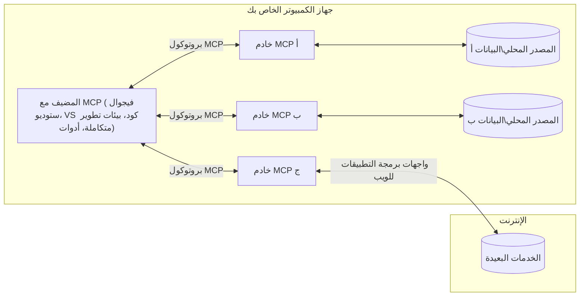

# مفاهيم أساسية في MCP: إتقان بروتوكول سياق النموذج لتكامل الذكاء الاصطناعي

[](https://youtu.be/earDzWGtE84)

_(انقر على الصورة أعلاه لمشاهدة فيديو هذا الدرس)_

[بروتوكول سياق النموذج (MCP)](https://github.com/modelcontextprotocol) هو إطار عمل قوي وموحد يعمل على تحسين الاتصال بين نماذج اللغة الكبيرة (LLMs) والأدوات الخارجية والتطبيقات ومصادر البيانات.
سيأخذك هذا الدليل عبر المفاهيم الأساسية لبروتوكول MCP. ستتعلم حول بنية العميل-الخادم، المكونات الأساسية، آليات الاتصال، وأفضل ممارسات التنفيذ.

- **موافقة المستخدم الصريحة**: يتطلب كل وصول إلى البيانات والعمليات موافقة صريحة من المستخدم قبل التنفيذ. يجب أن يفهم المستخدمون بوضوح البيانات التي سيتم الوصول إليها وما هي الإجراءات التي ستُجرى، مع تحكم دقيق في الأذونات والتصريحات.

- **حماية خصوصية البيانات**: لا يتم كشف بيانات المستخدم إلا بموافقة صريحة ويجب حمايتها بواسطة ضوابط وصول قوية طوال دورة التفاعل. يجب على التنفيذات منع نقل البيانات غير المصرح به والحفاظ على حدود خصوصية صارمة.

- **سلامة تنفيذ الأدوات**: يتطلب استدعاء كل أداة موافقة صريحة من المستخدم مع فهم واضح لوظيفة الأداة، معلماتها، وتأثيرها المحتمل. يجب أن تمنع حدود الأمان الصارمة تنفيذ الأدوات غير المقصود أو الغير آمن أو الخبيث.

- **أمان طبقة النقل**: يجب أن تستخدم جميع قنوات الاتصال آليات تشفير ومصادقة مناسبة. يجب تنفيذ بروتوكولات نقل آمنة وإدارة صحيحة للاعتمادات للاتصالات عن بعد.

#### إرشادات التنفيذ:

- **إدارة الأذونات**: نفذ أنظمة أذونات دقيقة تسمح للمستخدمين بالتحكم في الخوادم والأدوات والموارد التي يمكن الوصول إليها
- **المصادقة والتفويض**: استخدم طرق مصادقة آمنة (OAuth، مفاتيح API) مع إدارة صحيحة للرموز وانتهائها  
- **التحقق من الإدخال**: تحقق من جميع المعلمات وبيانات الإدخال وفق مخططات محددة لمنع هجمات الحقن
- **تسجيل التدقيق**: حافظ على سجلات شاملة لجميع العمليات للمراقبة الأمنية والامتثال

## نظرة عامة

يستعرض هذا الدرس البنية الأساسية والمكونات التي تشكل نظام بروتوكول سياق النموذج (MCP). ستتعرف على بنية العميل-الخادم، المكونات الرئيسية، وآليات الاتصال التي تدعم تفاعلات MCP.

## الأهداف التعليمية الرئيسية

بنهاية هذا الدرس، ستتمكن من:

- فهم بنية العميل-الخادم في MCP.
- تحديد الأدوار والمسؤوليات للمضيفين، العملاء، والخوادم.
- تحليل الخصائص الجوهرية التي تجعل MCP طبقة تكامل مرنة.
- معرفة كيف تتدفق المعلومات داخل نظام MCP.
- الحصول على رؤى عملية من خلال أمثلة برمجية في .NET وJava وPython وJavaScript.

## بنية MCP: نظرة معمقة

يُبنى نظام MCP على نموذج عميل-خادم. تسمح هذه البنية المكونية لتطبيقات الذكاء الاصطناعي بالتفاعل مع الأدوات، قواعد البيانات، واجهات برمجة التطبيقات، والموارد السياقية بكفاءة. دعونا نشرح هذه البنية إلى مكوناتها الأساسية.

في جوهره، يتبع MCP بنية عميل-خادم حيث يمكن لتطبيق مضيف الاتصال بعدة خوادم:



- **مضيفو MCP**: برامج مثل VSCode، Claude Desktop، بيئات التطوير المتكاملة (IDEs)، أو أدوات الذكاء الاصطناعي التي ترغب في الوصول إلى البيانات عبر MCP
- **عملاء MCP**: عملاء البروتوكول الذين يحافظون على اتصالات 1:1 مع الخوادم
- **خوادم MCP**: برامج خفيفة تعرض قدرات محددة من خلال بروتوكول سياق النموذج الموحد
- **مصادر البيانات المحلية**: ملفات الكمبيوتر الخاص بك، قواعد البيانات، والخدمات التي يمكن لخوادم MCP الوصول إليها بأمان
- **الخدمات البعيدة**: أنظمة خارجية متاحة عبر الإنترنت يمكن لخوادم MCP الاتصال بها عبر واجهات برمجة التطبيقات

بروتوكول MCP هو معيار متطور يستخدم الترقيم الزمني (بتنسيق YYYY-MM-DD). الإصدار الحالي من البروتوكول هو **2025-11-25**. يمكنك الاطلاع على آخر التحديثات في [مواصفات البروتوكول](https://modelcontextprotocol.io/specification/2025-11-25/)

> **نظرة مستقبلية:** تم الإعلان في مايو 2026 عن نسخة مرشحة للإصدار التالي من المواصفات، **2026-07-28**، والمقرر إصدارها في 28 يوليو 2026. هذا الإصدار يجعل البروتوكول بدون حالة في طبقة النقل (إزالة المصافحة `initialize` ومعرفات الجلسة)، ويؤسس إطارًا للامتدادات، ويتوقف عن استخدام الجذور والعينات والتسجيل لصالح أنماط أحدث. اطلع على [التغييرات في MCP: النسخة المرشحة لإصدار 2026-07-28](./mcp-2026-07-28-release-candidate.md) للحصول على شرح كامل.

### 1. المضيفون

في بروتوكول سياق النموذج (MCP)، **المضيفون** هم تطبيقات الذكاء الاصطناعي التي تعمل كواجهة رئيسية يتفاعل المستخدمون من خلالها مع البروتوكول. يدير المضيفون وينسقون الاتصالات مع عدة خوادم MCP عبر إنشاء عملاء MCP مخصصين لكل اتصال خادم. من أمثلة المضيفين:

- **تطبيقات الذكاء الاصطناعي**: مثل Claude Desktop، Visual Studio Code، Claude Code
- **بيئات التطوير**: IDEs ومحرري الأكواد المتكاملين مع MCP  
- **تطبيقات مخصصة**: وكلاء وأدوات الذكاء الاصطناعي المصممة خصيصًا

**المضيفون** هم تطبيقات تنسق التفاعلات مع نماذج الذكاء الاصطناعي. وهم:

- **تنسيق النماذج الذكية**: تشغيل أو التفاعل مع LLMs لتوليد الردود وتنظيم سير عمل الذكاء الاصطناعي
- **إدارة اتصالات العملاء**: إنشاء والحفاظ على عميل MCP واحد لكل اتصال خادم MCP
- **التحكم في واجهة المستخدم**: إدارة تدفق المحادثة، تفاعلات المستخدم، وعرض الردود  
- **فرض الأمن**: التحكم في الأذونات، القيود الأمنية، والمصادقة
- **التعامل مع موافقة المستخدم**: إدارة موافقة المستخدم على مشاركة البيانات وتنفيذ الأدوات


### 2. العملاء

**العملاء** هم مكونات أساسية تحتفظ باتصالات مخصصة من نوع واحد إلى واحد بين المضيفين وخوادم MCP. يتم إنشاء كل عميل MCP بواسطة المضيف للاتصال بخادم MCP محدد، مما يضمن قنوات اتصال منظمة وآمنة. يمكن أن يتيح وجود عدة عملاء للمضيف الاتصال بعدة خوادم في نفس الوقت.

**العملاء** هم مكونات ربط داخل تطبيق المضيف. وهم:

- **الاتصال بالبروتوكول**: إرسال طلبات JSON-RPC 2.0 إلى الخوادم مع الموجهات والتعليمات
- **تفاوض القدرات**: التفاوض على الميزات المدعومة وإصدارات البروتوكول مع الخوادم أثناء التهيئة
- **تنفيذ الأدوات**: إدارة طلبات تنفيذ الأدوات من النماذج ومعالجة الردود
- **التحديثات اللحظية**: التعامل مع الإشعارات والتحديثات المباشرة من الخوادم
- **معالجة الردود**: معالجة وتنسيق ردود الخوادم للعرض على المستخدمين

### 3. الخوادم

**الخوادم** هي البرامج التي توفر السياق، الأدوات، والقدرات لعملاء MCP. يمكن تنفيذها محليًا (على نفس جهاز المضيف) أو عن بُعد (على منصات خارجية)، وهي مسؤولة عن التعامل مع طلبات العملاء وتقديم ردود منظمة. تعرض الخوادم وظائف محددة من خلال بروتوكول سياق النموذج الموحد.

**الخوادم** هي خدمات توفر السياق والقدرات. وهي:

- **تسجيل الميزات**: تسجيل وعرض البدائيات المتاحة (موارد، موجهات، أدوات) للعملاء
- **معالجة الطلبات**: استقبال وتنفيذ استدعاءات الأدوات، طلبات الموارد، وطلبات الموجهات من العملاء
- **توفير السياق**: تقديم المعلومات والبيانات السياقية لتعزيز ردود النموذج
- **إدارة الحالة**: الحفاظ على حالة الجلسة والتعامل مع التفاعلات القائمة على الحالة عند الحاجة
- **الإشعارات اللحظية**: إرسال إشعارات حول تغييرات القدرات والتحديثات إلى العملاء المتصلين

يمكن لأي شخص تطوير خوادم لتوسيع قدرات النموذج بوظائف متخصصة، وتدعم كل من سيناريوهات النشر المحلية والبعيدة.

### 4. بدائيات الخادم

تقدم خوادم بروتوكول سياق النموذج (MCP) ثلاث **بدائيات** أساسية تحدد اللبنات الأساسية للتفاعلات الغنية بين العملاء، المضيفين، ونماذج اللغة. تحدد هذه البدائيات أنواع المعلومات السياقية والإجراءات المتاحة عبر البروتوكول.

يمكن لخوادم MCP عرض أي مجموعة من البدائيات الأساسية الثلاث التالية:

#### الموارد 

**الموارد** هي مصادر بيانات توفر معلومات سياقية لتطبيقات الذكاء الاصطناعي. تمثل محتوى ثابتًا أو ديناميكيًا يمكن أن يعزز فهم النموذج واتخاذ القرار:

- **البيانات السياقية**: معلومات منظمة وسياق لاستهلاك نموذج الذكاء الاصطناعي
- **قواعد المعرفة**: مستودعات الوثائق، المقالات، الأدلة، وأوراق البحث
- **مصادر البيانات المحلية**: ملفات، قواعد بيانات، ومعلومات النظام المحلي  
- **البيانات الخارجية**: ردود API، خدمات الويب، وبيانات الأنظمة البعيدة
- **المحتوى الديناميكي**: البيانات اللحظية التي تتحدث بناءً على الظروف الخارجية

يتم تعريف الموارد بواسطة معرفات URI وتدعم الاكتشاف عبر طرق `resources/list` والاسترجاع عبر `resources/read`:

```text
file://documents/project-spec.md
database://production/users/schema
api://weather/current
```

#### الموجهات

**الموجهات** هي قوالب قابلة لإعادة الاستخدام تساعد في هيكلة التفاعلات مع نماذج اللغة. توفر أنماط تفاعل موحدة وتسلسلات عمل قالبية:

- **تفاعلات معتمدة على القوالب**: رسائل مهيكلة مسبقًا وبادئات محادثة
- **قوالب سير العمل**: تسلسلات موحدة للمهام والتفاعلات الشائعة
- **أمثلة قليلة الطلقات**: قوالب قائمة على أمثلة لتوجيه النموذج
- **موجهات النظام**: موجهات أساسية تحدد سلوك النموذج والسياق
- **قوالب ديناميكية**: موجهات مع معاملات تتكيف مع سياقات محددة

تدعم الموجهات تبديل المتغيرات ويمكن اكتشافها عبر `prompts/list` واسترجاعها باستخدام `prompts/get`:

```markdown
Generate a {{task_type}} for {{product}} targeting {{audience}} with the following requirements: {{requirements}}
```

#### الأدوات

**الأدوات** هي وظائف قابلة للتنفيذ يمكن لنماذج الذكاء الاصطناعي استدعاؤها لأداء إجراءات محددة. تمثل "الأفعال" في نظام MCP، مما يتيح للنماذج التفاعل مع الأنظمة الخارجية:

- **وظائف قابلة للتنفيذ**: عمليات منفصلة يمكن للنماذج استدعاؤها مع معلمات محددة
- **تكامل النظام الخارجي**: استدعاءات API، استعلامات قاعدة البيانات، عمليات الملفات، الحسابات
- **هوية فريدة**: لكل أداة اسم ووصف ومخطط معلمات مميز
- **إدخال/إخراج منظم**: تقبل الأدوات معلمات تم التحقق منها وتُعيد ردود منظمة ومصنفة
- **قدرات الفعل**: تمكّن النماذج من أداء إجراءات العالم الحقيقي واسترجاع البيانات الحية

تُعرف الأدوات باستخدام JSON Schema للتحقق من المعلمات ويتم اكتشافها من خلال `tools/list` وتنفيذها عبر `tools/call`. يمكن أن تتضمن الأدوات أيضًا **أيقونات** كبيانات وصفية إضافية لتحسين عرض واجهة المستخدم.

**تعليقات الأدوات**: تدعم الأدوات تعليقات سلوكية (مثل `readOnlyHint`، `destructiveHint`) تصف ما إذا كانت الأداة للقراءة فقط أو مدمرة، مما يساعد العملاء على اتخاذ قرارات مستنيرة بشأن تنفيذ الأداة.

مثال على تعريف أداة:

```typescript
server.tool(
  "search_products", 
  {
    query: z.string().describe("Search query for products"),
    category: z.string().optional().describe("Product category filter"),
    max_results: z.number().default(10).describe("Maximum results to return")
  }, 
  async (params) => {
    // تنفيذ البحث وإرجاع النتائج المنظمة
    return await productService.search(params);
  }
);
```

## بدائيات العميل

في بروتوكول سياق النموذج (MCP)، يمكن **للعملاء** عرض بدائيات تمكن الخوادم من طلب قدرات إضافية من تطبيق المضيف. تسمح هذه البدائيات الجانبية للعميل بتنفيذ خوادم أكثر تفاعلية يمكنها الوصول إلى قدرات نموذج الذكاء الاصطناعي وتفاعلات المستخدم.

### التعيين العيني

> **إشعار التوقف:** تشير النسخة المرشحة لإصدار `2026-07-28` إلى أن التعيين العيني (Sampling) موقوف لصالح التكامل المباشر مع واجهات مقدمي LLM. سيظل يعمل في `2025-11-25` ولمدة سنة على الأقل بعد أي توقف، لكن التصاميم الجديدة ينبغي أن تفضل نمط الاستبدال. انظر [التغييرات في MCP: النسخة المرشحة لإصدار 2026-07-28](./mcp-2026-07-28-release-candidate.md).

يتيح التعيين العيني للخوادم طلب إكمالات نموذج اللغة من تطبيق الذكاء الاصطناعي الخاص بالعميل. تُمكن هذه البدائية الخوادم من الوصول إلى قدرات LLM دون تضمين تبعيات النموذج الخاصة بهم:

- **الوصول المستقل عن النموذج**: يمكن للخوادم طلب الإكمالات دون الحاجة إلى تضمين SDKs أو إدارة الوصول للنموذج
- **الذكاء الاصطناعي المُفتعل من الخادم**: يتيح للخوادم توليد المحتوى بشكل مستقل باستخدام نموذج الذكاء الاصطناعي للعميل
- **تفاعلات LLM التكرارية**: يدعم السيناريوهات المعقدة التي يحتاج فيها الخادم لمساعدة الذكاء الاصطناعي للمعالجة
- **توليد محتوى ديناميكي**: يسمح للخوادم بإنشاء ردود سياقية باستخدام نموذج المضيف
- **دعم استدعاء الأدوات**: يمكن للخوادم تضمين معلمات `tools` و`toolChoice` لتمكين نموذج العميل من استدعاء الأدوات أثناء التعيين العيني

يتم بدء التعيين العيني عبر طريقة `sampling/complete` حيث ترسل الخوادم طلبات الإكمال إلى العملاء.

### الجذور

> **إشعار التوقف:** تشير النسخة المرشحة لإصدار `2026-07-28` إلى أن الجذور (Roots) موقوفة لصالح معلمات الأدوات، URI الموارد، أو تهيئة الخادم. سيظل يعمل في `2025-11-25` ولمدة سنة على الأقل بعد أي توقف. انظر [التغييرات في MCP: النسخة المرشحة لإصدار 2026-07-28](./mcp-2026-07-28-release-candidate.md).

توفر الجذور طريقة موحدة للعملاء لعرض حدود نظام الملفات على الخوادم، مما يساعد الخوادم على فهم الدلائل والملفات التي يمكنها الوصول إليها:

- **حدود نظام الملفات**: تعريف حدود أماكن تشغيل الخوادم ضمن نظام الملفات
- **التحكم في الوصول**: مساعدة الخوادم لفهم الدلائل والملفات المصرح لها بالوصول
- **تحديثات ديناميكية**: يمكن للعملاء إعلام الخوادم عند تغيير قائمة الجذور
- **التعريف بالمعرف URI**: تستخدم الجذور معرفات `file://` لتعريف الدلائل والملفات التي يمكن الوصول إليها

يتم اكتشاف الجذور عبر طريقة `roots/list`، مع إرسال العملاء لـ `notifications/roots/list_changed` عند أي تغيير في الجذور.

### الاستيضاح  

يتيح الاستيضاح للخوادم طلب معلومات إضافية أو تأكيد من المستخدمين عبر واجهة العميل:

- **طلبات إدخال المستخدم**: يمكن للخوادم طلب معلومات إضافية عند الحاجة لتنفيذ الأدوات
- **حوارات التأكيد**: طلب موافقة المستخدم على العمليات الحساسة أو ذات التأثير الكبير
- **سير عمل تفاعلي**: تمكين الخوادم من إنشاء تفاعلات خطوة بخطوة مع المستخدم
- **جمع المعلمات الديناميكي**: جمع المعلمات الناقصة أو الاختيارية أثناء تنفيذ الأدوات

يتم إجراء طلبات الاستيضاح باستخدام طريقة `elicitation/request` لجمع بيانات المستخدم من خلال واجهة العميل.

**وضع الاستيضاح بواسطة URL**: يمكن للخوادم أيضًا طلب تفاعلات المستخدم المبنية على URL، مما يسمح بإعادة توجيه المستخدم لصفحات ويب خارجية لأغراض المصادقة، التأكيد، أو إدخال البيانات.

### التسجيل


> **إشعار إلغاء الدعم:** يشير الإصدار المرشح `2026-07-28` إلى إلغاء دعم التسجيل Logging لصالح `stderr` لنقل stdio وOpenTelemetry للمراقبة الهيكلية. لا يزال يعمل في `2025-11-25` ولمدة سنة على الأقل بعد أي إلغاء دعم. راجع [ما الجديد في MCP: الإصدار المرشح 2026-07-28](./mcp-2026-07-28-release-candidate.md).

**التسجيل** يتيح للخوادم إرسال رسائل سجل منسقة إلى العملاء لأغراض التصحيح والمراقبة والرؤية التشغيلية:

- **دعم التصحيح**: تمكين الخوادم من توفير سجلات تنفيذ مفصلة لاستكشاف الأخطاء وإصلاحها
- **المراقبة التشغيلية**: إرسال تحديثات الحالة ومقاييس الأداء إلى العملاء
- **الإبلاغ عن الأخطاء**: تقديم سياق تفصيلي للأخطاء ومعلومات تشخيصية
- **سجلات التدقيق**: إنشاء سجلات شاملة لعمليات وقرارات الخادم

تُرسل رسائل التسجيل إلى العملاء لتوفير الشفافية حول عمليات الخادم وتسهيل التصحيح.

## تدفق المعلومات في MCP

يعرف بروتوكول سياق النموذج (MCP) تدفقًا منظمًا للمعلومات بين المضيفين والعملاء والخوادم والنماذج. فهم هذا التدفق يساعد على توضيح كيفية معالجة طلبات المستخدم وكيفية دمج الأدوات والبيانات الخارجية في استجابات النموذج.

- **المضيف يبدأ الاتصال**  
  تطبيق المضيف (مثل IDE أو واجهة الدردشة) يقيم اتصالًا مع خادم MCP، عادة عبر STDIO أو WebSocket أو طريقة نقل مدعومة أخرى.

- **التفاوض على القدرات**  
  يتبادل العميل (المضمّن في المضيف) والخادم معلومات حول الميزات المدعومة، الأدوات، الموارد، وإصدارات البروتوكول. هذا يضمن فهم الطرفين للقدرات المتاحة للجلسة.

- **طلب المستخدم**  
  يتفاعل المستخدم مع المضيف (مثلاً إدخال مطالبة أو أمر). يقوم المضيف بجمع هذا الإدخال وتمريره إلى العميل لمعالجته.

- **استخدام الموارد أو الأدوات**  
  - قد يطلب العميل سياقًا إضافيًا أو موارد من الخادم (مثل الملفات، سجلات قاعدة البيانات، أو مقالات قاعدة المعرفة) لتعزيز فهم النموذج.
  - إذا قرر النموذج أن أداة مطلوبة (مثلاً لجلب بيانات، إجراء حساب، أو استدعاء API)، يرسل العميل طلب استدعاء الأداة إلى الخادم، محددًا اسم الأداة والمعلمات.

- **تنفيذ الخادم**  
  يستلم الخادم طلب المورد أو الأداة، ينفذ العمليات اللازمة (مثل تشغيل دالة، استعلام قاعدة بيانات، أو استرجاع ملف)، ويرجع النتائج إلى العميل بصيغة منظمة.

- **توليد الاستجابة**  
  يدمج العميل استجابات الخادم (بيانات المورد، مخرجات الأدوات، إلخ) في التفاعل المستمر مع النموذج. يستخدم النموذج هذه المعلومات لتوليد استجابة شاملة وذات صلة بالسياق.

- **عرض النتائج**  
  يستلم المضيف الناتج النهائي من العميل ويعرضه للمستخدم، غالبًا مشمولًا نص النموذج الناتج وأي نتائج من تنفيذ الأدوات أو بحث الموارد.

هذا التدفق يتيح لـ MCP دعم تطبيقات ذكاء اصطناعي متقدمة وتفاعلية وواعية للسياق من خلال ربط النماذج بسلاسة مع الأدوات والبيانات الخارجية.

## هيكلية البروتوكول والطبقات

يتكون MCP من طبقتين معماريتين متميزتين تعملان معًا لتوفير إطار تواصل كامل:

### طبقة البيانات

تنفذ **طبقة البيانات** بروتوكول MCP الأساسي باستخدام **JSON-RPC 2.0** كأساس لها. تعرف هذه الطبقة بنية الرسائل والدلالات وأنماط التفاعل:

#### المكونات الأساسية:

- **بروتوكول JSON-RPC 2.0**: يستخدم جميع الاتصالات صيغة رسائل JSON-RPC 2.0 الموحدة للمكالمات، الاستجابات، والإشعارات
- **إدارة دورة الحياة**: يدير تهيئة الاتصال، التفاوض على القدرات، وإنهاء الجلسات بين العملاء والخوادم
- **وظائف الخادم الأساسية**: يتيح للخوادم تقديم وظائف أساسية عبر الأدوات، الموارد، والمطالبات
- **وظائف العميل الأساسية**: تمكن الخوادم من طلب العينات من نماذج اللغة الكبيرة، استدعاء مدخلات المستخدم، وإرسال رسائل السجل
- **الإشعارات في الوقت الحقيقي**: يدعم الإشعارات غير المتزامنة للتحديثات الديناميكية بدون استبيان مستمر

#### الميزات الرئيسية:

- **التفاوض على إصدار البروتوكول**: يستخدم ترقيم الإصدارات المستند إلى التاريخ (YYYY-MM-DD) لضمان التوافق
- **اكتشاف القدرات**: يتبادل العملاء والخوادم معلومات الميزات المدعومة خلال التهيئة
- **جلسات حالة متسلسلة**: يحافظ على حالة الاتصال عبر عدة تفاعلات لاستمرارية السياق

### طبقة النقل

تدير **طبقة النقل** قنوات الاتصال، تأطير الرسائل، والمصادقة بين المشاركين في MCP:

#### آليات النقل المدعومة:

1. **نقل STDIO**:
   - يستخدم تدفقات الإدخال/الإخراج القياسية للتواصل المباشر بين العمليات
   - مثالي للعمليات المحلية على نفس الجهاز بدون حمل إضافي على الشبكة
   - شائع الاستخدام لتطبيقات خادم MCP المحلية

2. **نقل HTTP القابل للبث**:
   - يستخدم HTTP POST لرسائل العميل إلى الخادم  
   - دعم اختياري للأحداث التي يرسلها الخادم (SSE) للبث من الخادم إلى العميل
   - يمكن الاتصال بالخادم عن بعد عبر الشبكات
   - يدعم المصادقة القياسية في HTTP (رموز الحامل، مفاتيح API، رؤوس مخصصة)
   - توصي MCP باستخدام OAuth للمصادقة الآمنة المعتمدة على الرموز

#### تجريد النقل:

تجرد طبقة النقل تفاصيل الاتصال عن طبقة البيانات، مما يمكن استخدام نفس صيغة رسالة JSON-RPC 2.0 عبر جميع آليات النقل. يسمح هذا التجريد للتطبيقات بالتبديل بسلاسة بين الخوادم المحلية والبعيدة.

### اعتبارات الأمان

يجب على تطبيقات MCP الالتزام بعدة مبادئ أمنية هامة لضمان التفاعلات الآمنة والموثوقة عبر جميع عمليات البروتوكول:

- **موافقة المستخدم والتحكم**: يجب أن يقدم المستخدمون موافقة صريحة قبل الوصول إلى أي بيانات أو تنفيذ أي عمليات. يجب أن يكون لديهم تحكم واضح في البيانات التي تتم مشاركتها والإجراءات المسموح بها، مدعومة بواجهات مستخدم بديهية لمراجعة واعتماد الأنشطة.

- **سرية البيانات**: يجب الكشف عن بيانات المستخدم فقط بعد موافقة صريحة ويجب حمايتها بضوابط وصول مناسبة. يجب على تنفيذات MCP حماية البيانات من النقل غير المصرح به وضمان الحفاظ على الخصوصية في جميع التفاعلات.

- **أمان الأدوات**: قبل استدعاء أي أداة، يلزم الحصول على موافقة المستخدم الصريحة. يجب أن يكون لدى المستخدمين فهم واضح لوظيفة كل أداة، ويجب فرض حدود أمنية قوية لمنع تنفيذ الأدوات بشكل غير مقصود أو غير آمن.

من خلال اتباع هذه المبادئ الأمنية، يضمن MCP الحفاظ على ثقة المستخدم وخصوصيته وسلامته عبر جميع تفاعلات البروتوكول مع تمكين تكاملات AI قوية.

## أمثلة على الكود: المكونات الرئيسية

فيما يلي أمثلة كود بعدة لغات برمجة شائعة توضح كيفية تنفيذ مكونات الخادم الرئيسية والأدوات في MCP.

### مثال .NET: إنشاء خادم MCP بسيط مع أدوات

هنا مثال عملي في .NET يوضح كيفية تنفيذ خادم MCP بسيط مع أدوات مخصصة. يعرض هذا المثال كيفية تعريف وتسجيل الأدوات، معالجة الطلبات، وربط الخادم باستخدام بروتوكول سياق النموذج.

```csharp
using System;
using System.Threading.Tasks;
using ModelContextProtocol.Server;
using ModelContextProtocol.Server.Transport;
using ModelContextProtocol.Server.Tools;

public class WeatherServer
{
    public static async Task Main(string[] args)
    {
        // Create an MCP server
        var server = new McpServer(
            name: "Weather MCP Server",
            version: "1.0.0"
        );
        
        // Register our custom weather tool
        server.AddTool<string, WeatherData>("weatherTool", 
            description: "Gets current weather for a location",
            execute: async (location) => {
                // Call weather API (simplified)
                var weatherData = await GetWeatherDataAsync(location);
                return weatherData;
            });
        
        // Connect the server using stdio transport
        var transport = new StdioServerTransport();
        await server.ConnectAsync(transport);
        
        Console.WriteLine("Weather MCP Server started");
        
        // Keep the server running until process is terminated
        await Task.Delay(-1);
    }
    
    private static async Task<WeatherData> GetWeatherDataAsync(string location)
    {
        // This would normally call a weather API
        // Simplified for demonstration
        await Task.Delay(100); // Simulate API call
        return new WeatherData { 
            Temperature = 72.5,
            Conditions = "Sunny",
            Location = location
        };
    }
}

public class WeatherData
{
    public double Temperature { get; set; }
    public string Conditions { get; set; }
    public string Location { get; set; }
}
```

### مثال Java: مكونات خادم MCP

يوضح هذا المثال نفس خادم MCP وتسجيل الأدوات كما في مثال .NET أعلاه، لكنه منفذ بلغة Java.

```java
import io.modelcontextprotocol.server.McpServer;
import io.modelcontextprotocol.server.McpToolDefinition;
import io.modelcontextprotocol.server.transport.StdioServerTransport;
import io.modelcontextprotocol.server.tool.ToolExecutionContext;
import io.modelcontextprotocol.server.tool.ToolResponse;

public class WeatherMcpServer {
    public static void main(String[] args) throws Exception {
        // إنشاء خادم MCP
        McpServer server = McpServer.builder()
            .name("Weather MCP Server")
            .version("1.0.0")
            .build();
            
        // تسجيل أداة الطقس
        server.registerTool(McpToolDefinition.builder("weatherTool")
            .description("Gets current weather for a location")
            .parameter("location", String.class)
            .execute((ToolExecutionContext ctx) -> {
                String location = ctx.getParameter("location", String.class);
                
                // الحصول على بيانات الطقس (مبسط)
                WeatherData data = getWeatherData(location);
                
                // إرجاع الرد بالتنسيق
                return ToolResponse.content(
                    String.format("Temperature: %.1f°F, Conditions: %s, Location: %s", 
                    data.getTemperature(), 
                    data.getConditions(), 
                    data.getLocation())
                );
            })
            .build());
        
        // ربط الخادم باستخدام نقل stdio
        try (StdioServerTransport transport = new StdioServerTransport()) {
            server.connect(transport);
            System.out.println("Weather MCP Server started");
            // إبقاء الخادم قيد التشغيل حتى يتم إنهاء العملية
            Thread.currentThread().join();
        }
    }
    
    private static WeatherData getWeatherData(String location) {
        // التنفيذ سيستدعي واجهة برمجة تطبيقات الطقس
        // مبسط لأغراض المثال
        return new WeatherData(72.5, "Sunny", location);
    }
}

class WeatherData {
    private double temperature;
    private String conditions;
    private String location;
    
    public WeatherData(double temperature, String conditions, String location) {
        this.temperature = temperature;
        this.conditions = conditions;
        this.location = location;
    }
    
    public double getTemperature() {
        return temperature;
    }
    
    public String getConditions() {
        return conditions;
    }
    
    public String getLocation() {
        return location;
    }
}
```

### مثال Python: بناء خادم MCP

يستخدم هذا المثال fastmcp، لذا يُرجى التأكد من تثبيته أولاً:

```python
pip install fastmcp
```
Code Sample:

```python
#!/usr/bin/env python3
import asyncio
from fastmcp import FastMCP
from fastmcp.transports.stdio import serve_stdio

# إنشاء خادم FastMCP
mcp = FastMCP(
    name="Weather MCP Server",
    version="1.0.0"
)

@mcp.tool()
def get_weather(location: str) -> dict:
    """Gets current weather for a location."""
    return {
        "temperature": 72.5,
        "conditions": "Sunny",
        "location": location
    }

# نهج بديل باستخدام فئة
class WeatherTools:
    @mcp.tool()
    def forecast(self, location: str, days: int = 1) -> dict:
        """Gets weather forecast for a location for the specified number of days."""
        return {
            "location": location,
            "forecast": [
                {"day": i+1, "temperature": 70 + i, "conditions": "Partly Cloudy"}
                for i in range(days)
            ]
        }

# تسجيل أدوات الفئة
weather_tools = WeatherTools()

# بدء الخادم
if __name__ == "__main__":
    asyncio.run(serve_stdio(mcp))
```

### مثال JavaScript: إنشاء خادم MCP

يوضح هذا المثال إنشاء خادم MCP في JavaScript وكيفية تسجيل أداتين متعلقتين بالطقس.

```javascript
// استخدام حزمة تطوير برمجيات بروتوكول سياق النموذج الرسمي
import { McpServer } from "@modelcontextprotocol/sdk/server/mcp.js";
import { StdioServerTransport } from "@modelcontextprotocol/sdk/server/stdio.js";
import { z } from "zod"; // للتحقق من صحة المعلمات

// إنشاء خادم MCP
const server = new McpServer({
  name: "Weather MCP Server",
  version: "1.0.0"
});

// تعريف أداة الطقس
server.tool(
  "weatherTool",
  {
    location: z.string().describe("The location to get weather for")
  },
  async ({ location }) => {
    // هذا عادةً يستدعي واجهة برمجة تطبيقات الطقس
    // مبسط لغايات العرض
    const weatherData = await getWeatherData(location);
    
    return {
      content: [
        { 
          type: "text", 
          text: `Temperature: ${weatherData.temperature}°F, Conditions: ${weatherData.conditions}, Location: ${weatherData.location}` 
        }
      ]
    };
  }
);

// تعريف أداة التوقعات
server.tool(
  "forecastTool",
  {
    location: z.string(),
    days: z.number().default(3).describe("Number of days for forecast")
  },
  async ({ location, days }) => {
    // هذا عادةً يستدعي واجهة برمجة تطبيقات الطقس
    // مبسط لغايات العرض
    const forecast = await getForecastData(location, days);
    
    return {
      content: [
        { 
          type: "text", 
          text: `${days}-day forecast for ${location}: ${JSON.stringify(forecast)}` 
        }
      ]
    };
  }
);

// دوال المساعدة
async function getWeatherData(location) {
  // محاكاة استدعاء واجهة برمجة التطبيقات
  return {
    temperature: 72.5,
    conditions: "Sunny",
    location: location
  };
}

async function getForecastData(location, days) {
  // محاكاة استدعاء واجهة برمجة التطبيقات
  return Array.from({ length: days }, (_, i) => ({
    day: i + 1,
    temperature: 70 + Math.floor(Math.random() * 10),
    conditions: i % 2 === 0 ? "Sunny" : "Partly Cloudy"
  }));
}

// ربط الخادم باستخدام النقل عبر stdio
const transport = new StdioServerTransport();
server.connect(transport).catch(console.error);

console.log("Weather MCP Server started");
```

يوضح هذا المثال في JavaScript كيفية إنشاء خادم MCP باستخدام SDK الخاص ببروتوكول سياق النموذج. يبين كيفية تسجيل أداتين باسمَي `weatherTool` و `forecastTool` وجعلهما متاحتين لعملاء MCP عبر `StdioServerTransport`.

## الأمن والتفويض

يتضمّن MCP عدة مفاهيم وآليات مدمجة لإدارة الأمن والتفويض خلال البروتوكول:

1. **التحكم بإذن الأداة**:  
  يمكن للعملاء تحديد الأدوات التي يسمح للنموذج باستخدامها في جلسة معينة. هذا يضمن الوصول فقط إلى الأدوات المصرح بها صراحةً، مما يقلل مخاطر العمليات غير المقصودة أو غير الآمنة. يمكن تكوين الأذونات ديناميكيًا استنادًا إلى تفضيلات المستخدم، سياسات المؤسسة، أو سياق التفاعل.

2. **المصادقة**:  
  يمكن للخوادم طلب المصادقة قبل منح الوصول للأدوات، الموارد، أو العمليات الحساسة. قد يشمل ذلك مفاتيح API، رموز OAuth، أو أنظمة مصادقة أخرى. تضمن المصادقة الصحيحة أن العملاء والمستخدمين الموثوقين فقط يمكنهم استدعاء قدرات الخادم.

3. **التحقق**:  
  يتم فرض التحقق من المعلمات لكل استدعاء أداة. تعرف كل أداة أنواع، تنسيقات، وحدود معايير المعلمات المتوقعة، ويقوم الخادم بالتحقق من الطلبات الواردة وفقًا لذلك. يمنع هذا إدخالًا مشوهًا أو خبيثًا يصل إلى تنفيذات الأدوات ويساعد في الحفاظ على سلامة العمليات.

4. **تحديد المعدل**:  
  لمنع الإساءة وضمان استخدام عادل لموارد الخادم، يمكن لخوادم MCP تنفيذ تحديد معدلات لاستدعاءات الأدوات والوصول إلى الموارد. يمكن تطبيق حدود المعدل لكل مستخدم، أو لكل جلسة، أو على مستوى عالمي، وتساعد في الحماية ضد هجمات حجب الخدمة أو استهلاك موارد مفرط.

من خلال دمج هذه الآليات، يوفر MCP أساسًا آمنًا لدمج نماذج اللغة مع الأدوات والبيانات الخارجية، مع منح المستخدمين والمطورين تحكمًا دقيقًا في الوصول والاستخدام.

## رسائل البروتوكول وتدفق الاتصالات

يستخدم MCP رسائل منظمة بصيغة **JSON-RPC 2.0** لتسهيل التفاعلات الواضحة والموثوقة بين المضيفين والعملاء والخوادم. يعرف البروتوكول أنماط رسائل محددة لأنواع مختلفة من العمليات:

### أنواع الرسائل الأساسية:

#### **رسائل التهيئة**
- **طلب `initialize`**: يؤسس الاتصال ويتفاوض على إصدار البروتوكول والقدرات
- **استجابة `initialize`**: يؤكد الميزات المدعومة ومعلومات الخادم  
- **`notifications/initialized`**: يشير إلى إتمام التهيئة وجاهزية الجلسة

#### **رسائل الاكتشاف**
- **طلب `tools/list`**: يكتشف الأدوات المتاحة من الخادم
- **طلب `resources/list`**: يسرد الموارد المتاحة (مصادر البيانات)
- **طلب `prompts/list`**: يسترجع قوالب المطالبات المتاحة

#### **رسائل التنفيذ**  
- **طلب `tools/call`**: ينفذ أداة محددة بالمعلمات المقدمة
- **طلب `resources/read`**: يسترجع محتوى من مورد محدد
- **طلب `prompts/get`**: يجلب قالب مطالبة مع معلمات اختيارية

#### **رسائل جانب العميل**
- **طلب `sampling/complete`**: يطلب الخادم إكمال نموذج اللغة من العميل
- **`elicitation/request`**: يطلب الخادم إدخال المستخدم عبر واجهة العميل
- **رسائل التسجيل**: يرسل الخادم رسائل سجل منظمة إلى العميل

#### **رسائل الإعلام**
- **`notifications/tools/list_changed`**: يخطر الخادم العميل بتغييرات الأدوات
- **`notifications/resources/list_changed`**: يخطر الخادم العميل بتغييرات الموارد  
- **`notifications/prompts/list_changed`**: يخطر الخادم العميل بتغييرات القوالب

### هيكل الرسالة:

تتبع جميع رسائل MCP صيغة JSON-RPC 2.0 مع:
- **رسائل الطلب**: تتضمن `id`، `method`، و`params` اختيارية
- **رسائل الاستجابة**: تتضمن `id` وإما `result` أو `error`  
- **رسائل الإعلام**: تتضمن `method` و`params` اختيارية (لا تحتوي على `id` أو استجابة متوقعة)

يضمن هذا الاتصال المنظم تفاعلات موثوقة، قابلة للتتبع، وقابلة للتوسعة تدعم سيناريوهات متقدمة مثل التحديثات في الوقت الحقيقي، تسلسل الأدوات، والتعامل القوي مع الأخطاء.

### المهام (تجريبية)

> **نظرة مستقبلية:** يتخرج الإصدار المرشح `2026-07-28` من المهام من المواصفة الأساسية التجريبية إلى امتداد مهام مخصص مع دورة حياة معاد تصميمها (`tasks/get`، `tasks/update`، `tasks/cancel`؛ تمت إزالة `tasks/list`). إذا بنيت استنادًا إلى واجهة برمجة التطبيقات التجريبية الموضحة أدناه، خطط للترحيل. راجع [ما الجديد في MCP: الإصدار المرشح 2026-07-28](./mcp-2026-07-28-release-candidate.md).

**المهام** هي ميزة تجريبية تقدم أطر تنفيذ دائمة تمكن من استرجاع النتائج المؤجلة وتتبع الحالة لطلبات MCP:

- **العمليات طويلة الأمد**: تتبع العمليات المكلفة، أتمتة تدفقات العمل، والمعالجة الدُفعات
- **النتائج المؤجلة**: الاستطلاع عن حالة المهمة واسترجاع النتائج عند اكتمال العمليات
- **تتبع الحالة**: مراقبة تقدم المهمة عبر حالات دورة حياة محددة
- **العمليات متعددة الخطوات**: دعم تدفقات العمل المعقدة التي تمتد عبر عدة تفاعلات

تغلف المهام طلبات MCP القياسية لتمكين أنماط تنفيذ غير متزامنة للعمليات التي لا يمكن إتمامها فورًا.

## النقاط الرئيسية

- **الهندسة المعمارية**: يستخدم MCP هندسة عميل-خادم حيث يدير المضيفون اتصالات متعددة مع الخوادم
- **المشاركون**: يشمل النظام البيئي المضيفين (تطبيقات AI)، العملاء (موصلات البروتوكول)، والخوادم (مزودات القدرات)
- **آليات النقل**: يدعم التواصل STDIO (محلي) وHTTP القابل للبث مع SSE اختياري (عن بعد)
- **الوظائف الأساسية**: تكشف الخوادم عن أدوات (دوال قابلة للتنفيذ)، موارد (مصادر بيانات)، ومطالبات (قوالب)
- **وظائف العميل الأساسية**: يمكن للخوادم طلب العينات (استكمالات LLM مع دعم استدعاء الأدوات)، الاستدعاء (إدخال المستخدم بما في ذلك وضع URL)، الجذور (حدود نظام الملفات)، وتسجيل السجلات من العملاء
- **ميزات تجريبية**: تقدم المهام أطر تنفيذ دائمة للعمليات طويلة الأمد
- **أساس البروتوكول**: مبني على JSON-RPC 2.0 مع ترقيم الإصدارات المستند إلى التاريخ (الحالي: 2025-11-25)
- **القدرات الوقت الحقيقي**: يدعم الإشعارات للتحديثات الديناميكية والمزامنة في الوقت الحقيقي
- **الأمان أولاً**: موافقة المستخدم الصريحة، حماية خصوصية البيانات، ونقل آمن هي متطلبات أساسية

## تمرين

صمّم أداة MCP بسيطة ستكون مفيدة في مجالك. حدد:
1. ما اسم الأداة
2. ما المعلمات التي ستقبلها
3. ما المخرجات التي سترجعها
4. كيف قد يستخدم النموذج هذه الأداة لحل مشكلات المستخدم


---

## ما التالي

التالي: [الفصل 2: الأمان](../02-Security/README.md)


هل تتساءل عما سيحدث بعد `2025-11-25`؟ اقرأ [ما الجديد في MCP: إصدار المرشح 2026-07-28](./mcp-2026-07-28-release-candidate.md).

---

<!-- CO-OP TRANSLATOR DISCLAIMER START -->
**تنويه**:
تمت ترجمة هذا المستند باستخدام خدمة الترجمة بالذكاء الاصطناعي [Co-op Translator](https://github.com/Azure/co-op-translator). بينما نسعى للدقة، يرجى العلم أن الترجمات الآلية قد تحتوي على أخطاء أو عدم دقة. يجب اعتبار المستند الأصلي بلغته الأصلية المصدر الرسمي والمعتمد. للمعلومات الهامة، يُنصح بالاستعانة بترجمة بشرية محترفة. نحن غير مسؤولين عن أي سوء فهم أو تفسير ناتج عن استخدام هذه الترجمة.
<!-- CO-OP TRANSLATOR DISCLAIMER END -->