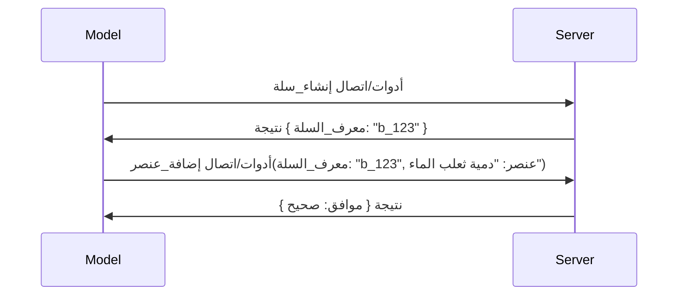

# ما الذي يتغير في MCP: مرشح الإصدار 2026-07-28

> **الحالة:** مرشح الإصدار. مواصفة `2026-07-28` ليست نهائية وقت كتابة هذه السطور. تم الإعلان عنها في 21 مايو 2026، ومن المقرر إصدارها في 28 يوليو 2026. كل شيء في هذا الدرس يصف مرشح الإصدار؛ تحقق من [مسودة المواصفة](https://modelcontextprotocol.io/specification/draft) و[سجل التغييرات](https://modelcontextprotocol.io/specification/draft/changelog) للحصول على أحدث حالة قبل أن تبني ضدها. بقية هذا المنهج مكتوبة ضد الإصدار المستقر الحالي، **مواصفة MCP 2025-11-25**، وسيتم تحديثها بمجرد إصدار `2026-07-28`.

## نظرة عامة

`2026-07-28` هو أكبر تعديل في MCP منذ إطلاقه. ستة مقترحات لتعزيز المواصفة (SEPs) تلغي جلسات البروتوكول وتجعل MCP عديم الحالة في طبقة النقل، كما تصبح الإضافات آلية من الدرجة الأولى، ومُرقّمة بالإصدار، وتم وضع عدة ميزات تعلمتها سابقًا في هذا المنهج (Roots وSampling وLogging) تحت علامة مهجورة بموجب سياسة دورة حياة جديدة. يلخص هذا الدرس ما يتغير، ولماذا يهم، وماذا يعني للكود الذي كتبته بالفعل ضد `2025-11-25`.

المصدر: [مرشح إصدار مواصفة MCP 2026-07-28](https://blog.modelcontextprotocol.io/posts/2026-07-28-release-candidate/) (مدونة Model Context Protocol، ديفيد سوريا بارا ودين ديلمارسكي).

## أهداف التعلم

بنهاية هذا الدرس، ستكون قادرًا على:

- شرح سبب انتقال MCP إلى نواة بروتوكول عديم الحالة وما المشكلة التي يحلها لعمليات النشر الأفقية.
- وصف كيفية استبدال مصافحة `initialize`/`initialized` ورأس `Mcp-Session-Id`.
- التعرف على رؤوس `Mcp-Method` و`Mcp-Name` الجديدة وبيانات التخزين المؤقت `ttlMs`/`cacheScope`.
- التعرف على إطار Extensions والإضافتين الذين يتم شحنهما مع هذا الإصدار: تطبيقات MCP والمهام.
- سرد ستة SEPs تفويض تُقوي توافق OAuth 2.0 / OIDC.
- تحديد الميزات الأساسية التي أصبحت مهجورة الآن (Roots وSampling وLogging)، وماذا يعني ذلك عمليًا.
- شرح تغيير مخطط JSON الكامل 2020-12 لأدوات `inputSchema`/`outputSchema`.

## بروتوكول عديم الحالة

التغيير الرئيسي: يصبح MCP عديم الحالة على طبقة البروتوكول.

### قبل (2025-11-25): الجلسات تربطك بنسخة خادم واحدة

يبدأ استدعاء أداة عبر HTTP القابل للتدفق بمصافحة `initialize`. يستجيب الخادم برأس `Mcp-Session-Id` يجب أن تحمله كل طلب تالي:

```http
POST /mcp HTTP/1.1
Mcp-Session-Id: 1868a90c-3a3f-4f5b
Content-Type: application/json

{"jsonrpc":"2.0","id":2,"method":"tools/call",
 "params":{"name":"search","arguments":{"q":"otters"}}}
```

لأن الجلسة مرتبطة بأي نسخة خادم أصدرتها، تحتاج عمليات النشر الأفقية إلى **توجيه لاصق** عند موازن التحميل و**مخزن جلسات مشترك** عبر النسخ.

### بعد (2026-07-28): كل طلب قائم بذاته

```http
POST /mcp HTTP/1.1
MCP-Protocol-Version: 2026-07-28
Mcp-Method: tools/call
Mcp-Name: search
Content-Type: application/json

{"jsonrpc":"2.0","id":1,"method":"tools/call",
 "params":{"name":"search","arguments":{"q":"otters"},
           "_meta":{"io.modelcontextprotocol/clientInfo":{"name":"my-app","version":"1.0"}}}}
```

يمكن لأي نسخة خادم معالجة هذا الطلب. التغييرات الرئيسية:

- **تمت إزالة مصافحة `initialize`/`initialized`** ([SEP-2575](https://github.com/modelcontextprotocol/modelcontextprotocol/pull/2575)). تنتقل نسخة البروتوكول، معلومات العميل، وقدرات العميل إلى `_meta` في كل طلب. طريقة جديدة `server/discover` تتيح للعميل جلب قدرات الخادم مقدمًا عند الحاجة.
- **تمت إزالة رأس `Mcp-Session-Id` وجلسة البروتوكول** ([SEP-2567](https://github.com/modelcontextprotocol/modelcontextprotocol/pull/2567)). لم تعد هناك حاجة إلى توجيه لاصق ومخازن جلسات مشتركة على طبقة البروتوكول.

### بروتوكول عديم الحالة، تطبيقات ذات حالة

إزالة جلسة طبقة البروتوكول لا يعني أن خادمك لا يمكن أن يكون ذا حالة. النمط الموصى به هو نفسه الذي استخدمته واجهات برمجة تطبيقات HTTP دائمًا: اصدر مقبضًا صريحًا (مثل `basket_id`، `browser_id`) من استدعاء أداة واحد، ودع النموذج يمرر هذا المقبض كوسيط عادي في الاستدعاءات اللاحقة.



هذا يجعل الحالة مرئية ومعقولة للنموذج بدلاً من إخفائها في بيانات نقل، ويسمح لأي نسخة خادم بمعالجة أي استدعاء.

### طلبات الخادم إلى العميل، معاد هيكلتها

لا يزال البروتوكول عديم الحالة بحاجة إلى وسيلة لخادم ليطلب من العميل شيئًا ما أثناء الاستدعاء (مثلاً، طلب توضيح):

- **يمكن إصدار طلبات ذات مبادرة من الخادم فقط أثناء معالجة الخادم الفعالة لطلب العميل** ([SEP-2260](https://github.com/modelcontextprotocol/modelcontextprotocol/pull/2260)) — كانت هذه سابقًا توصية، وهي الآن مطلب. لا يتم تحفيز المستخدم فجأة بدون سابق إنذار.
- **طلبات التفاعل متعددة الأدوار** ([SEP-2322](https://github.com/modelcontextprotocol/modelcontextprotocol/pull/2322)) تحل محل إبقاء تدفق SSE مفتوحًا. بدلاً من ذلك، يرجع الخادم `InputRequiredResult`:

  ```json
  {
    "resultType": "inputRequired",
    "inputRequests": {
      "confirm": {
        "type": "elicitation",
        "message": "Delete 3 files?",
        "schema": { "type": "boolean" }
      }
    },
    "requestState": "eyJzdGVwIjoxLCJmaWxlcyI6WyJhIiwiYiIsImMiXX0="
  }
  ```

  يجمع العميل الإجابات ويعيد إصدار الاستدعاء الأصلي مع `inputResponses` بالإضافة إلى `requestState` المُردّد. يمكن لأي نسخة خادم معالجة المحاولة لأن كل شيء مطلوب موجود في الحمول.

### توجيه، تخزين مؤقت، وتعقب محسّن

تساهم ثلاثة تغييرات أصغر في تسهيل تشغيل حركة مرور عديمة الحالة:

- **رؤوس `Mcp-Method` و`Mcp-Name` مطلوبة على HTTP القابل للتدفق** ([SEP-2243](https://github.com/modelcontextprotocol/modelcontextprotocol/pull/2243))، حتى يتمكن موازنات التحميل، البوابات، ومحددات المعدل من التوجيه على العملية بدون فحص جسم JSON. ترفض الخوادم الطلبات إذا تعارضت الرؤوس مع الجسم.
- **نتائج `tools/list` وقراءة الموارد تحمل `ttlMs` و`cacheScope`** ([SEP-2549](https://github.com/modelcontextprotocol/modelcontextprotocol/pull/2549))، نموذج على HTTP `Cache-Control`. يعرف العملاء مدة صلاحية نتيجة القائمة وما إذا كان آمنًا مشاركتها بين المستخدمين دون الحاجة إلى تدفق SSE طويل الأمد لمتابعة التغييرات.
- **تم توثيق نشر سياق التتبع W3C في `_meta`** ([SEP-414](https://github.com/modelcontextprotocol/modelcontextprotocol/pull/414))، بإصلاح أسماء المفاتيح `traceparent` و`tracestate` و`baggage` بحيث يمكن لتتبع موزع متابعة الاستدعاء عبر SDK العميل، خادم MCP، وأنظمة الخلفية المتوافقة مع [OpenTelemetry](https://opentelemetry.io/).

## الإضافات تصبح من الدرجة الأولى

وجدت الإضافات بشكل غير رسمي في `2025-11-25`. [SEP-2133](https://github.com/modelcontextprotocol/modelcontextprotocol/pull/2133) يرسخها رسميًا:

- تُعرف الإضافات بواسطة معرفات DNS معكوسة.
- يتم التفاوض عليها عبر خريطة `extensions` في قدرات العميل والخادم.
- تعيش في مستودعات `ext-*` خاصة بها مع مشرفين مفوضين وتُصدر إصدارات مستقلة عن المواصفة الأساسية.
- مسار Extensions الجديد في عملية SEP يمنحها طريقًا من تجريبي إلى رسمي.

هذا الإصدار يشحن إضافتين رسميتين.

### تطبيقات MCP: واجهات مستخدم تُقدم من الخادم

[تطبيقات MCP](https://blog.modelcontextprotocol.io/posts/2026-01-26-mcp-apps/) ([SEP-1865](https://github.com/modelcontextprotocol/modelcontextprotocol/pull/1865)) تتيح للخوادم شحن واجهات HTML تفاعلية تعرضها المضيفات داخل iframe معزول. تعلن الأدوات عن قوالب الواجهة مسبقًا حتى يمكن للمضيفات جلبها مسبقًا، وتخزينها مؤقتًا، ومراجعتها أمنيًا قبل التشغيل. لقد تناولت الأساسيات في [الدرس 15: تطبيقات MCP](../03-GettingStarted/15-mcp-apps/README.md) — تحت إطار Extensions، أصبحت تطبيقات MCP رسميًا إضافة بدلاً من ميزة أساسية تجريبية.

### المهام ينتقل إلى إضافة

تم شحن المهام كميزة أساسية تجريبية في `2025-11-25`. كشف استخدام الإنتاج عن العديد من إعادة التصميم، بحيث أن المكان الصحيح لها هو إضافة: [إضافة المهام](https://github.com/modelcontextprotocol/modelcontextprotocol/pull/2663) تعيد تشكيل دورة الحياة حول النموذج عديم الحالة — يمكن للخادم الرد على `tools/call` بمقبض مهمة، ويدير العميل المهمة بـ `tasks/get`، `tasks/update`، و`tasks/cancel`. إنشاء المهام موجه من الخادم: يعلن العميل عن الإضافة، ويقرر الخادم متى يجب تشغيل استدعاء كمهمة. تمت إزالة `tasks/list` تمامًا لأنه لا يمكن تحديد نطاقه بأمان بدون جلسات.

> **ملاحظة الهجرة:** إذا كنت قد نفذت واجهة مهام تجريبية `2025-11-25`، ستحتاج إلى الهجرة إلى دورة الحياة الجديدة للإضافة — فهي غير متوافقة مع الإصدارات السابقة.

## تعزيز التفويض

ستة SEPs تعزز [مواصفة التفويض](https://modelcontextprotocol.io/specification/draft/basic/authorization) لتتماشى بشكل أوثق مع عمليات نشر OAuth 2.0 / OpenID Connect الحقيقية:

| SEP | التغيير |
|---|---|
| [SEP-2468](https://github.com/modelcontextprotocol/modelcontextprotocol/pull/2468) | يجب على العملاء التحقق من معامل `iss` في ردود التفويض وفقًا لـ [RFC 9207](https://www.rfc-editor.org/rfc/rfc9207)، مما يقلل من هجمات الخلط الشائعة في نمط MCP الذي يحتوي على عميل واحد والعديد من الخوادم. إصدار مستقبلي سيتطلب رفض الردود التي تفتقر إلى `iss`. |
| [SEP-837](https://github.com/modelcontextprotocol/modelcontextprotocol/pull/837) | يعلن العملاء عن `application_type` الخاص بـ OpenID Connect خلال التسجيل الديناميكي للعميل، لتجنب تعيين خادم التفويض عميل سطح مكتب/CLI إلى `"web"` ورفض URI إعادة التوجيه المحلي الخاص به. |
| [SEP-2352](https://github.com/modelcontextprotocol/modelcontextprotocol/pull/2352) | يربط العملاء بيانات الاعتماد المسجلة بخادم التفويض المصدّر `issuer` ويُعاد التسجيل عند ترحيل مورد بين خوادم التفويض. |
| [SEP-2207](https://github.com/modelcontextprotocol/modelcontextprotocol/pull/2207) | توثيق كيفية طلب رموز التحديث من خوادم التفويض على نمط OpenID Connect. |
| [SEP-2350](https://github.com/modelcontextprotocol/modelcontextprotocol/pull/2350) | توضيح تراكم النطاق خلال التفويض ذي المستوى الأعلى (step-up). |
| [SEP-2351](https://github.com/modelcontextprotocol/modelcontextprotocol/pull/2351) | توضيح لاحقة الاكتشاف `.well-known`. |

إذا كنت تبني خادم تفويض لـ MCP اليوم، ابدأ بتوريد `iss` في ردود التفويض الآن — راجع [02-Security](../02-Security/README.md) للحصول على إرشادات التفويض الحالية التي ستبني عليها.

## تم إهمال Roots وSampling وLogging

بموجب [سياسة دورة حياة الميزة](https://github.com/modelcontextprotocol/modelcontextprotocol/pull/2577) الجديدة ([SEP-2577](https://github.com/modelcontextprotocol/modelcontextprotocol/pull/2577))، تنتقل ثلاث بدائيات أساسية للعميل تعلمتها في [المفاهيم الأساسية](./README.md#roots) إلى حالة **مهجورة**:

| ميزة | الاستبدال الموصى به |
|---|---|
| Roots | معلمات الأداة، عناوين الموارد، أو تكوين الخادم |
| Sampling | التكامل المباشر مع APIs مزودي LLM |
| Logging | `stderr` لنقل stdio؛ OpenTelemetry للرصد الهيكلي |

هذه إهمالات **للغرض فقط**: تحافظ الطرق والأنواع وعلامات القدرة على العمل في هذا الإصدار وفي كل نسخة موصوفة تُنشر خلال عام منه. إزالة أي منها تمامًا سيستلزم SEP منفصل وفق سياسة دورة الحياة — لذا لا يزال بإمكان عينات [Sampling](../03-GettingStarted/14-sampling/README.md) الحالية العمل اليوم، ولكن يجب على الخوادم الجديدة تفضيل الأنماط البديلة أعلاه.

## مخطط JSON كامل 2020-12 للأدوات

تم رفع أدوات `inputSchema` و`outputSchema` إلى [JSON Schema 2020-12](https://json-schema.org/draft/2020-12) الكامل ([SEP-2106](https://github.com/modelcontextprotocol/modelcontextprotocol/pull/2106)):

- تحتفظ مخططات الإدخال بقيد الجذر `type: "object"` لكنها تسمح الآن بالتكوين (`oneOf`، `anyOf`، `allOf`)، الشروط، والمراجع (`$ref`، `$defs`).
- مخططات الإخراج غير مقيدة، ويمكن لـ `structuredContent` أن يكون أي قيمة JSON بدلاً من كونه كائنًا فقط.
- يجب ألا تقوم التطبيقات بإلغاء ترقيم تلقائي لـ `$ref` الخارجية ويجب عليها تحديد عمق المخطط ووقت التحقق (اعتبار لمنع هجمات الحرمان من الخدمة إذا تحققت المخططات على جانب الخادم).

بشكل منفصل، يتغير رمز الخطأ لمورد مفقود من `-32002` المخصص لـ MCP إلى `-32602` (المعلمات غير صالحة) المعيار في JSON-RPC ([SEP-2164](https://github.com/modelcontextprotocol/modelcontextprotocol/pull/2164)). إذا كان عميلك يطابق القيمة الحرفية `-32002`، ستحتاج إلى تحديثه.

## كيف يتطور البروتوكول من هنا

يحتوي هذا الإصدار على تغييرات كسرية، والتي لا ينوي صيانة MCP أن تكون هي القاعدة لاحقًا. تهدف ثلاثة SEPs للحكم إلى منع التكرار:

- تمنح **سياسة دورة حياة الميزة** كل ميزة مسارًا من نشطة → مهجورة → مُزالة مع فترة لا تقل عن اثني عشر شهرًا بين الإهمال وأقرب إزالة ممكنة.
- يتيح **إطار العمل الإضافي** شحن قدرات جديدة كإضافات اختيارية وتثبيتها قبل (إذا حدث إطلاقها) دمجها في المواصفة الأساسية.

- لم تعد مسارات SEP القياسية قادرة على الوصول إلى حالة نهائية حتى يتم اختبار سيناريو مطابق في مجموعة [conformance suite](https://github.com/modelcontextprotocol/conformance) ([SEP-2484](https://github.com/modelcontextprotocol/modelcontextprotocol/pull/2484)) — نفس المجموعة التي يصنف النظام الطبقي لـ [SDK](https://github.com/modelcontextprotocol/modelcontextprotocol/pull/1777) بها حزم SDK الرسمية.

## الجدول الزمني للإصدار والتحقق

- تم إغلاق الإصدار التجريبي في 21 مايو 2026.
- من المقرر إصدار المواصفة النهائية في 28 يوليو 2026.
- تتيح النافذة التي تمتد لعشرة أسابيع بينهما لمطوري SDK ومنفذي العملاء التحقق من التغييرات مقابل أعباء العمل الحقيقية؛ من المتوقع أن تدعم SDK من المستوى الأول هذا الدعم ضمن هذه النافذة وفقًا لنظام [SDK tier system](https://modelcontextprotocol.io/docs/sdk).
- تتبع مجموعة التغييرات الكاملة في [المواصفة التجريبية](https://modelcontextprotocol.io/specification/draft) وسجل التغييرات الخاص بها في [changelog](https://modelcontextprotocol.io/specification/draft/changelog).

## ما يعنيه هذا للمناهج الدراسية هذه

كل ما تعلمته حتى الآن في هذا المساق يستهدف **2025-11-25**، والتي تظل المواصفة المستقرة الحالية حتى يتم إصدار `2026-07-28`. تفصيليًا:

- **الجلسات ومصافحة `initialize`** (مبسوطة في [المفاهيم الأساسية](./README.md) و [الدرس 6: بث HTTP](../03-GettingStarted/06-http-streaming/README.md)) لا تزال تعمل كما هو موثق اليوم، لكن توقع استبدالها بنموذج الطلب عديم الحالة أعلاه بمجرد الترقية إلى SDKs المتوافقة مع `2026-07-28`.
- **العينات والجذور** (أيضًا مغطاة في [المفاهيم الأساسية](./README.md)) تظل وظيفية بالكامل ولكنها مهملة — من الأفضل أن تعتمد التصاميم الجديدة على أنماط الاستبدال المذكورة أعلاه.
- **الميزة التجريبية للمهام Tasks**، إذا كنت قد استخدمتها، ستحتاج إلى الترحيل إلى دورة حياة الامتداد الجديد للمهام.
- **تطبيقات MCP** ([الدرس 15](../03-GettingStarted/15-mcp-apps/README.md)) لا تتأثر عمليًا؛ بل ببساطة تنتقل إلى إطار عمل الامتدادات الرسمي.

## موارد إضافية

- [المرشح لإصدار مواصفة MCP بتاريخ 2026-07-28 (مقال مدونة)](https://blog.modelcontextprotocol.io/posts/2026-07-28-release-candidate/)
- [مستقبل نقل MCP](https://blog.modelcontextprotocol.io/posts/2025-12-19-mcp-transport-future/)
- [مواصفة MCP التجريبية](https://modelcontextprotocol.io/specification/draft)
- [سجل تغييرات MCP التجريبي](https://modelcontextprotocol.io/specification/draft/changelog)
- [إرشادات SEP](https://modelcontextprotocol.io/community/sep-guidelines)
- [نظام طبقات SDK الخاص بـ MCP](https://modelcontextprotocol.io/docs/sdk)

## الخطوات التالية

عد إلى [المفاهيم الأساسية](./README.md) أو تابع إلى [الأمان](../02-Security/README.md) لمعرفة كيف تتطابق إرشادات اليوم لـ `2025-11-25` مع ما هو قادم.

---

<!-- CO-OP TRANSLATOR DISCLAIMER START -->
**تنويه**:
تمت ترجمة هذا المستند باستخدام خدمة الترجمة بالذكاء الاصطناعي [Co-op Translator](https://github.com/Azure/co-op-translator). بينما نسعى للدقة، يرجى العلم أن الترجمات الآلية قد تحتوي على أخطاء أو عدم دقة. يجب اعتبار المستند الأصلي بلغته الأصلية المصدر الرسمي والمعتمد. للمعلومات الهامة، يُنصح بالاستعانة بترجمة بشرية محترفة. نحن غير مسؤولين عن أي سوء فهم أو تفسير ناتج عن استخدام هذه الترجمة.
<!-- CO-OP TRANSLATOR DISCLAIMER END -->