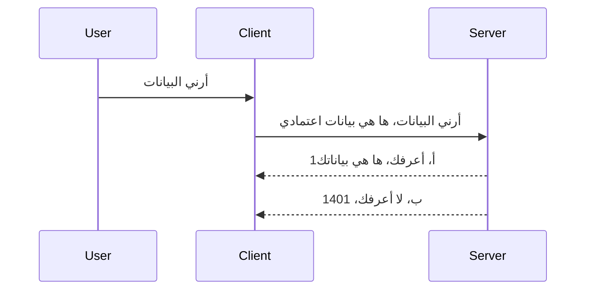

# مصادقة بسيطة

تدعم حزم MCP SDKs استخدام OAuth 2.1 والذي، لنكن منصفين، هو عملية معقدة إلى حد ما تتضمن مفاهيم مثل خادم المصادقة، خادم المورد، إرسال بيانات الاعتماد، الحصول على رمز، تبادل الرمز مقابل رمز حامل حتى تتمكن أخيرًا من الحصول على بيانات المورد الخاص بك. إذا لم تكن معتادًا على OAuth والذي هو أمر رائع للتنفيذ، فمن الجيد أن تبدأ بمستوى أساسي من المصادقة وتتطور إلى أمان أفضل وأفضل. لهذا السبب توجد هذه الفصل، لبنائك نحو مصادقة أكثر تقدمًا.

## ما المقصود بالمصادقة؟

المصادقة هي اختصار للمصادقة والترخيص. الفكرة هي أننا نحتاج إلى القيام بشيئين:

- **المصادقة**، وهي عملية معرفة ما إذا كنا سنسمح لشخص بدخول منزلنا، أي أنه لديه الحق في "التواجد هنا" وهو الوصول إلى خادم المورد حيث توجد ميزات خادم MCP الخاص بنا.
- **الترخيص**، هي عملية معرفة ما إذا كان يجب أن يُسمح للمستخدم بالوصول إلى الموارد المحددة التي يطلبها، على سبيل المثال هذه الطلبات أو هذه المنتجات أو ما إذا كان مسموحًا له بقراءة المحتوى فقط وليس الحذف كمثال آخر.

## بيانات الاعتماد: كيف نخبر النظام من نحن

حسنًا، معظم مطوري الويب يبدأون في التفكير من حيث توفير بيانات اعتماد للخادم، عادة سر يقول إذا ما كانوا مسموحًا لهم بالتواجد هنا "المصادقة". هذه البيانات تكون عادة نسخة مشفرة بـ base64 من اسم المستخدم وكلمة المرور أو مفتاح API يحدد مستخدمًا معينًا بشكل فريد.

هذا يتضمن إرسالها عبر رأس يسمى "Authorization" كما يلي:

```json
{ "Authorization": "secret123" }
```

يُشار عادةً إلى هذا بالمصادقة الأساسية. كيف يعمل التدفق العام هو كالآتي:



الآن بعد أن فهمنا كيف يعمل من ناحية التدفق، كيف ننفذه؟ حسنًا، معظم خوادم الويب لديها مفهوم يسمى middleware، وهو قطعة من الشيفرة التي تعمل كجزء من الطلب ويمكنها التحقق من بيانات الاعتماد، وإذا كانت البيانات صالحة تسمح بمرور الطلب. إذا لم يكن لدى الطلب بيانات اعتماد صالحة، فستحصل على خطأ مصادقة. دعونا نرى كيف يمكن تنفيذ ذلك:

**بايثون**

```python
class AuthMiddleware(BaseHTTPMiddleware):
    async def dispatch(self, request, call_next):

        has_header = request.headers.get("Authorization")
        if not has_header:
            print("-> Missing Authorization header!")
            return Response(status_code=401, content="Unauthorized")

        if not valid_token(has_header):
            print("-> Invalid token!")
            return Response(status_code=403, content="Forbidden")

        print("Valid token, proceeding...")
       
        response = await call_next(request)
        # أضف أي رؤوس مخصصة أو قم بتغيير الاستجابة بطريقة ما
        return response


starlette_app.add_middleware(CustomHeaderMiddleware)
```

هنا لدينا:

- أنشأنا middleware يسمى `AuthMiddleware` حيث يتم استدعاء وظيفة `dispatch` الخاصة به بواسطة خادم الويب.
- أضفنا middleware إلى خادم الويب:

    ```python
    starlette_app.add_middleware(AuthMiddleware)
    ```

- كتبنا منطق التحقق الذي يفحص وجود رأس Authorization وإذا كان السر المرسل صالحًا:

    ```python
    has_header = request.headers.get("Authorization")
    if not has_header:
        print("-> Missing Authorization header!")
        return Response(status_code=401, content="Unauthorized")

    if not valid_token(has_header):
        print("-> Invalid token!")
        return Response(status_code=403, content="Forbidden")
    ```

    إذا كان السر موجودًا وصالحًا نسمح للطلب بالمرور عبر استدعاء `call_next` وإرجاع الاستجابة.

    ```python
    response = await call_next(request)
    # أضف أي رؤوس عميل أو تغيير في الاستجابة بطريقة ما
    return response
    ```

كيف يعمل هو أنه إذا تم إجراء طلب ويب نحو الخادم سيتم استدعاء middleware وبحسب تنفيذه سيسمح بمرور الطلب أو يعيد خطأ يشير إلى أن العميل غير مسموح له بالمضي قدمًا.

**تايب سكريبت**

هنا نُنشئ middleware باستخدام إطار العمل الشهير Express ونعترض الطلب قبل وصوله إلى MCP Server. هذه هي الشيفرة لذلك:

```typescript
function isValid(secret) {
    return secret === "secret123";
}

app.use((req, res, next) => {
    // ١. هل رأس التفويض موجود؟
    if(!req.headers["Authorization"]) {
        res.status(401).send('Unauthorized');
    }
    
    let token = req.headers["Authorization"];

    // ٢. تحقق من الصلاحية.
    if(!isValid(token)) {
        res.status(403).send('Forbidden');
    }

   
    console.log('Middleware executed');
    // ٣. يمرر الطلب إلى الخطوة التالية في خط أنابيب الطلب.
    next();
});
```

في هذه الشفرة نحن:

1. نتحقق من وجود رأس Authorization في المقام الأول، إذا لم يكن موجودًا نرسل خطأ 401.
2. نتأكد من صحة بيانات الاعتماد/الرمز، إذا لم يكن صحيحًا نرسل خطأ 403.
3. وأخيرًا يمرر الطلب في خط أنابيب الطلب ويرجع المورد المطلوب.

## تمرين: تنفيذ المصادقة

لنأخذ معرفتنا ونحاول تنفيذها. إليك الخطة:

الخادم

- إنشاء خادم ويب ومثيل MCP.
- تنفيذ middleware للخادم.

العميل

- إرسال طلب ويب، مع بيانات الاعتماد، عبر الرأس.

### -1- إنشاء خادم ويب ومثيل MCP

> **نظرة مستقبلية:** المثال الموجود أدناه بـ TypeScript يتتبع واجهات نقل HTTP في خريطة `transports` مفاتيحها `mcp-session-id`، حسب **مواصفة MCP 2025-11-25**. إصدار المرشح للإطلاق `2026-07-28` يزيل مصافحة `initialize` ومعرّف الجلسة بالكامل، لذا تختفي خريطة النقل لكل جلسة لصالح طلبات مستقلة بدون حالة. انظر [ما الذي يتغير في MCP: مرشح الإصدار 2026-07-28](../../01-CoreConcepts/mcp-2026-07-28-release-candidate.md).

في خطوتنا الأولى، نحتاج إلى إنشاء مثيل خادم الويب وخادم MCP.

**بايثون**

هنا ننشئ مثيل خادم MCP، ننشئ تطبيق ويب starlette ونستضيفه باستخدام uvicorn.

```python
# إنشاء خادم MCP

app = FastMCP(
    name="MCP Resource Server",
    instructions="Resource Server that validates tokens via Authorization Server introspection",
    host=settings["host"],
    port=settings["port"],
    debug=True
)

# إنشاء تطبيق ويب ستارليت
starlette_app = app.streamable_http_app()

# تقديم التطبيق عبر uvicorn
async def run(starlette_app):
    import uvicorn
    config = uvicorn.Config(
            starlette_app,
            host=app.settings.host,
            port=app.settings.port,
            log_level=app.settings.log_level.lower(),
        )
    server = uvicorn.Server(config)
    await server.serve()

run(starlette_app)
```

في هذه الشفرة نحن:

- أنشأنا خادم MCP.
- بنينا تطبيق starlette من خادم MCP بـ `app.streamable_http_app()`.
- استضفنا التطبيق وخدمناه باستخدام uvicorn `server.serve()`.

**تايب سكريبت**

هنا ننشئ مثيل MCP Server.

```typescript
const server = new McpServer({
      name: "example-server",
      version: "1.0.0"
    });

    // ... إعداد موارد الخادم، الأدوات، والمحفزات ...
```

يجب أن يحدث هذا الإنشاء ضمن تعريف مسار POST /mcp، لذا دعونا نأخذ الكود أعلاه وننقله كما يلي:

```typescript
import express from "express";
import { randomUUID } from "node:crypto";
import { McpServer } from "@modelcontextprotocol/sdk/server/mcp.js";
import { StreamableHTTPServerTransport } from "@modelcontextprotocol/sdk/server/streamableHttp.js";
import { isInitializeRequest } from "@modelcontextprotocol/sdk/types.js"

const app = express();
app.use(express.json());

// خريطة لتخزين وسائل النقل حسب معرف الجلسة
const transports: { [sessionId: string]: StreamableHTTPServerTransport } = {};

// التعامل مع طلبات POST للاتصال من العميل إلى الخادم
app.post('/mcp', async (req, res) => {
  // التحقق من وجود معرف جلسة
  const sessionId = req.headers['mcp-session-id'] as string | undefined;
  let transport: StreamableHTTPServerTransport;

  if (sessionId && transports[sessionId]) {
    // إعادة استخدام وسيلة النقل الموجودة
    transport = transports[sessionId];
  } else if (!sessionId && isInitializeRequest(req.body)) {
    // طلب تهيئة جديد
    transport = new StreamableHTTPServerTransport({
      sessionIdGenerator: () => randomUUID(),
      onsessioninitialized: (sessionId) => {
        // تخزين وسيلة النقل حسب معرف الجلسة
        transports[sessionId] = transport;
      },
      // حماية إعادة ربط DNS معطلة افتراضيًا من أجل التوافق مع الإصدارات السابقة. إذا كنت تشغل هذا الخادم
      // محليًا، تأكد من تعيين:
      // enableDnsRebindingProtection: true,
      // allowedHosts: ['127.0.0.1'],
    });

    // تنظيف وسيلة النقل عند الإغلاق
    transport.onclose = () => {
      if (transport.sessionId) {
        delete transports[transport.sessionId];
      }
    };
    const server = new McpServer({
      name: "example-server",
      version: "1.0.0"
    });

    // ... إعداد موارد الخادم والأدوات والمطالبات ...

    // الاتصال بخادم MCP
    await server.connect(transport);
  } else {
    // طلب غير صالح
    res.status(400).json({
      jsonrpc: '2.0',
      error: {
        code: -32000,
        message: 'Bad Request: No valid session ID provided',
      },
      id: null,
    });
    return;
  }

  // التعامل مع الطلب
  await transport.handleRequest(req, res, req.body);
});

// معالج قابل لإعادة الاستخدام لطلبات GET و DELETE
const handleSessionRequest = async (req: express.Request, res: express.Response) => {
  const sessionId = req.headers['mcp-session-id'] as string | undefined;
  if (!sessionId || !transports[sessionId]) {
    res.status(400).send('Invalid or missing session ID');
    return;
  }
  
  const transport = transports[sessionId];
  await transport.handleRequest(req, res);
};

// التعامل مع طلبات GET لإشعارات الخادم للعميل عبر SSE
app.get('/mcp', handleSessionRequest);

// التعامل مع طلبات DELETE لإنهاء الجلسة
app.delete('/mcp', handleSessionRequest);

app.listen(3000);
```

الآن ترى كيف تم نقل إنشاء MCP Server داخل `app.post("/mcp")`.

لننتقل إلى الخطوة التالية وهي إنشاء middleware لكي نتحقق من صحة بيانات الاعتماد الواردة.

### -2- تنفيذ middleware للخادم

لننتقل إلى جزء middleware الآن. هنا سننشئ middleware يبحث عن بيانات اعتماد في رأس `Authorization` ويتحقق من صحتها. إذا كانت مقبولة، فإن الطلب سيتابع القيام بما يحتاج (مثل عرض الأدوات، قراءة موارد أو أي وظيفة MCP يطلبها العميل).

**بايثون**

لإنشاء middleware، نحتاج إلى إنشاء فئة ترث من `BaseHTTPMiddleware`. هناك جزأين مهمين:

- الطلب `request`، من نقرأ رأس المعلومات منه.
- `call_next` هي رد النداء الذي نحتاج إلى استدعائه إذا أحضر العميل بيانات اعتماد نقبلها.

أولًا، نحتاج إلى التعامل مع الحالة إذا كان رأس `Authorization` مفقودًا:

```python
has_header = request.headers.get("Authorization")

# لا يوجد رأس، فشل مع 401، وإلا استمر.
if not has_header:
    print("-> Missing Authorization header!")
    return Response(status_code=401, content="Unauthorized")
```

هنا نرسل رسالة 401 غير مصرح كما أن العميل يفشل في المصادقة.

بعد ذلك، إذا تم تقديم بيانات اعتماد، نحتاج إلى التحقق من صلاحيتها كما يلي:

```python
 if not valid_token(has_header):
    print("-> Invalid token!")
    return Response(status_code=403, content="Forbidden")
```

لاحظ كيف نرسل رسالة 403 ممنوع أعلاه. دعونا نرى كامل middleware أدناه الذي ينفذ كل ما ذكرناه:

```python
class AuthMiddleware(BaseHTTPMiddleware):
    async def dispatch(self, request, call_next):

        has_header = request.headers.get("Authorization")
        if not has_header:
            print("-> Missing Authorization header!")
            return Response(status_code=401, content="Unauthorized")

        if not valid_token(has_header):
            print("-> Invalid token!")
            return Response(status_code=403, content="Forbidden")

        print("Valid token, proceeding...")
        print(f"-> Received {request.method} {request.url}")
        response = await call_next(request)
        response.headers['Custom'] = 'Example'
        return response

```

رائع، ولكن ماذا عن دالة `valid_token`؟ ها هي أدناه:

```python
# لا تستخدم للإنتاج - قم بتحسينه !!
def valid_token(token: str) -> bool:
    # إزالة بادئة "Bearer "
    if token.startswith("Bearer "):
        token = token[7:]
        return token == "secret-token"
    return False
```

من الواضح أنه يجب تحسينها.

هام: يجب ألا تحتفظ بأسرار كهذه في الشيفرة أبداً. من الناحية المثالية يجب استرجاع القيمة للمقارنة من مصدر بيانات أو من مزود خدمة الهوية IDP أو من الأفضل السماح لـ IDP بالتحقق بنفسه.

**تايب سكريبت**

لتنفيذ ذلك مع Express، نحتاج إلى استدعاء طريقة `use` التي تأخذ دوال middleware.

نحتاج إلى:

- التفاعل مع متغير الطلب للتحقق من بيانات الاعتماد المرسلة في خاصية `Authorization`.
- التحقق من صحة بيانات الاعتماد، وإذا كانت صحيحة تم السماح للطلب بالاستمرار ليقوم MCP client بما يجب (مثل عرض الأدوات، قراءة مورد أو أي شيء متعلق بـ MCP).

هنا، نتحقق من وجود رأس `Authorization` وإذا لم يكن موجودًا نوقف الطلب من المرور:

```typescript
if(!req.headers["authorization"]) {
    res.status(401).send('Unauthorized');
    return;
}
```

إذا لم يُرسل الرأس من الأساس، تحصل على 401.

بعد ذلك، نتحقق من صلاحية بيانات الاعتماد، إذا لم تكن صحيحة نوقف الطلب مرة أخرى ولكن مع رسالة مختلفة قليلاً:

```typescript
if(!isValid(token)) {
    res.status(403).send('Forbidden');
    return;
} 
```

لاحظ كيف تصلك الآن رسالة خطأ 403.

هذا هو الكود الكامل:

```typescript
app.use((req, res, next) => {
    console.log('Request received:', req.method, req.url, req.headers);
    console.log('Headers:', req.headers["authorization"]);
    if(!req.headers["authorization"]) {
        res.status(401).send('Unauthorized');
        return;
    }
    
    let token = req.headers["authorization"];

    if(!isValid(token)) {
        res.status(403).send('Forbidden');
        return;
    }  

    console.log('Middleware executed');
    next();
});
```

لقد أعددنا خادم الويب لقبول middleware للتحقق من بيانات الاعتماد التي يأمل العميل أن يرسلها لنا. ماذا عن العميل نفسه؟

### -3- إرسال طلب ويب مع بيانات اعتماد عبر الرأس

نحتاج إلى التأكد من أن العميل يمرر بيانات الاعتماد عبر الرأس. وبما أننا سنستخدم عميل MCP لفعل ذلك، نحتاج إلى معرفة كيف يتم ذلك.

**بايثون**

بالنسبة للعميل، نحتاج إلى تمرير رأس مع بيانات الاعتماد كما يلي:

```python
# لا تقم بترميز القيمة بشكل ثابت، اجعلها على الأقل في متغير بيئة أو في تخزين أكثر أمانًا
token = "secret-token"

async with streamablehttp_client(
        url = f"http://localhost:{port}/mcp",
        headers = {"Authorization": f"Bearer {token}"}
    ) as (
        read_stream,
        write_stream,
        session_callback,
    ):
        async with ClientSession(
            read_stream,
            write_stream
        ) as session:
            await session.initialize()
      
            # ملاحظة، ما تريد تنفيذه في العميل، مثلاً قائمة الأدوات، استدعاء الأدوات وما إلى ذلك.
```

لاحظ كيف نملأ الخاصية `headers` مثل ` headers = {"Authorization": f"Bearer {token}"}`.

**تايب سكريبت**

يمكننا حل هذا في خطوتين:

1. ملء كائن التهيئة ببيانات الاعتماد.
2. تمرير كائن التهيئة إلى النقل.

```typescript

// لا تقم بتشفير القيمة مباشرة كما هو موضح هنا. على الأقل اجعلها متغيرة بيئية واستخدم شيئًا مثل dotenv (في وضع التطوير).
let token = "secret123"

// تعريف كائن خيار نقل العميل
let options: StreamableHTTPClientTransportOptions = {
  sessionId: sessionId,
  requestInit: {
    headers: {
      "Authorization": "secret123"
    }
  }
};

// تمرير كائن الخيارات إلى النقل
async function main() {
   const transport = new StreamableHTTPClientTransport(
      new URL(serverUrl),
      options
   );
```

هنا ترى أعلاه كيف اضطررنا لإنشاء كائن `options` ووضع رؤوسنا تحت خاصية `requestInit`.

هام: كيف نحسنه من هنا؟ حسنًا، التنفيذ الحالي به بعض المشاكل. أولاً، تمرير بيانات اعتماد بهذه الطريقة محفوف بالمخاطر إلا إذا كان لديك HTTPS على الأقل. وحتى مع ذلك، يمكن سرقة بيانات الاعتماد لذا تحتاج إلى نظام يمكنك من خلاله إلغاء الرمز بسهولة وإضافة فحوصات إضافية مثل من أين في العالم يأتي الطلب، هل يحدث الطلب بشكل متكرر جدًا (تصرفات بوت)، باختصار، هناك عدد كبير من المخاوف.

يجب القول بالرغم من ذلك، أنه بالنسبة لواجهات برمجة التطبيقات البسيطة جدًا حيث لا تريد لأحد أن ينادي على API الخاص بك دون مصادقة، ما لدينا هنا هو بداية جيدة.

مع ذلك، دعونا نحاول تعزيز الأمان قليلاً باستخدام تنسيق موحد مثل JSON Web Token، المعروف أيضًا باسم JWT أو رموز "JOT".

## رموز الويب JSON، JWT

إذًا، نحن نحاول تحسين الأمور من إرسال بيانات اعتماد بسيطة جدًا. ما هي التحسينات الفورية التي نحصل عليها عند اعتماد JWT؟

- **تحسينات الأمان**. في المصادقة الأساسية، ترسل اسم المستخدم وكلمة المرور كرزمة مشفرة base64 (أو ترسل مفتاح API) مرارًا وتكرارًا مما يزيد الخطر. مع JWT، ترسل اسم المستخدم وكلمة المرور وتحصل على رمز مقابلها وهو أيضاً مرتبط بالزمن بمعنى أنه سينتهي صلاحيته. تتيح JWT لك استخدام تحكم دقيق في الوصول باستخدام الأدوار، النطاقات والصلاحيات.
- **انعدام الحالة وقابلية التوسع**. رموز JWT مكتفية ذاتيًا، تحمل جميع معلومات المستخدم وتلغي الحاجة لتخزين جلسة على جانب الخادم. يمكن أيضًا التحقق من صحة الرمز محليًا.
- **التشغيل البيني والاتحاد**. JWT مركزية في Open ID Connect وتستخدم مع مزودي الهوية المعروفين مثل Entra ID وGoogle Identity وAuth0. كما تتيح تسجيل دخول موحد وأكثر، مما يجعلها ذات جودة مؤسسية.
- **المرونة والتجزئة**. يمكن استخدام JWT أيضًا مع بوابات API مثل Azure API Management وNGINX وأكثر. كما تدعم سيناريوهات المصادقة واستخدام الخادم للتواصل مع الخدمات الأخرى بما في ذلك التمثيل والتفويض.
- **الأداء والتخزين المؤقت**. يمكن تخزين JWT مؤقتًا بعد فك التشفير مما يقلل الحاجة إلى التحليل المتكرر. يساعد هذا بشكل خاص التطبيقات عالية الحركة حيث يحسن الإنتاجية ويقلل الحمل على البنية التحتية الخاصة بك.
- **ميزات متقدمة**. كما تدعم الفحص (التحقق من الصلاحية على الخادم) والإلغاء (جعل الرمز غير صالح).

مع كل هذه الفوائد، دعونا نرى كيف يمكننا أخذ تنفيذنا إلى المستوى التالي.

## تحويل المصادقة الأساسية إلى JWT

إذًا، التغييرات التي نحتاج إلى إجرائها على مستوى عالي هي:

- **تعلم كيفية بناء رمز JWT** وجعله جاهزًا للإرسال من العميل إلى الخادم.
- **التحقق من صحة رمز JWT**، وإذا كان صالحًا، نسمح للعميل بالحصول على مواردنا.
- **تخزين الرمز بأمان**. كيف نخزن هذا الرمز.
- **حماية المسارات**. نحتاج إلى حماية المسارات، في حالتنا، حماية مسارات وميزات MCP محددة.
- **إضافة رموز تحديث**. التأكد من إنشاء رموز قصيرة العمر ولكن رموز التحديث طويلة العمر التي يمكن استخدامها للحصول على رموز جديدة إذا انتهت صلاحيتها. وكذلك التأكد من وجود نقطة تحديث واستراتيجية للتدوير.

### -1- بناء رمز JWT

أولًا، رمز JWT يحتوي على الأجزاء التالية:

- **الرأس**، الخوارزمية المستخدمة ونوع الرمز.
- **المحتوى**، الادعاءات، مثل sub (المستخدم أو الكيان الذي يمثل الرمز. في سيناريو المصادقة عادةً معرّف المستخدم)، exp (موعد انتهاء الصلاحية) role (الدور)
- **التوقيع**، موقع بسِر أو مفتاح خاص.

لهذا، سنحتاج إلى بناء الرأس، المحتوى والرمز المشفر.

**بايثون**

```python

import jwt
import jwt
from jwt.exceptions import ExpiredSignatureError, InvalidTokenError
import datetime

# المفتاح السري المستخدم لتوقيع JWT
secret_key = 'your-secret-key'

header = {
    "alg": "HS256",
    "typ": "JWT"
}

# معلومات المستخدم ومطالبه ووقت انتهاء صلاحيته
payload = {
    "sub": "1234567890",               # الموضوع (معرف المستخدم)
    "name": "User Userson",                # مطالبة مخصصة
    "admin": True,                     # مطالبة مخصصة
    "iat": datetime.datetime.utcnow(),# تم الإصدار في
    "exp": datetime.datetime.utcnow() + datetime.timedelta(hours=1)  # انتهاء الصلاحية
}

# ترميزه
encoded_jwt = jwt.encode(payload, secret_key, algorithm="HS256", headers=header)
```

في الكود أعلاه قمنا بـ:

- تعريف رأس باستخدام HS256 كخوارزمية والنوع JWT.
- بناء محتوى يحتوي على موضوع أو معرّف مستخدم، اسم مستخدم، دور، وقت الإصدار ووقت الانتهاء، مما ينفذ جانب الارتباط الزمني الذي ذكرناه سابقًا.

**تايب سكريبت**

هنا سنحتاج بعض التبعيات التي تساعدنا في بناء رمز JWT.

التبعيات

```sh

npm install jsonwebtoken
npm install --save-dev @types/jsonwebtoken
```

الآن بعد أن وفرنا ذلك، لننشئ الرأس، المحتوى ومن خلالهما ننشئ الرمز المشفر.

```typescript
import jwt from 'jsonwebtoken';

const secretKey = 'your-secret-key'; // استخدم متغيرات البيئة في الإنتاج

// تحديد الحمولة
const payload = {
  sub: '1234567890',
  name: 'User usersson',
  admin: true,
  iat: Math.floor(Date.now() / 1000), // تم الإصدار في
  exp: Math.floor(Date.now() / 1000) + 60 * 60 // تنتهي الصلاحية في غضون ساعة
};

// تحديد الرأس (اختياري، jsonwebtoken يحدد الافتراضات)
const header = {
  alg: 'HS256',
  typ: 'JWT'
};

// إنشاء الرمز
const token = jwt.sign(payload, secretKey, {
  algorithm: 'HS256',
  header: header
});

console.log('JWT:', token);
```

هذا الرمز:

موقع باستخدام HS256
صالح لساعة واحدة
يشمل ادعاءات مثل sub، name، admin، iat، وexp.

### -2- التحقق من رمز

سنحتاج أيضًا إلى التحقق من الرمز، وهذا شيء يجب أن يتم على الخادم لضمان أن ما يرسله العميل فعلاً صالح. هناك كثير من الفحوصات التي يجب القيام بها هنا من التحقق من بنية الرمز إلى صلاحيته. يُشجع أيضًا بإضافة فحوصات أخرى لمعرفة ما إذا كان المستخدم موجودًا في نظامك والمزيد.

للتحقق من الرمز، نحتاج إلى فك تشفيره لنتمكن من قراءته ثم نبدأ بفحص صلاحيته:

**بايثون**

```python

# فك التشفير والتحقق من JWT
try:
    decoded = jwt.decode(token, secret_key, algorithms=["HS256"])
    print("✅ Token is valid.")
    print("Decoded claims:")
    for key, value in decoded.items():
        print(f"  {key}: {value}")
except ExpiredSignatureError:
    print("❌ Token has expired.")
except InvalidTokenError as e:
    print(f"❌ Invalid token: {e}")

```


في هذا الكود، نستدعي `jwt.decode` باستخدام الرمز المميز، المفتاح السري والخوارزمية المختارة كمدخلات. لاحظ كيف نستخدم بنية try-catch حيث أن فشل التحقق يؤدي إلى رفع خطأ.

**تايب سكريبت**

هنا نحتاج إلى استدعاء `jwt.verify` للحصول على نسخة مفككة من الرمز المميز يمكننا تحليلها أكثر. إذا فشل هذا النداء، فهذا يعني أن هيكلية الرمز المميز غير صحيحة أو أنه لم يعد صالحًا.

```typescript

try {
  const decoded = jwt.verify(token, secretKey);
  console.log('Decoded Payload:', decoded);
} catch (err) {
  console.error('Token verification failed:', err);
}
```

ملاحظة: كما ذُكر سابقًا، يجب أن نجري فحوصات إضافية للتأكد من أن هذا الرمز يشير إلى مستخدم في نظامنا والتأكد من أن المستخدم لديه الحقوق التي يدعيها.

بعد ذلك، دعونا ننظر في التحكم بالوصول المبني على الدور، المعروف أيضًا بـ RBAC.

## إضافة التحكم بالوصول المبني على الدور

الفكرة هي أننا نريد التعبير أن الأدوار المختلفة لها أذونات مختلفة. على سبيل المثال، نفترض أن المدير يمكنه فعل كل شيء وأن المستخدم العادي يمكنه القراءة/الكتابة وأن الضيف يمكنه القراءة فقط. لذلك، فيما يلي بعض مستويات الأذونات المحتملة:

- المدير.كتابة
- المستخدم.قراءة
- الضيف.قراءة

دعونا ننظر كيف يمكننا تنفيذ مثل هذا التحكم بواسطة الوسائط الوسيطة. يمكن إضافة الوسائط الوسيطة لكل مسار وكذلك لكل المسارات.

**بايثون**

```python
from starlette.middleware.base import BaseHTTPMiddleware
from starlette.responses import JSONResponse
import jwt

# لا تحتفظ بالسر في الكود مثل هذا، فهذا لأغراض التوضيح فقط. اقرأه من مكان آمن.
SECRET_KEY = "your-secret-key" # ضع هذا في متغير البيئة
REQUIRED_PERMISSION = "User.Read"

class JWTPermissionMiddleware(BaseHTTPMiddleware):
    async def dispatch(self, request, call_next):
        auth_header = request.headers.get("Authorization")
        if not auth_header or not auth_header.startswith("Bearer "):
            return JSONResponse({"error": "Missing or invalid Authorization header"}, status_code=401)

        token = auth_header.split(" ")[1]
        try:
            decoded = jwt.decode(token, SECRET_KEY, algorithms=["HS256"])
        except jwt.ExpiredSignatureError:
            return JSONResponse({"error": "Token expired"}, status_code=401)
        except jwt.InvalidTokenError:
            return JSONResponse({"error": "Invalid token"}, status_code=401)

        permissions = decoded.get("permissions", [])
        if REQUIRED_PERMISSION not in permissions:
            return JSONResponse({"error": "Permission denied"}, status_code=403)

        request.state.user = decoded
        return await call_next(request)


```

هناك عدة طرق مختلفة لإضافة الوسيط الوسيط كما يلي:

```python

# البديل 1: إضافة وسيط برمجي أثناء بناء تطبيق ستارليت
middleware = [
    Middleware(JWTPermissionMiddleware)
]

app = Starlette(routes=routes, middleware=middleware)

# البديل 2: إضافة وسيط برمجي بعد بناء تطبيق ستارليت بالفعل
starlette_app.add_middleware(JWTPermissionMiddleware)

# البديل 3: إضافة وسيط برمجي لكل مسار
routes = [
    Route(
        "/mcp",
        endpoint=..., # المعالج
        middleware=[Middleware(JWTPermissionMiddleware)]
    )
]
```

**تايب سكريبت**

يمكننا استخدام `app.use` ووسيط وسيط سيعمل لجميع الطلبات.

```typescript
app.use((req, res, next) => {
    console.log('Request received:', req.method, req.url, req.headers);
    console.log('Headers:', req.headers["authorization"]);

    // 1. تحقق مما إذا تم إرسال رأس التفويض

    if(!req.headers["authorization"]) {
        res.status(401).send('Unauthorized');
        return;
    }
    
    let token = req.headers["authorization"];

    // 2. تحقق مما إذا كانت الرمزية صالحة
    if(!isValid(token)) {
        res.status(403).send('Forbidden');
        return;
    }  

    // 3. تحقق مما إذا كان مستخدم الرمزية موجودًا في نظامنا
    if(!isExistingUser(token)) {
        res.status(403).send('Forbidden');
        console.log("User does not exist");
        return;
    }
    console.log("User exists");

    // 4. التحقق من أن الرمزية لديها الأذونات الصحيحة
    if(!hasScopes(token, ["User.Read"])){
        res.status(403).send('Forbidden - insufficient scopes');
    }

    console.log("User has required scopes");

    console.log('Middleware executed');
    next();
});

```

هناك عدة أشياء يمكننا تركها لوسيطنا الوسيط والتي يجب على الوسيط الوسيط القيام بها، وهي:

1. التحقق من وجود رأس التفويض
2. التحقق من صلاحية الرمز المميز، نستدعي `isValid` وهي طريقة كتبناها للتحقق من سلامة وصلاحية رمز JWT.
3. التحقق من وجود المستخدم في نظامنا، يجب علينا التحقق من ذلك.

   ```typescript
    // المستخدمون في قاعدة البيانات
   const users = [
     "user1",
     "User usersson",
   ]

   function isExistingUser(token) {
     let decodedToken = verifyToken(token);

     // يجب القيام به، تحقق مما إذا كان المستخدم موجودًا في قاعدة البيانات
     return users.includes(decodedToken?.name || "");
   }
   ```

   أعلاه، أنشأنا قائمة `users` بسيطة جدًا، والتي يجب أن تكون في قاعدة بيانات بالطبع.

4. بالإضافة إلى ذلك، يجب علينا أيضًا التحقق من أن الرمز المميز يحتوي على الأذونات الصحيحة.

   ```typescript
   if(!hasScopes(token, ["User.Read"])){
        res.status(403).send('Forbidden - insufficient scopes');
   }
   ```

   في الكود أعلاه من الوسيط الوسيط، نتحقق أن الرمز المميز يحتوي على إذن User.Read، وإذا لم يكن كذلك نرسل خطأ 403. أدناه طريقة المساعدة `hasScopes`.

   ```typescript
   function hasScopes(scope: string, requiredScopes: string[]) {
     let decodedToken = verifyToken(scope);
    return requiredScopes.every(scope => decodedToken?.scopes.includes(scope));
  }
   ```

Have a think which additional checks you should be doing, but these are the absolute minimum of checks you should be doing.

Using Express as a web framework is a common choice. There are helpers library when you use JWT so you can write less code.

- `express-jwt`, helper library that provides a middleware that helps decode your token.
- `express-jwt-permissions`, this provides a middleware `guard` that helps check if a certain permission is on the token.

Here's what these libraries can look like when used:

```typescript
const express = require('express');
const jwt = require('express-jwt');
const guard = require('express-jwt-permissions')();

const app = express();
const secretKey = 'your-secret-key'; // put this in env variable

// Decode JWT and attach to req.user
app.use(jwt({ secret: secretKey, algorithms: ['HS256'] }));

// Check for User.Read permission
app.use(guard.check('User.Read'));

// multiple permissions
// app.use(guard.check(['User.Read', 'Admin.Access']));

app.get('/protected', (req, res) => {
  res.json({ message: `Welcome ${req.user.name}` });
});

// Error handler
app.use((err, req, res, next) => {
  if (err.code === 'permission_denied') {
    return res.status(403).send('Forbidden');
  }
  next(err);
});

```

الآن لقد شاهدت كيف يمكن استخدام الوسيط الوسيط لكل من المصادقة والتفويض، ماذا عن MCP، هل يغير طريقة تنفيذ المصادقة؟ دعنا نكتشف في القسم التالي.

### -3- إضافة RBAC إلى MCP

لقد رأيت حتى الآن كيف يمكنك إضافة RBAC عبر الوسيط الوسيط، ومع ذلك، بالنسبة لـ MCP لا توجد طريقة سهلة لإضافة RBAC للميزات في MCP، فماذا نفعل؟ حسنًا، فقط علينا إضافة كود كهذا الذي يتحقق في هذه الحالة ما إذا كان العميل لديه الحق في استدعاء أداة معينة:

لديك بعض الخيارات المختلفة لكيفية إنجاز RBAC لكل ميزة، هنا بعضها:

- أضف تحققًا لكل أداة، مورد، مطالبة حيث تحتاج إلى التحقق من مستوى الإذن.

   **بايثون**

   ```python
   @tool()
   def delete_product(id: int):
      try:
          check_permissions(role="Admin.Write", request)
      catch:
        pass # فشل العميل في التفويض، أرفع خطأ التفويض
   ```

   **تايب سكريبت**

   ```typescript
   server.registerTool(
    "delete-product",
    {
      title: Delete a product",
      description: "Deletes a product",
      inputSchema: { id: z.number() }
    },
    async ({ id }) => {
      
      try {
        checkPermissions("Admin.Write", request);
        // يجب القيام به، إرسال المعرف إلى productService ونقطة الإدخال البعيدة
      } catch(Exception e) {
        console.log("Authorization error, you're not allowed");  
      }

      return {
        content: [{ type: "text", text: `Deletected product with id ${id}` }]
      };
    }
   );
   ```


- استخدم نهج خادم متقدم ومعالجات الطلبات لتقليل الأماكن التي تحتاج إلى إجراء التحقق فيها.

   **بايثون**

   ```python
   
   tool_permission = {
      "create_product": ["User.Write", "Admin.Write"],
      "delete_product": ["Admin.Write"]
   }

   def has_permission(user_permissions, required_permissions) -> bool:
      # user_permissions: قائمة بالأذونات التي يمتلكها المستخدم
      # required_permissions: قائمة بالأذونات المطلوبة للأداة
      return any(perm in user_permissions for perm in required_permissions)

   @server.call_tool()
   async def handle_call_tool(
     name: str, arguments: dict[str, str] | None
   ) -> list[types.TextContent]:
    # افترض أن request.user.permissions هي قائمة بالأذونات الخاصة بالمستخدم
     user_permissions = request.user.permissions
     required_permissions = tool_permission.get(name, [])
     if not has_permission(user_permissions, required_permissions):
        # ارفع خطأ "ليس لديك إذن لاستدعاء الأداة {name}"
        raise Exception(f"You don't have permission to call tool {name}")
     # استمر وقم باستدعاء الأداة
     # ...
   ```   
   

   **تايب سكريبت**

   ```typescript
   function hasPermission(userPermissions: string[], requiredPermissions: string[]): boolean {
       if (!Array.isArray(userPermissions) || !Array.isArray(requiredPermissions)) return false;
       // إرجاع صحيح إذا كان للمستخدم على الأقل إذن واحد مطلوب
       
       return requiredPermissions.some(perm => userPermissions.includes(perm));
   }
  
   server.setRequestHandler(CallToolRequestSchema, async (request) => {
      const { params: { name } } = request;
  
      let permissions = request.user.permissions;
  
      if (!hasPermission(permissions, toolPermissions[name])) {
         return new Error(`You don't have permission to call ${name}`);
      }
  
      // استمر..
   });
   ```

   ملاحظة، ستحتاج إلى التأكد من أن وسيطك الوسيط يعين رمزًا مفسرًا إلى خاصية المستخدم في الطلب لكي يبسط الكود أعلاه.

### الخلاصة

الآن بعد أن ناقشنا كيفية إضافة دعم لـ RBAC بشكل عام ولـ MCP بشكل خاص، حان الوقت لمحاولة تنفيذ الأمان بنفسك للتأكد من فهمك للمفاهيم المقدمة لك.

## المهمة 1: بناء خادم mcp وعميل mcp باستخدام المصادقة الأساسية

هنا ستأخذ ما تعلمته من حيث إرسال بيانات الاعتماد عبر رؤوس الطلب.

## الحل 1

[الحل 1](./code/basic/README.md)

## المهمة 2: ترقية الحل من المهمة 1 لاستخدام JWT

خذ الحل الأول ولكن هذه المرة، دعنا نحسنه.

بدلاً من استخدام المصادقة الأساسية، دعنا نستخدم JWT.

## الحل 2

[الحل 2](./solution/jwt-solution/README.md)

## التحدي

أضف RBAC لكل أداة كما وصفنا في قسم "إضافة RBAC إلى MCP".

## الملخص

نأمل أنك تعلمت الكثير في هذا الفصل، من عدم وجود أمان على الإطلاق، إلى الأمان الأساسي، إلى JWT وكيف يمكن إضافته إلى MCP.

لقد بنينا أساسًا متينًا باستخدام JWT مخصص، ولكن مع توسعنا، نتجه نحو نموذج هوية قائم على المعايير. تبني موفر هوية مثل Entra أو Keycloak يتيح لنا تفويض إصدار الرموز، التحقق منها، وإدارة دورة حياتها إلى منصة موثوقة — مما يحررنا للتركيز على منطق التطبيق وتجربة المستخدم.

لذلك، لدينا فصل أكثر [تقدمًا عن Entra](../../05-AdvancedTopics/mcp-security-entra/README.md)

## ما التالي

- التالي: [إعداد مضيفي MCP](../12-mcp-hosts/README.md)

---

<!-- CO-OP TRANSLATOR DISCLAIMER START -->
**تنويه**:
تمت ترجمة هذا المستند باستخدام خدمة الترجمة بالذكاء الاصطناعي [Co-op Translator](https://github.com/Azure/co-op-translator). بينما نسعى للدقة، يرجى العلم أن الترجمات الآلية قد تحتوي على أخطاء أو عدم دقة. يجب اعتبار المستند الأصلي بلغته الأصلية المصدر الرسمي والمعتمد. للمعلومات الهامة، يُنصح بالاستعانة بترجمة بشرية محترفة. نحن غير مسؤولين عن أي سوء فهم أو تفسير ناتج عن استخدام هذه الترجمة.
<!-- CO-OP TRANSLATOR DISCLAIMER END -->