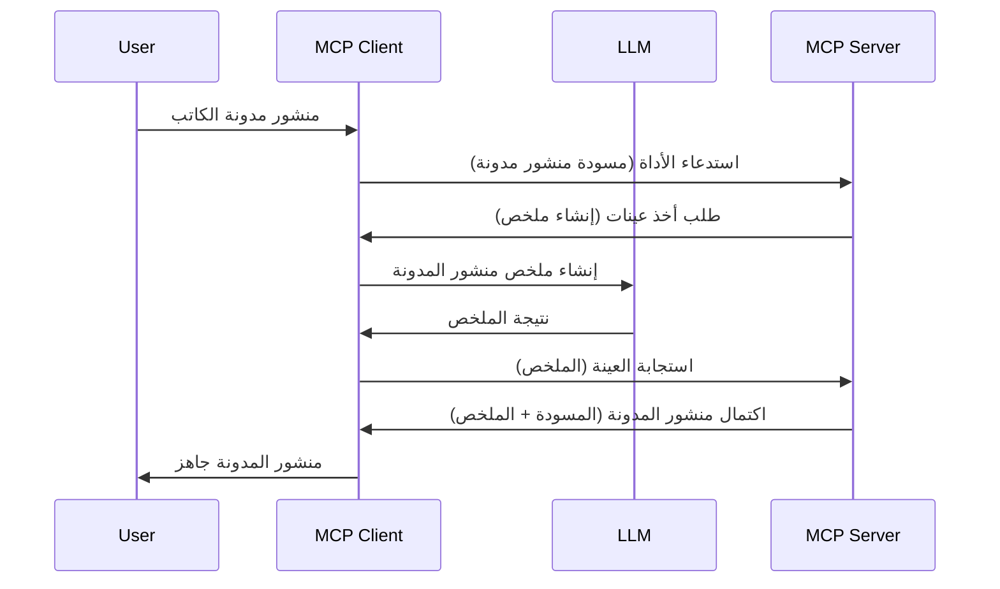

# العينة - تفويض الميزات إلى العميل

> **إشعار إيقاف الدعم:** إصدار مرشح مواصفة MCP بتاريخ `2026-07-28` يعتبر العينة ميزة مهجورة لصالح التكامل المباشر مع APIs لمزودي LLM. تستمر العينة في العمل في إصدار `2025-11-25` ولمدة سنة على الأقل بعد أي إيقاف دعم رسمي، لذا كل شيء في هذا الدرس يبقى صالحًا — لكن يجب على تصميمات الخوادم الجديدة تقييم نمط البديل. راجع [ما الجديد في MCP: إصدار مرشح 2026-07-28](../../01-CoreConcepts/mcp-2026-07-28-release-candidate.md).

أحيانًا، تحتاج إلى أن يتعاون عميل MCP وخادم MCP لتحقيق هدف مشترك. قد يكون لديك حالة حيث يحتاج الخادم إلى مساعدة LLM موجود على العميل. في هذا الوضع، يجب أن تستخدم العينة.

دعونا نستعرض بعض حالات الاستخدام وكيفية بناء حل يشمل العينة.

## نظرة عامة

في هذا الدرس، نركز على شرح متى وأين نستخدم العينة وكيفية تكوينها.

## أهداف التعلم

في هذا الفصل، سوف:

- نشرح ما هي العينة ومتى نستخدمها.
- نعرض كيفية تكوين العينة في MCP.
- نقدم أمثلة للعينة أثناء العمل.

## ما هي العينة ولماذا نستخدمها؟

العينة هي ميزة متقدمة تعمل بالطريقة التالية:



### طلب العينة

حسنًا، الآن لدينا نظرة شاملة على سيناريو معقول، دعونا نتحدث عن طلب العينة الذي يرسله الخادم إلى العميل. هذا هو الشكل الذي يمكن أن يبدو عليه مثل هذا الطلب بتنسيق JSON-RPC:

```json
{
  "jsonrpc": "2.0",
  "id": 1,
  "method": "sampling/createMessage",
  "params": {
    "messages": [
      {
        "role": "user",
        "content": {
          "type": "text",
          "text": "Create a blog post summary of the following blog post: <BLOG POST>"
        }
      }
    ],
    "modelPreferences": {
      "hints": [
        {
          "name": "claude-3-sonnet"
        }
      ],
      "intelligencePriority": 0.8,
      "speedPriority": 0.5
    },
    "systemPrompt": "You are a helpful assistant.",
    "maxTokens": 100
  }
}
```

هناك بعض النقاط الجديرة بالذكر هنا:

- النص، تحت content -> text، هو نص التوجيه الخاص بنا وهو تعليمات إلى LLM لتلخيص محتوى منشور مدونة.

- **modelPreferences**. هذا القسم هو مجرد تفضيل، توصية حول التكوين الذي يجب استخدامه مع LLM. يمكن للمستخدم اختيار اتباع هذه التوصيات أو تعديلها. في هذه الحالة هناك توصيات على النموذج المستخدم وسرعة وأولوية الذكاء.
- **systemPrompt**، هذا هو النص العادي للنظام الذي يعطي LLM شخصية ويحتوي على تعليمات إرشادية.
- **maxTokens**، هذه خاصية أخرى تُستخدم لتحديد عدد الرموز الموصى باستخدامها لهذه المهمة.

### استجابة العينة

هذه الاستجابة هي ما ينتهي عميل MCP بإرساله مرة أخرى إلى خادم MCP وهي نتيجة استدعاء العميل لـ LLM، انتظار تلك الاستجابة ثم بناء هذه الرسالة. هذا هو الشكل الذي يمكن أن تبدو عليه بتنسيق JSON-RPC:

```json
{
  "jsonrpc": "2.0",
  "id": 1,
  "result": {
    "role": "assistant",
    "content": {
      "type": "text",
      "text": "Here's your abstract <ABSTRACT>"
    },
    "model": "gpt-5",
    "stopReason": "endTurn"
  }
}
```

لاحظ كيف أن الاستجابة هي ملخص لمنشور المدونة كما طلبنا. وأيضًا لاحظ كيف أن النموذج المستخدم ليس الذي طلبناه بل "gpt-5" بدلًا من "claude-3-sonnet". هذا لتوضيح أن المستخدم يمكنه تغيير رأيه بشأن ما يستخدم وأن طلب العينة هو توصية.

حسنًا، الآن بعد أن فهمنا التدفق الرئيسي، والمهمة المفيدة لاستخدامها "إنشاء منشور مدونة + ملخص"، دعونا نرى ما نحتاج لفعله لجعلها تعمل.

### أنواع الرسائل

رسائل العينة لا تقتصر على النص فقط بل يمكنك أيضًا إرسال صور وصوت. هذا كيف يبدو JSON-RPC مختلفًا:

**نص**

```json
{
  "type": "text",
  "text": "The message content"
}
```

**محتوى الصورة**

```json
{
  "type": "image",
  "data": "base64-encoded-image-data",
  "mimeType": "image/jpeg"
}
```

**محتوى الصوت**

```json
{
  "type": "audio",
  "data": "base64-encoded-audio-data",
  "mimeType": "audio/wav"
}
```

> ملاحظة: لمزيد من المعلومات التفصيلية عن العينة، تحقق من [الوثائق الرسمية](https://modelcontextprotocol.io/specification/2025-11-25/client/sampling)

## كيفية تكوين العينة في العميل

> ملاحظة: إذا كنت تبني خادمًا فقط، فلست بحاجة للقيام بالكثير هنا.

في العميل، تحتاج لتحديد الميزة التالية كالتالي:

```json
{
  "capabilities": {
    "sampling": {}
  }
}
```

سيتم التقاط هذا عند بدء تشغيل العميل المختار مع الخادم.

## مثال على العينة أثناء العمل - إنشاء منشور مدونة

دعونا نبرمج خادم عينات معًا، سنحتاج إلى القيام بما يلي:

1. إنشاء أداة على الخادم.
1. يجب أن تنشئ الأداة طلب عينة
1. يجب أن تنتظر الأداة رد طلب العينة من العميل.
1. ثم يجب إنتاج نتيجة الأداة.

دعونا نرى الكود خطوة بخطوة:

### -1- إنشاء الأداة

**python**

```python
@mcp.tool()
async def create_blog(title: str, content: str, ctx: Context[ServerSession, None]) -> str:
    """Create a blog post and generate a summary"""

```

### -2- إنشاء طلب عينة

مدد أداتك بالكود التالي:

**python**

```python
post = BlogPost(
        id=len(posts) + 1,
        title=title,
        content=content,
        abstract=""
    )

prompt = f"Create an abstract of the following blog post: title: {title} and draft: {content} "

result = await ctx.session.create_message(
        messages=[
            SamplingMessage(
                role="user",
                content=TextContent(type="text", text=prompt),
            )
        ],
        max_tokens=100,
)

```

### -3- الانتظار للرد وإرجاعه

**python**

```python
post.abstract = result.content.text

posts.append(post)

# إرجاع المنتج الكامل
return json.dumps({
    "id": post.title,
    "abstract": post.abstract
})
```

### -4- الكود الكامل

**python**

```python
from starlette.applications import Starlette
from starlette.routing import Mount, Host

from mcp.server.fastmcp import Context, FastMCP

from mcp.server.session import ServerSession
from mcp.types import SamplingMessage, TextContent

import json


from uuid import uuid4
from typing import List
from pydantic import BaseModel


mcp = FastMCP("Blog post generator")

# app = FastAPI()

posts = []

class BlogPost(BaseModel):
    id: int
    title: str
    content: str
    abstract: str

posts: List[BlogPost] = []

@mcp.tool()
async def create_blog(title: str, content: str, ctx: Context[ServerSession, None]) -> str:
    """Create a blog post and generate a summary"""

    post = BlogPost(
        id=len(posts) + 1,
        title=title,
        content=content,
        abstract=""
    )

    prompt = f"Create an abstract of the following blog post: title: {title} and draft: {content} "

    result = await ctx.session.create_message(
        messages=[
            SamplingMessage(
                role="user",
                content=TextContent(type="text", text=prompt),
            )
        ],
        max_tokens=100,
    )

    post.abstract = result.content.text

    posts.append(post)

    # إرجاع المقالة الكاملة للمدونة
    return json.dumps({
        "id": post.title,
        "abstract": post.abstract
    })

if __name__ == "__main__":
    print("Starting server...")
    # mcp.run()
    mcp.run(transport="streamable-http")

# تشغيل التطبيق باستخدام: python server.py
```

### -5- اختباره في Visual Studio Code

لاختبار هذا في Visual Studio Code، قم بما يلي:

1. بدء الخادم في الطرفية
1. إضافته إلى *mcp.json* (وتأكد من تشغيله) مثل الآتي:

   ```json
   "servers": {
      "blog-server": {
        "type": "http",
        "url": "http://localhost:8000/mcp"
      }
   }
   ```

1. اكتب موجهًا:

   ```text
   create a blog post named "Where Python comes from", the content is "Python is actually named after Monty Python Flying Circus"
   ```

1. اسمح بحدوث العينة. في أول اختبار ستظهر لك حوار إضافي تحتاج إلى قبوله، ثم سترى الحوار العادي لطلب تشغيل أداة

1. تحقق من النتائج. سترى النتائج معروضة بشكل جيد في دردشة GitHub Copilot ولكن يمكنك أيضًا فحص استجابة JSON الخام.

**إضافة**. أدوات Visual Studio Code تدعم العينة بشكل ممتاز. يمكنك تكوين وصول العينة على الخادم المثبت عبر التنقل إليه كما يلي:

1. انتقل إلى قسم الإضافات.
1. اختر رمز الترس الخاص بالخادم المثبت في قسم "MCP SERVERS - INSTALLED".
1 اختر "تكوين وصول النموذج"، هنا يمكنك اختيار النماذج التي يسمح لـ GitHub Copilot باستخدامها عند أداء العينة. يمكنك أيضًا رؤية كل طلبات العينة التي حدثت مؤخرًا عبر اختيار "عرض طلبات العينة".

## المهمة

في هذه المهمة، ستبني نوعًا مختلفًا قليلًا من العينة وهو تكامل العينة الذي يدعم إنشاء وصف منتج. هذا هو السيناريو الخاص بك:

**السيناريو**: موظف المكتب الخلفي في التجارة الإلكترونية يحتاج مساعدة، يستغرق وقتًا طويلًا جدًا لإنشاء أوصاف المنتجات. لذلك، عليك بناء حل حيث يمكنك نداء أداة "create_product" مع "title" و "keywords" كوسائط ويجب أن تنتج منتجًا كاملاً يتضمن حقل "description" يجب ملؤه بواسطة LLM العميل.

نصيحة: استخدم ما تعلمته سابقًا لبناء هذا الخادم وأداته باستخدام طلب العينة.

## الحل

[الحل](./solution/README.md)

## النقاط الرئيسية

العينة هي ميزة قوية تسمح للخادم بتفويض المهام إلى العميل عندما يحتاج لمساعدة LLM.

## ما هو التالي

- [الفصل 4 - التنفيذ العملي](../../04-PracticalImplementation/README.md)

---

<!-- CO-OP TRANSLATOR DISCLAIMER START -->
**تنويه**:
تمت ترجمة هذا المستند باستخدام خدمة الترجمة بالذكاء الاصطناعي [Co-op Translator](https://github.com/Azure/co-op-translator). بينما نسعى للدقة، يرجى العلم أن الترجمات الآلية قد تحتوي على أخطاء أو عدم دقة. يجب اعتبار المستند الأصلي بلغته الأصلية المصدر الرسمي والمعتمد. للمعلومات الهامة، يُنصح بالاستعانة بترجمة بشرية محترفة. نحن غير مسؤولين عن أي سوء فهم أو تفسير ناتج عن استخدام هذه الترجمة.
<!-- CO-OP TRANSLATOR DISCLAIMER END -->