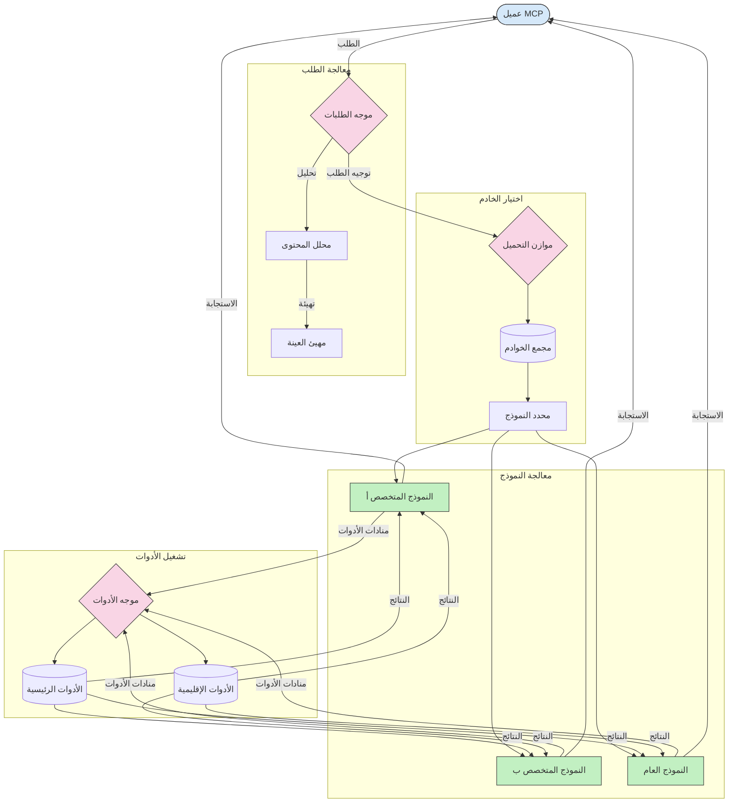

# التوجيه في بروتوكول سياق النموذج

التوجيه ضروري لتوجيه الطلبات إلى النماذج أو الأدوات أو الخدمات المناسبة داخل نظام MCP.

## المقدمة

يشمل التوجيه في بروتوكول سياق النموذج (MCP) توجيه الطلبات إلى النماذج أو الخدمات الأنسب بناءً على معايير مختلفة مثل نوع المحتوى، وسياق المستخدم، وحمولة النظام. هذا يضمن معالجة فعالة واستخدام أمثل للموارد.

## أهداف التعلم

بنهاية هذا الدرس، ستكون قادرًا على:

- فهم مبادئ التوجيه في MCP.
- تنفيذ التوجيه بناءً على المحتوى لتوجيه الطلبات إلى خدمات متخصصة.
- تطبيق استراتيجيات ذكية لتوزيع الحمل لتحسين استخدام الموارد.
- تنفيذ التوجيه الديناميكي للأدوات بناءً على سياق الطلب.

## التوجيه بناءً على المحتوى

التوجيه بناءً على المحتوى يوجه الطلبات إلى خدمات متخصصة بناءً على محتوى الطلب. على سبيل المثال، يمكن توجيه الطلبات المتعلقة بتوليد الشفرة إلى نموذج شفرة متخصص، بينما يمكن إرسال طلبات الكتابة الإبداعية إلى نموذج كتابة إبداعية.

لننظر إلى مثال تنفيذ بلغات برمجة مختلفة.

<details>
<summary>.NET</summary>

```csharp
// .NET Example: Content-based routing in MCP
public class ContentBasedRouter
{
    private readonly Dictionary<string, McpClient> _specializedClients;
    private readonly RoutingClassifier _classifier;
    
    public ContentBasedRouter()
    {
        // Initialize specialized clients for different domains
        _specializedClients = new Dictionary<string, McpClient>
        {
            ["code"] = new McpClient("https://code-specialized-mcp.com"),
            ["creative"] = new McpClient("https://creative-specialized-mcp.com"),
            ["scientific"] = new McpClient("https://scientific-specialized-mcp.com"),
            ["general"] = new McpClient("https://general-mcp.com")
        };
        
        // Initialize content classifier
        _classifier = new RoutingClassifier();
    }
    
    public async Task<McpResponse> RouteAndProcessAsync(string prompt, IDictionary<string, object> parameters = null)
    {
        // Classify the prompt to determine the best specialized service
        string category = await _classifier.ClassifyPromptAsync(prompt);
        
        // Get the appropriate client or fall back to general
        var client = _specializedClients.ContainsKey(category) 
            ? _specializedClients[category] 
            : _specializedClients["general"];
            
        Console.WriteLine($"Routing request to {category} specialized service");
        
        // Send request to the selected service
        return await client.SendPromptAsync(prompt, parameters);
    }
    
    // Simple classifier for routing decisions
    private class RoutingClassifier
    {
        public Task<string> ClassifyPromptAsync(string prompt)
        {
            prompt = prompt.ToLowerInvariant();
            
            if (prompt.Contains("code") || prompt.Contains("function") || 
                prompt.Contains("program") || prompt.Contains("algorithm"))
            {
                return Task.FromResult("code");
            }
            
            if (prompt.Contains("story") || prompt.Contains("creative") || 
                prompt.Contains("imagine") || prompt.Contains("design"))
            {
                return Task.FromResult("creative");
            }
            
            if (prompt.Contains("science") || prompt.Contains("research") || 
                prompt.Contains("analyze") || prompt.Contains("study"))
            {
                return Task.FromResult("scientific");
            }
            
            return Task.FromResult("general");
        }
    }
}
```

في الشفرة السابقة، قمنا بـ:

- إنشاء فئة `ContentBasedRouter` التي توجه الطلبات بناءً على محتوى المطالبة.
- تهيئة عملاء متخصصين لمجالات مختلفة (الشفرة، الإبداع، العلمي، العام).
- تنفيذ مصنف بسيط يحدد فئة المطالبة ويوجهها إلى الخدمة المتخصصة المناسبة.
- استخدام آلية استعاضة لتوجيه الطلبات إلى خدمة عامة إذا لم تتوفر خدمة متخصصة.
- تنفيذ معالجة غير متزامنة للتعامل مع الطلبات بكفاءة.
- استخدام قاموس لربط فئات المحتوى بعملاء MCP متخصصين.
- تنفيذ مصنف بسيط يحلل المطالبة ويعيد الفئة المناسبة.
- استخدام العميل المتخصص لإرسال الطلب وتلقي الرد.
- معالجة الحالات التي لا تتطابق فيها المطالبة مع أي فئة متخصصة من خلال التوجيه إلى خدمة عامة.

</details>

## توزيع الحمل الذكي

توزيع الحمل يعمل على تحسين استخدام الموارد وضمان توفر عالي لخدمات MCP. هناك طرق مختلفة لتنفيذ توزيع الحمل، مثل التوزيع بالتناوب، استجابة موزنة الوزن، أو استراتيجيات واعية للمحتوى.

لننظر في المثال أدناه الذي يستخدم الاستراتيجيات التالية:

- **التوزيع بالتناوب**: يوزع الطلبات بالتساوي عبر الخوادم المتاحة.
- **استجابة موزنة الوزن**: يوجه الطلبات إلى الخوادم بناءً على متوسط وقت استجابتهم.
- **واعي المحتوى**: يوجه الطلبات إلى خوادم متخصصة بناءً على محتوى الطلب.

<details>
<summary>Java</summary>

```java
// مثال جافا: التوازن الذكي للحمل لخوادم MCP
public class McpLoadBalancer {
    private final List<McpServerNode> serverNodes;
    private final LoadBalancingStrategy strategy;
    
    public McpLoadBalancer(List<McpServerNode> nodes, LoadBalancingStrategy strategy) {
        this.serverNodes = new ArrayList<>(nodes);
        this.strategy = strategy;
    }
    
    public McpResponse processRequest(McpRequest request) {
        // اختيار أفضل خادم بناءً على الاستراتيجية
        McpServerNode selectedNode = strategy.selectNode(serverNodes, request);
        
        try {
            // توجيه الطلب إلى العقدة المختارة
            return selectedNode.processRequest(request);
        } catch (Exception e) {
            // التعامل مع الفشل - تنفيذ المنطق إعادة المحاولة أو الخطة البديلة
            System.err.println("Error processing request on node " + selectedNode.getId() + ": " + e.getMessage());
            
            // وسم العقدة كغير صحية محتملة
            selectedNode.recordFailure();
            
            // تجربة العقدة التالية الأفضل كخطة بديلة
            List<McpServerNode> remainingNodes = new ArrayList<>(serverNodes);
            remainingNodes.remove(selectedNode);
            
            if (!remainingNodes.isEmpty()) {
                McpServerNode fallbackNode = strategy.selectNode(remainingNodes, request);
                return fallbackNode.processRequest(request);
            } else {
                throw new RuntimeException("All MCP server nodes failed to process the request");
            }
        }
    }
    
    // مهمة فحص صحة العقدة
    public void startHealthChecks(Duration interval) {
        ScheduledExecutorService scheduler = Executors.newScheduledThreadPool(1);
        scheduler.scheduleAtFixedRate(() -> {
            for (McpServerNode node : serverNodes) {
                try {
                    boolean isHealthy = node.checkHealth();
                    System.out.println("Node " + node.getId() + " health status: " + 
                                      (isHealthy ? "HEALTHY" : "UNHEALTHY"));
                } catch (Exception e) {
                    System.err.println("Health check failed for node " + node.getId());
                    node.setHealthy(false);
                }
            }
        }, 0, interval.toMillis(), TimeUnit.MILLISECONDS);
    }
    
    // واجهة لاستراتيجيات موازنة الحمل
    public interface LoadBalancingStrategy {
        McpServerNode selectNode(List<McpServerNode> nodes, McpRequest request);
    }
    
    // استراتيجية التناوب الدوري
    public static class RoundRobinStrategy implements LoadBalancingStrategy {
        private AtomicInteger counter = new AtomicInteger(0);
        
        @Override
        public McpServerNode selectNode(List<McpServerNode> nodes, McpRequest request) {
            List<McpServerNode> healthyNodes = nodes.stream()
                .filter(McpServerNode::isHealthy)
                .collect(Collectors.toList());
            
            if (healthyNodes.isEmpty()) {
                throw new RuntimeException("No healthy nodes available");
            }
            
            int index = counter.getAndIncrement() % healthyNodes.size();
            return healthyNodes.get(index);
        }
    }
    
    // استراتيجية وقت الاستجابة الموزون
    public static class ResponseTimeStrategy implements LoadBalancingStrategy {
        @Override
        public McpServerNode selectNode(List<McpServerNode> nodes, McpRequest request) {
            return nodes.stream()
                .filter(McpServerNode::isHealthy)
                .min(Comparator.comparing(McpServerNode::getAverageResponseTime))
                .orElseThrow(() -> new RuntimeException("No healthy nodes available"));
        }
    }
    
    // استراتيجية مدركة للمحتوى
    public static class ContentAwareStrategy implements LoadBalancingStrategy {
        @Override
        public McpServerNode selectNode(List<McpServerNode> nodes, McpRequest request) {
            // تحديد خصائص الطلب
            boolean isCodeRequest = request.getPrompt().contains("code") || 
                                   request.getAllowedTools().contains("codeInterpreter");
            
            boolean isCreativeRequest = request.getPrompt().contains("creative") || 
                                       request.getPrompt().contains("story");
            
            // العثور على العقد المتخصصة
            Optional<McpServerNode> specializedNode = nodes.stream()
                .filter(McpServerNode::isHealthy)
                .filter(node -> {
                    if (isCodeRequest && node.getSpecialization().equals("code")) {
                        return true;
                    }
                    if (isCreativeRequest && node.getSpecialization().equals("creative")) {
                        return true;
                    }
                    return false;
                })
                .findFirst();
            
            // إرجاع العقدة المتخصصة أو العقدة الأقل حملًا
            return specializedNode.orElse(
                nodes.stream()
                    .filter(McpServerNode::isHealthy)
                    .min(Comparator.comparing(McpServerNode::getCurrentLoad))
                    .orElseThrow(() -> new RuntimeException("No healthy nodes available"))
            );
        }
    }
}
```

في الشفرة السابقة، قمنا بـ:

- إنشاء فئة `McpLoadBalancer` التي تدير قائمة من عقد خوادم MCP وتوجه الطلبات بناءً على استراتيجية توزيع الحمل المختارة.
- تنفيذ استراتيجيات توزيع حمل مختلفة: `RoundRobinStrategy`، `ResponseTimeStrategy`، و `ContentAwareStrategy`.
- استخدام `ScheduledExecutorService` لفحص صحة عقد الخوادم بشكل دوري.
- تنفيذ آلية فحص صحة تضع العلامات على العقد بصحة أو عدم صحة بناءً على استجابتها لعمليات الفحص.
- معالجة طلبات مع التعامل مع الأخطاء ومنطق الاستعاضة لضمان توفر عالي.
- استخدام فئة `McpServerNode` لتمثيل عقد خادم MCP فردية، بما في ذلك حالة صحتها ومتوسط وقت الاستجابة والحمل الحالي.
- تنفيذ فئة `McpRequest` لتغليف تفاصيل الطلب مثل المطالبة والأدوات المسموح بها.
- استخدام Java Streams لترشيح واختيار العقد بناءً على حالة الصحة والتخصص.

</details>

## التوجيه الديناميكي للأدوات

توجيه الأدوات يضمن أن استدعاءات الأدوات توجه إلى الخدمة الأنسب بناءً على السياق. على سبيل المثال، قد يحتاج استدعاء أداة الطقس إلى التوجيه إلى نقطة نهاية إقليمية بناءً على موقع المستخدم، أو قد يحتاج استدعاء أداة الحاسبة إلى استخدام نسخة محددة من واجهة برمجة التطبيقات.

لنلقي نظرة على مثال تنفيذ يوضح التوجيه الديناميكي للأدوات بناءً على تحليل الطلب، نقاط النهاية الإقليمية، ودعم الترقيم.

<details>
<summary>Python</summary>

```python
# مثال بايثون: توجيه الأدوات الديناميكي بناءً على تحليل الطلب
class McpToolRouter:
    def __init__(self):
        # تسجيل نقاط نهاية الأدوات المتاحة
        self.tool_endpoints = {
            "weatherTool": "https://weather-service.example.com/api",
            "calculatorTool": "https://calculator-service.example.com/compute",
            "databaseTool": "https://database-service.example.com/query",
            "searchTool": "https://search-service.example.com/search"
        }
        
        # نقاط نهاية إقليمية للتوزيع العالمي
        self.regional_endpoints = {
            "us": {
                "weatherTool": "https://us-west.weather-service.example.com/api",
                "searchTool": "https://us.search-service.example.com/search"
            },
            "europe": {
                "weatherTool": "https://eu.weather-service.example.com/api",
                "searchTool": "https://eu.search-service.example.com/search"
            },
            "asia": {
                "weatherTool": "https://asia.weather-service.example.com/api",
                "searchTool": "https://asia.search-service.example.com/search"
            }
        }
        
        # دعم إصدار الأدوات
        self.tool_versions = {
            "weatherTool": {
                "default": "v2",
                "v1": "https://weather-service.example.com/api/v1",
                "v2": "https://weather-service.example.com/api/v2",
                "beta": "https://weather-service.example.com/api/beta"
            }
        }
    
    async def route_tool_request(self, tool_name, parameters, user_context=None):
        """Route a tool request to the appropriate endpoint based on context"""
        endpoint = self._select_endpoint(tool_name, parameters, user_context)
        
        if not endpoint:
            raise ValueError(f"No endpoint available for tool: {tool_name}")
        
        # تنفيذ الطلب الفعلي إلى نقطة النهاية المختارة
        return await self._execute_tool_request(endpoint, tool_name, parameters)
    
    def _select_endpoint(self, tool_name, parameters, user_context=None):
        """Select the most appropriate endpoint based on context"""
        # نقطة النهاية الأساسية من السجل
        if tool_name not in self.tool_endpoints:
            return None
            
        base_endpoint = self.tool_endpoints[tool_name]
        
        # التحقق مما إذا كنا بحاجة لاستخدام إصدار أداة محدد
        if tool_name in self.tool_versions:
            version_info = self.tool_versions[tool_name]
            
            # استخدام الإصدار المحدد أو الافتراضي
            requested_version = parameters.get("_version", version_info["default"])
            if requested_version in version_info:
                base_endpoint = version_info[requested_version]
        
        # التحقق من التوجيه الإقليمي إذا كان من المعروف منطقة المستخدم
        if user_context and "region" in user_context:
            user_region = user_context["region"]
            
            if user_region in self.regional_endpoints:
                regional_tools = self.regional_endpoints[user_region]
                
                if tool_name in regional_tools:
                    # استخدام نقطة نهاية خاصة بالمنطقة
                    return regional_tools[tool_name]
        
        # التحقق من متطلبات إقامة البيانات
        if user_context and "data_residency" in user_context:
            # هذا سينفذ منطق لضمان بقاء البيانات في الولاية القضائية المحددة
            pass
        
        # التحقق من التوجيه بناءً على زمن الاستجابة
        if user_context and "latency_sensitive" in user_context and user_context["latency_sensitive"]:
            # هذا سينفذ منطق اختيار نقطة النهاية ذات أقل زمن استجابة
            pass
            
        return base_endpoint
        
    async def _execute_tool_request(self, endpoint, tool_name, parameters):
        """Execute the actual tool request to the selected endpoint"""
        try:
            async with aiohttp.ClientSession() as session:
                async with session.post(
                    endpoint,
                    json={"toolName": tool_name, "parameters": parameters},
                    headers={"Content-Type": "application/json"}
                ) as response:
                    if response.status == 200:
                        result = await response.json()
                        return result
                    else:
                        error_text = await response.text()
                        raise Exception(f"Tool execution failed: {error_text}")
        except Exception as e:
            # تنفيذ منطق إعادة المحاولة أو استراتيجية التراجع
            print(f"Error executing tool {tool_name} at {endpoint}: {str(e)}")
            raise
```

في الشفرة السابقة، قمنا بـ:

- إنشاء فئة `McpToolRouter` التي تدير توجيه الأدوات بناءً على تحليل الطلب، نقاط النهاية الإقليمية، ودعم الترقيم.
- تسجيل نقاط النهاية المتاحة للأدوات والنقاط الإقليمية للتوزيع العالمي.
- تنفيذ منطق التوجيه الديناميكي الذي يختار النقطة النهائية المناسبة استنادًا إلى سياق المستخدم، مثل المنطقة ومتطلبات إقامة البيانات.
- تنفيذ دعم الترقيم للأدوات، مما يسمح للمستخدمين بتحديد أي نسخة من الأداة يرغبون في استخدامها.
- استخدام طلبات HTTP غير متزامنة لتنفيذ استدعاءات الأدوات والتعامل مع الردود.

</details>

## المعمارية للعينة والتوجيه في MCP

العينات هي مكون حيوي في بروتوكول سياق النموذج (MCP) يسمح بمعالجة الطلبات وتوجيهها بكفاءة. يشمل ذلك تحليل الطلبات الواردة لتحديد النموذج أو الخدمة الأنسب للتعامل معها، استنادًا إلى معايير مختلفة مثل نوع المحتوى، وسياق المستخدم، وحمولة النظام.

يمكن دمج العينات والتوجيه لإنشاء معمارية قوية تعمل على تحسين استخدام الموارد وضمان توفر عالي. يمكن استخدام عملية العينة لتصنيف الطلبات، بينما يقوم التوجيه بتوجيهها إلى النماذج أو الخدمات المناسبة.

الرسم التوضيحي أدناه يبين كيف تعمل العينات والتوجيه معًا في معمارية MCP شاملة:



## ماذا بعد

- [5.6 العينة](../mcp-sampling/README.md)

---

<!-- CO-OP TRANSLATOR DISCLAIMER START -->
**تنويه**:
تمت ترجمة هذا المستند باستخدام خدمة الترجمة بالذكاء الاصطناعي [Co-op Translator](https://github.com/Azure/co-op-translator). بينما نسعى للدقة، يرجى العلم أن الترجمات الآلية قد تحتوي على أخطاء أو عدم دقة. يجب اعتبار المستند الأصلي بلغته الأصلية المصدر الرسمي والمعتمد. للمعلومات الهامة، يُنصح بالاستعانة بترجمة بشرية محترفة. نحن غير مسؤولين عن أي سوء فهم أو تفسير ناتج عن استخدام هذه الترجمة.
<!-- CO-OP TRANSLATOR DISCLAIMER END -->