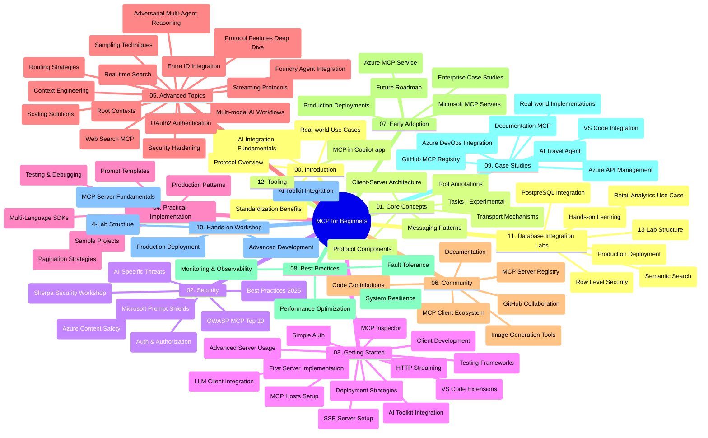

# بروتوكول سياق النموذج (MCP) للمبتدئين - دليل الدراسة

يقدم هذا الدليل الدراسي نظرة عامة على هيكل ومستوى محتوى المستودع لمنهج "بروتوكول سياق النموذج (MCP) للمبتدئين". استخدم هذا الدليل للتنقل داخل المستودع بكفاءة والاستفادة القصوى من الموارد المتاحة.

## نظرة عامة على المستودع

بروتوكول سياق النموذج (MCP) هو إطار معياري للتفاعلات بين نماذج الذكاء الاصطناعي وتطبيقات العميل. تم إنشاؤه في البداية بواسطة Anthropic، ويُدار حاليًا من قبل مجتمع MCP الأوسع عبر منظمة GitHub الرسمية. يوفر هذا المستودع منهجًا شاملاً مع أمثلة عملية على الشفرات بلغات C#، Java، JavaScript، Python، وTypeScript، مصممًا لمطوري الذكاء الاصطناعي، ومهندسي الأنظمة، ومهندسي البرمجيات.

## خريطة المنهج المرئية

## هيكل المستودع

تم تنظيم المستودع في اثني عشر قسمًا رئيسيًا، كل منها يركز على جوانب مختلفة من MCP:

1. **المقدمة (00-Introduction/)**
   - نظرة عامة على بروتوكول سياق النموذج
   - أهمية التوحيد في خطوط أنابيب الذكاء الاصطناعي
   - حالات الاستخدام العملية والفوائد

2. **المفاهيم الأساسية (01-CoreConcepts/)**
   - بنية العميل والخادم
   - مكونات البروتوكول الأساسية
   - أنماط المراسلة في MCP
   - النظرة المستقبلية: [ما الذي يتغير في MCP: النسخة التجريبية الصادرة بتاريخ 2026-07-28](./01-CoreConcepts/mcp-2026-07-28-release-candidate.md) — نواة البروتوكول بدون حالة، إطار التمديدات، وإيقاف دعم الجذور / السحب / التسجيل المتوقع في الإصدار التالي للمواصفة

3. **الأمان (02-Security/)**
   - تهديدات الأمان في أنظمة MCP
   - أفضل الممارسات لتأمين التطبيقات
   - استراتيجيات التوثيق والتفويض
   - **توثيق أمني شامل**:
     - أفضل ممارسات أمان MCP لعام 2025
     - دليل تنفيذ أمان محتوى Azure
     - ضوابط وتقنيات أمان MCP
     - مرجع سريع لأفضل ممارسات MCP
   - **الموضوعات الأمنية الرئيسية**:
     - هجمات حقن المطالبات وتسميم الأدوات
     - اختطاف الجلسة ومشاكل الوكيل المضلل
     - ثغرات تمرير الرموز
     - الأذونات المفرطة والتحكم في الوصول
     - أمان سلسلة التوريد لمكونات الذكاء الاصطناعي
     - دمج دروع Microsoft Prompt

4. **البدء السريع (03-GettingStarted/)**
   - إعداد البيئة والتكوين
   - إنشاء خوادم وعملاء MCP الأساسية
   - التكامل مع التطبيقات القائمة
   - يشمل أقسامًا لـ:
     - تنفيذ الخادم الأول
     - تطوير العميل
     - تكامل عميل LLM
     - تكامل VS Code
     - خادم إرسال الأحداث (SSE)
     - استخدام الخادم المتقدم
     - البث عبر HTTP
     - تكامل أدوات الذكاء الاصطناعي
     - استراتيجيات الاختبار
     - إرشادات النشر

5. **التنفيذ العملي (04-PracticalImplementation/)**
   - استخدام SDK عبر لغات البرمجة المختلفة
   - تقنيات التصحيح، الاختبار، والتحقق
   - إعداد قوالب ومخططات مطالبات قابلة لإعادة الاستخدام
   - مشاريع نموذجية مع أمثلة تنفيذية

6. **المواضيع المتقدمة (05-AdvancedTopics/)**
   - تقنيات هندسة السياق
   - تكامل وكيل Foundry
   - سير عمل الذكاء الاصطناعي متعدد الوسائط
   - عروض التوثيق OAuth2
   - إمكانيات البحث في الوقت الحقيقي
   - البث في الوقت الحقيقي
   - تنفيذ سياقات الجذر
   - استراتيجيات التوجيه
   - تقنيات العينة
   - نهج التوسع
   - اعتبارات الأمان
   - دمج أمان Entra ID
   - دمج البحث على الويب
   - التفكير التنافسي متعدد الوكلاء (أنماط النقاش)

7. **مساهمات المجتمع (06-CommunityContributions/)**
   - كيفية المساهمة بالشيفرة والتوثيق
   - التعاون عبر GitHub
   - التحسينات والتعليقات التي يقودها المجتمع
   - استخدام عملاء MCP المختلفين (Claude Desktop, Cline, VSCode)
   - العمل مع خوادم MCP الشهيرة بما في ذلك توليد الصور

8. **دروس من التبني المبكر (07-LessonsfromEarlyAdoption/)**
   - تنفيذات وقصص نجاح من العالم الحقيقي
   - بناء ونشر حلول تعتمد على MCP
   - الاتجاهات وخارطة الطريق المستقبلية
   - **دليل خوادم MCP من Microsoft**: دليل شامل لـ 10 خوادم MCP جاهزة للإنتاج من Microsoft تشمل:
     - دليل خادم MCP من Microsoft Learn Docs
     - خادم MCP من Azure (أكثر من 15 موصلًا متخصصًا)
     - خادم MCP من GitHub
     - خادم MCP من Azure DevOps
     - خادم MCP MarkItDown
     - خادم MCP من SQL Server
     - خادم MCP من Playwright
     - خادم MCP من Dev Box
     - خادم MCP من Microsoft Foundry
     - خادم MCP من Microsoft 365 Agents Toolkit

9. **أفضل الممارسات (08-BestPractices/)**
   - تحسين الأداء والمعايرة
   - تصميم أنظمة MCP مقاومة للأخطاء
   - استراتيجيات الاختبار والمرونة

10. **دراسات حالة (09-CaseStudy/)**
    - **سبع دراسات حالة شاملة** توضح تنوع استخدام MCP عبر سيناريوهات مختلفة:
    - **وكلاء السفر في Azure AI**: تنسيق متعدد الوكلاء مع Azure OpenAI و AI Search
    - **تكامل Azure DevOps**: أتمتة عمليات سير العمل مع تحديثات بيانات YouTube
    - **استخراج الوثائق في الوقت الفعلي**: عميل وحدة تحكم Python مع بث HTTP
    - **مولد خطة الدراسة التفاعلي**: تطبيق ويب Chainlit مع ذكاء اصطناعي حواري
    - **التوثيق داخل المحرر**: تكامل VS Code مع سير عمل GitHub Copilot
    - **إدارة API من Azure**: تكامل API للشركات مع إنشاء خوادم MCP
    - **سجل MCP من GitHub**: تطوير النظام البيئي ومنصة التكامل الوكيلة
    - أمثلة تنفيذية تشمل التكامل المؤسسي، إنتاجية المطور، وتطوير النظام البيئي

11. **ورشة عمل عملية (10-StreamliningAIWorkflowsBuildingAnMCPServerWithAIToolkit/)**
    - ورشة عمل شاملة تجمع بين MCP وأدوات الذكاء الاصطناعي
    - بناء تطبيقات ذكية تربط نماذج الذكاء الاصطناعي بالأدوات الواقعية
    - وحدات عملية تغطي الأساسيات، تطوير الخادم المخصص، واستراتيجيات النشر للإنتاج
    - **هيكل المختبر**:
      - المختبر 1: أساسيات خادم MCP
      - المختبر 2: تطوير خادم MCP المتقدم
      - المختبر 3: تكامل أدوات الذكاء الاصطناعي
      - المختبر 4: النشر والإ масштаб الإنتاجي
    - نهج التعلم القائم على المختبر مع تعليمات خطوة بخطوة

12. **مختبرات تكامل قاعدة بيانات خادم MCP (11-MCPServerHandsOnLabs/)**
    - **مسار تعلم شامل مكون من 13 مختبرًا** لبناء خوادم MCP جاهزة للإنتاج مع تكامل PostgreSQL
    - **تنفيذ تحليلات التجزئة في العالم الحقيقي** باستخدام حالة استخدام Zava Retail
    - **أنماط متقدمة للمؤسسات** تشمل أمان مستوى الصف Row Level Security (RLS)، البحث الدلالي، والوصول متعدد المستأجرين للبيانات
    - **هيكل المختبر الكامل**:
      - **المختبرات 00-03: الأساسيات** - المقدمة، الهندسة المعمارية، الأمان، إعداد البيئة
      - **المختبرات 04-06: بناء خادم MCP** - تصميم قاعدة البيانات، تنفيذ خادم MCP، تطوير الأدوات
      - **المختبرات 07-09: الميزات المتقدمة** - البحث الدلالي، الاختبار والتصحيح، تكامل VS Code

      - **المختبرات 10-12: الإنتاج وأفضل الممارسات** - النشر، المراقبة، التحسين
    - **التقنيات المغطاة**: إطار عمل FastMCP،  PostgreSQL، Azure OpenAI، Azure Container Apps، Application Insights
    - **نتائج التعلم**: خوادم MCP جاهزة للإنتاج، أنماط دمج قواعد البيانات، تحليلات مدعومة بالذكاء الاصطناعي، أمان المؤسسات

13. **الأدوات (12-tooling/)**
    - تعلّم كيفية استخدام MCP في تطبيق Copilot وأدوات أخرى

## مصادر إضافية

يحتوي المستودع على موارد داعمة:

- **مجلد الصور**: يحتوي على المخططات والرسوم التوضيحية المستخدمة في جميع أرجاء المنهج
- **الترجمات**: دعم متعدد اللغات مع ترجمات مؤتمتة للوثائق
- **الموارد الرسمية لـ MCP**:
  - [توثيق MCP](https://modelcontextprotocol.io/)
  - [مواصفات MCP](https://spec.modelcontextprotocol.io/)
  - [مستودع MCP على GitHub](https://github.com/modelcontextprotocol)

## كيف تستخدم هذا المستودع

1. **التعلم المتسلسل**: اتبع الفصول بالترتيب (من 00 إلى 11) لتجربة تعلم منظمة.
2. **التركيز على لغة محددة**: إذا كنت مهتمًا بلغة برمجة معينة، استكشف مجلدات العينات لتجد تطبيقات بلغتك المفضلة.
3. **التطبيق العملي**: ابدأ بقسم "البدء" لإعداد بيئتك وإنشاء أول خادم MCP وعميل.
4. **الاستكشاف المتقدم**: بمجرد أن تتقن الأساسيات، انغمس في المواضيع المتقدمة لتوسيع معرفتك.
5. **المشاركة المجتمعية**: انضم إلى مجتمع MCP عبر مناقشات GitHub وقنوات Discord للتواصل مع الخبراء والمطورين الآخرين.

## عملاء وأدوات MCP

يغطي المنهج عملاء وأدوات MCP المتنوعة:

1. **العملاء الرسميون**:
   - Visual Studio Code 
   - MCP في Visual Studio Code
   - Claude Desktop
   - Claude في VSCode 
   - Claude API

2. **عملاء المجتمع**:
   - Cline (معتمد على الطرفية)
   - Cursor (محرر الأكواد)
   - ChatMCP
   - Windsurf

3. **أدوات إدارة MCP**:
   - MCP CLI
   - MCP Manager
   - MCP Linker
   - MCP Router

## خوادم MCP الشهيرة

يقدم المستودع خوادم MCP متنوعة، منها:

1. **خوادم MCP الرسمية من مايكروسوفت**:
   - خادم Microsoft Learn Docs MCP
   - خادم Azure MCP (أكثر من 15 موصل متخصص)
   - خادم GitHub MCP
   - خادم Azure DevOps MCP
   - خادم MarkItDown MCP
   - خادم SQL Server MCP
   - خادم Playwright MCP
   - خادم Dev Box MCP
   - خادم Microsoft Foundry MCP
   - خادم أدوات وكلاء Microsoft 365 MCP

2. **خوادم مرجعية رسمية**:
   - نظام الملفات
   - Fetch
   - الذاكرة
   - التفكير التتابعي

3. **توليد الصور**:
   - Azure OpenAI DALL-E 3
   - Stable Diffusion WebUI
   - Replicate

4. **أدوات التطوير**:
   - Git MCP
   - التحكم في الطرفية
   - مساعد الأكواد

5. **خوادم متخصصة**:
   - Salesforce
   - Microsoft Teams
   - Jira و Confluence

## المساهمة

يرحب هذا المستودع بالمساهمات من المجتمع. راجع قسم مساهمات المجتمع للحصول على إرشادات حول كيفية المساهمة بفعالية في نظام MCP البيئي.

----

*تم تحديث دليل الدراسة هذا آخر مرة في 5 فبراير 2026، يعكس أحدث مواصفات MCP 2025-11-25 ويوفر نظرة عامة على المستودع حتى ذلك التاريخ. قد يتم تحديث محتوى المستودع بعد هذا التاريخ.*

*ملاحظة إضافية (2 يوليو 2026): تم إضافة درس حول نسخة مرشح إصدار مواصفات MCP `2026-07-28` ضمن [01-CoreConcepts](./01-CoreConcepts/mcp-2026-07-28-release-candidate.md); يبقى أساس المنهج المواصفات 2025-11-25 حتى صدور المواصفات الجديدة.*

---

<!-- CO-OP TRANSLATOR DISCLAIMER START -->
**تنويه**:
تمت ترجمة هذا المستند باستخدام خدمة الترجمة بالذكاء الاصطناعي [Co-op Translator](https://github.com/Azure/co-op-translator). بينما نسعى للدقة، يرجى العلم أن الترجمات الآلية قد تحتوي على أخطاء أو عدم دقة. يجب اعتبار المستند الأصلي بلغته الأصلية المصدر الرسمي والمعتمد. للمعلومات الهامة، يُنصح بالاستعانة بترجمة بشرية محترفة. نحن غير مسؤولين عن أي سوء فهم أو تفسير ناتج عن استخدام هذه الترجمة.
<!-- CO-OP TRANSLATOR DISCLAIMER END -->