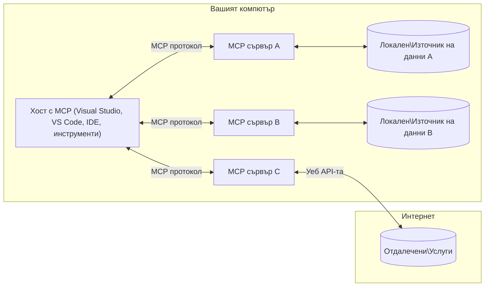

# Основни концепции на MCP: Съвършенстване на протокола за контекст на модела за интеграция на AI

[](https://youtu.be/earDzWGtE84)

_(Кликнете върху горното изображение, за да гледате видеото на този урок)_

[Model Context Protocol (MCP)](https://github.com/modelcontextprotocol) е мощна, стандартизирана рамка, която оптимизира комуникацията между големи езикови модели (LLMs) и външни инструменти, приложения и източници на данни. 
Този наръчник ще ви преведе през основните концепции на MCP. Ще научите за клиент-сървърната му архитектура, основните компоненти, механиката на комуникация и най-добрите практики за внедряване.

- **Изрично потребителско съгласие**: Всички достъпи до данни и операции изискват изрично одобрение от потребителя преди изпълнение. Потребителите трябва ясно да разбират кои данни ще бъдат достъпвани и какви действия ще се извършат, с детайлен контрол върху разрешенията и авторизациите.

- **Защита на поверителността на данните**: Потребителските данни се предоставят само с изрично съгласие и трябва да бъдат защитени с надеждни контролни мерки за достъп през целия жизнен цикъл на взаимодействието. Внедряванията трябва да предотвратяват неупълномощена трансмисия на данни и да поддържат строги граници на поверителност.

- **Безопасност при изпълнение на инструменти**: Всяко извикване на инструмент изисква изрично потребителско съгласие с ясно разбиране на функционалността на инструмента, параметрите и потенциалното въздействие. Надеждни мерки за сигурност трябва да предотвратяват нежелано, несигурно или злонамерено изпълнение на инструмента.

- **Сигурност на транспортния слой**: Всички комуникационни канали трябва да използват подходящи механизми за шифроване и удостоверяване. Отдалечените връзки трябва да използват защитени транспортни протоколи и правилно управление на идентификационните данни.

#### Насоки за внедряване:

- **Управление на разрешения**: Внедрете фини системи за разрешения, които позволяват на потребителите да контролират кои сървъри, инструменти и ресурси са достъпни
- **Удостоверяване и авторизация**: Използвайте сигурни методи за удостоверяване (OAuth, API ключове) с правилно управление на токени и срокове на валидност  
- **Валидация на входните данни**: Проверявайте всички параметри и входни данни според дефинирани схеми, за да предотвратите инжекционни атаки
- **Одитен журнал**: Поддържайте изчерпателни логове на всички операции за наблюдение на сигурността и съответствие

## Обзор

Този урок разглежда фундаменталната архитектура и компоненти, които изграждат екосистемата на Model Context Protocol (MCP). Ще научите за клиент-сървърната архитектура, ключовите компоненти и механизма на комуникация, които захранват взаимодействията в MCP.

## Основни учебни цели

Към края на урока ще:

- Разберете клиент-сървърната архитектура на MCP.
- Идентифицирате ролите и отговорностите на Хостове, Клиенти и Сървъри.
- Анализирате основните характеристики, които правят MCP гъвкав слой за интеграция.
- Научите как информацията тече в екосистемата на MCP.
- Придобиете практическа представа чрез примерен код на .NET, Java, Python и JavaScript.

## Архитектура на MCP: По-дълбок поглед

Екосистемата на MCP е изградена на модел клиент-сървър. Тази модулна структура позволява на AI приложенията да взаимодействат ефективно с инструменти, бази данни, API и контекстуални ресурси. Нека разгледаме тази архитектура през основните ѝ компоненти.

В своята основа MCP следва клиент-сървърна архитектура, при която хост приложение може да се свърже с множество сървъри:



- **MCP Хостове**: Програми като VSCode, Claude Desktop, IDE или AI инструменти, които искат да получат достъп до данни чрез MCP
- **MCP Клиенти**: Протоколни клиенти, които поддържат 1:1 връзки със сървъри
- **MCP Сървъри**: Лекотоварни програми, които всеки предоставя специфични възможности чрез стандартизирания Model Context Protocol
- **Локални източници на данни**: Файлове, бази данни и услуги на вашия компютър, до които MCP сървърите могат да имат сигурен достъп
- **Отдалечени услуги**: Външни системи, достъпни през интернет, към които MCP сървърите могат да се свържат чрез API

Протоколът MCP е развиващ се стандарт с версии, базирани на дати (формат ГГГГ-ММ-ДД). Настоящата версия на протокола е **2025-11-25**. Можете да видите последните актуализации в [спецификацията на протокола](https://modelcontextprotocol.io/specification/2025-11-25/)

> **В бъдеще:** кандидат за издание на следващата версия на спецификацията, **2026-07-28**, бе обявен през май 2026 г. и е планиран за излизане на 28 юли 2026 г. Той прави протокола безсъстояниев на транспортния слой (премахвайки `initialize` ръкостискане и идентификатори на сесии), формализира рамката за Extensions и премахва Roots, Sampling и Logging в полза на нови модели. Вижте [Какво се променя в MCP: Кандидат за издание 2026-07-28](./mcp-2026-07-28-release-candidate.md) за пълен преглед.

### 1. Хостове

В Model Context Protocol (MCP), **Хостове** са AI приложенията, които служат като основен интерфейс, чрез който потребителите взаимодействат с протокола. Хостовете координират и управляват връзките с множество MCP сървъри, създавайки специални MCP клиенти за всяка сървърна връзка. Примери за хостове включват:

- **AI приложения**: Claude Desktop, Visual Studio Code, Claude Code
- **Среда за разработка**: IDE и редактори за код с интеграция на MCP  
- **Персонализирани приложения**: Специализирани AI агенти и инструменти

**Хостове** са приложения, които координират взаимодействията с AI модели. Те:

- **Оркестрират AI модели**: Изпълняват или взаимодействат с LLM, за да генерират отговори и координират AI работни потоци
- **Управляват клиентските връзки**: Създават и поддържат по един MCP клиент за всяка сървърна връзка
- **Контролират потребителския интерфейс**: Управляват потока на разговор, потребителските взаимодействия и представянето на отговори  
- **Прилагат сигурността**: Контролират разрешения, ограничения за сигурност и удостоверяване
- **Обработват потребителското съгласие**: Управляват одобрението на потребителя за споделяне на данни и изпълнение на инструменти


### 2. Клиенти

**Клиентите** са основни компоненти, които поддържат специализирани 1:1 връзки между хостовете и MCP сървърите. Всеки MCP клиент се инстанцира от хоста, за да се свърже с конкретен MCP сървър, осигурявайки организирани и сигурни комуникационни канали. Няколко клиента позволяват на хостовете да се свързват с множество сървъри едновременно.

**Клиентите** са свързващи компоненти във вътрешността на хост приложението. Те:

- **Протоколна комуникация**: Изпращат JSON-RPC 2.0 заявки към сървъри с подкани и инструкции
- **Договаряне на възможности**: Договарят поддържаните функции и версии на протокола със сървърите при инициализация
- **Изпълнение на инструменти**: Управляват заявки за изпълнение на инструменти от модели и обработват отговори
- **Актуализации в реално време**: Обработват известия и актуализации от сървърите в реално време
- **Обработка на отговори**: Обработват и форматират отговорите от сървърите за показване на потребители

### 3. Сървъри

**Сървърите** са програми, които предоставят контекст, инструменти и възможности на MCP клиенти. Те могат да се изпълняват локално (на същия компютър като Хоста) или отдалечено (на външни платформи) и отговарят за обработката на клиентските заявки и предоставянето на структурирани отговори. Сървърите изложат специфична функционалност чрез стандартизирания Model Context Protocol.

**Сървърите** са услуги, които предоставят контекст и функционалност. Те:

- **Регистрация на функции**: Регистрират и предоставят наличните примитиви (ресурси, подкани, инструменти) на клиентите
- **Обработка на заявки**: Получават и изпълняват повиквания на инструменти, заявки за ресурси и подкани от клиентите
- **Осигуряване на контекст**: Предоставят контекстуална информация и данни за обогатяване на отговорите на модела
- **Управление на състоянието**: Поддържат състоянието на сесията и обработват интерактивни състояния при необходимост
- **Известия в реално време**: Изпращат известия за промени във възможностите и актуализации към свързани клиенти

Сървърите могат да бъдат разработени от всеки за разширяване на възможностите на модела със специализирана функционалност и поддържат както локални, така и отдалечени сценарии за внедряване.

### 4. Първични елементи на сървъра

Сървърите в Model Context Protocol (MCP) предоставят три основни **първични елемента**, които определят фундаменталните блокове за богати взаимодействия между клиенти, хостове и езикови модели. Тези примитиви посочват типовете контекстуална информация и действия, достъпни чрез протокола.

MCP сървърите могат да предоставят всякаква комбинация от следните три основни примитива:

#### Ресурси 

**Ресурсите** са източници на данни, които предоставят контекстуална информация на AI приложенията. Те представляват статично или динамично съдържание, което може да обогати разбирането и вземането на решения от модела:

- **Контекстуални данни**: Структурирана информация и контекст за използване от AI модела
- **Бази от знания**: Документални хранилища, статии, ръководства и изследователски доклади
- **Локални източници на данни**: Файлове, бази данни и информация от локалната система  
- **Външни данни**: Отговори от API, уеб услуги и данни от отдалечени системи
- **Динамично съдържание**: Данни в реално време, които се актуализират в зависимост от външни условия

Ресурсите се идентифицират чрез URI и поддържат откриване чрез методите `resources/list` и извличане чрез `resources/read`:

```text
file://documents/project-spec.md
database://production/users/schema
api://weather/current
```

#### Подкани

**Подканите** са повторно използваеми шаблони, които помагат за структуриране на взаимодействията с езиковите модели. Те предоставят стандартизирани модели за взаимодействие и шаблонирани работни потоци:

- **Взаимодействия на основата на шаблони**: Предварително структурирани съобщения и начални фрази за разговор
- **Шаблони на работни потоци**: Стандартизирани последователности за често срещани задачи и взаимодействия
- **Примери с малко входни данни**: Примерни шаблони за инструкция на модел
- **Системни подкани**: Основни подкани, които дефинират поведението и контекста на модела
- **Динамични шаблони**: Параметризирани подкани, които се адаптират към специфични контексти

Подканите поддържат заместване на променливи и могат да бъдат открити чрез `prompts/list` и извлечени с `prompts/get`:

```markdown
Generate a {{task_type}} for {{product}} targeting {{audience}} with the following requirements: {{requirements}}
```

#### Инструменти

**Инструментите** са изпълними функции, които AI моделите могат да извикват, за да извършват конкретни действия. Те представляват "глаголите" на екосистемата MCP, позволявайки на моделите да взаимодействат с външни системи:

- **Изпълними функции**: Отделни операции, които моделите могат да извикват с конкретни параметри
- **Интеграция с външни системи**: API повиквания, заявки към бази данни, файлови операции, изчисления
- **Уникална идентичност**: Всеки инструмент има различно име, описание и схема на параметрите
- **Структурирани вход и изход**: Инструментите приемат валидирани параметри и връщат структурирани, типизирани отговори
- **Възможности за действия**: Позволяват на моделите да извършват реални действия и да извличат актуални данни

Инструментите се дефинират с JSON Schema за валидиране на параметрите и се откриват чрез `tools/list` и изпълняват чрез `tools/call`. Инструментите могат да включват и **икони** като допълнителни метаданни за по-добро представяне в потребителския интерфейс.

**Анотации на инструменти**: Инструментите поддържат поведенчески анотации (например `readOnlyHint`, `destructiveHint`), които описват дали инструментът е само за четене или може да е разрушителен, което помага на клиентите да вземат информирани решения относно изпълнението на инструмента.

Примерна дефиниция на инструмент:

```typescript
server.tool(
  "search_products", 
  {
    query: z.string().describe("Search query for products"),
    category: z.string().optional().describe("Product category filter"),
    max_results: z.number().default(10).describe("Maximum results to return")
  }, 
  async (params) => {
    // Изпълнява търсене и връща структурирани резултати
    return await productService.search(params);
  }
);
```

## Клиентски примитиви

В Model Context Protocol (MCP) **клиентите** могат да предоставят примитиви, които позволяват на сървърите да заявяват допълнителни възможности от хост приложението. Тези примитиви от страна на клиента позволяват по-богати и интерактивни реализации на сървъра, които имат достъп до възможностите на езиковия модел и към взаимодействията с потребителя.

### Семплиране

> **Известие за остаряване:** Кандидатът за издание `2026-07-28` отбелязва Семплирането като остаряло в полза на директната интеграция с API на доставчици на LLM. То продължава да работи в `2025-11-25` и поне година след всяко остаряване, но новите дизайни трябва да предпочитат заместителния модел. Вижте [Какво се променя в MCP: Кандидат за издание 2026-07-28](./mcp-2026-07-28-release-candidate.md).

**Семплирането** позволява на сървърите да заявяват допълнения от езиковия модел чрез AI приложението на клиента. Този примитив дава възможност на сървърите да достъпват възможностите на LLM без да включват свои собствени зависимости за модела:

- **Независим достъп от модела**: Сървърите могат да заявяват допълнения без да включват SDK на LLM и да управляват достъпа до модела
- **AI иницииран от сървъра**: Позволява на сървърите автономно да генерират съдържание, използвайки AI модела на клиента
- **Рекурсивни взаимодействия с LLM**: Поддържа сложни сценарии, при които сървърите се нуждаят от AI помощ за обработка
- **Генериране на динамично съдържание**: Позволява на сървърите да създават контекстуални отговори, използвайки модела на хоста
- **Поддръжка на повикване на инструменти**: Сървърите могат да включват параметри `tools` и `toolChoice`, за да позволят на модела на клиента да извиква инструменти по време на семплиране

Семплирането се инициира чрез метода `sampling/complete`, където сървърите изпращат заявки за допълнения към клиентите.

### Корени

> **Известие за остаряване:** Кандидатът за издание `2026-07-28` отбелязва Корените като остарели в полза на параметрите на инструментите, URI на ресурси или конфигурация на сървъра. Те продължават да работят в `2025-11-25` и поне година след всяко остаряване. Вижте [Какво се променя в MCP: Кандидат за издание 2026-07-28](./mcp-2026-07-28-release-candidate.md).

**Корените** предоставят стандартизиран начин за клиентите да изложат границите на файловата система пред сървърите, което помага на сървърите да разбират до кои директории и файлове имат достъп:

- **Граници на файловата система**: Дефинират границите, в които сървърите могат да оперират във файловата система
- **Контрол на достъпа**: Помагат на сървърите да разберат кои директории и файлове имат право да достъпват
- **Динамични актуализации**: Клиентите могат да уведомяват сървърите, когато списъкът на корените се променя
- **Идентификация чрез URI**: Корените използват URI с префикс `file://` за идентифициране на достъпни директории и файлове

Корените се откриват чрез метода `roots/list`, а клиентите изпращат `notifications/roots/list_changed` при промени в корените.

### Извикване  

**Извикването** позволява на сървърите да заявяват допълнителна информация или потвърждение от потребителите чрез интерфейса на клиента:

- **Заявки за потребителски вход**: Сървърите могат да искат допълнителна информация, когато е необходима за изпълнение на инструмента
- **Диалози за потвърждение**: Искане за одобрение от потребителя при чувствителни или въздействащи операции
- **Интерактивни работни потоци**: Позволяват на сървърите да създават стъпка по стъпка взаимодействия с потребителя
- **Динамично събиране на параметри**: Събират липсващи или опционални параметри по време на изпълнение на инструмента

Заявките за извикване се правят чрез метода `elicitation/request` за събиране на потребителски вход през интерфейса на клиента.

**Извикване в URL режим**: Сървърите могат също да заявяват потребителски взаимодействия базирани на URL, което им позволява да насочват потребителите към външни уеб страници за удостоверяване, потвърждение или въвеждане на данни.

### Логване


> **Уведомление за остаряване:** кандидатът за издание на `2026-07-28` маркира Logging като остарял в полза на `stderr` за stdio транспорти и OpenTelemetry за структурирана наблюдаемост. Той продължава да работи в `2025-11-25` и поне година след всяко остаряване. Вижте [Какво се променя в MCP: Кандидат за издание 2026-07-28](./mcp-2026-07-28-release-candidate.md).

**Logging** позволява на сървърите да изпращат структурирани съобщения за логване към клиентите за отстраняване на грешки, наблюдение и оперативна видимост:

- **Поддръжка за отстраняване на грешки**: Позволява на сървърите да предоставят подробни логове на изпълнението за диагностика
- **Оперативен мониторинг**: Изпраща актуализации на състоянието и метрики за производителност към клиентите
- **Отчитане на грешки**: Предоставя подробен контекст на грешки и диагностична информация
- **Одитни пътеки**: Създава изчерпателни логове на сървърните операции и решения

Съобщенията за логване се изпращат към клиентите, за да осигурят прозрачност в операциите на сървъра и да улеснят отстраняването на грешки.

## Поток на информацията в MCP

Протоколът за контекст на модела (MCP) определя структурирана информация между хостове, клиенти, сървъри и модели. Разбирането на този поток помага да се изясни как се обработват потребителските заявки и как външни инструменти и данни се интегрират в отговорите на модела.

- **Хостът инициира връзка**  
  Хост приложението (като IDE или чат интерфейс) установява връзка със сървър MCP, обикновено чрез STDIO, WebSocket или друг поддържан транспорт.

- **Преговори за възможности**  
  Клиентът (вграден в хоста) и сървърът обменят информация за поддържаните от тях функции, инструменти, ресурси и версии на протокола. Това гарантира, че и двете страни разбират какви възможности са налични за сесията.

- **Потребителска заявка**  
  Потребителят взаимодейства с хоста (например въвежда подканващ текст или команда). Хостът събира този вход и го предава на клиента за обработка.

- **Използване на ресурс или инструмент**  
  - Клиентът може да поиска допълнителен контекст или ресурси от сървъра (като файлове, записи в база данни или статии от база знания), за да обогати разбирането на модела.
  - Ако моделът определи, че е необходим инструмент (например за извличане на данни, изпълнение на изчисление или повикване на API), клиентът изпраща заявка за повикване на инструмент към сървъра, като посочва името на инструмента и параметрите.

- **Изпълнение на сървъра**  
  Сървърът получава заявката за ресурс или инструмент, изпълнява необходимите операции (като стартиране на функция, заявка към база данни или извличане на файл) и връща резултатите на клиента в структурираен формат.

- **Генериране на отговор**  
  Клиентът интегрира отговорите на сървъра (данни от ресурси, изходи от инструменти и др.) в текущото взаимодействие с модела. Моделът използва тази информация, за да генерира изчерпателен и контекстуално релевантен отговор.

- **Представяне на резултата**  
  Хостът получава крайния изход от клиента и го представя на потребителя, често включително както генерирания от модела текст, така и резултатите от изпълнения на инструменти или търсения на ресурси.

Този поток дава възможност MCP да поддържа усъвършенствани, интерактивни и контекстно осъзнати AI приложения чрез безпроблемно свързване на модели с външни инструменти и източници на данни.

## Архитектура и слоеве на протокола

MCP се състои от два различни архитектурни слоя, които работят заедно, за да предоставят пълна комуникационна рамка:

### Слой Данни

**Слой Данни** реализира основния MCP протокол, използвайки **JSON-RPC 2.0** като основа. Този слой дефинира структурата на съобщенията, семантиката и моделите на взаимодействие:

#### Основни компоненти:

- **Протокол JSON-RPC 2.0**: Цялата комуникация използва стандартизиран формат JSON-RPC 2.0 за методични повиквания, отговори и уведомления
- **Управление на жизнения цикъл**: Обработва инициализация на връзка, преговори за възможности и прекратяване на сесия между клиенти и сървъри
- **Примитиви на сървъра**: Позволява на сървърите да предоставят основна функционалност чрез инструменти, ресурси и подкани
- **Примитиви на клиента**: Позволява на сървърите да искат семплиране от LLM, да изискват потребителски вход и да изпращат лог-съобщения
- **Уведомления в реално време**: Поддържа асинхронни уведомления за динамични актуализации без обхождане (polling)

#### Ключови характеристики:

- **Преговори за версия на протокола**: Използва версиониране по дата (ГГГГ-ММ-ДД) за осигуряване на съвместимост
- **Откриване на възможности**: Клиенти и сървъри обменят информация за поддържаните функции при инициализация
- **Сесии с поддържане на състояние**: Запазва състоянието на връзката през множество взаимодействия за контекстна последователност

### Транспортен слой

**Транспортният слой** управлява комуникационните канали, оформянето на съобщенията и удостоверяването между участниците в MCP:

#### Поддържани транспортни механизми:

1. **STDIO транспорт**:
   - Използва стандартни входно/изходни потоци за директна комуникация между процеси
   - Оптимален за локални процеси на една и съща машина без мрежови накладни разходи
   - Обичайно използван за локални реализации на MCP сървъри

2. **Streamable HTTP транспорт**:
   - Използва HTTP POST за съобщения от клиент към сървър  
   - По избор Server-Sent Events (SSE) за поточно предаване от сървъра към клиента
   - Позволява комуникация с отдалечени сървъри през мрежи
   - Поддържа стандартна HTTP аутентикация (bearer tokens, API ключове, персонализирани заглавки)
   - MCP препоръчва OAuth за сигурна аутентикация на базата на токени

#### Абстракция на транспорта:

Транспортният слой абстрахира детайлите на комуникацията от слоя Данни, позволявайки същия формат на съобщения JSON-RPC 2.0 да се използва при всички транспортни механизми. Тази абстракция дава възможност на приложенията безпроблемно да превключват между локални и отдалечени сървъри.

### Съображения за сигурност

Имплементациите на MCP трябва да се придържат към няколко критични принципа на сигурността, за да гарантират безопасни, доверени и защитени взаимодействия във всички операции по протокола:

- **Съгласие и контрол на потребителя**: Потребителите трябва да дадат изрично съгласие преди достъп до данни или изпълнение на операции. Те трябва да имат ясен контрол върху това какви данни се споделят и кои действия са разрешени, подкрепен от интуитивни потребителски интерфейси за преглед и одобрение.

- **Поверителност на данните**: Данните на потребителя трябва да се разкриват само с изрично съгласие и трябва да бъдат защитени с подходящи контролни нива за достъп. Имплементациите на MCP трябва да предотвратяват неоторизирано предаване на данни и да гарантират поверителността през всички взаимодействия.

- **Безопасност на инструментите**: Преди повикване на какъвто и да е инструмент е необходимо изрично съгласие на потребителя. Потребителите трябва да имат ясно разбиране за функционалността на всеки инструмент, а здрави граници за сигурност трябва да се прилагат, за да се предотврати непреднамерено или несигурно изпълнение.

Спазвайки тези принципи на сигурност, MCP гарантира запазването на доверието, поверителността и безопасността на потребителите във всички взаимодействия на протокола, като същевременно позволява мощни AI интеграции.

## Примери с код: ключови компоненти

По-долу са дадени кодови примери на няколко популярни програмни езика, които илюстрират как да се имплементират ключови сървърни компоненти и инструменти на MCP.

### Пример .NET: Създаване на прост MCP сървър с инструменти

Ето практичен пример на .NET код, който демонстрира как да се имплементира прост MCP сървър с персонализирани инструменти. Този пример показва как да се дефинират и регистрират инструменти, как да се обработват заявки и да се свърже сървърът чрез Протокола за контекст на модела.

```csharp
using System;
using System.Threading.Tasks;
using ModelContextProtocol.Server;
using ModelContextProtocol.Server.Transport;
using ModelContextProtocol.Server.Tools;

public class WeatherServer
{
    public static async Task Main(string[] args)
    {
        // Create an MCP server
        var server = new McpServer(
            name: "Weather MCP Server",
            version: "1.0.0"
        );
        
        // Register our custom weather tool
        server.AddTool<string, WeatherData>("weatherTool", 
            description: "Gets current weather for a location",
            execute: async (location) => {
                // Call weather API (simplified)
                var weatherData = await GetWeatherDataAsync(location);
                return weatherData;
            });
        
        // Connect the server using stdio transport
        var transport = new StdioServerTransport();
        await server.ConnectAsync(transport);
        
        Console.WriteLine("Weather MCP Server started");
        
        // Keep the server running until process is terminated
        await Task.Delay(-1);
    }
    
    private static async Task<WeatherData> GetWeatherDataAsync(string location)
    {
        // This would normally call a weather API
        // Simplified for demonstration
        await Task.Delay(100); // Simulate API call
        return new WeatherData { 
            Temperature = 72.5,
            Conditions = "Sunny",
            Location = location
        };
    }
}

public class WeatherData
{
    public double Temperature { get; set; }
    public string Conditions { get; set; }
    public string Location { get; set; }
}
```

### Пример Java: компоненти на MCP сървър

Този пример демонстрира същия MCP сървър и регистрация на инструменти като примера за .NET по-горе, но реализиран на Java.

```java
import io.modelcontextprotocol.server.McpServer;
import io.modelcontextprotocol.server.McpToolDefinition;
import io.modelcontextprotocol.server.transport.StdioServerTransport;
import io.modelcontextprotocol.server.tool.ToolExecutionContext;
import io.modelcontextprotocol.server.tool.ToolResponse;

public class WeatherMcpServer {
    public static void main(String[] args) throws Exception {
        // Създайте MCP сървър
        McpServer server = McpServer.builder()
            .name("Weather MCP Server")
            .version("1.0.0")
            .build();
            
        // Регистрирайте метеорологичен инструмент
        server.registerTool(McpToolDefinition.builder("weatherTool")
            .description("Gets current weather for a location")
            .parameter("location", String.class)
            .execute((ToolExecutionContext ctx) -> {
                String location = ctx.getParameter("location", String.class);
                
                // Вземете метеорологични данни (опростено)
                WeatherData data = getWeatherData(location);
                
                // Върнете форматиран отговор
                return ToolResponse.content(
                    String.format("Temperature: %.1f°F, Conditions: %s, Location: %s", 
                    data.getTemperature(), 
                    data.getConditions(), 
                    data.getLocation())
                );
            })
            .build());
        
        // Свържете сървъра, използвайки stdio транспорт
        try (StdioServerTransport transport = new StdioServerTransport()) {
            server.connect(transport);
            System.out.println("Weather MCP Server started");
            // Поддържайте сървъра да работи, докато процесът не бъде прекратен
            Thread.currentThread().join();
        }
    }
    
    private static WeatherData getWeatherData(String location) {
        // Имплементацията ще извиква метеорологичен API
        // Опростено за пример
        return new WeatherData(72.5, "Sunny", location);
    }
}

class WeatherData {
    private double temperature;
    private String conditions;
    private String location;
    
    public WeatherData(double temperature, String conditions, String location) {
        this.temperature = temperature;
        this.conditions = conditions;
        this.location = location;
    }
    
    public double getTemperature() {
        return temperature;
    }
    
    public String getConditions() {
        return conditions;
    }
    
    public String getLocation() {
        return location;
    }
}
```

### Пример Python: Създаване на MCP сървър

Този пример използва fastmcp, затова моля първо го инсталирайте:

```python
pip install fastmcp
```
Пример код:

```python
#!/usr/bin/env python3
import asyncio
from fastmcp import FastMCP
from fastmcp.transports.stdio import serve_stdio

# Създайте FastMCP сървър
mcp = FastMCP(
    name="Weather MCP Server",
    version="1.0.0"
)

@mcp.tool()
def get_weather(location: str) -> dict:
    """Gets current weather for a location."""
    return {
        "temperature": 72.5,
        "conditions": "Sunny",
        "location": location
    }

# Алтернативен подход чрез използване на клас
class WeatherTools:
    @mcp.tool()
    def forecast(self, location: str, days: int = 1) -> dict:
        """Gets weather forecast for a location for the specified number of days."""
        return {
            "location": location,
            "forecast": [
                {"day": i+1, "temperature": 70 + i, "conditions": "Partly Cloudy"}
                for i in range(days)
            ]
        }

# Регистрирайте инструментите на класа
weather_tools = WeatherTools()

# Стартирайте сървъра
if __name__ == "__main__":
    asyncio.run(serve_stdio(mcp))
```

### Пример JavaScript: Създаване на MCP сървър

Този пример показва създаването на MCP сървър с JavaScript и как да се регистрират два инструмента, свързани с времето.

```javascript
// Използване на официалния SDK за Model Context Protocol
import { McpServer } from "@modelcontextprotocol/sdk/server/mcp.js";
import { StdioServerTransport } from "@modelcontextprotocol/sdk/server/stdio.js";
import { z } from "zod"; // За валидиране на параметри

// Създаване на MCP сървър
const server = new McpServer({
  name: "Weather MCP Server",
  version: "1.0.0"
});

// Дефиниране на инструмент за времето
server.tool(
  "weatherTool",
  {
    location: z.string().describe("The location to get weather for")
  },
  async ({ location }) => {
    // Обикновено това би извикало API за времето
    // Опрощено за демонстрация
    const weatherData = await getWeatherData(location);
    
    return {
      content: [
        { 
          type: "text", 
          text: `Temperature: ${weatherData.temperature}°F, Conditions: ${weatherData.conditions}, Location: ${weatherData.location}` 
        }
      ]
    };
  }
);

// Дефиниране на инструмент за прогноза
server.tool(
  "forecastTool",
  {
    location: z.string(),
    days: z.number().default(3).describe("Number of days for forecast")
  },
  async ({ location, days }) => {
    // Обикновено това би извикало API за времето
    // Опрощено за демонстрация
    const forecast = await getForecastData(location, days);
    
    return {
      content: [
        { 
          type: "text", 
          text: `${days}-day forecast for ${location}: ${JSON.stringify(forecast)}` 
        }
      ]
    };
  }
);

// Помощни функции
async function getWeatherData(location) {
  // Симулиране на извикване на API
  return {
    temperature: 72.5,
    conditions: "Sunny",
    location: location
  };
}

async function getForecastData(location, days) {
  // Симулиране на извикване на API
  return Array.from({ length: days }, (_, i) => ({
    day: i + 1,
    temperature: 70 + Math.floor(Math.random() * 10),
    conditions: i % 2 === 0 ? "Sunny" : "Partly Cloudy"
  }));
}

// Свързване на сървъра чрез stdio транспорт
const transport = new StdioServerTransport();
server.connect(transport).catch(console.error);

console.log("Weather MCP Server started");
```

Този JavaScript пример демонстрира как да създадете MCP сървър, използвайки SDK на Протокола за контекст на модела. Показва как да се регистрират два инструмента на име `weatherTool` и `forecastTool` и да се направят достъпни за MCP клиентите чрез `StdioServerTransport`.

## Сигурност и авторизация

MCP включва няколко вградени концепции и механизми за управление на сигурността и авторизацията през целия протокол:

1. **Контрол на разрешенията за инструменти**:  
  Клиентите могат да посочат кои инструменти моделът може да използва по време на сесия. Това гарантира, че само изрично разрешени инструменти са достъпни, намалявайки риска от непреднамерени или несигурни операции. Разрешенията могат да се конфигурират динамично според предпочитанията на потребителя, организационни политики или контекста на взаимодействието.

2. **Удостоверяване**:  
  Сървърите могат да изискват удостоверяване преди да предоставят достъп до инструменти, ресурси или чувствителни операции. Това може да включва API ключове, OAuth токени или други схеми за удостоверяване. Коректното удостоверяване гарантира, че само доверени клиенти и потребители могат да използват сървърните възможности.

3. **Валидиране**:  
  За всички повиквания на инструменти се налага валидиране на параметрите. Всеки инструмент дефинира очакваните типове, формати и ограничения за своите параметри, а сървърът валидира входящите заявки съответно. Това предотвратява недопустим или зловреден вход от достигане до реализациите на инструментите и помага да се поддържа целостта на операциите.

4. **Ограничение на честотата**:  
  За да се предотврати злоупотреба и да се осигури справедливо използване на сървърните ресурси, MCP сървърите могат да прилагат ограничение на честотата за повиквания на инструменти и достъп до ресурси. Ограниченията могат да са по потребител, сесия или глобално и помагат да се предпазят от атаки отказ от услуга или прекомерна консумация на ресурси.

Чрез комбиниране на тези механизми MCP предоставя сигурна основа за интеграция на езикови модели с външни инструменти и източници на данни, като същевременно дава на потребителите и разработчиците прецизен контрол върху достъпа и използването.

## Съобщения на протокола и поток на комуникация

Комуникацията в MCP използва структурирани съобщения **JSON-RPC 2.0**, за да улесни ясни и надеждни взаимодействия между хостове, клиенти и сървъри. Протоколът дефинира специфични модели на съобщения за различни видове операции:

### Основни типове съобщения:

#### **Инициализиращи съобщения**
- **Заявка `initialize`**: Установява връзката и преговаря версията на протокола и възможностите
- **Отговор `initialize`**: Потвърждава поддържаните функции и информация за сървъра  
- **`notifications/initialized`**: Сигнализира, че инициализацията е завършена и сесията е готова

#### **Откриващи съобщения**
- **Заявка `tools/list`**: Открива наличните инструменти от сървъра
- **Заявка `resources/list`**: Извежда списък с наличните ресурси (източници на данни)
- **Заявка `prompts/list`**: Извлича наличните шаблони за подкани

#### **Изпълнителни съобщения**  
- **Заявка `tools/call`**: Изпълнява специфичен инструмент с предоставени параметри
- **Заявка `resources/read`**: Извлича съдържание от конкретен ресурс
- **Заявка `prompts/get`**: Взема шаблон за подканване с опционални параметри

#### **Съобщения от страна на клиента**
- **Заявка `sampling/complete`**: Сървърът иска завършване от LLM през клиента
- **Заявка `elicitation/request`**: Сървърът иска потребителски вход чрез клиентския интерфейс
- **Логващи съобщения**: Сървърът изпраща структурирани съобщения за логване към клиента

#### **Уведомителни съобщения**
- **`notifications/tools/list_changed`**: Сървърът уведомява клиента за промени в инструментите
- **`notifications/resources/list_changed`**: Сървърът уведомява клиента за промени в ресурсите  
- **`notifications/prompts/list_changed`**: Сървърът уведомява клиента за промени в подканите

### Структура на съобщението:

Всички съобщения в MCP следват формат JSON-RPC 2.0 с:
- **Съобщения за заявки**: Включват `id`, `method` и опционални `params`
- **Съобщения за отговори**: Включват `id` и или `result`, или `error`  
- **Уведомителни съобщения**: Включват `method` и опционални `params` (без `id` или очакван отговор)

Тази структурирана комуникация осигурява надеждно, проследимо и разширяемо взаимодействие, поддържащо напреднали сценарии като актуализации в реално време, слагане на инструменти един след друг и стабилно обработване на грешки.

### Задачи (експериментални)

> **Поглед напред:** кандидатът за издание на `2026-07-28` изкарва Задачите от експерименталната основна спецификация в отделно разширение за Задачи с редизайниран жизнен цикъл (`tasks/get`, `tasks/update`, `tasks/cancel`; `tasks/list` е премахнат). Ако изграждате върху експерименталното API, описано по-долу, планирайте миграция. Вижте [Какво се променя в MCP: Кандидат за издание 2026-07-28](./mcp-2026-07-28-release-candidate.md).

**Задачи** са експериментална функция, която предоставя трайни обвивки за изпълнение, позволяващи отложено получаване на резултати и проследяване на статуса за заявки към MCP:

- **Дълготрайни операции**: Проследяване на скъпи изчисления, автоматизация на работни процеси и пакетна обработка
- **Отложени резултати**: Извършване на заявка за статус на задача и извличане на резултати, когато операциите приключат
- **Проследяване на статуса**: Наблюдение на напредъка на задачата чрез дефинирани етапи на жизнения цикъл
- **Многоетапни операции**: Поддръжка на сложни работни потоци, обхващащи множество взаимодействия

Задачите обвиват стандартни MCP заявки, за да дадат възможност за асинхронни модели на изпълнение за операции, които не могат да се изпълнят веднага.

## Ключови изводи

- **Архитектура**: MCP използва клиент-сървър архитектура, където хостовете управляват множество клиентски връзки към сървъри
- **Участници**: Екосистемата включва хостове (AI приложения), клиенти (протоколни конектори) и сървъри (доставчици на възможности)
- **Транспортни механизми**: Комуникацията поддържа STDIO (локален) и Streamable HTTP с опционален SSE (отдалечен)
- **Основни примитиви**: Сървърите експонират инструменти (изпълними функции), ресурси (източници на данни) и подкани (шаблони)
- **Клиентски примитиви**: Сървърите могат да поискат семплиране (LLM завършвания с поддръжка на повикване на инструменти), извличане на вход (включително режим URL), корени (граници на файловата система) и логване от клиентите
- **Експериментални функции**: Задачите предоставят трайни обвивки за изпълнение на дълготрайни операции
- **Основи на протокола**: Изграден на JSON-RPC 2.0 с версии на база дата (актуално: 2025-11-25)
- **Възможности в реално време**: Поддържа уведомления за динамични актуализации и синхронизация в реално време
- **Сигурност на първо място**: Изрично съгласие на потребителя, защита на поверителността и защитен транспорт са основни изисквания

## Упражнение

Проектирайте прост MCP инструмент, който би бил полезен във вашата област. Дефинирайте:
1. Какво би бил името на инструмента
2. Какви параметри би приел
3. Какъв изход би връщал
4. Как моделът може да използва този инструмент за решаване на проблеми на потребителя


---

## Какво следва

Следва: [Глава 2: Сигурност](../02-Security/README.md)


Любопитни сте какво идва след `2025-11-25`? Прочетете [Какво се променя в MCP: Кандидат за издаване 2026-07-28](./mcp-2026-07-28-release-candidate.md).

---

<!-- CO-OP TRANSLATOR DISCLAIMER START -->
**Отказ от отговорност**:
Този документ е преведен с помощта на AI преводачески услуга [Co-op Translator](https://github.com/Azure/co-op-translator). Въпреки че се стремим към точност, моля имайте предвид, че автоматизираните преводи могат да съдържат грешки или неточности. Оригиналният документ на неговия роден език трябва да се счита за авторитетен източник. За критична информация се препоръчва професионален човешки превод. Ние не носим отговорност за каквито и да е недоразумения или неправилни тълкувания, произтичащи от използването на този превод.
<!-- CO-OP TRANSLATOR DISCLAIMER END -->