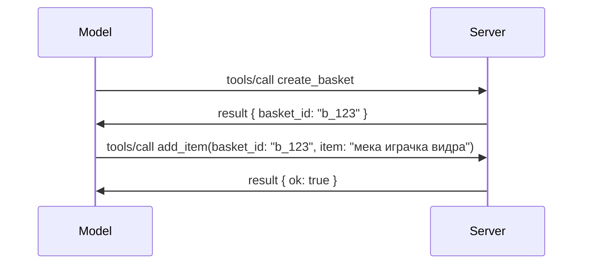

# Какво се променя в MCP: Кандидат за версия 2026-07-28

> **Статус:** Кандидат за версия. Спецификацията `2026-07-28` не е окончателна към момента на писане. Обявена е на 21 май 2026 г. и е планирана за пускане на 28 юли 2026 г. Всичко в този урок описва кандидата за версия; проверете [черновата на спецификацията](https://modelcontextprotocol.io/specification/draft) и нейния [журнал на промените](https://modelcontextprotocol.io/specification/draft/changelog) за най-актуалния статус, преди да разработвате спрямо нея. Останалата част от този учебен план е написана спрямо текущата стабилна версия, **MCP Спецификация 2025-11-25**, и ще бъде актуализирана след пускането на `2026-07-28`.

## Общ преглед

`2026-07-28` е най-голямата ревизия на MCP от нейното стартиране досега. Шест Пълномощни предложения за подобрения на спецификацията (SEP) премахват сесиите на ниво протокол и правят MCP безсъстояниен на транспортния слой, разширенията стават механизми от първи ред с версии, а няколко функции, които вече сте научили по-рано в този учебен план (Roots, Sampling, Logging) се маркират като остарели според нова политика за жизнения цикъл. Този урок обобщава какво се променя, защо е важно и какво означава това за вече написания от вас код спрямо `2025-11-25`.

Източник: [Кандидат за версия на Спецификация MCP 2026-07-28](https://blog.modelcontextprotocol.io/posts/2026-07-28-release-candidate/) (Блог на Model Context Protocol, Дейвид Сория Пара и Ден Делимарски).

## Обучителни цели

В края на този урок ще можете да:

- Обясните защо MCP преминава към безсъстояниен протокол и какъв проблем решава това при хоризонтално мащабируеми внедрения.
- Опишете как се заместват ръкостискането `initialize`/`initialized` и хедърът `Mcp-Session-Id`.
- Идентифицирате новите хедъри `Mcp-Method` и `Mcp-Name` и метаданните за кеширане `ttlMs`/`cacheScope`.
- Познавате рамката за разширения и двете разширения, включени с това издание: MCP Apps и Tasks.
- Изброите шестте SEP за авторизация, които затягат съвместимостта с OAuth 2.0 / OIDC.
- Идентифицирате кои основни функции (Roots, Sampling, Logging) вече са остарели и какво означава това на практика.
- Обясните промяната към пълен JSON Schema 2020-12 за `inputSchema`/`outputSchema` на инструментите.

## Безсъстояниен протокол

Главната промяна: MCP става безсъстояниен на протоколната част.

### Преди (2025-11-25): сесиите ви привързват към един сървър

Обаждането към инструмент през Streamable HTTP започва с ръкостискане `initialize`. Сървърът отговаря с хедър `Mcp-Session-Id`, който всяка следваща заявка трябва да носи:

```http
POST /mcp HTTP/1.1
Mcp-Session-Id: 1868a90c-3a3f-4f5b
Content-Type: application/json

{"jsonrpc":"2.0","id":2,"method":"tools/call",
 "params":{"name":"search","arguments":{"q":"otters"}}}
```

Тъй като сесията е свързана с конкретната сървърна машина, която я е издала, хоризонтално мащабираните внедрения изискват **sticky routing** при балансьор на натоварването и **споделен хранилище за сесии** между инстанциите.

### След (2026-07-28): всяка заявка е самостоятелна

```http
POST /mcp HTTP/1.1
MCP-Protocol-Version: 2026-07-28
Mcp-Method: tools/call
Mcp-Name: search
Content-Type: application/json

{"jsonrpc":"2.0","id":1,"method":"tools/call",
 "params":{"name":"search","arguments":{"q":"otters"},
           "_meta":{"io.modelcontextprotocol/clientInfo":{"name":"my-app","version":"1.0"}}}}
```

Всяка сървърна инстанция може да обработи тази заявка. Основни промени:

- **Ръкостискането `initialize`/`initialized` е премахнато** ([SEP-2575](https://github.com/modelcontextprotocol/modelcontextprotocol/pull/2575)). Версията на протокола, информацията за клиента и възможностите му се преместват в `_meta` на всяка заявка. Нов метод `server/discover` позволява на клиента да изтегли възможностите на сървъра предварително, когато са му необходими.
- **Хедърът `Mcp-Session-Id` и сесията на протоколната част са премахнати** ([SEP-2567](https://github.com/modelcontextprotocol/modelcontextprotocol/pull/2567)). Sticky routing и споделените хранилища за сесии вече не са необходими на протоколната част.

### Безсъстояниен протокол, състояниен софтуер

Премахването на сесията на ниво протокол не означава, че вашият сървър не може да бъде състояниен. Препоръчителният подход е същият, който HTTP API винаги са използвали: създайте явна дръжка (като `basket_id`, `browser_id`) чрез едно повикване на инструмент и моделът да я предава като обикновен аргумент в по-късните повиквания.



Това прави състоянието видимо и разумно за модела, вместо да го крие в транспортните метаданни, и позволява на всяка сървърна инстанция да обработи всяко повикване.

### Заявки от сървър към клиент, пренаредени

Безсъстояниен протокол все още се нуждае от начин сървърът да поиска нещо от клиента по време на заявка (например подканване за извличане на информация):

- **Заявките инициирани от сървъра могат да се издават само докато сървърът активно обработва заявка на клиента** ([SEP-2260](https://github.com/modelcontextprotocol/modelcontextprotocol/pull/2260)) — преди препоръка, сега изискване. Потребителят никога не бива подканван от нищото.
- **Заявките с много рундове (Multi Round-Trip Requests)** ([SEP-2322](https://github.com/modelcontextprotocol/modelcontextprotocol/pull/2322)) заменят поддържането на отворен SSE поток. Вместо това сървърът връща резултат `InputRequiredResult`:

  ```json
  {
    "resultType": "inputRequired",
    "inputRequests": {
      "confirm": {
        "type": "elicitation",
        "message": "Delete 3 files?",
        "schema": { "type": "boolean" }
      }
    },
    "requestState": "eyJzdGVwIjoxLCJmaWxlcyI6WyJhIiwiYiIsImMiXX0="
  }
  ```

  Клиентът събира отговорите и пренасочва оригиналното повикване с `inputResponses` плюс копираното `requestState`. Всяка сървърна инстанция може да приеме повторното повикване, защото всичко необходимо е в съдържанието на съобщението.

### Маршрутизируем, кешируем, проследим

Три по-малки промени правят безсъстояния трафик по-лесен за управление:

- **Хедърите `Mcp-Method` и `Mcp-Name` са задължителни в Streamable HTTP** ([SEP-2243](https://github.com/modelcontextprotocol/modelcontextprotocol/pull/2243)), така че балансьори на натоварването, шлюзове и ограничители на скоростта могат да маршрутизират на базата на операцията без да разглеждат JSON тялото. Сървърите отхвърлят заявки, в които хедърите и тялото не съвпадат.
- **`tools/list` и резултати от четене на ресурси носят `ttlMs` и `cacheScope`** ([SEP-2549](https://github.com/modelcontextprotocol/modelcontextprotocol/pull/2549)), моделирани по HTTP `Cache-Control`. Клиентите знаят колко дълго е резултатът свеж и дали е безопасно да се споделя между потребители, без да им се налага дълготрайно SSE стриймване за промени.
- **Разпространението на W3C Trace Context в `_meta` е документирано** ([SEP-414](https://github.com/modelcontextprotocol/modelcontextprotocol/pull/414)), фиксирайки имената на ключове `traceparent`, `tracestate` и `baggage`, така че разпръснато проследяване да може да следи повиквания през клиентското SDK, MCP сървъра и надолу по веригата в бекенд съвместим с [OpenTelemetry](https://opentelemetry.io/).

## Разширенията стават механизъм от първи ред

Разширенията съществуваха неофициално в `2025-11-25`. [SEP-2133](https://github.com/modelcontextprotocol/modelcontextprotocol/pull/2133) ги формализира:

- Разширенията се идентифицират чрез обратен DNS ID.
- Те се договарят чрез карта `extensions` в капацитетите на клиент и сървър.
- Те живеят в собствени репозитории с префикс `ext-*`, с делегирани поддръжници и версии, независими от основната спецификация.
- Нов трек за разширения в процеса на SEP им дава път от експериментален към официален.

Това издание съдържа две официални разширения.

### MCP Apps: потребителски интерфейси в сървъра

[MCP Apps](https://blog.modelcontextprotocol.io/posts/2026-01-26-mcp-apps/) ([SEP-1865](https://github.com/modelcontextprotocol/modelcontextprotocol/pull/1865)) позволява на сървърите да доставят интерактивни HTML интерфейси, които домакините рендерират в изолирано iframe. Инструментите предварително декларират своите UI шаблони, за да могат домакините да ги изтеглят предварително, кешират и проверяват за сигурност преди нещо да заработи. Вече разгледахте основите на това в [Урок 15: MCP Apps](../03-GettingStarted/15-mcp-apps/README.md) — под рамката за разширения MCP Apps вече формално е разширение, а не експериментална основна функция.

### Tasks става разширение

Tasks бяха пуснати като експериментална основна функция в `2025-11-25`. Производствената употреба разкри нужда от ре-дизайн, така че правилното място за тях е разширение: [Tasks extension](https://github.com/modelcontextprotocol/modelcontextprotocol/pull/2663) преоформя жизнения цикъл около безсъстояния модел — сървърът може да отговори с дръжка на задача при `tools/call`, а клиентът да я управлява с `tasks/get`, `tasks/update` и `tasks/cancel`. Създаването на задача се ръководи от сървъра: клиентът рекламира разширението, а сървърът решава кога повикването да се изпълни като задача. `tasks/list` е изцяло премахнат, защото не може да бъде безопасно ограничен без сесии.

> **Бележка за миграция:** ако сте имплементирали експерименталния API на Tasks от `2025-11-25`, ще трябва да мигрирате към новия жизнен цикъл на разширението — той не е съвместим с предишната версия.

## Засилване на авторизацията

Шест SEP затягат [спецификацията за авторизация](https://modelcontextprotocol.io/specification/draft/basic/authorization), за да се съобразят по-добре с реални внедрения OAuth 2.0 / OpenID Connect:

| SEP | Промяна |
|---|---|
| [SEP-2468](https://github.com/modelcontextprotocol/modelcontextprotocol/pull/2468) | Клиентите трябва да валидират параметъра `iss` в отговорите за авторизация според [RFC 9207](https://www.rfc-editor.org/rfc/rfc9207), като така се предотвратяват атаки тип mix-up, често срещани при MCP с модел единичен клиент, множество сървъри. Бъдеща версия ще изисква отказ на отговори без `iss`. |
| [SEP-837](https://github.com/modelcontextprotocol/modelcontextprotocol/pull/837) | Клиентите декларират `application_type` на OpenID Connect по време на Динамична регистрация на клиента, за да се избегне, че сървърите по подразбиране задават клиент на десктоп/CLI като `"web"` и отхвърлят неговия localhost redirect URI. |
| [SEP-2352](https://github.com/modelcontextprotocol/modelcontextprotocol/pull/2352) | Клиентите свързват регистрираните идентификационни данни с `issuer` на издаващия сървър за авторизация и пререгистрират при миграция на ресурс между сървъри за авторизация. |
| [SEP-2207](https://github.com/modelcontextprotocol/modelcontextprotocol/pull/2207) | Документира как да се изискват refresh tokens от сървъри подобни на OpenID Connect. |
| [SEP-2350](https://github.com/modelcontextprotocol/modelcontextprotocol/pull/2350) | Изяснява акумулирането на scope при засилена авторизация (step-up). |
| [SEP-2351](https://github.com/modelcontextprotocol/modelcontextprotocol/pull/2351) | Изяснява суфикса за откриване `.well-known`. |

Ако изграждате сървър за авторизация за MCP днес, започнете веднага да предоставяте `iss` в отговорите — вижте [02-Security](../02-Security/README.md) за настоящите насоки за авторизация, на които това ще се надгради.

## Roots, Sampling и Logging са остарели

Според новата [политика за жизнения цикъл на функции](https://github.com/modelcontextprotocol/modelcontextprotocol/pull/2577) ([SEP-2577](https://github.com/modelcontextprotocol/modelcontextprotocol/pull/2577)), три основни клиентски примитива, които научихте в [Основни концепции](./README.md#roots), преминават в състояние **Остарели**:

| Функция | Препоръчителна замяна |
|---|---|
| Roots | Параметри на инструмента, URI-та на ресурси или конфигурация на сървъра |
| Sampling | Директна интеграция с API на доставчици на LLM |
| Logging | `stderr` за stdio транспорти; OpenTelemetry за структурирана наблюдаемост |

Това са **само обозначения за остаряване**: методите, типовете и флаговете на възможности продължават да работят в това издание и във всяка версия на спецификацията, публикувана в рамките на година след него. Премахването им изцяло ще изисква отделен SEP според политиката за жизнен цикъл — така че нищо няма да спре да работи във вашите съществуващи [проби на Sampling](../03-GettingStarted/14-sampling/README.md) днес, но новите сървъри трябва да предпочитат горните заместители.

## Пълен JSON Schema 2020-12 за инструменти

`inputSchema` и `outputSchema` на инструментите се повдигат до пълен [JSON Schema 2020-12](https://json-schema.org/draft/2020-12) ([SEP-2106](https://github.com/modelcontextprotocol/modelcontextprotocol/pull/2106)):

- Схемите за вход запазват кореновото ограничение `type: "object"`, но вече позволяват композиция (`oneOf`, `anyOf`, `allOf`), условности и препратки (`$ref`, `$defs`).
- Схемите за изход са неограничени, а `structuredContent` вече може да бъде всяка JSON стойност вместо само обект.
- Имплементациите не трябва автоматично да дереферират външни URI-та на `$ref` и трябва да ограничават дълбочината на схемата и времето за валидиране (за да се предпазят от атаки тип отказ от услуга, ако валидират схеми на сървърната страна).

Отделно, кодът за грешка при липсващ ресурс се променя от MCP-специфичния `-32002` на стандарта JSON-RPC `-32602` (Невалидни параметри) ([SEP-2164](https://github.com/modelcontextprotocol/modelcontextprotocol/pull/2164)). Ако клиентът ви очаква дословно `-32002`, ще трябва да го актуализирате.

## Как протоколът ще се развива занапред

Това издание съдържа обратими промени, които поддръжниците на MCP не възнамеряват да налагат като норма занапред. Три управленски SEP целят да предотвратят повторение:

- **Политиката за жизнения цикъл на функции** дава на всяка функция път Active → Deprecated → Removed с поне дванадесет месеца между отбелязване като остаряла и най-ранното й възможно премахване.
- **Рамката за разширения** позволява нови възможности да се пускат като опционални разширения и да се стабилизират там преди (ако и когато) да влязат в основната спецификация.

- SEP за стандартен път вече не може да достигне статус Финал, докато съответстващ сценарий не бъде добавен в [набор за съответствие](https://github.com/modelcontextprotocol/conformance) ([SEP-2484](https://github.com/modelcontextprotocol/modelcontextprotocol/pull/2484)) — същият набор, срещу който системата за нива на SDK ([SDK tier system](https://github.com/modelcontextprotocol/modelcontextprotocol/pull/1777)) оценява официалните SDK.

## График за изпускане и валидация

- Кандидатът за версия беше заключен на 21 май 2026 г.
- Финалната спецификация е планирана за 28 юли 2026 г.
- Десетседмичният прозорец между двете позволява на поддържачите на SDK и изпълнителите на клиенти да валидират промените срещу реални натоварвания; очаква се SDK с ниво 1 да доставят поддръжка в този прозорец съгласно [системата за нива на SDK](https://modelcontextprotocol.io/docs/sdk).
- Следете пълния набор от промени в [черновата на спецификацията](https://modelcontextprotocol.io/specification/draft) и нейния [журнал на промените](https://modelcontextprotocol.io/specification/draft/changelog).

## Какво означава това за този учебен план

Всичко, което сте научили досега в този курс, е насочено към **2025-11-25**, което остава текущата стабилна спецификация до пускането на `2026-07-28`. Конкретно:

- **Сесиите и ръкостискането `initialize`** (обсъдени в [Основни понятия](./README.md) и [Урок 6: HTTP стрийминг](../03-GettingStarted/06-http-streaming/README.md)) все още работят както е документирано днес, но очаквайте да бъдат заменени със статeless модела на заявките по-горе, след като актуализирате към SDK съвместими с `2026-07-28`.
- **Извадки и корени** (също обсъждани в [Основни понятия](./README.md)) остават напълно функционални, но са остарели — новите дизайни трябва да предпочитат гореспоменатите заместители.
- **Експерименталната функция Tasks**, ако сте я използвали, ще трябва да се мигрира към новия жизнен цикъл на разширението Tasks.
- **MCP приложенията** ([Урок 15](../03-GettingStarted/15-mcp-apps/README.md)) на практика не са засегнати; те просто се преместват под формалната рамка на Разширенията.

## Допълнителни ресурси

- [Кандидат за версия на MCP Спецификация 2026-07-28 (блог пост)](https://blog.modelcontextprotocol.io/posts/2026-07-28-release-candidate/)
- [Бъдещето на MCP транспортите](https://blog.modelcontextprotocol.io/posts/2025-12-19-mcp-transport-future/)
- [Чернова на MCP Спецификация](https://modelcontextprotocol.io/specification/draft)
- [Журнал на промените на MCP](https://modelcontextprotocol.io/specification/draft/changelog)
- [Ръководства за SEP](https://modelcontextprotocol.io/community/sep-guidelines)
- [Система за нива на MCP SDK](https://modelcontextprotocol.io/docs/sdk)

## Следващи стъпки

Върнете се към [Основни понятия](./README.md) или продължете към [Сигурност](../02-Security/README.md), за да видите как указанията от днес `2025-11-25` се пренасят върху идващото.

---

<!-- CO-OP TRANSLATOR DISCLAIMER START -->
**Отказ от отговорност**:
Този документ е преведен с помощта на AI преводачески услуга [Co-op Translator](https://github.com/Azure/co-op-translator). Въпреки че се стремим към точност, моля имайте предвид, че автоматизираните преводи могат да съдържат грешки или неточности. Оригиналният документ на неговия роден език трябва да се счита за авторитетен източник. За критична информация се препоръчва професионален човешки превод. Ние не носим отговорност за каквито и да е недоразумения или неправилни тълкувания, произтичащи от използването на този превод.
<!-- CO-OP TRANSLATOR DISCLAIMER END -->