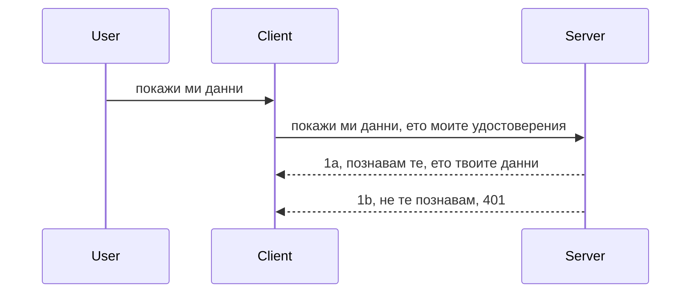

# Проста автентикация

MCP SDK поддържат използването на OAuth 2.1, което честно казано е доста сложен процес, включващ концепции като автентикационен сървър, ресурсен сървър, изпращане на данни за вход, получаване на код, обмен на кода за носителски токен, докато накрая получите достъп до ресурсните данни. Ако не сте свикнали с OAuth, което е страхотно нещо за имплементиране, е добра идея да започнете с някакво основно ниво на автентикация и да го надграждате към по-добра и по-добра сигурност. Затова съществува тази глава – да ви възвести към по-напреднала автентикация.

## Автентикация, какво имаме предвид?

Автентикацията е съкращение от удостоверяване и авторизация. Идеята е, че трябва да направим две неща:

- **Удостоверяване**, което е процесът на определяне дали ще позволим на даден човек да влезе в дома ни, че има право да „бъде тук“, тоест да има достъп до нашия ресурсен сървър, където живеят функциите на MCP сървъра.
- **Авторизация**, процесът на установяване дали даден потребител трябва да има достъп до определени ресурси, за които той е поискал, например тези поръчки или тези продукти, или дали му е позволено да чете съдържанието, но не и да изтрива, като друг пример.

## Данни за достъп: как казваме на системата кой сме ние

Повечето уеб разработчици започват да мислят в посока предоставяне на данни за достъп на сървъра, обикновено таен код, който казва дали са позволени тук "Удостоверяване". Тези данни за достъп обикновено са база64 кодирана версия на потребителско име и парола или API ключ, който уникално идентифицира специфичен потребител.

Това включва изпращането му чрез заглавка, наречена "Authorization" по следния начин:

```json
{ "Authorization": "secret123" }
```

Това обикновено се нарича основна автентикация. Как протича общия поток, е по следния начин:



След като разбираме как работи от гледна точка на потока, как да го имплементираме? Повечето уеб сървъри имат концепция, наречена middleware (междинен софтуер), парче код, което се изпълнява като част от заявката, и може да провери данните за достъп, и ако те са валидни, да пусне заявката да продължи. Ако заявката няма валидни данни за достъп, се получава грешка при удостоверяването. Нека видим как може да се имплементира това:

**Python**

```python
class AuthMiddleware(BaseHTTPMiddleware):
    async def dispatch(self, request, call_next):

        has_header = request.headers.get("Authorization")
        if not has_header:
            print("-> Missing Authorization header!")
            return Response(status_code=401, content="Unauthorized")

        if not valid_token(has_header):
            print("-> Invalid token!")
            return Response(status_code=403, content="Forbidden")

        print("Valid token, proceeding...")
       
        response = await call_next(request)
        # добавете всякакви потребителски заглавки или променете по някакъв начин отговора
        return response


starlette_app.add_middleware(CustomHeaderMiddleware)
```

Тук имаме:

- Създадена междинен софтуер наречен `AuthMiddleware`, чийто метод `dispatch` се извиква от уеб сървъра.
- Добавен е междинният софтуер към уеб сървъра:

    ```python
    starlette_app.add_middleware(AuthMiddleware)
    ```

- Написана е логика за валидиране, която проверява дали е налична заглавката Authorization и дали изпратеният таен код е валиден:

    ```python
    has_header = request.headers.get("Authorization")
    if not has_header:
        print("-> Missing Authorization header!")
        return Response(status_code=401, content="Unauthorized")

    if not valid_token(has_header):
        print("-> Invalid token!")
        return Response(status_code=403, content="Forbidden")
    ```

    ако тайната е налична и валидна, пускаме заявката да продължи, като извикваме `call_next` и връщаме отговора.

    ```python
    response = await call_next(request)
    # добавете всякакви потребителски заглавки или променете отговора по някакъв начин
    return response
    ```

Работи по следния начин: ако към сървъра е направена уеб заявка, междинният софтуер се извиква и според имплементацията си или пуска заявката да продължи, или връща грешка, която показва, че клиентът не е позволен да продължи.

**TypeScript**

Тук създаваме междинен софтуер с популярния фреймуърк Express и прихващаме заявката преди тя да достигне MCP сървъра. Ето кода:

```typescript
function isValid(secret) {
    return secret === "secret123";
}

app.use((req, res, next) => {
    // 1. Присъства ли заглавката за авторизация?
    if(!req.headers["Authorization"]) {
        res.status(401).send('Unauthorized');
    }
    
    let token = req.headers["Authorization"];

    // 2. Проверка на валидността.
    if(!isValid(token)) {
        res.status(403).send('Forbidden');
    }

   
    console.log('Middleware executed');
    // 3. Предава заявката на следващата стъпка в обработката на заявката.
    next();
});
```

В този код ние:

1. Проверяваме дали заглавката Authorization е налична, ако не, изпращаме грешка 401.
2. Убедете се, че данните за достъп/токена са валидни, ако не изпращаме грешка 403.
3. Накрая заявката се пропуска през верига от заявки и връща поисканите ресурси.

## Упражнение: Имплементирайте автентикация

Нека приложим знанията си. Ето плана:

Сървър

- Създайте уеб сървър и MCP инстанция.
- Имплементирайте междинен софтуер за сървъра.

Клиент

- Изпратете уеб заявка с данни за достъп чрез заглавка.

### -1- Създайте уеб сървър и MCP инстанция

> **Поглед в бъдещето:** примерът с TypeScript по-долу следи HTTP транспортите в `transports` карта по ключ `mcp-session-id`, според **MCP Спецификация 2025-11-25**. Релийз кандидатът от `2026-07-28` премахва ръкостискането `initialize` и сесийния ID напълно, така че тази карта на сесии се премахва в полза на безсървърни, самостоятелни заявки. Вижте [Какво се променя в MCP: Релийз кандидат 2026-07-28](../../01-CoreConcepts/mcp-2026-07-28-release-candidate.md).

В първата стъпка трябва да създадем уеб сървър инстанция и MCP сървър.

**Python**

Тук създаваме MCP сървър инстанция, създаваме starlette уеб приложение и го хостваме с uvicorn.

```python
# създаване на MCP сървър

app = FastMCP(
    name="MCP Resource Server",
    instructions="Resource Server that validates tokens via Authorization Server introspection",
    host=settings["host"],
    port=settings["port"],
    debug=True
)

# създаване на starlette уеб приложение
starlette_app = app.streamable_http_app()

# обслужване на приложението чрез uvicorn
async def run(starlette_app):
    import uvicorn
    config = uvicorn.Config(
            starlette_app,
            host=app.settings.host,
            port=app.settings.port,
            log_level=app.settings.log_level.lower(),
        )
    server = uvicorn.Server(config)
    await server.serve()

run(starlette_app)
```

В този код:

- Създаваме MCP сървъра.
- Конструираме starlette уеб приложението от MCP сървъра, `app.streamable_http_app()`.
- Хостираме и обслужваме уеб приложението чрез uvicorn `server.serve()`.

**TypeScript**

Тук създаваме MCP сървър инстанция.

```typescript
const server = new McpServer({
      name: "example-server",
      version: "1.0.0"
    });

    // ... настройване на сървърни ресурси, инструменти и подтиквания ...
```

Създаването на MCP сървър трябва да се случи в дефиницията на маршрута POST /mcp, така че нека преместим горния код така:

```typescript
import express from "express";
import { randomUUID } from "node:crypto";
import { McpServer } from "@modelcontextprotocol/sdk/server/mcp.js";
import { StreamableHTTPServerTransport } from "@modelcontextprotocol/sdk/server/streamableHttp.js";
import { isInitializeRequest } from "@modelcontextprotocol/sdk/types.js"

const app = express();
app.use(express.json());

// Карта за съхраняване на трансфери по ID на сесия
const transports: { [sessionId: string]: StreamableHTTPServerTransport } = {};

// Обработвайте POST заявки за комуникация клиент-сървър
app.post('/mcp', async (req, res) => {
  // Проверете за съществуващо ID на сесия
  const sessionId = req.headers['mcp-session-id'] as string | undefined;
  let transport: StreamableHTTPServerTransport;

  if (sessionId && transports[sessionId]) {
    // Използвайте повторно съществуващия трансфер
    transport = transports[sessionId];
  } else if (!sessionId && isInitializeRequest(req.body)) {
    // Ново инициализационно заявка
    transport = new StreamableHTTPServerTransport({
      sessionIdGenerator: () => randomUUID(),
      onsessioninitialized: (sessionId) => {
        // Съхраняване на трансфера по ID на сесия
        transports[sessionId] = transport;
      },
      // Защитата срещу DNS пренасочване е деактивирана по подразбиране за обратна съвместимост. Ако пускате този сървър
      // локално, уверете се, че сте задали:
      // enableDnsRebindingProtection: true,
      // allowedHosts: ['127.0.0.1'],
    });

    // Почистване на трансфера при затваряне
    transport.onclose = () => {
      if (transport.sessionId) {
        delete transports[transport.sessionId];
      }
    };
    const server = new McpServer({
      name: "example-server",
      version: "1.0.0"
    });

    // ... настройване на ресурси на сървъра, инструменти и подкани ...

    // Свързване със сървъра MCP
    await server.connect(transport);
  } else {
    // Невалидна заявка
    res.status(400).json({
      jsonrpc: '2.0',
      error: {
        code: -32000,
        message: 'Bad Request: No valid session ID provided',
      },
      id: null,
    });
    return;
  }

  // Обработване на заявката
  await transport.handleRequest(req, res, req.body);
});

// Повторно използваем обработчик за GET и DELETE заявки
const handleSessionRequest = async (req: express.Request, res: express.Response) => {
  const sessionId = req.headers['mcp-session-id'] as string | undefined;
  if (!sessionId || !transports[sessionId]) {
    res.status(400).send('Invalid or missing session ID');
    return;
  }
  
  const transport = transports[sessionId];
  await transport.handleRequest(req, res);
};

// Обработвайте GET заявки за съобщения от сървъра към клиента чрез SSE
app.get('/mcp', handleSessionRequest);

// Обработвайте DELETE заявки за прекратяване на сесията
app.delete('/mcp', handleSessionRequest);

app.listen(3000);
```

Сега виждате как създаването на MCP сървъра е преместено в `app.post("/mcp")`.

Следващата стъпка е да създадем междинния софтуер, за да валидираме получените данни за достъп.

### -2- Имплементиране на междинен софтуер за сървъра

Да преминем към междинния софтуер. Тук ще създадем междинен софтуер, който търси данни за достъп в заглавката `Authorization` и ги валидира. Ако са приемливи, заявката ще продължи да изпълнява необходимото (например изброяване на инструменти, четене на ресурс или каквото и да е MCP функционалност, поискано от клиента).

**Python**

За създаване на междинния софтуер трябва да създадем клас, който наследява `BaseHTTPMiddleware`. Има две важни неща:

- Заявката `request`, от която четем информацията от заглавките.
- `call_next` е обратното повикване, което трябва да извикаме, ако клиентът е предоставил приемливи данни за достъп.

Първо трябва да се справим с случая, когато липсва заглавката `Authorization`:

```python
has_header = request.headers.get("Authorization")

# липсва заглавна част, неуспех с 401, в противен случай продължете.
if not has_header:
    print("-> Missing Authorization header!")
    return Response(status_code=401, content="Unauthorized")
```

Тук изпращаме съобщение 401 unauthorised, тъй като клиентът не успява в удостоверяването.

След това, ако има предоставени данни за достъп, трябва да проверим тяхната валидност така:

```python
 if not valid_token(has_header):
    print("-> Invalid token!")
    return Response(status_code=403, content="Forbidden")
```

Забележете, че изпращаме съобщение 403 forbidden по-горе. Нека видим целия междинен софтуер по-долу, който имплементира всичко, което коментирахме:

```python
class AuthMiddleware(BaseHTTPMiddleware):
    async def dispatch(self, request, call_next):

        has_header = request.headers.get("Authorization")
        if not has_header:
            print("-> Missing Authorization header!")
            return Response(status_code=401, content="Unauthorized")

        if not valid_token(has_header):
            print("-> Invalid token!")
            return Response(status_code=403, content="Forbidden")

        print("Valid token, proceeding...")
        print(f"-> Received {request.method} {request.url}")
        response = await call_next(request)
        response.headers['Custom'] = 'Example'
        return response

```

Страхотно, но какво е функцията `valid_token`? Ето я долу:

```python
# НЕ използвайте за продукция - подобрете го !!
def valid_token(token: str) -> bool:
    # премахнете префикса "Bearer "
    if token.startswith("Bearer "):
        token = token[7:]
        return token == "secret-token"
    return False
```

Очевидно това трябва да се подобри.

ВАЖНО: Никога не трябва да държите такива тайни в кода. Идеално е да вземат стойността за сравнение от източник на данни или от IDP (доставчик на идентичност) или още по-добре, нека IDP да извършва валидацията.

**TypeScript**

За имплементация в Express, трябва да извикаме метода `use`, който приема междинни функции.

Трябва да:

- Взаимодействаме със заявката, за да проверим подадените данни чрез свойството `Authorization`.
- Валидираме данните, и ако са валидни, позволяваме заявката да продължи и MCP заявката на клиента да направи необходимото (примерно изброяване на инструменти, четене на ресурс и т.н.).

Тук проверяваме дали заглавката `Authorization` е налична и ако не е, спираме заявката:

```typescript
if(!req.headers["authorization"]) {
    res.status(401).send('Unauthorized');
    return;
}
```

Ако заглавката не е изпратена, получавате 401.

След това проверяваме дали получените данни са валидни, ако не, отново спираме заявката, но с малко по-различно съобщение:

```typescript
if(!isValid(token)) {
    res.status(403).send('Forbidden');
    return;
} 
```

Забележете, че сега получавате грешка 403.

Ето целия код:

```typescript
app.use((req, res, next) => {
    console.log('Request received:', req.method, req.url, req.headers);
    console.log('Headers:', req.headers["authorization"]);
    if(!req.headers["authorization"]) {
        res.status(401).send('Unauthorized');
        return;
    }
    
    let token = req.headers["authorization"];

    if(!isValid(token)) {
        res.status(403).send('Forbidden');
        return;
    }  

    console.log('Middleware executed');
    next();
});
```

Настроили сме уеб сървъра да приема междинен софтуер, който проверява данните за достъп, които клиентът ни изпраща. А клиентът самият?

### -3- Изпратете уеб заявка с данни за достъп чрез заглавка

Трябва да се уверим, че клиентът предава данните за достъп чрез заглавката. Ще използваме MCP клиент затова, така че трябва да разберем как става това.

**Python**

За клиента трябва да предадем заглавка с нашите данни за достъп, по следния начин:

```python
# НЕ твърдо кодирайте стойността, имайте я поне в променлива на средата или в по-сигурно хранилище
token = "secret-token"

async with streamablehttp_client(
        url = f"http://localhost:{port}/mcp",
        headers = {"Authorization": f"Bearer {token}"}
    ) as (
        read_stream,
        write_stream,
        session_callback,
    ):
        async with ClientSession(
            read_stream,
            write_stream
        ) as session:
            await session.initialize()
      
            # TODO, какво искате да се направи в клиента, напр. изброяване на инструменти, извикване на инструменти и т.н.
```

Забележете как попълваме свойството `headers` така: ` headers = {"Authorization": f"Bearer {token}"}`.

**TypeScript**

Можем да решим това в две стъпки:

1. Попълнете конфигурационен обект с нашите данни за достъп.
2. Подайте конфигурационния обект към транспорта.

```typescript

// НЕ задавайте стойността статично, както е показано тук. Най-малкото, използвайте я като променлива на средата и нещо като dotenv (в режим на разработка).
let token = "secret123"

// дефинирайте обект с опции за клиентски транспорт
let options: StreamableHTTPClientTransportOptions = {
  sessionId: sessionId,
  requestInit: {
    headers: {
      "Authorization": "secret123"
    }
  }
};

// предайте обекта с опции на транспорта
async function main() {
   const transport = new StreamableHTTPClientTransport(
      new URL(serverUrl),
      options
   );
```

Тук виждате как създадохме `options` обект и поставихме нашите заглавки под свойството `requestInit`.

ВАЖНО: Как да го подобрим оттук нататък? Настоящата имплементация има някои проблеми. Първо, подаването на данни за достъп така е доста рисково, освен ако поне не ползвате HTTPS. Дори тогава, данните могат да бъдат откраднати, затова ви трябва система, която лесно да оттегля токена, както и допълнителни проверки, като откъде по света идва заявката, дали тя се прави твърде често (поведение като на ботове) – накратко, има всякакви притеснения.

Но трябва да се каже, че за много прости API, където не искате някой да използва вашето API без удостоверяване, това, което имаме тук, е добър старт.

С тази уговорка, нека опитаме да заздравим сигурността малко чрез използване на стандартизиран формат като JSON Web Token, известен още като JWT или „JOT“ токени.

## JSON Web Tokens, JWT

Опитваме се да подобрим нещата от изпращането на много прости данни. Какви са непосредствените подобрения при приемането на JWT?

- **Подобрения в сигурността**. В основната автентикация изпращате потребителско име и парола като база64 кодирани токени (или API ключове) многократно, което увеличава риска. С JWT изпращате потребителското си име и парола и получавате токен в замяна, който също има времево ограничение за валидност. JWT улеснява използването на прецизен контрол на достъпа чрез роли, обхвати и разрешения.
- **Безсървърност и мащабируемост**. JWT са самостоятелни, съдържат всички данни за потребителя и премахват необходимостта от съхранение на сесия на сървъра. Токенът може да бъде валидиран локално.
- **Взаимодействие и федерация**. JWT са централни за Open ID Connect и се използват с известни доставчици на идентичност като Entra ID, Google Identity и Auth0. Те позволяват единично влизане и много повече, като ги правят подходящи за предприятия.
- **Модулярност и гъвкавост**. JWT може да се използват и с API шлюзове като Azure API Management, NGINX и други. Поддържат автентикация при различни сценарии, включително комуникация сървър към услуга, имперсонация и делегация.
- **Изпълнение и кеширане**. JWT може да се кешират след декодиране, което намалява нуждата от парсинг. Това помага особено при приложения с голям трафик, тъй като подобрява пропускателната способност и намалява натоварването върху инфраструктурата.
- **Разширени функции**. Поддържа се инспекция (проверка на валидността на сървъра) и отмяна (правене на токена невалиден).

С всички тези преимущества, нека видим как можем да подобрим нашата имплементация.

## Превръщане на основна автентикация в JWT

Промените, които трябва да направим на голямо ниво, са:

- **Научете как да конструирате JWT токен** и го направете готов да бъде изпратен от клиента към сървъра.
- **Валидирайте JWT токен**, и ако е добре, позволявайте на клиента да използва ресурсите ни.
- **Сигурно съхранение на токени**. Как съхраняваме токена.
- **Защита на маршрути**. Трябва да защитаваме маршрутите, в нашия случай трябва да защитим маршрути и специфични MCP функции.
- **Добавяне на refresh токени**. Осигурете създаването на краткотрайни токени, но с дълготрайни refresh токени, които могат да се използват за получаване на нови токени при изтичане. Уверете се, че имате refresh endpoint и стратегия за ротация.

### -1- Конструиране на JWT токен

JWT токенът има следните части:

- **заглавие**, алгоритъм за криптиране и тип токен.
- **полезен товар (payload)**, твърдения като sub (потребителят или субектът, който токенът представлява; в автентикационен сценарий обикновено е userid), exp (когато изтича), role (роля).
- **подпис**, подписан с таен или частен ключ.

За целта трябва да конструираме заглавието, полезния товар и кодирания токен.

**Python**

```python

import jwt
import jwt
from jwt.exceptions import ExpiredSignatureError, InvalidTokenError
import datetime

# Таен ключ, използван за подписване на JWT
secret_key = 'your-secret-key'

header = {
    "alg": "HS256",
    "typ": "JWT"
}

# информацията за потребителя и неговите твърдения и време на изтичане
payload = {
    "sub": "1234567890",               # Субект (ID на потребителя)
    "name": "User Userson",                # Потребителско твърдение
    "admin": True,                     # Потребителско твърдение
    "iat": datetime.datetime.utcnow(),# Издадено на
    "exp": datetime.datetime.utcnow() + datetime.timedelta(hours=1)  # Изтичане
}

# кодирам го
encoded_jwt = jwt.encode(payload, secret_key, algorithm="HS256", headers=header)
```

В горния код сме:

- Дефинирали заглавка, използвайки HS256 като алгоритъм и type, зададено на JWT.
- Конструирали полезен товар, който съдържа субект или потребителско ID, потребителско име, роля, кога е издаден и кога ще изтече, като по този начин имплементира времевото ограничение, което споменахме по-рано.

**TypeScript**

Тук ще ни трябват някои зависимости, които да ни помогнат да конструираме JWT токен.

Зависимости

```sh

npm install jsonwebtoken
npm install --save-dev @types/jsonwebtoken
```

След като ги имаме, нека създадем заглавката, полезния товар и чрез тях - кодиран токен.

```typescript
import jwt from 'jsonwebtoken';

const secretKey = 'your-secret-key'; // Използвайте променливи на средата в продукция

// Дефинирайте полезния товар
const payload = {
  sub: '1234567890',
  name: 'User usersson',
  admin: true,
  iat: Math.floor(Date.now() / 1000), // Издаден на
  exp: Math.floor(Date.now() / 1000) + 60 * 60 // Изтича след 1 час
};

// Дефинирайте заглавката (по желание, jsonwebtoken задава по подразбиране)
const header = {
  alg: 'HS256',
  typ: 'JWT'
};

// Създайте токена
const token = jwt.sign(payload, secretKey, {
  algorithm: 'HS256',
  header: header
});

console.log('JWT:', token);
```

Този токен:

Подписан чрез HS256
Валиден за 1 час
Включва твърдения като sub, name, admin, iat и exp.

### -2- Проверка на токен

Също така трябва да валидираме токена - това трябва да го правим на сървъра, за да сме сигурни, че това, което клиентът ни изпраща, е валидно. Трябва да направим много проверки, от валидиране на структурата до валидността. Препоръчително е също да добавите други проверки, за да видите дали потребителят е в системата ви и още.

За да валидираме токен, трябва да го декодираме, за да го прочетем, и след това да започнем да проверяваме валидността му:

**Python**

```python

# Декодирайте и проверете JWT
try:
    decoded = jwt.decode(token, secret_key, algorithms=["HS256"])
    print("✅ Token is valid.")
    print("Decoded claims:")
    for key, value in decoded.items():
        print(f"  {key}: {value}")
except ExpiredSignatureError:
    print("❌ Token has expired.")
except InvalidTokenError as e:
    print(f"❌ Invalid token: {e}")

```


В този код извикваме `jwt.decode` с токена, секретния ключ и избрания алгоритъм като вход. Обърнете внимание как използваме конструкция try-catch, тъй като неуспешна валидация води до вдигане на грешка.

**TypeScript**

Тук трябва да извикаме `jwt.verify`, за да получим декодирана версия на токена, която можем да анализираме по-нататък. Ако този повикване се провали, това означава, че структурата на токена е неправилна или вече не е валиден. 

```typescript

try {
  const decoded = jwt.verify(token, secretKey);
  console.log('Decoded Payload:', decoded);
} catch (err) {
  console.error('Token verification failed:', err);
}
```

ЗАБЕЛЕЖКА: както беше споменато по-рано, трябва да направим допълнителни проверки, за да се уверим, че този токен показва потребител в нашата система и че потребителят разполага с правата, които твърди, че има.

След това нека разгледаме контролирания достъп на базата на роли, известен и като RBAC.

## Добавяне на контрол на достъпа на базата на роли

Идеята е да изразим, че различните роли имат различни разрешения. Например, приемаме, че администратор може да прави всичко, нормален потребител може да чете/писва, а гост може само да чете. Затова ето някои възможни нива на разрешения:

- Admin.Write 
- User.Read
- Guest.Read

Нека разгледаме как можем да приложим такъв контрол с помощта на middleware. Middleware-те могат да се добавят за отделен маршрут, както и за всички маршрути.

**Python**

```python
from starlette.middleware.base import BaseHTTPMiddleware
from starlette.responses import JSONResponse
import jwt

# НЕ включвайте тайната в кода, това е само за демонстрационни цели. Четете я от безопасно място.
SECRET_KEY = "your-secret-key" # сложете това в променлива на средата
REQUIRED_PERMISSION = "User.Read"

class JWTPermissionMiddleware(BaseHTTPMiddleware):
    async def dispatch(self, request, call_next):
        auth_header = request.headers.get("Authorization")
        if not auth_header or not auth_header.startswith("Bearer "):
            return JSONResponse({"error": "Missing or invalid Authorization header"}, status_code=401)

        token = auth_header.split(" ")[1]
        try:
            decoded = jwt.decode(token, SECRET_KEY, algorithms=["HS256"])
        except jwt.ExpiredSignatureError:
            return JSONResponse({"error": "Token expired"}, status_code=401)
        except jwt.InvalidTokenError:
            return JSONResponse({"error": "Invalid token"}, status_code=401)

        permissions = decoded.get("permissions", [])
        if REQUIRED_PERMISSION not in permissions:
            return JSONResponse({"error": "Permission denied"}, status_code=403)

        request.state.user = decoded
        return await call_next(request)


```

Има няколко различни начина да добавим middleware, както е показано по-долу:

```python

# Вариант 1: добавете middleware при създаването на starlette приложението
middleware = [
    Middleware(JWTPermissionMiddleware)
]

app = Starlette(routes=routes, middleware=middleware)

# Вариант 2: добавете middleware след като starlette приложението вече е създадено
starlette_app.add_middleware(JWTPermissionMiddleware)

# Вариант 3: добавяне на middleware за всеки маршрут
routes = [
    Route(
        "/mcp",
        endpoint=..., # обработващ
        middleware=[Middleware(JWTPermissionMiddleware)]
    )
]
```

**TypeScript**

Можем да използваме `app.use` и middleware, което ще се изпълнява за всички заявки. 

```typescript
app.use((req, res, next) => {
    console.log('Request received:', req.method, req.url, req.headers);
    console.log('Headers:', req.headers["authorization"]);

    // 1. Проверете дали е изпратен авторизационен хедър

    if(!req.headers["authorization"]) {
        res.status(401).send('Unauthorized');
        return;
    }
    
    let token = req.headers["authorization"];

    // 2. Проверете дали токенът е валиден
    if(!isValid(token)) {
        res.status(403).send('Forbidden');
        return;
    }  

    // 3. Проверете дали потребителят на токена съществува в нашата система
    if(!isExistingUser(token)) {
        res.status(403).send('Forbidden');
        console.log("User does not exist");
        return;
    }
    console.log("User exists");

    // 4. Потвърдете, че токенът има правилните разрешения
    if(!hasScopes(token, ["User.Read"])){
        res.status(403).send('Forbidden - insufficient scopes');
    }

    console.log("User has required scopes");

    console.log('Middleware executed');
    next();
});

```

Има доста неща, които можем да позволим на нашия middleware и които middleware-то ТРЯБВА да прави, а именно:

1. Проверка дали заглавието за удостоверяване присъства
2. Проверка дали токенът е валиден, извикваме `isValid`, който е метод, който сме написали и проверява интегритета и валидността на JWT токена.
3. Проверка дали потребителят съществува в нашата система, това трябва да проверим.

   ```typescript
    // потребители в базата данни
   const users = [
     "user1",
     "User usersson",
   ]

   function isExistingUser(token) {
     let decodedToken = verifyToken(token);

     // TODO, провери дали потребителят съществува в базата данни
     return users.includes(decodedToken?.name || "");
   }
   ```

   По-горе създадохме много прост списък `users`, който разбира се трябва да бъде в база данни.

4. Освен това трябва да проверим дали токенът има необходимите разрешения.

   ```typescript
   if(!hasScopes(token, ["User.Read"])){
        res.status(403).send('Forbidden - insufficient scopes');
   }
   ```

   В горния код от middleware-то проверяваме дали токенът съдържа разрешение User.Read, ако не, изпращаме грешка 403. По-долу е помощният метод `hasScopes`.

   ```typescript
   function hasScopes(scope: string, requiredScopes: string[]) {
     let decodedToken = verifyToken(scope);
    return requiredScopes.every(scope => decodedToken?.scopes.includes(scope));
  }
   ```

Have a think which additional checks you should be doing, but these are the absolute minimum of checks you should be doing.

Using Express as a web framework is a common choice. There are helpers library when you use JWT so you can write less code.

- `express-jwt`, helper library that provides a middleware that helps decode your token.
- `express-jwt-permissions`, this provides a middleware `guard` that helps check if a certain permission is on the token.

Here's what these libraries can look like when used:

```typescript
const express = require('express');
const jwt = require('express-jwt');
const guard = require('express-jwt-permissions')();

const app = express();
const secretKey = 'your-secret-key'; // put this in env variable

// Decode JWT and attach to req.user
app.use(jwt({ secret: secretKey, algorithms: ['HS256'] }));

// Check for User.Read permission
app.use(guard.check('User.Read'));

// multiple permissions
// app.use(guard.check(['User.Read', 'Admin.Access']));

app.get('/protected', (req, res) => {
  res.json({ message: `Welcome ${req.user.name}` });
});

// Error handler
app.use((err, req, res, next) => {
  if (err.code === 'permission_denied') {
    return res.status(403).send('Forbidden');
  }
  next(err);
});

```

Сега, след като видяхте как middleware може да се използва както за удостоверяване, така и за авторизация, какво ще кажете за MCP, променя ли начина, по който правим удостоверяване? Нека разберем в следващата секция.

### -3- Добавяне на RBAC към MCP

До момента видяхте как може да добавите RBAC чрез middleware, но за MCP няма лесен начин да се добави RBAC на база на конкретна функция за MCP, какво правим? Просто трябва да добавим код като този, който проверява в този случай дали клиентът има права да извика конкретен инструмент:

Имате няколко различни избора как да постигнете RBAC на база на функция, ето някои:

- Добавяне на проверка за всеки инструмент, ресурс, prompt, където трябва да проверите нивото на разрешение.

   **python**

   ```python
   @tool()
   def delete_product(id: int):
      try:
          check_permissions(role="Admin.Write", request)
      catch:
        pass # клиентът не успя да се упълномощи, повдигнете грешка за упълномощаване
   ```

   **typescript**

   ```typescript
   server.registerTool(
    "delete-product",
    {
      title: Delete a product",
      description: "Deletes a product",
      inputSchema: { id: z.number() }
    },
    async ({ id }) => {
      
      try {
        checkPermissions("Admin.Write", request);
        // направи, изпрати ID към productService и отдалечен вход
      } catch(Exception e) {
        console.log("Authorization error, you're not allowed");  
      }

      return {
        content: [{ type: "text", text: `Deletected product with id ${id}` }]
      };
    }
   );
   ```


- Използвайте усъвършенстван сървърен подход и хендлъри на заявките, за да минимизирате местата, на които трябва да направите проверката.

   **Python**

   ```python
   
   tool_permission = {
      "create_product": ["User.Write", "Admin.Write"],
      "delete_product": ["Admin.Write"]
   }

   def has_permission(user_permissions, required_permissions) -> bool:
      # user_permissions: списък с разрешения, които потребителят има
      # required_permissions: списък с разрешения, необходими за инструмента
      return any(perm in user_permissions for perm in required_permissions)

   @server.call_tool()
   async def handle_call_tool(
     name: str, arguments: dict[str, str] | None
   ) -> list[types.TextContent]:
    # Предполага се, че request.user.permissions е списък с разрешения за потребителя
     user_permissions = request.user.permissions
     required_permissions = tool_permission.get(name, [])
     if not has_permission(user_permissions, required_permissions):
        # Вдигнете грешка "Нямате разрешение да използвате инструмента {name}"
        raise Exception(f"You don't have permission to call tool {name}")
     # продължете и извикайте инструмента
     # ...
   ```   
   

   **TypeScript**

   ```typescript
   function hasPermission(userPermissions: string[], requiredPermissions: string[]): boolean {
       if (!Array.isArray(userPermissions) || !Array.isArray(requiredPermissions)) return false;
       // Върнете true, ако потребителят има поне едно изискуемо разрешение
       
       return requiredPermissions.some(perm => userPermissions.includes(perm));
   }
  
   server.setRequestHandler(CallToolRequestSchema, async (request) => {
      const { params: { name } } = request;
  
      let permissions = request.user.permissions;
  
      if (!hasPermission(permissions, toolPermissions[name])) {
         return new Error(`You don't have permission to call ${name}`);
      }
  
      // продължавайте..
   });
   ```

   Забележка: трябва да гарантирате, че вашият middleware приписва декодиран токен на свойството user на заявката, за да се улесни горния код.

### Обобщение

Сега, след като обсъдихме как да добавим поддръжка за RBAC като цяло и за MCP по-специално, е време да се опитате да приложите сигурността сами, за да се уверите, че сте разбрали представените концепции.

## Задача 1: Изградете MCP сървър и MCP клиент, използвайки базова автентикация

Тук ще използвате това, което сте научили за изпращането на удостоверителни данни чрез headers.

## Решение 1

[Решение 1](./code/basic/README.md)

## Задача 2: Надградете решението от Задача 1 с използване на JWT

Вземете първото решение, но този път нека го подобрим.

Вместо Basic Auth нека използваме JWT.

## Решение 2

[Решение 2](./solution/jwt-solution/README.md)

## Предизвикателство

Добавете RBAC на база на инструмент, както описахме в раздела "Добавяне на RBAC към MCP".

## Обобщение

Надяваме се, че сте научили много в тази глава – от липсата на каквато и да е сигурност, през базова сигурност, до JWT и как може да бъде добавен към MCP.

Изградихме солидна основа с персонализирани JWT, но с разрастването се насочваме към идентификационен модел, базиран на стандарти. Приемането на IdP като Entra или Keycloak ни позволява да прехвърлим издаването, валидирането и управлението на живота на токените на доверена платформа — освобождавайки ни да се концентрираме върху логиката на приложението и потребителското изживяване.

За това имаме по- [напреднала глава за Entra](../../05-AdvancedTopics/mcp-security-entra/README.md)

## Какво следва

- Следващо: [Настройване на MCP хостове](../12-mcp-hosts/README.md)

---

<!-- CO-OP TRANSLATOR DISCLAIMER START -->
**Отказ от отговорност**:
Този документ е преведен с помощта на AI преводачески услуга [Co-op Translator](https://github.com/Azure/co-op-translator). Въпреки че се стремим към точност, моля имайте предвид, че автоматизираните преводи могат да съдържат грешки или неточности. Оригиналният документ на неговия роден език трябва да се счита за авторитетен източник. За критична информация се препоръчва професионален човешки превод. Ние не носим отговорност за каквито и да е недоразумения или неправилни тълкувания, произтичащи от използването на този превод.
<!-- CO-OP TRANSLATOR DISCLAIMER END -->