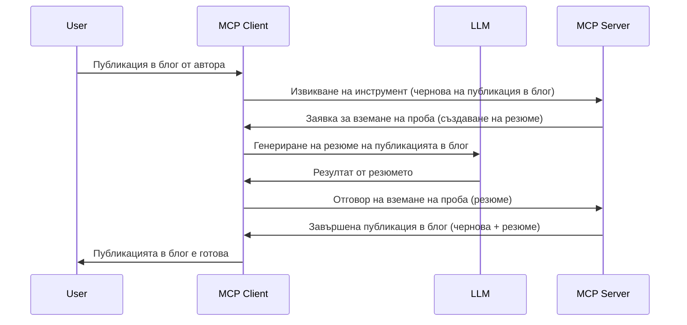

# Извличане на проби - делегиране на функции към Клиента

> **Уведомление за отмяна:** кандидатът за спецификация MCP от `2026-07-28` отбелязва Извличането на проби като остаряло в полза на директна интеграция с API-тата на доставчици на LLM. Извличането на проби продължава да работи в `2025-11-25` и поне още една година след всяка официална отмяна, така че всичко в този урок остава валидно — но новите дизайни на сървъри трябва да оценят новия модел за замяна. Вижте [Какво се променя в MCP: кандидат за издание 2026-07-28](../../01-CoreConcepts/mcp-2026-07-28-release-candidate.md).

Понякога имате нужда MCP Клиентът и MCP Сървърът да си сътрудничат, за да постигнат обща цел. Може да имате случай, в който Сървърът се нуждае от помощ от LLM, който е на клиента. За тази ситуация трябва да използвате извличане на проби.

Нека разгледаме някои случаи на използване и как да изградим решение, включващо извличане на проби.

## Преглед

В този урок се фокусираме върху обяснението кога и къде да използваме Извличане на проби и как да го конфигурираме.

## Учебни цели

В тази глава ще:

- Обясним какво е Извличане на проби и кога да се използва.
- Покажем как да се конфигурира Извличането на проби в MCP.
- Предложим примери за използване на Извличане на проби.

## Какво е Извличане на проби и защо да го използваме?

Извличането на проби е усъвършенствана функция, която работи по следния начин:



### Заявка за извличане на проби

Добре, сега имаме обща представа за правдоподобен сценарий, нека поговорим за заявката за извличане на проби, която сървърът изпраща обратно на клиента. Ето как може да изглежда такава заявка в JSON-RPC формат:

```json
{
  "jsonrpc": "2.0",
  "id": 1,
  "method": "sampling/createMessage",
  "params": {
    "messages": [
      {
        "role": "user",
        "content": {
          "type": "text",
          "text": "Create a blog post summary of the following blog post: <BLOG POST>"
        }
      }
    ],
    "modelPreferences": {
      "hints": [
        {
          "name": "claude-3-sonnet"
        }
      ],
      "intelligencePriority": 0.8,
      "speedPriority": 0.5
    },
    "systemPrompt": "You are a helpful assistant.",
    "maxTokens": 100
  }
}
```

Тук има няколко неща, които си струва да отбележим:

- Подканата, в content -> text, е нашата подканваща инструкция за LLM да обобщи съдържанието на блог пост.

- **modelPreferences**. Тази секция е просто предпочитание, препоръка за конфигурацията, която да се използва с LLM. Потребителят може да избере дали да следва тези препоръки или да ги промени. В този случай има препоръки за използвания модел и приоритет за скорост и интелигентност.
- **systemPrompt**, това е вашият нормален системен подканващ текст, който дава личност на вашия LLM и съдържа инструкции за насока.
- **maxTokens**, това е друго свойство, което се използва за указване колко токена се препоръчват за тази задача.

### Отговор на извличане на проби

Този отговор е това, което MCP Клиентът в крайна сметка изпраща обратно към MCP Сървъра и е резултат от повикването на клиента към LLM, изчакване на отговора и след това конструиране на това съобщение. Ето как може да изглежда в JSON-RPC:

```json
{
  "jsonrpc": "2.0",
  "id": 1,
  "result": {
    "role": "assistant",
    "content": {
      "type": "text",
      "text": "Here's your abstract <ABSTRACT>"
    },
    "model": "gpt-5",
    "stopReason": "endTurn"
  }
}
```

Забележете, че отговорът е резюме на блог поста, точно както поискахме. Също така забележете, че използваният `model` не е този, който поискахме, а "gpt-5" вместо "claude-3-sonnet". Това илюстрира, че потребителят може да промени решението си за използването и че вашата заявка за извличане на проби е препоръка.

Добре, сега когато разбираме основния поток и полезната задача за използване "създаване на блог пост + резюме", нека видим какво трябва да направим, за да го накараме да работи.

### Видове съобщения

Съобщенията за извличане на проби не са ограничени само до текст, но може да изпращате и изображения и аудио. Ето как JSON-RPC изглежда по различен начин:

**Текст**

```json
{
  "type": "text",
  "text": "The message content"
}
```

**Съдържание на изображение**

```json
{
  "type": "image",
  "data": "base64-encoded-image-data",
  "mimeType": "image/jpeg"
}
```

**Съдържание на аудио**

```json
{
  "type": "audio",
  "data": "base64-encoded-audio-data",
  "mimeType": "audio/wav"
}
```

> ЗАБЕЛЕЖКА: за по-подробна информация относно Извличането на проби, разгледайте [официалната документация](https://modelcontextprotocol.io/specification/2025-11-25/client/sampling)

## Как да конфигурираме Извличане на проби в Клиента

> Забележка: ако изграждате само сървър, не е нужно да правите много тук.

В клиент трябва да зададете следната функция по следния начин:

```json
{
  "capabilities": {
    "sampling": {}
  }
}
```

Това след това ще бъде взето предвид при инициализацията на избрания клиент със сървъра.

## Пример за извличане на проби в действие - Създаване на блог пост

Нека програмираме сървър за извличане на проби заедно, ще трябва да направим следното:

1. Създайте инструмент на Сървъра.
1. Този инструмент трябва да създава заявка за извличане на проби.
1. Инструментът трябва да чака отговора на заявката за извличане на проби от клиента.
1. След това се извежда резултатът от инструмента.

Нека видим кода стъпка по стъпка:

### -1- Създаване на инструмента

**python**

```python
@mcp.tool()
async def create_blog(title: str, content: str, ctx: Context[ServerSession, None]) -> str:
    """Create a blog post and generate a summary"""

```

### -2- Създаване на заявка за извличане на проби

Разширете вашия инструмент със следния код:

**python**

```python
post = BlogPost(
        id=len(posts) + 1,
        title=title,
        content=content,
        abstract=""
    )

prompt = f"Create an abstract of the following blog post: title: {title} and draft: {content} "

result = await ctx.session.create_message(
        messages=[
            SamplingMessage(
                role="user",
                content=TextContent(type="text", text=prompt),
            )
        ],
        max_tokens=100,
)

```

### -3- Изчакайте отговора и върнете отговора

**python**

```python
post.abstract = result.content.text

posts.append(post)

# върнете пълния продукт
return json.dumps({
    "id": post.title,
    "abstract": post.abstract
})
```

### -4- Пълен код

**python**

```python
from starlette.applications import Starlette
from starlette.routing import Mount, Host

from mcp.server.fastmcp import Context, FastMCP

from mcp.server.session import ServerSession
from mcp.types import SamplingMessage, TextContent

import json


from uuid import uuid4
from typing import List
from pydantic import BaseModel


mcp = FastMCP("Blog post generator")

# app = FastAPI()

posts = []

class BlogPost(BaseModel):
    id: int
    title: str
    content: str
    abstract: str

posts: List[BlogPost] = []

@mcp.tool()
async def create_blog(title: str, content: str, ctx: Context[ServerSession, None]) -> str:
    """Create a blog post and generate a summary"""

    post = BlogPost(
        id=len(posts) + 1,
        title=title,
        content=content,
        abstract=""
    )

    prompt = f"Create an abstract of the following blog post: title: {title} and draft: {content} "

    result = await ctx.session.create_message(
        messages=[
            SamplingMessage(
                role="user",
                content=TextContent(type="text", text=prompt),
            )
        ],
        max_tokens=100,
    )

    post.abstract = result.content.text

    posts.append(post)

    # върнете цялата публикация в блога
    return json.dumps({
        "id": post.title,
        "abstract": post.abstract
    })

if __name__ == "__main__":
    print("Starting server...")
    # mcp.run()
    mcp.run(transport="streamable-http")

# стартирайте приложението с: python server.py
```

### -5- Тестване във Visual Studio Code

За да тествате това във Visual Studio Code, направете следното:

1. Стартирайте сървъра в терминала
1. Добавете го в *mcp.json* (и се уверете, че е стартиран), например така:

   ```json
   "servers": {
      "blog-server": {
        "type": "http",
        "url": "http://localhost:8000/mcp"
      }
   }
   ```

1. Въведете подканваща команда:

   ```text
   create a blog post named "Where Python comes from", the content is "Python is actually named after Monty Python Flying Circus"
   ```

1. Позволете извличането на проби да се осъществи. Първият път, когато пробвате това, ще ви се появи допълнителен диалог, който ще трябва да приемете, след което ще видите обичайния диалог, който ви пита да стартирате инструмент.

1. Прегледайте резултатите. Ще видите резултатите както красиво показани в GitHub Copilot Chat, но също можете да разгледате и суровия JSON отговор.

**Бонус**. Инструментите на Visual Studio Code имат чудесна поддръжка за извличане на проби. Можете да конфигурирате достъпа за извличане на проби на инсталирания ви сървър, като отидете там по следния начин:

1. Отидете в секцията за разширения.
1. Изберете иконата на зъбно колело за инсталирания сървър в секцията "MCP SERVERS - INSTALLED".
1 Изберете "Configure Model Access", тук можете да изберете кои модели GitHub Copilot може да използва при извличането на проби. Можете също да видите всички скорошни заявки за извличане на проби, като изберете "Show Sampling requests".

## Задача

В тази задача ще изградите малко по-различно Извличане на проби, а именно интеграция за извличане на проби, която поддържа генериране на описание на продукт. Ето вашия сценарий:

**Сценарий**: Работникът в бек офис на електронна търговия има нужда от помощ, отнема твърде много време за генериране на продуктови описания. Следователно трябва да изградите решение, където можете да извикате инструмент "create_product" с аргументи "title" и "keywords" и той трябва да произведе цялостен продукт, включително поле "description", което трябва да се попълни от LLM на клиента.

СЪВЕТ: използвайте това, което научихте по-рано, за да конструирате този сървър и неговия инструмент с помощта на заявка за извличане на проби.

## Решение

[Решение](./solution/README.md)

## Основни изводи

Извличането на проби е мощна функция, която позволява на сървъра да делегира задачи на клиента, когато му е нужна помощ от LLM.

## Какво следва

- [Глава 4 - Практическа реализация](../../04-PracticalImplementation/README.md)

---

<!-- CO-OP TRANSLATOR DISCLAIMER START -->
**Отказ от отговорност**:
Този документ е преведен с помощта на AI преводачески услуга [Co-op Translator](https://github.com/Azure/co-op-translator). Въпреки че се стремим към точност, моля имайте предвид, че автоматизираните преводи могат да съдържат грешки или неточности. Оригиналният документ на неговия роден език трябва да се счита за авторитетен източник. За критична информация се препоръчва професионален човешки превод. Ние не носим отговорност за каквито и да е недоразумения или неправилни тълкувания, произтичащи от използването на този превод.
<!-- CO-OP TRANSLATOR DISCLAIMER END -->