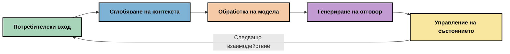
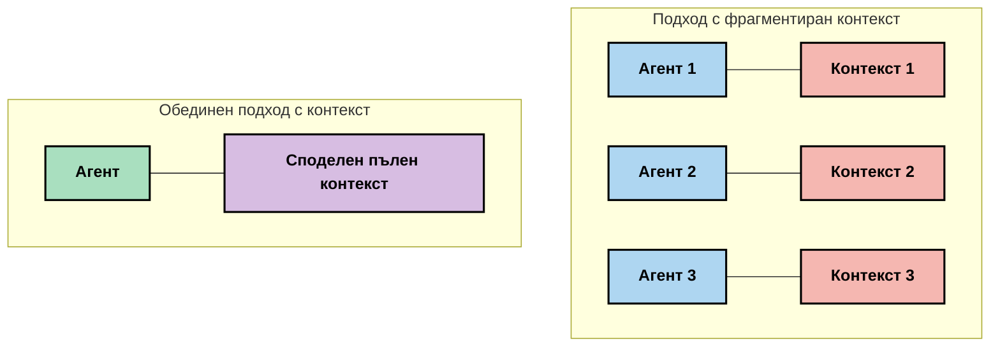
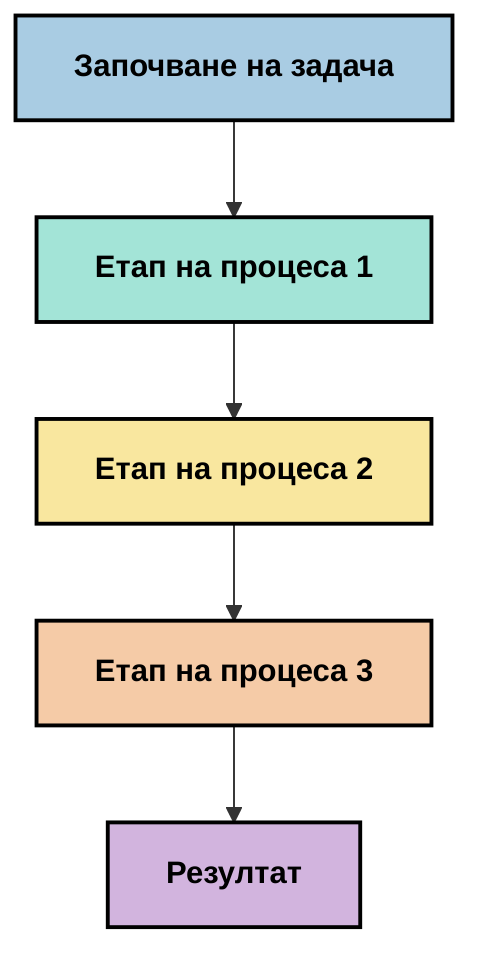
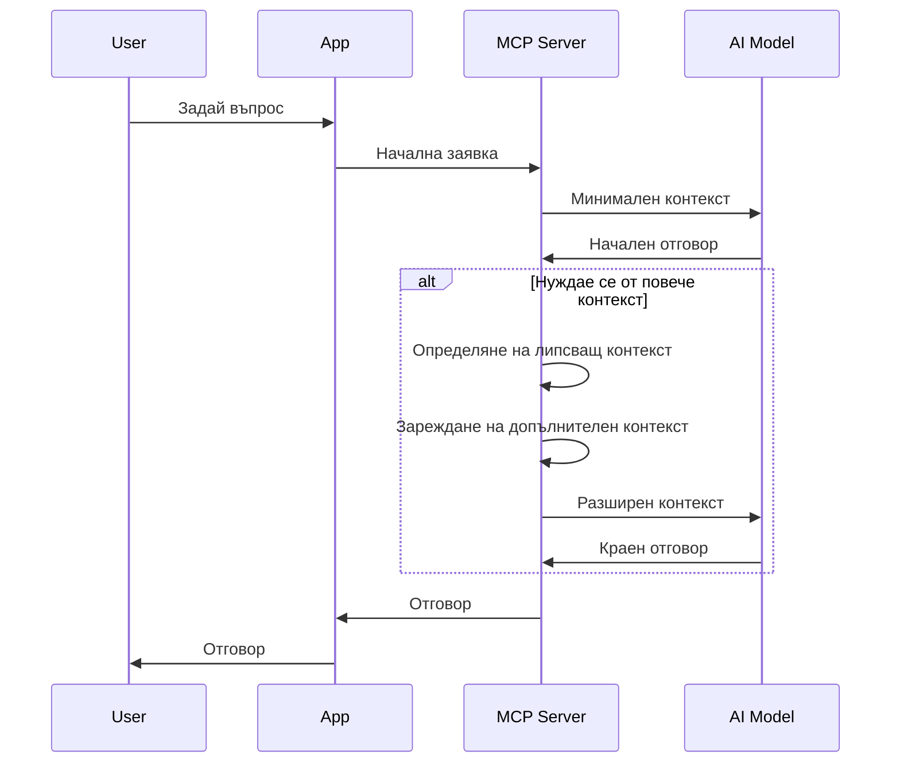
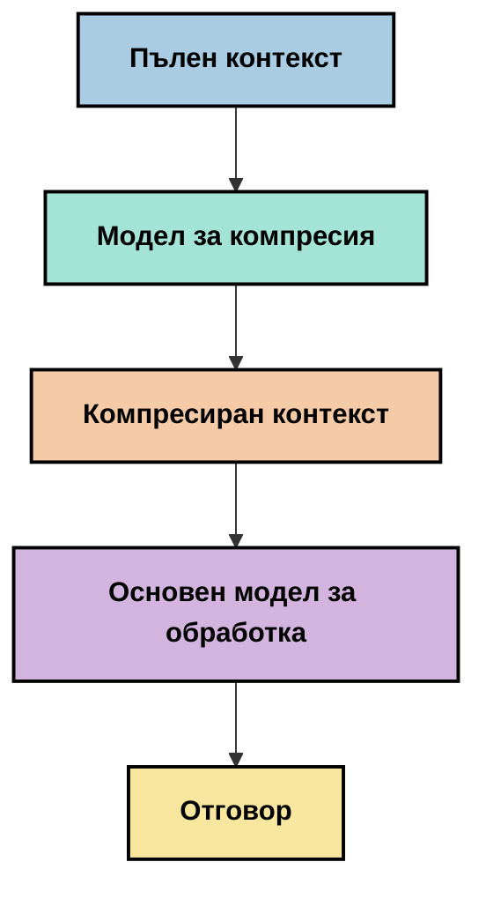
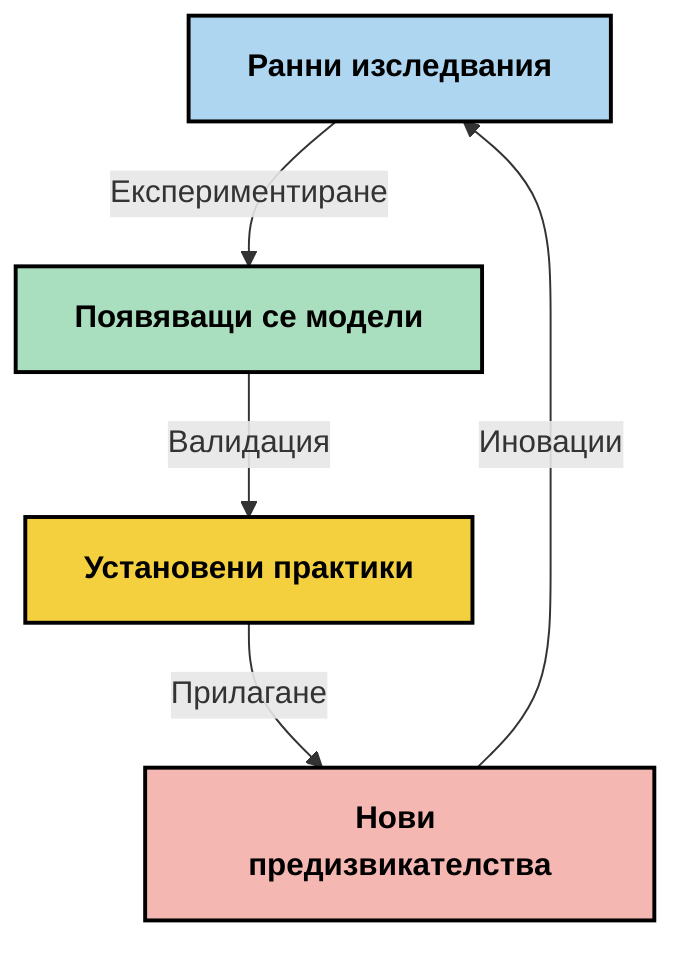

# Контекстно инженерство: Възникваща концепция в екосистемата MCP

## Преглед

Контекстното инженерство е възникваща концепция в сферата на изкуствения интелект, която изследва как информацията се структурира, доставя и поддържа по време на взаимодействия между клиенти и AI услуги. С развитието на екосистемата Model Context Protocol (MCP) разбирането как ефективно да се управлява контекстът става все по-важно. Този модул въвежда понятието контекстно инженерство и изследва потенциалните му приложения в реализации на MCP.

## Цели на обучението

В края на този модул ще можете да:

- Разберете възникващата концепция за контекстно инженерство и потенциалната му роля в MCP приложенията
- Идентифицирате ключови предизвикателства в управлението на контекст, които дизайнът на MCP протокола адресира
- Изследвате техники за подобряване на работата на модела чрез по-добро управление на контекста
- Обмисляте подходи за измерване и оценка на ефективността на контекста
- Прилагате тези възникващи концепции за подобряване на AI преживяванията чрез рамката MCP

## Въведение в контекстното инженерство

Контекстното инженерство е възникваща концепция, фокусирана върху съзнателното проектиране и управление на информационния поток между потребители, приложения и AI модели. За разлика от установени области като prompt инженерство, контекстното инженерство все още се дефинира от практици, които се стремят да решат уникалните предизвикателства при предоставяне на AI моделите на правилната информация в точното време.

С развитието на големите езикови модели (LLM) важността на контекста става все по-очевидна. Качеството, уместността и структурата на предоставения от нас контекст директно влияят върху изхода на модела. Контекстното инженерство изследва тази връзка и се стреми да развие принципи за ефективно управление на контекста.

> "През 2025 г. наличните модели са изключително интелигентни. Но дори и най-умният човек няма да може да свърши работата си ефективно без контекста на това, което му се иска да направи... „Контекстното инженерство“ е следващото ниво на prompt инженерството. Става въпрос за осъществяване на това автоматично в динамична система." — Уолдън Ян, Cognition AI

Контекстното инженерство може да обхваща:

1. **Избор на контекст**: Определяне на релевантната информация за дадена задача
2. **Структуриране на контекста**: Организиране на информацията за максимално разбиране от модела
3. **Доставка на контекста**: Оптимизиране начина и времето, когато информацията се изпраща към моделите
4. **Поддръжка на контекста**: Управление на състоянието и еволюцията на контекста във времето
5. **Оценка на контекста**: Измерване и подобряване на ефективността на контекста

Тези области на фокус са особено релевантни за екосистемата MCP, която осигурява стандартизиран начин приложенията да предоставят контекст на LLM.


## Перспектива: Пътуването на контекста

Един от начините да визуализираме контекстното инженерство е да проследим пътя, който информацията извървява през MCP система:



### Ключови етапи в пътуването на контекста:

1. **Въвеждане от потребителя**: Сурова информация от потребителя (текст, изображения, документи)
2. **Съставяне на контекст**: Комбиниране на въвеждането с контекста на системата, история на разговорите и друга извлечена информация
3. **Обработка на модела**: AI моделът обработва съставения контекст
4. **Генериране на отговор**: Моделът произвежда изходи въз основа на предоставения контекст
5. **Управление на състоянието**: Системата актуализира вътрешното си състояние според взаимодействието

Тази перспектива подчертава динамичната природа на контекста в AI системите и повдига важни въпроси за това как най-добре да се управлява информацията на всеки етап.

## Възникващи принципи в контекстното инженерство

С оформянето на полето контекстно инженерство, някои ранни принципи започват да излизат от практиците. Тези принципи могат да помогнат при вземане на решения за реализации на MCP:

### Принцип 1: Споделяйте контекста изцяло

Контекстът трябва да се споделя изцяло между всички компоненти на системата, а не да бъде фрагментиран между множество агенти или процеси. Когато контекстът е разпределен, решенията, взети в една част на системата, могат да противоречат на тези, взети другаде.



В MCP приложения това подсказва дизайн на системи, в които контекстът тече безпрепятствено през целия процес, а не е разделен на отделни части.

### Принцип 2: Признайте, че действията носят имплицитни решения

Всяко действие, предприето от модела, въплъщава имплицитни решения за това как да се интерпретира контекста. Когато няколко компонента оперират върху различен контекст, тези имплицитни решения могат да се сблъскат, водейки до несъгласувани резултати.

Този принцип има важни импликации за MCP приложения:
- Предпочитайте линейна обработка на сложни задачи пред паралелно изпълнение с фрагментиран контекст
- Уверете се, че всички решения имат достъп до една и съща контекстуална информация
- Проектирайте системи, в които по-късните стъпки могат да виждат пълния контекст на по-ранните решения

### Принцип 3: Балансирайте дълбочината на контекста с ограниченията на прозореца

С нарастването на разговорите и процесите, контекстните прозорци накрая преливат. Ефективното контекстно инженерство изследва подходи за управление на това напрежение между изчерпателен контекст и технически ограничения.

Потенциални подходи, които се изследват, включват:
- Компресиране на контекст, което запазва съществената информация, докато намалява употребата на токени
- Прогресивно зареждане на контекста в зависимост от релевантността към текущите нужди
- Обобщаване на предишни взаимодействия, като се запазват ключови решения и факти

## Предизвикателства на контекста и дизайн на MCP протокола

Model Context Protocol (MCP) е проектиран със съзнание за уникалните предизвикателства при управлението на контекст. Разбирането на тези предизвикателства помага да се обяснят ключови аспекти от дизайна на MCP протокола:


### Предизвикателство 1: Ограничения на контекстния прозорец
Повечето AI модели имат фиксиран размер на контекстния прозорец, което ограничава колко информация могат да обработват наведнъж.

**Отговор на дизайна на MCP:** 
- Протоколът поддържа структуриран, ресурсно базиран контекст, който може да се реферира ефективно
- Ресурсите могат да се разделят на страници и да се зареждат прогресивно

### Предизвикателство 2: Определяне на релевантността
Трудно е да се определи коя информация е най-важна за включване в контекста.

**Отговор на дизайна на MCP:**
- Гъвкави инструменти позволяват динамично извличане на информация според нуждите
- Структурирани подсказки осигуряват последователна организация на контекста

### Предизвикателство 3: Запазване на контекста
Управлението на състоянието през взаимодействия изисква внимателно проследяване на контекста.

**Отговор на дизайна на MCP:**
- Стандартизирано управление на сесиите
- Ясно дефинирани модели на взаимодействието за еволюция на контекста

### Предизвикателство 4: Мултимодален контекст
Различните типове данни (текст, изображения, структурирани данни) изискват различно обработване.

**Отговор на дизайна на MCP:**
- Дизайнът на протокола позволява различни видове съдържание
- Стандартизирано представяне на мултимодална информация

### Предизвикателство 5: Сигурност и поверителност
Контекстът често съдържа чувствителна информация, която трябва да бъде защитена.

**Отговор на дизайна на MCP:**
- Ясни граници между клиентските и сървърните отговорности
- Локални опции за обработка, за да се минимизира излагането на данни

Разбирането на тези предизвикателства и как MCP ги адресира осигурява основа за изследване на по-напреднали техники в контекстното инженерство.

## Възникващи подходи в контекстното инженерство

С развиването на полето контекстно инженерство, няколко обещаващи подхода излизат наяве. Те представят текущото мислене, а не установени най-добри практики и вероятно ще се развиват с натрупването на опит при реализирането на MCP.

### 1. Еднолинейна линейна обработка

За разлика от многото-агентски архитектури, които разпределят контекста, някои практици откриват, че еднолинейната линейна обработка дава по-последователни резултати. Това съответства на принципа за поддържане на единен контекст.



Въпреки че този подход може да изглежда по-малко ефективен от паралелната обработка, често той произвежда по-кохерентни и надеждни резултати, тъй като всяка стъпка се изгражда върху пълното разбиране на предишните решения.

### 2. Разделяне и приоритизиране на контекста

Разделяне на големите контексти на управляеми части и приоритизиране на най-важното.

```python
# Концептуален пример: Разделяне на контекста и приоритизиране
def process_with_chunked_context(documents, query):
    # 1. Разделяне на документи на по-малки части
    chunks = chunk_documents(documents)
    
    # 2. Изчисляване на релевантни оценки за всяка част
    scored_chunks = [(chunk, calculate_relevance(chunk, query)) for chunk in chunks]
    
    # 3. Сортиране на частите по релевантност
    sorted_chunks = sorted(scored_chunks, key=lambda x: x[1], reverse=True)
    
    # 4. Използване на най-релевантните части като контекст
    context = create_context_from_chunks([chunk for chunk, score in sorted_chunks[:5]])
    
    # 5. Обработка с приоритетния контекст
    return generate_response(context, query)
```

Концепцията по-горе илюстрира как може да разделим големи документи на управляеми части и да изберем само най-релевантните за контекст. Този подход може да помогне да се работи в рамките на ограниченията на контекстния прозорец, като същевременно се използват големи бази знания.

### 3. Прогресивно зареждане на контекста

Зареждане на контекста постепенно в зависимост от нуждата, вместо наведнъж.



Прогресивното зареждане на контекста започва с минимален контекст и се разширява само при необходимост. Това може значително да намали употребата на токени при прости заявки, като същевременно запази способността да се справя със сложни въпроси.

### 4. Компресия и обобщаване на контекста

Намаляване размера на контекста, като се съхрани съществената информация.



Компресията на контекста се фокусира върху:
- Премахване на излишна информация
- Обобщаване на дълги съдържания
- Извличане на ключови факти и детайли
- Запазване на критични елементи от контекста
- Оптимизация за ефективност на токени

Този подход може да бъде особено полезен за поддържане на дълги разговори в контекстните прозорци или за ефективна обработка на големи документи. Някои практици използват специализирани модели специално за компресия и обобщаване на историята на разговорите.


## Изследователски съображения в контекстното инженерство

При изследването на възникващата област на контекстното инженерство, няколко съображения са полезни при работа с реализации на MCP. Те не са предписващи най-добри практики, а области за изследване, които могат да доведат до подобрения във вашия конкретен случай.

### Обмислете целите си за контекста

Преди да внедрите сложни решения за управление на контекста, ясно изразете какво се опитвате да постигнете:
- Каква конкретна информация моделът трябва да има, за да е успешен?
- Коя информация е съществена, а коя е допълнителна?
- Какви са ограниченията ви по отношение на производителност (латентност, лимити на токени, разходи)?

### Изследвайте слоести подходи към контекста

Някои практици намират успех с контекст, подреден в концептуални слоеве:
- **Основен слой**: Съществена информация, която моделът винаги трябва да има
- **Ситуативен слой**: Контекст, специфичен за текущото взаимодействие
- **Поддържащ слой**: Допълнителна информация, която може да бъде полезна
- **Резервен слой**: Информация, достъпна само при необходимост

### Изследвайте стратегии за извличане

Ефективността на вашия контекст често зависи от начина, по който извличате информация:
- Семантично търсене и embedding-и за намиране на концептуално релевантна информация
- Търсене на ключови думи за специфични фактически детайли
- Хибридни подходи, комбиниращи няколко метода за извличане
- Филтриране по метаданни за стесняване на обхвата по категории, дати или източници

### Експериментирайте с кохерентността на контекста

Структурата и потокът на вашия контекст могат да влияят на разбирането на модела:
- Групиране на свързаната информация
- Използване на последователно форматиране и организация
- Поддържане на логично или хронологично подреждане, когато е подходящо
- Избягване на противоречива информация

### Преценете компромисите при многo-агентските архитектури

Въпреки че многo-агентските архитектури са популярни в много AI рамки, те носят значителни предизвикателства при управлението на контекста:
- Фрагментацията на контекста може да доведе до несъгласувани решения между агентите
- Паралелната обработка може да въведе конфликти, които са трудни за разрешаване
- Комуникационните режийни разходи между агентите могат да компенсират печалбите в производителността
- Изисква се сложна обработка на състоянието за поддържане на кохерентност

В много случаи, едноагентският подход с цялостно управление на контекста може да даде по-надеждни резултати от няколко специализирани агента с фрагментиран контекст.

### Разработете методи за оценка

За да подобрите контекстното инженерство с времето, обмислете как ще измервате успеха:
- A/B тестване на различни структури на контекста
- Мониторинг на употребата на токени и времето за отговор
- Проследяване на удовлетвореността на потребителите и проценти на завършване на задачи
- Анализиране кога и защо стратегиите за контекст се провалят

Тези съображения представляват активни области на изследване в пространството на контекстното инженерство. С развитието на полето вероятно ще излязат по-ясни модели и практики.

## Измерване на ефективността на контекста: Развиваща се рамка

С появата на контекстното инженерство като концепция, практиците започват да изследват как можем да измерим неговата ефективност. Все още няма установена рамка, но се разглеждат различни метрики, които могат да насочат бъдещата работа.

### Потенциални измервателни измерения


#### 1. Съображения за ефективността на входа

- **Съотношение контекст към отговор**: Колко контекст е необходим спрямо размера на отговора?
- **Употреба на токени**: Какъв процент от предоставените токени на контекста влияят на отговора?
- **Намаляване на контекста**: Колко ефективно можем да компресираме суровата информация?

#### 2. Съображения за производителността

- **Влияние върху забавянето**: Как управлението на контекста влияе върху времето за отговор?
- **Икономия на токени**: Оптимизираме ли ефективно употребата на токени?
- **Точност на извличането**: Колко релевантна е извлечената информация?
- **Използване на ресурси**: Какви изчислителни ресурси са необходими?

#### 3. Съображения за качество

- **Релевантност на отговора**: Колко добре отговорът адресира запитването?
- **Фактическа точност**: Подобрява ли управлението на контекста фактологическата точност?
- **Последователност**: Отговорите последователни ли са при сходни запитвания?
- **Честота на халюцинации**: Намалява ли по-добрият контекст халюцинациите на модела?

#### 4. Съображения за потребителски опит

- **Процент на последващи запитвания**: Колко често потребителите се нуждаят от уточнения?
- **Завършване на задачи**: Успяват ли потребителите да постигнат целите си?
- **Показатели за удовлетвореност**: Как потребителите оценяват преживяването си?

### Изследователски подходи към измерването

Когато експериментирате с контекстното инженерство в реализации на MCP, обмислете тези изследователски подходи:

1. **Сравнение с базовите линии**: Установете базова линия с прости подходи към контекста преди да тествате по-сложни методи

2. **Постепенни промени**: Променяйте по един аспект от управлението на контекста наведнъж, за да изолирате ефектите му

3. **Оценка, фокусирана върху потребителя**: Комбинирайте количествени метрики с качествени отзиви от потребители

4. **Анализ на провали**: Изследвайте случаи, в които стратегиите за контекст се провалят, за да разберете потенциални подобрения

5. **Многоизмерна оценка**: Обмислете компромиси между ефективност, качество и потребителско преживяване

Този експериментален, многостранен подход към измерването съответства на възникващата природа на контекстното инженерство.

## Заключителни мисли

Контекстното инженерство е възникваща област на изследване, която може да се окаже централна за ефективните MCP приложения. Чрез обмислено разпределение на информационния поток в системата може да създадете AI преживявания, които са по-ефективни, точни и полезни за потребителите.

Техниките и подходите, очертани в този модул, представят ранни концепции в тази област, а не установени практики. Контекстното инженерство може да се развие в по-дефинирана дисциплина с развитието на AI възможностите и задълбочаването на разбирането ни. За момента експериментирането, съчетано с внимателно измерване, изглежда най-продуктивният подход.

## Потенциални бъдещи посоки

Областта на контекстното инженерство все още е в ранна фаза, но няколко многообещаващи посоки вече се открояват:

- Принципите на контекстното инженерство могат значително да повлияят на производителността, ефективността, потребителското преживяване и надеждността на моделите
- Еднолинейните подходи с цялостно управление на контекста могат да надминат многo-агентските архитектури в много случаи
- Специализирани модели за компресия на контекста могат да се превърнат в стандартни компоненти в AI процесите
- Напрежението между изчерпателността на контекста и ограниченията на токените вероятно ще подтикне иновации в управлението на контекста
- С нарастването на възможностите на моделите за ефективна комуникация, истинското многo-агентско сътрудничество може да стане по-жизнеспособно
- MCP приложенията могат да се развият, за да стандартизират патерни в управлението на контекста, излязли от настоящите експерименти



## Ресурси

### Официални ресурси за MCP
- [Модел Контекст Протокол Уебсайт](https://modelcontextprotocol.io/)
- [Спецификация на Модел Контекст Протокол](https://github.com/modelcontextprotocol/modelcontextprotocol)

- [Документация MCP](https://modelcontextprotocol.io/docs)
- [MCP C# SDK](https://github.com/modelcontextprotocol/csharp-sdk)
- [MCP Python SDK](https://github.com/modelcontextprotocol/python-sdk)
- [MCP TypeScript SDK](https://github.com/modelcontextprotocol/typescript-sdk)
- [MCP Inspector](https://github.com/modelcontextprotocol/inspector) - Инструмент за визуално тестване на MCP сървъри

### Статии за контекстно инженерство
- [Не създавайте мулти-агенти: принципи на контекстното инженерство](https://cognition.ai/blog/dont-build-multi-agents) - Вижданията на Уолден Ян за принципите на контекстното инженерство
- [Практическо ръководство за създаване на агенти](https://cdn.openai.com/business-guides-and-resources/a-practical-guide-to-building-agents.pdf) - Ръководство на OpenAI за ефективен дизайн на агенти
- [Създаване на ефективни агенти](https://www.anthropic.com/engineering/building-effective-agents) - Подходът на Anthropic към разработката на агенти

### Свързани изследвания
- [Динамично подобрение при извличане за големи езикови модели](https://arxiv.org/abs/2310.01487) - Изследвания на динамични методи за извличане
- [Загубени в средата: Как езиковите модели използват дълги контексти](https://arxiv.org/abs/2307.03172) - Важно изследване за модели на обработка на контекста
- [Иерархично текстово обусловено генериране на изображения с CLIP латенти](https://arxiv.org/abs/2204.06125) - Статия за DALL-E 2 с прозрения за структурирането на контекста
- [Изследване на ролята на контекста в архитектурите на големи езикови модели](https://aclanthology.org/2023.findings-emnlp.124/) - Съвременно изследване на работата с контекст
- [Мулти-агентно сътрудничество: Преглед](https://arxiv.org/abs/2304.03442) - Изследване на мулти-агентните системи и техните предизвикателства

### Допълнителни ресурси
- [Техники за оптимизиране на контекстния прозорец](https://learn.microsoft.com/en-us/azure/ai-services/openai/concepts/context-window)
- [Разширени техники за RAG](https://www.microsoft.com/en-us/research/blog/retrieval-augmented-generation-rag-and-frontier-models/)
- [Документация на Semantic Kernel](https://github.com/microsoft/semantic-kernel)
- [AI инструменти за управление на контекст](https://github.com/microsoft/aitoolkit)

## Какво следва

- [5.15 MCP Custom Transport](../mcp-transport/README.md)

---

<!-- CO-OP TRANSLATOR DISCLAIMER START -->
**Отказ от отговорност**:
Този документ е преведен с помощта на AI преводачески услуга [Co-op Translator](https://github.com/Azure/co-op-translator). Въпреки че се стремим към точност, моля имайте предвид, че автоматизираните преводи могат да съдържат грешки или неточности. Оригиналният документ на неговия роден език трябва да се счита за авторитетен източник. За критична информация се препоръчва професионален човешки превод. Ние не носим отговорност за каквито и да е недоразумения или неправилни тълкувания, произтичащи от използването на този превод.
<!-- CO-OP TRANSLATOR DISCLAIMER END -->