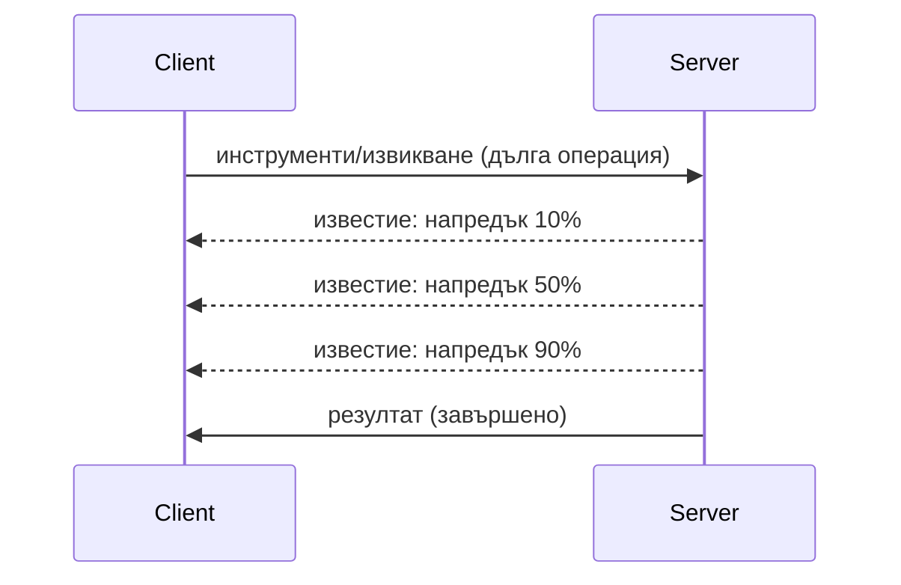

# Задълбочен анализ на функциите на MCP протокола

Това ръководство изследва усъвършенствани функции на MCP протокола, които надхвърлят базовото управление на инструменти и ресурси. Разбирането на тези функции ви помага да изградите по-стабилни, удобни за потребителя и готови за производство MCP сървъри.

> **Поглед напред:** релийз кандидатът от `2026-07-28` премахва примитива за логване (като дава предпочитание на `stderr` за stdio и OpenTelemetry за структурирана наблюдаемост), премахва модела `initialize`/сесия, описан по-долу в Събитията от жизнения цикъл на сървъра, и премества експерименталната функция Задачи в отделно разширение за Задачи с нов жизнен цикъл `tasks/get`/`tasks/update`/`tasks/cancel`. Вижте [Какво се променя в MCP: Релийз кандидат 2026-07-28](../../01-CoreConcepts/mcp-2026-07-28-release-candidate.md).

## Покрити функции

1. **Уведомления за напредък** - Отчитане на прогреса при длъжки операции
2. **Отказване на заявки** - Позволяване на клиентите да отменят текущи заявки
3. **Шаблони за ресурси** - Динамични URI на ресурси с параметри
4. **Събития от жизнения цикъл на сървъра** - Правилно инициализиране и спиране
5. **Контрол на логването** - Конфигурация на логване от страна на сървъра
6. **Шаблони за обработка на грешки** - Последователни отговори при грешки

---

## 1. Уведомления за напредък

За операции, които отнемат време (обработка на данни, изтегляне на файлове, API повиквания), уведомленията за напредък държат потребителите информирани.

### Как работи



### Имплементация на Python

```python
from mcp.server import Server, NotificationOptions
from mcp.types import ProgressNotification
import asyncio

app = Server("progress-server")

@app.tool()
async def process_large_file(file_path: str, ctx) -> str:
    """Process a large file with progress updates."""
    
    # Вземете размера на файла за изчисляване на напредъка
    file_size = os.path.getsize(file_path)
    processed = 0
    
    with open(file_path, 'rb') as f:
        while chunk := f.read(8192):
            # Обработете част
            await process_chunk(chunk)
            processed += len(chunk)
            
            # Изпратете известие за напредъка
            progress = (processed / file_size) * 100
            await ctx.send_notification(
                ProgressNotification(
                    progressToken=ctx.request_id,
                    progress=progress,
                    total=100,
                    message=f"Processing: {progress:.1f}%"
                )
            )
    
    return f"Processed {file_size} bytes"

@app.tool()
async def batch_operation(items: list[str], ctx) -> str:
    """Process multiple items with progress."""
    
    results = []
    total = len(items)
    
    for i, item in enumerate(items):
        result = await process_item(item)
        results.append(result)
        
        # Докладвайте напредъка след всеки елемент
        await ctx.send_notification(
            ProgressNotification(
                progressToken=ctx.request_id,
                progress=i + 1,
                total=total,
                message=f"Processed {i + 1}/{total}: {item}"
            )
        )
    
    return f"Completed {total} items"
```

### Имплементация на TypeScript

```typescript
import { Server } from "@modelcontextprotocol/sdk/server/index.js";

server.setRequestHandler(CallToolSchema, async (request, extra) => {
  const { name, arguments: args } = request.params;
  
  if (name === "process_data") {
    const items = args.items as string[];
    const results = [];
    
    for (let i = 0; i < items.length; i++) {
      const result = await processItem(items[i]);
      results.push(result);
      
      // Изпрати уведомление за напредъка
      await extra.sendNotification({
        method: "notifications/progress",
        params: {
          progressToken: request.id,
          progress: i + 1,
          total: items.length,
          message: `Processing item ${i + 1}/${items.length}`
        }
      });
    }
    
    return { content: [{ type: "text", text: JSON.stringify(results) }] };
  }
});
```

### Обработка на клиента (Python)

```python
async def handle_progress(notification):
    """Handle progress notifications from server."""
    params = notification.params
    print(f"Progress: {params.progress}/{params.total} - {params.message}")

# Регистриране на обработчик
session.on_notification("notifications/progress", handle_progress)

# Извикване на инструмент (актуализации за напредъка ще пристигат чрез обработчика)
result = await session.call_tool("process_large_file", {"file_path": "/data/large.csv"})
```

---

## 2. Отказване на заявки

Позволете на клиентите да отменят заявки, които вече не са им необходими или отнемат твърде много време.

### Имплементация на Python

```python
from mcp.server import Server
from mcp.types import CancelledError
import asyncio

app = Server("cancellable-server")

@app.tool()
async def long_running_search(query: str, ctx) -> str:
    """Search that can be cancelled."""
    
    results = []
    
    try:
        for page in range(100):  # Търсене през много страници
            # Проверете дали е поискано отказване
            if ctx.is_cancelled:
                raise CancelledError("Search cancelled by user")
            
            # Симулира търсене на страница
            page_results = await search_page(query, page)
            results.extend(page_results)
            
            # Малка пауза позволява проверки за отказване
            await asyncio.sleep(0.1)
            
    except CancelledError:
        # Връщане на частични резултати
        return f"Cancelled. Found {len(results)} results before cancellation."
    
    return f"Found {len(results)} total results"

@app.tool()
async def download_file(url: str, ctx) -> str:
    """Download with cancellation support."""
    
    async with aiohttp.ClientSession() as session:
        async with session.get(url) as response:
            total_size = int(response.headers.get('content-length', 0))
            downloaded = 0
            chunks = []
            
            async for chunk in response.content.iter_chunked(8192):
                if ctx.is_cancelled:
                    return f"Download cancelled at {downloaded}/{total_size} bytes"
                
                chunks.append(chunk)
                downloaded += len(chunk)
            
            return f"Downloaded {downloaded} bytes"
```

### Имплементиране на контекст за отказване

```python
class CancellableContext:
    """Context object that tracks cancellation state."""
    
    def __init__(self, request_id: str):
        self.request_id = request_id
        self._cancelled = asyncio.Event()
        self._cancel_reason = None
    
    @property
    def is_cancelled(self) -> bool:
        return self._cancelled.is_set()
    
    def cancel(self, reason: str = "Cancelled"):
        self._cancel_reason = reason
        self._cancelled.set()
    
    async def check_cancelled(self):
        """Raise if cancelled, otherwise continue."""
        if self.is_cancelled:
            raise CancelledError(self._cancel_reason)
    
    async def sleep_or_cancel(self, seconds: float):
        """Sleep that can be interrupted by cancellation."""
        try:
            await asyncio.wait_for(
                self._cancelled.wait(),
                timeout=seconds
            )
            raise CancelledError(self._cancel_reason)
        except asyncio.TimeoutError:
            pass  # Нормално изтичане на време, продължи
```

### Отказване от страна на клиента

```python
import asyncio

async def search_with_timeout(session, query, timeout=30):
    """Search with automatic cancellation on timeout."""
    
    task = asyncio.create_task(
        session.call_tool("long_running_search", {"query": query})
    )
    
    try:
        result = await asyncio.wait_for(task, timeout=timeout)
        return result
    except asyncio.TimeoutError:
        # Заявка за отмяна
        await session.send_notification({
            "method": "notifications/cancelled",
            "params": {"requestId": task.request_id, "reason": "Timeout"}
        })
        return "Search timed out"
```

---

## 3. Шаблони за ресурси

Шаблоните за ресурси позволяват динамично изграждане на URI с параметри, полезни за API-та и бази данни.

### Дефиниране на шаблони

```python
from mcp.server import Server
from mcp.types import ResourceTemplate

app = Server("template-server")

@app.list_resource_templates()
async def list_templates() -> list[ResourceTemplate]:
    """Return available resource templates."""
    return [
        ResourceTemplate(
            uriTemplate="db://users/{user_id}",
            name="User Profile",
            description="Fetch user profile by ID",
            mimeType="application/json"
        ),
        ResourceTemplate(
            uriTemplate="api://weather/{city}/{date}",
            name="Weather Data",
            description="Historical weather for city and date",
            mimeType="application/json"
        ),
        ResourceTemplate(
            uriTemplate="file://{path}",
            name="File Content",
            description="Read file at given path",
            mimeType="text/plain"
        )
    ]

@app.read_resource()
async def read_resource(uri: str) -> str:
    """Read resource, expanding template parameters."""
    
    # Разгърнете URI, за да извлечете параметрите
    if uri.startswith("db://users/"):
        user_id = uri.split("/")[-1]
        return await fetch_user(user_id)
    
    elif uri.startswith("api://weather/"):
        parts = uri.replace("api://weather/", "").split("/")
        city, date = parts[0], parts[1]
        return await fetch_weather(city, date)
    
    elif uri.startswith("file://"):
        path = uri.replace("file://", "")
        return await read_file(path)
    
    raise ValueError(f"Unknown resource URI: {uri}")
```

### Имплементация на TypeScript

```typescript
server.setRequestHandler(ListResourceTemplatesSchema, async () => {
  return {
    resourceTemplates: [
      {
        uriTemplate: "github://repos/{owner}/{repo}/issues/{issue_number}",
        name: "GitHub Issue",
        description: "Fetch a specific GitHub issue",
        mimeType: "application/json"
      },
      {
        uriTemplate: "db://tables/{table}/rows/{id}",
        name: "Database Row",
        description: "Fetch a row from a database table",
        mimeType: "application/json"
      }
    ]
  };
});

server.setRequestHandler(ReadResourceSchema, async (request) => {
  const uri = request.params.uri;
  
  // Анализирайте URI на GitHub заявка
  const githubMatch = uri.match(/^github:\/\/repos\/([^/]+)\/([^/]+)\/issues\/(\d+)$/);
  if (githubMatch) {
    const [_, owner, repo, issueNumber] = githubMatch;
    const issue = await fetchGitHubIssue(owner, repo, parseInt(issueNumber));
    return {
      contents: [{
        uri,
        mimeType: "application/json",
        text: JSON.stringify(issue, null, 2)
      }]
    };
  }
  
  throw new Error(`Unknown resource URI: ${uri}`);
});
```

---

## 4. Събития от жизнения цикъл на сървъра

Правилното инициализиране и спиране гарантират чисто управление на ресурсите.

### Управление на жизнения цикъл на Python

```python
from mcp.server import Server
from contextlib import asynccontextmanager

app = Server("lifecycle-server")

# Споделено състояние
db_connection = None
cache = None

@asynccontextmanager
async def lifespan(server: Server):
    """Manage server lifecycle."""
    global db_connection, cache
    
    # Стартиране
    print("🚀 Server starting...")
    db_connection = await create_database_connection()
    cache = await create_cache_client()
    print("✅ Resources initialized")
    
    yield  # Сървърът работи тук
    
    # Изключване
    print("🛑 Server shutting down...")
    await db_connection.close()
    await cache.close()
    print("✅ Resources cleaned up")

app = Server("lifecycle-server", lifespan=lifespan)

@app.tool()
async def query_database(sql: str) -> str:
    """Use the shared database connection."""
    result = await db_connection.execute(sql)
    return str(result)
```

### Жизнен цикъл на TypeScript

```typescript
import { Server } from "@modelcontextprotocol/sdk/server/index.js";

class ManagedServer {
  private server: Server;
  private dbConnection: DatabaseConnection | null = null;
  
  constructor() {
    this.server = new Server({
      name: "lifecycle-server",
      version: "1.0.0"
    });
    
    this.setupHandlers();
  }
  
  async start() {
    // Инициализиране на ресурси
    console.log("🚀 Server starting...");
    this.dbConnection = await createDatabaseConnection();
    console.log("✅ Database connected");
    
    // Стартиране на сървъра
    await this.server.connect(transport);
  }
  
  async stop() {
    // Освобождаване на ресурси
    console.log("🛑 Server shutting down...");
    if (this.dbConnection) {
      await this.dbConnection.close();
    }
    await this.server.close();
    console.log("✅ Cleanup complete");
  }
  
  private setupHandlers() {
    this.server.setRequestHandler(CallToolSchema, async (request) => {
      // Използвайте this.dbConnection безопасно
      // ...
    });
  }
}

// Използване с плавно спиране
const server = new ManagedServer();

process.on('SIGINT', async () => {
  await server.stop();
  process.exit(0);
});

await server.start();
```

---

## 5. Контрол на логването

MCP поддържа нива за логване от страна на сървъра, които клиентите могат да управляват.

### Имплементиране на нива за логване

```python
from mcp.server import Server
from mcp.types import LoggingLevel
import logging

app = Server("logging-server")

# Картографиране на MCP нивата към нивата на логване в Python
LEVEL_MAP = {
    LoggingLevel.DEBUG: logging.DEBUG,
    LoggingLevel.INFO: logging.INFO,
    LoggingLevel.WARNING: logging.WARNING,
    LoggingLevel.ERROR: logging.ERROR,
}

logger = logging.getLogger("mcp-server")

@app.set_logging_level()
async def set_logging_level(level: LoggingLevel) -> None:
    """Handle client request to change logging level."""
    python_level = LEVEL_MAP.get(level, logging.INFO)
    logger.setLevel(python_level)
    logger.info(f"Logging level set to {level}")

@app.tool()
async def debug_operation(data: str) -> str:
    """Tool with various logging levels."""
    logger.debug(f"Processing data: {data}")
    
    try:
        result = process(data)
        logger.info(f"Successfully processed: {result}")
        return result
    except Exception as e:
        logger.error(f"Processing failed: {e}")
        raise
```

### Изпращане на съобщения за лог към клиента

```python
@app.tool()
async def complex_operation(input: str, ctx) -> str:
    """Operation that logs to client."""
    
    # Изпратете известие за журнал към клиента
    await ctx.send_log(
        level="info",
        message=f"Starting complex operation with input: {input}"
    )
    
    # Извършете работа...
    result = await do_work(input)
    
    await ctx.send_log(
        level="debug",
        message=f"Operation complete, result size: {len(result)}"
    )
    
    return result
```

---

## 6. Шаблони за обработка на грешки

Последователната обработка на грешки подобрява отстраняването на проблеми и потребителското преживяване.

### MCP кодове за грешки

```python
from mcp.types import McpError, ErrorCode

class ToolError(McpError):
    """Base class for tool errors."""
    pass

class ValidationError(ToolError):
    """Invalid input parameters."""
    def __init__(self, message: str):
        super().__init__(ErrorCode.INVALID_PARAMS, message)

class NotFoundError(ToolError):
    """Requested resource not found."""
    def __init__(self, resource: str):
        super().__init__(ErrorCode.INVALID_REQUEST, f"Not found: {resource}")

class PermissionError(ToolError):
    """Access denied."""
    def __init__(self, action: str):
        super().__init__(ErrorCode.INVALID_REQUEST, f"Permission denied: {action}")

class InternalError(ToolError):
    """Internal server error."""
    def __init__(self, message: str):
        super().__init__(ErrorCode.INTERNAL_ERROR, message)
```

### Структурирани отговори при грешки

```python
@app.tool()
async def safe_operation(input: str) -> str:
    """Tool with comprehensive error handling."""
    
    # Валидация на входа
    if not input:
        raise ValidationError("Input cannot be empty")
    
    if len(input) > 10000:
        raise ValidationError(f"Input too large: {len(input)} chars (max 10000)")
    
    try:
        # Проверка на разрешенията
        if not await check_permission(input):
            raise PermissionError(f"read {input}")
        
        # Извършване на операцията
        result = await perform_operation(input)
        
        if result is None:
            raise NotFoundError(input)
        
        return result
        
    except ConnectionError as e:
        raise InternalError(f"Database connection failed: {e}")
    except TimeoutError as e:
        raise InternalError(f"Operation timed out: {e}")
    except Exception as e:
        # Записване на неочаквани грешки в лог
        logger.exception(f"Unexpected error in safe_operation")
        raise InternalError(f"Unexpected error: {type(e).__name__}")
```

### Обработка на грешки в TypeScript

```typescript
import { McpError, ErrorCode } from "@modelcontextprotocol/sdk/types.js";

function validateInput(data: unknown): asserts data is ValidInput {
  if (typeof data !== "object" || data === null) {
    throw new McpError(
      ErrorCode.InvalidParams,
      "Input must be an object"
    );
  }
  // Повече валидиране...
}

server.setRequestHandler(CallToolSchema, async (request) => {
  try {
    validateInput(request.params.arguments);
    
    const result = await performOperation(request.params.arguments);
    
    return {
      content: [{ type: "text", text: JSON.stringify(result) }]
    };
    
  } catch (error) {
    if (error instanceof McpError) {
      throw error;  // Вече е грешка на MCP
    }
    
    // Конвертиране на други грешки
    if (error instanceof NotFoundError) {
      throw new McpError(ErrorCode.InvalidRequest, error.message);
    }
    
    // Неизвестна грешка
    console.error("Unexpected error:", error);
    throw new McpError(
      ErrorCode.InternalError,
      "An unexpected error occurred"
    );
  }
});
```

---

## Експериментални функции (MCP 2025-11-25)

Тези функции са маркирани като експериментални в спецификацията:

### Задачи (длъжки операции)

```python
# Задачите позволяват проследяване на дългосрочни операции със състояние
@app.task()
async def training_task(model_id: str, data_path: str, ctx) -> str:
    """Long-running ML training task."""
    
    # Докладване за стартиране на задачата
    await ctx.report_status("running", "Initializing training...")
    
    # Обучителен цикъл
    for epoch in range(100):
        await train_epoch(model_id, data_path, epoch)
        await ctx.report_status(
            "running",
            f"Training epoch {epoch + 1}/100",
            progress=epoch + 1,
            total=100
        )
    
    await ctx.report_status("completed", "Training finished")
    return f"Model {model_id} trained successfully"
```

### Анотации на инструментите

```python
# Анотациите предоставят метаданни за поведението на инструмента
@app.tool(
    annotations={
        "destructive": False,      # Не променя данните
        "idempotent": True,        # Безопасно за повторен опит
        "timeout_seconds": 30,     # Очаквана максимална продължителност
        "requires_approval": False # Не се изисква одобрение от потребителя
    }
)
async def safe_query(query: str) -> str:
    """A read-only database query tool."""
    return await execute_read_query(query)
```

---

## Какво следва

- [Модул 8 - Най-добри практики](../../08-BestPractices/README.md)
- [5.14 - Инженеринг на контекста](../mcp-contextengineering/README.md)
- [Промените в MCP Спецификацията](https://spec.modelcontextprotocol.io/)

---

## Допълнителни ресурси

- [MCP Спецификация 2025-11-25](https://spec.modelcontextprotocol.io/specification/2025-11-25/)
- [JSON-RPC 2.0 кодове за грешки](https://www.jsonrpc.org/specification#error_object)
- [Примери с Python SDK](https://github.com/modelcontextprotocol/python-sdk/tree/main/examples)
- [Примери с TypeScript SDK](https://github.com/modelcontextprotocol/typescript-sdk/tree/main/examples)

---

<!-- CO-OP TRANSLATOR DISCLAIMER START -->
**Отказ от отговорност**:
Този документ е преведен с помощта на AI преводачески услуга [Co-op Translator](https://github.com/Azure/co-op-translator). Въпреки че се стремим към точност, моля имайте предвид, че автоматизираните преводи могат да съдържат грешки или неточности. Оригиналният документ на неговия роден език трябва да се счита за авторитетен източник. За критична информация се препоръчва професионален човешки превод. Ние не носим отговорност за каквито и да е недоразумения или неправилни тълкувания, произтичащи от използването на този превод.
<!-- CO-OP TRANSLATOR DISCLAIMER END -->