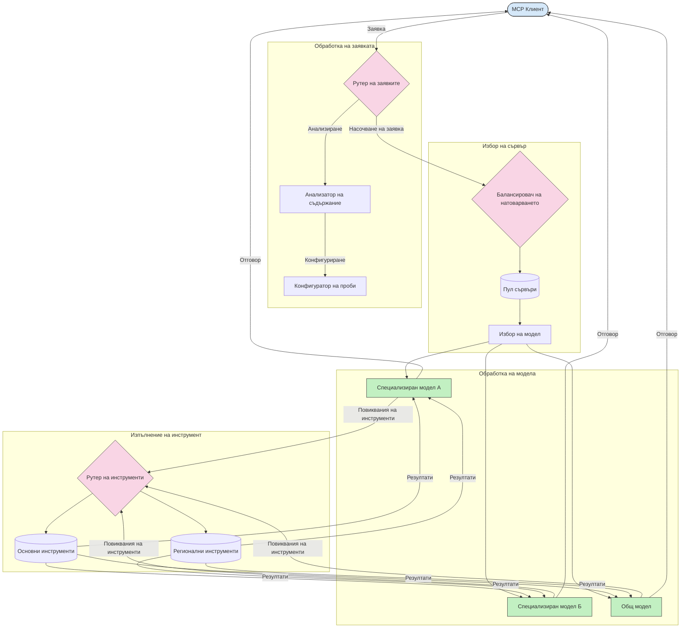

# Роутиране в Протокола за контекст на модела

Роутирането е от съществено значение за насочване на заявките към подходящите модели, инструменти или услуги в рамките на екосистемата MCP.

## Въведение

Роутирането в Протокола за контекст на модела (MCP) включва насочване на заявките към най-подходящите модели или услуги въз основа на различни критерии като тип съдържание, контекст на потребителя и натоварването на системата. Това гарантира ефективна обработка и оптимално използване на ресурсите.

## Учебни цели

След приключване на урока ще можете да:

- Разберете принципите на роутинг в MCP.
- Прилагате роутинг, базиран на съдържание, за насочване на заявките към специализирани услуги.
- Използвате интелигентни стратегии за балансиране на натоварването за оптимизиране на използването на ресурсите.
- Прилагате динамично роутване на инструменти въз основа на контекста на заявката.

## Роутинг, базиран на съдържание

Роутирането, базирано на съдържание, насочва заявките към специализирани услуги въз основа на съдържанието на заявката. Например заявки, свързани с генериране на код, могат да се насочат към специализиран модел за код, докато заявки за креативно писане могат да се изпратят към модел за креативно писане.

Нека разгледаме пример за имплементация на различни програмни езици.

<details>
<summary>.NET</summary>

```csharp
// .NET Example: Content-based routing in MCP
public class ContentBasedRouter
{
    private readonly Dictionary<string, McpClient> _specializedClients;
    private readonly RoutingClassifier _classifier;
    
    public ContentBasedRouter()
    {
        // Initialize specialized clients for different domains
        _specializedClients = new Dictionary<string, McpClient>
        {
            ["code"] = new McpClient("https://code-specialized-mcp.com"),
            ["creative"] = new McpClient("https://creative-specialized-mcp.com"),
            ["scientific"] = new McpClient("https://scientific-specialized-mcp.com"),
            ["general"] = new McpClient("https://general-mcp.com")
        };
        
        // Initialize content classifier
        _classifier = new RoutingClassifier();
    }
    
    public async Task<McpResponse> RouteAndProcessAsync(string prompt, IDictionary<string, object> parameters = null)
    {
        // Classify the prompt to determine the best specialized service
        string category = await _classifier.ClassifyPromptAsync(prompt);
        
        // Get the appropriate client or fall back to general
        var client = _specializedClients.ContainsKey(category) 
            ? _specializedClients[category] 
            : _specializedClients["general"];
            
        Console.WriteLine($"Routing request to {category} specialized service");
        
        // Send request to the selected service
        return await client.SendPromptAsync(prompt, parameters);
    }
    
    // Simple classifier for routing decisions
    private class RoutingClassifier
    {
        public Task<string> ClassifyPromptAsync(string prompt)
        {
            prompt = prompt.ToLowerInvariant();
            
            if (prompt.Contains("code") || prompt.Contains("function") || 
                prompt.Contains("program") || prompt.Contains("algorithm"))
            {
                return Task.FromResult("code");
            }
            
            if (prompt.Contains("story") || prompt.Contains("creative") || 
                prompt.Contains("imagine") || prompt.Contains("design"))
            {
                return Task.FromResult("creative");
            }
            
            if (prompt.Contains("science") || prompt.Contains("research") || 
                prompt.Contains("analyze") || prompt.Contains("study"))
            {
                return Task.FromResult("scientific");
            }
            
            return Task.FromResult("general");
        }
    }
}
```

В горния код ние:

- Създадохме клас `ContentBasedRouter`, който маршрутизира заявки въз основа на съдържанието на подканата.
- Инициализирахме специализирани клиенти за различни области (код, креативно, научно, общо).
- Имплементирахме прост класификатор, който определя категорията на подканата и я насочва към подходящата специализирана услуга.
- Използвахме механизъм за резервно движение, който насочва заявки към обща услуга, ако няма налична специализирана услуга.
- Прилагаме асинхронна обработка за ефективно управление на заявките.
- Използвахме речник, за да свържем категории съдържание със специализирани MCP клиенти.
- Имплементирахме прост класификатор, който анализира подканата и връща съответната категория.
- Използвахме специализирания клиент за изпращане на заявката и получаване на отговор.
- Обработихме случаи, когато подканата не съвпада с някоя специализирана категория, като насочихме към обща услуга.

</details>

## Интелигентно балансиране на натоварването

Балансирането на натоварването оптимизира използването на ресурсите и гарантира висока наличност на MCP услугите. Съществуват различни начини за реализиране на балансиране на натоварването, като кръгово разпределение, претеглени времена за отговор или стратегии, осъзнаващи съдържанието.

Нека разгледаме пример за имплементация, който използва следните стратегии:

- **Кръгово разпределение (Round Robin)**: Равномерно разпределя заявките между наличните сървъри.
- **Претеглено време за отговор**: Насочва заявки към сървъри въз основа на средното им време за отговор.
- **Осъзнаващо съдържанието (Content-Aware)**: Насочва заявки към специализирани сървъри според съдържанието на заявката.

<details>
<summary>Java</summary>

```java
// Пример на Java: Интелигентно балансиране на натоварването за MCP сървъри
public class McpLoadBalancer {
    private final List<McpServerNode> serverNodes;
    private final LoadBalancingStrategy strategy;
    
    public McpLoadBalancer(List<McpServerNode> nodes, LoadBalancingStrategy strategy) {
        this.serverNodes = new ArrayList<>(nodes);
        this.strategy = strategy;
    }
    
    public McpResponse processRequest(McpRequest request) {
        // Изберете най-добрия сървър въз основа на стратегия
        McpServerNode selectedNode = strategy.selectNode(serverNodes, request);
        
        try {
            // Пренасочете заявката към избрания възел
            return selectedNode.processRequest(request);
        } catch (Exception e) {
            // Обработка на провал - имплементирайте логика за повторен опит или резервна стратегия
            System.err.println("Error processing request on node " + selectedNode.getId() + ": " + e.getMessage());
            
            // Маркирайте възела като потенциално нездравословен
            selectedNode.recordFailure();
            
            // Опитайте следващия най-добър възел като резервен вариант
            List<McpServerNode> remainingNodes = new ArrayList<>(serverNodes);
            remainingNodes.remove(selectedNode);
            
            if (!remainingNodes.isEmpty()) {
                McpServerNode fallbackNode = strategy.selectNode(remainingNodes, request);
                return fallbackNode.processRequest(request);
            } else {
                throw new RuntimeException("All MCP server nodes failed to process the request");
            }
        }
    }
    
    // Задача за проверка на здравето на възела
    public void startHealthChecks(Duration interval) {
        ScheduledExecutorService scheduler = Executors.newScheduledThreadPool(1);
        scheduler.scheduleAtFixedRate(() -> {
            for (McpServerNode node : serverNodes) {
                try {
                    boolean isHealthy = node.checkHealth();
                    System.out.println("Node " + node.getId() + " health status: " + 
                                      (isHealthy ? "HEALTHY" : "UNHEALTHY"));
                } catch (Exception e) {
                    System.err.println("Health check failed for node " + node.getId());
                    node.setHealthy(false);
                }
            }
        }, 0, interval.toMillis(), TimeUnit.MILLISECONDS);
    }
    
    // Интерфейс за стратегии за балансиране на натоварването
    public interface LoadBalancingStrategy {
        McpServerNode selectNode(List<McpServerNode> nodes, McpRequest request);
    }
    
    // Стратегия рунд-робин
    public static class RoundRobinStrategy implements LoadBalancingStrategy {
        private AtomicInteger counter = new AtomicInteger(0);
        
        @Override
        public McpServerNode selectNode(List<McpServerNode> nodes, McpRequest request) {
            List<McpServerNode> healthyNodes = nodes.stream()
                .filter(McpServerNode::isHealthy)
                .collect(Collectors.toList());
            
            if (healthyNodes.isEmpty()) {
                throw new RuntimeException("No healthy nodes available");
            }
            
            int index = counter.getAndIncrement() % healthyNodes.size();
            return healthyNodes.get(index);
        }
    }
    
    // Стратегия с претеглено време за отговор
    public static class ResponseTimeStrategy implements LoadBalancingStrategy {
        @Override
        public McpServerNode selectNode(List<McpServerNode> nodes, McpRequest request) {
            return nodes.stream()
                .filter(McpServerNode::isHealthy)
                .min(Comparator.comparing(McpServerNode::getAverageResponseTime))
                .orElseThrow(() -> new RuntimeException("No healthy nodes available"));
        }
    }
    
    // Стратегия, осъзната за съдържанието
    public static class ContentAwareStrategy implements LoadBalancingStrategy {
        @Override
        public McpServerNode selectNode(List<McpServerNode> nodes, McpRequest request) {
            // Определете характеристиките на заявката
            boolean isCodeRequest = request.getPrompt().contains("code") || 
                                   request.getAllowedTools().contains("codeInterpreter");
            
            boolean isCreativeRequest = request.getPrompt().contains("creative") || 
                                       request.getPrompt().contains("story");
            
            // Намерете специализирани възли
            Optional<McpServerNode> specializedNode = nodes.stream()
                .filter(McpServerNode::isHealthy)
                .filter(node -> {
                    if (isCodeRequest && node.getSpecialization().equals("code")) {
                        return true;
                    }
                    if (isCreativeRequest && node.getSpecialization().equals("creative")) {
                        return true;
                    }
                    return false;
                })
                .findFirst();
            
            // Върнете специализирания възел или възела с най-малко натоварване
            return specializedNode.orElse(
                nodes.stream()
                    .filter(McpServerNode::isHealthy)
                    .min(Comparator.comparing(McpServerNode::getCurrentLoad))
                    .orElseThrow(() -> new RuntimeException("No healthy nodes available"))
            );
        }
    }
}
```

В горния код ние:

- Създадохме клас `McpLoadBalancer`, който управлява списък с MCP сървърни възли и маршрутизира заявките според избраната стратегия за балансиране.
- Имплементирахме различни стратегии за балансиране: `RoundRobinStrategy`, `ResponseTimeStrategy` и `ContentAwareStrategy`.
- Използвахме `ScheduledExecutorService`, за да проверяваме периодично здравословното състояние на сървърните възли.
- Прилагаме механизъм за проверка на здравето, който маркира възлите като здрави или нездрави въз основа на отговорите им.
- Обработихме заявките с управление на грешки и резервна логика, за да осигурим висока наличност.
- Използвахме клас `McpServerNode` за представяне на отделните MCP сървърни възли, включително тяхното здравословно състояние, средно време за отговор и текущо натоварване.
- Имплементирахме клас `McpRequest` за опаковане на детайли на заявката, като подканата и разрешените инструменти.
- Използвахме Java Streams за филтриране и избиране на възли според здравословното състояние и специализацията им.

</details>

## Динамично роутване на инструменти

Роутването на инструменти осигурява насочване на повикванията към инструменти към най-подходящата услуга въз основа на контекста. Например повикване на инструмент за прогноза на времето може да трябва да се насочи към регионален крайна точка спрямо местоположението на потребителя, или калкулаторът може да трябва да използва конкретна версия на API.

Нека разгледаме пример за имплементация, която демонстрира динамично роутване на инструменти на базата на анализ на заявката, регионални крайни точки и поддръжка на версии.

<details>
<summary>Python</summary>

```python
# Python пример: Динамично маршрутизиране на инструменти въз основа на анализа на заявката
class McpToolRouter:
    def __init__(self):
        # Регистрирайте наличните крайни точки на инструмента
        self.tool_endpoints = {
            "weatherTool": "https://weather-service.example.com/api",
            "calculatorTool": "https://calculator-service.example.com/compute",
            "databaseTool": "https://database-service.example.com/query",
            "searchTool": "https://search-service.example.com/search"
        }
        
        # Регионални крайни точки за глобално разпределение
        self.regional_endpoints = {
            "us": {
                "weatherTool": "https://us-west.weather-service.example.com/api",
                "searchTool": "https://us.search-service.example.com/search"
            },
            "europe": {
                "weatherTool": "https://eu.weather-service.example.com/api",
                "searchTool": "https://eu.search-service.example.com/search"
            },
            "asia": {
                "weatherTool": "https://asia.weather-service.example.com/api",
                "searchTool": "https://asia.search-service.example.com/search"
            }
        }
        
        # Поддръжка на версиониране на инструмента
        self.tool_versions = {
            "weatherTool": {
                "default": "v2",
                "v1": "https://weather-service.example.com/api/v1",
                "v2": "https://weather-service.example.com/api/v2",
                "beta": "https://weather-service.example.com/api/beta"
            }
        }
    
    async def route_tool_request(self, tool_name, parameters, user_context=None):
        """Route a tool request to the appropriate endpoint based on context"""
        endpoint = self._select_endpoint(tool_name, parameters, user_context)
        
        if not endpoint:
            raise ValueError(f"No endpoint available for tool: {tool_name}")
        
        # Изпълнете фактическата заявка към избраната крайна точка
        return await self._execute_tool_request(endpoint, tool_name, parameters)
    
    def _select_endpoint(self, tool_name, parameters, user_context=None):
        """Select the most appropriate endpoint based on context"""
        # Основна крайна точка от регистъра
        if tool_name not in self.tool_endpoints:
            return None
            
        base_endpoint = self.tool_endpoints[tool_name]
        
        # Проверете дали трябва да използваме конкретна версия на инструмента
        if tool_name in self.tool_versions:
            version_info = self.tool_versions[tool_name]
            
            # Използвайте посочената версия или по подразбиране
            requested_version = parameters.get("_version", version_info["default"])
            if requested_version in version_info:
                base_endpoint = version_info[requested_version]
        
        # Проверете за регионално маршрутизиране, ако регионът на потребителя е известен
        if user_context and "region" in user_context:
            user_region = user_context["region"]
            
            if user_region in self.regional_endpoints:
                regional_tools = self.regional_endpoints[user_region]
                
                if tool_name in regional_tools:
                    # Използвайте крайна точка, специфична за региона
                    return regional_tools[tool_name]
        
        # Проверете за изисквания за резидентност на данните
        if user_context and "data_residency" in user_context:
            # Това би приложило логика за гарантиране, че данните остават в определената юрисдикция
            pass
        
        # Проверете за маршрутизиране на базата на латентност
        if user_context and "latency_sensitive" in user_context and user_context["latency_sensitive"]:
            # Това би приложило логика за избор на крайна точка с най-ниска латентност
            pass
            
        return base_endpoint
        
    async def _execute_tool_request(self, endpoint, tool_name, parameters):
        """Execute the actual tool request to the selected endpoint"""
        try:
            async with aiohttp.ClientSession() as session:
                async with session.post(
                    endpoint,
                    json={"toolName": tool_name, "parameters": parameters},
                    headers={"Content-Type": "application/json"}
                ) as response:
                    if response.status == 200:
                        result = await response.json()
                        return result
                    else:
                        error_text = await response.text()
                        raise Exception(f"Tool execution failed: {error_text}")
        except Exception as e:
            # Изпълнете логика за повторен опит или резервна стратегия
            print(f"Error executing tool {tool_name} at {endpoint}: {str(e)}")
            raise
```

В горния код ние:

- Създадохме клас `McpToolRouter`, който управлява роутване на инструменти на базата на анализ на заявката, регионални крайни точки и поддръжка на версии.
- Регистрирахме налични крайни точки на инструменти и регионални крайни точки за глобално разпределение.
- Прилагаме динамична логика за роутване, която избира подходящата крайна точка според контекста на потребителя, като регион и изисквания за съхранение на данни.
- Прилагаме поддръжка на версии за инструментите, позволяваща на потребителите да изберат коя версия на инструмент искат да използват.
- Използвахме асинхронни HTTP заявки за изпълнение на повикванията към инструментите и обработка на отговорите.

</details>

## Архитектура на взимане на проби и роутинг в MCP

Вземането на проби е ключов компонент на Протокола за контекст на модела (MCP), който позволява ефективна обработка и роутинг на заявки. То включва анализиране на входящите заявки, за да се определи най-подходящият модел или услуга за обработка, въз основа на различни критерии като тип съдържание, контекст на потребителя и натоварване на системата.

Вземането на проби и роутирането могат да се комбинират за създаване на здрава архитектура, която оптимизира използването на ресурсите и гарантира висока наличност. Процесът на вземане на проби може да се използва за класифициране на заявките, докато роутинга ги насочва към съответните модели или услуги.

Диаграмата по-долу илюстрира как вземането на проби и роутинга работят заедно в цялостната архитектура на MCP:



## Какво следва

- [5.6 Sampling](../mcp-sampling/README.md)

---

<!-- CO-OP TRANSLATOR DISCLAIMER START -->
**Отказ от отговорност**:
Този документ е преведен с помощта на AI преводачески услуга [Co-op Translator](https://github.com/Azure/co-op-translator). Въпреки че се стремим към точност, моля имайте предвид, че автоматизираните преводи могат да съдържат грешки или неточности. Оригиналният документ на неговия роден език трябва да се счита за авторитетен източник. За критична информация се препоръчва професионален човешки превод. Ние не носим отговорност за каквито и да е недоразумения или неправилни тълкувания, произтичащи от използването на този превод.
<!-- CO-OP TRANSLATOR DISCLAIMER END -->