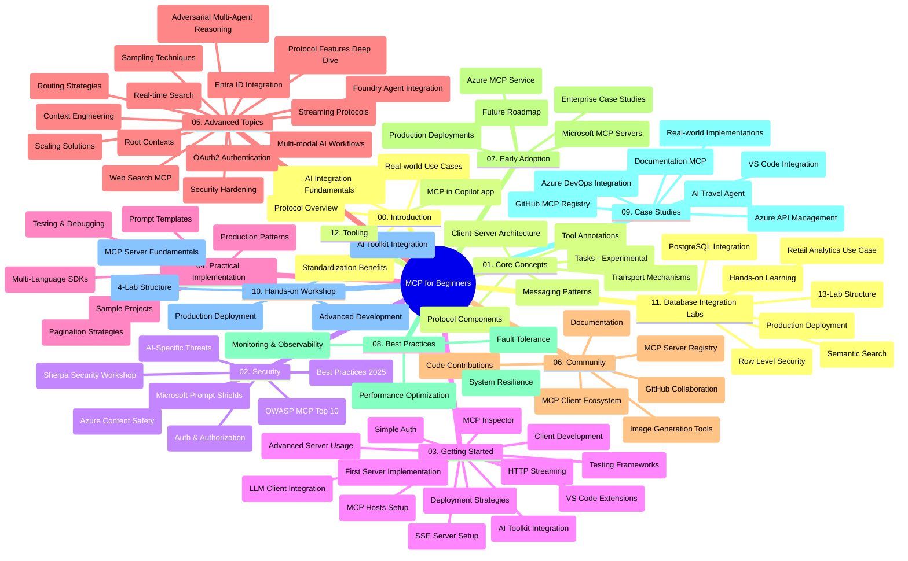

# Протокол за контекст на моделите (MCP) за начинаещи - учебно ръководство

Това учебно ръководство предоставя обзор на структурата на хранилището и съдържанието на учебната програма „Протокол за контекст на моделите (MCP) за начинаещи“. Използвайте това ръководство, за да навигирате ефективно в хранилището и да извлечете максимума от наличните ресурси.

## Преглед на хранилището

Протоколът за контекст на моделите (MCP) е стандартизиран рамков протокол за взаимодействия между ИИ модели и клиентски приложения. Първоначално създаден от Anthropic, MCP сега се поддържа от по-широката общност на MCP чрез официалната GitHub организация. Това хранилище предоставя всеобхватна учебна програма с практически примери на код на C#, Java, JavaScript, Python и TypeScript, предназначена за разработчици на ИИ, системни архитекти и софтуерни инженери.

## Визуална учебна карта

## Структура на хранилището

Хранилището е организирано в дванадесет основни раздела, всеки от които се фокусира върху различни аспекти на MCP:

1. **Въведение (00-Introduction/)**
   - Преглед на Протокола за контекст на моделите
   - Защо стандартизацията е важна в ИИ процесите
   - Практически случаи на употреба и ползи

2. **Основни понятия (01-CoreConcepts/)**
   - Клиент-сървър архитектура
   - Ключови компоненти на протокола
   - Шаблони на съобщения в MCP
   - Поглед напред: [Какво се променя в MCP: кандидата за издание 2026-07-28](./01-CoreConcepts/mcp-2026-07-28-release-candidate.md) — безсъстояниевото ядро на протокола, рамката за разширения и очакваното премахване на Roots/Sampling/Logging във версията на спецификацията

3. **Сигурност (02-Security/)**
   - Заплахи за сигурността в системи, базирани на MCP
   - Най-добри практики за обезопасяване на реализации
   - Стратегии за удостоверяване и оторизация
   - **Обхватна документация за сигурност**:
     - Най-добри практики за сигурност на MCP 2025
     - Ръководство за прилагане на Azure Content Safety
     - Контроли и техники за сигурност на MCP
     - Бърза справка за най-добри практики на MCP
   - **Ключови теми за сигурност**:
     - Атаки чрез вмъкване на заявки и отравяне на инструменти
     - Отмяна на сесии и проблеми с объркани заместници
     - Уязвимости при предаване на токени
     - Излишни разрешения и контрол на достъпа
     - Сигурност на веригата на доставки за AI компоненти
     - Интеграция на Microsoft Prompt Shields

4. **Започване (03-GettingStarted/)**
   - Настройка и конфигурация на средата
   - Създаване на основни MCP сървъри и клиенти
   - Интеграция със съществуващи приложения
   - Включва раздели за:
     - Първа реализация на сървър
     - Разработка на клиент
     - Интеграция на LLM клиент
     - Интеграция с VS Code
     - Сервер с изпращани събития (SSE)
     - Разширено използване на сървър
     - HTTP стрийминг
     - Интеграция с AI Toolkit
     - Стратегии за тестване
     - Насоки за внедряване

5. **Практическа реализация (04-PracticalImplementation/)**
   - Използване на SDK-та на различни програмни езици
   - Техники за отстраняване на грешки, тестване и валидиране
   - Създаване на многократно използваеми шаблони за заявки и работни потоци
   - Примерни проекти с примери за реализация

6. **Разширени теми (05-AdvancedTopics/)**
   - Техники за работа с контекст
   - Интеграция с Foundry агент
   - Мултимодални AI работни потоци
   - Демонстрации на удостоверяване OAuth2
   - Възможности за реално време за търсене
   - Поточно предаване в реално време
   - Реализация на коренови контексти
   - Стратегии за маршрутиране
   - Техники за вземане на проби
   - Подходи за мащабиране
   - Съображения за сигурност
   - Интеграция на сигурността с Entra ID
   - Интеграция на уеб търсене
   - Адвесариален мултиагентен разсъдък (шаблони на дебати)

7. **Приноси от общността (06-CommunityContributions/)**
   - Как да допринасяте с код и документация
   - Сътрудничество чрез GitHub
   - Подобрения и обратни връзки, водени от общността
   - Използване на различни MCP клиенти (Claude Desktop, Cline, VSCode)
   - Работа с популярни MCP сървъри, включително генериране на изображения

8. **Уроци от ранно приемане (07-LessonsfromEarlyAdoption/)**
   - Реални реализации и успешни истории
   - Създаване и внедряване на MCP-базирани решения
   - Тенденции и бъдещ пътеводител
   - **Ръководство за Microsoft MCP сървъри**: Всеобхватно ръководство за 10 производствени Microsoft MCP сървъри, включително:
     - Microsoft Learn Docs MCP Server
     - Azure MCP Server (15+ специализирани конектори)
     - GitHub MCP Server
     - Azure DevOps MCP Server
     - MarkItDown MCP Server
     - SQL Server MCP Server
     - Playwright MCP Server
     - Dev Box MCP Server
     - Microsoft Foundry MCP Server
     - Microsoft 365 Agents Toolkit MCP Server

9. **Най-добри практики (08-BestPractices/)**
   - Оптимизация и настройка на производителността
   - Проектиране на устойчиви на грешки MCP системи
   - Стратегии за тестване и устойчивост

10. **Казуси (09-CaseStudy/)**
    - **Седем всеобхватни казуса** демонстриращи гъвкавостта на MCP в различни сценарии:
    - **Azure AI Travel Agents**: Мултиагентна оркестрация с Azure OpenAI и AI Search
    - **Интеграция с Azure DevOps**: Автоматизация на работни процеси с актуализации на данни от YouTube
    - **Извличане на документи в реално време**: Python конзолен клиент със стрийминг HTTP
    - **Генератор на интерактивни учебни планове**: Chainlit уеб приложение с разговорен ИИ
    - **Документация в редактора**: Интеграция на VS Code с GitHub Copilot работни потоци
    - **Управление на Azure API**: Интеграция на корпоративни API с MCP сървър
    - **GitHub MCP Registry**: Платформа за развитие на екосистема и агентна интеграция
    - Примери за реализация обхващащи корпоративна интеграция, продуктивност на разработчиците и развитие на екосистема

11. **Практически семинар (10-StreamliningAIWorkflowsBuildingAnMCPServerWithAIToolkit/)**
    - Всеобхватен практически семинар, съчетаващ MCP с AI Toolkit
    - Създаване на интелигентни приложения, съчетаващи ИИ модели с реални инструменти
    - Практически модули обхващащи основи, разработка на потребителски сървър и стратегии за производствено внедряване
    - **Структура на лабораториите**:
      - Лаборатория 1: Основи на MCP сървър
      - Лаборатория 2: Разработване на усъвършенстван MCP сървър
      - Лаборатория 3: Интеграция с AI Toolkit
      - Лаборатория 4: Производствено внедряване и мащабиране
    - Обучение с лаборатории със стъпка по стъпка инструкции

12. **Лаборатории за интеграция на база данни с MCP сървър (11-MCPServerHandsOnLabs/)**
    - **Всеобхватна учебна пътека с 13 лаборатории** за създаване на MCP сървъри, готови за производство, с интеграция на PostgreSQL
    - **Реална имплементация на търговска аналитика** използваща случая Zava Retail
    - **Патерни от корпоративно ниво** включително Row Level Security (RLS), семантично търсене и многопотребителски достъп до данни
    - **Пълна структура на лабораториите**:
      - **Лаборатории 00-03: Основи** - Въведение, Архитектура, Сигурност, Настройка на средата
      - **Лаборатории 04-06: Създаване на MCP сървър** - Проектиране на база данни, реализиране на MCP сървър, разработка на инструменти
      - **Лаборатории 07-09: Разширени функции** - Семантично търсене, тестване и отстраняване на грешки, интеграция с VS Code
      - **Лаборатории 10-12: Производство и най-добри практики** - Внедряване, мониторинг, оптимизация
    - **Технологии, обхванати в курса**: FastMCP framework, PostgreSQL, Azure OpenAI, Azure Container Apps, Application Insights
    - **Резултати от обучението**: Продуктово готови MCP сървъри, модели за интеграция на база данни, AI-управлявана аналитика, корпоративна сигурност

13. **Инструменти (12-tooling/)**
    - Научете как да използвате MCP в Copilot app и други инструменти

## Допълнителни ресурси

Хранилището включва подпомагащи ресурси:

- **Папка с изображения**: Съдържа диаграми и илюстрации, използвани из цялата учебна програма
- **Преводи**: Многоезична поддръжка с автоматизирани преводи на документация
- **Официални MCP ресурси**:
  - [MCP документация](https://modelcontextprotocol.io/)
  - [MCP спецификация](https://spec.modelcontextprotocol.io/)
  - [MCP GitHub хранилище](https://github.com/modelcontextprotocol)

## Как да използвате това хранилище

1. **Последователно обучение**: Следвайте главите в ред (от 00 до 11) за структурирано обучение.
2. **Фокус върху конкретен език**: Ако се интересувате от определен програмен език, разгледайте директориите със семпли за реализации на предпочитания от вас език.
3. **Практическа реализация**: Започнете с раздела "Започване", за да настроите средата си и да създадете първия си MCP сървър и клиент.
4. **Разширено изследване**: След като усвоите основите, навлезте в разширените теми, за да разширите знанията си.
5. **Ангажиране с общността**: Присъединете се към общността на MCP чрез GitHub дискусии и Discord канали, за да се свържете с експерти и други разработчици.

## MCP клиенти и инструменти

Учебната програма обхваща различни MCP клиенти и инструменти:

1. **Официални клиенти**:
   - Visual Studio Code 
   - MCP в Visual Studio Code
   - Claude Desktop
   - Claude в VSCode 
   - Claude API

2. **Общностни клиенти**:
   - Cline (терминален)
   - Cursor (код редактор)
   - ChatMCP
   - Windsurf

3. **Инструменти за управление на MCP**:
   - MCP CLI
   - MCP Manager
   - MCP Linker
   - MCP Router

## Популярни MCP сървъри

Хранилището представя различни MCP сървъри, включително:

1. **Официални Microsoft MCP сървъри**:
   - Microsoft Learn Docs MCP Server
   - Azure MCP Server (15+ специализирани конектори)
   - GitHub MCP Server
   - Azure DevOps MCP Server
   - MarkItDown MCP Server
   - SQL Server MCP Server
   - Playwright MCP Server
   - Dev Box MCP Server
   - Microsoft Foundry MCP Server
   - Microsoft 365 Agents Toolkit MCP Server

2. **Официални референтни сървъри**:
   - Файлова система
   - Fetch
   - Памет
   - Последователно мислене

3. **Генериране на изображения**:
   - Azure OpenAI DALL-E 3
   - Stable Diffusion WebUI
   - Replicate

4. **Инструменти за разработка**:
   - Git MCP
   - Terminal Control
   - Code Assistant

5. **Специализирани сървъри**:
   - Salesforce
   - Microsoft Teams
   - Jira & Confluence

## Принос към проекта

Това хранилище приветства приноси от общността. Вижте раздела Приноси от общността за указания как ефективно да допринасяте за екосистемата на MCP.

----

*Това учебно ръководство беше актуализирано за последен път на 5 февруари 2026 г., отразявайки последната MCP Спецификация 2025-11-25 и предоставя обзор на хранилището към тази дата. Съдържанието на хранилището може да бъде актуализирано след тази дата.*

*Добавка (2 юли 2026): урок за `2026-07-28` MCP Спецификация Кандидат за издание беше добавен в [01-CoreConcepts](./01-CoreConcepts/mcp-2026-07-28-release-candidate.md); основната версия на учебната програма остава 2025-11-25 до издаването на новата спецификация.*

---

<!-- CO-OP TRANSLATOR DISCLAIMER START -->
**Отказ от отговорност**:
Този документ е преведен с помощта на AI преводачески услуга [Co-op Translator](https://github.com/Azure/co-op-translator). Въпреки че се стремим към точност, моля имайте предвид, че автоматизираните преводи могат да съдържат грешки или неточности. Оригиналният документ на неговия роден език трябва да се счита за авторитетен източник. За критична информация се препоръчва професионален човешки превод. Ние не носим отговорност за каквито и да е недоразумения или неправилни тълкувания, произтичащи от използването на този превод.
<!-- CO-OP TRANSLATOR DISCLAIMER END -->