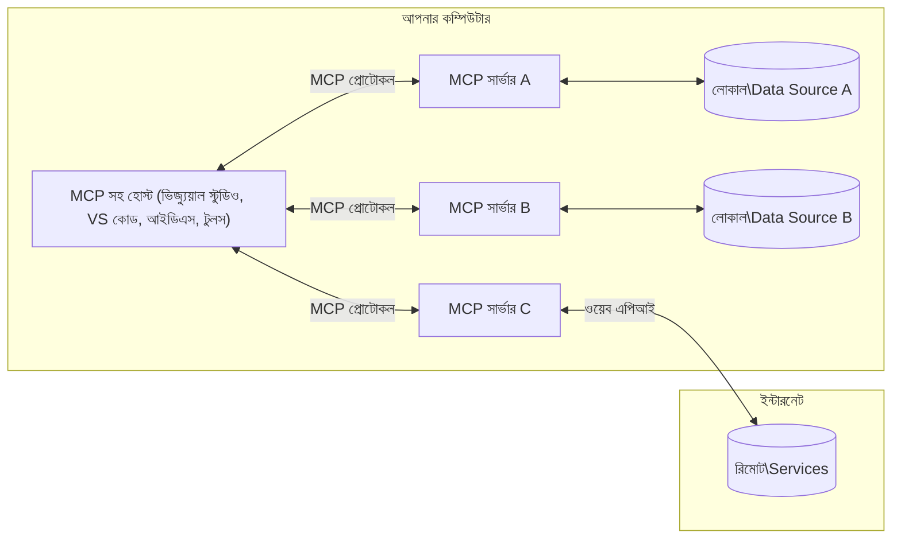

# MCP কোর ধারণা: AI ইন্টিগ্রেশনের জন্য মডেল কনটেক্সট প্রোটোকল আয়ত্ত করা

[](https://youtu.be/earDzWGtE84)

_(এই পাঠের ভিডিও দেখতে উপরের চিত্রটিতে ক্লিক করুন)_

[Model Context Protocol (MCP)](https://github.com/modelcontextprotocol) হল একটি শক্তিশালী, মানককৃত ফ্রেমওয়ার্ক যা বড় ভাষার মডেল (LLMs) এবং বাহ্যিক টুল, অ্যাপ্লিকেশন, এবং ডেটা সোর্সগুলোর মধ্যে যোগাযোগকে সর্বোত্তম করে তোলে।
এই গাইডটি MCP এর মূল ধারণাগুলো আপনাকে প্রদর্শন করবে। আপনি এর ক্লায়েন্ট-সার্ভার আর্কিটেকচার, অপরিহার্য উপাদানসমূহ, যোগাযোগের প্রক্রিয়া এবং বাস্তবায়নের সেরা অনুশীলনগুলি শিখবেন।

- **স্পষ্ট ব্যবহারকারী সম্মতি**: সমস্ত ডেটা অ্যাক্সেস এবং অপারেশন পূর্বে স্পষ্ট ব্যবহারকারী অনুমোদন প্রয়োজন। ব্যবহারকারীদের অবশ্যই স্পষ্টভাবে জানতে হবে কোন ডেটা অ্যাক্সেস করা হবে এবং কী কার্যকলাপ সম্পাদিত হবে, অনুমতি এবং অনুমোদনের ওপর বিশদ নিয়ন্ত্রণ সহ।

- **ডেটা গোপনীয়তা সুরক্ষা**: ব্যবহারকারীর ডেটা শুধুমাত্র স্পষ্ট সম্মতির মাধ্যমে প্রকাশ পায় এবং পুরো ইন্টারঅ্যাকশন লাইফসাইকেল জুড়ে শক্তিশালী অ্যাক্সেস নিয়ন্ত্রণ দ্বারা সুরক্ষিত থাকতে হবে। বাস্তবায়নগুলি অননুমোদিত ডেটা প্রেরণ প্রতিরোধ করতে হবে এবং কঠোর গোপনীয়তা সীমান্ত বজায় রাখতে হবে।

- **টুল কার্যকরী নিরাপত্তা**: প্রতিটি টুল আহ্বানে স্পষ্ট ব্যবহারকারী সম্মতি প্রয়োজন, টুলের কার্যকারিতা, প্যারামিটার এবং সম্ভাব্য প্রভাব সম্পর্কে স্পষ্ট বোঝাপড়া সহ। শক্তিশালী নিরাপত্তা সীমান্তগুলি অনিচ্ছাকৃত, অসুরক্ষিত বা দূরভাসী টুল কার্যকরীতা প্রতিরোধ করতে হবে।

- **ট্রান্সপোর্ট লেয়ার সিকিউরিটি**: সমস্ত যোগাযোগ চ্যানেল যথাযথ এনক্রিপশন এবং প্রমাণীকরণ পদ্ধতি ব্যবহার করা উচিত। রিমোট সংযোগগুলিতে নিরাপদ ট্রান্সপোর্ট প্রোটোকল এবং সঠিক ক্রেডেনশিয়াল ব্যবস্থাপনা বাস্তবায়ন করতে হবে।

#### বাস্তবায়ন নির্দেশিকা:

- **অনুমতি ব্যবস্থাপনা**: সূক্ষ্ম-গ্রেন্ডেড অনুমতি ব্যবস্থা বাস্তবায়ন করুন যা ব্যবহারকারীদের নিয়ন্ত্রণ করতে দেয় কোন সার্ভার, টুল, এবং রিসোর্স অ্যাক্সেসযোগ্য হবে
- **প্রমাণীকরণ ও অনুমোদন**: নিরাপদ প্রমাণীকরণ পদ্ধতি (OAuth, API কী) ব্যবহার করুন যথাযথ টোকেন ব্যবস্থাপনা এবং মেয়াদোত্তীর্ণকরণ সহ  
- **ইনপুট বৈধতা**: ইনজেকশন আক্রমণ প্রতিরোধ করতে সংজ্ঞায়িত স্কিমা অনুযায়ী সমস্ত প্যারামিটার এবং ডেটা ইনপুট যাচাই করুন
- **অডিট লগিং**: নিরাপত্তা পর্যবেক্ষণ এবং সম্মতি জন্য সমস্ত অপারেশনের ব্যাপক লগ বজায় রাখুন

## ওভারভিউ

এই পাঠে MCP ইকোসিস্টেমের মৌলিক আর্কিটেকচার এবং উপাদানসমূহ অনুসন্ধান করা হবে। আপনি ক্লায়েন্ট-সার্ভার আর্কিটেকচার, মূল উপাদান, এবং MCP ইন্টারঅ্যাকশন চালানোর যোগাযোগ প্রক্রিয়া সম্পর্কে শিখবেন।

## মূল শেখার উদ্দেশ্য

এই পাঠের শেষে, আপনি:

- MCP ক্লায়েন্ট-সার্ভার আর্কিটেকচার বুঝতে পারবেন।
- হোস্ট, ক্লায়েন্ট এবং সার্ভারের ভূমিকা ও দায়িত্ব সনাক্ত করতে পারবেন।
- MCP কে একটি নমনীয় ইন্টিগ্রেশন স্তর করে তোলে এমন মূল বৈশিষ্ট্যসমূহ বিশ্লেষণ করতে পারবেন।
- MCP ইকোসিস্টেমের মধ্যে তথ্য প্রবাহ কীভাবে হয় তা শিখবেন।
- .NET, Java, Python, এবং JavaScript এ কোড উদাহরণের মাধ্যমে ব্যবহারিক অন্তর্দৃষ্টি লাভ করবেন।

## MCP আর্কিটেকচার: গভীর দৃষ্টি

MCP ইকোসিস্টেমটি একটি ক্লায়েন্ট-সার্ভার মডেলের উপর নির্মিত। এই মডুলার কাঠামো AI অ্যাপ্লিকেশনগুলি টুল, ডাটাবেস, API এবং প্রাসঙ্গিক রিসোর্সের সাথে দক্ষভাবে ইন্টারঅ্যাক্ট করতে দেয়। আসুন এই আর্কিটেকচারটি এর মূল উপাদানে ভাঙ্গা যাক।

MCP মূলত একটি ক্লায়েন্ট-সার্ভার আর্কিটেকচার অনুসরণ করে যেখানে একটি হোস্ট অ্যাপ্লিকেশন একাধিক সার্ভারের সাথে সংযোগ স্থাপন করতে পারে:



- **MCP হোস্টস**: VSCode, Claude Desktop, IDEs, বা MCP এর মাধ্যমে ডেটা অ্যাক্সেস করতে চাওয়া AI টুলের মত প্রোগ্রামগুলি
- **MCP ক্লায়েন্টস**: সার্ভারের সাথে 1:1 সংযোগ রক্ষা করে এমন প্রোটোকল ক্লায়েন্টগুলি
- **MCP সার্ভারস**: স্ট্যান্ডার্ডাইজড Model Context Protocol এর মাধ্যমে নির্দিষ্ট সক্ষমতা প্রদান করে এমন হালকা প্রোগ্রামসমূহ
- **লোকাল ডেটা সোর্সেস**: আপনার কম্পিউটারের ফাইল, ডাটাবেস, এবং সার্ভিসগুলি যা MCP সার্ভার নিরাপদে অ্যাক্সেস করতে পারে
- **রিমোট সার্ভিসেস**: বাহ্যিক সিস্টেম যা ইন্টারনেটের মাধ্যমে MCP সার্ভার API ব্যবহার করে সংযোগ করতে পারে।

MCP প্রোটোকল একটি ক্রমবর্ধমান মানদণ্ড যা তারিখভিত্তিক সংস্করণ ব্যবহার করে (YYYY-MM-DD ফরম্যাট)। বর্তমান প্রোটোকল সংস্করণ হল **2025-11-25**। আপনি সর্বশেষ আপডেট দেখতে পারেন [প্রোটোকল স্পেসিফিকেশন](https://modelcontextprotocol.io/specification/2025-11-25/) এ।

> **আগামী নজর:** পরবর্তী স্পেসিফিকেশন সংস্করণ, **2026-07-28** এর একটি রিলিজ ক্যান্ডিডেট মে ২০২৬ এ ঘোষণা করা হয়েছিল এবং ২৮ জুলাই ২০২৬ এ প্রকাশের পরিকল্পনা রয়েছে। এটি ট্রান্সপোর্ট লেয়ারে প্রোটোকলকে স্টেটলেস করে তোলে (ইনিশিয়ালাইজ হ্যান্ডশেক এবং সেশন আইডি অপসারণ করে), একটি এক্সটেনশনস ফ্রেমওয়ার্ক আনুষ্ঠানিকভাবে তৈরি করে, এবং নতুন প্যাটার্নের জন্য Roots, Sampling এবং Logging কে অব্যবহৃত (ডিপ্রিকেট) করে। সম্পূর্ণ বিবরণের জন্য দেখুন [MCP এ কী পরিবর্তন হচ্ছে: ২০২৬-০৭-২৮ রিলিজ ক্যান্ডিডেট](./mcp-2026-07-28-release-candidate.md)।

### 1. হোস্টস

মডেল কনটেক্সট প্রোটোকল (MCP) এ, **হোস্টস** হল AI অ্যাপ্লিকেশন যা প্রোটোকলের সাথে ব্যবহারকারীর যোগাযোগের প্রধান ইন্টারফেস হিসেবে কাজ করে। হোস্টস MCP সার্ভারের সাথে মুভ সংযোগ স্থাপনের জন্য প্রতিটি সার্ভার সংযোগে নিবেদিত MCP ক্লায়েন্ট তৈরি করে সংযোগগুলো সমন্বয় ও পরিচালনা করে। হোস্টস উদাহরণস্বরূপ:

- **AI অ্যাপ্লিকেশনসমূহ**: Claude Desktop, Visual Studio Code, Claude Code
- **ডেভেলপমেন্ট পরিবেশ**: MCP ইন্টিগ্রেশনসহ IDE এবং কোড সম্পাদক  
- **কাস্টম অ্যাপ্লিকেশনসমূহ**: উদ্দেশ্যমূলক AI এজেন্ট এবং টুল

**হোস্টস** হল অ্যাপ্লিকেশনসমূহ যা AI মডেল ইন্টারঅ্যাকশন সমন্বয় করে। তারা:

- **AI মডেল অর্কেস্ট্রেট করে**: LLM এর সাথে ইন্টারঅ্যাক্ট করে প্রতিক্রিয়া তৈরি এবং AI কর্মপ্রবাহ সমন্বয় করে
- **ক্লায়েন্ট সংযোগ পরিচালনা করে**: প্রতিটি MCP সার্ভার সংযোগের জন্য একটি MCP ক্লায়েন্ট তৈরি ও রক্ষা করে
- **ব্যবহারকারী ইন্টারফেস নিয়ন্ত্রণ করে**: কথোপকথন প্রবাহ, ব্যবহারকারী ইন্টারঅ্যাকশন, এবং প্রতিক্রিয়া উপস্থাপন পরিচালনা করে  
- **নিরাপত্তা কার্যকর করে**: অনুমতি, নিরাপত্তা সীমাবদ্ধতা এবং প্রমাণীকরণ নিয়ন্ত্রণ করে
- **ব্যবহারকারী সম্মতি পরিচালনা করে**: ডেটা ভাগাভাগি এবং টুল কার্যকরিতার জন্য ব্যবহারকারী অনুমোদন পরিচালনা করে


### 2. ক্লায়েন্টস

**ক্লায়েন্টস** হল অপরিহার্য উপাদান যা হোস্ট এবং MCP সার্ভারের মধ্যে নিবেদিত এক-এক সংযোগ বজায় রাখে। প্রতিটি MCP ক্লায়েন্ট হোস্ট দ্বারা নির্দিষ্ট MCP সার্ভারের সাথে সংযোগের জন্য উদ্ভূত হয়, সংগঠিত এবং নিরাপদ যোগাযোগ চ্যানেল নিশ্চিত করে। একাধিক ক্লায়েন্ট হোস্টকে এক সময়ে একাধিক সার্ভারের সাথে সংযোগ করতে সক্ষম করে।

**ক্লায়েন্টস** হোস্ট অ্যাপ্লিকেশনের সংযোগকারী উপাদান। তারা:

- **প্রোটোকল যোগাযোগ**: সার্ভারে JSON-RPC 2.0 অনুরোধ প্রেরণ করে প্রম্পট এবং নির্দেশাবলী সহ
- **ক্ষমতা সমঝোতা**: ইনিশিয়ালাইজেশনের সময় সার্ভারের সাথে সমর্থিত বৈশিষ্ট্য এবং প্রোটোকল সংস্করণ আলোচনার মাধ্যমে নির্ধারণ করে
- **টুল কার্যকরীতা**: মডেল থেকে চাওয়া টুল কার্যকর করার অনুরোধগুলো পরিচালনা করে এবং প্রতিক্রিয়া প্রক্রিয়া করে
- **রিয়েল-টাইম আপডেট**: সার্ভারের নোটিফিকেশন এবং রিয়েল-টাইম আপডেট হ্যান্ডেল করে
- **প্রতিক্রিয়া প্রক্রিয়াকরণ**: সার্ভার প্রতিক্রিয়া প্রক্রিয়া করে এবং ব্যবহারকারীদের জন্য প্রদর্শনের উপযোগী করে তোলে

### 3. সার্ভারস

**সার্ভারস** হল প্রোগ্রাম যা MCP ক্লায়েন্টকে প্রাসঙ্গিক তথ্য, টুল এবং সক্ষমতা প্রদান করে। তারা স্থানীয়ভাবে (হোস্টের একই মেশিনে) অথবা দূরবর্তীভাবে (বাহ্যিক প্ল্যাটফর্মে) চলে পারে এবং ক্লায়েন্টের অনুরোধ গ্রহণ এবং সংগঠিত প্রতিক্রিয়া প্রদান করে। সার্ভার MCP এর স্ট্যান্ডার্ডাইজড Model Context Protocol এর মাধ্যমে নির্দিষ্ট কার্যকারিতা প্রকাশ করে।

**সার্ভারস** হল সেবা যা প্রসঙ্গ এবং সক্ষমতা প্রদান করে। তারা:

- **বৈশিষ্ট্য নিবন্ধন**: ক্লায়েন্টদের জন্য উপলব্ধ প্রিমিটিভ (রিসোর্স, প্রম্পট, টুল) নিবন্ধন এবং প্রকাশ করে
- **অনুরোধ প্রক্রিয়াকরণ**: ক্লায়েন্ট থেকে টুল কল, রিসোর্স অনুরোধ এবং প্রম্পট অনুরোধ গ্রহণ এবং কার্যকর করে
- **প্রাসঙ্গিকতা প্রদান**: মডেলের প্রতিক্রিয়া উন্নত করতে প্রাসঙ্গিক তথ্য এবং ডেটা দেয়
- **রাষ্ট্র পরিচালনা**: সেশন রাজ্য বজায় রাখে এবং প্রয়োজনে রাজ্য সংক্রান্ত ইন্টারঅ্যাকশন পরিচালনা করে
- **রিয়েল-টাইম নোটিফিকেশন**: সক্ষমতা পরিবর্তন এবং আপডেট সম্পর্কে ক্লায়েন্টকে নোটিফিকেশন প্রেরণ করে

সার্ভার যেকেউ তৈরি করতে পারে মডেলের সক্ষমতা বিশেষায়িত কার্যকারিতার মাধ্যমে সম্প্রসারিত করার জন্য, এবং তারা স্থানীয় এবং দূরবর্তী উভয় ডিপ্লয়মেন্ট সমর্থন করে।

### 4. সার্ভার প্রিমিটিভস

মডেল কনটেক্সট প্রোটোকল (MCP) এ সার্ভার তিনটি মূল **প্রিমিটিভস** প্রদান করে যা ক্লায়েন্ট, হোস্ট এবং ভাষা মডেলের মধ্যে সমৃদ্ধ ইন্টারঅ্যাকশনের মৌলিক উপাদান নির্ধারণ করে। এই প্রিমিটিভগুলি প্রোটোকলের মাধ্যমে উপলব্ধ প্রসঙ্গগত তথ্য এবং ক্রিয়াকলাপের ধরন নির্ধারণ করে।

MCP সার্ভার নিম্নলিখিত তিনটি মূল প্রিমিটিভের যেকোনো সংমিশ্রণ প্রকাশ করতে পারে:

#### রিসোর্সেস 

**রিসোর্সেস** হল ডেটা সোর্স যা AI অ্যাপ্লিকেশনগুলিকে প্রসঙ্গগত তথ্য প্রদান করে। এগুলো স্থির বা গতিশীল বিষয়বস্তু যা মডেলের বোঝাপড়া এবং সিদ্ধান্ত গ্রহণে উন্নতি করে:

- **প্রসঙ্গগত ডেটা**: AI মডেল ব্যবহারের জন্য সংগঠিত তথ্য এবং প্রসঙ্গ
- **জ্ঞানভিত্তিক ভাণ্ডার**: ডকুমেন্ট রিপোজিটরি, নিবন্ধ, ম্যানুয়াল, এবং গবেষণাপত্র
- **লোকাল ডেটা সোর্সেস**: ফাইল, ডাটাবেস, এবং স্থানীয় সিস্টেম তথ্য  
- **বহিঃস্থ ডেটা**: API প্রতিক্রিয়া, ওয়েব সার্ভিস, এবং রিমোট সিস্টেম ডেটা
- **গতিশীল বিষয়বস্তু**: বাহ্যিক পরিস্থিতির উপর ভিত্তি করে আপডেট হওয়া রিয়েল-টাইম ডেটা

রিসোর্সেস URI দ্বারা সনাক্ত করা হয় এবং `resources/list` এর মাধ্যমে আবিষ্কার এবং `resources/read` পদ্ধতির মাধ্যমে আহরণ সমর্থন করে:

```text
file://documents/project-spec.md
database://production/users/schema
api://weather/current
```

#### প্রম্পটস

**প্রম্পটস** হল পুনঃব্যবহারযোগ্য টেমপ্লেট যা ভাষা মডেলের সাথে ইন্টারঅ্যাকশন গঠন করতে সাহায্য করে। তারা মানকৃত ইন্টারঅ্যাকশন প্যাটার্ন এবং টেমপ্লেটযুক্ত কাজের প্রবাহ প্রদান করে:

- **টেমপ্লেট-ভিত্তিক ইন্টারঅ্যাকশন**: পূর্বনির্ধারিত বার্তা এবং কথোপকথনের সূচনা
- **কাজের প্রবাহের টেমপ্লেটসমূহ**: সাধারণ কাজ এবং ইন্টারঅ্যাকশনের জন্য মানক ক্রম
- **কিছুনমুন উদাহরণ**: মডেল নির্দেশনার জন্য উদাহরণ-ভিত্তিক টেমপ্লেট
- **সিস্টেম প্রম্পট**: মডেলের আচরণ এবং প্রসঙ্গ নির্ধারণকারী বুনিয়াদি প্রম্পটসমূহ
- **গতিশীল টেমপ্লেট**: নির্দিষ্ট প্রসঙ্গ অনুযায়ী মানানো প্যারামিটারযুক্ত প্রম্পট

প্রম্পটস ভেরিয়েবল প্রতিস্থাপন সমর্থন করে এবং `prompts/list` এর মাধ্যমে আবিষ্কার এবং `prompts/get` পদ্ধতির মাধ্যমে আহরণ করা যায়:

```markdown
Generate a {{task_type}} for {{product}} targeting {{audience}} with the following requirements: {{requirements}}
```

#### টুলস

**টুলস** হল কার্যকরী ফাংশন যা AI মডেল নির্দিষ্ট কাজ সম্পাদনের জন্য আহ্বান করতে পারে। তারা MCP ইকোসিস্টেমের "ক্রিয়া বিশেষণ" হিসেবে কাজ করে, মডেলকে বাহ্যিক সিস্টেমের সাথে ইন্টারঅ্যাক্ট করার ক্ষমতা দেয়:

- **কার্যকরী ফাংশনসমূহ**: নির্দিষ্ট প্যারামিটার সহ মডেল দ্বারা আহ্বানযোগ্য ভিন্ন কার্যাবলী
- **বাহ্যিক সিস্টেম ইন্টিগ্রেশন**: API কল, ডাটাবেস কোয়েরি, ফাইল অপারেশন, গণনা
- **অদ্বিতীয় পরিচয়**: প্রতিটি টুলের একটি স্বতন্ত্র নাম, বিবরণ, এবং প্যারামিটার স্কিমা থাকে
- **গঠিত ইনপুট/আউটপুট**: টুলগুলো যাচাইকৃত প্যারামিটার গ্রহণ করে এবং গঠিত, টাইপকৃত প্রতিক্রিয়া ফেরত দেয়
- **ক্রিয়ার সক্ষমতা**: মডেলকে বাস্তব দুনিয়ার কার্যকলাপ সম্পাদন এবং লাইভ ডেটা পুনরুদ্ধারে সক্ষম করে

টুলগুলো প্যারামিটার বৈধতার জন্য JSON স্কিমা দিয়ে সংজ্ঞায়িত এবং `tools/list` এর মাধ্যমে আবিষ্কার এবং `tools/call` এর মাধ্যমে কার্যকর করা হয়। UI প্রদর্শনের জন্য বিকল্প মেটাডেটা হিসাবে **আইকন** অন্তর্ভুক্ত করা যেতে পারে।

**টুল অ্যানোটেশনস**: টুলগুলো আচরণগত অ্যানোটেশন সমর্থন করে (যেমন, `readOnlyHint`, `destructiveHint`) যা টুলটি শুধুমাত্র-পঠনীয় বা ধ্বংসাত্মক কিনা বর্ণনা করে, ক্লায়েন্টকে টুল কার্যকর সম্পর্কে জ্ঞানসম্পন্ন সিদ্ধান্ত গ্রহণে সহায়তা করে।

উদাহরণস্বরূপ টুল সংজ্ঞা:

```typescript
server.tool(
  "search_products", 
  {
    query: z.string().describe("Search query for products"),
    category: z.string().optional().describe("Product category filter"),
    max_results: z.number().default(10).describe("Maximum results to return")
  }, 
  async (params) => {
    // অনুসন্ধান সম্পাদন করুন এবং কাঠামোবদ্ধ ফলাফল ফিরিয়ে দিন
    return await productService.search(params);
  }
);
```

## ক্লায়েন্ট প্রিমিটিভস

মডেল কনটেক্সট প্রোটোকল (MCP) এ, **ক্লায়েন্টস** এমন প্রিমিটিভস প্রকাশ করতে পারে যা সার্ভারকে হোস্ট অ্যাপ্লিকেশন থেকে অতিরিক্ত সক্ষমতার অনুরোধ করতে সক্ষম করে। এই ক্লায়েন্ট-পাশ প্রিমিটিভস আরও সমৃদ্ধ, ইন্টারঅ্যাকটিভ সার্ভার বাস্তবায়ন সক্ষম করে যা AI মডেল সক্ষমতা এবং ব্যবহারকারী ইন্টারঅ্যাকশনে অ্যাক্সেস পেতে পারে।

### স্যাম্পলিং

> **অব্যবহৃত ঘোষণাঃ** `2026-07-28` রিলিজ ক্যান্ডিডেট স্যাম্পলিংকে LLM প্রোভাইডার API-র সরাসরি ইন্টিগ্রেশনের পক্ষে অব্যবহৃত ঘোষণা করে। এটি `2025-11-25` এ কাজ চালিয়ে যায় এবং অব্যবহৃত ঘোষণার একটি বছর পর্যন্ত ব্যবহৃত হয়, তবে নতুন ডিজাইন প্রতিস্থাপন প্যাটার্নকে অগ্রাধিকার দেয়। বিস্তারিত জানুন [MCP এ কী পরিবর্তন হচ্ছে: ২০২৬-০৭-২৮ রিলিজ ক্যান্ডিডেট](./mcp-2026-07-28-release-candidate.md)।

**স্যাম্পলিং** সার্ভারকে ক্লায়েন্টের AI অ্যাপ্লিকেশন থেকে ভাষা মডেল কমপ্লিশন অনুরোধ করতে সক্ষম করে। এই প্রিমিটিভ সার্ভারকে তাদের নিজস্ব মডেল নির্ভরতা ছাড়াই LLM সক্ষমতা অ্যাক্সেস করার সুযোগ দেয়:

- **মডেল-স্বতন্ত্র অ্যাক্সেস**: সার্ভার LLM SDK অন্তর্ভুক্ত বা মডেল অ্যাক্সেস পরিচালনা ছাড়া কমপ্লিশন অনুরোধ করতে পারে
- **সার্ভার-প্রবর্তিত AI**: সার্ভার স্বয়ংক্রিয়ভাবে ক্লায়েন্টের AI মডেল ব্যবহার করে বিষয়বস্তু তৈরি করতে পারে
- **পুনরাবৃত্ত LLM ইন্টারঅ্যাকশন**: জটিল পরিস্থিতি সমর্থন করে যেখানে সার্ভার AI সহায়তার জন্য প্রক্রিয়া করতে চায়
- **গতিশীল বিষয়বস্তু নির্মাণ**: হোস্টের মডেল ব্যবহার করে প্রসঙ্গগত প্রতিক্রিয়া তৈরি করতে সার্ভার সক্ষম
- **টুল কলে সহায়তা**: সার্ভার `tools` এবং `toolChoice` প্যারামিটার অন্তর্ভুক্ত করতে পারে যাতে ক্লায়েন্টের মডেল স্যাম্পলিং চলাকালে টুল আহ্বান করতে পারে

স্যাম্পলিং `sampling/complete` পদ্ধতির মাধ্যমে শুরু হয়, যেখানে সার্ভার ক্লায়েন্টকে কমপ্লিশন অনুরোধ পাঠায়।

### রুটস

> **অব্যবহৃত ঘোষণাঃ** `2026-07-28` রিলিজ ক্যান্ডিডেট রুটসকে টুল প্যারামিটার, রিসোর্স URI, অথবা সার্ভার কনফিগারেশনের পক্ষে অব্যবহৃত ঘোষণা করে। এটি `2025-11-25` এ কাজ করে এবং অন্ততম এক বছর অব্যবহৃত ঘোষণার পরও চালিত হয়। বিস্তারিত জানুন [MCP এ কী পরিবর্তন হচ্ছে: ২০২৬-০৭-২৮ রিলিজ ক্যান্ডিডেট](./mcp-2026-07-28-release-candidate.md)।

**রুটস** সার্ভারকে ফাইলসিস্টেমের সীমা প্রদর্শনের জন্য ক্লায়েন্টকে একটি মানক উপায় প্রদান করে, যা সার্ভারকে বোঝাতে সাহায্য করে তারা কোন ডিরেক্টরি এবং ফাইল অ্যাক্সেস করতে পারে:

- **ফাইলসিস্টেম সীমা**: সার্ভার যেসব ফাইলসিস্টেম অংশে কাজ করতে পারে তার সীমা নির্ধারণ করে
- **অ্যাক্সেস নিয়ন্ত্রণ**: সার্ভারকে বোঝায় তারা কোন ডিরেক্টরি এবং ফাইলে প্রবেশের অনুমতি পেয়েছে
- **গতিশীল আপডেট**: রুট তালিকা পরিবর্তিত হলে ক্লায়েন্ট সার্ভারকে অবহিত করতে পারে
- **URI-ভিত্তিক সনাক্তকরণ**: রুটস `file://` URI ব্যবহার করে অ্যাক্সেসযোগ্য ডিরেক্টরি এবং ফাইল সনাক্ত করে

রুটস `roots/list` পদ্ধতির মাধ্যমে আবিষ্কৃত হয়, এবং রুট পরিবর্তন হলে ক্লায়েন্ট `notifications/roots/list_changed` পাঠায়।

### ইলিসিটেশন  

**ইলিসিটেশন** সার্ভারকে ক্লায়েন্ট ইন্টারফেসের মাধ্যমে ব্যবহারকারীর কাছ থেকে অতিরিক্ত তথ্য বা নিশ্চিতকরণ অনুরোধ করার সুযোগ দেয়:

- **ব্যবহারকারী ইনপুট অনুরোধ**: টুল কার্যকর করার জন্য প্রয়োজনীয় অতিরিক্ত তথ্য সার্ভার চাইতে পারে
- **নিশ্চিতকরণ ডায়ালগ**: সংবেদনশীল বা প্রভাবশালী অপারেশনের জন্য ব্যবহারকারী অনুমোদন চাওয়া
- **ইন্টারঅ্যাকটিভ কাজের প্রবাহ**: ধাপে ধাপে ব্যবহারকারী ইন্টারঅ্যাকশন তৈরি করতে সার্ভার সক্ষম করে
- **গতিশীল প্যারামিটার সংগ্রহ**: টুল কার্যকর চলাকালে অনুপস্থিত বা ঐচ্ছিক প্যারামিটার সংগ্রহ

ইলিসিটেশন অনুরোধ `elicitation/request` পদ্ধতি ব্যবহার করে করা হয় যা ক্লায়েন্ট ইন্টারফেসের মাধ্যমে ব্যবহারকারী ইনপুট সংগ্রহ করে।

**URL মোড ইলিসিটেশন**: সার্ভার URL ভিত্তিক ব্যবহারকারী ইন্টারঅ্যাকশনও অনুরোধ করতে পারে, যা ব্যবহারকারীকে বাহ্যিক ওয়েব পৃষ্ঠায় প্রমাণীকরণ, নিশ্চিতকরণ, বা ডেটা প্রবেশের জন্য নির্দেশ করে।

### লগিং


> **বাতিলের বিজ্ঞপ্তি:** `2026-07-28` রিলিজ প্রার্থী Logging-এর পরিবর্তে stdio ট্রান্সপোর্টগুলির জন্য `stderr` এবং কাঠামোগত পর্যবেক্ষণক্ষমতার জন্য OpenTelemetry কে প্রাধান্য দেয়। এটি `2025-11-25` এ এবং বাতিলের পর অন্তত এক বছর কাজ চালিয়ে যাবে। দেখুন [MCP-তে কি পরিবর্তন হচ্ছে: 2026-07-28 রিলিজ প্রার্থী](./mcp-2026-07-28-release-candidate.md)।

**Logging** সার্ভারগুলিকে ক্লায়েন্টদের জন্য ত্রুটি অনুসন্ধান, পর্যবেক্ষণ এবং অপারেশনাল দৃশ্যমানতার জন্য কাঠামোবদ্ধ লগ বার্তা পাঠাতে সক্ষম করে:

- **ডিবাগিং সাপোর্ট**: সমস্যা সমাধানের জন্য বিস্তারিত কার্যকরী লগ সার্ভার থেকে সরবরাহ করা সম্ভব করে তোলে
- **অপারেশনাল মনিটরিং**: ক্লায়েন্টদের স্থিতি আপডেট এবং কর্মক্ষমতা পরিমাপ পাঠায়
- **ত্রুটি রিপোর্টিং**: বিস্তারিত ত্রুটি প্রেক্ষাপট এবং নির্ণয় তথ্য সরবরাহ করে
- **অডিট ট্রেইলস**: সার্ভারের কার্যক্রম এবং সিদ্ধান্তের ব্যাপক লগ তৈরি করে

সার্ভারের কার্যক্রমে স্বচ্ছতা দেওয়ার জন্য এবং ডিবাগিং সহজ করার জন্য লগ বার্তাগুলো ক্লায়েন্টদের প্রেরণ করা হয়।

## MCP-তে তথ্য প্রবাহ

মডেল কনটেক্সট প্রোটোকল (MCP) হোস্ট, ক্লায়েন্ট, সার্ভার, এবং মডেলগুলির মধ্যে তথ্যের একটি কাঠামোবদ্ধ প্রবাহ সংজ্ঞায়িত করে। এই প্রবাহ বোঝা ইউজারের অনুরোধ কীভাবে প্রক্রিয়াকৃত হয় এবং কীভাবে বাহ্যিক সরঞ্জাম ও ডেটা মডেল প্রতিক্রিয়াতে সংযুক্ত হয় তা স্পষ্ট করে।

- **হোস্ট সংযোগ সূচনা করে**  
  হোস্ট অ্যাপ্লিকেশন (যেমন IDE বা চ্যাট ইন্টারফেস) সাধারণত STDIO, WebSocket, অথবা অন্য সমর্থিত ট্রান্সপোর্টের মাধ্যমে MCP সার্ভারের সাথে সংযোগ স্থাপন করে।

- **ক্ষমতা আলোচনা**  
  হোস্টের মধ্যে এমবেড্ড ক্লায়েন্ট এবং সার্ভার তাদের সমর্থিত বৈশিষ্ট্য, সরঞ্জাম, রিসোর্স, এবং প্রোটোকল সংস্করণ সম্পর্কে তথ্য বিনিময় করে। এটি নিশ্চিত করে যে উভয় পক্ষ সেশনের জন্য উপলব্ধ সক্ষমতা বোঝে।

- **ব্যবহারকারীর অনুরোধ**  
  ব্যবহারকারী হোস্টের সঙ্গে যোগাযোগ করে (যেমন একটি প্রম্পট বা কমান্ড প্রবেশ করানো)। হোস্ট এই ইনপুট সংগ্রহ করে ক্লায়েন্টের কাছে প্রক্রিয়াকরণের জন্য পাঠায়।

- **সাধন বা সরঞ্জামের ব্যবহার**  
  - ক্লায়েন্ট অতিরিক্ত প্রেক্ষাপট বা রিসোর্স (যেমন ফাইল, ডেটাবেস এন্ট্রি, বা জ্ঞানভিত্তিক নিবন্ধ) সার্ভার থেকে অনুরোধ করতে পারে মডেলের বোঝাপড়া সমৃদ্ধ করতে।
  - মডেল যদি নির্ধারণ করে যে একটি সরঞ্জামের প্রয়োজন (যেমন তথ্য সংগ্রহ, গণনা করা, অথবা API কল করা), ক্লায়েন্ট সরঞ্জাম নাম এবং প্যারামিটার সহ সরঞ্জাম আহ্বানের অনুরোধ সার্ভারে পাঠায়।

- **সার্ভার কার্যকরকরণ**  
  সার্ভার রিসোর্স বা সরঞ্জামের অনুরোধ গ্রহণ করে, প্রয়োজনীয় ক্রিয়াকলাপ সম্পাদন করে (যেমন ফাংশন চালানো, ডেটাবেস প্রশ্ন করা, অথবা ফাইল পুনরুদ্ধার করা), এবং কাঠামোবদ্ধ ফরম্যাটে ফলাফল ক্লায়েন্টকে ফেরত দেয়।

- **প্রতিক্রিয়া তৈরী**  
  ক্লায়েন্ট সার্ভারের প্রতিক্রিয়াসমূহ (রিসোর্স ডেটা, সরঞ্জাম আউটপুট ইত্যাদি) চলমান মডেল ইন্টারঅ্যাকশনে সংহত করে। মডেল এই তথ্য ব্যবহার করে বিস্তৃত এবং প্রসঙ্গানুগ উপযুক্ত প্রতিক্রিয়া তৈরি করে।

- **ফলাফল উপস্থাপন**  
  হোস্ট ক্লায়েন্ট থেকে চূড়ান্ত আউটপুট গ্রহণ করে এবং ব্যবহারকারীর কাছে উপস্থাপন করে, প্রায়শই মডেলের তৈরি টেক্সট এবং সরঞ্জাম কার্যকরকরণের বা রিসোর্স অন্বেষণের ফলাফল অন্তর্ভুক্ত থাকে।

এই প্রবাহ MCP-কে সক্ষম করে উন্নত, ইন্টারঅ্যাকটিভ, এবং প্রসঙ্গ সচেতন AI অ্যাপ্লিকেশন সমর্থন করতে মডেলকে বাহ্যিক সরঞ্জাম ও ডেটা উৎসের সঙ্গে নির্বিঘ্নে সংযোগ করার মাধ্যমে।

## প্রোটোকল আর্কিটেকচার ও স্তর

MCP দুটি পৃথক স্থাপত্য স্তর নিয়ে গঠিত যা একত্রে একটি পূর্ণাঙ্গ যোগাযোগ কাঠামো প্রদান করে:

### ডেটা স্তর

**ডেটা স্তর** হ'ল মূল MCP প্রোটোকল বাস্তবায়ন যা **JSON-RPC 2.0** কে ভিত্তি হিসেবে ব্যবহার করে। এই স্তর বার্তা কাঠামো, বর্ণনা এবং ইন্টারঅ্যাকশনের ধরণ সংজ্ঞায়িত করে:

#### প্রধান উপাদানসমূহ:

- **JSON-RPC 2.0 প্রোটোকল**: সমস্ত যোগাযোগের জন্য মানসম্মত JSON-RPC 2.0 বার্তা ফরম্যাট ব্যবহৃত হয় পদ্ধতি কল, প্রতিক্রিয়া, এবং বিজ্ঞপ্তির জন্য
- **লাইফসাইকেল ম্যানেজমেন্ট**: ক্লায়েন্ট ও সার্ভারের মধ্যে সংযোগ সূচনা, ক্ষমতা আলোচনা, এবং সেশন সমাপ্তি পরিচালনা করে
- **সার্ভার প্রিমিটিভস**: সরঞ্জাম, রিসোর্স এবং প্রম্পটের মাধ্যমে সার্ভারকে মূল কার্যকারিতা প্রদান সম্ভব করে
- **ক্লায়েন্ট প্রিমিটিভস**: সার্ভার LLM থেকে স্যাম্পলিং অনুরোধ, ব্যবহারকারীর ইনপুট আহ্বান, এবং লগ বার্তা পাঠানোর ক্ষমতা দেয়
- **রিয়েল-টাইম বিজ্ঞপ্তি**: পোলিং ছাড়াই গতিশীল আপডেটের জন্য অ্যাসিঙ্ক্রোনাস বিজ্ঞপ্তি সাপোর্ট করে

#### গুরুত্বপূর্ণ বৈশিষ্ট্য:

- **প্রোটোকল সংস্করণ আলোচনা**: তারিখ ভিত্তিক সংস্করণ ব্যবহার করে (YYYY-MM-DD) সামঞ্জস্যতা নিশ্চিত করে
- **ক্ষমতা আবিষ্কার**: ক্লায়েন্ট ও সার্ভার সূচনালগ্নে সমর্থিত বৈশিষ্ট্যের তথ্য বিনিময় করে
- **স্টেটফুল সেশন**: প্রসঙ্গ ধারাবাহিকতার জন্য একাধিক ইন্টারঅ্যাকশনের মধ্যে সংযোগের অবস্থা বজায় রাখে

### ট্রান্সপোর্ট স্তর

**ট্রান্সপোর্ট স্তর** MCP অংশগ্রহণকারীদের মধ্যে যোগাযোগ চ্যানেল, বার্তা ফ্রেমিং, এবং প্রমাণীকরণ পরিচালনা করে:

#### সমর্থিত ট্রান্সপোর্ট প্রক্রিয়া:

১. **STDIO ট্রান্সপোর্ট**:
   - সরাসরি প্রসেস যোগাযোগের জন্য স্ট্যান্ডার্ড ইনপুট/আউটপুট স্ট্রিম ব্যবহার করে
   - একই মেশিনে স্থানীয় প্রসেসের জন্য সর্বোত্তম, কোন নেটওয়ার্ক ওভারহেড নেই
   - স্থানীয় MCP সার্ভার বাস্তবায়নের জন্য সাধারণত ব্যবহৃত

২. **স্ট্রিমেবল HTTP ট্রান্সপোর্ট**:
   - ক্লায়েন্ট থেকে সার্ভারে বার্তাগুলির জন্য HTTP POST ব্যবহার করে  
   - সার্ভার থেকে ক্লায়েন্ট স্ট্রিমিংয়ের জন্য ঐচ্ছিক সার্ভার-সেন্ট ইভেন্টস (SSE)
   - নেটওয়ার্ক জুড়ে দূরবর্তী সার্ভার যোগাযোগ সক্ষম করে
   - সাধারণ HTTP প্রমাণীকরণ সাপোর্ট করে (বিয়ারার টোকেন, API কী, কাস্টম হেডার)
   - নিরাপদ টোকেন ভিত্তিক প্রমাণীকরণের জন্য MCP OAuth সুপারিশ করে

#### ট্রান্সপোর্ট বিমূর্তকরণ:

ট্রান্সপোর্ট স্তর ডেটা স্তর থেকে যোগাযোগের বিবরণ দূর করে, একই JSON-RPC 2.0 বার্তা ফরম্যাট সমস্ত ট্রান্সপোর্ট প্রক্রিয়ায় সক্ষম করে। এই বিমূর্তকরণ অ্যাপ্লিকেশনকে স্থানীয় এবং দূরবর্তী সার্ভারের মধ্যে নির্বিঘ্নে স্যুইচ করার সুযোগ দেয়।

### নিরাপত্তা বিবেচনা

MCP বাস্তবায়নগুলি নিরাপদ, বিশ্বাসযোগ্য, এবং সুরক্ষিত ইন্টারঅ্যাকশনের জন্য কয়েকটি গুরুত্বপূর্ণ নিরাপত্তা নীতির প্রতি কঠোর থাকতে হবে:

- **ব্যবহারকারীর সম্মতি ও নিয়ন্ত্রণ**: ডেটা অ্যাক্সেস বা অপারেশন চালানোর আগে ব্যবহারকারীর স্পষ্ট সম্মতি থাকতে হবে। তারা কী ডেটা শেয়ার হচ্ছে এবং কোন ক্রিয়াকলাপ অনুমোদিত তা স্পষ্টভাবে নিয়ন্ত্রণ করতে পারবে, এবং কার্যক্রম পর্যালোচনা ও অনুমোদনের জন্য সহজবোধ্য ইউজার ইন্টারফেস দ্বারা সহায়তা পাবেন।

- **ডেটা গোপনীয়তা**: ব্যবহারকারীর ডেটা শুধুমাত্র স্পষ্ট সম্মতির মাধ্যমে প্রকাশিত হবে এবং প্রযোজ্য প্রবেশাধিকার নিয়ন্ত্রণ দ্বারা সুরক্ষিত থাকবে। MCP বাস্তবায়ন অবৈধ ডেটা সংক্রমণ রোধ করবে এবং নিশ্চিত করবে গোপনীয়তা সব ইন্টারঅ্যাকশনে বজায় থাকে।

- **সরঞ্জাম নিরাপত্তা**: যেকোনো সরঞ্জাম আহ্বানের আগে স্পষ্ট ব্যবহারকারীর সম্মতি প্রয়োজন। ব্যবহারকারী প্রতিটি সরঞ্জামের কার্যকারিতা স্পষ্টভাবে বুঝতে পারবে, এবং দুর্ঘটনাক্রমে বা অমঙ্গলজনক সরঞ্জাম কার্যকরতা রোধে শক্তিশালী নিরাপত্তা সীমাবদ্ধতা প্রয়োগ করা হবে।

এই নিরাপত্তা নীতি অনুসরণ করে MCP ব্যবহারকারীর বিশ্বাস, গোপনীয়তা, এবং নিরাপত্তা রক্ষা করে সমস্ত প্রোটোকল ইন্টারঅ্যাকশনের সময়, একই সময়ে শক্তিশালী AI একীকরণের জন্য সুযোগ তৈরি করে।

## কোড উদাহরণ: প্রধান উপাদানসমূহ

নিচে জনপ্রিয় প্রোগ্রামিং ভাষাগুলির কোড উদাহরণ রয়েছে যা কীভাবে MCP সার্ভার উপাদান এবং সরঞ্জামগুলি বাস্তবায়ন করা যায় তা প্রদর্শন করে।

### .NET উদাহরণ: সর্ত MCP সার্ভার তৈরি সরঞ্জামসহ

একটি ব্যবহারিক .NET কোড উদাহরণ যা একটি সরল MCP সার্ভার কাস্টম সরঞ্জাম নিয়ে কীভাবে বাস্তবায়ন করা যায় তা দেখায়। উদাহরণটি সরঞ্জাম সংজ্ঞায়িত এবং রেজিস্টার করা, অনুরোধ পরিচালনা করা, এবং MCP ব্যবহার করে সার্ভারের সংযোগ স্থাপনের পদ্ধতি প্রদর্শন করে।

```csharp
using System;
using System.Threading.Tasks;
using ModelContextProtocol.Server;
using ModelContextProtocol.Server.Transport;
using ModelContextProtocol.Server.Tools;

public class WeatherServer
{
    public static async Task Main(string[] args)
    {
        // Create an MCP server
        var server = new McpServer(
            name: "Weather MCP Server",
            version: "1.0.0"
        );
        
        // Register our custom weather tool
        server.AddTool<string, WeatherData>("weatherTool", 
            description: "Gets current weather for a location",
            execute: async (location) => {
                // Call weather API (simplified)
                var weatherData = await GetWeatherDataAsync(location);
                return weatherData;
            });
        
        // Connect the server using stdio transport
        var transport = new StdioServerTransport();
        await server.ConnectAsync(transport);
        
        Console.WriteLine("Weather MCP Server started");
        
        // Keep the server running until process is terminated
        await Task.Delay(-1);
    }
    
    private static async Task<WeatherData> GetWeatherDataAsync(string location)
    {
        // This would normally call a weather API
        // Simplified for demonstration
        await Task.Delay(100); // Simulate API call
        return new WeatherData { 
            Temperature = 72.5,
            Conditions = "Sunny",
            Location = location
        };
    }
}

public class WeatherData
{
    public double Temperature { get; set; }
    public string Conditions { get; set; }
    public string Location { get; set; }
}
```

### Java উদাহরণ: MCP সার্ভার উপাদানসমূহ

এই উদাহরণটি .NET উদাহরণের মতো একই MCP সার্ভার ও সরঞ্জাম রেজিস্ট্রেশন দেখায়, তবে Java-তে বাস্তবায়িত।

```java
import io.modelcontextprotocol.server.McpServer;
import io.modelcontextprotocol.server.McpToolDefinition;
import io.modelcontextprotocol.server.transport.StdioServerTransport;
import io.modelcontextprotocol.server.tool.ToolExecutionContext;
import io.modelcontextprotocol.server.tool.ToolResponse;

public class WeatherMcpServer {
    public static void main(String[] args) throws Exception {
        // একটি MCP সার্ভার তৈরি করুন
        McpServer server = McpServer.builder()
            .name("Weather MCP Server")
            .version("1.0.0")
            .build();
            
        // একটি আবহাওয়া টুল নিবন্ধন করুন
        server.registerTool(McpToolDefinition.builder("weatherTool")
            .description("Gets current weather for a location")
            .parameter("location", String.class)
            .execute((ToolExecutionContext ctx) -> {
                String location = ctx.getParameter("location", String.class);
                
                // আবহাওয়ার ডেটা পান (সরলীকৃত)
                WeatherData data = getWeatherData(location);
                
                // ফরম্যাট করা প্রতিক্রিয়া ফেরত দিন
                return ToolResponse.content(
                    String.format("Temperature: %.1f°F, Conditions: %s, Location: %s", 
                    data.getTemperature(), 
                    data.getConditions(), 
                    data.getLocation())
                );
            })
            .build());
        
        // stdio ট্রান্সপোর্ট ব্যবহার করে সার্ভার সংযুক্ত করুন
        try (StdioServerTransport transport = new StdioServerTransport()) {
            server.connect(transport);
            System.out.println("Weather MCP Server started");
            // প্রক্রিয়া समाप्त হওয়া পর্যন্ত সার্ভার চালিয়ে যান
            Thread.currentThread().join();
        }
    }
    
    private static WeatherData getWeatherData(String location) {
        // বাস্তবায়নটি একটি আবহাওয়া API কল করবে
        // উদাহরণস্বরূপ সরলীকৃত
        return new WeatherData(72.5, "Sunny", location);
    }
}

class WeatherData {
    private double temperature;
    private String conditions;
    private String location;
    
    public WeatherData(double temperature, String conditions, String location) {
        this.temperature = temperature;
        this.conditions = conditions;
        this.location = location;
    }
    
    public double getTemperature() {
        return temperature;
    }
    
    public String getConditions() {
        return conditions;
    }
    
    public String getLocation() {
        return location;
    }
}
```

### Python উদাহরণ: MCP সার্ভার নির্মাণ

এই উদাহরণটি fastmcp ব্যবহার করে, সুতরাং প্রথমে এটি ইনস্টল করা নিশ্চিত করুন:

```python
pip install fastmcp
```
Code Sample:

```python
#!/usr/bin/env python3
import asyncio
from fastmcp import FastMCP
from fastmcp.transports.stdio import serve_stdio

# একটি FastMCP সার্ভার তৈরি করুন
mcp = FastMCP(
    name="Weather MCP Server",
    version="1.0.0"
)

@mcp.tool()
def get_weather(location: str) -> dict:
    """Gets current weather for a location."""
    return {
        "temperature": 72.5,
        "conditions": "Sunny",
        "location": location
    }

# একটি ক্লাস ব্যবহার করে বিকল্প পদ্ধতি
class WeatherTools:
    @mcp.tool()
    def forecast(self, location: str, days: int = 1) -> dict:
        """Gets weather forecast for a location for the specified number of days."""
        return {
            "location": location,
            "forecast": [
                {"day": i+1, "temperature": 70 + i, "conditions": "Partly Cloudy"}
                for i in range(days)
            ]
        }

# ক্লাস টুল রেজিস্টার করুন
weather_tools = WeatherTools()

# সার্ভার শুরু করুন
if __name__ == "__main__":
    asyncio.run(serve_stdio(mcp))
```

### JavaScript উদাহরণ: MCP সার্ভার তৈরি

এই উদাহরণটি JavaScript-এ MCP সার্ভার তৈরি প্রদর্শন করে এবং দুটি আবহাওয়া সম্পর্কিত সরঞ্জাম রেজিস্টার করার পদ্ধতি দেখায়।

```javascript
// অফিসিয়াল মডেল কনটেক্সট প্রোটোকল SDK ব্যবহার করা হচ্ছে
import { McpServer } from "@modelcontextprotocol/sdk/server/mcp.js";
import { StdioServerTransport } from "@modelcontextprotocol/sdk/server/stdio.js";
import { z } from "zod"; // প্যারামিটার যাচাইয়ের জন্য

// একটি MCP সার্ভার তৈরি করুন
const server = new McpServer({
  name: "Weather MCP Server",
  version: "1.0.0"
});

// একটি আবহাওয়া টুল সংজ্ঞায়িত করুন
server.tool(
  "weatherTool",
  {
    location: z.string().describe("The location to get weather for")
  },
  async ({ location }) => {
    // এটি সাধারণত একটি আবহাওয়া API কল করবে
    // প্রদর্শনের জন্য সরলীকৃত
    const weatherData = await getWeatherData(location);
    
    return {
      content: [
        { 
          type: "text", 
          text: `Temperature: ${weatherData.temperature}°F, Conditions: ${weatherData.conditions}, Location: ${weatherData.location}` 
        }
      ]
    };
  }
);

// একটি পূর্বাভাস টুল সংজ্ঞায়িত করুন
server.tool(
  "forecastTool",
  {
    location: z.string(),
    days: z.number().default(3).describe("Number of days for forecast")
  },
  async ({ location, days }) => {
    // এটি সাধারণত একটি আবহাওয়া API কল করবে
    // প্রদর্শনের জন্য সরলীকৃত
    const forecast = await getForecastData(location, days);
    
    return {
      content: [
        { 
          type: "text", 
          text: `${days}-day forecast for ${location}: ${JSON.stringify(forecast)}` 
        }
      ]
    };
  }
);

// সহায়ক ফাংশনসমূহ
async function getWeatherData(location) {
  // API কল অনুকরণ করুন
  return {
    temperature: 72.5,
    conditions: "Sunny",
    location: location
  };
}

async function getForecastData(location, days) {
  // API কল অনুকরণ করুন
  return Array.from({ length: days }, (_, i) => ({
    day: i + 1,
    temperature: 70 + Math.floor(Math.random() * 10),
    conditions: i % 2 === 0 ? "Sunny" : "Partly Cloudy"
  }));
}

// stdio ট্রান্সপোর্ট ব্যবহার করে সার্ভারের সাথে সংযোগ করুন
const transport = new StdioServerTransport();
server.connect(transport).catch(console.error);

console.log("Weather MCP Server started");
```

এই JavaScript উদাহরণটি Model Context Protocol SDK ব্যবহার করে MCP সার্ভার কেমন তৈরি করা যায় তা প্রদর্শন করে। এটি `weatherTool` এবং `forecastTool` নামে দুইটি সরঞ্জাম রেজিস্টার করে এবং সেগুলো MCP ক্লায়েন্টদের জন্য `StdioServerTransport` এর মাধ্যমে উপলব্ধ করে।

## নিরাপত্তা ও অনুমোদন

MCP সম্প্রতিকালে প্রোটোকল জুড়ে নিরাপত্তা ও অনুমোদন পরিচালনার জন্য বেশ কয়েকটি অন্তর্নির্মিত ধারণা ও ব্যবস্থা অন্তর্ভুক্ত করে:

১. **সরঞ্জাম অনুমতি নিয়ন্ত্রণ**:  
  সেশন চলাকালীন কোন সরঞ্জাম একটি মডেল ব্যবহার করতে পারবে, ক্লায়েন্ট সেটি নির্ধারণ করতে পারে। এটি নিশ্চিত করে যে কেবল স্পষ্টভাবে অনুমোদিত সরঞ্জামই প্রবেশযোগ্য, দুর্ঘটনাক্রমে বা অনিরাপদ অপারেশন ঝুঁকি হ্রাস করে। অনুমতি ব্যবহারকারীর পছন্দ, সংস্থার নীতি, অথবা ইন্টারঅ্যাকশনের প্রসঙ্গ অনুসারে গতিশীলভাবে কনফিগার করা যায়।

২. **প্রমাণীকরণ**:  
  সরঞ্জাম, রিসোর্স, অথবা সংবেদনশীল অপারেশনের অ্যাক্সেস দেওয়ার আগে সার্ভার প্রমাণীকরণ প্রয়োজন করতে পারে। এতে API কী, OAuth টোকেন, বা অন্যান্য প্রমাণীকরণ স্কীম ব্যবহার করা হতে পারে। সঠিক প্রমাণীকরণ নিশ্চিত করে যে কেবল বিশ্বাসযোগ্য ক্লায়েন্ট এবং ব্যবহারকারীই সার্ভার-পার্শ্বের সক্ষমতা আহ্বান করতে পারে।

৩. **ভ্যালিডেশন**:  
  সমস্ত সরঞ্জাম আহ্বানের জন্য প্যারামিটার যাচাই বাধ্যতামূলক। প্রতিটি সরঞ্জাম তার প্যারামিটারের প্রত্যাশিত ধরন, ফরম্যাট এবং বিধিনিষেধ নির্ধারণ করে, এবং সার্ভার ইনকামিং অনুরোধগুলি সেই অনুযায়ী যাচাই করে। এটি বিকৃতি বা দূষিত ইনপুট সরঞ্জাম বাস্তবায়নে পৌঁছনোর থেকে প্রতিরোধ করে এবং অপারেশনের অখণ্ডতা বজায় রাখতে সাহায্য করে।

৪. **রেট সীমাবদ্ধতা**:  
  অপব্যবহার প্রতিরোধ এবং সার্ভার রিসোর্সের ন্যায্য ব্যবহার নিশ্চিত করার জন্য MCP সার্ভার সরঞ্জাম কল এবং রিসোর্স অ্যাক্সেসের জন্য রেট সীমাবদ্ধতা বাস্তবায়ন করতে পারে। রেট সীমা ব্যবহারকারী, সেশন, বা গ্লোবালি প্রয়োগ করা যায় এবং ডিনায়াল-অফ-সার্ভিস আক্রমণ বা অতিরিক্ত রিসোর্স ব্যবহারের বিরুদ্ধে সুরক্ষা প্রদান করে।

এই ব্যবস্থা একত্রে MCP-কে ভাষা মডেলগুলি বাহ্যিক সরঞ্জাম এবং ডেটা উৎসের সাথে সংহত করার জন্য একটি নিরাপদ ভিত্তি প্রদান করে, একই সঙ্গে ব্যবহারকারী ও ডেভেলপারদের অ্যাক্সেস ও ব্যবহারে সূক্ষ্ম নিয়ন্ত্রণ দেয়।

## প্রোটোকল বার্তা ও যোগাযোগ প্রবাহ

MCP যোগাযোগ কাঠামোবদ্ধ **JSON-RPC 2.0** বার্তা ব্যবহার করে হোস্ট, ক্লায়েন্ট, এবং সার্ভারের মধ্যে স্পষ্ট এবং বিশ্বাসযোগ্য ইন্টারঅ্যাকশন সহজ করে। প্রোটোকল বিভিন্ন ধরনের অপারশনের জন্য নির্দিষ্ট বার্তা ধরণ সংজ্ঞায়িত করে:

### মূল বার্তা ধরণ:

#### **শুরুবার্তা**
- **`initialize` অনুরোধ**: সংযোগ প্রতিষ্ঠা এবং প্রোটোকল সংস্করণ ও ক্ষমতা আলোচনা করে
- **`initialize` প্রতিক্রিয়া**: সমর্থিত বৈশিষ্ট্য এবং সার্ভার তথ্য নিশ্চিত করে  
- **`notifications/initialized`**: সূচিত করে যে আরম্ভ সম্পন্ন এবং সেশন প্রস্তুত

#### **আবিষ্কার বার্তা**
- **`tools/list` অনুরোধ**: সার্ভার থেকে উপলব্ধ সরঞ্জামের সন্ধান করে
- **`resources/list` অনুরোধ**: উপলব্ধ রিসোর্স (ডেটা উৎস) তালিকা করে
- **`prompts/list` অনুরোধ**: উপলব্ধ প্রম্পট টেম্পলেট পুনরুদ্ধার করে

#### **কার্যকরকরণ বার্তা**  
- **`tools/call` অনুরোধ**: প্রদত্ত প্যারামিটার সহ নির্দিষ্ট সরঞ্জাম কার্যকর করে
- **`resources/read` অনুরোধ**: নির্দিষ্ট রিসোর্স থেকে বিষয়বস্তু আহরণ করে
- **`prompts/get` অনুরোধ**: ঐচ্ছিক প্যারামিটার সহ একটি প্রম্পট টেম্পলেট আনার জন্য

#### **ক্লায়েন্ট-পার্শ্বের বার্তা**
- **`sampling/complete` অনুরোধ**: সার্ভার ক্লায়েন্ট থেকে LLM সমাপ্তি অনুরোধ করে
- **`elicitation/request`**: সার্ভার ক্লায়েন্ট ইন্টারফেসের মাধ্যমে ব্যবহারকারীর ইনপুট চাই
- **Logging বার্তা**: সার্ভার ক্লায়েন্টকে কাঠামোবদ্ধ লগ বার্তা প্রেরণ করে

#### **বিজ্ঞপ্তি বার্তা**
- **`notifications/tools/list_changed`**: সরঞ্জাম পরিবর্তনের তথ্য সার্ভার ক্লায়েন্টকে জানায়
- **`notifications/resources/list_changed`**: রিসোর্স পরিবর্তনের তথ্য সার্ভার ক্লায়েন্টকে জানায়  
- **`notifications/prompts/list_changed`**: প্রম্পট পরিবর্তনের তথ্য সার্ভার ক্লায়েন্টকে জানায়

### বার্তা কাঠামো:

সকল MCP বার্তা JSON-RPC 2.0 ফরম্যাট অনুসরণ করে যার মধ্যে:
- **অনুরোধ বার্তা**: `id`, `method`, এবং ঐচ্ছিক `params` থাকে
- **প্রতিক্রিয়া বার্তা**: `id` এবং `result` অথবা `error` থাকে  
- **বিজ্ঞপ্তি বার্তা**: `method` এবং ঐচ্ছিক `params` থাকে (কোন `id` বা প্রতিক্রিয়া প্রত্যাশিত নয়)

এই কাঠামোবদ্ধ যোগাযোগ বিশ্বাসযোগ্য, অনুসন্ধানযোগ্য, এবং সম্প্রসারযোগ্য ইন্টারঅ্যাকশন সক্ষম করে যা বাস্তব সময় আপডেট, সরঞ্জাম চেইনিং, এবং শক্তিশালী ত্রুটি পরিচালনা সহ উন্নত পরিসংখ্যান সাপোর্ট করে।

### টাস্ক (প্রায়োগিক)

> **দূরদৃষ্টি:** `2026-07-28` রিলিজ প্রার্থী টাস্ককে প্রাথমিক কোর স্পেসিফিকেশন থেকে সরিয়ে একটি নিবেদিত টাস্ক এক্সটেনশনে উত্তীর্ণ করেছে, নতুন জীবনচক্র সহ (`tasks/get`, `tasks/update`, `tasks/cancel`; `tasks/list` অপসৃত)। আপনি নিচের পরীক্ষা API অনুযায়ী নির্মাণ করলে স্থানান্তরের পরিকল্পনা করুন। দেখুন [MCP-তে কি পরিবর্তন হচ্ছে: 2026-07-28 রিলিজ প্রার্থী](./mcp-2026-07-28-release-candidate.md)।

**টাস্ক** একটি পরীক্ষামূলক ফিচার যা স্থায়ী কার্যকরী মোড়ক প্রদান করে পরবর্তী ফলাফল প্রত্যাহার এবং স্থিতি ট্র্যাকিংয়ের জন্য MCP অনুরোধগুলোতে:

- **দীর্ঘমেয়াদী অপারেশন**: ব্যয়বহুল গণনা, কর্মপ্রবাহ স্বয়ংক্রিয়করণ এবং ব্যাচ প্রক্রিয়াকরণ ট্র্যাক করে
- **পরবর্তী ফলাফল**: টাস্কের স্থিতি পোল করে এবং অপারেশন শেষ হলে ফলাফল নেওয়া যায়
- **স্থিতি ট্র্যাকিং**: নির্দিষ্ট জীবনচক্র অবস্থান অনুযায়ী টাস্ক অগ্রগতি পর্যবেক্ষণ করে
- **বহু-ধাপ অপারেশন**: একাধিক ইন্টারঅ্যাকশন জুড়ে জটিল কর্মপ্রবাহ সমর্থন করে

টাস্কগুলি স্ট্যান্ডার্ড MCP অনুরোধ মোড়কে মোড়া যা সেইসব অপারেশনের জন্য অ্যাসিঙ্ক্রোনাস কার্যকরকরণ প্যাটার্ন সক্ষম করে যা অবিলম্বে সম্পন্ন হওয়া সম্ভব নয়।

## মূল বিষয়সমূহ

- **আর্কিটেকচার**: MCP একটি ক্লায়েন্ট-সার্ভার স্থাপত্য ব্যবহার করে যেখানে হোস্টগুলি সার্ভারগুলির প্রতি একাধিক ক্লায়েন্ট সংযোগ পরিচালনা করে
- **অংশগ্রহণকারীরা**: ইকোসিস্টেমটি হোস্ট (AI অ্যাপ্লিকেশন), ক্লায়েন্ট (প্রোটোকল সংযোগকারী), এবং সার্ভার (ক্ষমতা প্রদানকারী) অন্তর্ভুক্ত করে
- **ট্রান্সপোর্ট প্রক্রিয়া**: STDIO (স্থানীয়) এবং স্ট্রিমেবল HTTP এসএসই ঐচ্ছিক (দূরবর্তী) সাপোর্ট করে
- **মূল প্রিমিটিভস**: সার্ভার সরঞ্জাম (কার্যকরী ফাংশন), রিসোর্স (ডেটা উৎস) এবং প্রম্পট (টেম্পলেট) প্রকাশ করে
- **ক্লায়েন্ট প্রিমিটিভস**: সার্ভার LLM সম্পূর্ণকরণ সহ সরঞ্জাম কল সাপোর্ট সহ স্যাম্পলিং, ইউজার ইনপুট আহ্বান (ইউআরএল মোড সহ), রুট (ফাইল সিস্টেম সীমানা), এবং লগিং অনুরোধ করতে পারে
- **পরীক্ষামূলক বৈশিষ্ট্য**: টাস্ক দীর্ঘমেয়াদী অপারেশনের জন্য স্থায়ী কার্যকরকরণ মোড়ক সরবরাহ করে
- **প্রোটোকল ভিত্তি**: JSON-RPC 2.0 এবং তারিখ ভিত্তিক সংস্করণিং (বর্তমান: 2025-11-25) এর উপর গড়া
- **রিয়েল-টাইম সক্ষমতা**: গতিশীল আপডেট এবং বাস্তব-সময় সমন্বয়ের জন্য বিজ্ঞপ্তি সাপোর্ট করে
- **নিরাপত্তা প্রথমে**: স্পষ্ট ব্যবহারকারী সম্মতি, ডেটা গোপনীয়তা সুরক্ষা, এবং নিরাপদ ট্রান্সপোর্ট মূল প্রয়োজনীয়তা

## অনুশীলন

আপনার ক্ষেত্রে একটি সহজ MCP সরঞ্জামের নকশা তৈরি করুন যা উপকারী হতো। সংজ্ঞায়িত করুন:
১. সরঞ্জামের নাম কী হবে
২. কোন প্যারামিটার নেবে
৩. কী আউটপুট দেবে
৪. মডেল এটি কীভাবে ব্যবহার করে ব্যবহারকারীর সমস্যা সমাধান করতে পারে


---

## পরবর্তী

পরবর্তী: [অধ্যায় ২: নিরাপত্তা](../02-Security/README.md)


`2025-11-25` এর পরে কী আসছে জানতে আগ্রহী? পড়ুন [MCP-তে কী পরিবর্তন হচ্ছে: 2026-07-28 রিলিজ প্রার্থী](./mcp-2026-07-28-release-candidate.md)।

---

<!-- CO-OP TRANSLATOR DISCLAIMER START -->
**অস্বীকৃতি**:
এই নথিটি AI অনুবাদ পরিষেবা [Co-op Translator](https://github.com/Azure/co-op-translator) ব্যবহার করে অনূদিত হয়েছে। যদিও আমরা শুদ্ধতার জন্য চেষ্টা করি, অনুগ্রহ করে মনে রাখবেন যে স্বয়ংক্রিয় অনুবাদে ত্রুটি বা অসঙ্গতি থাকতে পারে। মূল নথিটি তার স্বভাষায় কর্তৃত্বপূর্ণ উৎস হিসেবে বিবেচিত হওয়া উচিত। গুরুত্বপূর্ণ তথ্যের জন্য পেশাদার মানব অনুবাদ সুপারিশ করা হয়। এই অনুবাদের ব্যবহারে প্রয়োজনীয় ভুল বোঝাবুঝি বা ভুল ব্যাখ্যার জন্য আমরা দায়বদ্ধ নই।
<!-- CO-OP TRANSLATOR DISCLAIMER END -->