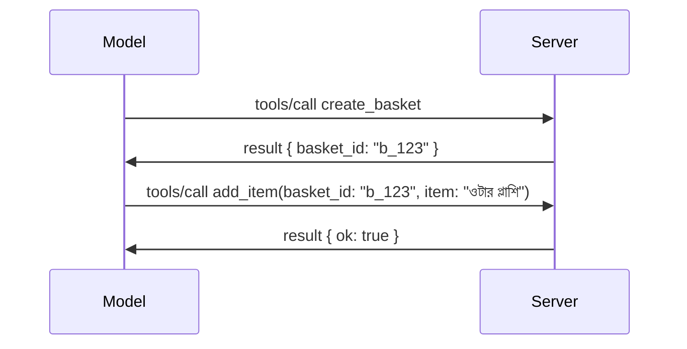

# MCP-তে কী পরিবর্তন হচ্ছে: 2026-07-28 রিলিজ ক্যান্ডিডেট

> **অবস্থা:** রিলিজ ক্যান্ডিডেট। লিখনকালে `2026-07-28` স্পেসিফিকেশন চূড়ান্ত নয়। এটি ২১ মে, ২০২৬ এ ঘোষিত হয়েছিল এবং ২৮ জুলাই, ২০২৬ এ প্রকাশের জন্য নির্ধারিত। এই পাঠে সবকিছু রিলিজ ক্যান্ডিডেট বর্ণনা করে; নির্মাণের আগে সর্বশেষ অবস্থা জানতে [ড্রাফট স্পেসিফিকেশন](https://modelcontextprotocol.io/specification/draft) এবং এর [চেঞ্জলগ](https://modelcontextprotocol.io/specification/draft/changelog) দেখুন। এই কারিকুলামের বাকি অংশ বর্তমান স্থিতিশীল রিলিজ **MCP স্পেসিফিকেশন 2025-11-25** অনুযায়ী লেখা হয়েছে, এবং `2026-07-28` প্রকাশের পর আপডেট করা হবে।

## ওভারভিউ

`2026-07-28` হল MCP এর বড়তম সংস্করণ যাত্রার পর থেকে। ছয়টি স্পেসিফিকেশন উন্নয়ন প্রস্তাব (SEP) প্রোটোকল-স্তরের সেশনগুলিকে সরিয়ে দেয় এবং MCP-কে ট্রান্সপোর্ট স্তরে স্টেটলেস করে তোলে, এক্সটেনশনগুলো প্রথম-শ্রেণীর, সংস্করণাধীন পদ্ধতি হয়ে ওঠে, এবং এই কারিকুলামের পূর্বে আপনি শিখেছেন এমন কয়েকটি বৈশিষ্ট্য (রুটস, স্যাম্পলিং, লগিং) একটি নতুন জীবনচক্র নীতির অধীনে অব্যবহারযোগ্য হিসেবে চিহ্নিত হয়। এই পাঠে কি পরিবর্তন হচ্ছে, কেন তা গুরুত্বপূর্ণ, এবং যা কোড আপনি ইতিমধ্যে `2025-11-25` অনুসারে লিখেছেন তার জন্য এর অর্থ কী, সংক্ষেপে তুলে ধরা হয়েছে।

উৎস: [2026-07-28 MCP স্পেসিফিকেশন রিলিজ ক্যান্ডিডেট](https://blog.modelcontextprotocol.io/posts/2026-07-28-release-candidate/) (মডেল কনটেক্সট প্রোটোকল ব্লগ, ডেভিড সোরিয়া পারা এবং ডেন ডেলিমার্সকি)।

## শেখার উদ্দেশ্যসমূহ

এই পাঠের শেষে, আপনি সক্ষম হবেন:

- MCP কেন একটি স্টেটলেস প্রোটোকল কোরে যাচ্ছে এবং এটি কী সমস্যা সমাধান করে যা হরাইজন্টালি স্কেলড ডিপ্লয়মেন্টে পড়ে তা ব্যাখ্যা করতে।
- কিভাবে `initialize`/`initialized` হ্যান্ডশেক এবং `Mcp-Session-Id` হেডার প্রতিস্থাপিত হয়েছে তা বর্ণনা করতে।
- নতুন `Mcp-Method` এবং `Mcp-Name` হেডার এবং `ttlMs`/`cacheScope` ক্যাশিং মেটাডেটা সনাক্ত করতে।
- এক্সটেনশন ফ্রেমওয়ার্ক এবং এই রিলিজের সাথে প্রেরিত দুইটি এক্সটেনশন: MCP অ্যাপস এবং টাস্কস চিনতে।
- ছয়টি অনুমোদন SEP তালিকাভুক্ত করতে যা OAuth 2.0 / OIDC সামঞ্জস্য আরও কঠিন করে।
- কোন কোন কোর বৈশিষ্ট্য (রুটস, স্যাম্পলিং, লগিং) এখন অব্যবহারযোগ্য এবং এর ব্যবহারিক অর্থ কী তা সনাক্ত করতে।
- টুল `inputSchema`/`outputSchema` তে ফুল JSON Schema 2020-12 পরিবর্তন ব্যাখ্যা করতে।

## একটি স্টেটলেস প্রোটোকল

মূল পরিবর্তন: MCP প্রোটোকল স্তরে স্টেটলেস হয়ে ওঠে।

### পূর্বে (2025-11-25): সেশন আপনাকে একটি সার্ভার ইনস্ট্যান্সের সাথে বেঁধে দেয়

Streamable HTTP-র মাধ্যমে একটি টুল কল শুরু হয় একটি `initialize` হ্যান্ডশেক দিয়ে। সার্ভার একটি `Mcp-Session-Id` হেডার দিয়ে উত্তর দেয় যা প্রতিটি পরবর্তী অনুরোধে বহন করতে হয়:

```http
POST /mcp HTTP/1.1
Mcp-Session-Id: 1868a90c-3a3f-4f5b
Content-Type: application/json

{"jsonrpc":"2.0","id":2,"method":"tools/call",
 "params":{"name":"search","arguments":{"q":"otters"}}}
```

কারণ সেশনটি যেই সার্ভার ইনস্ট্যান্স সেট জারি করেছে তার সাথে আবদ্ধ, হরাইজন্টালি স্কেল করা ডিপ্লয়মেন্টে লোড ব্যালান্সার এ **স্টিকি রাউটিং** এবং ইনস্ট্যান্সগুলোর মধ্যে একটি **শেয়ার্ড সেশন স্টোর** প্রয়োজন।

### পরবর্তীতে (2026-07-28): প্রতিটি অনুরোধ স্বয়ংসম্পূর্ণ

```http
POST /mcp HTTP/1.1
MCP-Protocol-Version: 2026-07-28
Mcp-Method: tools/call
Mcp-Name: search
Content-Type: application/json

{"jsonrpc":"2.0","id":1,"method":"tools/call",
 "params":{"name":"search","arguments":{"q":"otters"},
           "_meta":{"io.modelcontextprotocol/clientInfo":{"name":"my-app","version":"1.0"}}}}
```

যেকোনো সার্ভার ইনস্ট্যান্স এই অনুরোধটি পরিচালনা করতে পারে। মূল পরিবর্তনসমূহ:

- **`initialize`/`initialized` হ্যান্ডশেক সরিয়ে ফেলা হয়েছে** ([SEP-2575](https://github.com/modelcontextprotocol/modelcontextprotocol/pull/2575))। প্রোটোকল সংস্করণ, ক্লায়েন্ট তথ্য, এবং ক্লায়েন্ট সক্ষমতা প্রতিটি অনুরোধে `_meta` তে স্থানান্তরিত হয়েছে। একটি নতুন `server/discover` মেথড ক্লায়েন্টকে প্রয়োজনীয় হলে সার্ভার সক্ষমতা আগে থেকে আনতে দেয়।
- **`Mcp-Session-Id` হেডার এবং প্রোটোকল-স্তরের সেশন সরিয়ে ফেলা হয়েছে** ([SEP-2567](https://github.com/modelcontextprotocol/modelcontextprotocol/pull/2567))। প্রোটোকল স্তরে আর স্টিকি রাউটিং এবং শেয়ার্ড সেশন স্টোর প্রয়োজন নেই।

### স্টেটলেস প্রোটোকল, স্টেটফুল অ্যাপ্লিকেশন

প্রোটোকল-স্তরের সেশন সরানো মানে আপনার সার্ভার স্টেটফুল হতে পারে না এমন নয়। সুপারিশকৃত প্যাটার্ন হল HTTP API গুলি যা সবসময় ব্যবহার করেছে: একটি সুনির্দিষ্ট হ্যান্ডেল (একটি `basket_id`, একটি `browser_id`) একটি টুল কল থেকে তৈরি করুন, এবং মডেল সেটি পরের কলগুলিতে সাধারণ আর্গুমেন্ট হিসেবে ফেরত পাঠাতে পারে।



এটি স্টেটটাকে দৃশ্যমান ও যুক্তিসঙ্গত করে তোলে মডেলের জন্য এবং সেটিকে ট্রান্সপোর্ট মেটাডেটার মধ্যে লুকিয়ে রাখে না, এবং যেকোনো সার্ভার ইনস্ট্যান্স যেকোনো কল প্রক্রিয়া করতে পারে।

### সার্ভার-টু-ক্লায়েন্ট অনুরোধ, পুনর্গঠন করা হয়েছে

একটি স্টেটলেস প্রোটোকলের সার্ভারের জন্য মাঝখানে (মিড-কল) ক্লায়েন্টকে কিছু চাইবার উপায় প্রয়োজন (উদাহরণ: একটি এ্যালিসিটেশন প্রম্পট):

- **সার্ভার-উদ্যোক্ত অনুরোধ শুধুমাত্র সার্ভার যখন সক্রিয়ভাবে ক্লায়েন্ট অনুরোধ প্রক্রিয়া করছে তখনই ইস্যু করা যাবে** ([SEP-2260](https://github.com/modelcontextprotocol/modelcontextprotocol/pull/2260)) — পূর্বে একটি সুপারিশ ছিল, এখন বাধ্যতামূলক। একজন ব্যবহারকারী হঠাৎ করে কোন প্রম্পটে পরিণত হন না।
- **মাল্টি রাউন্ড-ট্রিপ অনুরোধ** ([SEP-2322](https://github.com/modelcontextprotocol/modelcontextprotocol/pull/2322)) এসএসই স্ট্রিম খোলা রাখার পরিবর্তে ব্যবহৃত হয়। এর বদলে, সার্ভার একটি `InputRequiredResult` প্রদান করে:

  ```json
  {
    "resultType": "inputRequired",
    "inputRequests": {
      "confirm": {
        "type": "elicitation",
        "message": "Delete 3 files?",
        "schema": { "type": "boolean" }
      }
    },
    "requestState": "eyJzdGVwIjoxLCJmaWxlcyI6WyJhIiwiYiIsImMiXX0="
  }
  ```

  ক্লায়েন্ট উত্তরগুলো সংগ্রহ করে এবং মূল কল পুনরায় করে `inputResponses` এবং প্রতিধ্বনিত `requestState` সহ। যেকোনো সার্ভার ইনস্ট্যান্স রিট্রাই নিতে পারে কারণ প্রয়োজনীয় সবকিছু পে-লোডে আছে।

### রাউটেবল, ক্যাশেবল, ট্রেসেবল

তিনটি ছোট পরিবর্তন স্টেটলেস ট্রাফিক পরিচালনা সহজ করে তোলে:

- **`Mcp-Method` এবং `Mcp-Name` হেডার Streamable HTTP-তে বাধ্যতামূলক** ([SEP-2243](https://github.com/modelcontextprotocol/modelcontextprotocol/pull/2243)) যাতে লোড ব্যালান্সার, গেটওয়ে, এবং রেট লিমিটার অপারেশন অনুযায়ী রাউটিং করতে পারে JSON বডি না পড়েই। সার্ভার সেইসব অনুরোধ প্রত্যাখ্যান করে যেগুলোর হেডার এবং বডি মেলেনি।
- **`tools/list` এবং রিসোর্স রিড ফলাফল বহন করে `ttlMs` এবং `cacheScope`** ([SEP-2549](https://github.com/modelcontextprotocol/modelcontextprotocol/pull/2549)), HTTP `Cache-Control` অনুযায়ী মডেল করা হয়েছে। ক্লায়েন্ট জানে কতক্ষণ একটি তালিকা ফলাফল সতেজ এবং এটি ব্যবহারকারীদের মধ্যে ভাগ করার জন্য নিরাপদ কি না, দীর্ঘস্থায়ী এসএসই স্ট্রিম ছাড়া পরিবর্তন সম্পর্কে জানতে।
- **`_meta` তে W3C ট্রেস কনটেক্সট প্রচার ডকুমেন্টেড** ([SEP-414](https://github.com/modelcontextprotocol/modelcontextprotocol/pull/414)), যা `traceparent`, `tracestate`, এবং `baggage` কী নাম ঠিক করে একটি বিতরণশীল ট্রেসকে ক্লায়েন্ট SDK, MCP সার্ভার, এবং ডাউনস্ট্রীম সিস্টেমসমূহে [OpenTelemetry](https://opentelemetry.io/)-সঙ্গত ব্যাকএন্ডে অনুসরণ করার জন্য।

## এক্সটেনশন প্রথম-শ্রেণীর হয়ে উঠল

এক্সটেনশনগুলো অনানুষ্ঠানিকভাবে `2025-11-25` এ ছিল। [SEP-2133](https://github.com/modelcontextprotocol/modelcontextprotocol/pull/2133) তাদের আনুষ্ঠানিক করে তোলে:

- এক্সটেনশনগুলোকে রিভার্স-DNS আইডির মাধ্যমে সনাক্ত করা হবে।
- এরা ক্লায়েন্ট ও সার্ভার সক্ষমতায় `extensions` ম্যাপে দ্বিপক্ষীয় আলোচনা হয়।
- এরা নিজস্ব `ext-*` রিপোজিটরিতে বাস করে, যার নিজস্ব রক্ষণাবেক্ষক রয়েছে এবং কোর স্পেসিফিকেশন থেকে স্বতন্ত্র সংস্করণে থাকে।
- SEP প্রক্রিয়ায় একটি নতুন এক্সটেনশন ট্র্যাক তাদের পরীক্ষা পর্যায় থেকে অফিসিয়াল পর্যায়ে যাওয়ার পথ দেয়।

এই রিলিজ দুইটি অফিসিয়াল এক্সটেনশন নিয়ে এসেছে।

### MCP অ্যাপস: সার্ভার-রেন্ডার্ড ব্যবহারকারী ইন্টারফেস

[MCP অ্যাপস](https://blog.modelcontextprotocol.io/posts/2026-01-26-mcp-apps/) ([SEP-1865](https://github.com/modelcontextprotocol/modelcontextprotocol/pull/1865)) সার্ভারকে ইন্টারেক্টিভ HTML ইন্টারফেস প্রেরণ করার অনুমতি দেয় যা হোস্টরা স্যান্ডবক্সড আইফ্রেমে রেন্ডার করে। টুলগুলো তাদের UI টেমপ্লেট আগে থেকে ঘোষণা করে যাতে হোস্টগুলো এগুলো প্রিফেচ, ক্যাশ এবং সিকিউরিটি রিভিউ করতে পারে চালানোর আগে। আপনি ইতিমধ্যে [Lesson 15: MCP Apps](../03-GettingStarted/15-mcp-apps/README.md)-এ এর মৌলিক বিষয় শিখেছেন — এক্সটেনশন ফ্রেমওয়ার্কের অধীনে MCP অ্যাপস এখন আনুষ্ঠানিকভাবে একটি এক্সটেনশন যা পরীক্ষামূলক কোর ফিচার নয়।

### টাস্কস এক্সটেনশন হিসেবে উত্তীর্ণ

টাস্কস `2025-11-25` এ পরীক্ষামূলক কোর ফিচার হিসেবে ছিল। প্রোডাকশন ব্যবহারে এমনভাবে পুনরায় নকশা সাধিত হয়েছে যে এর সঠিক স্থান হল এক্সটেনশন: [Tasks এক্সটেনশন](https://github.com/modelcontextprotocol/modelcontextprotocol/pull/2663) স্টেটলেস মডেল অনুযায়ী জীবনচক্র রূপায়ণ করে — সার্ভার `tools/call` এর উত্তর দিতে পারে একটি টাস্ক হ্যান্ডেল দিয়ে, এবং ক্লায়েন্ট সেটি সামনে নিয়ে যায় `tasks/get`, `tasks/update`, এবং `tasks/cancel` দিয়ে। টাস্ক সৃষ্টি সার্ভার-নির্দেশিত: ক্লায়েন্ট এক্সটেনশন বিজ্ঞাপন দেয়, এবং সার্ভার সিদ্ধান্ত নেয় কখন একটি কল টাস্ক হিসেবে চালানো উচিত। `tasks/list` পুরোপুরি সরিয়ে ফেলা হয়েছে কারণ এটি সেশন ছাড়া নিরাপদে সীমাবদ্ধ করা যায় না।

> **মাইগ্রেশন নোট:** আপনি যদি পরীক্ষামূলক `2025-11-25` টাস্কস API বাস্তবায়ন করে থাকেন, তবে আপনাকে নতুন এক্সটেনশন জীবনচক্রে মাইগ্রেট করতে হবে — এটি পেছনদিক থেকে সঙ্গতিপূর্ণ নয়।

## অনুমোদন কঠোরকরণ

ছয়টি SEP [অনুমোদন স্পেসিফিকেশন](https://modelcontextprotocol.io/specification/draft/basic/authorization) আরও বাস্তবজীবনের OAuth 2.0 / OpenID Connect ডিপ্লয়মেন্টের সঙ্গে সামঞ্জস্য গড়ে তোলে:

| SEP | পরিবর্তন |
|---|---|
| [SEP-2468](https://github.com/modelcontextprotocol/modelcontextprotocol/pull/2468) | ক্লায়েন্টদের অনুমোদন প্রতিক্রিয়ায় `iss` প্যারামিটার যাচাই করতে হবে [RFC 9207](https://www.rfc-editor.org/rfc/rfc9207) অনুযায়ী, যা MCP-র একক ক্লায়েন্ট, বহু সার্ভার প্যাটার্নে সাধারণ মিক্স-আপ আক্রমণ থেকে রক্ষা করে। ভবিষ্যতম সংস্করণে, `iss` অনুপস্থিত প্রতিক্রিয়া প্রত্যাখ্যান বাধ্যতামূলক হবে। |
| [SEP-837](https://github.com/modelcontextprotocol/modelcontextprotocol/pull/837) | ডায়নামিক ক্লায়েন্ট রেজিস্ট্রেশনের সময় ক্লায়েন্ট তাদের OpenID Connect `application_type` ঘোষণা করে, যাতে অনুমোদন সার্ভারগুলো ডিফল্টভাবে ডেস্কটপ/CLI ক্লায়েন্টকে `"web"` ধরে না নিয়ে এবং তার লোকালহোস্ট রিডাইরেক্ট URI প্রত্যাখ্যান না করে। |
| [SEP-2352](https://github.com/modelcontextprotocol/modelcontextprotocol/pull/2352) | ক্লায়েন্টরা নিবন্ধিত ক্রেডেনশিয়ালগুলো ইস্যুকরী অনুমোদন সার্ভারের `issuer` এর সাথে বাঁধবে এবং রিসোর্স যখন অনুমোদন সার্ভারের মধ্যে স্থানান্তরিত হবে তখন পুনরায় রেজিস্ট্রেশন করবে। |
| [SEP-2207](https://github.com/modelcontextprotocol/modelcontextprotocol/pull/2207) | OpenID Connect-সদৃশ অনুমোদন সার্ভার থেকে রিফ্রেশ টোকেন অনুরোধ করার পদ্ধতি দলিলবদ্ধ করা হয়েছে। |
| [SEP-2350](https://github.com/modelcontextprotocol/modelcontextprotocol/pull/2350) | স্টেপ-আপ অনুমোদনের সময় স্কোপ সংগৃহীত হওয়ার ব্যাখ্যা প্রদান। |
| [SEP-2351](https://github.com/modelcontextprotocol/modelcontextprotocol/pull/2351) | `.well-known` ডিসকভারি সাফিক্সের ব্যাখ্যা। |

আপনি যদি আজ MCP এর জন্য একটি অনুমোদন সার্ভার তৈরি করছেন, এখন থেকেই অনুমোদন প্রতিক্রিয়ায় `iss` সরবরাহ করতে শুরু করুন — বর্তমান অনুমোদন নির্দেশনার জন্য দেখুন [02-Security](../02-Security/README.md) যা এই ভিত্তি হয়ে কাজ করবে।

## রুটস, স্যাম্পলিং, এবং লগিং অব্যবহারযোগ্য

নতুন [ফিচার জীবনচক্র নীতি](https://github.com/modelcontextprotocol/modelcontextprotocol/pull/2577) ([SEP-2577](https://github.com/modelcontextprotocol/modelcontextprotocol/pull/2577)) অনুযায়ী, আপনি [Core Concepts](./README.md#roots) এ শেখা তিনটি কোর ক্লায়েন্ট প্রিমিটিভ **Deprecated** হিসেবে চিহ্নিত হয়েছে:

| বৈশিষ্ট্য | সুপারিশকৃত বিকল্প |
|---|---|
| রুটস | টুল প্যারামিটার, রিসোর্স URI, অথবা সার্ভার কনফিগারেশন |
| স্যাম্পলিং | সরাসরি LLM প্রদানকারী API এর ইন্টিগ্রেশন |
| লগিং | স্ট্ডার এর জন্য stdio ট্রান্সপোর্ট; কাঠামোবদ্ধ পর্যবেক্ষণের জন্য OpenTelemetry |

এগুলো **শুধুমাত্র অ্যানোটেশন-ভিত্তিক অব্যবহারযোগ্য**: মেথড, টাইপ, এবং সক্ষমতা পতাকা এই রিলিজের মধ্যে এবং এর এক বছরের ভেতরে প্রকাশিত প্রতিটি স্পেসিফিকেশন সংস্করণে কাজ করবে। এগুলো সরাসরি সরানোর জন্য জীবনচক্র নীতির অধীনে একটি আলাদা SEP প্রয়োজন — তাই আজ আপনার বিদ্যমান [স্যাম্পলিং](../03-GettingStarted/14-sampling/README.md) নমুনাগুলোর কোন ক্ষতি হবে না, কিন্তু নতুন সার্ভারগুলো উপরে দেওয়া বিকল্প প্যাটার্নগুলি প্রাধান্য দেবে।

## টুলগুলোর জন্য ফুল JSON Schema 2020-12

টুলের `inputSchema` এবং `outputSchema` সম্পূর্ণ [JSON Schema 2020-12](https://json-schema.org/draft/2020-12) তে উন্নীত হয়েছে ([SEP-2106](https://github.com/modelcontextprotocol/modelcontextprotocol/pull/2106)):

- ইনপুট স্কিমাগুলো এখনো রুট হিসেবে `type: "object"` সীমাবদ্ধতা রাখে কিন্তু এখন কম্পোজিশন (`oneOf`, `anyOf`, `allOf`), শর্তাদি এবং রেফারেন্স (`$ref`, `$defs`) অনুমোদিত।
- আউটপুট স্কিমাগুলো অপরিবর্তিত এবং `structuredContent` এখন শুধুমাত্র অবজেক্ট নয়, যেকোনো JSON মান হতে পারে।
- বাস্তবায়নগুলো বাইরের `$ref` URI গুলো অটো-ডিরেফারেন্স করবে না এবং স্কিমার গভীরতা ও যাচাইকরণ সময় সীমাবদ্ধ করবে (যা একটি ডিনায়াল-অফ-সার্ভিস বিবেচনা, যদি আপনি সার্ভার পাশের যাচাইকরণ করেন)।

আলাদা করে, একটি অনুপস্থিত রিসোর্সের জন্য ত্রুটি কোড MCP-কাস্টম `-32002` থেকে JSON-RPC মান `-32602` (Invalid Params) তে পরিবর্তন হয়েছে ([SEP-2164](https://github.com/modelcontextprotocol/modelcontextprotocol/pull/2164))। আপনার ক্লায়েন্ট যদি Literal `-32002` এর উপর নির্ভর করে, তাহলে তা আপডেট করতে হবে।

## প্রোটোকল এখান থেকে কীভাবে এগোবে

এই রিলিজে ভঙ্গকারী পরিবর্তন রয়েছে, যা MCP মেইনটেইনাররা ভবিষ্যতে নিয়ম বলে মনে করেন না। তিনটি গভর্নেন্স SEP পুনরাবৃত্তি ঠেকাতে লক্ষ্য রাখে:

- **ফিচার জীবনচক্র নীতি** প্রত্যেক বৈশিষ্ট্যের জন্য একটিভ → অব্যবহারযোগ্য → সরানো পথ দেয়, অব্যবহারযোগ্য ও প্রথম সম্ভাব্য সরানোর মধ্যে অন্তত বারো মাস সময় থাকে।
- **এক্সটেনশন ফ্রেমওয়ার্ক** নতুন সক্ষমতাগুলো অপ্ট-ইন এক্সটেনশন হিসেবে প্রেরণ করতে দেয় এবং সেখানে স্থিতিশীল করে(core specification এ যাওয়ার আগে (যদি কখনো যায়)।

- একটি স্ট্যান্ডার্ড ট্র্যাক SEP আর ফাইনাল স্ট্যাটাসে পৌঁছাতে পারবে না যতক্ষণ না একটি মেল খাওয়া সাড়া [conformance suite](https://github.com/modelcontextprotocol/conformance) এ আসে ([SEP-2484](https://github.com/modelcontextprotocol/modelcontextprotocol/pull/2484)) — একই স্যুট যেখানে [SDK tier system](https://github.com/modelcontextprotocol/modelcontextprotocol/pull/1777) অফিসিয়াল SDK গুলোর স্কোর করে।  

## রিলিজ টাইমলাইন এবং যাচাইকরণ  

- রিলিজ প্রার্থী লক করা হয়েছিল ২১ মে, ২০২৬।  
- চূড়ান্ত স্পেসিফিকেশন নির্ধারিত হয়েছে ২৮ জুলাই, ২০২৬ এ।  
- এই দুইয়ের মধ্যে দশ সপ্তাহের উইন্ডো SDK রক্ষণাবেক্ষক এবং ক্লায়েন্ট বাস্তবায়নকারীদের জন্য পরিবর্তন গুলোকে বাস্তব কাজের লোডের বিরুদ্ধে যাচাই করার সুযোগ দেয়; Tier 1 SDK গুলো এই উইন্ডোতে সমর্থন চালু করার জন্য প্রত্যাশিত যা [SDK tier system](https://modelcontextprotocol.io/docs/sdk) এর অধীনে।  
- পরিবর্তনের সম্পূর্ণ সেট ট্র্যাক করুন [ড্রাফট স্পেসিফিকেশন](https://modelcontextprotocol.io/specification/draft) এবং এর [চেঞ্জলগ](https://modelcontextprotocol.io/specification/draft/changelog) এ।  

## এই কারিকুলামের জন্য এর অর্থ কী  

এই কোর্সে এখন পর্যন্ত আপনি যা শিখেছেন তা **2025-11-25** কে লক্ষ্য করে তৈরি, যা `2026-07-28` রিলিজ না হওয়া পর্যন্ত বর্তমান স্থিতিশীল স্পেসিফিকেশন থাকে। স্পষ্টভাবে:  

- **সেশন এবং `initialize` হ্যান্ডশেক** ([Core Concepts](./README.md) এবং [Lesson 6: HTTP Streaming](../03-GettingStarted/06-http-streaming/README.md) এ আলোচনা করা হয়েছে) আজকের মতোই কাজ করে, কিন্তু আপনি যখন `2026-07-28` সামঞ্জস্যপূর্ণ SDK এ আপগ্রেড করবেন তখন এগুলো স্টেটলেস রিকোয়েস্ট মডেলের দ্বারা প্রতিস্থাপিত হতে পারে।  
- **স্যাম্পলিং এবং রুট** (এছাড়াও [Core Concepts](./README.md) এ আলোচনা করা হয়েছে) সম্পূর্ণ কার্যকরী রয়েছে কিন্তু ডিপ্রিকেটেড — নতুন ডিজাইন গুলো উপরের প্রতিস্থাপন প্যাটার্ন গুলো পাঠ করা উচিত।  
- **পরীক্ষামূলক Tasks ফিচারটি**, যদি আপনি এটি ব্যবহার করে থাকেন, তাহলে Tasks এক্সটেনশনের নতুন লাইফসাইকেলে স্থানান্তর করতে হবে।  
- **MCP অ্যাপস** ([Lesson 15](../03-GettingStarted/15-mcp-apps/README.md)) ব্যবহারিকভাবে অপরিবর্তিত থাকে; এটি শুধু ফর্মাল এক্সটেনশন ফ্রেমওয়ার্কের অধীনে চলে যায়।  

## অতিরিক্ত সংস্থানসমূহ  

- [২০২৬-০৭-২৮ MCP স্পেসিফিকেশন রিলিজ প্রার্থী (ব্লগ পোস্ট)](https://blog.modelcontextprotocol.io/posts/2026-07-28-release-candidate/)  
- [MCP ট্রান্সপোর্টগুলোর ভবিষ্যত](https://blog.modelcontextprotocol.io/posts/2025-12-19-mcp-transport-future/)  
- [MCP ড্রাফট স্পেসিফিকেশন](https://modelcontextprotocol.io/specification/draft)  
- [MCP ড্রাফট চেঞ্জলগ](https://modelcontextprotocol.io/specification/draft/changelog)  
- [SEP নির্দেশিকা](https://modelcontextprotocol.io/community/sep-guidelines)  
- [MCP SDK টিয়ার সিস্টেম](https://modelcontextprotocol.io/docs/sdk)  

## পরবর্তী ধাপসমূহ  

ফিরে যান [Core Concepts](./README.md) এ অথবা এগিয়ে যান [Security](../02-Security/README.md) এ দেখতে কীভাবে আজকের `2025-11-25` নির্দেশিকা যা আসছে তার সঙ্গে মানানসই।  

---

<!-- CO-OP TRANSLATOR DISCLAIMER START -->
**অস্বীকৃতি**:
এই নথিটি AI অনুবাদ পরিষেবা [Co-op Translator](https://github.com/Azure/co-op-translator) ব্যবহার করে অনূদিত হয়েছে। যদিও আমরা শুদ্ধতার জন্য চেষ্টা করি, অনুগ্রহ করে মনে রাখবেন যে স্বয়ংক্রিয় অনুবাদে ত্রুটি বা অসঙ্গতি থাকতে পারে। মূল নথিটি তার স্বভাষায় কর্তৃত্বপূর্ণ উৎস হিসেবে বিবেচিত হওয়া উচিত। গুরুত্বপূর্ণ তথ্যের জন্য পেশাদার মানব অনুবাদ সুপারিশ করা হয়। এই অনুবাদের ব্যবহারে প্রয়োজনীয় ভুল বোঝাবুঝি বা ভুল ব্যাখ্যার জন্য আমরা দায়বদ্ধ নই।
<!-- CO-OP TRANSLATOR DISCLAIMER END -->