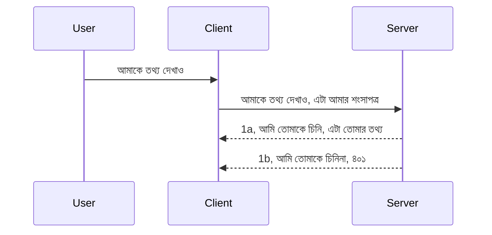

# সহজ অথেনটিকেশন

MCP SDKs OAuth 2.1 ব্যবহারের সমর্থন করে, যা সত্যি বলতে গেলে একটি জটিল প্রক্রিয়া যার মধ্যে রয়েছে অথ সার্ভার, রিসোর্স সার্ভার, ক্রেডেনশিয়াল প্রেরণ, কোড পাওয়া, সেই কোড বেয়ারার টোকেনে বদলানো এবং অবশেষে আপনার রিসোর্স ডেটা পাওয়া। আপনি যদি OAuth-এ অভ্যস্ত না হন যা বাস্তবায়নের জন্য একটি চমৎকার পদ্ধতি, তবে কিছু মৌলিক স্তরের অথেনটিকেশন দিয়ে শুরু করা এবং ক্রমে উন্নত সুরক্ষার দিকে এগোনো ভাল হবে। এ কারণেই এই অধ্যায়টি রয়েছে, আপনাকে আরো উন্নত অথেনটিকেশনে উন্নীত করার জন্য।

## অথেনটিকেশন বলতে আমরা কী বুঝি?

অথেনটিকেশন এবং অথরাইজেশনের সংক্ষিপ্ত রূপ। ধারণাটি হল আমাদের দুটি কাজ করতে হবে:

- **অথেনটিকেশন**, যা হল নির্ধারণ করার প্রক্রিয়া যে আমরা একটি ব্যক্তিকে আমাদের বাড়িতে প্রবেশ করতে দেব কি না, অর্থাৎ তারা "এখানে" থাকার অধিকারী কি না, যেখানে আমাদের MCP সার্ভারের ফিচার আছে রিসোর্স সার্ভারে প্রবেশাধিকার।
- **অথরাইজেশন**, হল নির্ণয় করা যে ব্যবহারকারী কি এর জন্য নির্দিষ্ট রিসোর্সে অ্যাক্সেস পাবে, উদাহরণস্বরূপ, এই অর্ডার বা পণ্যগুলো, অথবা তারা কি কন্টেন্ট পড়তে পারবে কিন্তু মোছার অনুমতি নেই, ইত্যাদি।

## ক্রেডেনশিয়াল: আমরা কিভাবে সিস্টেমকে জানাই আমরা কারা

বেশিরভাগ ওয়েব ডেভেলপাররা সাধারণত সার্ভারে একটি ক্রেডেনশিয়াল প্রদান করার দিক থেকে চিন্তা শুরু করে, সাধারণত একটি সিক্রেট যা বলে তারা এখানে "অথেনটিকেট" হওয়ার জন্য অনুমতি পেয়েছে। এই ক্রেডেনশিয়াল সাধারণত ব্যবহারকারীর নাম এবং পাসওয়ার্ডের base64 এনকোডেড সংস্করণ বা একটি API কী যা একটি নির্দিষ্ট ব্যবহারকারীকে অনন্যভাবে সনাক্ত করে।

এটি একটি "Authorization" নামক হেডার মাধ্যমে পাঠানো হয়, যেমন:

```json
{ "Authorization": "secret123" }
```

এটিকে সাধারণত basic authentication বলা হয়। পুরো প্রক্রিয়াটি নিম্নরূপ কাজ করে:



এখন যেহেতু আমরা ফ্লো দৃষ্টিকোণ থেকে বুঝে গেছি কাজটি কিভাবে হয়, আমরা কিভাবে এটি বাস্তবায়ন করব? বেশিরভাগ ওয়েব সার্ভারে middleware ধারণা থাকে, এটি একটি কোড অংশ যা একটি রিকুয়েস্টের অংশ হিসেবে চলে, যেটি ক্রেডেনশিয়াল যাচাই করে, এবং যদি সেগুলো বৈধ হয় তবে রিকুয়েস্ট অনুমতি দেয়। যদি রিকুয়েস্টে বৈধ ক্রেডেনশিয়াল না থাকে তবে আপনি একটি অথ এরর পাবেন। চলুন দেখি কিভাবে এটি বাস্তবায়িত হতে পারে:

**Python**

```python
class AuthMiddleware(BaseHTTPMiddleware):
    async def dispatch(self, request, call_next):

        has_header = request.headers.get("Authorization")
        if not has_header:
            print("-> Missing Authorization header!")
            return Response(status_code=401, content="Unauthorized")

        if not valid_token(has_header):
            print("-> Invalid token!")
            return Response(status_code=403, content="Forbidden")

        print("Valid token, proceeding...")
       
        response = await call_next(request)
        # যেকোনো গ্রাহক হেডার যোগ করুন অথবা প্রতিক্রিয়াতে কিছু পরিবর্তন করুন
        return response


starlette_app.add_middleware(CustomHeaderMiddleware)
```

এখানে আমরা করলাম:

- একটি middleware তৈরি করেছি যার নাম `AuthMiddleware` যেখানে `dispatch` মেথডটি ওয়েব সার্ভার দ্বারা কল করা হয়।
- middleware ওয়েব সার্ভারে যুক্ত করেছি:

    ```python
    starlette_app.add_middleware(AuthMiddleware)
    ```

- একটি validation লজিক লিখেছি যা যাচাই করে Authorization হেডার আছে কি না এবং পাঠানো সিক্রেটটি বৈধ কি না:

    ```python
    has_header = request.headers.get("Authorization")
    if not has_header:
        print("-> Missing Authorization header!")
        return Response(status_code=401, content="Unauthorized")

    if not valid_token(has_header):
        print("-> Invalid token!")
        return Response(status_code=403, content="Forbidden")
    ```

    যদি সিক্রেট উপস্থিত এবং বৈধ হয় তবে আমরা `call_next` কল করে অনুরোধটি পার করতে দিই এবং রেসপন্স রিটার্ন করি।

    ```python
    response = await call_next(request)
    # যেকোনো গ্রাহক হেডার যোগ করুন অথবা প্রতিক্রিয়াতে কোনো পরিবর্তন করুন
    return response
    ```

কাজ করার পদ্ধতি হল যদি ওয়েব রিকুয়েস্ট সার্ভারের দিকে আসে middleware সক্রিয় হবে এবং বাস্তবায়নের ওপর ভিত্তি করে রিকুয়েস্টকে পার করতে দেবে বা একটি এরর রিটার্ন করবে যা ক্লায়েন্টের অনুমতি না থাকার সংকেত দেয়।

**TypeScript**

এখানে আমরা জনপ্রিয় Express ফ্রেমওয়ার্ক দিয়ে একটি middleware তৈরি করছি এবং MCP সার্ভারে যাওয়ার আগে রিকুয়েস্ট কোড আটকাচ্ছি। এখানে কোড:

```typescript
function isValid(secret) {
    return secret === "secret123";
}

app.use((req, res, next) => {
    // 1. অনুমোদন হেডার আছে?
    if(!req.headers["Authorization"]) {
        res.status(401).send('Unauthorized');
    }
    
    let token = req.headers["Authorization"];

    // 2. বৈধতা পরীক্ষা করুন।
    if(!isValid(token)) {
        res.status(403).send('Forbidden');
    }

   
    console.log('Middleware executed');
    // 3. অনুরোধের পরবর্তী ধাপে অনুরোধটি পাঠায়।
    next();
});
```

এই কোডে আমরা করলাম:

1. প্রথমেই যাচাই করি Authorization হেডার আছে কি না, না থাকলে 401 এরর পাঠাই।
2. যাচাই করি ক্রেডেনশিয়াল/টোকেন বৈধ কি না, না হলে 403 এরর পাঠাই।
3. অবশেষে রিকুয়েস্ট পাইপলাইনে রিকুয়েস্টটি পাঠিয়ে দেই এবং চাওয়া রিসোর্স রিটার্ন করি।

## অভ্যাস: অথেনটিকেশন বাস্তবায়ন করা

চলুন আমাদের জ্ঞান কাজে লাগিয়ে এটা বাস্তবায়ন করি। পরিকল্পনাটি হলো:

সার্ভার

- একটি ওয়েব সার্ভার এবং MCP ইনস্ট্যান্স তৈরি করুন।
- সার্ভারের জন্য একটি middleware বাস্তবায়ন করুন।

ক্লায়েন্ট

- হেডারের মাধ্যমে ক্রেডেনশিয়াল সহ ওয়েব রিকুয়েস্ট পাঠান।

### -1- একটি ওয়েব সার্ভার এবং MCP ইনস্ট্যান্স তৈরি করা

> **আগাম নজর:** নিচের TypeScript উদাহরণ HTTP ট্রান্সপোর্ট `mcp-session-id` দ্বারা কীড একটি `transports` ম্যাপে অনুসরণ করে, **MCP স্পেসিফিকেশন 2025-11-25** অনুসারে। `2026-07-28` রিলিজ ক্যান্ডিডেট `initialize` হ্যান্ডশেক এবং সেশন আইডি সম্পূর্ণভাবে সরিয়ে দেয়, তাই এই প্রতি-সেশন ট্রান্সপোর্ট ম্যাপ চলে যাবে পরিবর্তে Stateless, স্বয়ংসম্পূর্ণ রিকুয়েস্ট। দেখুন [MCP এ কী পরিবর্তন হচ্ছে: 2026-07-28 রিলিজ ক্যান্ডিডেট](../../01-CoreConcepts/mcp-2026-07-28-release-candidate.md)।

আমাদের প্রথম ধাপে, ওয়েব সার্ভার ইনস্ট্যান্স এবং MCP সার্ভার তৈরি করতে হবে।

**Python**

এখানে আমরা MCP সার্ভার ইনস্ট্যান্স তৈরি করছি, একটি starlette ওয়েব অ্যাপ তৈরি করছি এবং uvicorn দিয়ে হোস্ট করছি।

```python
# MCP সার্ভার তৈরি করা হচ্ছে

app = FastMCP(
    name="MCP Resource Server",
    instructions="Resource Server that validates tokens via Authorization Server introspection",
    host=settings["host"],
    port=settings["port"],
    debug=True
)

# স্টারলেট ওয়েব অ্যাপ তৈরি করা হচ্ছে
starlette_app = app.streamable_http_app()

# uvicorn এর মাধ্যমে অ্যাপ সার্ভ করা হচ্ছে
async def run(starlette_app):
    import uvicorn
    config = uvicorn.Config(
            starlette_app,
            host=app.settings.host,
            port=app.settings.port,
            log_level=app.settings.log_level.lower(),
        )
    server = uvicorn.Server(config)
    await server.serve()

run(starlette_app)
```

এই কোডে আমরা করলাম:

- MCP সার্ভার তৈরি করা।
- MCP সার্ভার থেকে starlette ওয়েব অ্যাপ তৈরি করা, `app.streamable_http_app()`।
- uvicorn ব্যবহার করে ওয়েব অ্যাপ হোস্টিং করা `server.serve()`।

**TypeScript**

এখানে আমরা MCP সার্ভার ইনস্ট্যান্স তৈরি করছি।

```typescript
const server = new McpServer({
      name: "example-server",
      version: "1.0.0"
    });

    // ... সার্ভার সম্পদ, সরঞ্জাম, এবং প্রম্পট সেট আপ করুন ...
```

এই MCP সার্ভার তৈরি আমাদের POST /mcp রুট ডিফিনিশনের মধ্যে হতে হবে, তাই উপরের কোড নিচের মতো সরিয়ে নিই:

```typescript
import express from "express";
import { randomUUID } from "node:crypto";
import { McpServer } from "@modelcontextprotocol/sdk/server/mcp.js";
import { StreamableHTTPServerTransport } from "@modelcontextprotocol/sdk/server/streamableHttp.js";
import { isInitializeRequest } from "@modelcontextprotocol/sdk/types.js"

const app = express();
app.use(express.json());

// সেশন আইডি দ্বারা পরিবহন সংরক্ষণের জন্য মানচিত্র
const transports: { [sessionId: string]: StreamableHTTPServerTransport } = {};

// ক্লায়েন্ট থেকে সার্ভারে যোগাযোগের জন্য POST অনুরোধগুলি পরিচালনা করুন
app.post('/mcp', async (req, res) => {
  // বিদ্যমান সেশন আইডি যাচাই করুন
  const sessionId = req.headers['mcp-session-id'] as string | undefined;
  let transport: StreamableHTTPServerTransport;

  if (sessionId && transports[sessionId]) {
    // বিদ্যমান পরিবহন পুনরায় ব্যবহার করুন
    transport = transports[sessionId];
  } else if (!sessionId && isInitializeRequest(req.body)) {
    // নতুন প্রাথমিকীকরণ অনুরোধ
    transport = new StreamableHTTPServerTransport({
      sessionIdGenerator: () => randomUUID(),
      onsessioninitialized: (sessionId) => {
        // সেশন আইডি দ্বারা পরিবহন সংরক্ষণ করুন
        transports[sessionId] = transport;
      },
      // ডিএনএস রিবাইন্ডিং সুরক্ষা ডিফল্টভাবে পিছনের সামঞ্জস্যতার জন্য নিষ্ক্রিয়। আপনি যদি এই সার্ভারটি
      // স্থানীয়ভাবে চালাচ্ছেন, নিশ্চিত করুন যে আপনি সেট করেছেন:
      // enableDnsRebindingProtection: true,
      // allowedHosts: ['127.0.0.1'],
    });

    // বন্ধ হয়ে গেলে পরিবহন পরিষ্কার করুন
    transport.onclose = () => {
      if (transport.sessionId) {
        delete transports[transport.sessionId];
      }
    };
    const server = new McpServer({
      name: "example-server",
      version: "1.0.0"
    });

    // ... সার্ভার সম্পদ, সরঞ্জাম এবং প্রম্পট সাজানো হচ্ছে ...

    // MCP সার্ভারে সংযোগ করুন
    await server.connect(transport);
  } else {
    // অবৈধ অনুরোধ
    res.status(400).json({
      jsonrpc: '2.0',
      error: {
        code: -32000,
        message: 'Bad Request: No valid session ID provided',
      },
      id: null,
    });
    return;
  }

  // অনুরোধ পরিচালনা করুন
  await transport.handleRequest(req, res, req.body);
});

// GET এবং DELETE অনুরোধের জন্য পুনঃব্যবহারযোগ্য হ্যান্ডলার
const handleSessionRequest = async (req: express.Request, res: express.Response) => {
  const sessionId = req.headers['mcp-session-id'] as string | undefined;
  if (!sessionId || !transports[sessionId]) {
    res.status(400).send('Invalid or missing session ID');
    return;
  }
  
  const transport = transports[sessionId];
  await transport.handleRequest(req, res);
};

// সার্ভার থেকে ক্লায়েন্টের বিজ্ঞপ্তির জন্য GET অনুরোধ SSE মারফত পরিচালনা করুন
app.get('/mcp', handleSessionRequest);

// সেশন শেষ করার জন্য DELETE অনুরোধ পরিচালনা করুন
app.delete('/mcp', handleSessionRequest);

app.listen(3000);
```

এখন দেখুন MCP সার্ভার তৈরি `app.post("/mcp")` এর ভিতরে চলে এসেছে।

চলুন middleware তৈরির পরবর্তী ধাপে যাই যাতে আমরা আগত ক্রেডেনশিয়াল যাচাই করতে পারি।

### -2- সার্ভারের জন্য middleware বাস্তবায়ন

middleware অংশের দিকে যাই। এখানে আমরা একটি middleware তৈরি করব যা `Authorization` হেডারে একটি ক্রেডেনশিয়াল খুঁজবে এবং যাচাই করবে। যদি সেগুলো গ্রহণযোগ্য হয়, তবে রিকুয়েস্টটি কাজটি করবে (যেমন টুলসের তালিকা দেখানো, রিসোর্স পড়া বা MCP-র অন্যান্য ফাংশনালিটি)।

**Python**

middleware তৈরি করতে আমাদের একটি ক্লাস তৈরি করতে হবে যা `BaseHTTPMiddleware` থেকে উত্তরাধিকারসূত্রে প্রাপ্ত। দুটি গুরুত্বপূর্ণ অংশ আছে:

- রিকুয়েস্ট `request` যেখান থেকে আমরা হেডার তথ্য পড়ব।
- `call_next` কলব্যাক যেটি আমাদের কল করতে হবে যখন ক্লায়েন্ট গ্রহণযোগ্য ক্রেডেনশিয়াল নিয়ে এসেছে।

প্রথমেই আমরা হ্যান্ডেল করব যদি `Authorization` হেডার না থাকে:

```python
has_header = request.headers.get("Authorization")

# কোন হেডার উপস্থিত নেই, ৪০১ এর সাথে ব্যর্থ করুন, অন্যথায় চালিয়ে যান।
if not has_header:
    print("-> Missing Authorization header!")
    return Response(status_code=401, content="Unauthorized")
```

এখানে আমরা ক্লায়েন্ট অথেনটিকেশন ফেইল করলে 401 unauthorized মেসেজ পাঠাচ্ছি।

এরপর, যদি একটি ক্রেডেনশিয়াল পাঠানো হয়, আমরা এটি যাচাই করব এইভাবে:

```python
 if not valid_token(has_header):
    print("-> Invalid token!")
    return Response(status_code=403, content="Forbidden")
```

উপরে দেখুন কিভাবে 403 forbidden মেসেজ পাঠানো হয়। নিচে পুরো middleware দেখানো হল যা আমরা বলেছি সবকিছু বাস্তবায়ন করে:

```python
class AuthMiddleware(BaseHTTPMiddleware):
    async def dispatch(self, request, call_next):

        has_header = request.headers.get("Authorization")
        if not has_header:
            print("-> Missing Authorization header!")
            return Response(status_code=401, content="Unauthorized")

        if not valid_token(has_header):
            print("-> Invalid token!")
            return Response(status_code=403, content="Forbidden")

        print("Valid token, proceeding...")
        print(f"-> Received {request.method} {request.url}")
        response = await call_next(request)
        response.headers['Custom'] = 'Example'
        return response

```

চমৎকার, কিন্তু `valid_token` ফাংশনটির ব্যাপারে? নিচে এটি দেওয়া হল:

```python
# প্রোডাকশনে ব্যবহার করবেন না - এটি উন্নত করুন !!
def valid_token(token: str) -> bool:
    # "Bearer " পূর্বসারকটি অপসারণ করুন
    if token.startswith("Bearer "):
        token = token[7:]
        return token == "secret-token"
    return False
```

এটা অবশ্যই উন্নত করার দরকার।

গুরুত্বপূর্ণ: এই রকম সিক্রেট কোডে কখনোই রাখবেন না। আদর্শ হলো একটি ডাটা সোর্স বা IDP (identity service provider) থেকে যাচাইয়ের জন্য মানটি আনা, অথবা আরও ভাল, যাচাইকরণ IDP-কে করানো।

**TypeScript**

Express দিয়ে এটি বাস্তবায়নের জন্য আমাদের `use` মেথড কল করতে হবে যা middleware ফাংশন নেয়।

আমাদের যা করতে হবে:

- রিকুয়েস্ট ভেরিয়েবলের সাথে ইন্টারঅ্যাক্ট করে `Authorization` প্রপার্টিতে পাঠানো ক্রেডেনশিয়াল যাচাই করা।
- ক্রেডেনশিয়াল যাচাই করা, এবং যদি বৈধ হয়, রিকুয়েস্ট চলতে দেওয়া যাতে ক্লায়েন্টের MCP রিকুয়েস্ট কাজ করতে পারে (যেমন টুলসের তালিকা, রিসোর্স পড়া বা MCP-র অন্য ফাংশনালিটি)।

এখানে আমরা যাচাই করছি `Authorization` হেডার আছে কি না, না থাকলে রিকুয়েস্ট থামিয়ে দিচ্ছি:

```typescript
if(!req.headers["authorization"]) {
    res.status(401).send('Unauthorized');
    return;
}
```

হেডার যদি সবার প্রথমে পাঠানো না হয়, 401 পাওয়া যাবে।

এরপর আমরা দেখি ক্রেডেনশিয়াল বৈধ কি না, না হলে আবার রিকুয়েস্ট থামিয়ে দেই একটু ভিন্ন মেসেজ সহ:

```typescript
if(!isValid(token)) {
    res.status(403).send('Forbidden');
    return;
} 
```

এখন আপনি দেখেন 403 এরর আসছে।

পুরো কোড এখানে:

```typescript
app.use((req, res, next) => {
    console.log('Request received:', req.method, req.url, req.headers);
    console.log('Headers:', req.headers["authorization"]);
    if(!req.headers["authorization"]) {
        res.status(401).send('Unauthorized');
        return;
    }
    
    let token = req.headers["authorization"];

    if(!isValid(token)) {
        res.status(403).send('Forbidden');
        return;
    }  

    console.log('Middleware executed');
    next();
});
```

আমরা ওয়েব সার্ভার সেটআপ করেছি যাতে একটি middleware ক্রেডেনশিয়াল যাচাই করতে পারে যা ক্লায়েন্ট পাঠাচ্ছে বলে আশা করা হচ্ছে। ক্লায়েন্টের পক্ষে কি?

### -3- হেডারে ক্রেডেনশিয়াল সহ ওয়েব রিকুয়েস্ট পাঠানো

নিশ্চিত করতে হবে ক্লায়েন্ট হেডারের মাধ্যমে ক্রেডেনশিয়াল পাঠাচ্ছে। যেহেতু আমরা MCP ক্লায়েন্ট ব্যবহার করব, তা কিভাবে হয় তা বুঝতে হবে।

**Python**

ক্লায়েন্টের জন্য ক্রেডেনশিয়াল সহ একটি হেডার পাঠাতে হবে, যেমন:

```python
# মানটি হার্ডকোড করবেন না, এটি অন্তত একটি পরিবেশ পরিবর্তনশীল বা আরও নিরাপদ সংরক্ষণে রাখুন
token = "secret-token"

async with streamablehttp_client(
        url = f"http://localhost:{port}/mcp",
        headers = {"Authorization": f"Bearer {token}"}
    ) as (
        read_stream,
        write_stream,
        session_callback,
    ):
        async with ClientSession(
            read_stream,
            write_stream
        ) as session:
            await session.initialize()
      
            # TODO, ক্লায়েন্টে আপনি যা করতে চান, যেমন টুল তালিকা তৈরি করা, টুল কল করা ইত্যাদি।
```

দেখুন আমরা `headers` প্রপার্টি এভাবে পূরণ করেছি ` headers = {"Authorization": f"Bearer {token}"}`।

**TypeScript**

আমরা এটা দুই ধাপে করতে পারি:

1. আমাদের ক্রেডেনশিয়াল সহ একটি configuration অবজেক্ট তৈরি করা।
2. সেই configuration অবজেক্ট ট্রান্সপোর্টে পাঠানো।

```typescript

// এখানে দেখানো মতো মানটি হার্ডকোড করবেন না। সর্বনিম্ন এটিকে একটি পরিবেশ ভেরিয়েবল হিসাবে রাখুন এবং ডেভ মোডে dotenv এর মতো কিছু ব্যবহার করুন।
let token = "secret123"

// একটি ক্লায়েন্ট ট্রান্সপোর্ট অপশন অবজেক্ট সংজ্ঞায়িত করুন
let options: StreamableHTTPClientTransportOptions = {
  sessionId: sessionId,
  requestInit: {
    headers: {
      "Authorization": "secret123"
    }
  }
};

// অপশন অবজেক্টটিকে ট্রান্সপোর্টে পাঠান
async function main() {
   const transport = new StreamableHTTPClientTransport(
      new URL(serverUrl),
      options
   );
```

এখানে দেখুন আমরা কিভাবে একটি `options` অবজেক্ট তৈরি করেছি এবং `requestInit` প্রপার্টির মধ্যে হেডার রেখেছি।

গুরুত্বপুর্ন: আমরা এটি কিভাবে উন্নত করব? বর্তমান বাস্তবায়নে কিছু সমস্যা আছে। প্রথমত, এইভাবে ক্রেডেনশিয়াল পাঠানো ঝুঁকিপূর্ণ যদি না কমপক্ষে HTTPS থাকে। তারপরও, ক্রেডেনশিয়াল চুরি হতে পারে তেমন একটি সিস্টেম দরকার যেখানে সহজেই টোকেন রদ করা যাবে এবং অতিরিক্ত যাচাইকরণ যোগ করা যাবে যেমন কোথা থেকে আসছে, রিকুয়েস্ট কত ঘনঘন হচ্ছে (বটের মত আচরণ), সংক্ষেপে অনেক বিবেচ্য বিষয় রয়েছে।

বলতে হয় তবে, খুব সাধারণ API গুলোর জন্য যেখানে আপনি চান না কেউ অথেনটিকেট না হয়ে API কল করুক, এখানে যেটা আছে সেটা একটি ভালো শুরু।

এটাকে আরো একটু শক্তিশালী করার জন্য আমরা JSON Web Token, যা JWT বা "JOT" টোকেন হিসেবেও পরিচিত, ব্যবহার করব।

## JSON Web Tokens, JWT

আমরা খুব সাধারণ ক্রেডেনশিয়াল পাঠানোর থেকে উন্নতি করার চেষ্টা করছি। JWT গ্রহণ করলে আমরা কী সরাসরি উন্নতি পাবো?

- **সুরক্ষা উন্নতি**। basic auth-এ আপনি ব্যবহারকারীর নাম এবং পাসওয়ার্ড base64 এনকোডেড টোকেন হিসেবে বারবার পাঠান (অথবা API কী পাঠান), যা ঝুঁকি বাড়ায়। JWT-তে আপনি আপনার নাম ও পাসওয়ার্ড দিয়ে একটি টোকেন নেন এবং এটি সময়সীমাবদ্ধ যা মেয়াদ উত্তীর্ণ হয়। JWT সহজেই সূক্ষ্ম পর্যায়ের অ্যাক্সেস নিয়ন্ত্রণ দেয় যেমন রোল, স্কোপস এবং অনুমতিসমূহ।
- **Statelessness এবং স্কেলেবিলিটি**। JWT স্বয়ংসম্পূর্ণ হয়, সমস্ত ব্যবহারকারীর তথ্য বহন করে এবং সার্ভার-সাইড সেশন স্টোরেজের প্রয়োজন দূর করে। টোকেন স্থানীয়ভাবে যাচাই করা যায়।
- **অন্তঃক্রিয়তা এবং ফেডারেশন**। JWT Open ID Connect এর কেন্দ্রীয় এবং Entra ID, Google Identity ও Auth0 এর মতো পরিচিত পরিচয় প্রদানকারীদের সাথে ব্যবহৃত হয়। এটি একক সাইন-অন (SSO) এবং আরও অনেক কিছু যা এটিকে এন্টারপ্রাইজ-গ্রেড করে তোলে সম্ভব করে।
- **মডুলারিটি এবং নমনীয়তা**। JWT API গেটওয়ে যেমন Azure API Management, NGINX সহ ব্যবহৃত হতে পারে। এটি ব্যবহারকারী অথেনটিকেশন এবং সার্ভার-টু-সার্ভিস যোগাযোগ উদাহরণস্বরূপ নকল কিপণ এবং প্রতিনিধিত্ব করণ সহ বেশ কিছু পরিস্থিতি সাপোর্ট করে।
- **পারফরম্যান্স এবং ক্যাশিং**। JWT ডিকোডিংয়ের পর ক্যাশে করা যায় যা পার্সিংয়ের প্রয়োজন কমায়। এটি বিশেষত উচ্চ ট্রাফিক অ্যাপগুলোর জন্য সহায়ক, ফলস্বরূপ থ্রুপুট উন্নত হয় এবং আপনার নির্বাচিত ইন্ফ্রাস্ট্রাকচারে লোড কমে।
- **উন্নত বৈশিষ্ট্যসমূহ**। এছাড়া JWT introspection (সার্ভারে বৈধতা যাচাই) এবং revocation (টোকেন অকার্যকর করা) সাপোর্ট করে।

এই সব সুবিধাসমূহ নিয়ে আসুন দেখি আমরা কিভাবে আমাদের বাস্তবায়নটি নতুন মাত্রায় নিয়ে যেতে পারি।

## মূল basic auth থেকে JWT এ রূপান্তর

আমরা যা উচ্চ স্তরে পরিবর্তন করতে চাই:

- **JWT টোকেন তৈরি শিখুন** এবং ক্লায়েন্ট থেকে সার্ভারে পাঠানোর জন্য প্রস্তুত করুন।
- **JWT টোকেন যাচাই করুন** এবং যদি বৈধ হয়, ক্লায়েন্টকে আমাদের রিসোর্স সরবরাহ করুন।
- **টোকেন সুরক্ষিত সংরক্ষণ**। আমরা কিভাবে টোকেন সংরক্ষণ করব।
- **রুট সুরক্ষিত করুন**। আমাদের রুটগুলি, MCP ফিচারগুলিকে সুরক্ষিত করতে হবে।
- **রিফ্রেশ টোকেন যোগ করুন**। ছোট মেয়াদী টোকেন এবং দীর্ঘমেয়াদী রিফ্রেশ টোকেন তৈরি করুন যা মেয়াদ উত্তীর্ণ হলে নতুন টোকেন নিতে পারে। রিফ্রেশ এন্ডপয়েন্ট এবং ঘূর্ণন কৌশল নিশ্চিত করুন।

### -1- JWT টোকেন তৈরি করা

প্রথমত, একটি JWT টোকেনে নিম্নলিখিত অংশ থাকে:

- **header**, ব্যবহারকৃত অ্যালগরিদম এবং টোকেন টাইপ।
- **payload**, দাবি যেমন sub (ব্যবহারকারী বা এন্টিটি যাকে টোকেন উপস্থাপন করে। অথেনটিকেশন ক্ষেত্রে এটি সাধারণত ব্যবহারকারী আইডি), exp (মেয়াদ উত্তীর্ণ সময়), role (ভূমিকা)
- **signature**, একটি সিক্রেট বা প্রাইভেট কী দিয়ে সাইন করা হয়।

এর জন্য আমাদের header, payload এবং এনকোডেড টোকেন তৈরি করতে হবে।

**Python**

```python

import jwt
import jwt
from jwt.exceptions import ExpiredSignatureError, InvalidTokenError
import datetime

# JWT সাইন করার জন্য ব্যবহৃত গোপন চাবি
secret_key = 'your-secret-key'

header = {
    "alg": "HS256",
    "typ": "JWT"
}

# ব্যবহারকারীর তথ্য এবং তার দাবি এবং মেয়াদ উত্তীর্ণ সময়
payload = {
    "sub": "1234567890",               # বিষয় (ব্যবহারকারীর আইডি)
    "name": "User Userson",                # কাস্টম দাবি
    "admin": True,                     # কাস্টম দাবি
    "iat": datetime.datetime.utcnow(),# ইস্যু করা হয়েছে
    "exp": datetime.datetime.utcnow() + datetime.timedelta(hours=1)  # মেয়াদ উত্তীর্ণ
}

# এটি এনকোড করুন
encoded_jwt = jwt.encode(payload, secret_key, algorithm="HS256", headers=header)
```

উপরের কোডে আমরা করলাম:

- HS256 অ্যালগরিদম এবং JWT টাইপ সহ একটি header সংজ্ঞায়িত করা।
- একটি payload তৈরি করা যাতে একটি subject বা user id, নাম, ভূমিকা, ইস্যুর সময় এবং মেয়াদ উত্তীর্ণের সময় রয়েছে, এর মাধ্যমে আমরা পূর্বোক্ত সময়সীমাবদ্ধ দিকটি বাস্তবায়িত করেছি।

**TypeScript**

এখানে কিছু নির্ভরশীলতা দরকার যা JWT টোকেন তৈরি করতে সাহায্য করবে।

নির্ভরশীলতাসমূহ

```sh

npm install jsonwebtoken
npm install --save-dev @types/jsonwebtoken
```

এখন আমাদের কাছে সেটা থাকায় চলুন header, payload তৈরি করি এবং এনকোডেড টোকেন তৈরির মাধ্যমে এটা সম্পন্ন করি।

```typescript
import jwt from 'jsonwebtoken';

const secretKey = 'your-secret-key'; // প্রোডাকশনে env vars ব্যবহার করুন

// পেওলোড নির্ধারণ করুন
const payload = {
  sub: '1234567890',
  name: 'User usersson',
  admin: true,
  iat: Math.floor(Date.now() / 1000), // ইস্যু করা হয়েছে
  exp: Math.floor(Date.now() / 1000) + 60 * 60 // ১ ঘন্টার মধ্যে মেয়াদ শেষ হবে
};

// হেডার নির্ধারণ করুন (ঐচ্ছিক, jsonwebtoken ডিফল্ট সেট করে)
const header = {
  alg: 'HS256',
  typ: 'JWT'
};

// টোকেন তৈরি করুন
const token = jwt.sign(payload, secretKey, {
  algorithm: 'HS256',
  header: header
});

console.log('JWT:', token);
```

এই টোকেনটি:

HS256 দিয়ে সই করা হয়েছে
১ ঘণ্টার জন্য বৈধ
claims যেমন sub, name, admin, iat, এবং exp রয়েছে।

### -2- টোকেন যাচাই করা

আমাদের টোকেন যাচাই করাও দরকার, এটি সার্ভারে করতে হবে যাতে নিশ্চিত করা যায় ক্লায়েন্ট যা পাঠাচ্ছে তা সত্যিই বৈধ। অনেক যাচাই করতে হবে যেমন কাঠামো যাচাই থেকে বৈধতা যাচাই পর্যন্ত। এছাড়া অন্যান্য যাচাই যোগ করার পরামর্শ দেওয়া হয় যেমন ব্যবহারকারী আপনার সিস্টেমে আছে কি না ইত্যাদি।

টোকেন যাচাই করতে, আমরা এটি ডিকোড করব যাতে এটি পড়তে এবং তার বৈধতা পরীক্ষা করতে পারি:

**Python**

```python

# JWT ডিকোড এবং যাচাই করুন
try:
    decoded = jwt.decode(token, secret_key, algorithms=["HS256"])
    print("✅ Token is valid.")
    print("Decoded claims:")
    for key, value in decoded.items():
        print(f"  {key}: {value}")
except ExpiredSignatureError:
    print("❌ Token has expired.")
except InvalidTokenError as e:
    print(f"❌ Invalid token: {e}")

```


এই কোডে, আমরা `jwt.decode` কল করি টোকেন, সিক্রেট কী এবং নির্বাচিত অ্যালগরিদম ইনপুট হিসেবে ব্যবহার করে। লক্ষ্য করুন আমরা কিভাবে try-catch সংরচনা ব্যবহার করি কারণ ব্যর্থ যাচাইকরণ একটি ত্রুটি উত্থাপন করে।

**TypeScript**

এখানে আমাদের `jwt.verify` কল করতে হবে টোকেনের একটি ডিকোড করা সংস্করণ পেতে যা আমরা আরও বিশ্লেষণ করতে পারি। যদি এই কল ব্যর্থ হয়, এর অর্থ টোকেনের গঠন ভুল আছে বা এটি আর বৈধ নয়।

```typescript

try {
  const decoded = jwt.verify(token, secretKey);
  console.log('Decoded Payload:', decoded);
} catch (err) {
  console.error('Token verification failed:', err);
}
```

লক্ষ্য করুন: পূর্বে উল্লেখ করা হয়েছে, আমাদের অতিরিক্ত চেক করতে হবে যাতে নিশ্চিত করা যায় এই টোকেন আমাদের সিস্টেমের একটি ব্যবহারকারীর পরিচয় নির্দেশ করে এবং ঐ ব্যবহারকারী যে অধিকার দাবি করে তা আছে কিনা।

পরবর্তী, আসুন রোল ভিত্তিক অ্যাক্সেস কন্ট্রোল সম্পর্কে দেখি, যা RBAC নামেও পরিচিত।

## রোল ভিত্তিক অ্যাক্সেস কন্ট্রোল যোগ করা

ধারণাটি হল আমরা প্রকাশ করতে চাই যে বিভিন্ন রোলের বিভিন্ন অনুমতি থাকে। উদাহরণস্বরূপ, আমরা ধরে নিই একজন অ্যাডমিন সবকিছু করতে পারে এবং একজন সাধারণ ব্যবহারকারী পড়াশুনা/লিখা করতে পারে এবং অতিথি শুধুমাত্র পড়তে পারে। তাই এখানে কিছু সম্ভাব্য অনুমতির স্তর আছে:

- Admin.Write 
- User.Read
- Guest.Read

আসুন দেখি আমরা কিভাবে এমন একটি কন্ট্রোল মিডলওয়্যার দিয়ে বাস্তবায়ন করতে পারি। মিডলওয়্যার প্রতি রুটে এবং সমস্ত রুটের জন্য যোগ করা যেতে পারে।

**Python**

```python
from starlette.middleware.base import BaseHTTPMiddleware
from starlette.responses import JSONResponse
import jwt

# গোপন তথ্য কোডে রাখবেন না, এটি শুধুমাত্র প্রদর্শন উদ্দেশ্যে। এটি নিরাপদ স্থানে থেকে পড়ুন।
SECRET_KEY = "your-secret-key" # এটিকে env ভেরিয়েবলে রাখুন।
REQUIRED_PERMISSION = "User.Read"

class JWTPermissionMiddleware(BaseHTTPMiddleware):
    async def dispatch(self, request, call_next):
        auth_header = request.headers.get("Authorization")
        if not auth_header or not auth_header.startswith("Bearer "):
            return JSONResponse({"error": "Missing or invalid Authorization header"}, status_code=401)

        token = auth_header.split(" ")[1]
        try:
            decoded = jwt.decode(token, SECRET_KEY, algorithms=["HS256"])
        except jwt.ExpiredSignatureError:
            return JSONResponse({"error": "Token expired"}, status_code=401)
        except jwt.InvalidTokenError:
            return JSONResponse({"error": "Invalid token"}, status_code=401)

        permissions = decoded.get("permissions", [])
        if REQUIRED_PERMISSION not in permissions:
            return JSONResponse({"error": "Permission denied"}, status_code=403)

        request.state.user = decoded
        return await call_next(request)


```

নিচের মত মিডলওয়্যার যোগ করার কয়েকটি বিভিন্ন উপায় আছে:

```python

# বিকল্প ১: স্টারলেট অ্যাপ তৈরি করার সময় মিডলওয়্যার যোগ করুন
middleware = [
    Middleware(JWTPermissionMiddleware)
]

app = Starlette(routes=routes, middleware=middleware)

# বিকল্প ২: স্টারলেট অ্যাপ ইতিমধ্যে তৈরি হয়ে গেলে মিডলওয়্যার যোগ করুন
starlette_app.add_middleware(JWTPermissionMiddleware)

# বিকল্প ৩: প্রতিটি রুটে মিডলওয়্যার যোগ করুন
routes = [
    Route(
        "/mcp",
        endpoint=..., # হ্যান্ডলার
        middleware=[Middleware(JWTPermissionMiddleware)]
    )
]
```

**TypeScript**

আমরা `app.use` এবং একটি মিডলওয়্যার ব্যবহার করতে পারি যা সমস্ত অনুরোধে চলবে।

```typescript
app.use((req, res, next) => {
    console.log('Request received:', req.method, req.url, req.headers);
    console.log('Headers:', req.headers["authorization"]);

    // 1. চেক করুন যদি অনুমোদন হেডার পাঠানো হয়েছে

    if(!req.headers["authorization"]) {
        res.status(401).send('Unauthorized');
        return;
    }
    
    let token = req.headers["authorization"];

    // 2. চেক করুন যদি টোকেনটি বৈধ
    if(!isValid(token)) {
        res.status(403).send('Forbidden');
        return;
    }  

    // 3. চেক করুন যদি টোকেন ব্যবহারকারী আমাদের সিস্টেমে আছে
    if(!isExistingUser(token)) {
        res.status(403).send('Forbidden');
        console.log("User does not exist");
        return;
    }
    console.log("User exists");

    // 4. যাচাই করুন টোকেনটির সঠিক অনুমতি আছে কিনা
    if(!hasScopes(token, ["User.Read"])){
        res.status(403).send('Forbidden - insufficient scopes');
    }

    console.log("User has required scopes");

    console.log('Middleware executed');
    next();
});

```

আমাদের মিডলওয়্যার বেশ কিছু কাজ করতে পারে এবং আমাদের মিডলওয়্যার অবশ্যই করা উচিত, যেমন:

1. চেক করা যদি authorization header উপস্থিত আছে
2. চেক করা যদি টোকেন বৈধ, আমরা `isValid` কল করি যা একটি পদ্ধতি আমরা লিখেছি যা JWT টোকেনের একগুত্ব এবং বৈধতা যাচাই করে।
3. যাচাই করা ব্যবহারকারী আমাদের সিস্টেমে রয়েছে কিনা, এটা আমাদের চেক করা উচিত।

   ```typescript
    // ডাটাবেসে ব্যবহারকারীরা
   const users = [
     "user1",
     "User usersson",
   ]

   function isExistingUser(token) {
     let decodedToken = verifyToken(token);

     // টুডু, দেখুন ব্যবহারকারী ডাটাবেসে আছে কিনা
     return users.includes(decodedToken?.name || "");
   }
   ```

   উপরোক্ত, আমরা একটি খুবই সাধারণ `users` তালিকা তৈরি করেছি, যা অবশ্যই একটি ডাটাবেসে থাকা উচিত।

4. অতিরিক্ত, আমাদের পরও চেক করা উচিত টোকেনটির সঠিক অনুমতি আছে কিনা।

   ```typescript
   if(!hasScopes(token, ["User.Read"])){
        res.status(403).send('Forbidden - insufficient scopes');
   }
   ```

   উপরের কোডে মিডলওয়্যার থেকে, আমরা চেক করি টোকেনটিতে User.Read অনুমতি আছে কিনা, যদি না থাকে তাহলে আমরা 403 ত্রুটি পাঠাই। নিচে `hasScopes` সহায়ক পদ্ধতি আছে।

   ```typescript
   function hasScopes(scope: string, requiredScopes: string[]) {
     let decodedToken = verifyToken(scope);
    return requiredScopes.every(scope => decodedToken?.scopes.includes(scope));
  }
   ```

Have a think which additional checks you should be doing, but these are the absolute minimum of checks you should be doing.

Using Express as a web framework is a common choice. There are helpers library when you use JWT so you can write less code.

- `express-jwt`, helper library that provides a middleware that helps decode your token.
- `express-jwt-permissions`, this provides a middleware `guard` that helps check if a certain permission is on the token.

Here's what these libraries can look like when used:

```typescript
const express = require('express');
const jwt = require('express-jwt');
const guard = require('express-jwt-permissions')();

const app = express();
const secretKey = 'your-secret-key'; // put this in env variable

// Decode JWT and attach to req.user
app.use(jwt({ secret: secretKey, algorithms: ['HS256'] }));

// Check for User.Read permission
app.use(guard.check('User.Read'));

// multiple permissions
// app.use(guard.check(['User.Read', 'Admin.Access']));

app.get('/protected', (req, res) => {
  res.json({ message: `Welcome ${req.user.name}` });
});

// Error handler
app.use((err, req, res, next) => {
  if (err.code === 'permission_denied') {
    return res.status(403).send('Forbidden');
  }
  next(err);
});

```

এখন আপনি দেখেছেন কিভাবে মিডলওয়্যার ব্যবহার করা যেতে পারে authentication এবং authorization উভয়ের জন্য, তাহলে MCP-র ক্ষেত্রে কী, এটি কি auth করার পদ্ধতি পরিবর্তন করে? চলুন পরবর্তী অংশে দেখি।

### -3- MCP-তে RBAC যোগ করা

এখন পর্যন্ত আপনি দেখেছেন কিভাবে মিডলওয়্যারের মাধ্যমে RBAC যোগ করা যায়, তবে MCP-এর ক্ষেত্রে প্রতিটি MCP ফিচারের জন্য RBAC যোগ করার কোনও সহজ উপায় নেই, তো আমরা কী করি? আমরা এমন কোড যোগ করতে হবে যা চেক করে এই ক্ষেত্রে ক্লায়েন্টের কি কোনো নির্দিষ্ট টুল কল করার অধিকার আছে কি না:

প্রতিটি ফিচারের জন্য RBAC বাস্তবায়নের জন্য আপনার কয়েকটি বিভিন্ন উপায় আছে, এখানে কয়েকটি আছে:

- প্রতিটি টুল, রিসোর্স, প্রম্পটের জন্য একটি চেক যোগ করুন যেখানে আপনাকে অনুমতির স্তর যাচাই করতে হবে।

   **python**

   ```python
   @tool()
   def delete_product(id: int):
      try:
          check_permissions(role="Admin.Write", request)
      catch:
        pass # ক্লায়েন্ট অনুমোদনে ব্যর্থ হয়েছে, অনুমোদন ত্রুটি উত্থাপন করুন
   ```

   **typescript**

   ```typescript
   server.registerTool(
    "delete-product",
    {
      title: Delete a product",
      description: "Deletes a product",
      inputSchema: { id: z.number() }
    },
    async ({ id }) => {
      
      try {
        checkPermissions("Admin.Write", request);
        // করতে হবে, আইডি productService এবং remote entry-তে পাঠাতে হবে
      } catch(Exception e) {
        console.log("Authorization error, you're not allowed");  
      }

      return {
        content: [{ type: "text", text: `Deletected product with id ${id}` }]
      };
    }
   );
   ```


- উন্নত সার্ভার পদ্ধতি এবং অনুরোধ হ্যান্ডলার ব্যবহার করুন যাতে যাচাই করার প্রয়োজনীয় স্থান কমিয়ে আনা যায়।

   **Python**

   ```python
   
   tool_permission = {
      "create_product": ["User.Write", "Admin.Write"],
      "delete_product": ["Admin.Write"]
   }

   def has_permission(user_permissions, required_permissions) -> bool:
      # user_permissions: ব্যবহারকারীর অধিকারগুলির তালিকা
      # required_permissions: টুলের জন্য প্রয়োজনীয় অধিকারগুলির তালিকা
      return any(perm in user_permissions for perm in required_permissions)

   @server.call_tool()
   async def handle_call_tool(
     name: str, arguments: dict[str, str] | None
   ) -> list[types.TextContent]:
    # فرض করুন request.user.permissions হচ্ছে ব্যবহারকারীর অধিকারগুলির একটি তালিকা
     user_permissions = request.user.permissions
     required_permissions = tool_permission.get(name, [])
     if not has_permission(user_permissions, required_permissions):
        # ত্রুটি উত্থাপন করুন "আপনার টুল {name} কল করার অনুমতি নেই"
        raise Exception(f"You don't have permission to call tool {name}")
     # চালিয়ে যান এবং টুল কল করুন
     # ...
   ```   
   

   **TypeScript**

   ```typescript
   function hasPermission(userPermissions: string[], requiredPermissions: string[]): boolean {
       if (!Array.isArray(userPermissions) || !Array.isArray(requiredPermissions)) return false;
       // ব্যবহারকারীর কমপক্ষে একটি প্রয়োজনীয় অনুমতি থাকলে সত্য ফেরত দিন
       
       return requiredPermissions.some(perm => userPermissions.includes(perm));
   }
  
   server.setRequestHandler(CallToolRequestSchema, async (request) => {
      const { params: { name } } = request;
  
      let permissions = request.user.permissions;
  
      if (!hasPermission(permissions, toolPermissions[name])) {
         return new Error(`You don't have permission to call ${name}`);
      }
  
      // চালিয়ে যান..
   });
   ```

   লক্ষ্য করুন, আপনাকে নিশ্চিত করতে হবে যে আপনার মিডলওয়্যার ডিকোড করা টোকেনকে অনুরোধের user প্রপার্টিতে নির্ধারণ করে যেন উপরের কোড সহজ হয়।

### সারসংক্ষেপ

এখন আমরা কিভাবে সাধারণভাবে এবং বিশেষত MCP এর জন্য RBAC যোগ করতে হয় আলোচনা করেছি, সময় এসেছে নিরাপত্তা নিজে বাস্তবায়ন করার চেষ্টা করার যাতে নিশ্চিত হওয়া যায় আপনি এখানে দেওয়া ধারণাগুলো বুঝেছেন।

## অ্যাসাইনমেন্ট ১: একটি mcp সার্ভার এবং mcp ক্লায়েন্ট তৈরি করুন বেসিক অথেন্টিকেশন ব্যবহার করে

এখানে আপনি শিখবেন কিভাবে হেডারের মাধ্যমে ক্রেডেনশিয়াল পাঠাতে হয়।

## সমাধান ১

[Solution 1](./code/basic/README.md)

## অ্যাসাইনমেন্ট ২: অ্যাসাইনমেন্ট ১ এর সমাধানকে JWT ব্যবহার করে উন্নত করুন

প্রথম সমাধান নিন কিন্তু এবারে আমরা তা উন্নত করব।

বেসিক অথের বদলে এখন JWT ব্যবহার করি।

## সমাধান ২

[Solution 2](./solution/jwt-solution/README.md)

## চ্যালেঞ্জ

"Add RBAC to MCP" অংশে বর্ণিত RBAC প্রতি টুল যোগ করুন।

## সারমর্ম

আশা করি আপনি এই চ্যাপ্টারে অনেক কিছু শিখেছেন, নিরাপত্তা ছাড়াও, বেসিক নিরাপত্তা, JWT এবং কিভাবে তা MCP তে যোগ করা যায়।

আমরা কাস্টম JWT দিয়ে একটি দৃঢ় ভিত্তি গড়েছি, কিন্তু যত আমাদের স্কেল বাড়বে, আমরা একটি স্ট্যান্ডার্ডস-ভিত্তিক পরিচয় মডেলের দিকে যাচ্ছি। Entra বা Keycloak এর মতো IdP গ্রহণ করলে আমরা টোকেন ইস্যু, যাচাই এবং জীবনচক্র পরিচালনাকে একটি বিশ্বাসযোগ্য প্ল্যাটফর্মের কাছে ছেড়ে দিতে পারি — যা আমাদের অ্যাপ লজিক এবং ব্যবহারকারীর অভিজ্ঞতায় ফোকাস করতে দেয়।

এর জন্য, আমাদের কাছে আরও একটি [উন্নত অধ্যায় Entra সম্পর্কে](../../05-AdvancedTopics/mcp-security-entra/README.md) আছে।

## পরবর্তী ধাপ

- পরবর্তী: [MCP হোস্ট সেটআপ](../12-mcp-hosts/README.md)

---

<!-- CO-OP TRANSLATOR DISCLAIMER START -->
**অস্বীকৃতি**:
এই নথিটি AI অনুবাদ পরিষেবা [Co-op Translator](https://github.com/Azure/co-op-translator) ব্যবহার করে অনূদিত হয়েছে। যদিও আমরা শুদ্ধতার জন্য চেষ্টা করি, অনুগ্রহ করে মনে রাখবেন যে স্বয়ংক্রিয় অনুবাদে ত্রুটি বা অসঙ্গতি থাকতে পারে। মূল নথিটি তার স্বভাষায় কর্তৃত্বপূর্ণ উৎস হিসেবে বিবেচিত হওয়া উচিত। গুরুত্বপূর্ণ তথ্যের জন্য পেশাদার মানব অনুবাদ সুপারিশ করা হয়। এই অনুবাদের ব্যবহারে প্রয়োজনীয় ভুল বোঝাবুঝি বা ভুল ব্যাখ্যার জন্য আমরা দায়বদ্ধ নই।
<!-- CO-OP TRANSLATOR DISCLAIMER END -->