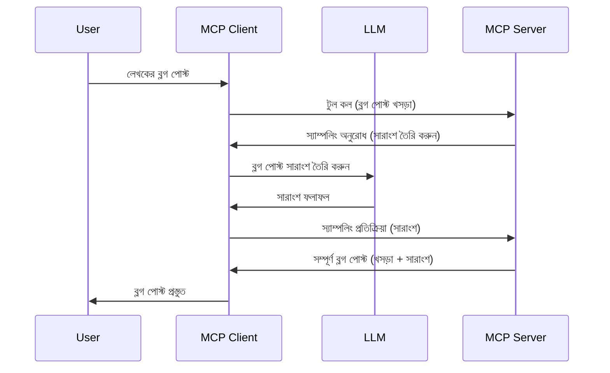

# স্যাম্পলিং - ক্লায়েন্টের কাছে ফিচার ডেলিগেট করা

> **বিপরীত ঘোষণা:** `2026-07-28` MCP স্পেসিফিকেশন রিলিজ ক্যান্ডিডেট স্যাম্পলিংকে সরাসরি LLM প্রদানকারীর API এর সাথে ইন্টিগ্রেশনের পক্ষেDeprecated ঘোষণা করেছে। স্যাম্পলিং `2025-11-25` এ কাজ করবে এবং আনুষ্ঠানিক ডিপ্রিসিয়েশনের অন্তত একটি বছর পর পর্যন্ত চালু থাকবে, তাই এই লেসনের সবকিছুই যথার্থ থাকবে — তবে নতুন সার্ভার ডিজাইনগুলো বিকল্প প্যাটার্ন মূল্যায়ন করা উচিত। দেখুন [MCP তে কি পরিবর্তন হচ্ছে: 2026-07-28 রিলিজ ক্যান্ডিডেট](../../01-CoreConcepts/mcp-2026-07-28-release-candidate.md).

কখনও কখনও, MCP ক্লায়েন্ট এবং MCP সার্ভারকে একটি সাধারণ লক্ষ্য অর্জনের জন্য সহযোগিতা করতে হয়। এমন একটি পরিস্থিতি থাকতে পারে যেখানে সার্ভারকে ক্লায়েন্টের LLM এর সাহায্যের প্রয়োজন হয়। এই পরিস্থিতির জন্য, স্যাম্পলিং ব্যবহার করা উচিত।

আসুন কয়েকটি ব্যবহারিক কেস দেখাই এবং কিভাবে স্যাম্পলিং জড়িত একটি সমাধান তৈরি করবেন তা দেখি।

## ওভারভিউ

এই লেসনে, আমরা স্যাম্পলিং কখন এবং কোথায় ব্যবহার করবেন এবং এটি কিভাবে কনফিগার করবেন তা ব্যাখ্যা করব।

## শেখার লক্ষ্য

এই অধ্যায়ে, আমরা:

- স্যাম্পলিং কী এবং কখন এটি ব্যবহার করবেন তা ব্যাখ্যা করব।
- MCP তে স্যাম্পলিং কনফিগার করা কীভাবে হয় তা দেখাবো।
- স্যাম্পলিংয়ের উদাহরণ তৈরি করব।

## স্যাম্পলিং কী এবং কেন ব্যবহার করবেন?

স্যাম্পলিং একটি উন্নত ফিচার যা নিম্নরূপ কাজ করে:



### স্যাম্পলিং অনুরোধ

ঠিক আছে, এখন আমাদের কাছে বিশ্বাসযোগ্য একটি দৃশ্যপটের মোটামুটি ধারণা আছে, আসুন সার্ভার থেকে ক্লায়েন্টকে পাঠানো স্যাম্পলিং অনুরোধ সম্পর্কে কথা বলা যাক। JSON-RPC ফর্ম্যাটে এইরকম একটি অনুরোধ দেখতে এমন হবে:

```json
{
  "jsonrpc": "2.0",
  "id": 1,
  "method": "sampling/createMessage",
  "params": {
    "messages": [
      {
        "role": "user",
        "content": {
          "type": "text",
          "text": "Create a blog post summary of the following blog post: <BLOG POST>"
        }
      }
    ],
    "modelPreferences": {
      "hints": [
        {
          "name": "claude-3-sonnet"
        }
      ],
      "intelligencePriority": 0.8,
      "speedPriority": 0.5
    },
    "systemPrompt": "You are a helpful assistant.",
    "maxTokens": 100
  }
}
```

এখানে কয়েকটি বিষয় লক্ষণীয়:

- Prompt, content -> text এর অধীনে, আমাদের প্রম্পট যা LLM কে ব্লগ পোস্টের বিষয়বস্তু সংক্ষেপ করার নির্দেশ।

- **modelPreferences**। এটি কেবল একটি পছন্দ, LLM এর সাথে কোন কনফিগারেশন ব্যবহার করা উচিত তার একটি সুপারিশ। ব্যবহারকারী চাইলে এই সুপারিশগুলি মেনে চলতে পারে অথবা পরিবর্তন করতে পারে। এখানে মডেল নির্বাচন, গতি এবং বুদ্ধিমত্তার প্রাধান্যের সুপারিশ রয়েছে।
- **systemPrompt**, এটি আপনার স্বাভাবিক সিস্টেম প্রম্পট যা আপনার LLM কে ব্যক্তিত্ব দেয় এবং দিকনির্দেশনা প্রদান করে।
- **maxTokens**, এই প্রপার্টিটি বলে দেয় এই কাজের জন্য কতগুলি টোকেন ব্যবহার করা উচিত।

### স্যাম্পলিং সাড়া

এই সাড়া MCP ক্লায়েন্ট থেকে MCP সার্ভারকে ফেরত পাঠানো হয় এবং এটি ক্লায়েন্টের LLM কল করার পরে প্রাপ্ত উত্তর থেকে তৈরি হয়। JSON-RPC ফর্ম্যাটে এরকম দেখতে পারে:

```json
{
  "jsonrpc": "2.0",
  "id": 1,
  "result": {
    "role": "assistant",
    "content": {
      "type": "text",
      "text": "Here's your abstract <ABSTRACT>"
    },
    "model": "gpt-5",
    "stopReason": "endTurn"
  }
}
```

লক্ষ্য করুন সাড়া ব্লগ পোস্টের সংক্ষিপ্তসার ঠিক যেমন আমরা চাইেছিলাম। এছাড়াও লক্ষ্য করুন ব্যবহারকৃত `model` যা আমরা চাইনি, কিন্তু "gpt-5" ব্যবহার হয়েছে "claude-3-sonnet" এর পরিবর্তে, যা বোঝায় ব্যবহারকারী তাদের পছন্দ পরিবর্তন করতে পারে এবং আপনার স্যাম্পলিং অনুরোধ কেবল সুপারিশ মাত্র।

এখন যেহেতু প্রধান প্রবাহ বুঝে গেছি, এবং "ব্লগ পোস্ট তৈরি + সংক্ষিপ্তসার" এর মত একটি দরকারী কাজের জন্য এটি ব্যবহার করা যায়, চলুন দেখি এটি কাজ করানোর জন্য কী করতে হবে।

### বার্তার ধরণ

স্যাম্পলিং বার্তা শুধুমাত্র টেক্সটই নয়, ছবি এবং অডিওও পাঠাতে পারে। JSON-RPC এর মধ্যে তার পার্থক্য এভাবে:

**টেক্সট**

```json
{
  "type": "text",
  "text": "The message content"
}
```

**ছবির বিষয়বস্তু**

```json
{
  "type": "image",
  "data": "base64-encoded-image-data",
  "mimeType": "image/jpeg"
}
```

**অডিও বিষয়বস্তু**

```json
{
  "type": "audio",
  "data": "base64-encoded-audio-data",
  "mimeType": "audio/wav"
}
```

> NOTE: স্যাম্পলিং সম্পর্কে আরও বিস্তারিত তথ্যের জন্য দেখুন [অফিসিয়াল ডকস](https://modelcontextprotocol.io/specification/2025-11-25/client/sampling)

## ক্লায়েন্টে স্যাম্পলিং কনফিগার কিভাবে করবেন

> মন্তব্য: আপনি যদি শুধু সার্ভার তৈরি করে থাকেন, তাহলে এখানে খুব বেশি কিছু করার দরকার নেই।

ক্লায়েন্টে, আপনাকে নিচের ফিচারটি এভাবে উল্লেখ করতে হবে:

```json
{
  "capabilities": {
    "sampling": {}
  }
}
```

এরপর এটি আপনার নির্বাচিত ক্লায়েন্ট যখন সার্ভারের সাথে ইন্টিগ্রেট হবে তখন নেওয়া হবে।

## স্যাম্পলিং এর কার্যকর উদাহরণ - একটি ব্লগ পোস্ট তৈরি করা

আসুন একসাথে একটি স্যাম্পলিং সার্ভার কোড করি, আমাদের যা করতে হবে তা হলো:

1. সার্ভারে একটি টুল তৈরি করা।
1. ঐ টুলটি একটি স্যাম্পলিং অনুরোধ তৈরি করবে
1. টুলটি ক্লায়েন্টের স্যাম্পলিং অনুরোধের উত্তরের জন্য অপেক্ষা করবে।
1. তারপর টুলের ফলাফল তৈরি হবে।

আসুন ধাপে ধাপে কোড দেখি:

### -1- টুল তৈরি করুন

**python**

```python
@mcp.tool()
async def create_blog(title: str, content: str, ctx: Context[ServerSession, None]) -> str:
    """Create a blog post and generate a summary"""

```

### -2- একটি স্যাম্পলিং অনুরোধ তৈরি করুন

আপনার টুলে নিম্ন কোড যুক্ত করুন:

**python**

```python
post = BlogPost(
        id=len(posts) + 1,
        title=title,
        content=content,
        abstract=""
    )

prompt = f"Create an abstract of the following blog post: title: {title} and draft: {content} "

result = await ctx.session.create_message(
        messages=[
            SamplingMessage(
                role="user",
                content=TextContent(type="text", text=prompt),
            )
        ],
        max_tokens=100,
)

```

### -3- উত্তরের জন্য অপেক্ষা করুন এবং সাড়া ফেরত দিন

**python**

```python
post.abstract = result.content.text

posts.append(post)

# সম্পূর্ণ পণ্য ফিরিয়ে দিন
return json.dumps({
    "id": post.title,
    "abstract": post.abstract
})
```

### -4- সম্পূর্ণ কোড

**python**

```python
from starlette.applications import Starlette
from starlette.routing import Mount, Host

from mcp.server.fastmcp import Context, FastMCP

from mcp.server.session import ServerSession
from mcp.types import SamplingMessage, TextContent

import json


from uuid import uuid4
from typing import List
from pydantic import BaseModel


mcp = FastMCP("Blog post generator")

# app = FastAPI()

posts = []

class BlogPost(BaseModel):
    id: int
    title: str
    content: str
    abstract: str

posts: List[BlogPost] = []

@mcp.tool()
async def create_blog(title: str, content: str, ctx: Context[ServerSession, None]) -> str:
    """Create a blog post and generate a summary"""

    post = BlogPost(
        id=len(posts) + 1,
        title=title,
        content=content,
        abstract=""
    )

    prompt = f"Create an abstract of the following blog post: title: {title} and draft: {content} "

    result = await ctx.session.create_message(
        messages=[
            SamplingMessage(
                role="user",
                content=TextContent(type="text", text=prompt),
            )
        ],
        max_tokens=100,
    )

    post.abstract = result.content.text

    posts.append(post)

    # সম্পূর্ণ ব্লগ পোস্ট ফেরত দিন
    return json.dumps({
        "id": post.title,
        "abstract": post.abstract
    })

if __name__ == "__main__":
    print("Starting server...")
    # mcp.run()
    mcp.run(transport="streamable-http")

# রান করার জন্য অ্যাপ: python server.py
```

### -5- ভিজ্যুয়াল স্টুডিও কোডে এটি পরীক্ষা করা

ভিজ্যুয়াল স্টুডিও কোডে এটি পরীক্ষার জন্য, নিম্নলিখিত করুন:

1. টার্মিনালে সার্ভার শুরু করুন
1. এটি *mcp.json* এ যোগ করুন (এবং নিশ্চিত করুন এটি কাজ করছে) উদাহরণস্বরূপ:

   ```json
   "servers": {
      "blog-server": {
        "type": "http",
        "url": "http://localhost:8000/mcp"
      }
   }
   ```

1. একটি প্রম্পট টাইপ করুন:

   ```text
   create a blog post named "Where Python comes from", the content is "Python is actually named after Monty Python Flying Circus"
   ```

1. স্যাম্পলিং এর অনুমতি দিন। প্রথমবার এটি পরীক্ষা করার সময় একটি অতিরিক্ত ডায়ালগ পপাপ হবে যা আপনাকে গ্রহণ করতে হবে, তারপর আপনি টুল চালানোর জন্য সাধারণ ডায়ালগ দেখতে পাবেন

1. ফলাফল পরিদর্শন করুন। আপনি ফলাফলগুলো GitHub Copilot চ্যাটে সুন্দরভাবে দেখবেন এবং কাঁচা JSON সাড়া ও পরিদর্শন করতে পারবেন।

**বোনাস**। ভিজ্যুয়াল স্টুডিও কোডের টুলিংয়ে স্যাম্পলিংয়ের জন্য দুর্দান্ত সমর্থন আছে। আপনি ইনস্টল করা সার্ভারের জন্য স্যাম্পলিং অ্যাক্সেস কনফিগার করতে পারেন এভাবে:

1. এক্সটেনশন সেকশনে যান।
1. "MCP SERVERS - INSTALLED" সেকশনের ইনস্টল করা সার্ভারের জন্য কগ আইকনে ক্লিক করুন।
1 "Configure Model Access" নির্বাচন করুন, এখানে আপনি নিদিষ্ট মডেল নির্বাচন করতে পারবেন যা GitHub Copilot স্যাম্পলিং করার সময় ব্যবহার করতে পারবে। এছাড়াও "Show Sampling requests” নির্বাচন করে সাম্প্রতিক সমস্ত স্যাম্পলিং অনুরোধ দেখতে পারবেন।

## অ্যাসাইনমেন্ট

এই অ্যাসাইনমেন্টে, আপনি একটু ভিন্ন স্যাম্পলিং তৈরি করবেন, অর্থাৎ এমন একটি স্যাম্পলিং ইন্টিগ্রেশন যা একটি প্রোডাক্ট বর্ণনা তৈরি করতে সমর্থ। আপনার দৃশ্যপট হলো:

**দৃশ্যপট**: একটি ই-কমার্স ব্যাক অফিস কর্মী সময় নষ্ট করছে পণ্যের বর্ণনা তৈরিতে। তাই আপনাকে এমন একটি সমাধান তৈরি করতে হবে যেখানে একটি টুল "create_product" কল করা যাবে "title" এবং "keywords" আর্গুমেন্ট নিয়ে এবং এটা একটি সম্পূর্ণ পণ্য তৈরি করবে যার মধ্যে "description" ক্ষেত্রটি ক্লায়েন্টের LLM দ্বারা পূরণ হবে।

টিপ: আগে যা শিখেছেন তা ব্যবহার করে এই সার্ভার এবং এর টুলটি স্যাম্পলিং অনুরোধ ব্যবহার করে গঠন করুন।

## সমাধান

[সমাধান](./solution/README.md)

## মূল শিক্ষা

স্যাম্পলিং একটি শক্তিশালী ফিচার যা সার্ভারকে ক্লায়েন্টের কাছে কাজ দায়িত্ব ভাগাভাগি করতে দেয় যখন সার্ভারকে LLM এর সাহায্যের প্রয়োজন হয়।

## পরবর্তী ধাপ

- [অধ্যায় ৪ - ব্যবহারিক বাস্তবায়ন](../../04-PracticalImplementation/README.md)

---

<!-- CO-OP TRANSLATOR DISCLAIMER START -->
**অস্বীকৃতি**:
এই নথিটি AI অনুবাদ পরিষেবা [Co-op Translator](https://github.com/Azure/co-op-translator) ব্যবহার করে অনূদিত হয়েছে। যদিও আমরা শুদ্ধতার জন্য চেষ্টা করি, অনুগ্রহ করে মনে রাখবেন যে স্বয়ংক্রিয় অনুবাদে ত্রুটি বা অসঙ্গতি থাকতে পারে। মূল নথিটি তার স্বভাষায় কর্তৃত্বপূর্ণ উৎস হিসেবে বিবেচিত হওয়া উচিত। গুরুত্বপূর্ণ তথ্যের জন্য পেশাদার মানব অনুবাদ সুপারিশ করা হয়। এই অনুবাদের ব্যবহারে প্রয়োজনীয় ভুল বোঝাবুঝি বা ভুল ব্যাখ্যার জন্য আমরা দায়বদ্ধ নই।
<!-- CO-OP TRANSLATOR DISCLAIMER END -->