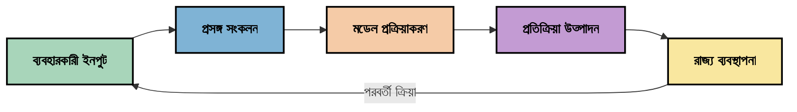
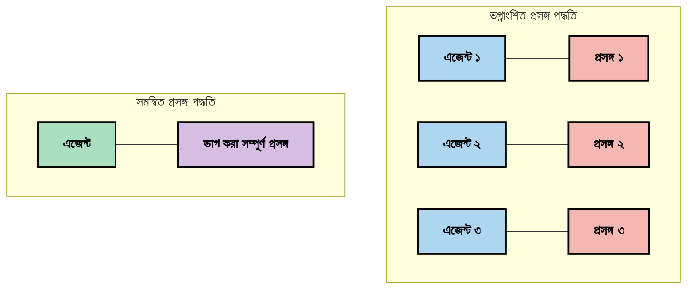
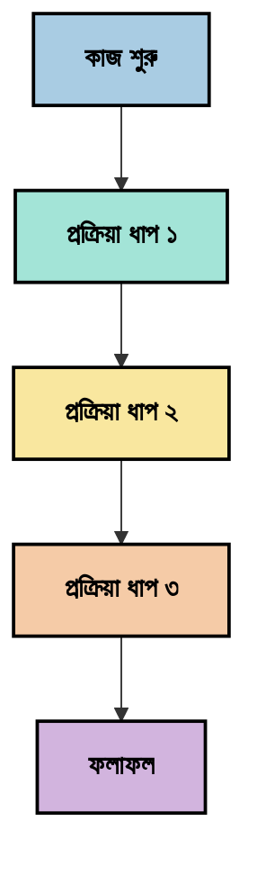
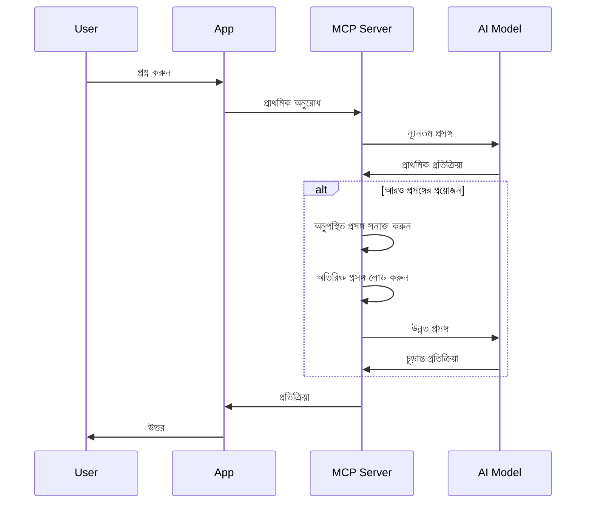
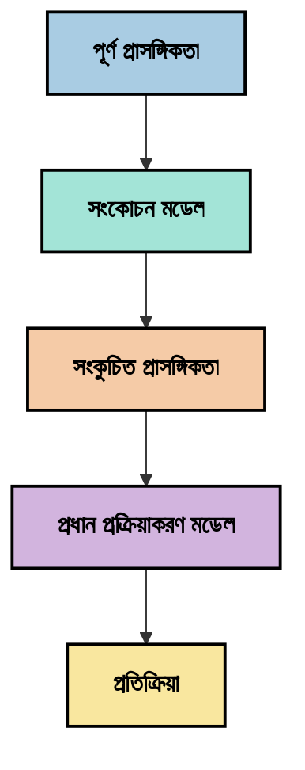
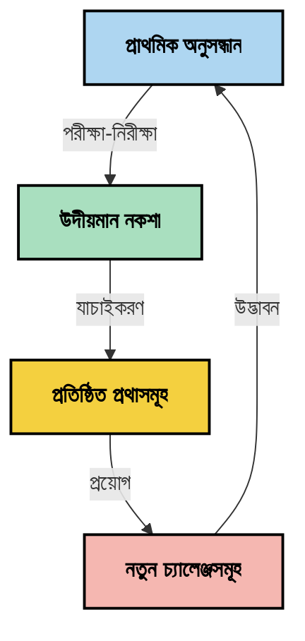

# প্রসঙ্গ প্রকৌশল: MCP ইকোসিস্টেমে একটি উদীয়মান ধারণা

## পর্যালোচনা

প্রসঙ্গ প্রকৌশল হল AI ক্ষেত্রে একটি উদীয়মান ধারণা যা অনুসন্ধান করে কিভাবে তথ্য গঠন করা হয়, সরবরাহ করা হয় এবং ক্লায়েন্ট এবং AI পরিষেবাগুলির মধ্যে ইন্টারঅ্যাকশনের সময় রক্ষা করা হয়। যেমন Model Context Protocol (MCP) ইকোসিস্টেম বিকশিত হচ্ছে, কার্যকরভাবে প্রসঙ্গ পরিচালনা করার পদ্ধতি বুঝতে পারা ক্রমশ গুরুত্বপূর্ণ হয়ে উঠছে। এই মডিউলটি প্রসঙ্গ প্রকৌশলের ধারণাটি পরিচয় করিয়ে দেয় এবং MCP প্রয়োগে এর সম্ভাব্য ব্যবহারের অন্বেষণ করে।

## শেখার লক্ষ্যসমূহ

এই মডিউলটির শেষে, আপনি সক্ষম হবেন:

- প্রসঙ্গ প্রকৌশলের উদীয়মান ধারণা এবং MCP অ্যাপ্লিকেশনগুলিতে এর সম্ভাব্য ভূমিকা বুঝতে
- প্রসঙ্গ পরিচালনার মূল চ্যালেঞ্জগুলি চিহ্নিত করতে যা MCP প্রোটোকল ডিজাইন সমাধান করে
- উন্নত প্রসঙ্গ ব্যবহারের মাধ্যমে মডেল পারফরম্যান্স উন্নত করার কৌশল অন্বেষণ করতে
- প্রসঙ্গ কার্যকারিতা পরিমাপ ও মূল্যায়নের পদ্ধতি বিবেচনা করতে
- MCP ফ্রেমওয়ার্কের মাধ্যমে AI অভিজ্ঞতা উন্নত করার জন্য এই উদীয়মান ধারণাগুলি প্রয়োগ করতে

## প্রসঙ্গ প্রকৌশলের পরিচিতি

প্রসঙ্গ প্রকৌশল হল একটি উদীয়মান ধারণা যা ব্যবহারকারী, অ্যাপ্লিকেশন এবং AI মডেলের মধ্যে তথ্য প্রবাহের উদ্দেশ্যমূলক নকশা এবং পরিচালনার ওপর কেন্দ্রীভূত। প্রম্পট প্রকৌশলের মত প্রতিষ্ঠিত ক্ষেত্রগুলির থেকে আলাদা, প্রসঙ্গ প্রকৌশল এখনও অনুশীলনকারিদের দ্বারা সংজ্ঞায়িত হচ্ছে কারণ তারা AI মডেলকে সঠিক সময়ে সঠিক তথ্য প্রদান করার অনন্য চ্যালেঞ্জগুলি সমাধান করার চেষ্টা করছে।

যেহেতু বড় ভাষার মডেলগুলি (LLMs) বিকশিত হয়েছে, প্রসঙ্গের গুরুত্ব ক্রমশ স্পষ্ট হয়ে উঠেছে। আমরা যে প্রসঙ্গ প্রদান করি তার গুণমান, প্রাসঙ্গিকতা এবং গঠন সরাসরি মডেলের আউটপুটে প্রভাব ফেলে। প্রসঙ্গ প্রকৌশল এই সম্পর্কটি অন্বেষণ করে এবং কার্যকর প্রসঙ্গ ব্যবস্থাপনার জন্য নীতিমালা বিকাশের চেষ্টা করে।

> "২০২৫ সালে, তেমন মডেলগুলি অত্যন্ত বুদ্ধিমান। তবে সবচেয়ে বুদ্ধিমান মানুষও তাদের কাজ কার্যকরভাবে করতে পারবে না যদি তারা যা করতে বলা হচ্ছে তার প্রসঙ্গ না জানে... 'প্রসঙ্গ প্রকৌশল' হল পরবর্তী স্তরের প্রম্পট প্রকৌশল। এটি একটি গতিশীল সিস্টেমে স্বয়ংক্রিয়ভাবে তা করার ব্যাপার।" — ওয়ালডেন ইয়ান, কগনিশন AI

প্রসঙ্গ প্রকৌশল অন্তর্ভুক্ত করতে পারে:

1. **প্রসঙ্গ নির্বাচন**: নির্ধারণ করা কোন তথ্য একটি নির্দিষ্ট কাজের জন্য প্রাসঙ্গিক
2. **প্রসঙ্গ গঠন**: মডেলের বোঝাপড়া সর্বাধিক করার জন্য তথ্য সংগঠিত করা
3. **প্রসঙ্গ সরবরাহ**: তথ্য মডেলে পাঠানোর পদ্ধতি ও সময় স оптимাইজ করা
4. **প্রসঙ্গ রক্ষণাবেক্ষণ**: সময়ের সাথে প্রসঙ্গের অবস্থা ও বিকাশ পরিচালনা করা
5. **প্রসঙ্গ মূল্যায়ন**: প্রসঙ্গের কার্যকারিতা পরিমাপ ও উন্নয়ন করা

এই ফোকাস ক্ষেত্রগুলি MCP ইকোসিস্টেমের জন্য বিশেষত প্রাসঙ্গিক, যা অ্যাপ্লিকেশনগুলিকে LLMs-এ প্রসঙ্গ সরবরাহের একটি মানসম্মত পদ্ধতি প্রদান করে।


## প্রসঙ্গ যাত্রার দৃষ্টিভঙ্গি

প্রসঙ্গ প্রকৌশলকে দৃষ্টান্তমূলক করার এক উপায় হল MCP সিস্টেমের মাধ্যমে তথ্য যাত্রার ট্রেস করা:



### প্রসঙ্গ যাত্রার মূল স্তরসমূহ:

1. **ব্যবহারকারী ইনপুট**: ব্যবহারকারীর কাঁচা তথ্য (টেক্সট, ছবি, ডকুমেন্ট)
2. **প্রসঙ্গ সংকলন**: ব্যবহারকারী ইনপুটকে সিস্টেম প্রসঙ্গ, কথোপকথনের ইতিহাস, এবং অন্যান্য পুনরুদ্ধার তথ্যের সাথে সংযুক্ত করা
3. **মডেল প্রক্রিয়াকরণ**: AI মডেল সংগ্রহ করা প্রসঙ্গ প্রক্রিয়াকরণ করে
4. **প্রতিক্রিয়া উৎপাদন**: মডেল প্রদত্ত প্রসঙ্গের ভিত্তিতে আউটপুট তৈরি করে
5. **স্থিতি পরিচালনা**: ইন্টারঅ্যাকশনের ভিত্তিতে সিস্টেম তার অভ্যন্তরীণ অবস্থা আপডেট করে

এই দৃষ্টিভঙ্গি AI সিস্টেমে প্রসঙ্গের গতিশীল প্রকৃতিকে হাইলাইট করে এবং প্রতিটি স্তরে তথ্য পরিচালনার সর্বোত্তম পদ্ধতি সম্পর্কে গুরুত্বপূর্ণ প্রশ্ন তোলে।

## প্রসঙ্গ প্রকৌশলের উদীয়মান নীতিমালা

প্রসঙ্গ প্রকৌশলের ক্ষেত্র আকৃতি নিচ্ছে, কিছু প্রাথমিক নীতিমালা অনুশীলনকারিদের থেকে উদীয়মান হচ্ছে। এই নীতিমালা MCP প্রয়োগের পছন্দগুলি জানাতে সাহায্য করতে পারে:

### নীতি ১: প্রসঙ্গ সম্পূর্ণরূপে শেয়ার করুন

সিস্টেমের সমস্ত উপাদানের মধ্যে প্রসঙ্গ সম্পূর্ণরূপে শেয়ার করা উচিত, না कि বিভিন্ন এজেন্ট বা প্রক্রিয়াগুলিতে ভাগ করা। যখন প্রসঙ্গ বিতরণ করা হয়, তখন সিস্টেমের এক অংশে গৃহীত সিদ্ধান্ত অন্যত্র গৃহীত সিদ্ধান্তের সাথে বিরোধ সৃষ্টি করতে পারে।



MCP অ্যাপ্লিকেশনগুলিতে, এটি এমন সিস্টেম ডিজাইন করার পরামর্শ দেয় যেখানে প্রসঙ্গ পুরো পাইপলাইনের মাধ্যমে নির্বিঘ্নে প্রবাহিত হয়, বিচ্ছিন্ন না হয়।

### নীতি ২: বুঝতে হবে যে ক্রিয়াগুলো অন্তর্নিহিত সিদ্ধান্ত বহন করে

মডেল যে প্রতিটি ক্রিয়া গ্রহণ করে তা প্রসঙ্গ কীভাবে ব্যাখ্যা করা হবে তার অন্তর্নিহিত সিদ্ধান্ত ধারণ করে। যখন একাধিক উপাদান ভিন্ন প্রসঙ্গে কাজ করে, তখন এই অন্তর্নিহিত সিদ্ধান্তগুলি বিরোধ সৃষ্টি করতে পারে, যার ফলে অসঙ্গত ফলাফল হয়।

এই নীতির MCP অ্যাপ্লিকেশনগুলির জন্য গুরুত্বপূর্ণ প্রভাব রয়েছে:
- জটিল কাজের জন্য সমান্তরাল সম্পাদনার পরিবর্তে রৈখিক প্রক্রিয়াকরণ প্রাধান্য দিন, যেখানে প্রসঙ্গ ফাঁটা হয়েছে
- নিশ্চিত করুন যে সমস্ত সিদ্ধান্তবিন্দুতে একই প্রসঙ্গগত তথ্য অ্যাক্সেসযোগ্য
- এমন সিস্টেম ডিজাইন করুন যেখানে পরবর্তী ধাপগুলি আগের সিদ্ধান্তের সম্পূর্ণ প্রসঙ্গ দেখতে পারে

### নীতি ৩: প্রসঙ্গ গভীরতা এবং উইন্ডো সীমাবদ্ধতার মধ্যে সমতা বজায় রাখুন

কথোপকথন এবং প্রক্রিয়াগুলি যত দীর্ঘ হয়, প্রসঙ্গ উইন্ডোগুলি অবশেষে পূর্ণ হয়। কার্যকর প্রসঙ্গ প্রকৌশল ব্যাপক প্রসঙ্গ এবং প্রযুক্তিগত সীমাবদ্ধতার মধ্যে এই চাপ পরিচালনার পদ্ধতি অন্বেষণ করে।

সম্ভাব্য পদ্ধতিগুলো অন্তর্ভুক্ত করতে পারে:
- প্রয়োজনীয় তথ্য বজায় রেখে টোকেন ব্যবহারে হ্রাস করার জন্য প্রসঙ্গ সংকোচন
- বর্তমান প্রয়োজনের সাথে প্রাসঙ্গিকতার ভিত্তিতে ধাপে ধাপে প্রসঙ্গ লোডিং
- পূর্ববর্তী ইন্টারঅ্যাকশনের সারাংশ তৈরি যেখানে মূল সিদ্ধান্ত এবং তথ্য সংরক্ষণ করা হয়

## প্রসঙ্গ চ্যালেঞ্জ এবং MCP প্রোটোকল ডিজাইন

Model Context Protocol (MCP) প্রসঙ্গ ব্যবস্থাপনার অনন্য চ্যালেঞ্জগুলি বোঝার সাথে ডিজাইন করা হয়েছে। এই চ্যালেঞ্জগুলি বুঝতে পারা MCP প্রোটোকল ডিজাইনের মূল দিকগুলি ব্যাখ্যা করতে সাহায্য করে:


### চ্যালেঞ্জ ১: প্রসঙ্গ উইন্ডোর সীমাবদ্ধতা
অধিকাংশ AI মডেলের নির্দিষ্ট প্রসঙ্গ উইন্ডোর আকার রয়েছে, যা তারা একবারে কত তথ্য প্রক্রিয়া করতে পারে তা সীমাবদ্ধ করে।

**MCP ডিজাইন উত্তর:**
- প্রোটোকল গঠনমূলক, উৎস-ভিত্তিক প্রসঙ্গ সমর্থন করে যা দক্ষতার সঙ্গে রেফারেন্স করা যেতে পারে
- সম্পদ পেজিনেট করা যেতে পারে এবং ধাপে ধাপে লোড করা যেতে পারে

### চ্যালেঞ্জ ২: প্রাসঙ্গিকতা নির্ধারণ
কোন তথ্য প্রসঙ্গের জন্য সবচেয়ে প্রাসঙ্গিক তা নির্ধারণ করা কঠিন।

**MCP ডিজাইন উত্তর:**
- নমনীয় টুলিং প্রয়োজন অনুসারে তথ্যে গতিশীল পুনরুদ্ধার সক্ষম করে
- গঠিত প্রম্পট consistent প্রসঙ্গ সংগঠন নিশ্চিত করে

### চ্যালেঞ্জ ৩: প্রসঙ্গ স্থায়িত্ব
ইন্টারঅ্যাকশনের বিস্তারে অবস্থান পরিচালনা করার জন্য প্রোসঙ্গের সূক্ষ্ম ট্র্যাকিং দরকার।

**MCP ডিজাইন উত্তর:**
- মানসম্পন্ন সেশন ব্যবস্থাপনা
- প্রসঙ্গ বিকাশের জন্য স্পষ্টভাবে সংজ্ঞায়িত ইন্টারঅ্যাকশন প্যাটার্ন

### চ্যালেঞ্জ ৪: বহু-মোডাল প্রসঙ্গ
বিভিন্ন ধরনের ডেটা (টেক্সট, ছবি, গঠিত ডেটা) আলাদা ব্যবহারের প্রয়োজন।

**MCP ডিজাইন উত্তর:**
- প্রোটোকল ডিজাইন বিভিন্ন বিষয়বস্তু ধরনের জন্য উপযোগী
- বহু-মোডাল তথ্যের মানসম্পন্ন উপস্থাপনা

### চ্যালেঞ্জ ৫: নিরাপত্তা ও গোপনীয়তা
প্রসঙ্গে প্রায়ই সংবেদনশীল তথ্য থাকে যা সুরক্ষিত রাখতে হবে।

**MCP ডিজাইন উত্তর:**
- ক্লায়েন্ট ও সার্ভারের দায়িত্বের মধ্যে স্পষ্ট সীমানা
- ডেটা প্রকাশ কমাতে স্থানীয় প্রক্রিয়াকরণ বিকল্পসমূহ

এই চ্যালেঞ্জগুলি বোঝা এবং MCP সেগুলি কীভাবে মোকাবিলা করে তা আরও উন্নত প্রসঙ্গ প্রকৌশল কৌশল অন্বেষণের ভিত্তি প্রদান করে।

## উদীয়মান প্রসঙ্গ প্রকৌশল পদ্ধতিসমূহ

প্রসঙ্গ প্রকৌশলের ক্ষেত্র বিকশিত হওয়ার সাথে সাথে, বেশ কয়েকটি আশাব্যঞ্জক পদ্ধতি উদীয়মান হচ্ছে। এগুলো প্রবর্তিত চিন্তাধারা প্রতিনিধিত্ব করে যা এখনও প্রতিষ্ঠিত সর্বোচ্চ অনুশীলন নয় এবং MCP প্রয়োগের অভিজ্ঞতা বাড়ার সাথে সাথে বিকশিত হতে পারে।

### ১. একক-সুত্রযুক্ত রৈখিক প্রক্রিয়াকরণ

প্রসঙ্গ বিতরণকারী বহুচর এজেন্ট আর্কিটেকচারগুলির বিপরীতে, কিছু অনুশীলনকারী খুঁজে পাচ্ছেন একক-সুত্রযুক্ত রৈখিক প্রক্রিয়াকরণ অধিক সামঞ্জস্যপূর্ণ ফলাফল দেয়। এইটি একত্রীকৃত প্রসঙ্গ বজায় রাখার নীতির সঙ্গে সঙ্গতিপূর্ণ।



এই পদ্ধতিটি সমান্তরাল প্রক্রিয়াকরণের তুলনায় কম কার্যকর মনে হতে পারে, তবুও এটি প্রায়শই আরো সারবসার্থক এবং নির্ভরযোগ্য ফলাফল দেয় কারণ প্রতিটি ধাপ পূর্ববর্তী সিদ্ধান্তগুলির সম্পূর্ণ বোঝাপড়ার ওপর নির্মিত।

### ২. প্রসঙ্গ খণ্ডকরণ এবং অগ্রাধিকার নির্ধারণ

বড় প্রসঙ্গকে পরিচালনাযোগ্য অংশে ভেঙ্গে ফেলা এবং সবচেয়ে গুরুত্বপূর্ণ অংশগুলোকে অগ্রাধিকার দেওয়া।

```python
# ধারণাগত উদাহরণ: প্রসঙ্গ ভাগ করা এবং অগ্রাধিকার প্রদান
def process_with_chunked_context(documents, query):
    # ১। নথিগুলোকে ছোট ছোট ভাগে ভাগ করুন
    chunks = chunk_documents(documents)
    
    # ২। প্রতিটি ভাগের জন্য প্রাসঙ্গিকতার স্কোর হিসাব করুন
    scored_chunks = [(chunk, calculate_relevance(chunk, query)) for chunk in chunks]
    
    # ৩। প্রাসঙ্গিকতার স্কোর অনুযায়ী ভাগগুলো সাজিয়ে নিন
    sorted_chunks = sorted(scored_chunks, key=lambda x: x[1], reverse=True)
    
    # ৪। সবচেয়ে প্রাসঙ্গিক ভাগগুলো প্রসঙ্গ হিসাবে ব্যবহার করুন
    context = create_context_from_chunks([chunk for chunk, score in sorted_chunks[:5]])
    
    # ৫। অগ্রাধিকারপ্রাপ্ত প্রসঙ্গের সাথে প্রক্রিয়া করুন
    return generate_response(context, query)
```

উপরের ধারণাটি জোর দেয় কিভাবে আমরা বড় ডকুমেন্টকে ছোট টুকরোতে ভাগ করতে পারি এবং শুধুমাত্র সবচেয়ে প্রাসঙ্গিক অংশগুলো প্রসঙ্গের জন্য নির্বাচন করতে পারি। এই পদ্ধতি প্রসঙ্গ উইন্ডো সীমাবদ্ধতার মধ্যে কাজ করতে সাহায্য করে, এবং এখনও বড় জ্ঞানভান্ডার ব্যবহার করতে পারে।

### ৩. ধাপে ধাপে প্রসঙ্গ লোডিং

প্রয়োজন অনুযায়ী ধাপে ধাপে প্রসঙ্গ লোড করা, সম্পূর্ণ একবারে না।



ধাপে ধাপে প্রসঙ্গ লোডিং সর্বনিম্ন প্রসঙ্গ থেকে শুরু করে এবং প্রয়োজন অনুসারে বিস্তার লাভ করে। এটি সাধারণ প্রশ্নের জন্য টোকেন ব্যবহারে উল্লেখযোগ্য হ্রাস করতে পারে, একই সাথে জটিল প্রশ্ন মোকাবেলা করার সক্ষমতা রাখে।

### ৪. প্রসঙ্গ সংকোচন এবং সারাংশ তৈরি

অপরিহার্য তথ্য সংরক্ষণ করে প্রসঙ্গের আকার কমানো।



প্রসঙ্গ সংকোচনের ফোকাস:
- পুনরাবৃত্ত তথ্য অপসারণ করা
- দীর্ঘ বিষয়বস্তু সারাংশ করা
- মূল তথ্য ও বিস্তারিত আহরণ
- গুরুত্বপূর্ণ প্রসঙ্গ উপাদান সংরক্ষণ
- টোকেন দক্ষতার জন্য অপ্টিমাইজ করা

এই পদ্ধতি প্রসঙ্গ উইন্ডোতে দীর্ঘ কথোপকথন বজায় রাখতে বা বড় ডকুমেন্ট দক্ষতার সঙ্গে প্রক্রিয়াকরণের জন্য বিশেষভাবে মূল্যবান হতে পারে। কিছু অনুশীলনকারী কথোপকথন ইতিহাসের প্রসঙ্গ সংকোচন ও সারাংশ তৈরি জন্য বিশেষায়িত মডেল ব্যবহার করছেন।


## অন্বেষণমূলক প্রসঙ্গ প্রকৌশল বিবেচনা

প্রসঙ্গ প্রকৌশলের উদীয়মান ক্ষেত্র পরীক্ষা করার সময়, MCP প্রয়োগের সাথে কাজ করার সময় কয়েকটি বিবেচ্য বিষয় গুরুত্বপূর্ণ। এগুলো আদর্শ সর্বোত্তম অনুশীলন নয় বরং এমন ক্ষেত্র যা আপনার নির্দিষ্ট ব্যবহারের ক্ষেত্রে উন্নতি ঘটাতে পারে।

### আপনার প্রসঙ্গ লক্ষ্য বিবেচনা করুন

জটিল প্রসঙ্গ ব্যবস্থাপনা সমাধান প্রয়োগের আগে, স্পষ্টভাবে প্রকাশ করুন আপনি কী অর্জন করতে চান:
- কোন নির্দিষ্ট তথ্য মডেলের সফলতার জন্য প্রয়োজন?
- কোন তথ্য অপরিহার্য এবং কোন সম্পূরক?
- আপনার পারফরম্যান্স সীমাবদ্ধতা (প্রতিক্রিয়া সময়, টোকেন সীমা, খরচ) কী কী?

### স্তরীকৃত প্রসঙ্গ পদ্ধতিগুলি অন্বেষণ করুন

কিছু অনুশীলনকারী ধারণাগত স্তরে বিন্যাস্ত প্রসঙ্গের মাধ্যমে সফলতা পাচ্ছেন:
- **প্রধান স্তর**: মডেলের সর্বদা প্রয়োজনীয় অপরিহার্য তথ্য
- **পরিস্থিতিগত স্তর**: বর্তমান ইন্টারঅ্যাকশনের জন্য নির্দিষ্ট প্রসঙ্গ
- **সহায়ক স্তর**: অতিরিক্ত তথ্য যা উপকারী হতে পারে
- **ব্যাকআপ স্তর**: শুধুমাত্র প্রয়োজন হলে অ্যাক্সেসযোগ্য তথ্য

### পুনরুদ্ধার কৌশল অনুসন্ধান করুন

আপনার প্রসঙ্গের কার্যকারিতা প্রায়শই নির্ভর করে আপনি কীভাবে তথ্য পুনরুদ্ধার করেন:
- ধারণাগত প্রাসঙ্গিক তথ্য খুঁজে পেতে সেমান্টিক সার্চ এবং এম্বেডিং
- নির্দিষ্ট বাস্তব তথ্যের জন্য কীওয়ার্ড ভিত্তিক অনুসন্ধান
- একাধিক পুনরুদ্ধার পদ্ধতির সমন্বিত হাইব্রিড পদ্ধতি
- বিভাগ, তারিখ বা উৎস ভিত্তিক সীমা সঙ্কুচিত করতে মেটাডেটা ফিল্টারিং

### প্রসঙ্গ সামঞ্জস্যের সঙ্গে পরীক্ষা করুন

আপনার প্রসঙ্গের গঠন এবং প্রবাহ মডেল বোঝাপড়াকে প্রভাবিত করতে পারে:
- সম্পর্কিত তথ্য একত্রে গ্রুপিং
- নির্দিষ্ট ফরম্যাটিং ও সংগঠন ব্যবহার
- যেখানে প্রাসঙ্গিক সেখানে যৌক্তিক বা কালানুক্রমিক ক্রম বজায় রাখা
- বর্জনীয় তথ্য এড়ানো

### বহু-এজেন্ট আর্কিটেকচারের সুবিধা ও অসুবিধা তুলনা করুন

যদিও বহু-এজেন্ট আর্কিটেকচার অনেক AI ফ্রেমওয়ার্কে জনপ্রিয়, উভয় প্রসঙ্গ ব্যবস্থাপনায় গুরুত্বপূর্ণ চ্যালেঞ্জ নিয়ে আসে:
- প্রসঙ্গ ফাটলে এজেন্টদের মধ্যে অসঙ্গত সিদ্ধান্ত হতে পারে
- সমান্তরাল প্রক্রিয়াকরণ বিরোধ সৃষ্টি করতে পারে যা মেটানো কঠিন
- এজেন্টদের মধ্যে যোগাযোগ ওভারহেড পারফরম্যান্স লাভ কমাতে পারে
- সামঞ্জস্য বজায় রাখতে জটিল স্টেট ব্যবস্থাপনা প্রয়োজন

অনেক ক্ষেত্রে, একটি একক-এজেন্ট পদ্ধতি ব্যাপক প্রসঙ্গ ব্যবস্থাপনার মাধ্যমে বহু বিশেষায়িত এজেন্টের তুলনায় বেশি নির্ভরযোগ্য ফলাফল দিতে পারে।

### মূল্যায়ন পদ্ধতি বিকাশ করুন

সময়ের সাথে প্রসঙ্গ প্রকৌশল উন্নত করতে, সফলতা পরিমাপ করার পদ্ধতি বিবেচনা করুন:
- বিভিন্ন প্রসঙ্গ গঠন নিয়ে A/B পরীক্ষা
- টোকেন ব্যবহার এবং প্রতিক্রিয়া সময় মনিটরিং
- ব্যবহারকারীর সন্তুষ্টি এবং কাজ সম্পাদনের হার ট্র্যাক করা
- প্রসঙ্গ কৌশল ব্যর্থ হওয়ার কারণ ও সময় বিশ্লেষণ

এই বিবেচ্য বিষয়গুলি প্রসঙ্গ প্রকৌশল ক্ষেত্রে সক্রিয় অনুসন্ধানের ক্ষেত্র প্রতিনিধিত্ব করে। ক্ষেত্রটি পরিণত হওয়ার সাথে সাথে আরো নির্দিষ্ট নিদর্শন এবং অনুশীলন উদীয়মান হবে।

## প্রসঙ্গ কার্যকারিতা পরিমাপ: একটি বিকাশমান কাঠামো

প্রসঙ্গ প্রকৌশল একটি ধারণা হিসেবে উদীয়মান হওয়ায়, অনুশীলনকারীরা কীভাবে এর কার্যকারিতা পরিমাপ করা যায় তা অনুসন্ধান করছেন। এখনো কোন প্রতিষ্ঠিত কাঠামো নেই, তবে বিভিন্ন মেট্রিক্স বিবেচনা করা হচ্ছে যা ভবিষ্যৎ কাজ নির্দেশ করতে সাহায্য করতে পারে।

### সম্ভাব্য পরিমাপ মাত্রা


#### ১. ইনপুট দক্ষতার বিবেচনা

- **প্রসঙ্গ-থেকে-প্রতিক্রিয়া অনুপাত**: প্রতিক্রিয়া আকারের তুলনায় কতটা প্রসঙ্গ প্রয়োজন?
- **টোকেন ব্যবহার**: প্রদত্ত প্রসঙ্গ টোকেনের কত শতাংশ সম্ভবত প্রতিক্রিয়াকে প্রভাবিত করে?
- **প্রসঙ্গ হ্রাস**: আমরা কতটা কার্যকরভাবে কাঁচা তথ্য সংকুচিত করতে পারি?

#### ২. পারফরম্যান্স বিবেচনা

- **প্রতিক্রিয়া বিলম্বের প্রভাব**: প্রসঙ্গ ব্যবস্থাপনা প্রতিক্রিয়া সময়কে কীভাবে প্রভাবিত করে?
- **টোকেন অর্থনীতি**: আমরা কী কার্যকরভাবে টোকেন ব্যবহারে অপ্টিমাইজ করছি?
- **পুনরুদ্ধার নির্ভুলতা**: পুনরুদ্ধৃত তথ্য কতটা প্রাসঙ্গিক?
- **সম্পদ ব্যবহার**: কী গণনাগত সম্পদ প্রয়োজন?

#### ৩. গুণগত বিবেচনা

- **প্রতিক্রিয়া প্রাসঙ্গিকতা**: প্রতিক্রিয়া কতটা প্রশ্নের সাথে সঙ্গতিপূর্ণ?
- **বাস্তবতা নির্ভুলতা**: প্রসঙ্গ ব্যবস্থাপনা বাস্তবতার যথার্থতা উন্নত করে কি?
- **সঙ্গতি**: সাদৃশ্যপূর্ণ প্রশ্নে প্রতিক্রিয়াগুলো সঙ্গতিপূর্ণ কি?
- **হ্যালুসিনেশন হার**: উন্নত প্রসঙ্গ মডেল হ্যালুসিনেশন কমায় কি?

#### ৪. ব্যবহারকারী অভিজ্ঞতার বিবেচনা

- **ফলো-আপ হার**: ব্যবহারকারীরা কতবার ব্যাখ্যা চায়?
- **কাজ সম্পাদনের হার**: ব্যবহারকারীরা সফলভাবে তাদের লক্ষ্য অর্জন করে কি?
- **সন্তুষ্টির সূচকসমূহ**: ব্যবহারকারীরা তাদের অভিজ্ঞতা কীভাবে মূল্যায়ন করে?

### অনুসন্ধানমূলক পরিমাপ পদ্ধতি

MCP প্রয়োগে প্রসঙ্গ প্রকৌশলের সাথে পরীক্ষা-নিরীক্ষা করার সময়, এই অনুসন্ধানমূলক পদ্ধতিগুলি বিবেচনা করুন:

১. **মৌলিক তুলনা**: সাধারণ প্রসঙ্গ পদ্ধতির সাথে একটি মৌলিক স্তর স্থাপন করুন, তারপর আরো উন্নত পদ্ধতি পরীক্ষা করুন

২. **ক্রমবিক পরিবর্তন**: এক সময়ে প্রসঙ্গ ব্যবস্থাপনার একটি দিক পরিবর্তন করে এর প্রভাব আলাদা করুন

৩. **ব্যবহারকারী-কেন্দ্রিক মূল্যায়ন**: পরিমাপযোগ্য মেট্রিক্সকে গুণগত ব্যবহারকারী প্রতিক্রিয়ার সঙ্গে সংযুক্ত করুন

৪. **ব্যর্থতা বিশ্লেষণ**: যেখানে প্রসঙ্গ কৌশল ব্যর্থ হয় সেই ক্ষেত্রে বিশ্লেষণ করুন উন্নতির সম্ভাবনা বুঝতে

৫. **বহুমাত্রিক মূল্যায়ন**: দক্ষতা, গুণমান, এবং ব্যবহারকারী অভিজ্ঞতার মধ্যে বিনিময় বিবেচনা করুন

এই পরীক্ষামূলক, বহুমুখী পরিমাপ পদ্ধতি প্রসঙ্গ প্রকৌশলের উদীয়মান প্রকৃতির সাথে সামঞ্জস্যপূর্ণ।

## সমাপনী চিন্তা

প্রসঙ্গ প্রকৌশল একটি উদীয়মান অনুসন্ধানের ক্ষেত্র যা কার্যকর MCP অ্যাপ্লিকেশনগুলির জন্য কেন্দ্রীয় প্রমাণিত হতে পারে। আপনার সিস্টেমের মাধ্যমে তথ্য প্রবাহ কীভাবে ঘটে তা যত্নসহকারে বিবেচনা করে, আপনি সম্ভবত আরো দক্ষ, সঠিক এবং ব্যবহারকারীদের জন্য মূল্যবান AI অভিজ্ঞতা তৈরি করতে পারেন।

এই মডিউলে বর্ণিত কৌশল এবং পদ্ধতিগুলি এই ক্ষেত্রের প্রাথমিক চিন্তাধারা উপস্থাপন করে, প্রতিষ্ঠিত পদ্ধতি নয়। AI ক্ষমতা বিকশিত হলে এবং আমাদের বোঝাপড়া গভীর হলে প্রসঙ্গ প্রকৌশল আরও নির্দিষ্ট শাস্ত্রতে পরিণত হতে পারে। আপাতত, পরীক্ষামূলক কাজের সাথে সতর্ক পরিমাপই সবচেয়ে ফলপ্রসূ পন্থা বলে মনে হয়।

## সম্ভাব্য ভবিষ্যৎ দিক

প্রসঙ্গ প্রকৌশলের ক্ষেত্র এখনও প্রাথমিক পর্যায়ে, কিন্তু কয়েকটি আশাব্যঞ্জক দিক উদীয়মান হচ্ছে:

- প্রসঙ্গ প্রকৌশল নীতিগুলি মডেল পারফরম্যান্স, দক্ষতা, ব্যবহারকারী অভিজ্ঞতা এবং নির্ভরযোগ্যতায় উল্লেখযোগ্য প্রভাব ফেলতে পারে
- ব্যাপক প্রসঙ্গ ব্যবস্থাপনাসহ একক-সুত্রযুক্ত পদ্ধতি অনেক ব্যবহারের ক্ষেত্রে বহু-এজেন্ট স্থাপত্যের তুলনায় ভালো ফলাফল দিতে পারে
- বিশেষায়িত প্রসঙ্গ সংকোচন মডেলগুলি AI পাইপলাইনের মানসম্মত উপাদান হয়ে উঠতে পারে
- প্রসঙ্গ সম্পূর্ণতা ও টোকেন সীমাবদ্ধতার মধ্যে টানাপোড়েন সম্ভবত প্রসঙ্গ পরিচালনায় উদ্ভাবন চালাবে
- মডেলগুলি দক্ষ মানব-সদৃশ যোগাযোগে দক্ষ হলে সত্যিকারের বহু-এজেন্ট সহযোগিতা আরও সম্ভব হতে পারে
- MCP বাস্তবায়নগুলি বর্তমানে পরীক্ষামূলক পর্যায় থেকে উদ্ভূত প্রসঙ্গ ব্যবস্থাপনা মডেল স্ট্যান্ডার্ডাইজ করতে বিকশিত হতে পারে



## উপকরণ

### অফিসিয়াল MCP উপকরণ
- [Model Context Protocol Website](https://modelcontextprotocol.io/)
- [Model Context Protocol Specification](https://github.com/modelcontextprotocol/modelcontextprotocol)

- [MCP ডকুমেন্টেশন](https://modelcontextprotocol.io/docs)
- [MCP C# SDK](https://github.com/modelcontextprotocol/csharp-sdk)
- [MCP পাইথন SDK](https://github.com/modelcontextprotocol/python-sdk)
- [MCP টাইপস্ক্রিপ্ট SDK](https://github.com/modelcontextprotocol/typescript-sdk)
- [MCP ইন্সপেক্টর](https://github.com/modelcontextprotocol/inspector) - MCP সার্ভারের জন্য ভিজ্যুয়াল টেস্টিং টুল

### কনটেক্সট ইঞ্জিনিয়ারিং আর্টিকেলস
- [মাল্টি-এজেন্ট তৈরি করবেন না: কনটেক্সট ইঞ্জিনিয়ারিং-এর নীতি](https://cognition.ai/blog/dont-build-multi-agents) - ওয়াল্ডেন ইয়ানের কনটেক্সট ইঞ্জিনিয়ারিং-এর নীতিমালা সম্পর্কিত ধারণা
- [এজেন্ট তৈরির জন্য একটি ব্যবহারিক গাইড](https://cdn.openai.com/business-guides-and-resources/a-practical-guide-to-building-agents.pdf) - OpenAI-এর কার্যকর এজেন্ট ডিজাইনের গাইড
- [কার্যকরী এজেন্ট তৈরি](https://www.anthropic.com/engineering/building-effective-agents) - Anthropic-এর এজেন্ট উন্নয়নের পদ্ধতি

### সম্পর্কিত গবেষণা
- [বড় ভাষা মডেলের জন্য ডায়নামিক রিট্রিভাল বাড়ানো](https://arxiv.org/abs/2310.01487) - ডায়নামিক রিট্রিভাল পদ্ধতির উপর গবেষণা
- [মধ্যবর্তী অবস্থায় হারিয়ে যায়: ভাষা মডেল কীভাবে দীর্ঘ কনটেক্সট ব্যবহার করে](https://arxiv.org/abs/2307.03172) - কনটেক্সট প্রক্রিয়াকরণ প্যাটার্নের গুরুত্বপূর্ণ গবেষণা
- [CLIP ল্যাটেন্টস সহ শ্রেণিবদ্ধ টেক্সট-কন্ডিশনড ইমেজ তৈরি](https://arxiv.org/abs/2204.06125) - DALL-E 2 পেপারে কনটেক্সট গঠন সম্পর্কে ধারণা
- [বড় ভাষা মডেল আর্কিটেকচারে কনটেক্সটের ভূমিকা অনুসন্ধান](https://aclanthology.org/2023.findings-emnlp.124/) - কনটেক্সট পরিচালনার সাম্প্রতিক গবেষণা
- [মাল্টি-এজেন্ট সহযোগিতা: একটি সমীক্ষা](https://arxiv.org/abs/2304.03442) - মাল্টি-এজেন্ট সিস্টেম ও তাদের চ্যালেঞ্জ নিয়ে গবেষণা

### অতিরিক্ত সংস্থান
- [কনটেক্সট উইন্ডো অপটিমাইজেশনের কৌশলসমূহ](https://learn.microsoft.com/en-us/azure/ai-services/openai/concepts/context-window)
- [উন্নত RAG কৌশল](https://www.microsoft.com/en-us/research/blog/retrieval-augmented-generation-rag-and-frontier-models/)
- [সেমানটিক কার্নেল ডকুমেন্টেশন](https://github.com/microsoft/semantic-kernel)
- [কনটেক্সট ব্যবস্থাপনার জন্য AI টুলকিট](https://github.com/microsoft/aitoolkit)

## পরবর্তী কী

- [5.15 MCP কাস্টম ট্রান্সপোর্ট](../mcp-transport/README.md)

---

<!-- CO-OP TRANSLATOR DISCLAIMER START -->
**অস্বীকৃতি**:
এই নথিটি AI অনুবাদ পরিষেবা [Co-op Translator](https://github.com/Azure/co-op-translator) ব্যবহার করে অনূদিত হয়েছে। যদিও আমরা শুদ্ধতার জন্য চেষ্টা করি, অনুগ্রহ করে মনে রাখবেন যে স্বয়ংক্রিয় অনুবাদে ত্রুটি বা অসঙ্গতি থাকতে পারে। মূল নথিটি তার স্বভাষায় কর্তৃত্বপূর্ণ উৎস হিসেবে বিবেচিত হওয়া উচিত। গুরুত্বপূর্ণ তথ্যের জন্য পেশাদার মানব অনুবাদ সুপারিশ করা হয়। এই অনুবাদের ব্যবহারে প্রয়োজনীয় ভুল বোঝাবুঝি বা ভুল ব্যাখ্যার জন্য আমরা দায়বদ্ধ নই।
<!-- CO-OP TRANSLATOR DISCLAIMER END -->