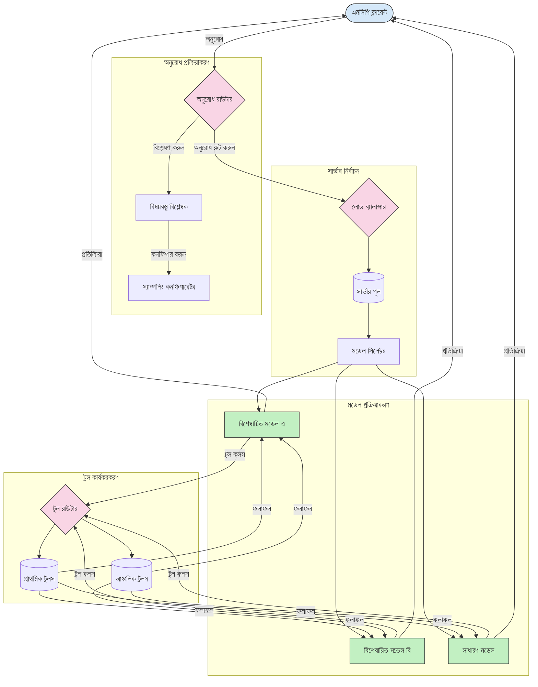

# মডেল কনটেক্সট প্রোটোকলে রাউটিং

MCP ইকোসিস্টেমের মধ্যে অনুরোধগুলোকে উপযুক্ত মডেল, টুল বা সেবায় নির্দেশ করার জন্য রাউটিং অপরিহার্য।

## পরিচিতি

মডেল কনটেক্সট প্রোটোকল (MCP)-এ রাউটিং মানে বিভিন্ন মানদণ্ড যেমন কনটেন্ট টাইপ, ব্যবহারকারীর প্রেক্ষাপট, এবং সিস্টেম লোড এর উপর ভিত্তি করে অনুরোধগুলোকে সর্বোত্তম মডেল বা সেবায় নির্দেশ করা। এটি দক্ষ প্রক্রিয়াকরণ এবং আদর্শ সম্পদ ব্যবহার নিশ্চিত করে।

## শেখার লক্ষ্যসমূহ

এই পাঠের শেষে আপনি সক্ষম হবেন:

- MCP-তে রাউটিংয়ের মূলনীতি বোঝা।
- বিশেষায়িত সেবাগুলিতে অনুরোধ নির্দেশ করার জন্য বিষয়বস্তুভিত্তিক রাউটিং প্রয়োগ করা।
- সম্পদ ব্যবহার অপ্টিমাইজ করার জন্য বুদ্ধিমান লোড ব্যালেন্সিং কৌশল প্রয়োগ করা।
- অনুরোধ প্রেক্ষাপটের উপর ভিত্তি করে গতিশীল টুল রাউটিং প্রয়োগ করা।

## বিষয়বস্তুভিত্তিক রাউটিং

বিষয়বস্তুভিত্তিক রাউটিং অনুরোধের বিষয়বস্তু অনুযায়ী বিশেষায়িত সেবাগুলিতে অনুরোধগুলোকে নির্দেশ করে। উদাহরণস্বরূপ, কোড জেনারেশনের সঙ্গে সম্পর্কিত অনুরোধগুলো একটি বিশেষায়িত কোড মডেলে পাঠানো যেতে পারে, আর সৃজনশীল লেখার অনুরোধগুলো সৃজনশীল লেখার মডেলে প্রেরণ করা যেতে পারে।

আসুন বিভিন্ন প্রোগ্রামিং ভাষায় উদাহরণ বাস্তবায়ন দেখি।

<details>
<summary>.NET</summary>

```csharp
// .NET Example: Content-based routing in MCP
public class ContentBasedRouter
{
    private readonly Dictionary<string, McpClient> _specializedClients;
    private readonly RoutingClassifier _classifier;
    
    public ContentBasedRouter()
    {
        // Initialize specialized clients for different domains
        _specializedClients = new Dictionary<string, McpClient>
        {
            ["code"] = new McpClient("https://code-specialized-mcp.com"),
            ["creative"] = new McpClient("https://creative-specialized-mcp.com"),
            ["scientific"] = new McpClient("https://scientific-specialized-mcp.com"),
            ["general"] = new McpClient("https://general-mcp.com")
        };
        
        // Initialize content classifier
        _classifier = new RoutingClassifier();
    }
    
    public async Task<McpResponse> RouteAndProcessAsync(string prompt, IDictionary<string, object> parameters = null)
    {
        // Classify the prompt to determine the best specialized service
        string category = await _classifier.ClassifyPromptAsync(prompt);
        
        // Get the appropriate client or fall back to general
        var client = _specializedClients.ContainsKey(category) 
            ? _specializedClients[category] 
            : _specializedClients["general"];
            
        Console.WriteLine($"Routing request to {category} specialized service");
        
        // Send request to the selected service
        return await client.SendPromptAsync(prompt, parameters);
    }
    
    // Simple classifier for routing decisions
    private class RoutingClassifier
    {
        public Task<string> ClassifyPromptAsync(string prompt)
        {
            prompt = prompt.ToLowerInvariant();
            
            if (prompt.Contains("code") || prompt.Contains("function") || 
                prompt.Contains("program") || prompt.Contains("algorithm"))
            {
                return Task.FromResult("code");
            }
            
            if (prompt.Contains("story") || prompt.Contains("creative") || 
                prompt.Contains("imagine") || prompt.Contains("design"))
            {
                return Task.FromResult("creative");
            }
            
            if (prompt.Contains("science") || prompt.Contains("research") || 
                prompt.Contains("analyze") || prompt.Contains("study"))
            {
                return Task.FromResult("scientific");
            }
            
            return Task.FromResult("general");
        }
    }
}
```

পূর্ববর্তী কোডে, আমরা:

- এমন একটি `ContentBasedRouter` ক্লাস তৈরি করেছি যা প্রম্পটের বিষয়বস্তু অনুসারে অনুরোধগুলো রাউট করে।
- বিভিন্ন ডোমেইনের (কোড, সৃজনশীল, বৈজ্ঞানিক, সাধারণ) জন্য বিশেষায়িত ক্লায়েন্ট ইনিশিয়ালাইজ করেছি।
- একটি সহজ শ্রেণীবিভাজক প্রয়োগ করেছি যা প্রম্পটের শ্রেণি নির্ণয় করে এবং তাকে উপযুক্ত বিশেষায়িত সেবায় রাউট করে।
- যখন কোনও বিশেষায়িত সেবা উপলব্ধ না থাকে, তখন অনুরোধগুলোকে সাধারণ সেবায় রাউট করার জন্য ফ্যালব্যাক মেকানিজম ব্যবহার করেছি।
- অনুরোধগুলো দক্ষতার সঙ্গে পরিচালনার জন্য অ্যাসিঙ্ক্রোনাস প্রসেসিং প্রয়োগ করেছি।
- বিষয়বস্তুর শ্রেণিসমূহকে বিশেষায়িত MCP ক্লায়েন্টদের সঙ্গে ম্যাপ করার জন্য একটি ডিকশনারি ব্যবহার করেছি।
- এমন একটি সহজ শ্রেণীবিভাজক ব্যবহার করেছি যা প্রম্পট বিশ্লেষণ করে এবং উপযুক্ত শ্রেণি ফেরত দেয়।
- বিশেষায়িত ক্লায়েন্ট ব্যবহার করে অনুরোধ পাঠানো এবং প্রতিউত্তর গ্রহণ করেছি।
- এমন ক্ষেত্রে যেখানে প্রম্পট কোনো বিশেষায়িত শ্রেণির সাথে মেলে না, সেখানে সাধারণ সেবায় রাউটিং করেছি।

</details>

## বুদ্ধিমান লোড ব্যালেন্সিং

লোড ব্যালেন্সিং সম্পদ ব্যবহারের দক্ষতা বাড়ায় এবং MCP সেবার উচ্চ উপলব্ধতা নিশ্চিত করে। লোড ব্যালেন্সিং বাস্তবায়নের বিভিন্ন উপায় রয়েছে, যেমন রাউন্ড-রবিন, ওয়েটেড রেসপন্স টাইম, বা বিষয়বস্তু সচেতন কৌশল।

নিচে উদাহরণে আমরা নিম্নলিখিত কৌশলগুলো ব্যবহার করেছি:

- **রাউন্ড রবিন**: উপলব্ধ সার্ভারগুলোতে অনুরোধগুলো সমানভাবে বিতরণ করে।
- **ওয়েটেড রেসপন্স টাইম**: সার্ভারগুলোর গড় সাড়া সময়ের উপর ভিত্তি করে অনুরোধগুলোকে রাউট করে।
- **বিষয়বস্তু সচেতন**: অনুরোধের বিষয়বস্তু অনুসারে বিশেষায়িত সার্ভারগুলোতে রাউট করে।

<details>
<summary>Java</summary>

```java
// জাভা উদাহরণ: MCP সার্ভারগুলির জন্য বুদ্ধিমান লোড ব্যালেন্সিং
public class McpLoadBalancer {
    private final List<McpServerNode> serverNodes;
    private final LoadBalancingStrategy strategy;
    
    public McpLoadBalancer(List<McpServerNode> nodes, LoadBalancingStrategy strategy) {
        this.serverNodes = new ArrayList<>(nodes);
        this.strategy = strategy;
    }
    
    public McpResponse processRequest(McpRequest request) {
        // কৌশলের ভিত্তিতে সেরা সার্ভার নির্বাচন করুন
        McpServerNode selectedNode = strategy.selectNode(serverNodes, request);
        
        try {
            // নির্বাচিত নোডে অনুরোধ রাউট করুন
            return selectedNode.processRequest(request);
        } catch (Exception e) {
            // ব্যর্থতা পরিচালনা করুন - পুনরায় চেষ্টা বা ফলব্যাক লজিক বাস্তবায়ন করুন
            System.err.println("Error processing request on node " + selectedNode.getId() + ": " + e.getMessage());
            
            // নোডকে সম্ভাব্য অসুস্থ হিসাবে চিহ্নিত করুন
            selectedNode.recordFailure();
            
            // ফলব্যাক হিসেবে পরবর্তী সেরা নোডটি চেষ্টা করুন
            List<McpServerNode> remainingNodes = new ArrayList<>(serverNodes);
            remainingNodes.remove(selectedNode);
            
            if (!remainingNodes.isEmpty()) {
                McpServerNode fallbackNode = strategy.selectNode(remainingNodes, request);
                return fallbackNode.processRequest(request);
            } else {
                throw new RuntimeException("All MCP server nodes failed to process the request");
            }
        }
    }
    
    // নোড স্বাস্থ্য পরীক্ষার কাজ
    public void startHealthChecks(Duration interval) {
        ScheduledExecutorService scheduler = Executors.newScheduledThreadPool(1);
        scheduler.scheduleAtFixedRate(() -> {
            for (McpServerNode node : serverNodes) {
                try {
                    boolean isHealthy = node.checkHealth();
                    System.out.println("Node " + node.getId() + " health status: " + 
                                      (isHealthy ? "HEALTHY" : "UNHEALTHY"));
                } catch (Exception e) {
                    System.err.println("Health check failed for node " + node.getId());
                    node.setHealthy(false);
                }
            }
        }, 0, interval.toMillis(), TimeUnit.MILLISECONDS);
    }
    
    // লোড ব্যালেন্সিং কৌশলগুলির জন্য ইন্টারফেস
    public interface LoadBalancingStrategy {
        McpServerNode selectNode(List<McpServerNode> nodes, McpRequest request);
    }
    
    // রাউন্ড-রবিন কৌশল
    public static class RoundRobinStrategy implements LoadBalancingStrategy {
        private AtomicInteger counter = new AtomicInteger(0);
        
        @Override
        public McpServerNode selectNode(List<McpServerNode> nodes, McpRequest request) {
            List<McpServerNode> healthyNodes = nodes.stream()
                .filter(McpServerNode::isHealthy)
                .collect(Collectors.toList());
            
            if (healthyNodes.isEmpty()) {
                throw new RuntimeException("No healthy nodes available");
            }
            
            int index = counter.getAndIncrement() % healthyNodes.size();
            return healthyNodes.get(index);
        }
    }
    
    // ওজনযুক্ত প্রতিক্রিয়া সময় কৌশল
    public static class ResponseTimeStrategy implements LoadBalancingStrategy {
        @Override
        public McpServerNode selectNode(List<McpServerNode> nodes, McpRequest request) {
            return nodes.stream()
                .filter(McpServerNode::isHealthy)
                .min(Comparator.comparing(McpServerNode::getAverageResponseTime))
                .orElseThrow(() -> new RuntimeException("No healthy nodes available"));
        }
    }
    
    // বিষয়বস্তু-সচেতন কৌশল
    public static class ContentAwareStrategy implements LoadBalancingStrategy {
        @Override
        public McpServerNode selectNode(List<McpServerNode> nodes, McpRequest request) {
            // অনুরোধের বৈশিষ্ট্য নির্ধারণ করুন
            boolean isCodeRequest = request.getPrompt().contains("code") || 
                                   request.getAllowedTools().contains("codeInterpreter");
            
            boolean isCreativeRequest = request.getPrompt().contains("creative") || 
                                       request.getPrompt().contains("story");
            
            // বিশেষায়িত নোডগুলি খুঁজুন
            Optional<McpServerNode> specializedNode = nodes.stream()
                .filter(McpServerNode::isHealthy)
                .filter(node -> {
                    if (isCodeRequest && node.getSpecialization().equals("code")) {
                        return true;
                    }
                    if (isCreativeRequest && node.getSpecialization().equals("creative")) {
                        return true;
                    }
                    return false;
                })
                .findFirst();
            
            // বিশেষায়িত নোড বা সর্বনিম্ন লোডযুক্ত নোড ফেরত দিন
            return specializedNode.orElse(
                nodes.stream()
                    .filter(McpServerNode::isHealthy)
                    .min(Comparator.comparing(McpServerNode::getCurrentLoad))
                    .orElseThrow(() -> new RuntimeException("No healthy nodes available"))
            );
        }
    }
}
```

পূর্ববর্তী কোডে, আমরা:

- একটি `McpLoadBalancer` ক্লাস তৈরি করেছি যা MCP সার্ভার নোডগুলোর তালিকা পরিচালনা করে এবং নির্বাচিত লোড ব্যালেন্সিং কৌশল অনুযায়ী অনুরোধ রাউট করে।
- বিভিন্ন লোড ব্যালেন্সিং কৌশল বাস্তবায়ন করেছি: `RoundRobinStrategy`, `ResponseTimeStrategy`, এবং `ContentAwareStrategy`।
- `ScheduledExecutorService` ব্যবহার করে নিয়মিতভাবে সার্ভার নোডগুলোর স্বাস্থ্য পরীক্ষা করেছি।
- একটি স্বাস্থ্য পরীক্ষার প্রক্রিয়া বাস্তবায়ন করেছি যা স্বাস্থ্য পরীক্ষা অনুযায়ী নোডগুলোকে স্বাস্থ্যবান বা অসুস্থ হিসেবে চিহ্নিত করে।
- অনুরোধ প্রক্রিয়াকরণে ত্রুটি-মুক্ত নিয়ন্ত্রণ এবং ফ্যালব্যাক লজিক ব্যবহার করেছি, যাতে উচ্চ উপলব্ধতা বজায় থাকে।
- একটি `McpServerNode` ক্লাস ব্যবহার করেছি যা পৃথক MCP সার্ভার নোডকে প্রতিনিধিত্ব করে, যার মধ্যে স্বাস্থ্য অবস্থা, গড় সাড়া সময়, এবং বর্তমান লোড রয়েছে।
- একটি `McpRequest` ক্লাস বাস্তবায়ন করেছি যা অনুরোধের বিস্তারিত যেমন প্রম্পট এবং অনুমোদিত টুল ক্যাপচার করে।
- স্বাস্থ্য অবস্থা এবং বিশেষায়িততার ভিত্তিতে নোড ফিল্টার ও নির্বাচন করতে Java Streams ব্যবহার করেছি।

</details>

## গতিশীল টুল রাউটিং

টুল রাউটিং নিশ্চিত করে যে টুল কলগুলি প্রেক্ষাপট অনুযায়ী সর্বোত্তম সেবায় নির্দেশিত হয়। উদাহরণস্বরূপ, একটি আবহাওয়া টুল কল ব্যবহারকারীর অবস্থানের ওপর ভিত্তি করে আঞ্চলিক এন্ডপয়েন্টে রাউট হতে পারে, অথবা একটি ক্যালকুলেটর টুল একটি নির্দিষ্ট API সংস্করণ ব্যবহার করতে হতে পারে।

চলুন এমন একটি উদাহরণ দেখি যা অনুরোধ বিশ্লেষণ, আঞ্চলিক এন্ডপয়েন্ট, এবং সংস্করণ সমর্থনের ভিত্তিতে গতিশীল টুল রাউটিং প্রদর্শন করে।

<details>
<summary>Python</summary>

```python
# পাইথন উদাহরণ: অনুরোধ বিশ্লেষণের উপর ভিত্তি করে ডাইনামিক টুল রাউটিং
class McpToolRouter:
    def __init__(self):
        # উপলব্ধ টুল এন্ডপয়েন্ট নিবন্ধন করুন
        self.tool_endpoints = {
            "weatherTool": "https://weather-service.example.com/api",
            "calculatorTool": "https://calculator-service.example.com/compute",
            "databaseTool": "https://database-service.example.com/query",
            "searchTool": "https://search-service.example.com/search"
        }
        
        # গ্লোবাল বিতরণের জন্য আঞ্চলিক এন্ডপয়েন্ট
        self.regional_endpoints = {
            "us": {
                "weatherTool": "https://us-west.weather-service.example.com/api",
                "searchTool": "https://us.search-service.example.com/search"
            },
            "europe": {
                "weatherTool": "https://eu.weather-service.example.com/api",
                "searchTool": "https://eu.search-service.example.com/search"
            },
            "asia": {
                "weatherTool": "https://asia.weather-service.example.com/api",
                "searchTool": "https://asia.search-service.example.com/search"
            }
        }
        
        # টুল ভার্সনিং সমর্থন
        self.tool_versions = {
            "weatherTool": {
                "default": "v2",
                "v1": "https://weather-service.example.com/api/v1",
                "v2": "https://weather-service.example.com/api/v2",
                "beta": "https://weather-service.example.com/api/beta"
            }
        }
    
    async def route_tool_request(self, tool_name, parameters, user_context=None):
        """Route a tool request to the appropriate endpoint based on context"""
        endpoint = self._select_endpoint(tool_name, parameters, user_context)
        
        if not endpoint:
            raise ValueError(f"No endpoint available for tool: {tool_name}")
        
        # নির্বাচিত এন্ডপয়েন্টে আসল অনুরোধ সম্পাদন করুন
        return await self._execute_tool_request(endpoint, tool_name, parameters)
    
    def _select_endpoint(self, tool_name, parameters, user_context=None):
        """Select the most appropriate endpoint based on context"""
        # রেজিস্ট্রি থেকে বেস এন্ডপয়েন্ট
        if tool_name not in self.tool_endpoints:
            return None
            
        base_endpoint = self.tool_endpoints[tool_name]
        
        # নির্দিষ্ট টুল ভার্সন ব্যবহার করার প্রয়োজন আছে কিনা পরীক্ষা করুন
        if tool_name in self.tool_versions:
            version_info = self.tool_versions[tool_name]
            
            # নির্দিষ্ট ভার্সন বা ডিফল্ট ব্যবহার করুন
            requested_version = parameters.get("_version", version_info["default"])
            if requested_version in version_info:
                base_endpoint = version_info[requested_version]
        
        # ব্যবহারকারীর অঞ্চল জানা থাকলে আঞ্চলিক রাউটিং পরীক্ষা করুন
        if user_context and "region" in user_context:
            user_region = user_context["region"]
            
            if user_region in self.regional_endpoints:
                regional_tools = self.regional_endpoints[user_region]
                
                if tool_name in regional_tools:
                    # অঞ্চল-নির্দিষ্ট এন্ডপয়েন্ট ব্যবহার করুন
                    return regional_tools[tool_name]
        
        # ডেটা আবাসন প্রয়োজনীয়তা পরীক্ষা করুন
        if user_context and "data_residency" in user_context:
            # এটি লজিক বাস্তবায়ন করবে যাতে ডেটা নির্দিষ্ট বিচারব্যবস্থায় থাকে নিশ্চিত করা যায়
            pass
        
        # ল্যাটেন্সি-ভিত্তিক রাউটিং পরীক্ষা করুন
        if user_context and "latency_sensitive" in user_context and user_context["latency_sensitive"]:
            # এটি সর্বনিম্ন ল্যাটেন্সি এন্ডপয়েন্ট নির্বাচন করার লজিক বাস্তবায়ন করবে
            pass
            
        return base_endpoint
        
    async def _execute_tool_request(self, endpoint, tool_name, parameters):
        """Execute the actual tool request to the selected endpoint"""
        try:
            async with aiohttp.ClientSession() as session:
                async with session.post(
                    endpoint,
                    json={"toolName": tool_name, "parameters": parameters},
                    headers={"Content-Type": "application/json"}
                ) as response:
                    if response.status == 200:
                        result = await response.json()
                        return result
                    else:
                        error_text = await response.text()
                        raise Exception(f"Tool execution failed: {error_text}")
        except Exception as e:
            # রিট্রাই লজিক বা ব্যাকআপ কৌশল বাস্তবায়ন করুন
            print(f"Error executing tool {tool_name} at {endpoint}: {str(e)}")
            raise
```

পূর্ববর্তী কোডে, আমরা:

- একটি `McpToolRouter` ক্লাস তৈরি করেছি যা অনুরোধ বিশ্লেষণ, আঞ্চলিক এন্ডপয়েন্ট এবং সংস্করণ সমর্থন ভিত্তিতে টুল রাউটিং পরিচালনা করে।
- গ্লোবাল বিতরণের জন্য উপলব্ধ টুল এন্ডপয়েন্ট এবং আঞ্চলিক এন্ডপয়েন্ট নিবন্ধন করেছি।
- ব্যবহারকারীর প্রেক্ষাপট যেমন অঞ্চল এবং ডেটা রেসিডেন্সির চাহিদার উপর ভিত্তি করে উপযুক্ত এন্ডপয়েন্ট নির্বাচন করার গতিশীল রাউটিং লজিক প্রয়োগ করেছি।
- টুলের সংস্করণ সমর্থন বাস্তবায়ন করেছি, যা ব্যবহারকারীদের নির্দিষ্ট টুলের কোন সংস্করণ ব্যবহার করতে চান তা উল্লেখ করতে দেয়।
- টুল কল কার্যকর করতে এবং প্রতিউত্তর পরিচালনা করতে অ্যাসিঙ্ক্রোনাস HTTP অনুরোধ ব্যবহার করেছি।

</details>

## MCP-তে স্যাম্পলিং ও রাউটিং আর্কিটেকচার

স্যাম্পলিং মডেল কনটেক্সট প্রোটোকলের (MCP) একটি গুরুত্বপূর্ণ উপাদান যা দক্ষ অনুরোধ প্রক্রিয়াকরণ এবং রাউটিং সম্ভব করে। এটি আসা অনুরোধগুলো বিশ্লেষণ করে তাদের পরিচালনার জন্য সর্বোত্তম মডেল বা সেবা নির্ধারণ করে, বিভিন্ন মানদণ্ড যেমন বিষয়বস্তু টাইপ, ব্যবহারকারীর প্রেক্ষাপট, এবং সিস্টেম লোডের ভিত্তিতে।

স্যাম্পলিং এবং রাউটিং একত্রে একটি মোটা আর্কিটেকচার তৈরি করে যা সম্পদ ব্যবহারে সর্বোচ্চ কার্যকারিতা ও উচ্চ উপলব্ধতা নিশ্চিত করে। স্যাম্পলিং প্রক্রিয়াটি অনুরোধ শ্রেণীবদ্ধ করতে ব্যবহৃত হয়, আর রাউটিং সেই অনুসারে অনুরোধগুলোকে উপযুক্ত মডেল বা সেবায় নির্দেশ করে।

নিচের চিত্রটি দেখায় কিভাবে স্যাম্পলিং ও রাউটিং একত্রে একটি ব্যাপক MCP আর্কিটেকচারে কাজ করে:



## পরবর্তী কি

- [5.6 স্যাম্পলিং](../mcp-sampling/README.md)

---

<!-- CO-OP TRANSLATOR DISCLAIMER START -->
**অস্বীকৃতি**:
এই নথিটি AI অনুবাদ পরিষেবা [Co-op Translator](https://github.com/Azure/co-op-translator) ব্যবহার করে অনূদিত হয়েছে। যদিও আমরা শুদ্ধতার জন্য চেষ্টা করি, অনুগ্রহ করে মনে রাখবেন যে স্বয়ংক্রিয় অনুবাদে ত্রুটি বা অসঙ্গতি থাকতে পারে। মূল নথিটি তার স্বভাষায় কর্তৃত্বপূর্ণ উৎস হিসেবে বিবেচিত হওয়া উচিত। গুরুত্বপূর্ণ তথ্যের জন্য পেশাদার মানব অনুবাদ সুপারিশ করা হয়। এই অনুবাদের ব্যবহারে প্রয়োজনীয় ভুল বোঝাবুঝি বা ভুল ব্যাখ্যার জন্য আমরা দায়বদ্ধ নই।
<!-- CO-OP TRANSLATOR DISCLAIMER END -->