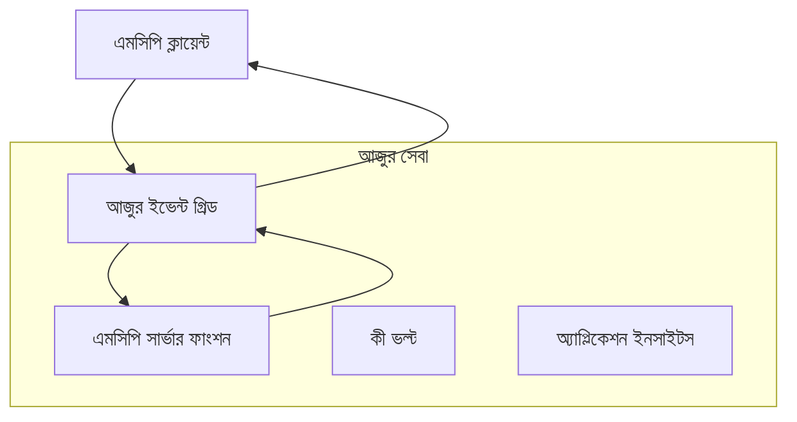
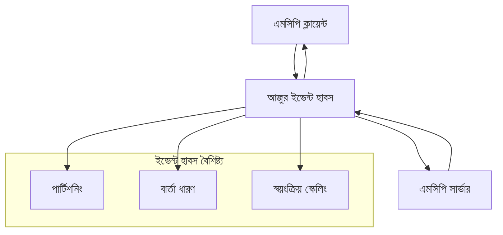

# MCP কাস্টম ট্রান্সপোর্ট - উন্নত বাস্তবায়ন গাইড

মডেল কনটেক্সট প্রোটোকল (MCP) ট্রান্সপোর্ট যন্ত্রগুলিতে নমনীয়তা প্রদান করে, বিশেষায়িত এন্টারপ্রাইজ পরিবেশের জন্য কাস্টম বাস্তবায়নগুলি অনুমোদন করে। এই উন্নত গাইডটি Azure Event Grid এবং Azure Event Hubs ব্যবহার করে কাস্টম ট্রান্সপোর্ট বাস্তবায়নের উদাহরণ হিসেবে আলোচনা করে, স্কেলেবল, ক্লাউড-নেটিভ MCP সমাধান তৈরি করার জন্য।

> **আগামী দিকের জন্য:** এই গাইডটি **MCP স্পেসিফিকেশন 2025-11-25** অনুযায়ী লেখা, যেখানে প্রতিটি সেশনে সেশন অর্ডারিং বজায় রাখা আবশ্যক (নীচের মেসেজ প্রোটোকল দেখুন)। `2026-07-28` রিলিজ ক্যান্ডিডেট প্রোটোকল-স্তরের সেশন সম্পূর্ণরূপে সরিয়ে দেয় এবং `Mcp-Method`/`Mcp-Name` হেডার প্রয়োজন করে যাতে গেটওয়ে এবং কাস্টম ট্রান্সপোর্টগুলো প্রতি-রিকোয়েস্ট ভিত্তিক রাউট করতে পারে সেশন ভিত্তিক নয়। দেখুন [MCP-তে কী পরিবর্তন হচ্ছে: 2026-07-28 রিলিজ ক্যান্ডিডেট](../../01-CoreConcepts/mcp-2026-07-28-release-candidate.md)।

## পরিচিতি

MCP এর স্ট্যান্ডার্ড ট্রান্সপোর্ট (stdio এবং HTTP স্ট্রিমিং) বেশিরভাগ ব্যবহারের জন্য উপযোগী হলেও, এন্টারপ্রাইজ পরিবেশে উন্নত স্কেলেবিলিটি, নির্ভরযোগ্যতা এবং বিদ্যমান ক্লাউড ইনফ্রাস্ট্রাকচারের সাথে একত্রীকরণের জন্য বিশেষায়িত ট্রান্সপোর্ট যন্ত্রের প্রয়োজন হয়। কাস্টম ট্রান্সপোর্ট MCP কে ক্লাউড-নেটিভ মেসেজিং সার্ভিস ব্যবহার করে অ্যাসিঙ্ক্রোনাস যোগাযোগ, ইভেন্ট-চালিত আর্কিটেকচার এবং বিতরণকৃত প্রসেসিং সক্ষম করতে দেয়।

এই পাঠে সর্বশেষ MCP স্পেসিফিকেশন (2025-11-25), Azure মেসেজিং সার্ভিস এবং প্রতিষ্ঠিত এন্টারপ্রাইজ ইন্টিগ্রেশন প্যাটার্নের ওপর ভিত্তি করে উন্নত ট্রান্সপোর্ট বাস্তবায়নগুলি আলোচনা করা হয়েছে।

### **MCP ট্রান্সপোর্ট আর্কিটেকচার**

**MCP স্পেসিফিকেশন (2025-11-25) থেকে:**

- **স্ট্যান্ডার্ড ট্রান্সপোর্ট**: stdio (প্রস্তাবিত), HTTP স্ট্রিমিং (রিমোট পরিস্থিতির জন্য)
- **কাস্টম ট্রান্সপোর্ট**: MCP মেসেজ এক্সচেঞ্জ প্রোটোকল বাস্তবায়ন করে এমন যে কোনও ট্রান্সপোর্ট
- **মেসেজ ফরম্যাট**: MCP-নির্দিষ্ট এক্সটেনশনের সাথে JSON-RPC 2.0
- **দ্বিপাক্ষিক যোগাযোগ**: নোটিফিকেশন এবং প্রতিক্রিয়ার জন্য ফুল ডুপ্লেক্স যোগাযোগ প্রয়োজন

## শেখার উদ্দেশ্য

এই উন্নত পাঠের শেষে, আপনি সক্ষম হবেন:

- **কাস্টম ট্রান্সপোর্টের প্রয়োজনীয়তা বোঝা**: MCP প্রোটোকল যে কোনও ট্রান্সপোর্ট স্তরের উপরে বাস্তবায়িত করতে সক্ষম হওয়া স্মরণে রাখা
- **Azure Event Grid ট্রান্সপোর্ট তৈরি করা**: সার্ভারবিহীন স্কেলেবিলিটির জন্য Azure Event Grid ব্যবহার করে ইভেন্ট-চালিত MCP সার্ভার তৈরি করা
- **Azure Event Hubs ট্রান্সপোর্ট বাস্তবায়ন করা**: উচ্চ-থ্রুপুট MCP সমাধান ডিজাইন করা Azure Event Hubs ব্যবহার করে রিয়েল-টাইম স্ট্রিমিংয়ের জন্য
- **এন্টারপ্রাইজ প্যাটার্ন প্রয়োগ**: বিদ্যমান Azure অবকাঠামো এবং সিকিউরিটি মডেলের সাথে কাস্টম ট্রান্সপোর্টগুলোকে একীভূত করা
- **ট্রান্সপোর্ট নির্ভরযোগ্যতা পরিচালনা**: এন্টারপ্রাইজ পরিস্থিতির জন্য মেসেজ টেকসইতা, অর্ডারিং এবং ত্রুটিপূর্ণ হ্যান্ডলিং বাস্তবায়ন করা
- **পারফরম্যান্স অপ্টিমাইজেশন**: স্কেল, লেটেন্সি এবং থ্রুপুটের প্রয়োজনীয়তার জন্য ট্রান্সপোর্ট সমাধান ডিজাইন করা

## **ট্রান্সপোর্ট প্রয়োজনীয়তা**

### **MCP স্পেসিফিকেশন থেকে মূল প্রয়োজনীয়তা (2025-11-25):**

```yaml
Message Protocol:
  format: "JSON-RPC 2.0 with MCP extensions"
  bidirectional: "Full duplex communication required"
  ordering: "Message ordering must be preserved per session"
  
Transport Layer:
  reliability: "Transport MUST handle connection failures gracefully"
  security: "Transport MUST support secure communication"
  identification: "Each session MUST have unique identifier"
  
Custom Transport:
  compliance: "MUST implement complete MCP message exchange"
  extensibility: "MAY add transport-specific features"
  interoperability: "MUST maintain protocol compatibility"
```

## **Azure Event Grid ট্রান্সপোর্ট বাস্তবায়ন**

Azure Event Grid একটি সার্ভারবিহীন ইভেন্ট রাউটিং সার্ভিস প্রদান করে, যা ইভেন্ট-চালিত MCP আর্কিটেকচারের জন্য আদর্শ। এই বাস্তবায়নটি স্কেলেবল, আলগা-কপল্ড MCP সিস্টেম তৈরি করার প্রক্রিয়া প্রদর্শন করে।

### **আর্কিটেকচার ওভারভিউ**



### **C# বাস্তবায়ন - ইভেন্ট গ্রিড ট্রান্সপোর্ট**

```csharp
using Azure.Messaging.EventGrid;
using Microsoft.Extensions.Azure;
using System.Text.Json;

public class EventGridMcpTransport : IMcpTransport
{
    private readonly EventGridPublisherClient _publisher;
    private readonly string _topicEndpoint;
    private readonly string _clientId;
    
    public EventGridMcpTransport(string topicEndpoint, string accessKey, string clientId)
    {
        _publisher = new EventGridPublisherClient(
            new Uri(topicEndpoint), 
            new AzureKeyCredential(accessKey));
        _topicEndpoint = topicEndpoint;
        _clientId = clientId;
    }
    
    public async Task SendMessageAsync(McpMessage message)
    {
        var eventGridEvent = new EventGridEvent(
            subject: $"mcp/{_clientId}",
            eventType: "MCP.MessageReceived",
            dataVersion: "1.0",
            data: JsonSerializer.Serialize(message))
        {
            Id = Guid.NewGuid().ToString(),
            EventTime = DateTimeOffset.UtcNow
        };
        
        await _publisher.SendEventAsync(eventGridEvent);
    }
    
    public async Task<McpMessage> ReceiveMessageAsync(CancellationToken cancellationToken)
    {
        // Event Grid is push-based, so implement webhook receiver
        // This would typically be handled by Azure Functions trigger
        throw new NotImplementedException("Use EventGridTrigger in Azure Functions");
    }
}

// Azure Function for receiving Event Grid events
[FunctionName("McpEventGridReceiver")]
public async Task<IActionResult> HandleEventGridMessage(
    [EventGridTrigger] EventGridEvent eventGridEvent,
    ILogger log)
{
    try
    {
        var mcpMessage = JsonSerializer.Deserialize<McpMessage>(
            eventGridEvent.Data.ToString());
        
        // Process MCP message
        var response = await _mcpServer.ProcessMessageAsync(mcpMessage);
        
        // Send response back via Event Grid
        await _transport.SendMessageAsync(response);
        
        return new OkResult();
    }
    catch (Exception ex)
    {
        log.LogError(ex, "Error processing Event Grid MCP message");
        return new BadRequestResult();
    }
}
```

### **TypeScript বাস্তবায়ন - ইভেন্ট গ্রিড ট্রান্সপোর্ট**

```typescript
import { EventGridPublisherClient, AzureKeyCredential } from "@azure/eventgrid";
import { McpTransport, McpMessage } from "./mcp-types";

export class EventGridMcpTransport implements McpTransport {
    private publisher: EventGridPublisherClient;
    private clientId: string;
    
    constructor(
        private topicEndpoint: string,
        private accessKey: string,
        clientId: string
    ) {
        this.publisher = new EventGridPublisherClient(
            topicEndpoint,
            new AzureKeyCredential(accessKey)
        );
        this.clientId = clientId;
    }
    
    async sendMessage(message: McpMessage): Promise<void> {
        const event = {
            id: crypto.randomUUID(),
            source: `mcp-client-${this.clientId}`,
            type: "MCP.MessageReceived",
            time: new Date(),
            data: message
        };
        
        await this.publisher.sendEvents([event]);
    }
    
    // ইভেন্ট-চালিত গ্রহণ Azure Functions এর মাধ্যমে
    onMessage(handler: (message: McpMessage) => Promise<void>): void {
        // বাস্তবায়ন Azure Functions Event Grid ট্রিগার ব্যবহার করবে
        // এটি webhook রিসিভারের জন্য একটি ধারণাগত ইন্টারফেস
    }
}

// Azure Functions বাস্তবায়ন
import { app, InvocationContext, EventGridEvent } from "@azure/functions";

app.eventGrid("mcpEventGridHandler", {
    handler: async (event: EventGridEvent, context: InvocationContext) => {
        try {
            const mcpMessage = event.data as McpMessage;
            
            // MCP বার্তা প্রসেস করুন
            const response = await mcpServer.processMessage(mcpMessage);
            
            // Event Grid এর মাধ্যমে প্রতিক্রিয়া পাঠান
            await transport.sendMessage(response);
            
        } catch (error) {
            context.error("Error processing MCP message:", error);
            throw error;
        }
    }
});
```

### **Python বাস্তবায়ন - ইভেন্ট গ্রিড ট্রান্সপোর্ট**

```python
from azure.eventgrid import EventGridPublisherClient, EventGridEvent
from azure.core.credentials import AzureKeyCredential
import asyncio
import json
from typing import Callable, Optional
import uuid
from datetime import datetime

class EventGridMcpTransport:
    def __init__(self, topic_endpoint: str, access_key: str, client_id: str):
        self.client = EventGridPublisherClient(
            topic_endpoint, 
            AzureKeyCredential(access_key)
        )
        self.client_id = client_id
        self.message_handler: Optional[Callable] = None
    
    async def send_message(self, message: dict) -> None:
        """Send MCP message via Event Grid"""
        event = EventGridEvent(
            data=message,
            subject=f"mcp/{self.client_id}",
            event_type="MCP.MessageReceived",
            data_version="1.0"
        )
        
        await self.client.send(event)
    
    def on_message(self, handler: Callable[[dict], None]) -> None:
        """Register message handler for incoming events"""
        self.message_handler = handler

# অ্যাজুর ফাংশনস বাস্তবায়ন
import azure.functions as func
import logging

def main(event: func.EventGridEvent) -> None:
    """Azure Functions Event Grid trigger for MCP messages"""
    try:
        # ইভেন্ট গ্রিড ইভেন্ট থেকে এমসিপি বার্তা বিশ্লেষণ করুন
        mcp_message = json.loads(event.get_body().decode('utf-8'))
        
        # এমসিপি বার্তা প্রক্রিয়া করুন
        response = process_mcp_message(mcp_message)
        
        # ইভেন্ট গ্রিড মারফৎ প্রতিক্রিয়া পাঠান
        # (বাস্তবায়ন নতুন ইভেন্ট গ্রিড ক্লায়েন্ট তৈরি করবে)
        
    except Exception as e:
        logging.error(f"Error processing MCP Event Grid message: {e}")
        raise
```

## **Azure Event Hubs ট্রান্সপোর্ট বাস্তবায়ন**

Azure Event Hubs MCP পরিস্থিতির জন্য উচ্চ-থ্রুপুট, রিয়েল-টাইম স্ট্রিমিং ক্ষমতা প্রদান করে যা নিম্ন লেটেন্সি এবং উচ্চ মেসেজ ভলিউম প্রয়োজন।

### **আর্কিটেকচার ওভারভিউ**



### **C# বাস্তবায়ন - ইভেন্ট হাবস ট্রান্সপোর্ট**

```csharp
using Azure.Messaging.EventHubs;
using Azure.Messaging.EventHubs.Producer;
using Azure.Messaging.EventHubs.Consumer;
using System.Text;

public class EventHubsMcpTransport : IMcpTransport, IDisposable
{
    private readonly EventHubProducerClient _producer;
    private readonly EventHubConsumerClient _consumer;
    private readonly string _consumerGroup;
    private readonly CancellationTokenSource _cancellationTokenSource;
    
    public EventHubsMcpTransport(
        string connectionString, 
        string eventHubName,
        string consumerGroup = "$Default")
    {
        _producer = new EventHubProducerClient(connectionString, eventHubName);
        _consumer = new EventHubConsumerClient(
            consumerGroup, 
            connectionString, 
            eventHubName);
        _consumerGroup = consumerGroup;
        _cancellationTokenSource = new CancellationTokenSource();
    }
    
    public async Task SendMessageAsync(McpMessage message)
    {
        var messageBody = JsonSerializer.Serialize(message);
        var eventData = new EventData(Encoding.UTF8.GetBytes(messageBody));
        
        // Add MCP-specific properties
        eventData.Properties.Add("MessageType", message.Method ?? "response");
        eventData.Properties.Add("MessageId", message.Id);
        eventData.Properties.Add("Timestamp", DateTimeOffset.UtcNow);
        
        await _producer.SendAsync(new[] { eventData });
    }
    
    public async Task StartReceivingAsync(
        Func<McpMessage, Task> messageHandler)
    {
        await foreach (PartitionEvent partitionEvent in _consumer.ReadEventsAsync(
            _cancellationTokenSource.Token))
        {
            try
            {
                var messageBody = Encoding.UTF8.GetString(
                    partitionEvent.Data.EventBody.ToArray());
                var mcpMessage = JsonSerializer.Deserialize<McpMessage>(messageBody);
                
                await messageHandler(mcpMessage);
            }
            catch (Exception ex)
            {
                // Handle deserialization or processing errors
                Console.WriteLine($"Error processing message: {ex.Message}");
            }
        }
    }
    
    public void Dispose()
    {
        _cancellationTokenSource?.Cancel();
        _producer?.DisposeAsync().AsTask().Wait();
        _consumer?.DisposeAsync().AsTask().Wait();
        _cancellationTokenSource?.Dispose();
    }
}
```

### **TypeScript বাস্তবায়ন - ইভেন্ট হাবস ট্রান্সপোর্ট**

```typescript
import { 
    EventHubProducerClient, 
    EventHubConsumerClient, 
    EventData 
} from "@azure/event-hubs";

export class EventHubsMcpTransport implements McpTransport {
    private producer: EventHubProducerClient;
    private consumer: EventHubConsumerClient;
    private isReceiving = false;
    
    constructor(
        private connectionString: string,
        private eventHubName: string,
        private consumerGroup: string = "$Default"
    ) {
        this.producer = new EventHubProducerClient(
            connectionString, 
            eventHubName
        );
        this.consumer = new EventHubConsumerClient(
            consumerGroup,
            connectionString,
            eventHubName
        );
    }
    
    async sendMessage(message: McpMessage): Promise<void> {
        const eventData: EventData = {
            body: JSON.stringify(message),
            properties: {
                messageType: message.method || "response",
                messageId: message.id,
                timestamp: new Date().toISOString()
            }
        };
        
        await this.producer.sendBatch([eventData]);
    }
    
    async startReceiving(
        messageHandler: (message: McpMessage) => Promise<void>
    ): Promise<void> {
        if (this.isReceiving) return;
        
        this.isReceiving = true;
        
        const subscription = this.consumer.subscribe({
            processEvents: async (events, context) => {
                for (const event of events) {
                    try {
                        const messageBody = event.body as string;
                        const mcpMessage: McpMessage = JSON.parse(messageBody);
                        
                        await messageHandler(mcpMessage);
                        
                        // কমপক্ষে একবার ডেলিভারির জন্য চেকপয়েন্ট আপডেট করুন
                        await context.updateCheckpoint(event);
                    } catch (error) {
                        console.error("Error processing Event Hubs message:", error);
                    }
                }
            },
            processError: async (err, context) => {
                console.error("Event Hubs error:", err);
            }
        });
    }
    
    async close(): Promise<void> {
        this.isReceiving = false;
        await this.producer.close();
        await this.consumer.close();
    }
}
```

### **Python বাস্তবায়ন - ইভেন্ট হাবস ট্রান্সপোর্ট**

```python
from azure.eventhub import EventHubProducerClient, EventHubConsumerClient
from azure.eventhub import EventData
import json
import asyncio
from typing import Callable, Dict, Any
import logging

class EventHubsMcpTransport:
    def __init__(
        self, 
        connection_string: str, 
        eventhub_name: str,
        consumer_group: str = "$Default"
    ):
        self.producer = EventHubProducerClient.from_connection_string(
            connection_string, 
            eventhub_name=eventhub_name
        )
        self.consumer = EventHubConsumerClient.from_connection_string(
            connection_string,
            consumer_group=consumer_group,
            eventhub_name=eventhub_name
        )
        self.is_receiving = False
    
    async def send_message(self, message: Dict[str, Any]) -> None:
        """Send MCP message via Event Hubs"""
        event_data = EventData(json.dumps(message))
        
        # MCP-নির্দিষ্ট বৈশিষ্ট্য যোগ করুন
        event_data.properties = {
            "messageType": message.get("method", "response"),
            "messageId": message.get("id"),
            "timestamp": "2025-01-14T10:30:00Z"  # প্রকৃত টাইমস্ট্যাম্প ব্যবহার করুন
        }
        
        async with self.producer:
            event_data_batch = await self.producer.create_batch()
            event_data_batch.add(event_data)
            await self.producer.send_batch(event_data_batch)
    
    async def start_receiving(
        self, 
        message_handler: Callable[[Dict[str, Any]], None]
    ) -> None:
        """Start receiving MCP messages from Event Hubs"""
        if self.is_receiving:
            return
        
        self.is_receiving = True
        
        async with self.consumer:
            await self.consumer.receive(
                on_event=self._on_event_received(message_handler),
                starting_position="-1"  # শুরু থেকে শুরু করুন
            )
    
    def _on_event_received(self, handler: Callable):
        """Internal event handler wrapper"""
        async def handle_event(partition_context, event):
            try:
                # ইভেন্ট হাবস ইভেন্ট থেকে MCP বার্তা পার্স করুন
                message_body = event.body_as_str(encoding='UTF-8')
                mcp_message = json.loads(message_body)
                
                # MCP বার্তা প্রক্রিয়া করুন
                await handler(mcp_message)
                
                # কমপক্ষে একবার ডেলিভারির জন্য চেকপয়েন্ট আপডেট করুন
                await partition_context.update_checkpoint(event)
                
            except Exception as e:
                logging.error(f"Error processing Event Hubs message: {e}")
        
        return handle_event
    
    async def close(self) -> None:
        """Clean up transport resources"""
        self.is_receiving = False
        await self.producer.close()
        await self.consumer.close()
```

## **উন্নত ট্রান্সপোর্ট প্যাটার্ন**

### **মেসেজ টেকসইতা এবং নির্ভরযোগ্যতা**

```csharp
// Implementing message durability with retry logic
public class ReliableTransportWrapper : IMcpTransport
{
    private readonly IMcpTransport _innerTransport;
    private readonly RetryPolicy _retryPolicy;
    
    public async Task SendMessageAsync(McpMessage message)
    {
        await _retryPolicy.ExecuteAsync(async () =>
        {
            try
            {
                await _innerTransport.SendMessageAsync(message);
            }
            catch (TransportException ex) when (ex.IsRetryable)
            {
                // Log and retry
                throw;
            }
        });
    }
}
```

### **ট্রান্সপোর্ট সিকিউরিটি ইন্টিগ্রেশন**

```csharp
// Integrating Azure Key Vault for transport security
public class SecureTransportFactory
{
    private readonly SecretClient _keyVaultClient;
    
    public async Task<IMcpTransport> CreateEventGridTransportAsync()
    {
        var accessKey = await _keyVaultClient.GetSecretAsync("EventGridAccessKey");
        var topicEndpoint = await _keyVaultClient.GetSecretAsync("EventGridTopic");
        
        return new EventGridMcpTransport(
            topicEndpoint.Value.Value,
            accessKey.Value.Value,
            Environment.MachineName
        );
    }
}
```

### **ট্রান্সপোর্ট পর্যবেক্ষণ এবং পর্যবেক্ষণযোগ্যতা**

```csharp
// Adding telemetry to custom transports
public class ObservableTransport : IMcpTransport
{
    private readonly IMcpTransport _transport;
    private readonly ILogger _logger;
    private readonly TelemetryClient _telemetryClient;
    
    public async Task SendMessageAsync(McpMessage message)
    {
        using var activity = Activity.StartActivity("MCP.Transport.Send");
        activity?.SetTag("transport.type", "EventGrid");
        activity?.SetTag("message.method", message.Method);
        
        var stopwatch = Stopwatch.StartNew();
        
        try
        {
            await _transport.SendMessageAsync(message);
            
            _telemetryClient.TrackDependency(
                "EventGrid",
                "SendMessage",
                DateTime.UtcNow.Subtract(stopwatch.Elapsed),
                stopwatch.Elapsed,
                true
            );
        }
        catch (Exception ex)
        {
            _telemetryClient.TrackException(ex);
            throw;
        }
    }
}
```

## **এন্টারপ্রাইজ ইন্টিগ্রেশন পরিস্থিতি**

### **পরিস্থিতি ১: বিভাজিত MCP প্রসেসিং**

Azure Event Grid ব্যবহার করে একাধিক প্রসেসিং নোড জুড়ে MCP রিকোয়েস্ট বিতরণ:

```yaml
Architecture:
  - MCP Client sends requests to Event Grid topic
  - Multiple Azure Functions subscribe to process different tool types
  - Results aggregated and returned via separate response topic
  
Benefits:
  - Horizontal scaling based on message volume
  - Fault tolerance through redundant processors
  - Cost optimization with serverless compute
```

### **পরিস্থিতি ২: রিয়েল-টাইম MCP স্ট্রিমিং**

Azure Event Hubs ব্যবহার করে উচ্চ-ফ্রিকোয়েন্সি MCP ইন্টারঅ্যাকশন:

```yaml
Architecture:
  - MCP Client streams continuous requests via Event Hubs
  - Stream Analytics processes and routes messages
  - Multiple consumers handle different aspect of processing
  
Benefits:
  - Low latency for real-time scenarios
  - High throughput for batch processing
  - Built-in partitioning for parallel processing
```

### **পরিস্থিতি ৩: হাইব্রিড ট্রান্সপোর্ট আর্কিটেকচার**

বিভিন্ন ব্যবহারের জন্য একাধিক ট্রান্সপোর্ট সংযোগ:

```csharp
public class HybridMcpTransport : IMcpTransport
{
    private readonly IMcpTransport _realtimeTransport; // Event Hubs
    private readonly IMcpTransport _batchTransport;    // Event Grid
    private readonly IMcpTransport _fallbackTransport; // HTTP Streaming
    
    public async Task SendMessageAsync(McpMessage message)
    {
        // Route based on message characteristics
        var transport = message.Method switch
        {
            "tools/call" when IsRealtime(message) => _realtimeTransport,
            "resources/read" when IsBatch(message) => _batchTransport,
            _ => _fallbackTransport
        };
        
        await transport.SendMessageAsync(message);
    }
}
```

## **পারফরম্যান্স অপ্টিমাইজেশন**

### **ইভেন্ট গ্রিডের জন্য মেসেজ ব্যাচিং**

```csharp
public class BatchingEventGridTransport : IMcpTransport
{
    private readonly List<McpMessage> _messageBuffer = new();
    private readonly Timer _flushTimer;
    private const int MaxBatchSize = 100;
    
    public async Task SendMessageAsync(McpMessage message)
    {
        lock (_messageBuffer)
        {
            _messageBuffer.Add(message);
            
            if (_messageBuffer.Count >= MaxBatchSize)
            {
                _ = Task.Run(FlushMessages);
            }
        }
    }
    
    private async Task FlushMessages()
    {
        List<McpMessage> toSend;
        lock (_messageBuffer)
        {
            toSend = new List<McpMessage>(_messageBuffer);
            _messageBuffer.Clear();
        }
        
        if (toSend.Any())
        {
            var events = toSend.Select(CreateEventGridEvent);
            await _publisher.SendEventsAsync(events);
        }
    }
}
```

### **ইভেন্ট হাবসের জন্য পার্টিশনিং কৌশল**

```csharp
public class PartitionedEventHubsTransport : IMcpTransport
{
    public async Task SendMessageAsync(McpMessage message)
    {
        // Partition by client ID for session affinity
        var partitionKey = ExtractClientId(message);
        
        var eventData = new EventData(JsonSerializer.SerializeToUtf8Bytes(message))
        {
            PartitionKey = partitionKey
        };
        
        await _producer.SendAsync(new[] { eventData });
    }
}
```

## **কাস্টম ট্রান্সপোর্ট পরীক্ষা**

### **টেস্ট ডাবলস দিয়ে ইউনিট টেস্টিং**

```csharp
[Test]
public async Task EventGridTransport_SendMessage_PublishesCorrectEvent()
{
    // Arrange
    var mockPublisher = new Mock<EventGridPublisherClient>();
    var transport = new EventGridMcpTransport(mockPublisher.Object);
    var message = new McpMessage { Method = "tools/list", Id = "test-123" };
    
    // Act
    await transport.SendMessageAsync(message);
    
    // Assert
    mockPublisher.Verify(
        x => x.SendEventAsync(
            It.Is<EventGridEvent>(e => 
                e.EventType == "MCP.MessageReceived" &&
                e.Subject == "mcp/test-client"
            )
        ),
        Times.Once
    );
}
```

### **Azure টেস্ট কন্টেইনারসহ ইন্টিগ্রেশন টেস্টিং**

```csharp
[Test]
public async Task EventHubsTransport_IntegrationTest()
{
    // Using Testcontainers for integration testing
    var eventHubsContainer = new EventHubsContainer()
        .WithEventHub("test-hub");
    
    await eventHubsContainer.StartAsync();
    
    var transport = new EventHubsMcpTransport(
        eventHubsContainer.GetConnectionString(),
        "test-hub"
    );
    
    // Test message round-trip
    var sentMessage = new McpMessage { Method = "test", Id = "123" };
    McpMessage receivedMessage = null;
    
    await transport.StartReceivingAsync(msg => {
        receivedMessage = msg;
        return Task.CompletedTask;
    });
    
    await transport.SendMessageAsync(sentMessage);
    await Task.Delay(1000); // Allow for message processing
    
    Assert.That(receivedMessage?.Id, Is.EqualTo("123"));
}
```

## **সেরা অনুশীলন এবং নির্দেশিকা**

### **ট্রান্সপোর্ট ডিজাইন নীতিমালা**

1. **ইডেম্পোটেন্ট হওয়া**: মেসেজ প্রক্রিয়াজাতকরণ ইডেম্পোটেন্ট নিশ্চিত করুন যেন ডুপ্লিকেট পরিচালনা করা যায়
2. **ত্রুটি পরিচালনা**: ব্যাপক ত্রুটি হ্যান্ডলিং এবং ডেড লেটার কুইউ বাস্তবায়ন করুন
3. **পর্যবেক্ষণ**: বিশদ টেলিমেট্রি এবং স্বাস্থ্য পরীক্ষাগুলি যুক্ত করুন
4. **সিকিউরিটি**: ব্যবস্থাপিত পরিচয় এবং সর্বনিম্ন প্রিভিলেজ অ্যাক্সেস ব্যবহার করুন
5. **পারফরম্যান্স**: আপনার নির্দিষ্ট লেটেন্সি এবং থ্রুপুট প্রয়োজনীয়তার জন্য ডিজাইন করুন

### **Azure-নির্দিষ্ট সুপারিশ**

1. **ম্যানেজড আইডেন্টিটি ব্যবহার করুন**: প্রোডাকশনে কানেকশন স্ট্রিং এড়িয়ে চলুন
2. **সার্কিট ব্রেকার বাস্তবায়ন করুন**: Azure সার্ভিস আউটেজ থেকে রক্ষা পান
3. **খরচ পর্যবেক্ষণ করুন**: মেসেজ ভলিউম এবং প্রসেসিং খরচ ট্র্যাক করুন
4. **স্কেলের জন্য পরিকল্পনা করুন**: প্রাথমিক পর্যায়ে পার্টিশনিং এবং স্কেলিং কৌশল ডিজাইন করুন
5. **সম্পূর্ণরূপে পরীক্ষা করুন**: ব্যাপক পরীক্ষার জন্য Azure DevTest Labs ব্যবহার করুন

## **উপসংহার**

কাস্টম MCP ট্রান্সপোর্টগুলো Azure-এর মেসেজিং সার্ভিস ব্যবহার করে শক্তিশালী এন্টারপ্রাইজ পরিস্থিতি সম্ভব করে। Event Grid বা Event Hubs ট্রান্সপোর্ট বাস্তবায়ন করে, আপনি স্কেলেবল, নির্ভরযোগ্য MCP সমাধান তৈরি করতে পারবেন যা বিদ্যমান Azure অবকাঠামোর সাথে নির্বিঘ্ন একীভূত হবে।

প্রদত্ত উদাহরণগুলো MCP প্রোটোকল সামঞ্জস্য এবং Azure এর সেরা অনুশীলন বজায় রেখে কাস্টম ট্রান্সপোর্ট বাস্তবায়নের জন্য প্রোডাকশন-রেডি প্যাটার্ন প্রদর্শন করে।

## **অতিরিক্ত উৎসসমূহ**

- [MCP Specification 2025-11-25](https://modelcontextprotocol.io/specification/2025-11-25/)
- [Azure Event Grid Documentation](https://docs.microsoft.com/azure/event-grid/)
- [Azure Event Hubs Documentation](https://docs.microsoft.com/azure/event-hubs/)
- [Azure Functions Event Grid Trigger](https://docs.microsoft.com/azure/azure-functions/functions-bindings-event-grid)
- [Azure SDK for .NET](https://github.com/Azure/azure-sdk-for-net)
- [Azure SDK for TypeScript](https://github.com/Azure/azure-sdk-for-js)
- [Azure SDK for Python](https://github.com/Azure/azure-sdk-for-python)

---

> *এই গাইডটি প্রকৃত MCP সিস্টেমের জন্য ব্যবহারিক বাস্তবায়ন প্যাটার্নের ওপর গুরুত্ব দেয়। সর্বদা আপনার নির্দিষ্ট প্রয়োজনীয়তা এবং Azure সেবার সীমার বিপরীতে ট্রান্সপোর্ট বাস্তবায়ন যাচাই করুন।*
> **বর্তমান স্ট্যান্ডার্ড**: এই গাইডটি [MCP Specification 2025-11-25](https://modelcontextprotocol.io/specification/2025-11-25/) ট্রান্সপোর্ট প্রয়োজনীয়তা এবং এন্টারপ্রাইজ পরিবেশের জন্য উন্নত ট্রান্সপোর্ট প্যাটার্ন প্রতিফলিত করে।


## পরবর্তীতে কি
- [6. কমিউনিটি অবদানসমূহ](../../06-CommunityContributions/README.md)

---

<!-- CO-OP TRANSLATOR DISCLAIMER START -->
**অস্বীকৃতি**:
এই নথিটি AI অনুবাদ পরিষেবা [Co-op Translator](https://github.com/Azure/co-op-translator) ব্যবহার করে অনূদিত হয়েছে। যদিও আমরা শুদ্ধতার জন্য চেষ্টা করি, অনুগ্রহ করে মনে রাখবেন যে স্বয়ংক্রিয় অনুবাদে ত্রুটি বা অসঙ্গতি থাকতে পারে। মূল নথিটি তার স্বভাষায় কর্তৃত্বপূর্ণ উৎস হিসেবে বিবেচিত হওয়া উচিত। গুরুত্বপূর্ণ তথ্যের জন্য পেশাদার মানব অনুবাদ সুপারিশ করা হয়। এই অনুবাদের ব্যবহারে প্রয়োজনীয় ভুল বোঝাবুঝি বা ভুল ব্যাখ্যার জন্য আমরা দায়বদ্ধ নই।
<!-- CO-OP TRANSLATOR DISCLAIMER END -->