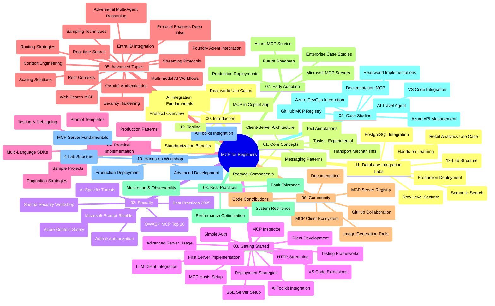

# বিগিনারদের জন্য মডেল কনটেক্সট প্রোটোকল (MCP) - স্টাডি গাইড

এই স্টাডি গাইডটি "বিগিনারদের জন্য মডেল কনটেক্সট প্রোটোকল (MCP)" কারিকুলামের জন্য রিপজিটরি কাঠামো এবং বিষয়বস্তু সম্পর্কে একটি ওভারভিউ প্রদান করে। এই গাইডটি ব্যবহারের মাধ্যমে রিপজিটরিতে দক্ষতার সাথে নেভিগেট করতে এবং উপলব্ধ রিসোর্সগুলো থেকে সর্বোত্তম সুবিধা নিতে পারবেন।

## রিপজিটরি ওভারভিউ

মডেল কনটেক্সট প্রোটোকল (MCP) হল AI মডেল ও ক্লায়েন্ট অ্যাপ্লিকেশনগুলোর মধ্যে ইন্টারঅ্যাকশনের জন্য একটি স্ট্যান্ডার্ডাইজড ফ্রেমওয়ার্ক। প্রাথমিকভাবে Anthropic দ্বারা তৈরি MCP এখন অফিসিয়াল GitHub অর্গানাইজেশনের মাধ্যমে বিস্তৃত MCP কমিউনিটি দ্বারা রক্ষণাবেক্ষণ হয়। এই রিপজিটরিটি C#, Java, JavaScript, Python, এবং TypeScript-এ হ্যান্ডস-অন কোড উদাহরণ সহ একটি বিস্তৃত কারিকুলাম প্রদান করে, যা AI ডেভেলপার, সিস্টেম আর্কিটেক্ট এবং সফটওয়্যার ইঞ্জিনিয়ারদের জন্য ডিজাইন করা হয়েছে।

## ভিজ্যুয়াল কারিকুলাম ম্যাপ

## রিপজিটরি কাঠামো

এই রিপজিটরিটি বারোটি প্রধান অংশে সংগঠিত, প্রতিটি MCP-এর বিভিন্ন দিকের উপর গুরুত্ব দেয়:

1. **পরিচয় (00-Introduction/)**
   - মডেল কনটেক্সট প্রোটোকলের ওভারভিউ
   - AI পাইপলাইনগুলিতে স্ট্যান্ডার্ডাইজেশনের গুরুত্ব
   - বাস্তব জীবনের ব্যবহার ও সুবিধাসমূহ

2. **কোর ধারণা (01-CoreConcepts/)**
   - ক্লায়েন্ট-সার্ভার আর্কিটেকচার
   - মূল প্রোটোকল উপাদানসমূহ
   - MCP-তে মেসেজিং প্যাটার্নসমূহ
   - ভবিষ্যৎ দৃষ্টি: [MCP-তে কী পরিবর্তন হচ্ছে: ২০২৬-০৭-২৮ রিলিজ ক্যান্ডিডেট](./01-CoreConcepts/mcp-2026-07-28-release-candidate.md) — পরবর্তী স্পেসিফিকেশন ভার্সনে প্রত্যাশিত Stateless প্রোটোকল কোর, এক্সটেনশন ফ্রেমওয়ার্ক, এবং রুটস/স্যাম্পলিং/লগিং ডিপ্রেকেশনসমূহ

3. **সিকিউরিটি (02-Security/)**
   - MCP-ভিত্তিক সিস্টেমে সিকিউরিটি হুমকি
   - নিরাপত্তা বাস্তবায়নের জন্য সেরা পদ্ধতি
   - অথেনটিকেশন এবং অথরাইজেশন কৌশলসমূহ
   - **বিস্তৃত সিকিউরিটি ডকুমেন্টেশন**:
     - MCP সিকিউরিটি সেরা পদ্ধতি ২০২৫
     - Azure কন্টেন্ট সেফটি ইমপ্লিমেন্টেশন গাইড
     - MCP সিকিউরিটি কন্ট্রোলস এবং টেকনিকস
     - MCP সেরা পদ্ধতি দ্রুত রেফারেন্স
   - **মুখ্য সিকিউরিটি বিষয়সমূহ**:
     - প্রম্পট ইনজেকশন এবং টুল পয়জনিং আক্রমণ
     - সেশন হাইজাকিং এবং কনফিউজড ডেপুটি সমস্যা
     - টোকেন পাসথ্রু দুর্বলতা
     - অতিরিক্ত অনুমতি এবং অ্যাক্সেস নিয়ন্ত্রণ
     - AI কম্পোনেন্টগুলোর জন্য সাপ্লাই চেইন সিকিউরিটি
     - Microsoft প্রম্পট শিল্ডস ইন্টিগ্রেশন

4. **শুরু করা (03-GettingStarted/)**
   - পরিবেশ সেটআপ এবং কনফিগারেশন
   - মৌলিক MCP সার্ভার ও ক্লায়েন্ট তৈরি
   - বিদ্যমান অ্যাপ্লিকেশনগুলোর সাথে ইন্টিগ্রেশন
   - অন্তর্ভুক্ত বিভাগসমূহ:
     - প্রথম সার্ভার বাস্তবায়ন
     - ক্লায়েন্ট উন্নয়ন
     - LLM ক্লায়েন্ট ইন্টিগ্রেশন
     - VS কোড ইন্টিগ্রেশন
     - সার্ভার-সেন্ট ইভেন্টস (SSE) সার্ভার
     - উন্নত সার্ভার ব্যবহার
     - HTTP স্ট্রিমিং
     - AI টুলকিট ইন্টিগ্রেশন
     - পরীক্ষার কৌশলসমূহ
     - ডিপ্লয়মেন্ট নির্দেশিকা

5. **বাস্তবায়ন (04-PracticalImplementation/)**
   - বিভিন্ন প্রোগ্রামিং ভাষায় SDK ব্যবহার
   - ডিবাগিং, টেস্টিং, এবং ভ্যালিডেশন প্রযুক্তিসমূহ
   - পুনরায় ব্যবহারযোগ্য প্রম্পট টেমপ্লেট এবং ওয়ার্কফ্লো তৈরি
   - বাস্তবায়ন উদাহরণ সহ স্যাম্পল প্রজেক্ট

6. **উন্নত বিষয়সমূহ (05-AdvancedTopics/)**
   - কনটেক্সট ইঞ্জিনিয়ারিং প্রযুক্তি
   - ফাউন্ড্রি এজেন্ট ইন্টিগ্রেশন
   - মাল্টি-মোডাল AI ওয়ার্কফ্লো
   - OAuth2 অথেনটিকেশন ডেমো
   - রিয়েল-টাইম সার্চ ক্যাপাবিলিটি
   - রিয়েল-টাইম স্ট্রিমিং
   - রুট কনটেক্সটস বাস্তবায়ন
   - রাউটিং কৌশলসমূহ
   - স্যাম্পলিং প্রযুক্তি
   - স্কেলিং পদ্ধতি
   - সিকিউরিটি বিবেচনা
   - এন্ট্রা ID সিকিউরিটি ইন্টিগ্রেশন
   - ওয়েব সার্চ ইন্টিগ্রেশন
   - প্রতিপক্ষ মাল্টি-এজেন্ট রিজনিং (ডিবেট প্যাটার্ন)

7. **কমিউনিটি অবদান (06-CommunityContributions/)**
   - কোড এবং ডকুমেন্টেশন কীভাবে দান করবেন
   - GitHub এর মাধ্যমে সহযোগিতা
   - কমিউনিটি-চালিত উন্নয়ন এবং প্রতিক্রিয়া
   - বিভিন্ন MCP ক্লায়েন্ট ব্যবহার (Claude Desktop, Cline, VSCode)
   - জনপ্রিয় MCP সার্ভার যেমন ইমেজ জেনারেশন নিয়ে কাজ

8. **প্রাথমিক গ্রহণ থেকে শেখা (07-LessonsfromEarlyAdoption/)**
   - বাস্তব জীবন বাস্তবায়ন এবং সফলতার গল্প
   - MCP-ভিত্তিক সমাধান নির্মাণ এবং ডিপ্লয়মেন্ট
   - প্রবণতা এবং ভবিষ্যত রোডম্যাপ
   - **Microsoft MCP সার্ভার গাইড**: প্রযোজ্য ১০টি Microsoft MCP সার্ভারের বিস্তৃত গাইড, যেগুলো অন্তর্ভুক্ত:
     - Microsoft Learn Docs MCP সার্ভার
     - Azure MCP সার্ভার (১৫+ বিশেষায়িত কানেক্টর)
     - GitHub MCP সার্ভার
     - Azure DevOps MCP সার্ভার
     - MarkItDown MCP সার্ভার
     - SQL Server MCP সার্ভার
     - Playwright MCP সার্ভার
     - Dev Box MCP সার্ভার
     - Microsoft Foundry MCP সার্ভার
     - Microsoft 365 Agents Toolkit MCP সার্ভার

9. **সেরা পদ্ধতি (08-BestPractices/)**
   - কর্মক্ষমতা অপ্টিমাইজেশন এবং টিউনিং
   - ফল্ট-টলারেন্ট MCP সিস্টেম ডিজাইন
   - টেস্টিং এবং সহনশীলতার কৌশল

10. **কেস স্টাডি (09-CaseStudy/)**
    - **সাতটি বিস্তৃত কেস স্টাডি** MCP-এর বহুমুখিতা বিভিন্ন পরিস্থিতিতে প্রদর্শন করে:
    - **Azure AI ট্রাভেল এজেন্টস**: Azure OpenAI এবং AI সার্চ দিয়ে মাল্টি-এজেন্ট অর্কেস্ট্রেশন
    - **Azure DevOps ইন্টিগ্রেশন**: YouTube ডেটা আপডেট সহ ওয়ার্কফ্লো প্রক্রিয়া অটোমেশন
    - **রিয়েল-টাইম ডকুমেন্টেশন রিট্রিভাল**: পাইথন কনসোল ক্লায়েন্ট সাথে স্ট্রিমিং HTTP
    - **ইন্টারেক্টিভ স্টাডি প্ল্যান জেনারেটর**: Chainlit ওয়েব অ্যাপ সাথে কথোপকথনমূলক AI
    - **ইন-এডিটর ডকুমেন্টেশন**: VS কোড ইন্টিগ্রেশন GitHub Copilot ওয়ার্কফ্লোসহ
    - **Azure API ম্যানেজমেন্ট**: MCP সার্ভার তৈরি সহ এন্টারপ্রাইজ API ইন্টিগ্রেশন
    - **GitHub MCP রেজিস্ট্রি**: ইকোসিস্টেম উন্নয়ন এবং এজেন্টিক ইন্টিগ্রেশন প্ল্যাটফর্ম
    - এন্টারপ্রাইজ ইন্টিগ্রেশন, ডেভেলপার প্রোডাক্টিভিটি, এবং ইকোসিস্টেম ডেভেলপমেন্ট জুড়ে বাস্তবায়ন উদাহরণ

11. **হ্যান্ডস-অন ওয়ার্কশপ (10-StreamliningAIWorkflowsBuildingAnMCPServerWithAIToolkit/)**
    - MCP এবং AI টুলকিট একত্রিত করে বিস্তৃত হ্যান্ডস-অন ওয়ার্কশপ
    - AI মডেলগুলি বাস্তব-জগতের টুলের সাথে সংযুক্ত করে বুদ্ধিমান অ্যাপ্লিকেশন তৈরি
    - মডিউলগুলো মৌলিক বিষয়, কাস্টম সার্ভার উন্নয়ন, এবং প্রোডাকশন ডিপ্লয়মেন্ট স্ট্র্যাটেজি কভার করে
    - **ল্যাব কাঠামো**:
      - ল্যাব ১: MCP সার্ভার মৌলিক বিষয়
      - ল্যাব ২: উন্নত MCP সার্ভার ডেভেলপমেন্ট
      - ল্যাব ৩: AI টুলকিট ইন্টিগ্রেশন
      - ল্যাব ৪: প্রোডাকশন ডিপ্লয়মেন্ট ও স্কেলিং
    - ধাপে ধাপে নির্দেশাবলী সহ ল্যাব-ভিত্তিক শেখার পদ্ধতি

12. **MCP সার্ভার ডাটাবেস ইন্টিগ্রেশন ল্যাবস (11-MCPServerHandsOnLabs/)**
    - **১৩টি ল্যাব নিয়ে একটি বিস্তৃত শেখার পথ** প্রোডাকশন-রেডি MCP সার্ভার তৈরির জন্য PostgreSQL ইন্টিগ্রেশনের সঙ্গে
    - **বাস্তব ব্যবসায়িক বিশ্লেষণ বাস্তবায়ন** Zava রিটেইল ইউজ কেস ব্যবহার করে
    - **এন্টারপ্রাইজ-গ্রেড প্যাটার্ন** যেমন রো লেভেল সিকিউরিটি (RLS), সেমান্টিক সার্চ, এবং মাল্টি-টেন্যান্ট ডেটা অ্যাক্সেস
    - **সম্পূর্ণ ল্যাব কাঠামো**:
      - **ল্যাব ০০-০৩: ভিত্তি** - পরিচিতি, আর্কিটেকচার, সিকিউরিটি, পরিবেশ সেটআপ
      - **ল্যাব ০৪-০৬: MCP সার্ভার নির্মাণ** - ডাটাবেস ডিজাইন, MCP সার্ভার বাস্তবায়ন, টুল ডেভেলপমেন্ট
      - **ল্যাব ০৭-০৯: উন্নত ফিচার** - সেমান্টিক সার্চ, টেস্টিং ও ডিবাগিং, VS কোড ইন্টিগ্রেশন
      - **ল্যাব ১০-১২: প্রোডাকশন ও সেরা পদ্ধতি** - ডিপ্লয়মেন্ট, মনিটরিং, অপ্টিমাইজেশন
    - **আবৃত প্রযুক্তি**: FastMCP ফ্রেমওয়ার্ক, PostgreSQL, Azure OpenAI, Azure Container Apps, অ্যাপ্লিকেশন ইনসাইটস
    - **শেখার ফলাফল**: প্রোডাকশন-রেডি MCP সার্ভার, ডাটাবেস ইন্টিগ্রেশন প্যাটার্ন, AI-চালিত বিশ্লেষণ, এন্টারপ্রাইজ সিকিউরিটি

13. **টুলিং (12-tooling/)**
    - MCP কীভাবে Copilot অ্যাপ এবং অন্যান্য টুলে ব্যবহার করবেন শেখুন

## অতিরিক্ত রিসোর্স

রিপজিটরিতে সহায়ক রিসোর্স রয়েছে:

- **Images ফোল্ডার**: কারিকুলামের সময় ব্যবহৃত ডায়াগ্রাম এবং ইলাস্ট্রেশনের জন্য
- **অনুবাদসমূহ**: ডকুমেন্টেশন অটোমেটেড অনুবাদের মাধ্যমে বহু-ভাষার সাপোর্ট
- **অফিসিয়াল MCP রিসোর্স**:
  - [MCP ডকুমেন্টেশন](https://modelcontextprotocol.io/)
  - [MCP স্পেসিফিকেশন](https://spec.modelcontextprotocol.io/)
  - [MCP GitHub রিপজিটরি](https://github.com/modelcontextprotocol)

## কিভাবে এই রিপজিটরি ব্যবহার করবেন

1. **ক্রমবদ্ধ শেখা**: একটি গঠনমূলক শেখার অভিজ্ঞতার জন্য চ্যাপ্টারগুলো (00 থেকে 11) অনুসরণ করুন।
2. **ভাষা-নির্দিষ্ট ফোকাস**: যদি আপনি নির্দিষ্ট প্রোগ্রামিং ভাষায় আগ্রহী হন, আপনার পছন্দের ভাষায় বাস্তবায়নের জন্য স্যাম্পল ডিরেক্টরিগুলো দেখুন।
3. **বাস্তবায়ন শুরু করুন**: পরিবেশ সেটআপ এবং আপনার প্রথম MCP সার্ভার ও ক্লায়েন্ট তৈরি করার জন্য "Getting Started" সেকশন থেকে শুরু করুন।
4. **উন্নত অন্বেষণ**: মৌলিক বিষয়গুলোতে স্বাচ্ছন্দ্য পাওয়ার পর, আপনার জ্ঞান বাড়ানোর জন্য উন্নত বিষয়গুলোতে ডুব দিন।
5. **কমিউনিটি এনগেজমেন্ট**: GitHub আলোচনা এবং Discord চ্যানেলের মাধ্যমে MCP কমিউনিটিতে যোগ দিন, যেখানে বিশেষজ্ঞ এবং সহকর্মী ডেভেলপারদের সাথে সংযুক্ত হওয়া যাবে।

## MCP ক্লায়েন্ট এবং টুলস

কারিকুলাম বিভিন্ন MCP ক্লায়েন্ট এবং টুল কভার করে:

1. **অফিসিয়াল ক্লায়েন্টসমূহ**:
   - Visual Studio Code 
   - MCP Visual Studio Code-এ
   - Claude Desktop
   - VSCode-এ Claude
   - Claude API

2. **কমিউনিটি ক্লায়েন্টসমূহ**:
   - Cline (টার্মিনাল-ভিত্তিক)
   - Cursor (কোড এডিটর)
   - ChatMCP
   - Windsurf

3. **MCP ম্যানেজমেন্ট টুলস**:
   - MCP CLI
   - MCP Manager
   - MCP Linker
   - MCP Router

## জনপ্রিয় MCP সার্ভারসমূহ

রিপজিটরিতে বিভিন্ন MCP সার্ভার পরিচয় করানো হয়েছে, যার মধ্যে রয়েছে:

1. **অফিসিয়াল Microsoft MCP সার্ভারসমূহ**:
   - Microsoft Learn Docs MCP সার্ভার
   - Azure MCP সার্ভার (১৫+ বিশেষায়িত কানেক্টর)
   - GitHub MCP সার্ভার
   - Azure DevOps MCP সার্ভার
   - MarkItDown MCP সার্ভার
   - SQL Server MCP সার্ভার
   - Playwright MCP সার্ভার
   - Dev Box MCP সার্ভার
   - Microsoft Foundry MCP সার্ভার
   - Microsoft 365 Agents Toolkit MCP সার্ভার

2. **অফিসিয়াল রেফারেন্স সার্ভারসমূহ**:
   - ফাইলসিস্টেম
   - Fetch
   - মেমোরি
   - সিকুয়েনশিয়াল থিঙ্কিং

3. **ইমেজ জেনারেশন**:
   - Azure OpenAI DALL-E 3
   - Stable Diffusion WebUI
   - Replicate

4. **ডেভেলপমেন্ট টুলস**:
   - Git MCP
   - টার্মিনাল কন্ট্রোল
   - কোড অ্যাসিস্ট্যান্ট

5. **বিশেষায়িত সার্ভারসমূহ**:
   - Salesforce
   - Microsoft Teams
   - Jira & Confluence

## অবদান রাখা

এই রিপজিটরি কমিউনিটির অবদানকে স্বাগত জানায়। MCP ইকোসিস্টেমে কার্যকরভাবে অবদান রাখার জন্য নির্দেশনা দেখতে কমিউনিটি অবদান বিভাগ দেখুন।

----

*এই স্টাডি গাইডটি সর্বশেষ ৫ ফেব্রুয়ারি ২০২৬-এ আপডেট করা হয়েছে, যা সর্বশেষ MCP স্পেসিফিকেশন ২০২৫-১১-২৫ প্রতিফলিত করে এবং ঐ তারিখ অনুযায়ী রিপজিটরির ওভারভিউ প্রদান করে। ঐ তারিখের পর রিপজিটরির বিষয়বস্তু আপডেট হতে পারে।*

*পরিশিষ্ট (২ জুলাই ২০২৬): `2026-07-28` MCP স্পেসিফিকেশন রিলিজ ক্যান্ডিডেট বিষয়ে একটি পাঠ [01-CoreConcepts](./01-CoreConcepts/mcp-2026-07-28-release-candidate.md) এ যোগ করা হয়েছে; কারিকুলামের বেসলাইন ২০২৫-১১-২৫ পর্যন্ত অপরিবর্তিত রয়ে গেছে যতক্ষণ না নতুন স্পেসিফিকেশন প্রকাশ পায়।*

---

<!-- CO-OP TRANSLATOR DISCLAIMER START -->
**অস্বীকৃতি**:
এই নথিটি AI অনুবাদ পরিষেবা [Co-op Translator](https://github.com/Azure/co-op-translator) ব্যবহার করে অনূদিত হয়েছে। যদিও আমরা শুদ্ধতার জন্য চেষ্টা করি, অনুগ্রহ করে মনে রাখবেন যে স্বয়ংক্রিয় অনুবাদে ত্রুটি বা অসঙ্গতি থাকতে পারে। মূল নথিটি তার স্বভাষায় কর্তৃত্বপূর্ণ উৎস হিসেবে বিবেচিত হওয়া উচিত। গুরুত্বপূর্ণ তথ্যের জন্য পেশাদার মানব অনুবাদ সুপারিশ করা হয়। এই অনুবাদের ব্যবহারে প্রয়োজনীয় ভুল বোঝাবুঝি বা ভুল ব্যাখ্যার জন্য আমরা দায়বদ্ধ নই।
<!-- CO-OP TRANSLATOR DISCLAIMER END -->