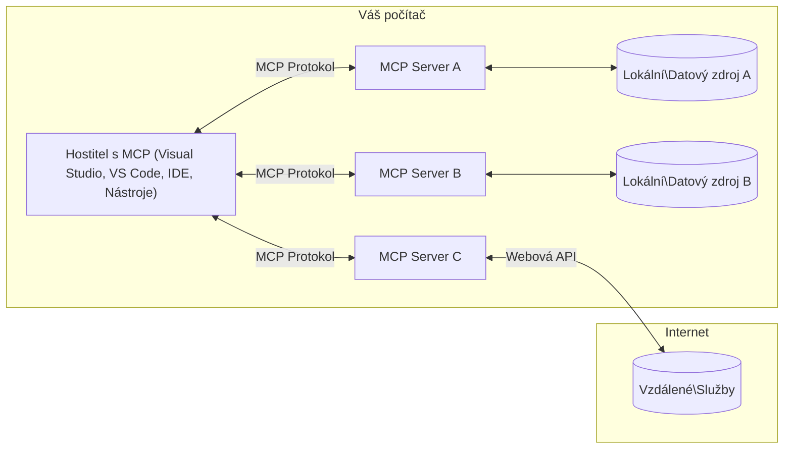

# Základní koncepty MCP: Ovládnutí protokolu Model Context pro integraci AI

[](https://youtu.be/earDzWGtE84)

_(Klikněte na obrázek výše pro zobrazení videa této lekce)_

[Model Context Protocol (MCP)](https://github.com/modelcontextprotocol) je výkonný, standardizovaný rámec, který optimalizuje komunikaci mezi velkými jazykovými modely (LLM) a externími nástroji, aplikacemi a zdroji dat.
Tento průvodce vás provede základními koncepty MCP. Naučíte se o jeho klient-server architektuře, klíčových složkách, mechanismech komunikace a osvědčených postupech implementace.

- **Explicitní souhlas uživatele**: Veškerý přístup k datům a operace vyžadují před vykonáním jasné schválení uživatelem. Uživatelé musí být jasně informováni o tom, jaká data budou zpřístupněna a jaké akce budou provedeny, s podrobnou kontrolou oprávnění a autorizací.

- **Ochrana soukromí dat**: Uživatelská data jsou zpřístupněna pouze se souhlasem uživatele a musí být chráněna robustními přístupovými kontrolami během celého životního cyklu interakce. Implementace musí zabránit neoprávněnému přenosu dat a udržovat přísné hranice ochrany soukromí.

- **Bezpečnost provádění nástrojů**: Každé vyvolání nástroje vyžaduje explicitní souhlas uživatele s jasným pochopením funkce nástroje, parametrů a potenciálního dopadu. Robustní bezpečnostní hranice musí bránit neúmyslnému, nebezpečnému nebo škodlivému spuštění nástroje.

- **Zabezpečení transportní vrstvy**: Veškeré komunikační kanály by měly využívat odpovídající šifrování a autentizační mechanismy. Vzdálená připojení by měla implementovat bezpečné transportní protokoly a správu přihlašovacích údajů.

#### Směrnice pro implementaci:

- **Správa oprávnění**: Implementujte jemnozrnný systém oprávnění, který uživatelům umožňuje kontrolovat, ke kterým serverům, nástrojům a zdrojům je přístup
- **Autentizace & autorizace**: Používejte bezpečné metody autentizace (OAuth, API klíče) s řádnou správou tokenů a expirací  
- **Validace vstupů**: Validujte všechny parametry a vstupy dat podle definovaných schémat, aby se předešlo injekčním útokům
- **Auditní protokolování**: Vedení rozsáhlých záznamů všech operací pro monitorování bezpečnosti a dodržování předpisů

## Přehled

Tato lekce zkoumá základní architekturu a komponenty, které tvoří ekosystém Model Context Protocol (MCP). Naučíte se o klient-server architektuře, klíčových součástech a komunikačních mechanismech, které pohánějí interakce MCP.

## Klíčové vzdělávací cíle

Na konci této lekce budete:

- Rozumět klient-server architektuře MCP.
- Identifikovat role a odpovědnosti Hostitelů, Klientů a Serverů.
- Analyzovat hlavní vlastnosti, které činí MCP flexibilní integrační vrstvou.
- Naučit se, jak proudí informace v rámci ekosystému MCP.
- Získat praktické poznatky prostřednictvím ukázek kódu v .NET, Java, Python a JavaScript.

## Architektura MCP: Podrobnější pohled

Ekosystém MCP je postaven na klient-server modelu. Tato modulární struktura umožňuje AI aplikacím efektivně komunikovat s nástroji, databázemi, API a kontextovými zdroji. Pojďme si tuto architekturu rozebrat na klíčové komponenty.

V jádru MCP následuje klient-server architekturu, kde hostitelská aplikace může připojit více serverů:



- **MCP Hosts**: Programy jako VSCode, Claude Desktop, IDE nebo AI nástroje, které chtějí přistupovat k datům přes MCP
- **MCP Clients**: Klientské protokoly, které udržují 1:1 spojení se servery
- **MCP Servers**: Lehkost programu, který každý vystavuje specifické schopnosti prostřednictvím standardizovaného Model Context Protocol
- **Místní datové zdroje**: Soubory, databáze a služby vašeho počítače, ke kterým MCP servery mohou bezpečně přistupovat
- **Vzdálené služby**: Externí systémy dostupné přes internet, ke kterým se MCP servery mohou připojit přes API.

Protokol MCP je vyvíjející se standard používající verzování na základě data (formát RRRR-MM-DD). Aktuální verze protokolu je **2025-11-25**. Nejnovější aktualizace můžete vidět ve [specifikaci protokolu](https://modelcontextprotocol.io/specification/2025-11-25/)

> **Nahlédnutí do budoucnosti:** kandidát na vydání další verze specifikace, **2026-07-28**, byl oznámen v květnu 2026 a je plánován k vydání 28. července 2026. Tento update činí protokol bezstavovým na transportní vrstvě (odstraňuje handshake `initialize` a ID relací), formalizuje rámec Extensions a nahrazuje Roots, Sampling a Logging novějšími vzory. Kompletní přehled najdete v [Co se mění v MCP: Kandidát na vydání 2026-07-28](./mcp-2026-07-28-release-candidate.md).

### 1. Hostitelé

V Model Context Protocol (MCP) jsou **Hostitelé** AI aplikace, které slouží jako hlavní rozhraní, skrze které uživatelé komunikují s protokolem. Hostitelé koordinují a spravují připojení k více MCP serverům tím, že pro každé připojení serveru vytvářejí dedikované MCP klienty. Příklady Hostitelů zahrnují:

- **AI aplikace**: Claude Desktop, Visual Studio Code, Claude Code
- **Vývojová prostředí**: IDE a editory kódu s integrací MCP  
- **Vlastní aplikace**: Speciálně vytvoření AI agenti a nástroje

**Hostitelé** jsou aplikace koordinující interakce s AI modely. Oni:

- **Orchestrují AI modely**: Spouštějí nebo komunikují s LLM pro generování odpovědí a koordinaci AI workflow
- **Spravují klientská připojení**: Vytváří a udržují jednoho MCP klienta na každé připojení MCP serveru
- **Řídí uživatelské rozhraní**: Řídí tok konverzace, uživatelské interakce a prezentaci odpovědí  
- **Prosazují bezpečnost**: Řídí oprávnění, bezpečnostní omezení a autentizaci
- **Řeší souhlas uživatele**: Spravují schválení uživatele pro sdílení dat a spuštění nástrojů


### 2. Klienti

**Klienti** jsou klíčové komponenty, které udržují dedikovaná 1:1 spojení mezi Hostiteli a MCP servery. Každý MCP klient je instanciován Hostitelem pro připojení ke konkrétnímu MCP serveru, aby zajistil organizované a bezpečné komunikační kanály. Více klientů umožňuje Hostitelům připojit se současně k více serverům.

**Klienti** jsou konektorové komponenty v rámci hostitelské aplikace. Oni:

- **Protokolová komunikace**: Odesílají JSON-RPC 2.0 požadavky serverům s výzvami a instrukcemi
- **Vyjednávání schopností**: Vyjednávají podporované funkce a verze protokolu se servery během inicializace
- **Spouštění nástrojů**: Řídí požadavky na spuštění nástrojů od modelů a zpracovávají odpovědi
- **Aktualizace v reálném čase**: Zpracovávají notifikace a aktualizace od serverů v reálném čase
- **Zpracování odpovědí**: Zpracovávají a formátují odpovědi serveru pro zobrazení uživatelům

### 3. Servery

**Servery** jsou programy poskytující kontext, nástroje a schopnosti MCP klientům. Mohou být spuštěny lokálně (na stejném stroji jako Hostitel) nebo vzdáleně (na externích platformách) a jsou odpovědné za zpracování požadavků klientů a poskytování strukturovaných odpovědí. Servery exponují specifickou funkcionalitu prostřednictvím standardizovaného Model Context Protocolu.

**Servery** jsou služby poskytující kontext a schopnosti. Oni:

- **Registrace funkcí**: Registrují a zpřístupňují dostupné primitivy (zdroje, výzvy, nástroje) klientům
- **Zpracování požadavků**: Přijímají a provádějí volání nástrojů, požadavky na zdroje a výzvy od klientů
- **Poskytování kontextu**: Poskytují kontextové informace a data pro vylepšení odpovědí modelu
- **Správa stavu**: Uchovávají stav relace a zpracovávají stavové interakce podle potřeby
- **Notifikace v reálném čase**: Odesílají notifikace o změnách schopností a aktualizacích připojeným klientům

Servery mohou vyvíjet kdokoliv pro rozšíření schopností modelu specializovanou funkcionalitou a podporují jak lokální, tak vzdálené scénáře nasazení.

### 4. Serverové primitivy

Servery v Model Context Protocolu (MCP) poskytují tři základní **primitivy**, které definují základní stavební kameny pro bohaté interakce mezi klienty, hostiteli a jazykovými modely. Tyto primitivy specifikují typy kontextových informací a akcí dostupných prostřednictvím protokolu.

MCP servery mohou zpřístupnit libovolnou kombinaci následujících tří základních primitiv:

#### Zdroje

**Zdroje** jsou datové zdroje, které poskytují kontextové informace AI aplikacím. Reprezentují statický nebo dynamický obsah, který může zlepšit porozumění modelu a rozhodování:

- **Kontextová data**: Strukturované informace a kontext pro spotřebu AI modelem
- **Znalostní báze**: Repozitáře dokumentů, články, manuály a výzkumné články
- **Místní datové zdroje**: Soubory, databáze a informace o místním systému  
- **Externí data**: Odpovědi API, webové služby a data vzdálených systémů
- **Dynamický obsah**: Data v reálném čase, která se aktualizují podle vnějších podmínek

Zdroje jsou identifikovány URI a podporují vyhledávání pomocí metod `resources/list` a načítání přes `resources/read`:

```text
file://documents/project-spec.md
database://production/users/schema
api://weather/current
```

#### Výzvy

**Výzvy** jsou znovu použitelné šablony, které pomáhají strukturovat interakce s jazykovými modely. Poskytují standardizované vzory interakcí a šablonové workflow:

- **Šablonové interakce**: Předstrukturované zprávy a začátky konverzace
- **Šablony pracovních toků**: Standardizované sekvence pro běžné úkoly a interakce
- **Few-shot příklady**: Šablony založené na příkladech pro instrukce modelu
- **Systémové výzvy**: Základní výzvy, které definují chování a kontext modelu
- **Dynamické šablony**: Parametrizované výzvy, které se přizpůsobují konkrétním kontextům

Výzvy podporují nahrazování proměnných a mohou být objeveny pomocí `prompts/list` a načteny metodou `prompts/get`:

```markdown
Generate a {{task_type}} for {{product}} targeting {{audience}} with the following requirements: {{requirements}}
```

#### Nástroje

**Nástroje** jsou spustitelné funkce, které mohou AI modely vyvolat k provedení konkrétních akcí. Reprezentují "slovesa" ekosystému MCP, umožňující modelům interagovat s externími systémy:

- **Spustitelné funkce**: Diskrétní operace, které modely mohou vyvolat s konkrétními parametry
- **Integrace externích systémů**: Volání API, dotazy do databází, operace se soubory, výpočty
- **Unikátní identita**: Každý nástroj má jedinečný název, popis a schéma parametrů
- **Strukturovaný vstup/výstup**: Nástroje přijímají validované parametry a vracejí strukturované, typované odpovědi
- **Akční schopnosti**: Umožňují modelům provádět reálné akce a získávat živá data

Nástroje jsou definovány pomocí JSON Schémy pro validaci parametrů a objevují se přes `tools/list` a spouštějí přes `tools/call`. Mohou také obsahovat **ikony** jako doplňující metadata pro lepší prezentaci v UI.

**Anotace nástrojů**: Nástroje podporují behaviorální anotace (např. `readOnlyHint`, `destructiveHint`), které popisují, zda je nástroj pouze pro čtení nebo destruktivní, což pomáhá klientům činit informovaná rozhodnutí o spuštění nástroje.

Příklad definice nástroje:

```typescript
server.tool(
  "search_products", 
  {
    query: z.string().describe("Search query for products"),
    category: z.string().optional().describe("Product category filter"),
    max_results: z.number().default(10).describe("Maximum results to return")
  }, 
  async (params) => {
    // Proveďte vyhledávání a vraťte strukturované výsledky
    return await productService.search(params);
  }
);
```

## Klientské primitivy

V Model Context Protocol (MCP) mohou **klienti** vystavovat primitivy, které serverům umožňují požadovat další schopnosti od hostitelské aplikace. Tyto klientské primitivy umožňují bohatší, interaktivnější implementace serverů, které mohou přistupovat k schopnostem AI modelu a uživatelským interakcím.

### Sampling

> **Upozornění na ukončení podpory:** kandidát vydání `2026-07-28` označuje Sampling jako zastaralý ve prospěch přímé integrace s API poskytovatelů LLM. Sampling stále funguje ve verzi `2025-11-25` a po dobu minimálně jednoho roku po ukončení podpory, ale nové návrhy by měly preferovat náhradní vzor. Viz [Co se mění v MCP: Kandidát na vydání 2026-07-28](./mcp-2026-07-28-release-candidate.md).

**Sampling** umožňuje serverům požadovat dokončení modelu jazyka z AI aplikace klienta. Tento primitiv umožňuje serverům přístup ke schopnostem LLM bez vkládání vlastních závislostí na modelech:

- **Nezávislý přístup k modelu**: Servery mohou požadovat dokončení bez zahrnutí SDK LLM nebo řízení přístupu k modelu
- **Serverem iniciovaná AI**: Umožňuje serverům autonomně generovat obsah pomocí modelu klienta
- **Rekurzivní interakce LLM**: Podporuje složité scénáře, kde servery potřebují AI asistenci pro zpracování
- **Dynamická generace obsahu**: Umožňuje serverům vytvářet kontextové odpovědi pomocí modelu hostitele
- **Podpora volání nástrojů**: Servery mohou zahrnout parametry `tools` a `toolChoice`, aby umožnily modelu klienta vyvolávat nástroje během sampling

Sampling se spouští metodou `sampling/complete`, kdy servery odesílají požadavky na dokončení klientům.

### Roots

> **Upozornění na ukončení podpory:** kandidát vydání `2026-07-28` označuje Roots jako zastaralé ve prospěch parametrů nástrojů, URI zdrojů nebo konfigurace serveru. Stále fungují ve verzi `2025-11-25` a po dobu minimálně jednoho roku po ukončení podpory. Viz [Co se mění v MCP: Kandidát na vydání 2026-07-28](./mcp-2026-07-28-release-candidate.md).

**Roots** poskytují standardizovaný způsob, jak klienti zpřístupní hranice souborového systému serverům, což pomáhá serverům pochopit, k jakým adresářům a souborům mají přístup:

- **Hranice souborového systému**: Definují hranice, ve kterých mohou servery operovat v souborovém systému
- **Kontrola přístupu**: Pomáhá serverům pochopit, ke kterým adresářům a souborům mají oprávnění
- **Dynamické aktualizace**: Klienti mohou serverům oznamovat změny v seznamu roots
- **Identifikace na základě URI**: Roots používají URI `file://` k identifikaci přístupných adresářů a souborů

Roots jsou objeveny metodou `roots/list`, přičemž klienti posílají `notifications/roots/list_changed`, pokud roots změny.

### Elicitation

**Elicitation** umožňuje serverům požadovat další informace nebo potvrzení od uživatelů skrze rozhraní klienta:

- **Požadavky na uživatelský vstup**: Servery mohou žádat o doplňující informace při potřebě spuštění nástroje
- **Potvrzovací dialogy**: Požadují schválení uživatele pro citlivé nebo důležité operace
- **Interaktivní pracovní postupy**: Umožňují serverům vytvářet krok za krokem uživatelské interakce
- **Dynamický sběr parametrů**: Shromažďují chybějící nebo nepovinné parametry během spuštění nástroje

Požadavky na elicitation se provádějí pomocí metody `elicitation/request` za účelem sběru uživatelského vstupu přes rozhraní klienta.

**Elicitation v režimu URL**: Servery také mohou požadovat uživatelské interakce na základě URL, což umožňuje serverům nasměrovat uživatele na externí webové stránky pro autentizaci, potvrzení nebo zadání dat.

### Logging


> **Oznámení o ukončení podpory:** kandidát na vydání `2026-07-28` označuje Logging jako zastaralý ve prospěch `stderr` pro stdio transporty a OpenTelemetry pro strukturovanou observabilitu. Pokračuje v práci v `2025-11-25` a po dobu alespoň jednoho roku po jakémkoli ukončení podpory. Viz [Co se mění v MCP: Kandidát na vydání 2026-07-28](./mcp-2026-07-28-release-candidate.md).

**Logging** umožňuje serverům odesílat klientům strukturované logovací zprávy pro ladění, monitorování a operační přehled:

- **Podpora ladění**: Umožňuje serverům poskytovat podrobné protokoly vykonávání pro řešení problémů
- **Operační monitorování**: Posílat klientům aktualizace stavu a metriky výkonu
- **Hlídání chyb**: Poskytovat podrobný kontext chyb a diagnostické informace
- **Auditní stopy**: Vytvářet komplexní protokoly serverových operací a rozhodnutí

Logovací zprávy jsou odesílány klientům pro zajištění transparentnosti serverových operací a usnadnění ladění.

## Tok informací v MCP

Model Context Protocol (MCP) definuje strukturovaný tok informací mezi hostiteli, klienty, servery a modely. Pochopení tohoto toku pomáhá objasnit, jak jsou zpracovávány požadavky uživatelů a jak jsou do odpovědí modelu integrovány externí nástroje a data.

- **Hostitel iniciuje připojení**  
  Hostitelská aplikace (například IDE nebo chatové rozhraní) naváže spojení s MCP serverem, obvykle přes STDIO, WebSocket nebo jiný podporovaný transport.

- **Vyjednávání schopností**  
  Klient (vložený v hostiteli) a server si vymění informace o podpoře funkcí, nástrojů, zdrojů a verzích protokolu. To zajišťuje, že obě strany rozumí, jaké schopnosti jsou pro relaci dostupné.

- **Požadavek uživatele**  
  Uživatel komunikuje s hostitelem (např. zadá podnět nebo příkaz). Hostitel toto zadání shromáždí a předá jej klientovi k zpracování.

- **Použití zdroje nebo nástroje**  
  - Klient může požadovat další kontext nebo zdroje od serveru (např. soubory, databázové záznamy nebo články znalostní báze) pro obohacení porozumění modelu.
  - Pokud model zjistí, že je potřeba nástroj (např. pro získání dat, provedení výpočtu nebo zavolání API), klient odešle serveru požadavek na vyvolání nástroje, kde zadá název nástroje a parametry.

- **Provádění na serveru**  
  Server přijme požadavek na zdroj nebo nástroj, provede nezbytné operace (např. spuštění funkce, dotaz do databáze nebo načtení souboru) a vrátí výsledky klientovi ve strukturovaném formátu.

- **Generování odpovědi**  
  Klient integruje odpovědi serveru (data zdrojů, výstupy nástrojů atd.) do probíhající interakce s modelem. Model využívá tyto informace k vytvoření komplexní a kontextově relevantní odpovědi.

- **Prezentace výsledku**  
  Hostitel přijme konečný výstup od klienta a předloží jej uživateli, často včetně textu vytvořeného modelem a jakýchkoli výsledků z volání nástrojů nebo vyhledávání zdrojů.

Tento tok umožňuje MCP podporovat pokročilé, interaktivní a kontextově uvědomělé AI aplikace tím, že plynule propojuje modely s externími nástroji a datovými zdroji.

## Architektura protokolu a vrstvy

MCP se skládá ze dvou odlišných architektonických vrstev, které spolupracují na poskytnutí úplného komunikačního rámce:

### Datová vrstva

**Datová vrstva** implementuje základní MCP protokol, který je založen na **JSON-RPC 2.0**. Tato vrstva definuje strukturu zpráv, sémantiku a vzory interakce:

#### Hlavní komponenty:

- **Protokol JSON-RPC 2.0**: Veškerá komunikace využívá standardizovaný formát zpráv JSON-RPC 2.0 pro volání metod, odpovědi a oznámení
- **Správa životního cyklu**: Řeší inicializaci spojení, vyjednávání schopností a ukončení relace mezi klienty a servery
- **Serverové primitivy**: Umožňují serverům poskytovat základní funkce přes nástroje, zdroje a výzvy
- **Klientské primitivy**: Umožňují serverům požadovat vzorkování z LLM, získávání vstupu od uživatele a odesílání logovacích zpráv
- **Notifikace v reálném čase**: Podporuje asynchronní notifikace pro dynamické aktualizace bez nutnosti dotazování

#### Klíčové vlastnosti:

- **Vyjednávání verze protokolu**: Používá verzování na základě data (RRRR-MM-DD) pro zajištění kompatibility
- **Objevování schopností**: Klienti a servery si během inicializace vyměňují informace o podporovaných funkcích
- **Stavové relace**: Udržuje stav spojení napříč více interakcemi pro kontinuitu kontextu

### Transportní vrstva

**Transportní vrstva** spravuje komunikační kanály, rámování zpráv a autentizaci mezi účastníky MCP:

#### Podporované transportní mechanismy:

1. **STDIO transport**:
   - Používá standardní vstup/výstup pro přímou komunikaci procesů
   - Optimální pro lokální procesy na stejném stroji bez síťového režie
   - Běžně používaný pro lokální implementace MCP serverů

2. **Streamovatelný HTTP transport**:
   - Používá HTTP POST pro zprávy klient-server  
   - Nepovinně Server-Sent Events (SSE) pro streaming server-klient
   - Umožňuje vzdálenou komunikaci serveru přes sítě
   - Podporuje standardní HTTP autentizaci (bearer tokeny, API klíče, vlastní hlavičky)
   - MCP doporučuje OAuth pro bezpečnou autentizaci založenou na tokenech

#### Abstrakce transportu:

Transportní vrstva abstrahuje detaily komunikace od datové vrstvy, což umožňuje používat stejný formát zpráv JSON-RPC 2.0 napříč všemi transportními mechanismy. Tato abstrakce dovoluje aplikacím hladce přecházet mezi lokálními a vzdálenými servery.

### Bezpečnostní úvahy

Implementace MCP musí dodržovat několik klíčových bezpečnostních principů, aby byla zajištěna bezpečná, důvěryhodná a zabezpečená interakce v rámci všech operací protokolu:

- **Souhlas a kontrola uživatele**: Uživatelé musí dát výslovný souhlas před tím, než budou jakákoliv data přístupná nebo operace provedeny. Měli by mít jasnou kontrolu nad tím, jaká data jsou sdílená a jaké akce jsou autorizovány, podporováno intuitivními uživatelskými rozhraními pro přezkoumání a schvalování činností.

- **Ochrana soukromí dat**: Uživatelská data by měla být zpřístupněna pouze s výslovným souhlasem a musí být chráněna vhodnými přístupovými kontrolami. Implementace MCP musí zabezpečit proti neoprávněnému přenosu dat a zajistit, že soukromí je udržováno v průběhu všech interakcí.

- **Bezpečnost nástrojů**: Před vyvoláním jakéhokoliv nástroje je vyžadován výslovný souhlas uživatele. Uživateli by mělo být jasné, jaké funkce každý nástroj má, a musí být prosazeny robustní bezpečnostní hranice, aby se zabránilo nechtěnému nebo nebezpečnému spuštění nástroje.

Dodržováním těchto bezpečnostních principů MCP zajišťuje důvěru uživatelů, ochranu soukromí a bezpečnost v rámci všech interakcí protokolu, zatímco umožňuje výkonné AI integrace.

## Příklady kódu: Klíčové komponenty

Níže jsou příklady kódu v několika populárních programovacích jazycích, které ukazují, jak implementovat klíčové komponenty MCP serveru a nástrojů.

### .NET příklad: Vytvoření jednoduchého MCP serveru s nástroji

Zde je praktický příklad kódu v .NET, který demonstruje, jak implementovat jednoduchý MCP server s vlastními nástroji. Tento příklad ukazuje, jak definovat a registrovat nástroje, zpracovávat požadavky a připojit server pomocí Model Context Protocol.

```csharp
using System;
using System.Threading.Tasks;
using ModelContextProtocol.Server;
using ModelContextProtocol.Server.Transport;
using ModelContextProtocol.Server.Tools;

public class WeatherServer
{
    public static async Task Main(string[] args)
    {
        // Create an MCP server
        var server = new McpServer(
            name: "Weather MCP Server",
            version: "1.0.0"
        );
        
        // Register our custom weather tool
        server.AddTool<string, WeatherData>("weatherTool", 
            description: "Gets current weather for a location",
            execute: async (location) => {
                // Call weather API (simplified)
                var weatherData = await GetWeatherDataAsync(location);
                return weatherData;
            });
        
        // Connect the server using stdio transport
        var transport = new StdioServerTransport();
        await server.ConnectAsync(transport);
        
        Console.WriteLine("Weather MCP Server started");
        
        // Keep the server running until process is terminated
        await Task.Delay(-1);
    }
    
    private static async Task<WeatherData> GetWeatherDataAsync(string location)
    {
        // This would normally call a weather API
        // Simplified for demonstration
        await Task.Delay(100); // Simulate API call
        return new WeatherData { 
            Temperature = 72.5,
            Conditions = "Sunny",
            Location = location
        };
    }
}

public class WeatherData
{
    public double Temperature { get; set; }
    public string Conditions { get; set; }
    public string Location { get; set; }
}
```

### Java příklad: Komponenty MCP serveru

Tento příklad demonstruje stejný MCP server a registraci nástrojů jako výše v .NET, ale implementovanější v Javě.

```java
import io.modelcontextprotocol.server.McpServer;
import io.modelcontextprotocol.server.McpToolDefinition;
import io.modelcontextprotocol.server.transport.StdioServerTransport;
import io.modelcontextprotocol.server.tool.ToolExecutionContext;
import io.modelcontextprotocol.server.tool.ToolResponse;

public class WeatherMcpServer {
    public static void main(String[] args) throws Exception {
        // Vytvořit MCP server
        McpServer server = McpServer.builder()
            .name("Weather MCP Server")
            .version("1.0.0")
            .build();
            
        // Registrovat nástroj pro počasí
        server.registerTool(McpToolDefinition.builder("weatherTool")
            .description("Gets current weather for a location")
            .parameter("location", String.class)
            .execute((ToolExecutionContext ctx) -> {
                String location = ctx.getParameter("location", String.class);
                
                // Získat data o počasí (zjednodušené)
                WeatherData data = getWeatherData(location);
                
                // Vrátit formátovanou odpověď
                return ToolResponse.content(
                    String.format("Temperature: %.1f°F, Conditions: %s, Location: %s", 
                    data.getTemperature(), 
                    data.getConditions(), 
                    data.getLocation())
                );
            })
            .build());
        
        // Připojit server pomocí stdio transportu
        try (StdioServerTransport transport = new StdioServerTransport()) {
            server.connect(transport);
            System.out.println("Weather MCP Server started");
            // Udržovat server spuštěný, dokud není proces ukončen
            Thread.currentThread().join();
        }
    }
    
    private static WeatherData getWeatherData(String location) {
        // Implementace by volala API pro počasí
        // Zjednodušeno pro účely příkladu
        return new WeatherData(72.5, "Sunny", location);
    }
}

class WeatherData {
    private double temperature;
    private String conditions;
    private String location;
    
    public WeatherData(double temperature, String conditions, String location) {
        this.temperature = temperature;
        this.conditions = conditions;
        this.location = location;
    }
    
    public double getTemperature() {
        return temperature;
    }
    
    public String getConditions() {
        return conditions;
    }
    
    public String getLocation() {
        return location;
    }
}
```

### Python příklad: Budování MCP serveru

Tento příklad používá fastmcp, proto si ji prosím nejprve nainstalujte:

```python
pip install fastmcp
```
Ukázka kódu:

```python
#!/usr/bin/env python3
import asyncio
from fastmcp import FastMCP
from fastmcp.transports.stdio import serve_stdio

# Vytvořit FastMCP server
mcp = FastMCP(
    name="Weather MCP Server",
    version="1.0.0"
)

@mcp.tool()
def get_weather(location: str) -> dict:
    """Gets current weather for a location."""
    return {
        "temperature": 72.5,
        "conditions": "Sunny",
        "location": location
    }

# Alternativní přístup pomocí třídy
class WeatherTools:
    @mcp.tool()
    def forecast(self, location: str, days: int = 1) -> dict:
        """Gets weather forecast for a location for the specified number of days."""
        return {
            "location": location,
            "forecast": [
                {"day": i+1, "temperature": 70 + i, "conditions": "Partly Cloudy"}
                for i in range(days)
            ]
        }

# Zaregistrovat nástroje třídy
weather_tools = WeatherTools()

# Spustit server
if __name__ == "__main__":
    asyncio.run(serve_stdio(mcp))
```

### JavaScript příklad: Vytvoření MCP serveru

Tento příklad ukazuje vytvoření MCP serveru v JavaScriptu a registraci dvou nástrojů souvisejících s počasím.

```javascript
// Použití oficiálního SDK Model Context Protocol
import { McpServer } from "@modelcontextprotocol/sdk/server/mcp.js";
import { StdioServerTransport } from "@modelcontextprotocol/sdk/server/stdio.js";
import { z } from "zod"; // Pro ověřování parametrů

// Vytvořit MCP server
const server = new McpServer({
  name: "Weather MCP Server",
  version: "1.0.0"
});

// Definovat nástroj pro počasí
server.tool(
  "weatherTool",
  {
    location: z.string().describe("The location to get weather for")
  },
  async ({ location }) => {
    // Toto by normálně volalo API počasí
    // Zjednodušeno pro demonstraci
    const weatherData = await getWeatherData(location);
    
    return {
      content: [
        { 
          type: "text", 
          text: `Temperature: ${weatherData.temperature}°F, Conditions: ${weatherData.conditions}, Location: ${weatherData.location}` 
        }
      ]
    };
  }
);

// Definovat nástroj pro předpověď
server.tool(
  "forecastTool",
  {
    location: z.string(),
    days: z.number().default(3).describe("Number of days for forecast")
  },
  async ({ location, days }) => {
    // Toto by normálně volalo API počasí
    // Zjednodušeno pro demonstraci
    const forecast = await getForecastData(location, days);
    
    return {
      content: [
        { 
          type: "text", 
          text: `${days}-day forecast for ${location}: ${JSON.stringify(forecast)}` 
        }
      ]
    };
  }
);

// Pomocné funkce
async function getWeatherData(location) {
  // Simulovat volání API
  return {
    temperature: 72.5,
    conditions: "Sunny",
    location: location
  };
}

async function getForecastData(location, days) {
  // Simulovat volání API
  return Array.from({ length: days }, (_, i) => ({
    day: i + 1,
    temperature: 70 + Math.floor(Math.random() * 10),
    conditions: i % 2 === 0 ? "Sunny" : "Partly Cloudy"
  }));
}

// Připojit server pomocí stdio transportu
const transport = new StdioServerTransport();
server.connect(transport).catch(console.error);

console.log("Weather MCP Server started");
```

Tento JavaScriptový příklad demonstruje, jak vytvořit MCP server pomocí Model Context Protocol SDK. Ukazuje, jak registrovat dva nástroje pojmenované `weatherTool` a `forecastTool` a zpřístupnit je MCP klientům prostřednictvím `StdioServerTransport`.

## Bezpečnost a autorizace

MCP zahrnuje několik vestavěných konceptů a mechanismů pro správu bezpečnosti a autorizace v rámci celého protokolu:

1. **Řízení oprávnění pro nástroje**:  
  Klienti mohou specifikovat, které nástroje může model během relace používat. To zajišťuje, že jsou přístupné pouze explicitně autorizované nástroje, čímž se snižuje riziko nechtěných nebo nebezpečných operací. Oprávnění lze konfigurovat dynamicky na základě uživatelských preferencí, organizačních pravidel nebo kontextu interakce.

2. **Autentizace**:  
  Servery mohou vyžadovat autentizaci před povolením přístupu k nástrojům, zdrojům nebo citlivým operacím. To může zahrnovat API klíče, OAuth tokeny nebo jiné autentizační schémata. Správná autentizace zajišťuje, že pouze důvěryhodní klienti a uživatelé mohou vyvolávat serverové schopnosti.

3. **Validace**:  
  Validace parametrů je vyžadována pro všechna vyvolání nástrojů. Každý nástroj definuje očekávané typy, formáty a omezení parametrů a server odpovídajícím způsobem validuje příchozí požadavky. To zabraňuje zasílání chybného nebo škodlivého vstupu do implementací nástrojů a pomáhá udržovat integritu operací.

4. **Omezení rychlosti**:  
  Aby se zabránilo zneužití a zajistilo spravedlivé využívání serverových zdrojů, MCP servery mohou implementovat omezení rychlosti pro volání nástrojů a přístup ke zdrojům. Omezení mohou být aplikována na uživatele, relace nebo globálně a pomáhají chránit před útoky typu denial-of-service nebo nadměrnou spotřebou zdrojů.

Kombinací těchto mechanismů MCP poskytuje bezpečný základ pro integraci jazykových modelů s externími nástroji a datovými zdroji, zatímco umožňuje uživatelům a vývojářům jemné řízení přístupu a využití.

## Protokolové zprávy a tok komunikace

Komunikace v MCP používá strukturované zprávy **JSON-RPC 2.0**, které umožňují jasné a spolehlivé interakce mezi hostiteli, klienty a servery. Protokol definuje specifické vzory zpráv pro různé typy operací:

### Hlavní typy zpráv:

#### **Inicializační zprávy**
- **`initialize` požadavek**: Navazuje spojení a vyjednává verzi protokolu a schopnosti
- **`initialize` odpověď**: Potvrzuje podporované funkce a informace o serveru  
- **`notifications/initialized`**: Oznamuje, že inicializace je dokončena a relace je připravena

#### **Objevovací zprávy**
- **`tools/list` požadavek**: Objevuje dostupné nástroje ze serveru
- **`resources/list` požadavek**: Vypisuje dostupné zdroje (datové zdroje)
- **`prompts/list` požadavek**: Získává dostupné šablony podnětů

#### **Spouštěcí zprávy**  
- **`tools/call` požadavek**: Spouští konkrétní nástroj s poskytnutými parametry
- **`resources/read` požadavek**: Načítá obsah z konkrétního zdroje
- **`prompts/get` požadavek**: Získává šablonu podnětu s nepovinnými parametry

#### **Zprávy na straně klienta**
- **`sampling/complete` požadavek**: Server požaduje dokončení LLM od klienta
- **`elicitation/request`**: Server žádá uživatelský vstup prostřednictvím klientského rozhraní
- **Logovací zprávy**: Server odesílá klientovi strukturované logovací zprávy

#### **Notifikační zprávy**
- **`notifications/tools/list_changed`**: Server informuje klienta o změnách nástrojů
- **`notifications/resources/list_changed`**: Server informuje klienta o změnách zdrojů  
- **`notifications/prompts/list_changed`**: Server informuje klienta o změnách šablon podnětů

### Struktura zprávy:

Všechny zprávy MCP sledují formát JSON-RPC 2.0 s:
- **Požadavkové zprávy**: Obsahují `id`, `method` a nepovinné `params`
- **Odpovědní zprávy**: Obsahují `id` a buď `result` nebo `error`  
- **Notifikační zprávy**: Obsahují `method` a nepovinné `params` (bez `id` a bez očekávané odpovědi)

Tato strukturovaná komunikace zajišťuje spolehlivé, sledovatelné a rozšiřitelné interakce podporující pokročilé scénáře jako aktualizace v reálném čase, řetězení nástrojů a robustní zpracování chyb.

### Úkoly (experimentální)

> **Nahlédnutí do budoucna:** kandidát na vydání `2026-07-28` přesouvá Úkoly z experimentální základní specifikace do samostatného rozšíření Úkoly s přepracovaným životním cyklem (`tasks/get`, `tasks/update`, `tasks/cancel`; `tasks/list` je odstraněn). Pokud vyvíjíte na základě experimentálního API popsaného níže, plánujte migraci. Viz [Co se mění v MCP: Kandidát na vydání 2026-07-28](./mcp-2026-07-28-release-candidate.md).

**Úkoly** jsou experimentální funkcí, která poskytuje trvalé obálky pro vykonávání umožňující odložené získání výsledků a sledování stavu pro MCP požadavky:

- **Dlouhodobé operace**: Sledují nákladné výpočty, automatizaci pracovních postupů a dávkové zpracování
- **Odložené výsledky**: K dotazování stavu úkolu a získávání výsledků po dokončení operací
- **Sledování stavu**: Monitorují postup úkolů přes definované životní cykly
- **Vícekrokové operace**: Podporují složité pracovní postupy pokrývající více interakcí

Úkoly obalují standardní MCP požadavky, aby umožnily vzory asynchronního vykonávání pro operace, které nemohou být dokončeny okamžitě.

## Klíčové poznatky

- **Architektura**: MCP používá klient-server architekturu, kde hostitelé spravují více klientských připojení k serverům
- **Účastníci**: Ekosystém zahrnuje hostitele (AI aplikace), klienty (protokolové konektory) a servery (poskytovatele schopností)
- **Transportní mechanismy**: Komunikace podporuje STDIO (lokální) a Streamovatelný HTTP s nepovinným SSE (vzdálený)
- **Základní primitivy**: Servery vystavují nástroje (spustitelné funkce), zdroje (datové zdroje) a výzvy (šablony)
- **Klientské primitivy**: Servery mohou požadovat vzorkování (LLM dokončení s podporou volání nástrojů), vyžádání vstupu (včetně URL režimu), kořeny (hranice souborového systému) a logování od klientů
- **Experimentální funkce**: Úkoly poskytují trvalé obálky vykonávání pro dlouhotrvající operace
- **Základ protokolu**: Postaven na JSON-RPC 2.0 s verzováním podle data (aktuální: 2025-11-25)
- **Schopnosti v reálném čase**: Podporuje notifikace pro dynamické aktualizace a synchronizaci v reálném čase
- **Bezpečnost na prvním místě**: Výslovný souhlas uživatele, ochrana soukromí dat a zabezpečený transport jsou základní požadavky

## Cvičení

Navrhněte jednoduchý MCP nástroj, který by byl užitečný ve vašem oboru. Definujte:
1. Jak by se nástroj jmenoval
2. Jaké parametry by přijímal
3. Jaký výstup by produkoval
4. Jak by model mohl tento nástroj využít k řešení uživatelských problémů


---

## Co bude dál

Další: [Kapitola 2: Bezpečnost](../02-Security/README.md)


Zajímá vás, co přijde po `2025-11-25`? Přečtěte si [Co se mění v MCP: Kandidát verze 2026-07-28](./mcp-2026-07-28-release-candidate.md).

---

<!-- CO-OP TRANSLATOR DISCLAIMER START -->
**Prohlášení o omezení odpovědnosti**:
Tento dokument byl přeložen pomocí AI překladatelské služby [Co-op Translator](https://github.com/Azure/co-op-translator). Přestože usilujeme o co největší přesnost, mějte prosím na paměti, že automatizované překlady mohou obsahovat chyby nebo nepřesnosti. Originální dokument v jeho mateřském jazyce by měl být považován za autoritativní zdroj. Pro kritické informace se doporučuje profesionální lidský překlad. Nejsme odpovědní za jakékoli nedorozumění nebo nesprávné interpretace vzniklé použitím tohoto překladu.
<!-- CO-OP TRANSLATOR DISCLAIMER END -->