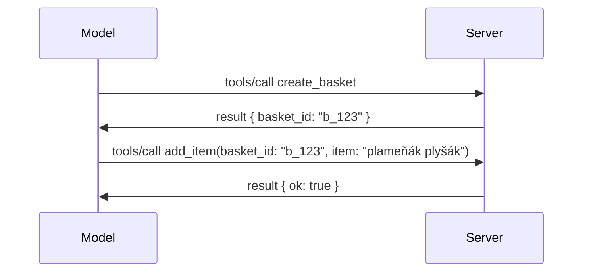

# Co se mění v MCP: Kandidát na vydání 2026-07-28

> **Stav:** Kandidát na vydání. Specifikace `2026-07-28` není v době psaní finální. Byla oznámena 21. května 2026 a plánuje se vydání 28. července 2026. Vše v této lekci popisuje kandidáta na vydání; před stavbou na ní se podívejte na [návrh specifikace](https://modelcontextprotocol.io/specification/draft) a její [changelog](https://modelcontextprotocol.io/specification/draft/changelog) pro nejnovější stav. Zbytek tohoto kurikula je napsán vůči aktuálnímu stabilnímu vydání, **MCP Specification 2025-11-25**, a bude aktualizován po vydání `2026-07-28`.

## Přehled

`2026-07-28` je největší revize MCP od jeho spuštění. Šest návrhů vylepšení specifikace (SEP) odstraňuje na úrovni protokolu sessions a činí MCP bezstavovým na transportní vrstvě, rozšíření se stávají první třídou verzovaného mechanismu a několik funkcí, které jste se naučili v tomto kurikulu dříve (Roots, Sampling, Logging), je podle nové politiky životního cyklu označeno jako zastaralé. Tato lekce shrnuje, co se mění, proč je to důležité a co to znamená pro kód, který jste již napsali vůči `2025-11-25`.

Zdroj: [The 2026-07-28 MCP Specification Release Candidate](https://blog.modelcontextprotocol.io/posts/2026-07-28-release-candidate/) (Blog Model Context Protocol, David Soria Parra a Den Delimarsky).

## Výukové cíle

Na konci této lekce budete umět:

- Vysvětlit, proč MCP přechází na bezstavové jádro protokolu a jaký problém to řeší pro horizontálně škálované nasazení.
- Popsat, jak je nahrazen handshake `initialize`/`initialized` a hlavička `Mcp-Session-Id`.
- Identifikovat nové hlavičky `Mcp-Method` a `Mcp-Name` a metadatové atributy kešování `ttlMs`/`cacheScope`.
- Poznat rámec Extensions a dvě rozšíření dodávaná s tímto vydáním: MCP Apps a Tasks.
- Vyjmenovat šest autorizacních SEP, které zpevňují soulady OAuth 2.0 / OIDC.
- Identifikovat, které základní funkce (Roots, Sampling, Logging) jsou nyní zastaralé, a co to v praxi znamená.
- Vysvětlit změnu na Full JSON Schema 2020-12 pro nástroje `inputSchema`/`outputSchema`.

## Bezstavový protokol

Hlavní změna: MCP se stává bezstavovým na úrovni protokolu.

### Před (2025-11-25): sessions vás připoutávají ke konkrétnímu serveru

Volání nástroje přes Streamable HTTP začíná handshake `initialize`. Server odpovídá hlavičkou `Mcp-Session-Id`, kterou musí každá následující žádost nést:

```http
POST /mcp HTTP/1.1
Mcp-Session-Id: 1868a90c-3a3f-4f5b
Content-Type: application/json

{"jsonrpc":"2.0","id":2,"method":"tools/call",
 "params":{"name":"search","arguments":{"q":"otters"}}}
```

Protože session je vázána na konkrétní server, horizontálně škálovaná nasazení potřebují **sticky routing** na load balanceru a **sdílené úložiště session** mezi instancemi.

### Po (2026-07-28): každá žádost je samostatná

```http
POST /mcp HTTP/1.1
MCP-Protocol-Version: 2026-07-28
Mcp-Method: tools/call
Mcp-Name: search
Content-Type: application/json

{"jsonrpc":"2.0","id":1,"method":"tools/call",
 "params":{"name":"search","arguments":{"q":"otters"},
           "_meta":{"io.modelcontextprotocol/clientInfo":{"name":"my-app","version":"1.0"}}}}
```

Jakákoli serverová instance může tuto žádost zpracovat. Klíčové změny:

- **Handshake `initialize`/`initialized` je odstraněn** ([SEP-2575](https://github.com/modelcontextprotocol/modelcontextprotocol/pull/2575)). Verze protokolu, informace o klientovi a schopnosti klienta jsou přesunuty do `_meta` každé žádosti. Nová metoda `server/discover` umožňuje klientovi předem načíst schopnosti serveru, pokud je potřebuje.
- **Hlavička `Mcp-Session-Id` a session na úrovni protokolu jsou odstraněny** ([SEP-2567](https://github.com/modelcontextprotocol/modelcontextprotocol/pull/2567)). Sticky routing a sdílené úložiště session již nejsou na úrovni protokolu potřeba.

### Bezstavný protokol, stavové aplikace

Odstranění session na úrovni protokolu neznamená, že váš server nemůže být stavový. Doporučený vzor je stejný, jaký HTTP API vždy používala: vytvořit explicitní identifikátor (například `basket_id`, `browser_id`) při jednom volání nástroje a model nechat posílat tento identifikátor jako běžný argument při pozdějších voláních.



To dělá stav viditelným a přiměřeným na straně modelu místo ukrytí ve metadatach transportní vrstvy a umožňuje jakékoli serverové instanci zpracovat jakékoli volání.

### Požadavky od serveru na klienta, restrukturalizované

Bezstavý protokol stále potřebuje způsob, jak může server požádat klienta o něco během volání (například výzvu k vyplnění):

- **Požadavky iniciované serverem lze vydávat pouze během aktivního zpracování klientovy žádosti** ([SEP-2260](https://github.com/modelcontextprotocol/modelcontextprotocol/pull/2260)) — dříve doporučení, nyní požadavek. Uživateli se nikdy nevyvolá výzva bez příčiny.
- **Požadavky s více koly zpětné vazby** ([SEP-2322](https://github.com/modelcontextprotocol/modelcontextprotocol/pull/2322)) nahrazují držení otevřeného SSE streamu. Server místo toho vrací `InputRequiredResult`:

  ```json
  {
    "resultType": "inputRequired",
    "inputRequests": {
      "confirm": {
        "type": "elicitation",
        "message": "Delete 3 files?",
        "schema": { "type": "boolean" }
      }
    },
    "requestState": "eyJzdGVwIjoxLCJmaWxlcyI6WyJhIiwiYiIsImMiXX0="
  }
  ```

  Klient shromažďuje odpovědi a znovu volá původní požadavek s `inputResponses` a zopakovaným `requestState`. Jakákoli serverová instance může opakování zpracovat, protože vše potřebné je v payloadu.

### Směrovatelné, kešovatelné, trasovatelné

Tři menší změny usnadňují provoz bezstavného provozu:

- **Hlavičky `Mcp-Method` a `Mcp-Name` jsou vyžadovány u Streamable HTTP** ([SEP-2243](https://github.com/modelcontextprotocol/modelcontextprotocol/pull/2243)), takže load balancery, brány a omezovače mohou trasovat operaci bez inspekce JSON těla. Servery odmítají žádosti, kde se hlavičky a tělo neshodují.
- **Výsledky `tools/list` a čtení zdrojů nesou metadata `ttlMs` a `cacheScope`** ([SEP-2549](https://github.com/modelcontextprotocol/modelcontextprotocol/pull/2549)), modelovaná podle HTTP `Cache-Control`. Klienti vědí, jak dlouho je seznam aktuální a zda je bezpečné jej sdílet mezi uživateli, bez potřeby dlouhodobého SSE streamu k poznání změn.
- **Propagace W3C Trace Context v `_meta` je zdokumentována** ([SEP-414](https://github.com/modelcontextprotocol/modelcontextprotocol/pull/414)), opravujíc názvy klíčů `traceparent`, `tracestate` a `baggage`, takže distribuované trasování může sledovat volání skrz klientské SDK, MCP server a další systémy v backendu kompatibilním s [OpenTelemetry](https://opentelemetry.io/).

## Rozšíření se stávají první třídou

Rozšíření existovala neformálně v `2025-11-25`. [SEP-2133](https://github.com/modelcontextprotocol/modelcontextprotocol/pull/2133) je formalizuje:

- Rozšíření jsou identifikována pomocí ID ve formátu reverse-DNS.
- Jsou vyjednávána přes mapu `extensions` v klientských a serverových schopnostech.
- Žijí ve vlastních repozitářích `ext-*` s delegovanými správci a verzují se nezávisle na jádru specifikace.
- Nová větev rozšíření (Extensions Track) v procesu SEP jim umožňuje cestu od experimentálního stádiu k oficiálnímu.

Toto vydání přináší dvě oficiální rozšíření.

### MCP Apps: uživatelská rozhraní vykreslovaná serverem

[MCP Apps](https://blog.modelcontextprotocol.io/posts/2026-01-26-mcp-apps/) ([SEP-1865](https://github.com/modelcontextprotocol/modelcontextprotocol/pull/1865)) umožňují serverům dodávat interaktivní HTML rozhraní, která hosté vykreslují v sandboxovaném iframe. Nástroje deklarují své šablony UI předem, aby hostitelé mohli je přednačíst, ukládat do keše a bezpečnostně zkontrolovat před tím, než cokoliv poběží. Základy tohoto jste již pokryli v [Lekci 15: MCP Apps](../03-GettingStarted/15-mcp-apps/README.md) — v rámci rozšíření je MCP Apps nyní formálně rozšířením místo experimentální funkce jádra.

### Tasks přechází na rozšíření

Tasks byly v `2025-11-25` experimentální funkcí jádra. Produkční použití odhalilo dost funkcí k přepracování, takže správným místem je rozšíření: [Tasks extension](https://github.com/modelcontextprotocol/modelcontextprotocol/pull/2663) mění životní cyklus kolem bezstavného modelu — server může odpovědět na `tools/call` úkolem (task handle) a klient s ním pracuje přes `tasks/get`, `tasks/update` a `tasks/cancel`. Vytváření úkolů je řízeno serverem: klient inzeruje rozšíření a server rozhodne, kdy volání spustit jako úkol. `tasks/list` je zcela odstraněn, protože jej nelze bezpečně omezit bez sessions.

> **Poznámka k migraci:** pokud jste implementovali experimentalní Tasks API `2025-11-25`, budete muset přejít na nový životní cyklus rozšíření — není zpětně kompatibilní.

## Zpevnění autorizace

Šest SEP posiluje [autorizacní specifikaci](https://modelcontextprotocol.io/specification/draft/basic/authorization), aby lépe odpovídala reálným nasazením OAuth 2.0 / OpenID Connect:

| SEP | Změna |
|---|---|
| [SEP-2468](https://github.com/modelcontextprotocol/modelcontextprotocol/pull/2468) | Klienti musí ověřovat parametr `iss` u odpovědí autorizace podle [RFC 9207](https://www.rfc-editor.org/rfc/rfc9207), čímž se zmírňují běžné útoky na zaměnění v MCP s modelem jednoho klienta a mnoha serverů. Budoucí verze vyžaduje odmítnutí odpovědí bez `iss`. |
| [SEP-837](https://github.com/modelcontextprotocol/modelcontextprotocol/pull/837) | Klienti deklarují svůj typ aplikace OpenID Connect `application_type` během Dynamické registrace klienta, aby se zabránilo tomu, že autorizační servery nastaví desktop/CLI klienta jako `"web"` a odmítnou jeho localhost redirect URI. |
| [SEP-2352](https://github.com/modelcontextprotocol/modelcontextprotocol/pull/2352) | Klienti přivazují registrované přihlašovací údaje k `issuer` autorizacního serveru a znovu se registrují, pokud se zdroj přesune mezi autorizačními servery. |
| [SEP-2207](https://github.com/modelcontextprotocol/modelcontextprotocol/pull/2207) | Dokumentuje, jak žádat o obnovovací tokeny od autorizačních serverů používajících OpenID Connect styl. |
| [SEP-2350](https://github.com/modelcontextprotocol/modelcontextprotocol/pull/2350) | Vyjasňuje kumulaci rozsahu během step-up autorizace. |
| [SEP-2351](https://github.com/modelcontextprotocol/modelcontextprotocol/pull/2351) | Vyjasňuje příponu `.well-known` pro discovery. |

Pokud dnes stavíte autorizacní server pro MCP, začněte dodávat `iss` u autorizacních odpovědí — podívejte se na [02-Security](../02-Security/README.md) pro aktuální autorizacní doporučení, na která toto naváže.

## Roots, Sampling a Logging jsou zastaralé

Podle nové [politiky životního cyklu funkcí](https://github.com/modelcontextprotocol/modelcontextprotocol/pull/2577) ([SEP-2577](https://github.com/modelcontextprotocol/modelcontextprotocol/pull/2577)) tři základní klientské primitivy, o kterých jste se učili v [Core Concepts](./README.md#roots), přecházejí do stavu **Zastaralé**:

| Funkce | Doporučená náhrada |
|---|---|
| Roots | Parametry nástroje, URI zdrojů, nebo konfigurace serveru |
| Sampling | Přímá integrace s API poskytovatelů LLM |
| Logging | `stderr` pro stdio transporty; OpenTelemetry pro strukturovanou pozorovatelnost |

Jedná se o **jen anotací označené deprekování**: metody, typy a příznaky schopností fungují i v tomto vydání a ve všech verzích specifikace vydaných do jednoho roku od tohoto. Odebrání některé z nich bude vyžadovat samostatný SEP podle politiky životního cyklu — takže dnes nic nepřestane fungovat ve vašich existujících [Sampling](../03-GettingStarted/14-sampling/README.md) příkladech, ale nové servery by měly preferovat náhradní vzory výše.

## Plná JSON Schema 2020-12 pro nástroje

`inputSchema` a `outputSchema` nástrojů jsou vylepšena na plné [JSON Schema 2020-12](https://json-schema.org/draft/2020-12) ([SEP-2106](https://github.com/modelcontextprotocol/modelcontextprotocol/pull/2106)):

- Vstupní schémata stále vyžadují kořenové omezení `type: "object"`, ale nyní dovolují kompozici (`oneOf`, `anyOf`, `allOf`), podmínky a reference (`$ref`, `$defs`).
- Výstupní schémata nejsou omezena a `structuredContent` nyní může být jakákoliv hodnota JSON, ne pouze objekt.
- Implementace nesmějí automaticky dereferencovat externí `$ref` URI a měly by omezit hloubku schématu a dobu validace (kvůli obavám z DoS, které je třeba zvážit při validaci na straně serveru).

Samostatně se mění chybový kód pro chybějící zdroj z MCP-specifického `-32002` na standardní JSON-RPC `-32602` (Invalid Params) ([SEP-2164](https://github.com/modelcontextprotocol/modelcontextprotocol/pull/2164)). Pokud váš klient kontroluje doslovnou hodnotu `-32002`, bude nutné jej aktualizovat.

## Jak protokol dále vyvíjet

Toto vydání obsahuje tzv. breaking changes, které správcové MCP neplánují jako pravidlo do budoucna. Tři řídící SEP mají zabránit opakování:

- **Politika životního cyklu funkcí** dává každé funkci cestu Aktivní → Zastaralá → Odebraná s minimálně dvanáctiměsíční mírou mezi zastaráním a nejranějším možným odebráním.
- **Rámec pro rozšíření** umožňuje nové schopnosti vydávat jako volitelné rozšíření a stabilizovat je tam předtím, než se případně přesunou do jádra specifikace.

- Standardní SEP na úrovni tracku nemůže dosáhnout finálního stavu, dokud nebude odpovídající scénář zahrnut do [conformance suite](https://github.com/modelcontextprotocol/conformance) ([SEP-2484](https://github.com/modelcontextprotocol/modelcontextprotocol/pull/2484)) — toho samého testovacího balíčku, proti kterému se oficiální SDK hodnotí v rámci [SDK tier systému](https://github.com/modelcontextprotocol/modelcontextprotocol/pull/1777).

## Časový plán vydání a validace

- Release kandidát byl zamčen 21. května 2026.
- Finální specifikace je naplánována na 28. července 2026.
- Deset týdnů mezi těmito daty umožňuje správcům SDK a implementátorům klientů ověřit změny na reálných pracovních zátěžích; SDK Tier 1 by měly během této doby dodat podporu podle [SDK tier systému](https://modelcontextprotocol.io/docs/sdk).
- Sledujte celý soubor změn v [návrhu specifikace](https://modelcontextprotocol.io/specification/draft) a jeho [changelog](https://modelcontextprotocol.io/specification/draft/changelog).

## Co to znamená pro tento kurz

Vše, co jste se dosud v tomto kurzu naučili, cílí na **2025-11-25**, což zůstává aktuální stabilní specifikací do vydání `2026-07-28`. Konkrétně:

- **Sezení a handshake `initialize`** (pokryté v [Core Concepts](./README.md) a [Lekce 6: HTTP Streaming](../03-GettingStarted/06-http-streaming/README.md)) stále fungují podle dnešní dokumentace, ale očekávejte, že je nahradí model bezstavých požadavků, jakmile přejdete na SDK kompatibilní s `2026-07-28`.
- **Sampling a kořeny** (také pokryté v [Core Concepts](./README.md)) zůstávají plně funkční, ale jsou označeny jako zastaralé — nové návrhy by měly upřednostňovat výše uvedené náhradní vzory.
- **Experimentální funkce Tasks**, pokud jste ji používali, bude třeba migrovat na nový životní cyklus rozšíření Tasks.
- **MCP aplikace** ([Lekce 15](../03-GettingStarted/15-mcp-apps/README.md)) praxi neovlivní; jednoduše budou přesunuty pod formální rámec Extensions.

## Další zdroje

- [Release kandidát specifikace MCP z 28.07.2026 (blog post)](https://blog.modelcontextprotocol.io/posts/2026-07-28-release-candidate/)
- [Budoucnost MCP transportů](https://blog.modelcontextprotocol.io/posts/2025-12-19-mcp-transport-future/)
- [MCP návrh specifikace](https://modelcontextprotocol.io/specification/draft)
- [MCP draft changelog](https://modelcontextprotocol.io/specification/draft/changelog)
- [SEP směrnice](https://modelcontextprotocol.io/community/sep-guidelines)
- [MCP SDK Tier systém](https://modelcontextprotocol.io/docs/sdk)

## Další kroky

Vraťte se zpět na [Core Concepts](./README.md) nebo pokračujte do [Security](../02-Security/README.md), abyste viděli, jak současné pokyny z `2025-11-25` odpovídají tomu, co přijde.

---

<!-- CO-OP TRANSLATOR DISCLAIMER START -->
**Prohlášení o omezení odpovědnosti**:
Tento dokument byl přeložen pomocí AI překladatelské služby [Co-op Translator](https://github.com/Azure/co-op-translator). Přestože usilujeme o co největší přesnost, mějte prosím na paměti, že automatizované překlady mohou obsahovat chyby nebo nepřesnosti. Originální dokument v jeho mateřském jazyce by měl být považován za autoritativní zdroj. Pro kritické informace se doporučuje profesionální lidský překlad. Nejsme odpovědní za jakékoli nedorozumění nebo nesprávné interpretace vzniklé použitím tohoto překladu.
<!-- CO-OP TRANSLATOR DISCLAIMER END -->