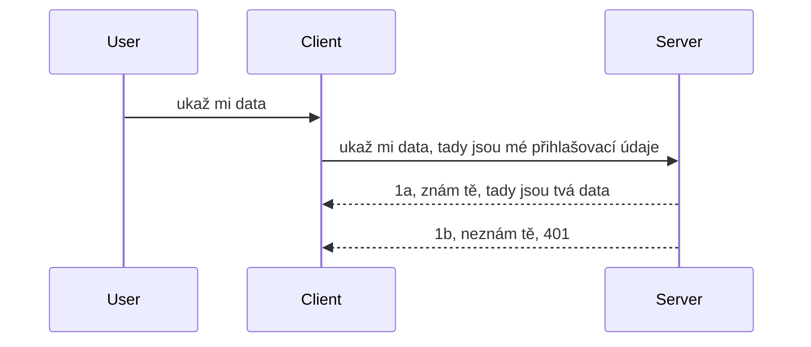

# Jednoduchá autentizace

MCP SDK podporují používání OAuth 2.1, což je, pokud máme být upřímní, docela složitý proces zahrnující koncepty jako auth server, resource server, zasílání přihlašovacích údajů, získání kódu, výměnu kódu za bearer token, dokud konečně nezískáte data ze zdroje. Pokud nejste zvyklí na OAuth, což je skvělá věc k implementaci, je dobré začít na základní úrovni autentizace a postupně budovat stále lepší a lepší zabezpečení. Proto tato kapitola existuje – aby vás postupně připravila na pokročilejší autentizaci.

## Autentizace, co tím myslíme?

Autentizace je zkratka pro autentikaci a autorizaci. Myšlenka je, že potřebujeme udělat dvě věci:

- **Autentikace**, což je proces zjišťování, zda člověku dovolíme vstoupit do našeho domu, tedy zda má právo být „tady“, tedy má přístup k našemu resource serveru, kde jsou k dispozici funkce našeho MCP Serveru.
- **Autorizace**, je proces zjistit, zda uživatel by měl mít přístup ke konkrétním zdrojům, které žádá, například tyto objednávky nebo tyto produkty, nebo zda smí obsah číst, ale nesmí ho mazat, jako další příklad.

## Přihlašovací údaje: jak systému řekneme, kdo jsme

No, většina webových vývojářů začíná přemýšlet v termínech předání přihlašovacích údajů serveru, obvykle tajemství, které říká, zda smí být „přihlášeni“ – autentizace. Toto tajemství bývá obvykle base64 zakódovaná verze uživatelského jména a hesla nebo API klíč, který jednoznačně identifikuje daného uživatele.

To zahrnuje odesílání přes hlavičku nazvanou „Authorization“ takto:

```json
{ "Authorization": "secret123" }
```

Toto se obvykle nazývá základní autentizace (basic authentication). Jak tedy tento celý tok funguje, je následující způsob:



Nyní, když chápeme, jak to funguje z pohledu toku, jak to implementujeme? Většina webových serverů má koncept nazývaný middleware, kus kódu, který běží jako součást požadavku a může ověřit přihlašovací údaje, a pokud jsou platné, nechá požadavek projít. Pokud požadavek nemá platné přihlašovací údaje, dostanete chybu autentizace. Pojďme se podívat, jak lze toto implementovat:

**Python**

```python
class AuthMiddleware(BaseHTTPMiddleware):
    async def dispatch(self, request, call_next):

        has_header = request.headers.get("Authorization")
        if not has_header:
            print("-> Missing Authorization header!")
            return Response(status_code=401, content="Unauthorized")

        if not valid_token(has_header):
            print("-> Invalid token!")
            return Response(status_code=403, content="Forbidden")

        print("Valid token, proceeding...")
       
        response = await call_next(request)
        # přidejte jakékoliv vlastní hlavičky zákazníka nebo nějak změňte odpověď
        return response


starlette_app.add_middleware(CustomHeaderMiddleware)
```

Zde máme:

- Vytvořen middleware nazvaný `AuthMiddleware`, jehož metoda `dispatch` je volána webovým serverem.
- Přidán middleware do webového serveru:

    ```python
    starlette_app.add_middleware(AuthMiddleware)
    ```

- Napsána validační logika, která kontroluje, zda je hlavička Authorization přítomna a zda je zaslané tajemství platné:

    ```python
    has_header = request.headers.get("Authorization")
    if not has_header:
        print("-> Missing Authorization header!")
        return Response(status_code=401, content="Unauthorized")

    if not valid_token(has_header):
        print("-> Invalid token!")
        return Response(status_code=403, content="Forbidden")
    ```

    pokud je tajemství přítomné a platné, necháme požadavek projít zavoláním `call_next` a vrátíme odpověď.

    ```python
    response = await call_next(request)
    # přidejte jakékoli zákaznické hlavičky nebo nějakým způsobem změňte odpověď
    return response
    ```

Funguje to tak, že když je směrován webový požadavek na server, middleware bude zavolán a podle jeho implementace buď požadavek nechá projít, nebo vrátí chybu, která indikuje, že klient nesmí pokračovat.

**TypeScript**

Zde vytváříme middleware s populárním frameworkem Express a zachytáváme požadavek, než dosáhne MCP Serveru. Zde je kód:

```typescript
function isValid(secret) {
    return secret === "secret123";
}

app.use((req, res, next) => {
    // 1. Je přítomen autorizační hlavička?
    if(!req.headers["Authorization"]) {
        res.status(401).send('Unauthorized');
    }
    
    let token = req.headers["Authorization"];

    // 2. Zkontrolujte platnost.
    if(!isValid(token)) {
        res.status(403).send('Forbidden');
    }

   
    console.log('Middleware executed');
    // 3. Předá požadavek do dalšího kroku v požadavkovém procesu.
    next();
});
```

V tomto kódu:

1. Kontrolujeme, zda je hlavička Authorization vůbec přítomna, pokud ne, posíláme chybu 401.
2. Ověříme, že přihlašovací údaje/token jsou platné, pokud ne, posíláme chybu 403.
3. Nakonec necháme požadavek pokračovat v řetězci a vrátíme požadovaný zdroj.

## Cvičení: Implementujte autentizaci

Vezměme naše znalosti a zkusme to implementovat. Zde je plán:

Server

- Vytvořit webový server a instanci MCP.
- Implementovat middleware pro server.

Klient

- Odeslat webový požadavek s přihlašovacími údaji přes hlavičku.

### -1- Vytvořit webový server a instanci MCP

> **Díváme se dopředu:** příklad TypeScript níže sleduje HTTP transporty v mapě `transports` klíčované `mcp-session-id` podle **MCP Specification 2025-11-25**. Release kandidát `2026-07-28` odstraňuje handshake `initialize` a session ID úplně, takže tato mapa transportů podle relace zaniká a přechází se na bezstavové, samostatné požadavky. Viz [Co se mění v MCP: Release candidate 2026-07-28](../../01-CoreConcepts/mcp-2026-07-28-release-candidate.md).

V prvním kroku musíme vytvořit instanci webového serveru a MCP Server.

**Python**

Zde vytvoříme instanci MCP serveru, vytvoříme starlette webovou aplikaci a hostujeme ji pomocí uvicorn.

```python
# vytváření MCP serveru

app = FastMCP(
    name="MCP Resource Server",
    instructions="Resource Server that validates tokens via Authorization Server introspection",
    host=settings["host"],
    port=settings["port"],
    debug=True
)

# vytváření webové aplikace starlette
starlette_app = app.streamable_http_app()

# spouštění aplikace přes uvicorn
async def run(starlette_app):
    import uvicorn
    config = uvicorn.Config(
            starlette_app,
            host=app.settings.host,
            port=app.settings.port,
            log_level=app.settings.log_level.lower(),
        )
    server = uvicorn.Server(config)
    await server.serve()

run(starlette_app)
```

V tomto kódu:

- Vytvoření MCP Serveru.
- Sestavení starlette webové aplikace z MCP Serveru pomocí `app.streamable_http_app()`.
- Hostování a spuštění webové aplikace pomocí uvicorn `server.serve()`.

**TypeScript**

Zde vytvoříme instanci MCP Serveru.

```typescript
const server = new McpServer({
      name: "example-server",
      version: "1.0.0"
    });

    // ... nastavte zdroje serveru, nástroje a výzvy ...
```

Tuto tvorbu MCP Serveru budeme potřebovat provést uvnitř definice POST /mcp trasy, proto vezměme výše uvedený kód a přesuneme ho takto:

```typescript
import express from "express";
import { randomUUID } from "node:crypto";
import { McpServer } from "@modelcontextprotocol/sdk/server/mcp.js";
import { StreamableHTTPServerTransport } from "@modelcontextprotocol/sdk/server/streamableHttp.js";
import { isInitializeRequest } from "@modelcontextprotocol/sdk/types.js"

const app = express();
app.use(express.json());

// Mapa pro uložení transportů podle ID relace
const transports: { [sessionId: string]: StreamableHTTPServerTransport } = {};

// Zpracování POST požadavků pro komunikaci klient-server
app.post('/mcp', async (req, res) => {
  // Kontrola existujícího ID relace
  const sessionId = req.headers['mcp-session-id'] as string | undefined;
  let transport: StreamableHTTPServerTransport;

  if (sessionId && transports[sessionId]) {
    // Znovupoužití existujícího transportu
    transport = transports[sessionId];
  } else if (!sessionId && isInitializeRequest(req.body)) {
    // Nový požadavek na inicializaci
    transport = new StreamableHTTPServerTransport({
      sessionIdGenerator: () => randomUUID(),
      onsessioninitialized: (sessionId) => {
        // Uložení transportu podle ID relace
        transports[sessionId] = transport;
      },
      // Ochrana proti DNS rebindingu je ve výchozím nastavení vypnutá pro zpětnou kompatibilitu. Pokud tento server provozujete
      // lokálně, ujistěte se, že nastavíte:
      // enableDnsRebindingProtection: true,
      // allowedHosts: ['127.0.0.1'],
    });

    // Vyčistit transport po uzavření
    transport.onclose = () => {
      if (transport.sessionId) {
        delete transports[transport.sessionId];
      }
    };
    const server = new McpServer({
      name: "example-server",
      version: "1.0.0"
    });

    // ... nastavení serverových zdrojů, nástrojů a výzev ...

    // Připojení k MCP serveru
    await server.connect(transport);
  } else {
    // Neplatný požadavek
    res.status(400).json({
      jsonrpc: '2.0',
      error: {
        code: -32000,
        message: 'Bad Request: No valid session ID provided',
      },
      id: null,
    });
    return;
  }

  // Zpracovat požadavek
  await transport.handleRequest(req, res, req.body);
});

// Znovupoužitelný handler pro GET a DELETE požadavky
const handleSessionRequest = async (req: express.Request, res: express.Response) => {
  const sessionId = req.headers['mcp-session-id'] as string | undefined;
  if (!sessionId || !transports[sessionId]) {
    res.status(400).send('Invalid or missing session ID');
    return;
  }
  
  const transport = transports[sessionId];
  await transport.handleRequest(req, res);
};

// Zpracování GET požadavků pro oznámení ze serveru klientovi přes SSE
app.get('/mcp', handleSessionRequest);

// Zpracování DELETE požadavků pro ukončení relace
app.delete('/mcp', handleSessionRequest);

app.listen(3000);
```

Vidíte, jak byla tvorba MCP Serveru přesunuta uvnitř `app.post("/mcp")`.

Pokračujme k dalšímu kroku – vytvoření middleware pro validaci přicházejících přihlašovacích údajů.

### -2- Implementujte middleware pro server

Pojďme na middleware část. Zde vytvoříme middleware, který hledá přihlašovací údaje v hlavičce `Authorization` a ověří je. Pokud jsou přijatelné, požadavek pokračuje ve vykonání toho, co má (například vypsat nástroje, číst zdroj nebo cokoliv, co MCP klient žádá).

**Python**

Pro vytvoření middleware potřebujeme třídu, která dědí z `BaseHTTPMiddleware`. Jsou zde dva zajímavé kusy:

- Požadavek `request`, ze kterého čteme informace z hlaviček.
- `call_next` je callback, který musíme zavolat, když klient přinesl přihlašovací údaje, které akceptujeme.

Nejprve musíme ošetřit případ, kdy hlavička `Authorization` chybí:

```python
has_header = request.headers.get("Authorization")

# žádný záhlaví přítomno, chyba 401, jinak pokračovat.
if not has_header:
    print("-> Missing Authorization header!")
    return Response(status_code=401, content="Unauthorized")
```

Zde posíláme zprávu 401 unauthorized, protože klient selhal v autentizaci.

Dále, pokud přihlašovací údaje byly zaslány, potřebujeme ověřit jejich platnost takto:

```python
 if not valid_token(has_header):
    print("-> Invalid token!")
    return Response(status_code=403, content="Forbidden")
```

Všimněte si, že posíláme zprávu 403 forbidden. Podívejme se na celý middleware níže, který implementuje vše, co jsme zmínili výše:

```python
class AuthMiddleware(BaseHTTPMiddleware):
    async def dispatch(self, request, call_next):

        has_header = request.headers.get("Authorization")
        if not has_header:
            print("-> Missing Authorization header!")
            return Response(status_code=401, content="Unauthorized")

        if not valid_token(has_header):
            print("-> Invalid token!")
            return Response(status_code=403, content="Forbidden")

        print("Valid token, proceeding...")
        print(f"-> Received {request.method} {request.url}")
        response = await call_next(request)
        response.headers['Custom'] = 'Example'
        return response

```

Skvěle, ale co funkce `valid_token`? Zde je níže:

```python
# NEPOUŽÍVEJTE pro produkci - vylepšete to !!
def valid_token(token: str) -> bool:
    # odstraňte prefix "Bearer "
    if token.startswith("Bearer "):
        token = token[7:]
        return token == "secret-token"
    return False
```

Samozřejmě by to mělo být ještě vylepšeno.

DŮLEŽITÉ: Nikdy byste neměli mít tajemství jako toto přímo v kódu. Ideálně byste měli hodnotu k porovnání získávat z datového zdroje nebo od IDP (poskytovatele identity) nebo ještě lépe, nechte validaci provádět IDP.

**TypeScript**

Pro implementaci s Express musíme zavolat metodu `use`, která přijímá middleware funkce.

Musíme:

- Pracovat s proměnnou požadavku a kontrolovat předané přihlašovací údaje v `Authorization` vlastnosti.
- Validovat přihlašovací údaje, pokud jsou platné, nechat požadavek pokračovat a uskutečnit MCP požadavek klienta (např. vypsat nástroje, číst zdroj nebo cokoliv dalšího týkajícího se MCP).

Zde kontrolujeme, zda je hlavička `Authorization` přítomna, a pokud ne, zastavujeme požadavek:

```typescript
if(!req.headers["authorization"]) {
    res.status(401).send('Unauthorized');
    return;
}
```

Pokud hlavička není vůbec zaslána, dostanete chybu 401.

Dále ověřujeme platnost přihlašovacích údajů, pokud nejsou platné opět požadavek zastavíme, ale s trochu jinou zprávou:

```typescript
if(!isValid(token)) {
    res.status(403).send('Forbidden');
    return;
} 
```

Všimněte si, že nyní dostanete chybu 403.

Zde je kompletní kód:

```typescript
app.use((req, res, next) => {
    console.log('Request received:', req.method, req.url, req.headers);
    console.log('Headers:', req.headers["authorization"]);
    if(!req.headers["authorization"]) {
        res.status(401).send('Unauthorized');
        return;
    }
    
    let token = req.headers["authorization"];

    if(!isValid(token)) {
        res.status(403).send('Forbidden');
        return;
    }  

    console.log('Middleware executed');
    next();
});
```

Nastavili jsme webový server, aby přijal middleware, který kontroluje přihlašovací údaje, které nám klient posílá. A co samotný klient?

### -3- Odeslat webový požadavek s přihlašovacími údaji přes hlavičku

Musíme zajistit, aby klient posílal přihlašovací údaje přes hlavičku. Protože toho dosáhneme pomocí MCP klienta, musíme zjistit, jak to udělat.

**Python**

Pro klienta potřebujeme poslat hlavičku s přihlašovacími údaji takto:

```python
# NEzapisujte hodnotu přímo do kódu, mějte ji minimálně v proměnné prostředí nebo v bezpečnějším úložišti
token = "secret-token"

async with streamablehttp_client(
        url = f"http://localhost:{port}/mcp",
        headers = {"Authorization": f"Bearer {token}"}
    ) as (
        read_stream,
        write_stream,
        session_callback,
    ):
        async with ClientSession(
            read_stream,
            write_stream
        ) as session:
            await session.initialize()
      
            # TODO, co chcete provést na klientovi, např. vypsat nástroje, zavolat nástroje apod.
```

Všimněte si, že nastavujeme vlastnost `headers` takto: ` headers = {"Authorization": f"Bearer {token}"}`.

**TypeScript**

Můžeme to vyřešit ve dvou krocích:

1. Naplnit konfigurační objekt našimi přihlašovacími údaji.
2. Předat konfigurační objekt transportu.

```typescript

// NEtvrdě kódujte hodnotu, jak je zde ukázáno. Minimálně ji mějte jako proměnnou prostředí a používejte něco jako dotenv (v režimu vývoje).
let token = "secret123"

// definujte objekt s možnostmi klientského přenosu
let options: StreamableHTTPClientTransportOptions = {
  sessionId: sessionId,
  requestInit: {
    headers: {
      "Authorization": "secret123"
    }
  }
};

// předávejte objekt možností do přenosu
async function main() {
   const transport = new StreamableHTTPClientTransport(
      new URL(serverUrl),
      options
   );
```

Zde vidíte, jak jsme museli vytvořit objekt `options` a umístit hlavičky pod vlastnost `requestInit`.

DŮLEŽITÉ: Jak to však zlepšit? Současná implementace má několik problémů. Za prvé, předávání takových přihlašovacích údajů je docela riskantní, pokud alespoň nemáte HTTPS. I tak mohou být přihlašovací údaje ukradeny, proto potřebujete systém, kde můžete snadno zrušit token a přidat další kontroly, například odkud na světě pochází, zda požadavky nepřicházejí příliš často (chování jako bot), krátce řečeno je tu celá řada starostí.

Je však třeba říct, že pro velmi jednoduché API, kde nechcete, aby někdo volal vaše API bez autentizace, je to dobrý začátek.

S tím řečeno, zkusme trochu zpevnit zabezpečení použitím standardizovaného formátu jako JSON Web Token, známého také jako JWT nebo „JOT“ tokeny.

## JSON Web Tokeny, JWT

Snažíme se tedy zlepšit věci oproti posílání velmi jednoduchých přihlašovacích údajů. Jaká jsou okamžitá zlepšení přijetím JWT?

- **Zlepšení zabezpečení**. V základní autentizaci posíláte uživatelské jméno a heslo jako base64 zakódovaný token (nebo posíláte API klíč) znovu a znovu, což zvyšuje riziko. S JWT pošlete své uživatelské jméno a heslo a získáte token na oplátku, který je časově omezený, tudíž vyprší. JWT umožňuje snadno používat jemnozrnnou kontrolu přístupu pomocí rolí, scope a oprávnění.
- **Bezstavovost a škálovatelnost**. JWT jsou samostatné, nesou veškeré informace o uživateli a odstraňují nutnost udržovat na serveru ukládání session. Token je možné ověřit i lokálně.
- **Interoperabilita a federace**. JWT je středobodem Open ID Connect a používá se s známými poskytovateli identity jako Entra ID, Google Identity a Auth0. Také umožňuje single sign on a mnohem více, čímž je enterprise-grade řešení.
- **Modularita a flexibilita**. JWT může být také použito s API Gateways jako Azure API Management, NGINX a další. Podporuje scénáře autentizace i komunikace server-ke-serveru včetně impersonace a delegace.
- **Výkon a cacheování**. JWT lze po rozkódování cacheovat, což snižuje potřebu opětovného parsování. To pomáhá zejména aplikacím s vysokým provozem, protože zlepšuje propustnost a snižuje zatížení infrastruktury.
- **Pokročilé funkce**. Podporuje též introspekci (ověření platnosti na serveru) a revokaci (zneplatnění tokenu).

S těmito výhodami si ukažme, jak posunout naši implementaci na vyšší úroveň.

## Převod základní autentizace na JWT

Takže změny, které musíme provést na vyšší úrovni, jsou:

- **Naučit se sestavit JWT token** a připravit ho k odeslání z klienta na server.
- **Validovat JWT token**, a pokud je platný, umožnit klientovi získat zdroje.
- **Bezpečné uložení tokenu**. Jak token uložit.
- **Ochrana cest**. Potřebujeme chránit cesty, v našem případě chránit cesty a konkrétní MCP funkce.
- **Přidat refresh tokeny**. Zajistit krátkodobé tokeny s dlouhodobými refresh tokeny, které lze použít k získání nových tokenů po vypršení platnosti. Zajistit také refresh endpoint a strategii rotace.

### -1- Sestavit JWT token

Nejprve má JWT token následující části:

- **header**, použitý algoritmus a typ tokenu.
- **payload**, tvrzení (claims), jako sub (uživatel nebo entita, kterou token reprezentuje – v autentizačním scénáři typicky uživatelské ID), exp (kdy token vyprší), role (role).
- **signature**, podepsaná tajemstvím nebo soukromým klíčem.

Pro to musíme sestavit header, payload a zakódovaný token.

**Python**

```python

import jwt
import jwt
from jwt.exceptions import ExpiredSignatureError, InvalidTokenError
import datetime

# Tajný klíč použitý k podepsání JWT
secret_key = 'your-secret-key'

header = {
    "alg": "HS256",
    "typ": "JWT"
}

# informace o uživateli a jeho nároky a doba vypršení platnosti
payload = {
    "sub": "1234567890",               # Předmět (ID uživatele)
    "name": "User Userson",                # Vlastní nárok
    "admin": True,                     # Vlastní nárok
    "iat": datetime.datetime.utcnow(),# Vydáno
    "exp": datetime.datetime.utcnow() + datetime.timedelta(hours=1)  # Vypršení platnosti
}

# zakódovat to
encoded_jwt = jwt.encode(payload, secret_key, algorithm="HS256", headers=header)
```

V uvedeném kódu jsme:

- Definovali header s algoritmem HS256 a typem JWT.
- Sestavili payload obsahující subjekt (uživatelské ID), uživatelské jméno, roli, kdy byl token vydán a kdy vyprší, čímž implementujeme výše zmíněný časově omezený aspekt.

**TypeScript**

Zde budeme potřebovat některé závislosti, které nám pomohou sestavit JWT token.

Závislosti

```sh

npm install jsonwebtoken
npm install --save-dev @types/jsonwebtoken
```

Nyní, když to máme, vytvořme header, payload a přes ně vygenerujme zakódovaný token.

```typescript
import jwt from 'jsonwebtoken';

const secretKey = 'your-secret-key'; // Použijte env proměnné v produkci

// Definujte payload
const payload = {
  sub: '1234567890',
  name: 'User usersson',
  admin: true,
  iat: Math.floor(Date.now() / 1000), // Vydáno v
  exp: Math.floor(Date.now() / 1000) + 60 * 60 // Vyprší za 1 hodinu
};

// Definujte hlavičku (volitelné, jsonwebtoken nastavuje výchozí hodnoty)
const header = {
  alg: 'HS256',
  typ: 'JWT'
};

// Vytvořte token
const token = jwt.sign(payload, secretKey, {
  algorithm: 'HS256',
  header: header
});

console.log('JWT:', token);
```

Tento token je:

Podepsaný pomocí HS256
Platný 1 hodinu
Obsahuje tvrzení jako sub, name, admin, iat a exp.

### -2- Validovat token

Také budeme potřebovat token ověřit, to by měla dělat strana serveru, aby bylo jisté, že to, co nám klient posílá, je skutečně platné. Je třeba provést mnoho kontrol od validace struktury až po platnost. Doporučuje se také přidat další kontroly například zda uživatel je ve vašem systému a další.

Pro validaci tokenu je potřeba ho dekódovat, abychom ho mohli číst a začít kontrolovat platnost:

**Python**

```python

# Dekódujte a ověřte JWT
try:
    decoded = jwt.decode(token, secret_key, algorithms=["HS256"])
    print("✅ Token is valid.")
    print("Decoded claims:")
    for key, value in decoded.items():
        print(f"  {key}: {value}")
except ExpiredSignatureError:
    print("❌ Token has expired.")
except InvalidTokenError as e:
    print(f"❌ Invalid token: {e}")

```


V tomto kódu voláme `jwt.decode` s tokenem, tajným klíčem a zvoleným algoritmem jako vstupem. Všimněte si, že používáme konstrukci try-catch, protože neúspěšná validace vede ke vzniku chyby.

**TypeScript**

Zde je potřeba zavolat `jwt.verify`, abychom získali dekódovanou verzi tokenu, kterou můžeme dále analyzovat. Pokud tento volání selže, znamená to, že struktura tokenu je nesprávná nebo již není platný.

```typescript

try {
  const decoded = jwt.verify(token, secretKey);
  console.log('Decoded Payload:', decoded);
} catch (err) {
  console.error('Token verification failed:', err);
}
```

POZNÁMKA: jak již bylo zmíněno dříve, měli bychom provést další kontroly, abychom zajistili, že tento token odkazuje na uživatele v našem systému a že uživatel má práva, která tvrdí, že má.

Dále se podíváme na řízení přístupu založené na rolích, známé také jako RBAC.

## Přidání řízení přístupu založeného na rolích

Myšlenka je taková, že chceme vyjádřit, že různé role mají různá oprávnění. Například předpokládáme, že administrátor může dělat vše, běžný uživatel může číst/zapisovat a host může pouze číst. Zde jsou tedy některé možné úrovně oprávnění:

- Admin.Write 
- User.Read
- Guest.Read

Podívejme se, jak můžeme takové řízení implementovat pomocí middleware. Middleware lze přidat pro jednotlivé cesty i pro všechny cesty.

**Python**

```python
from starlette.middleware.base import BaseHTTPMiddleware
from starlette.responses import JSONResponse
import jwt

# NEMĚJ tajný kód přímo v kódu, toto je pouze pro demonstrační účely. Načti ho z bezpečného místa.
SECRET_KEY = "your-secret-key" # vlož to do proměnné prostředí
REQUIRED_PERMISSION = "User.Read"

class JWTPermissionMiddleware(BaseHTTPMiddleware):
    async def dispatch(self, request, call_next):
        auth_header = request.headers.get("Authorization")
        if not auth_header or not auth_header.startswith("Bearer "):
            return JSONResponse({"error": "Missing or invalid Authorization header"}, status_code=401)

        token = auth_header.split(" ")[1]
        try:
            decoded = jwt.decode(token, SECRET_KEY, algorithms=["HS256"])
        except jwt.ExpiredSignatureError:
            return JSONResponse({"error": "Token expired"}, status_code=401)
        except jwt.InvalidTokenError:
            return JSONResponse({"error": "Invalid token"}, status_code=401)

        permissions = decoded.get("permissions", [])
        if REQUIRED_PERMISSION not in permissions:
            return JSONResponse({"error": "Permission denied"}, status_code=403)

        request.state.user = decoded
        return await call_next(request)


```

Existuje několik různých způsobů, jak přidat middleware, jako níže:

```python

# Alt 1: přidat middleware při konstrukci starlette aplikace
middleware = [
    Middleware(JWTPermissionMiddleware)
]

app = Starlette(routes=routes, middleware=middleware)

# Alt 2: přidat middleware poté, co je starlette aplikace již vytvořena
starlette_app.add_middleware(JWTPermissionMiddleware)

# Alt 3: přidat middleware pro každou trasu
routes = [
    Route(
        "/mcp",
        endpoint=..., # obsluha
        middleware=[Middleware(JWTPermissionMiddleware)]
    )
]
```

**TypeScript**

Můžeme použít `app.use` a middleware, který poběží pro všechny požadavky.

```typescript
app.use((req, res, next) => {
    console.log('Request received:', req.method, req.url, req.headers);
    console.log('Headers:', req.headers["authorization"]);

    // 1. Zkontrolujte, zda byl odeslán autorizacní záhlaví

    if(!req.headers["authorization"]) {
        res.status(401).send('Unauthorized');
        return;
    }
    
    let token = req.headers["authorization"];

    // 2. Zkontrolujte, zda je token platný
    if(!isValid(token)) {
        res.status(403).send('Forbidden');
        return;
    }  

    // 3. Zkontrolujte, zda uživatel tokenu existuje v našem systému
    if(!isExistingUser(token)) {
        res.status(403).send('Forbidden');
        console.log("User does not exist");
        return;
    }
    console.log("User exists");

    // 4. Ověřte, zda token má správná oprávnění
    if(!hasScopes(token, ["User.Read"])){
        res.status(403).send('Forbidden - insufficient scopes');
    }

    console.log("User has required scopes");

    console.log('Middleware executed');
    next();
});

```

Existuje docela mnoho věcí, které můžeme a které by náš middleware MĚL dělat, jmenovitě:

1. Zkontrolovat, zda je přítomen hlavička autorizace
2. Zkontrolovat, zda je token platný, voláme `isValid`, což je metoda, kterou jsme napsali a která kontroluje integritu a platnost JWT tokenu.
3. Ověřit, že uživatel existuje v našem systému, to bychom měli zkontrolovat.

   ```typescript
    // uživatelé v databázi
   const users = [
     "user1",
     "User usersson",
   ]

   function isExistingUser(token) {
     let decodedToken = verifyToken(token);

     // TODO, zkontrolovat, zda uživatel existuje v databázi
     return users.includes(decodedToken?.name || "");
   }
   ```

   Výše jsme vytvořili velmi jednoduchý seznam `users`, který by samozřejmě měl být v databázi.

4. Kromě toho bychom měli také zkontrolovat, zda token má správná oprávnění.

   ```typescript
   if(!hasScopes(token, ["User.Read"])){
        res.status(403).send('Forbidden - insufficient scopes');
   }
   ```

   V tomto kódu výše z middleware kontrolujeme, že token obsahuje oprávnění User.Read, pokud ne, posíláme chybu 403. Níže je pomocná metoda `hasScopes`.

   ```typescript
   function hasScopes(scope: string, requiredScopes: string[]) {
     let decodedToken = verifyToken(scope);
    return requiredScopes.every(scope => decodedToken?.scopes.includes(scope));
  }
   ```

Have a think which additional checks you should be doing, but these are the absolute minimum of checks you should be doing.

Using Express as a web framework is a common choice. There are helpers library when you use JWT so you can write less code.

- `express-jwt`, helper library that provides a middleware that helps decode your token.
- `express-jwt-permissions`, this provides a middleware `guard` that helps check if a certain permission is on the token.

Here's what these libraries can look like when used:

```typescript
const express = require('express');
const jwt = require('express-jwt');
const guard = require('express-jwt-permissions')();

const app = express();
const secretKey = 'your-secret-key'; // put this in env variable

// Decode JWT and attach to req.user
app.use(jwt({ secret: secretKey, algorithms: ['HS256'] }));

// Check for User.Read permission
app.use(guard.check('User.Read'));

// multiple permissions
// app.use(guard.check(['User.Read', 'Admin.Access']));

app.get('/protected', (req, res) => {
  res.json({ message: `Welcome ${req.user.name}` });
});

// Error handler
app.use((err, req, res, next) => {
  if (err.code === 'permission_denied') {
    return res.status(403).send('Forbidden');
  }
  next(err);
});

```

Nyní, když jste viděli, jak lze middleware použít pro autentizaci i autorizaci, co MCP? Změní to způsob, jakým provádíme autentizaci? Pojďme to zjistit v další části.

### -3- Přidání RBAC do MCP

Dosud jste viděli, jak přidat RBAC pomocí middleware, ale pro MCP není snadné přidat RBAC podle jednotlivých funkcí MCP, co tedy děláme? No, jednoduše přidáme kód jako tento, který v tomto případě kontroluje, zda klient má práva volat konkrétní nástroj:

Máte několik různých možností, jak dosáhnout RBAC na úrovni jednotlivých funkcí, zde jsou některé:

- Přidat kontrolu pro každý nástroj, zdroj, požadavek, kde je třeba ověřit úroveň oprávnění.

   **python**

   ```python
   @tool()
   def delete_product(id: int):
      try:
          check_permissions(role="Admin.Write", request)
      catch:
        pass # klient se nezdařila autorizace, vyvolejte chybu autorizace
   ```

   **typescript**

   ```typescript
   server.registerTool(
    "delete-product",
    {
      title: Delete a product",
      description: "Deletes a product",
      inputSchema: { id: z.number() }
    },
    async ({ id }) => {
      
      try {
        checkPermissions("Admin.Write", request);
        // todo, odeslat id do productService a vzdáleného vstupu
      } catch(Exception e) {
        console.log("Authorization error, you're not allowed");  
      }

      return {
        content: [{ type: "text", text: `Deletected product with id ${id}` }]
      };
    }
   );
   ```


- Použít pokročilý serverový přístup a request handlery, čímž minimalizujete počet míst, kde je třeba tuto kontrolu provést.

   **Python**

   ```python
   
   tool_permission = {
      "create_product": ["User.Write", "Admin.Write"],
      "delete_product": ["Admin.Write"]
   }

   def has_permission(user_permissions, required_permissions) -> bool:
      # user_permissions: seznam oprávnění, která uživatel má
      # required_permissions: seznam oprávnění požadovaných pro nástroj
      return any(perm in user_permissions for perm in required_permissions)

   @server.call_tool()
   async def handle_call_tool(
     name: str, arguments: dict[str, str] | None
   ) -> list[types.TextContent]:
    # Předpokládejme, že request.user.permissions je seznam oprávnění pro uživatele
     user_permissions = request.user.permissions
     required_permissions = tool_permission.get(name, [])
     if not has_permission(user_permissions, required_permissions):
        # Vyvolej chybu "Nemáte oprávnění k volání nástroje {name}"
        raise Exception(f"You don't have permission to call tool {name}")
     # pokračovat a zavolat nástroj
     # ...
   ```   
   

   **TypeScript**

   ```typescript
   function hasPermission(userPermissions: string[], requiredPermissions: string[]): boolean {
       if (!Array.isArray(userPermissions) || !Array.isArray(requiredPermissions)) return false;
       // Vrátí true, pokud má uživatel alespoň jedno požadované oprávnění
       
       return requiredPermissions.some(perm => userPermissions.includes(perm));
   }
  
   server.setRequestHandler(CallToolRequestSchema, async (request) => {
      const { params: { name } } = request;
  
      let permissions = request.user.permissions;
  
      if (!hasPermission(permissions, toolPermissions[name])) {
         return new Error(`You don't have permission to call ${name}`);
      }
  
      // pokračovat..
   });
   ```

   Poznámka, budete muset zajistit, že váš middleware přiřadí dekódovaný token do vlastnosti user požadavku, aby byl výše uvedený kód jednoduchý.

### Shrnutí

Nyní, když jsme prodiskutovali, jak obecně přidat podporu RBAC a konkrétně pro MCP, je čas zkusit implementovat zabezpečení sami, abyste si ověřili porozumění prezentovaným konceptům.

## Úkol 1: Vytvořte MCP server a MCP klienta pomocí základní autentizace

Zde využijete, co jste se naučili ohledně posílání přihlašovacích údajů přes hlavičky.

## Řešení 1

[Řešení 1](./code/basic/README.md)

## Úkol 2: Vylepšete řešení z Úkolu 1 použitím JWT

Vezměte první řešení, ale tentokrát ho vylepšíme.

Místo použití Basic Auth použijeme JWT.

## Řešení 2

[Řešení 2](./solution/jwt-solution/README.md)

## Výzva

Přidejte RBAC pro jednotlivé nástroje, jak popisujeme v sekci „Přidání RBAC do MCP“.

## Shrnutí

Doufejme, že jste se v této kapitole mnoho naučili, od úplného absence zabezpečení až po základní zabezpečení, JWT a jak jej lze přidat do MCP.

Vytvořili jsme pevný základ s vlastními JWT, ale jak škálujeme, směřujeme k modelu identity založenému na standardech. Přijetí IdP jako Entra nebo Keycloak nám umožňuje delegovat vydávání, validaci a správu životního cyklu tokenů na důvěryhodnou platformu — což nám umožňuje soustředit se na logiku aplikace a uživatelský zážitek.

Pro to máme pokročilejší [kapitolu o Entře](../../05-AdvancedTopics/mcp-security-entra/README.md)

## Co dál

- Další: [Nastavení MCP hostitelů](../12-mcp-hosts/README.md)

---

<!-- CO-OP TRANSLATOR DISCLAIMER START -->
**Prohlášení o omezení odpovědnosti**:
Tento dokument byl přeložen pomocí AI překladatelské služby [Co-op Translator](https://github.com/Azure/co-op-translator). Přestože usilujeme o co největší přesnost, mějte prosím na paměti, že automatizované překlady mohou obsahovat chyby nebo nepřesnosti. Originální dokument v jeho mateřském jazyce by měl být považován za autoritativní zdroj. Pro kritické informace se doporučuje profesionální lidský překlad. Nejsme odpovědní za jakékoli nedorozumění nebo nesprávné interpretace vzniklé použitím tohoto překladu.
<!-- CO-OP TRANSLATOR DISCLAIMER END -->