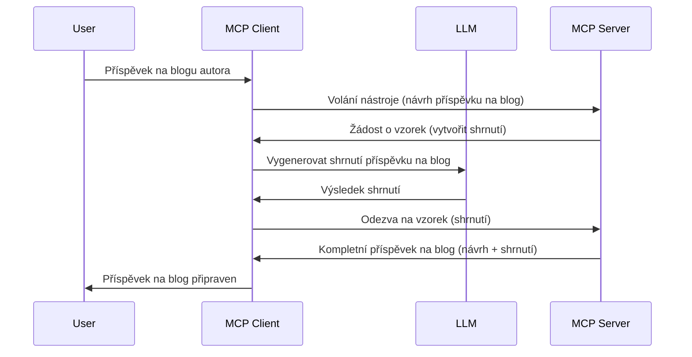

# Sampling - delegování funkcí klientovi

> **Oznámení o ukončení podpory:** vydání specifikace MCP verze `2026-07-28` ve fázi kandidáta značí Sampling jako zastaralý ve prospěch přímé integrace s API poskytovatelů LLM. Sampling nadále funguje ve verzi `2025-11-25` a minimálně po dobu jednoho roku po formálním ukončení podpory, takže vše v této lekci zůstává platné — nové návrhy serverů by však měly zvážit náhradní vzor. Viz [Co se mění v MCP: Kandidát vydání 2026-07-28](../../01-CoreConcepts/mcp-2026-07-28-release-candidate.md).

Někdy potřebujete, aby spolupracoval MCP klient a MCP server k dosažení společného cíle. Můžete mít situaci, kdy server potřebuje pomoc LLM, která běží na klientovi. Pro tuto situaci je Sampling to, co byste měli použít.

Podívejme se na některé případy použití a jak postavit řešení zahrnující Sampling.

## Přehled

V této lekci se zaměříme na vysvětlení, kdy a kde používat Sampling a jak ho nakonfigurovat.

## Výukové cíle

V této kapitole:

- Vysvětlíme, co Sampling je a kdy ho použít.
- Ukážeme, jak nakonfigurovat Sampling v MCP.
- Poskytneme příklady využití Sampling v praxi.

## Co je Sampling a proč ho používat?

Sampling je pokročilá funkce, která funguje následovně:



### Požadavek na Sampling

Dobře, nyní máme vysoký přehled o věrohodném scénáři, pojďme si promluvit o požadavku na sampling, který server posílá klientovi. Takový požadavek může vypadat v JSON-RPC formátu takto:

```json
{
  "jsonrpc": "2.0",
  "id": 1,
  "method": "sampling/createMessage",
  "params": {
    "messages": [
      {
        "role": "user",
        "content": {
          "type": "text",
          "text": "Create a blog post summary of the following blog post: <BLOG POST>"
        }
      }
    ],
    "modelPreferences": {
      "hints": [
        {
          "name": "claude-3-sonnet"
        }
      ],
      "intelligencePriority": 0.8,
      "speedPriority": 0.5
    },
    "systemPrompt": "You are a helpful assistant.",
    "maxTokens": 100
  }
}
```

Několik věcí zde stojí za zmínku:

- Prompt, pod content -> text, je náš prompt, tedy instrukce pro LLM, aby shrnul obsah blogového příspěvku.

- **modelPreferences**. Tato sekce je právě to, preference, doporučení, jaké nastavení LLM použít. Uživatel se může rozhodnout, zda tato doporučení přijme, nebo změní. V tomto případě jde o doporučení ohledně modelu a priority rychlosti a inteligence.
- **systemPrompt**, to je váš běžný systémový prompt, který LLM vtiskne osobnost a obsahuje pokyny.
- **maxTokens**, další vlastnost určující, kolik tokenů je doporučeno pro tento úkol použít.

### Odpověď na Sampling

Tato odpověď je to, co MCP klient nakonec pošle zpět MCP serveru a je výsledkem volání LLM klientem, vyčkání na odpověď a následného sestavení této zprávy. Může vypadat v JSON-RPC formátu takto:

```json
{
  "jsonrpc": "2.0",
  "id": 1,
  "result": {
    "role": "assistant",
    "content": {
      "type": "text",
      "text": "Here's your abstract <ABSTRACT>"
    },
    "model": "gpt-5",
    "stopReason": "endTurn"
  }
}
```

Všimněte si, že odpověď je shrnutím blogového příspěvku, právě jak jsme požadovali. Zároveň si všimněte, že použitý `model` není ten, o který jsme žádali, ale "gpt-5" namísto "claude-3-sonnet". To má ukázat, že uživatel může změnit názor, co použít, a že váš požadavek na sampling je doporučení.

Dobře, nyní, když rozumíme hlavnímu toku a užitečnému úkolu, pro který Sampling použít, tedy "tvorbu blogového příspěvku + shrnutí", pojďme se podívat, co je potřeba udělat, aby to fungovalo.

### Typy zpráv

Zprávy pro Sampling nejsou omezeny pouze na text, ale můžete také odesílat obrázky a zvuk. Takhle vypadá JSON-RPC pro různý obsah:

**Text**

```json
{
  "type": "text",
  "text": "The message content"
}
```

**Obsah obrázku**

```json
{
  "type": "image",
  "data": "base64-encoded-image-data",
  "mimeType": "image/jpeg"
}
```

**Zvukový obsah**

```json
{
  "type": "audio",
  "data": "base64-encoded-audio-data",
  "mimeType": "audio/wav"
}
```

> NOTE: podrobnější informace o Sampling naleznete v [oficiální dokumentaci](https://modelcontextprotocol.io/specification/2025-11-25/client/sampling)

## Jak nakonfigurovat Sampling v klientovi

> Poznámka: pokud stavíte pouze server, zde není potřeba nic moc měnit.

V klientovi musíte specifikovat funkci následovně:

```json
{
  "capabilities": {
    "sampling": {}
  }
}
```

To pak bude zachyceno, když se váš zvolený klient inicializuje se serverem.

## Příklad použití Sampling - tvorba blogového příspěvku

Naprogramujme si sampling server společně, budeme muset udělat následující:

1. Vytvořit nástroj na serveru.
1. Tento nástroj má vytvořit sampling požadavek.
1. Nástroj musí čekat na odpověď na sampling požadavek od klienta.
1. Poté by měl být vyprodukován výsledek nástroje.

Podívejme se na kód krok za krokem:

### -1- Vytvoření nástroje

**python**

```python
@mcp.tool()
async def create_blog(title: str, content: str, ctx: Context[ServerSession, None]) -> str:
    """Create a blog post and generate a summary"""

```

### -2- Vytvoření sampling požadavku

Rozšiřte svůj nástroj o následující kód:

**python**

```python
post = BlogPost(
        id=len(posts) + 1,
        title=title,
        content=content,
        abstract=""
    )

prompt = f"Create an abstract of the following blog post: title: {title} and draft: {content} "

result = await ctx.session.create_message(
        messages=[
            SamplingMessage(
                role="user",
                content=TextContent(type="text", text=prompt),
            )
        ],
        max_tokens=100,
)

```

### -3- Čekání na odpověď a vrácení odpovědi

**python**

```python
post.abstract = result.content.text

posts.append(post)

# vraťte kompletní produkt
return json.dumps({
    "id": post.title,
    "abstract": post.abstract
})
```

### -4- Kompletní kód

**python**

```python
from starlette.applications import Starlette
from starlette.routing import Mount, Host

from mcp.server.fastmcp import Context, FastMCP

from mcp.server.session import ServerSession
from mcp.types import SamplingMessage, TextContent

import json


from uuid import uuid4
from typing import List
from pydantic import BaseModel


mcp = FastMCP("Blog post generator")

# app = FastAPI()

posts = []

class BlogPost(BaseModel):
    id: int
    title: str
    content: str
    abstract: str

posts: List[BlogPost] = []

@mcp.tool()
async def create_blog(title: str, content: str, ctx: Context[ServerSession, None]) -> str:
    """Create a blog post and generate a summary"""

    post = BlogPost(
        id=len(posts) + 1,
        title=title,
        content=content,
        abstract=""
    )

    prompt = f"Create an abstract of the following blog post: title: {title} and draft: {content} "

    result = await ctx.session.create_message(
        messages=[
            SamplingMessage(
                role="user",
                content=TextContent(type="text", text=prompt),
            )
        ],
        max_tokens=100,
    )

    post.abstract = result.content.text

    posts.append(post)

    # vrátit kompletní blogový příspěvek
    return json.dumps({
        "id": post.title,
        "abstract": post.abstract
    })

if __name__ == "__main__":
    print("Starting server...")
    # mcp.run()
    mcp.run(transport="streamable-http")

# spusť aplikaci příkazem: python server.py
```

### -5- Testování ve Visual Studio Code

Pro otestování ve Visual Studio Code proveďte následující:

1. Spusťte server v terminálu
1. Přidejte ho do *mcp.json* (a ujistěte se, že běží), například takto:

   ```json
   "servers": {
      "blog-server": {
        "type": "http",
        "url": "http://localhost:8000/mcp"
      }
   }
   ```

1. Napište prompt:

   ```text
   create a blog post named "Where Python comes from", the content is "Python is actually named after Monty Python Flying Circus"
   ```

1. Povolit sampling. Při prvním testu se zobrazí další dialog, který musíte potvrdit, poté uvidíte běžný dialog žádající o spuštění nástroje.

1. Zkontrolujte výsledky. Výsledky uvidíte pěkně zobrazené v GitHub Copilot Chat, ale můžete také prohlédnout surovou JSON odpověď.

**Bonus**. Nástroje Visual Studio Code mají skvělou podporu Sampling. Můžete nakonfigurovat přístup k Sampling na nainstalovaném serveru takto:

1. Přejděte do sekce rozšíření.
1. Vyberte ikonu ozubeného kola u vašeho nainstalovaného serveru v části "MCP SERVERS - INSTALLED".
1. Vyberte "Configure Model Access", zde můžete nastavit, které modely může GitHub Copilot používat při Sampling. Také můžete vidět všechny nedávné sampling požadavky kliknutím na "Show Sampling requests".

## Zadání

V tomto zadání vytvoříte o něco jiný Sampling, konkrétně integraci Sampling, která podporuje generování popisu produktu. Zde je váš scénář:

**Scénář**: Pracovník back office v e-commerce potřebuje pomoc, trvá příliš dlouho generovat popisy produktů. Proto máte vytvořit řešení, kde budete volat nástroj "create_product" s argumenty "title" a "keywords" a nástroj by měl vytvořit kompletní produkt včetně pole "description", které naplní LLM klienta.

TIP: použijte, co jste se naučili dříve k sestavení tohoto serveru a jeho nástroje pomocí sampling požadavku.

## Řešení

[Řešení](./solution/README.md)

## Hlavní poznatky

Sampling je silná funkce, která umožňuje serveru delegovat úkoly klientovi, když potřebuje pomoc LLM.

## Co dál

- [Kapitola 4 - Praktická implementace](../../04-PracticalImplementation/README.md)

---

<!-- CO-OP TRANSLATOR DISCLAIMER START -->
**Prohlášení o omezení odpovědnosti**:
Tento dokument byl přeložen pomocí AI překladatelské služby [Co-op Translator](https://github.com/Azure/co-op-translator). Přestože usilujeme o co největší přesnost, mějte prosím na paměti, že automatizované překlady mohou obsahovat chyby nebo nepřesnosti. Originální dokument v jeho mateřském jazyce by měl být považován za autoritativní zdroj. Pro kritické informace se doporučuje profesionální lidský překlad. Nejsme odpovědní za jakékoli nedorozumění nebo nesprávné interpretace vzniklé použitím tohoto překladu.
<!-- CO-OP TRANSLATOR DISCLAIMER END -->