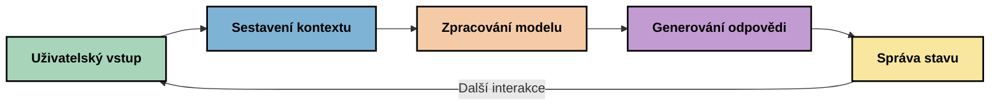
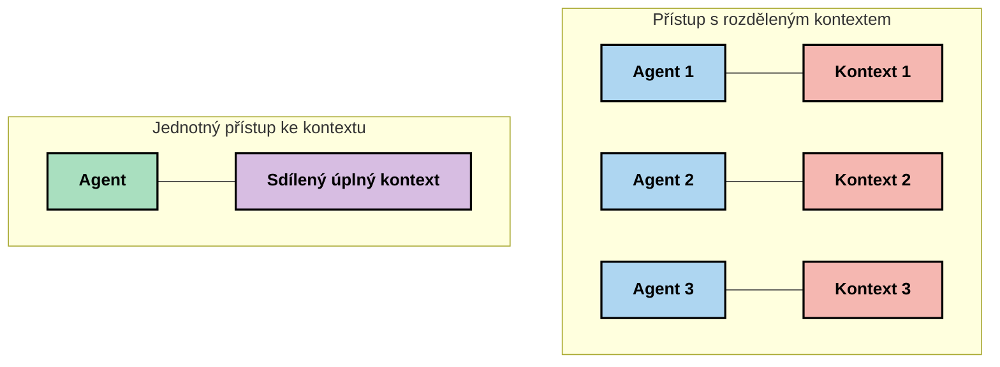
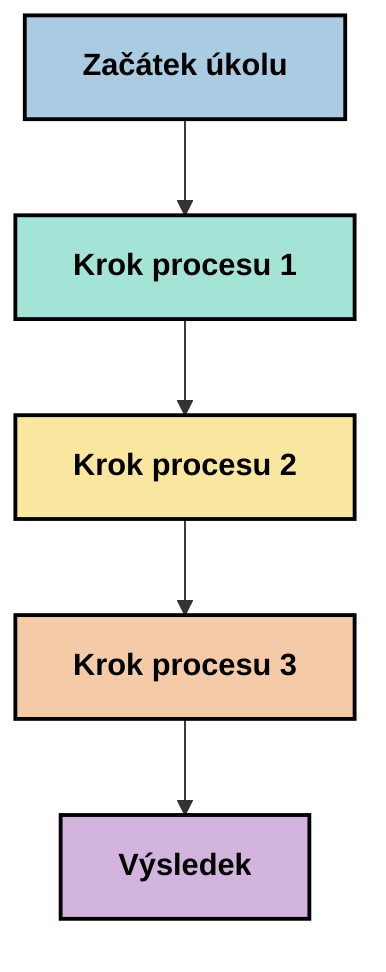
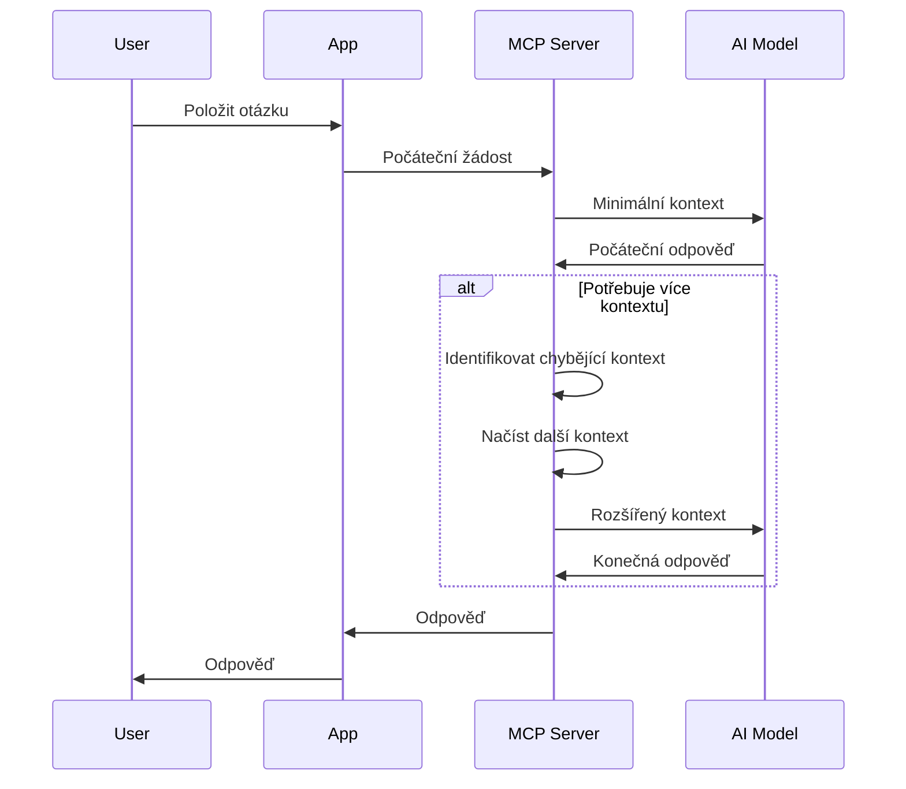
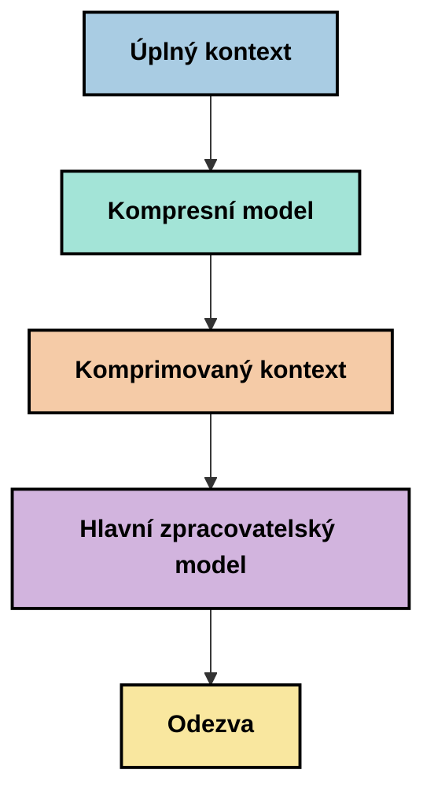
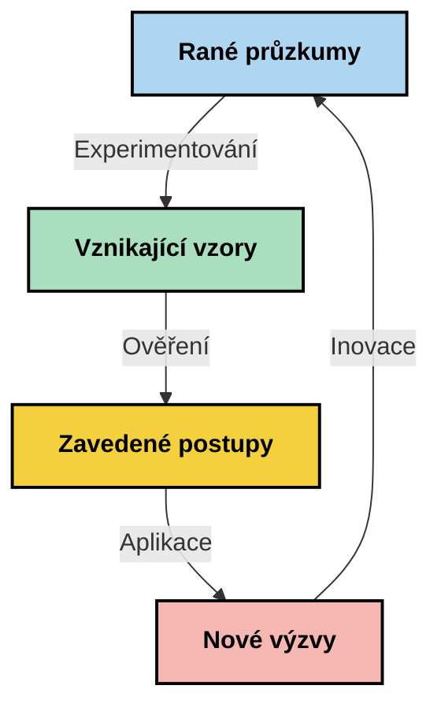

# Inženýrství kontextu: Nový koncept v ekosystému MCP

## Přehled

Inženýrství kontextu je vznikající koncept v oblasti umělé inteligence, který zkoumá, jak je informace strukturována, dodávána a udržována během interakcí mezi klienty a AI službami. Jak se ekosystém Model Context Protocol (MCP) vyvíjí, pochopení efektivního řízení kontextu nabývá na významu. Tento modul představuje koncept inženýrství kontextu a zkoumá jeho možné aplikace v implementacích MCP.

## Cíle učení

Po absolvování tohoto modulu budete schopni:

- Pochopit vznikající koncept inženýrství kontextu a jeho potenciální roli v aplikacích MCP
- Identifikovat klíčové výzvy v řízení kontextu, které řeší návrh protokolu MCP
- Prozkoumat techniky pro zlepšení výkonu modelu lepším řízením kontextu
- Zvážit přístupy k měření a hodnocení efektivity kontextu
- Aplikovat tyto vznikající koncepty ke zlepšení AI zážitků prostřednictvím rámce MCP

## Úvod do inženýrství kontextu

Inženýrství kontextu je nově vznikající koncept zaměřený na vědomý návrh a řízení toku informací mezi uživateli, aplikacemi a AI modely. Na rozdíl od zavedených oblastí, jako je prompt engineering, je inženýrství kontextu stále definováno praktikujícími, kteří se snaží vyřešit jedinečné výzvy poskytování správných informací AI modelům ve správný čas.

Jak se vyvíjejí velké jazykové modely (LLM), význam kontextu se stává stále zřetelnějším. Kvalita, relevanci a struktura kontextu, který poskytujeme, přímo ovlivňuje výstupy modelu. Inženýrství kontextu zkoumá tento vztah a snaží se vyvinout principy pro efektivní řízení kontextu.

> "V roce 2025 jsou modely extrémně inteligentní. Ale ani ten nejchytřejší člověk nebude schopen svoji práci efektivně vykonávat bez kontextu toho, co má dělat... 'Inženýrství kontextu' je další úroveň prompt engineeringu. Jde o to dělat to automaticky v dynamickém systému." — Walden Yan, Cognition AI

Inženýrství kontextu může zahrnovat:

1. **Výběr kontextu**: Určení, jaké informace jsou relevantní pro daný úkol
2. **Strukturování kontextu**: Organizace informací pro maximalizaci pochopení modelem
3. **Doručení kontextu**: Optimalizace způsobu a času, kdy jsou informace posílány modelům
4. **Údržba kontextu**: Řízení stavu a vývoje kontextu v průběhu času
5. **Hodnocení kontextu**: Měření a zlepšování efektivity kontextu

Tyto oblasti jsou zvláště relevantní pro ekosystém MCP, který poskytuje standardizovaný způsob, jak aplikace mohou poskytovat kontext LLM.


## Perspektiva cesty kontextu

Jedním ze způsobů, jak si představit inženýrství kontextu, je sledovat cestu, kterou informace prochází systémem MCP:



### Klíčové fáze na cestě kontextu:

1. **Vstup uživatele**: Surové informace od uživatele (text, obrázky, dokumenty)
2. **Sestavení kontextu**: Kombinace uživatelského vstupu se systémovým kontextem, historií konverzace a dalšími získanými informacemi
3. **Zpracování modelem**: AI model zpracovává sestavený kontext
4. **Generování odpovědi**: Model vytváří výstupy na základě poskytnutého kontextu
5. **Správa stavu**: Systém aktualizuje svůj interní stav na základě interakce

Tento pohled zdůrazňuje dynamickou povahu kontextu v AI systémech a klade důležité otázky, jak nejlépe řídit informace v každé fázi.

## Vznikající principy inženýrství kontextu

Jak se pole inženýrství kontextu formuje, začínají praktikující vyvíjet některé počáteční principy. Tyto principy mohou pomoci při rozhodování o implementaci MCP:

### Princip 1: Sdílej kontext kompletně

Kontext by měl být sdílen kompletně mezi všemi komponentami systému, nikoli fragmentován mezi více agenty nebo procesy. Když je kontext rozdělen, rozhodnutí učiněná v jedné části systému mohou být v rozporu s rozhodnutími jinde.



V aplikacích MCP to naznačuje navrhování systémů, kde kontext plynule proudí celým řetězcem místo aby byl rozdělen do oddělených částí.

### Princip 2: Uvědom si, že akce nesou implicitní rozhodnutí

Každá akce, kterou model provede, nese implicitní rozhodnutí o tom, jak interpretovat kontext. Když různé komponenty pracují s různými kontexty, mohou se tato implicitní rozhodnutí dostat do rozporu, což vede k nekonzistentním výsledkům.

Tento princip má důležité důsledky pro aplikace MCP:
- Upřednostňovat lineární zpracování složitých úloh před paralelním vykonáváním s fragmentovaným kontextem
- Zajistit, aby všechna rozhodovací místa měla přístup ke stejným kontextovým informacím
- Navrhovat systémy, kde pozdější kroky vidí celý kontext dřívějších rozhodnutí

### Princip 3: Vyvažuj hloubku kontextu s omezeními okna

Jak se konverzace a procesy prodlužují, kontextová okna nakonec přetečou. Efektivní inženýrství kontextu zkoumá přístupy k řízení tohoto napětí mezi komplexním kontextem a technickými omezeními.

Možné zkoumané přístupy zahrnují:
- Kompresi kontextu, která zachovává podstatné informace při snižování počtu tokenů
- Postupné načítání kontextu na základě relevance pro aktuální potřeby
- Shrnutí předchozích interakcí s uchováním klíčových rozhodnutí a faktů

## Výzvy kontextu a návrh protokolu MCP

Model Context Protocol (MCP) byl navržen s vědomím jedinečných výzev řízení kontextu. Porozumění těmto výzvám pomáhá vysvětlit klíčové aspekty návrhu protokolu MCP:


### Výzva 1: Omezení velikosti kontextového okna
Většina AI modelů má pevnou velikost kontextového okna, které omezuje množství informací, které mohou zpracovat najednou.

**Odpověď návrhu MCP:** 
- Protokol podporuje strukturovaný, na zdrojích založený kontext, který lze efektivně odkazovat
- Zdroje mohou být stránkovány a načítány postupně

### Výzva 2: Určení relevance
Určit, které informace jsou nejvíce relevantní pro zařazení do kontextu, je složité.

**Odpověď návrhu MCP:**
- Flexibilní nástroje umožňují dynamické získávání informací na základě potřeby
- Strukturované prompyty umožňují konzistentní organizaci kontextu

### Výzva 3: Perzistence kontextu
Řízení stavu přes interakce vyžaduje pečlivé sledování kontextu.

**Odpověď návrhu MCP:**
- Standardizované řízení relací
- Jasně definované vzory interakcí pro vývoj kontextu

### Výzva 4: Multimodální kontext
Různé typy dat (text, obrázky, strukturovaná data) vyžadují odlišné zpracování.

**Odpověď návrhu MCP:**
- Návrh protokolu přizpůsobený různým typům obsahu
- Standardizovaná reprezentace multimodálních informací

### Výzva 5: Bezpečnost a soukromí
Kontext často obsahuje citlivé informace, které je třeba chránit.

**Odpověď návrhu MCP:**
- Jasné hranice mezi odpovědností klienta a serveru
- Možnosti lokálního zpracování pro minimalizaci vystavení dat

Porozumění těmto výzvám a způsobu, jak je MCP řeší, poskytuje základ pro zkoumání pokročilejších technik inženýrství kontextu.

## Vznikající přístupy inženýrství kontextu

Jak se pole inženýrství kontextu vyvíjí, několik slibných přístupů se začíná objevovat. Ty představují současné myšlenky spíše než zavedené osvědčené postupy a pravděpodobně se budou vyvíjet s většími zkušenostmi s implementacemi MCP.

### 1. Jednoprocesorové lineární zpracování

Na rozdíl od víceagentových architektur, které distribuují kontext, někteří praktikující zjistili, že jednoprocesorové lineární zpracování přináší konzistentnější výsledky. To koresponduje s principem udržování jednotného kontextu.



Přestože se tento přístup může zdát méně efektivní než paralelní zpracování, často přináší soudržnější a spolehlivější výsledky, protože každý krok staví na kompletním porozumění předchozích rozhodnutí.

### 2. Dělení a priorizace kontextu

Rozdělení velkého kontextu na zvládnutelné části a upřednostnění toho nejdůležitějšího.

```python
# Koncepční příklad: Dělení kontextu na části a prioritizace
def process_with_chunked_context(documents, query):
    # 1. Rozdělte dokumenty na menší části
    chunks = chunk_documents(documents)
    
    # 2. Vypočítejte skóre relevance pro každou část
    scored_chunks = [(chunk, calculate_relevance(chunk, query)) for chunk in chunks]
    
    # 3. Seřaďte části podle skóre relevance
    sorted_chunks = sorted(scored_chunks, key=lambda x: x[1], reverse=True)
    
    # 4. Použijte nejrelevantnější části jako kontext
    context = create_context_from_chunks([chunk for chunk, score in sorted_chunks[:5]])
    
    # 5. Zpracujte s prioritizovaným kontextem
    return generate_response(context, query)
```

Výše uvedený koncept ilustruje, jak můžeme rozdělit velké dokumenty na zvládnutelné kusy a vybrat pouze nejrelevantnější části pro kontext. Tento přístup může pomoci pracovat v rámci omezení kontextového okna a zároveň využít rozsáhlé znalostní základny.

### 3. Postupné načítání kontextu

Načítání kontextu postupně podle potřeby, nikoli vše najednou.



Postupné načítání začíná s minimálním kontextem a rozšiřuje se pouze, když je to nutné. To může výrazně snížit využití tokenů pro jednoduché dotazy a zároveň zachovat schopnost zpracovávat složité otázky.

### 4. Komprese a shrnutí kontextu

Snižování velikosti kontextu při zachování podstatných informací.



Komprese kontextu se zaměřuje na:
- Odstraňování zbytečných informací
- Shrnutí rozsáhlého obsahu
- Extrakci klíčových faktů a detailů
- Zachování kritických prvků kontextu
- Optimalizaci pro efektivitu tokenů

Tento přístup může být zvláště cenný pro udržování dlouhých konverzací v rámci kontextových oken nebo efektivní zpracování velkých dokumentů. Někteří praktikující používají specializované modely speciálně pro kompresi kontextu a shrnutí historie konverzace.


## Průzkumné úvahy o inženýrství kontextu

Při zkoumání vznikající oblasti inženýrství kontextu stojí za to mít na paměti několik úvah při práci s implementacemi MCP. Nejde o předepsané osvědčené postupy, ale spíše o oblasti zkoumání, které by mohly přinést zlepšení ve vašem konkrétním použití.

### Zvažte své cíle kontextu

Před nasazením složitých řešení řízení kontextu si jasně definujte, čeho chcete dosáhnout:
- Jaké konkrétní informace model potřebuje k úspěchu?
- Které informace jsou nezbytné a které doplňkové?
- Jaká jsou vaše omezení výkonu (latence, limity tokenů, náklady)?

### Prozkoumejte vrstvené přístupy kontextu

Někteří praktikující dosahují úspěchu s kontextem uspořádaným do konceptuálních vrstev:
- **Jádrová vrstva**: Nezbytné informace, které model vždy potřebuje
- **Situacionální vrstva**: Kontext specifický pro aktuální interakci
- **Podpůrná vrstva**: Dodatečné informace, které mohou být užitečné
- **Záložní vrstva**: Informace zpřístupněné pouze v případě potřeby

### Zkoumejte strategie získávání

Efektivita vašeho kontextu často závisí na způsobu získávání informací:
- Sémantické vyhledávání a embeddingy pro nalezení konceptuálně relevantních informací
- Vyhledávání podle klíčových slov pro specifické faktické údaje
- Hybridní přístupy kombinující více metod získávání
- Filtrování metadat pro zúžení rozsahu podle kategorií, dat nebo zdrojů

### Experimentujte s koherencí kontextu

Struktura a tok vašeho kontextu mohou ovlivnit pochopení modelem:
- Sdružování souvisejících informací dohromady
- Používání konzistentního formátování a organizace
- Udržování logického nebo chronologického pořadí tam, kde je to vhodné
- Vyhýbání se protichůdným informacím

### Zvažte kompromisy víceagentových architektur

I když jsou víceagentové architektury populární v mnoha AI rámcích, přinášejí zásadní výzvy pro řízení kontextu:
- Fragmentace kontextu může vést k nekonzistentním rozhodnutím napříč agenty
- Paralelní zpracování může zavádět konflikty, které je obtížné sladit
- Komunikace mezi agenty může navýšit režii, čímž se vyrovná potenciální zlepšení výkonu
- Složitá správa stavu je nutná k udržení koherence

V mnoha případech může přístup s jedním agentem a komplexním řízením kontextu přinést spolehlivější výsledky než více specializovaných agentů s fragmentovaným kontextem.

### Vyvíjejte metody hodnocení

Pro zlepšení inženýrství kontextu v průběhu času zvažte, jak budete měřit úspěch:
- A/B testování různých struktur kontextu
- Sledování využití tokenů a doby odezvy
- Monitorování spokojenosti uživatelů a míry dokončení úloh
- Analýzu případů, kdy strategie kontextu selhávají

Tyto úvahy představují aktivní oblasti zkoumání v prostoru inženýrství kontextu. Jak se pole rozvíjí, pravděpodobně se objeví definitivnější vzory a praktiky.

## Měření efektivity kontextu: Vyvíjející se rámec

Jak se koncept inženýrství kontextu formuje, praktikující začínají zkoumat, jak můžeme měřit jeho efektivitu. Zatím neexistuje zavedený rámec, ale zvažují se různé metriky, které by mohly pomoci při budoucí práci.

### Potenciální dimenze měření


#### 1. Úvahy o efektivitě vstupu

- **Poměr kontextu k odpovědi**: Kolik kontextu je potřeba vzhledem k velikosti odpovědi?
- **Využití tokenů**: Jaké procento poskytnutých tokenů z kontextu ovlivňuje odpověď?
- **Redukce kontextu**: Jak efektivně můžeme komprimovat surové informace?

#### 2. Úvahy o výkonu

- **Dopad na latenci**: Jak řízení kontextu ovlivňuje dobu odezvy?
- **Ekonomika tokenů**: Optimalizujeme efektivní využití tokenů?
- **Přesnost získávání**: Jak relevantní jsou získané informace?
- **Využití zdrojů**: Jaké výpočetní zdroje jsou požadovány?

#### 3. Úvahy o kvalitě

- **Relevance odpovědi**: Jak dobře odpověď odpovídá na dotaz?
- **Faktická přesnost**: Zlepšuje řízení kontextu správnost faktů?
- **Konzistence**: Jsou odpovědi konzistentní napříč podobnými dotazy?
- **Míra halucinací**: Snižuje lepší kontext halucinace modelu?

#### 4. Úvahy o uživatelské zkušenosti

- **Míra následného dotazování**: Jak často uživatelé potřebují doplňující vysvětlení?
- **Dokončení úkolu**: Dosahují uživatelé úspěšně své cíle?
- **Ukazatele spokojenosti**: Jak uživatelé hodnotí svou zkušenost?

### Průzkumné přístupy k měření

Při experimentování s inženýrstvím kontextu v implementacích MCP zvažte tyto průzkumné přístupy:

1. **Porovnání s výchozí hodnotou**: Stanovte výchozí úroveň s jednoduchými přístupy ke kontextu před testováním složitějších metod

2. **Postupné změny**: Měňte vždy jen jeden aspekt řízení kontextu, abyste izolovali jeho efekt

3. **Hodnocení zaměřené na uživatele**: Kombinujte kvantitativní metriky s kvalitativní zpětnou vazbou uživatelů

4. **Analýza selhání**: Zkoumejte případy, kdy strategie kontextu selhaly, abyste pochopili možné zlepšení

5. **Vícedimenzionální hodnocení**: Zvažte kompromisy mezi efektivitou, kvalitou a uživatelskou zkušeností

Tento experimentální, mnohostranný přístup k měření odpovídá vznikající povaze inženýrství kontextu.

## Závěrečné myšlenky

Inženýrství kontextu je vznikající oblast zkoumání, která může být klíčová pro efektivní aplikace MCP. Pečlivým zvažováním toku informací ve vašem systému můžete potenciálně vytvořit AI zážitky, které jsou efektivnější, přesnější a hodnotnější pro uživatele.

Techniky a přístupy uvedené v tomto modulu představují rané myšlení v této oblasti, nikoli zavedené praktiky. Inženýrství kontextu se může vyvinout v jasněji definovanou disciplínu, jak se schopnosti AI zlepšují a naše porozumění hlubší. Prozatím se zdá, že nejproduktivnějším přístupem je experimentování spojené s pečlivým měřením.

## Potenciální budoucí směry

Oblast inženýrství kontextu je stále v počátečních fázích, ale objevuje se několik slibných směrů:

- Principy inženýrství kontextu mohou významně ovlivnit výkon modelu, efektivitu, uživatelskou zkušenost a spolehlivost
- Jednoprocesorové přístupy s komplexním řízením kontextu mohou překonat víceagentové architektury v mnoha případech
- Specializované modely pro kompresi kontextu se mohou stát standardními komponentami v AI pipelinech
- Napětí mezi úplností kontextu a omezeními tokenů pravděpodobně podnítí inovace v zacházení s kontextem
- Jak se modely stanou schopnějšími efektivní lidsky podobnou komunikací, pravá víceagentová spolupráce může být reálnější
- Implementace MCP se mohou vyvíjet tak, že standardizují vzory řízení kontextu, které se objeví z aktuálního experimentování



## Zdroje

### Oficiální zdroje MCP
- [Model Context Protocol Website](https://modelcontextprotocol.io/)
- [Model Context Protocol Specification](https://github.com/modelcontextprotocol/modelcontextprotocol)

- [MCP Dokumentace](https://modelcontextprotocol.io/docs)
- [MCP C# SDK](https://github.com/modelcontextprotocol/csharp-sdk)
- [MCP Python SDK](https://github.com/modelcontextprotocol/python-sdk)
- [MCP TypeScript SDK](https://github.com/modelcontextprotocol/typescript-sdk)
- [MCP Inspector](https://github.com/modelcontextprotocol/inspector) - Nástroj pro vizuální testování MCP serverů

### Články o kontextovém inženýrství
- [Nebuďte stavitelem multi-agentů: Principy kontextového inženýrství](https://cognition.ai/blog/dont-build-multi-agents) - Pohled Waldena Yana na principy kontextového inženýrství
- [Praktický průvodce stavbou agentů](https://cdn.openai.com/business-guides-and-resources/a-practical-guide-to-building-agents.pdf) - Průvodce OpenAI k efektivnímu návrhu agentů
- [Budování efektivních agentů](https://www.anthropic.com/engineering/building-effective-agents) - Přístup Anthropic k vývoji agentů

### Související výzkum
- [Dynamické doplňování vyhledávání pro velké jazykové modely](https://arxiv.org/abs/2310.01487) - Výzkum dynamických přístupů k vyhledávání
- [Ztraceno uprostřed: Jak jazykové modely používají dlouhé kontexty](https://arxiv.org/abs/2307.03172) - Důležitý výzkum vzorců zpracování kontextu
- [Hierarchická generace obrázků podmíněná textem pomocí CLIP latentů](https://arxiv.org/abs/2204.06125) - Článek o DALL-E 2 s poznatky o struktuře kontextu
- [Zkoumání role kontextu v architekturách velkých jazykových modelů](https://aclanthology.org/2023.findings-emnlp.124/) - Nedávný výzkum zpracování kontextu
- [Spolupráce multi-agentů: Přehled](https://arxiv.org/abs/2304.03442) - Výzkum multi-agentních systémů a jejich výzev

### Další zdroje
- [Optimalizační techniky kontextového okna](https://learn.microsoft.com/en-us/azure/ai-services/openai/concepts/context-window)
- [Pokročilé techniky RAG](https://www.microsoft.com/en-us/research/blog/retrieval-augmented-generation-rag-and-frontier-models/)
- [Dokumentace Semantic Kernel](https://github.com/microsoft/semantic-kernel)
- [AI Toolkit pro správu kontextu](https://github.com/microsoft/aitoolkit)

## Co bude dál

- [5.15 MCP Custom Transport](../mcp-transport/README.md)

---

<!-- CO-OP TRANSLATOR DISCLAIMER START -->
**Prohlášení o omezení odpovědnosti**:
Tento dokument byl přeložen pomocí AI překladatelské služby [Co-op Translator](https://github.com/Azure/co-op-translator). Přestože usilujeme o co největší přesnost, mějte prosím na paměti, že automatizované překlady mohou obsahovat chyby nebo nepřesnosti. Originální dokument v jeho mateřském jazyce by měl být považován za autoritativní zdroj. Pro kritické informace se doporučuje profesionální lidský překlad. Nejsme odpovědní za jakékoli nedorozumění nebo nesprávné interpretace vzniklé použitím tohoto překladu.
<!-- CO-OP TRANSLATOR DISCLAIMER END -->