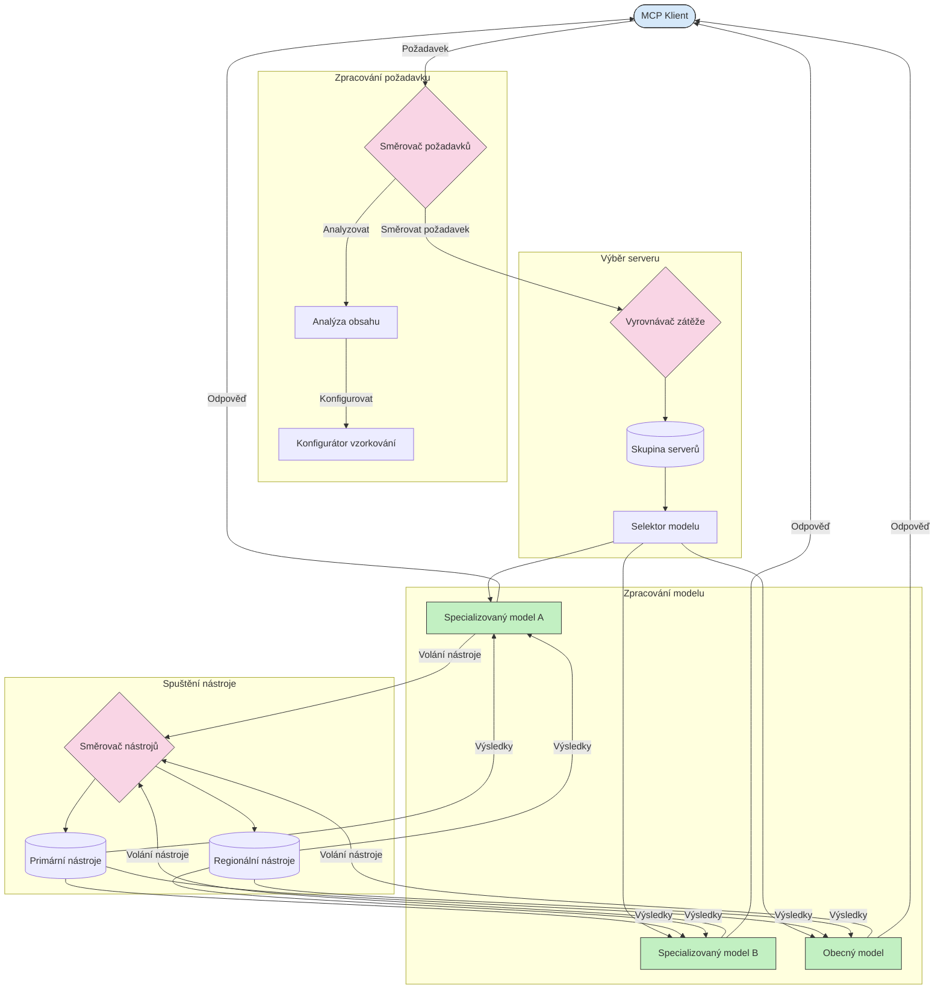

# Směrování v Model Context Protocol

Směrování je nezbytné pro směrování požadavků na odpovídající modely, nástroje nebo služby v rámci ekosystému MCP.

## Úvod

Směrování v Model Context Protocol (MCP) zahrnuje směrování požadavků na nejvhodnější modely nebo služby na základě různých kritérií, jako jsou typ obsahu, kontext uživatele a zatížení systému. To zajišťuje efektivní zpracování a optimální využití zdrojů.

## Výukové cíle

Na konci této lekce budete schopni:

- Porozumět principům směrování v MCP.
- Implementovat směrování založené na obsahu pro směrování požadavků na specializované služby.
- Použít inteligentní strategie vyvažování zátěže pro optimalizaci využití zdrojů.
- Implementovat dynamické směrování nástrojů na základě kontextu požadavku.

## Směrování založené na obsahu

Směrování založené na obsahu směruje požadavky na specializované služby na základě obsahu požadavku. Například požadavky týkající se generování kódu lze směrovat na specializovaný model pro kód, zatímco požadavky na kreativní psaní mohou být odeslány na model kreativního psaní.

Podívejme se na příklad implementace v různých programovacích jazycích.

<details>
<summary>.NET</summary>

```csharp
// .NET Example: Content-based routing in MCP
public class ContentBasedRouter
{
    private readonly Dictionary<string, McpClient> _specializedClients;
    private readonly RoutingClassifier _classifier;
    
    public ContentBasedRouter()
    {
        // Initialize specialized clients for different domains
        _specializedClients = new Dictionary<string, McpClient>
        {
            ["code"] = new McpClient("https://code-specialized-mcp.com"),
            ["creative"] = new McpClient("https://creative-specialized-mcp.com"),
            ["scientific"] = new McpClient("https://scientific-specialized-mcp.com"),
            ["general"] = new McpClient("https://general-mcp.com")
        };
        
        // Initialize content classifier
        _classifier = new RoutingClassifier();
    }
    
    public async Task<McpResponse> RouteAndProcessAsync(string prompt, IDictionary<string, object> parameters = null)
    {
        // Classify the prompt to determine the best specialized service
        string category = await _classifier.ClassifyPromptAsync(prompt);
        
        // Get the appropriate client or fall back to general
        var client = _specializedClients.ContainsKey(category) 
            ? _specializedClients[category] 
            : _specializedClients["general"];
            
        Console.WriteLine($"Routing request to {category} specialized service");
        
        // Send request to the selected service
        return await client.SendPromptAsync(prompt, parameters);
    }
    
    // Simple classifier for routing decisions
    private class RoutingClassifier
    {
        public Task<string> ClassifyPromptAsync(string prompt)
        {
            prompt = prompt.ToLowerInvariant();
            
            if (prompt.Contains("code") || prompt.Contains("function") || 
                prompt.Contains("program") || prompt.Contains("algorithm"))
            {
                return Task.FromResult("code");
            }
            
            if (prompt.Contains("story") || prompt.Contains("creative") || 
                prompt.Contains("imagine") || prompt.Contains("design"))
            {
                return Task.FromResult("creative");
            }
            
            if (prompt.Contains("science") || prompt.Contains("research") || 
                prompt.Contains("analyze") || prompt.Contains("study"))
            {
                return Task.FromResult("scientific");
            }
            
            return Task.FromResult("general");
        }
    }
}
```

V předchozím kódu jsme:

- Vytvořili třídu `ContentBasedRouter`, která směruje požadavky na základě obsahu promptu.
- Inicializovali specializované klienty pro různé oblasti (kód, kreativní, vědecký, obecný).
- Implementovali jednoduchý klasifikátor, který určuje kategorii promptu a směruje ji na odpovídající specializovanou službu.
- Použili záložní mechanismus pro směrování požadavků na obecnou službu, pokud není k dispozici specializovaná služba.
- Implementovali asynchronní zpracování pro efektivní obsluhu požadavků.
- Použili slovník k mapování kategorií obsahu na specializované MCP klienty.
- Implementovali jednoduchý klasifikátor, který analyzuje prompt a vrací odpovídající kategorii.
- Použili specializovaného klienta k odeslání požadavku a přijetí odpovědi.
- Řešili případy, kdy prompt neodpovídá žádné specializované kategorii, směrováním na obecnou službu.

</details>

## Inteligentní vyvažování zátěže

Vyvažování zátěže optimalizuje využití zdrojů a zajišťuje vysokou dostupnost služeb MCP. Existují různé způsoby implementace vyvažování zátěže, jako je round-robin, vážený čas odezvy nebo strategie založené na obsahu.

Podívejme se na následující příklad implementace, který používá tyto strategie:

- **Round Robin**: Rovnoměrně rozděluje požadavky mezi dostupné servery.
- **Vážený čas odezvy**: Směruje požadavky na servery na základě jejich průměrné doby odezvy.
- **Content-Aware**: Směruje požadavky na specializované servery na základě obsahu požadavku.

<details>
<summary>Java</summary>

```java
// Java příklad: Inteligentní vyvažování zátěže pro MCP servery
public class McpLoadBalancer {
    private final List<McpServerNode> serverNodes;
    private final LoadBalancingStrategy strategy;
    
    public McpLoadBalancer(List<McpServerNode> nodes, LoadBalancingStrategy strategy) {
        this.serverNodes = new ArrayList<>(nodes);
        this.strategy = strategy;
    }
    
    public McpResponse processRequest(McpRequest request) {
        // Vyberte nejlepší server podle strategie
        McpServerNode selectedNode = strategy.selectNode(serverNodes, request);
        
        try {
            // Přesměrujte požadavek na vybraný uzel
            return selectedNode.processRequest(request);
        } catch (Exception e) {
            // Zpracujte selhání - implementujte logiku opakování nebo náhradního řešení
            System.err.println("Error processing request on node " + selectedNode.getId() + ": " + e.getMessage());
            
            // Označte uzel jako potenciálně nezdravý
            selectedNode.recordFailure();
            
            // Zkuste další nejlepší uzel jako náhradní
            List<McpServerNode> remainingNodes = new ArrayList<>(serverNodes);
            remainingNodes.remove(selectedNode);
            
            if (!remainingNodes.isEmpty()) {
                McpServerNode fallbackNode = strategy.selectNode(remainingNodes, request);
                return fallbackNode.processRequest(request);
            } else {
                throw new RuntimeException("All MCP server nodes failed to process the request");
            }
        }
    }
    
    // Úkol kontroly zdraví uzlu
    public void startHealthChecks(Duration interval) {
        ScheduledExecutorService scheduler = Executors.newScheduledThreadPool(1);
        scheduler.scheduleAtFixedRate(() -> {
            for (McpServerNode node : serverNodes) {
                try {
                    boolean isHealthy = node.checkHealth();
                    System.out.println("Node " + node.getId() + " health status: " + 
                                      (isHealthy ? "HEALTHY" : "UNHEALTHY"));
                } catch (Exception e) {
                    System.err.println("Health check failed for node " + node.getId());
                    node.setHealthy(false);
                }
            }
        }, 0, interval.toMillis(), TimeUnit.MILLISECONDS);
    }
    
    // Rozhraní pro strategie vyvažování zátěže
    public interface LoadBalancingStrategy {
        McpServerNode selectNode(List<McpServerNode> nodes, McpRequest request);
    }
    
    // Strategie round-robin
    public static class RoundRobinStrategy implements LoadBalancingStrategy {
        private AtomicInteger counter = new AtomicInteger(0);
        
        @Override
        public McpServerNode selectNode(List<McpServerNode> nodes, McpRequest request) {
            List<McpServerNode> healthyNodes = nodes.stream()
                .filter(McpServerNode::isHealthy)
                .collect(Collectors.toList());
            
            if (healthyNodes.isEmpty()) {
                throw new RuntimeException("No healthy nodes available");
            }
            
            int index = counter.getAndIncrement() % healthyNodes.size();
            return healthyNodes.get(index);
        }
    }
    
    // Strategie váženého času odezvy
    public static class ResponseTimeStrategy implements LoadBalancingStrategy {
        @Override
        public McpServerNode selectNode(List<McpServerNode> nodes, McpRequest request) {
            return nodes.stream()
                .filter(McpServerNode::isHealthy)
                .min(Comparator.comparing(McpServerNode::getAverageResponseTime))
                .orElseThrow(() -> new RuntimeException("No healthy nodes available"));
        }
    }
    
    // Strategie s ohledem na obsah
    public static class ContentAwareStrategy implements LoadBalancingStrategy {
        @Override
        public McpServerNode selectNode(List<McpServerNode> nodes, McpRequest request) {
            // Určete charakteristiky požadavku
            boolean isCodeRequest = request.getPrompt().contains("code") || 
                                   request.getAllowedTools().contains("codeInterpreter");
            
            boolean isCreativeRequest = request.getPrompt().contains("creative") || 
                                       request.getPrompt().contains("story");
            
            // Najděte specializované uzly
            Optional<McpServerNode> specializedNode = nodes.stream()
                .filter(McpServerNode::isHealthy)
                .filter(node -> {
                    if (isCodeRequest && node.getSpecialization().equals("code")) {
                        return true;
                    }
                    if (isCreativeRequest && node.getSpecialization().equals("creative")) {
                        return true;
                    }
                    return false;
                })
                .findFirst();
            
            // Vraťte specializovaný uzel nebo nejméně zatížený uzel
            return specializedNode.orElse(
                nodes.stream()
                    .filter(McpServerNode::isHealthy)
                    .min(Comparator.comparing(McpServerNode::getCurrentLoad))
                    .orElseThrow(() -> new RuntimeException("No healthy nodes available"))
            );
        }
    }
}
```

V předchozím kódu jsme:

- Vytvořili třídu `McpLoadBalancer`, která spravuje seznam MCP serverových uzlů a směruje požadavky na základě vybrané strategie vyvažování zátěže.
- Implementovali různé strategie vyvažování zátěže: `RoundRobinStrategy`, `ResponseTimeStrategy` a `ContentAwareStrategy`.
- Použili `ScheduledExecutorService` pro periodické kontrolování stavu zdraví serverových uzlů.
- Implementovali mechanismus kontroly zdraví, který označuje uzly jako zdravé nebo nezdravé na základě jejich odezvy.
- Řešili zpracování požadavků s ošetřením chyb a záložní logikou pro zajištění vysoké dostupnosti.
- Použili třídu `McpServerNode` k reprezentaci jednotlivých MCP serverových uzlů včetně jejich stavu zdraví, průměrné doby odezvy a aktuální zátěže.
- Implementovali třídu `McpRequest` pro zapouzdření detailů požadavku, jako je prompt a povolené nástroje.
- Použili Java Streams k filtrování a výběru uzlů na základě stavu zdraví a specializace.

</details>

## Dynamické směrování nástrojů

Směrování nástrojů zajišťuje, že volání nástrojů jsou směrována na nejvhodnější službu podle kontextu. Například volání nástroje počasí může být potřeba směrovat na regionální koncový bod podle umístění uživatele, nebo nástroj kalkulačky může potřebovat použít konkrétní verzi API.

Podívejme se na příklad implementace, který demonstruje dynamické směrování nástrojů na základě analýzy požadavku, regionálních koncových bodů a podpory verzí.

<details>
<summary>Python</summary>

```python
# Příklad v Pythonu: Dynamické směrování nástrojů na základě analýzy požadavku
class McpToolRouter:
    def __init__(self):
        # Registrace dostupných koncových bodů nástrojů
        self.tool_endpoints = {
            "weatherTool": "https://weather-service.example.com/api",
            "calculatorTool": "https://calculator-service.example.com/compute",
            "databaseTool": "https://database-service.example.com/query",
            "searchTool": "https://search-service.example.com/search"
        }
        
        # Regionální koncové body pro globální distribuci
        self.regional_endpoints = {
            "us": {
                "weatherTool": "https://us-west.weather-service.example.com/api",
                "searchTool": "https://us.search-service.example.com/search"
            },
            "europe": {
                "weatherTool": "https://eu.weather-service.example.com/api",
                "searchTool": "https://eu.search-service.example.com/search"
            },
            "asia": {
                "weatherTool": "https://asia.weather-service.example.com/api",
                "searchTool": "https://asia.search-service.example.com/search"
            }
        }
        
        # Podpora verzování nástrojů
        self.tool_versions = {
            "weatherTool": {
                "default": "v2",
                "v1": "https://weather-service.example.com/api/v1",
                "v2": "https://weather-service.example.com/api/v2",
                "beta": "https://weather-service.example.com/api/beta"
            }
        }
    
    async def route_tool_request(self, tool_name, parameters, user_context=None):
        """Route a tool request to the appropriate endpoint based on context"""
        endpoint = self._select_endpoint(tool_name, parameters, user_context)
        
        if not endpoint:
            raise ValueError(f"No endpoint available for tool: {tool_name}")
        
        # Proveďte skutečný požadavek na vybraný koncový bod
        return await self._execute_tool_request(endpoint, tool_name, parameters)
    
    def _select_endpoint(self, tool_name, parameters, user_context=None):
        """Select the most appropriate endpoint based on context"""
        # Základní koncový bod z registru
        if tool_name not in self.tool_endpoints:
            return None
            
        base_endpoint = self.tool_endpoints[tool_name]
        
        # Zkontrolujte, zda je potřeba použít konkrétní verzi nástroje
        if tool_name in self.tool_versions:
            version_info = self.tool_versions[tool_name]
            
            # Použijte specifikovanou verzi nebo výchozí
            requested_version = parameters.get("_version", version_info["default"])
            if requested_version in version_info:
                base_endpoint = version_info[requested_version]
        
        # Zkontrolujte regionální směrování, pokud je znám region uživatele
        if user_context and "region" in user_context:
            user_region = user_context["region"]
            
            if user_region in self.regional_endpoints:
                regional_tools = self.regional_endpoints[user_region]
                
                if tool_name in regional_tools:
                    # Použijte koncový bod specifický pro region
                    return regional_tools[tool_name]
        
        # Zkontrolujte požadavky na uchovávání dat
        if user_context and "data_residency" in user_context:
            # Toto by implementovalo logiku pro zajištění uložení dat v určené jurisdikci
            pass
        
        # Zkontrolujte směrování založené na latenci
        if user_context and "latency_sensitive" in user_context and user_context["latency_sensitive"]:
            # Toto by implementovalo logiku pro výběr koncového bodu s nejnižší latencí
            pass
            
        return base_endpoint
        
    async def _execute_tool_request(self, endpoint, tool_name, parameters):
        """Execute the actual tool request to the selected endpoint"""
        try:
            async with aiohttp.ClientSession() as session:
                async with session.post(
                    endpoint,
                    json={"toolName": tool_name, "parameters": parameters},
                    headers={"Content-Type": "application/json"}
                ) as response:
                    if response.status == 200:
                        result = await response.json()
                        return result
                    else:
                        error_text = await response.text()
                        raise Exception(f"Tool execution failed: {error_text}")
        except Exception as e:
            # Implementujte logiku opakování nebo záložní strategii
            print(f"Error executing tool {tool_name} at {endpoint}: {str(e)}")
            raise
```

V předchozím kódu jsme:

- Vytvořili třídu `McpToolRouter`, která spravuje směrování nástrojů na základě analýzy požadavku, regionálních koncových bodů a podpory verzování.
- Zaregistrovali dostupné koncové body nástrojů a regionální koncové body pro globální distribuci.
- Implementovali dynamickou směrovací logiku, která vybírá odpovídající koncový bod na základě kontextu uživatele, jako je region a požadavky na uložení dat.
- Implementovali podporu verzování nástrojů, což umožňuje uživatelům specifikovat, kterou verzi nástroje chtějí použít.
- Použili asynchronní HTTP požadavky k provedení volání nástrojů a zpracování odpovědí.

</details>

## Architektura vzorkování a směrování v MCP

Vzorkování je klíčová součást Model Context Protocol (MCP), která umožňuje efektivní zpracování a směrování požadavků. Zahrnuje analýzu příchozích požadavků za účelem určení nejvhodnějšího modelu nebo služby pro jejich zpracování na základě různých kritérií, jako je typ obsahu, kontext uživatele a zatížení systému.

Vzorkování a směrování lze kombinovat k vytvoření robustní architektury, která optimalizuje využití zdrojů a zajišťuje vysokou dostupnost. Proces vzorkování může být použit k rozřazení požadavků, zatímco směrování je směruje na odpovídající modely nebo služby.

Níže uvedený diagram ilustruje, jak spolu vzorkování a směrování spolupracují v komplexní architektuře MCP:



## Co bude dál

- [5.6 Sampling](../mcp-sampling/README.md)

---

<!-- CO-OP TRANSLATOR DISCLAIMER START -->
**Prohlášení o omezení odpovědnosti**:
Tento dokument byl přeložen pomocí AI překladatelské služby [Co-op Translator](https://github.com/Azure/co-op-translator). Přestože usilujeme o co největší přesnost, mějte prosím na paměti, že automatizované překlady mohou obsahovat chyby nebo nepřesnosti. Originální dokument v jeho mateřském jazyce by měl být považován za autoritativní zdroj. Pro kritické informace se doporučuje profesionální lidský překlad. Nejsme odpovědní za jakékoli nedorozumění nebo nesprávné interpretace vzniklé použitím tohoto překladu.
<!-- CO-OP TRANSLATOR DISCLAIMER END -->