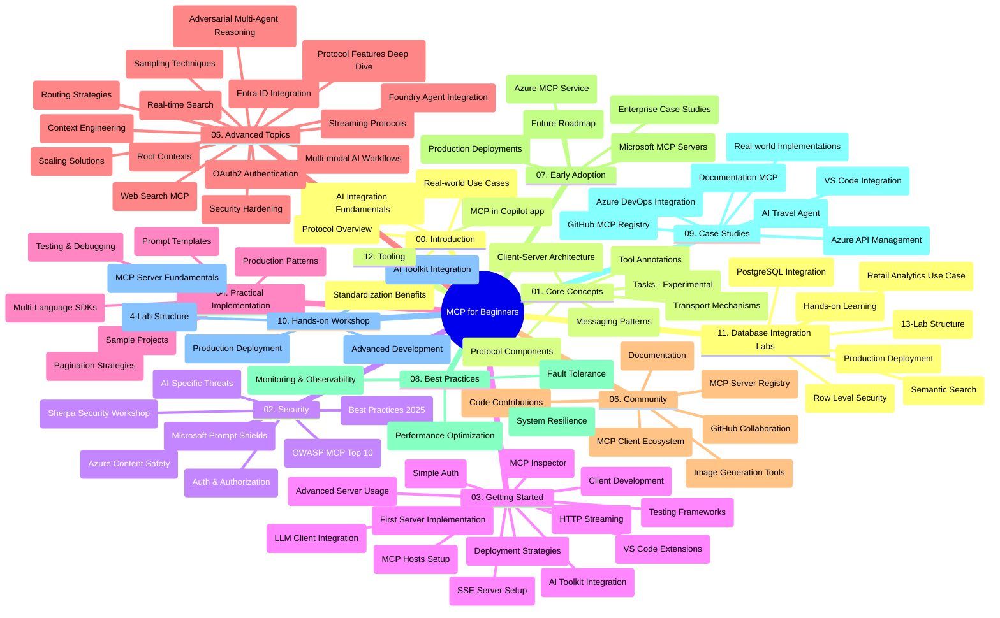

# Protokol kontextu modelu (MCP) pro začátečníky - studijní příručka

Tato studijní příručka poskytuje přehled o struktuře a obsahu repozitáře pro kurikulum „Protokol kontextu modelu (MCP) pro začátečníky“. Použijte tuto příručku pro efektivní navigaci v repozitáři a maximální využití dostupných zdrojů.

## Přehled repozitáře

Protokol kontextu modelu (MCP) je standardizovaný rámec pro interakce mezi AI modely a klientskými aplikacemi. MCP byl původně vytvořen společností Anthropic a nyní je spravován širší komunitou MCP prostřednictvím oficiální organizace na GitHubu. Tento repozitář nabízí komplexní kurikulum s praktickými ukázkami kódu v jazycích C#, Java, JavaScript, Python a TypeScript, určené pro vývojáře AI, systémové architekty a softwarové inženýry.

## Vizualizace kurikula

## Struktura repozitáře

Repozitář je organizován do dvanácti hlavních sekcí, přičemž každá se zaměřuje na jiný aspekt MCP:

1. **Úvod (00-Introduction/)**
   - Přehled protokolu kontextu modelu
   - Proč je standardizace důležitá v AI pipelinech
   - Praktické příklady a přínosy

2. **Základní koncepty (01-CoreConcepts/)**
   - Architektura klient-server
   - Klíčové komponenty protokolu
   - Vzory zpráv v MCP
   - Pohled do budoucna: [Co se mění v MCP: Release Candidate 2026-07-28](./01-CoreConcepts/mcp-2026-07-28-release-candidate.md) — bezstavové jádro protokolu, rámec rozšíření a očekávané vyřazení Roots/Sampling/Logging v příští verzi specifikace

3. **Bezpečnost (02-Security/)**
   - Hrozby bezpečnosti v systémech založených na MCP
   - Nejlepší praktiky pro zabezpečení implementací
   - Strategie autentizace a autorizace
   - **Komplexní bezpečnostní dokumentace**:
     - MCP Security Best Practices 2025
     - Průvodce implementací Azure Content Safety
     - MCP bezpečnostní kontroly a techniky
     - Rychlý přehled nejlepších MCP praktik
   - **Klíčová bezpečnostní témata**:
     - Útoky na injektování promptů a otrava nástrojů
     - Převzetí relace a problémy s „konfuzním zástupcem“
     - Zranitelnosti při průchodu tokenů
     - Nadměrná oprávnění a kontrola přístupu
     - Bezpečnost dodavatelského řetězce u AI komponent
     - Integrace Microsoft Prompt Shields

4. **Začínáme (03-GettingStarted/)**
   - Nastavení a konfigurace prostředí
   - Vytváření základních MCP serverů a klientů
   - Integrace se stávajícími aplikacemi
   - Zahrnuje sekce pro:
     - První implementaci serveru
     - Vývoj klienta
     - Integraci LLM klienta
     - Integraci VS Code
     - Server-Sent Events (SSE) server
     - Pokročilé použití serveru
     - HTTP streamování
     - Integrace AI Toolkit
     - Testovací strategie
     - Pokyny k nasazení

5. **Praktická implementace (04-PracticalImplementation/)**
   - Použití SDK v různých programovacích jazycích
   - Techniky ladění, testování a validace
   - Vytváření znovupoužitelných šablon promptů a pracovních postupů
   - Ukázkové projekty s implementačními příklady

6. **Pokročilá témata (05-AdvancedTopics/)**
   - Techniky inženýrství kontextu
   - Integrace Foundry agenta
   - Více módní AI pracovní postupy
   - Ukázky autentizace OAuth2
   - Schopnosti vyhledávání v reálném čase
   - Streamování v reálném čase
   - Implementace Root contextů
   - Strategie směrování
   - Vzorkovací techniky
   - Přístupy ke škálování
   - Bezpečnostní úvahy
   - Integrace bezpečnosti Entra ID
   - Integrace webového vyhledávání
   - Adversariální multi-agentní rozumění (vzorové debaty)

7. **Příspěvky komunity (06-CommunityContributions/)**
   - Jak přispívat kódem a dokumentací
   - Spolupráce přes GitHub
   - Vylepšení a zpětná vazba řízená komunitou
   - Použití různých MCP klientů (Claude Desktop, Cline, VSCode)
   - Práce s populárními MCP servery včetně generování obrázků

8. **Lekce z raného přijetí (07-LessonsfromEarlyAdoption/)**
   - Reálné implementace a úspěšné příběhy
   - Budování a nasazení řešení založených na MCP
   - Trendy a budoucí plán rozvoje
   - **Průvodce Microsoft MCP servery**: Komplexní průvodce 10 produkčně připravenými Microsoft MCP servery včetně:
     - Microsoft Learn Docs MCP Server
     - Azure MCP Server (15+ specializovaných konektorů)
     - GitHub MCP Server
     - Azure DevOps MCP Server
     - MarkItDown MCP Server
     - SQL Server MCP Server
     - Playwright MCP Server
     - Dev Box MCP Server
     - Microsoft Foundry MCP Server
     - Microsoft 365 Agents Toolkit MCP Server

9. **Nejlepší praktiky (08-BestPractices/)**
   - Ladění výkonu a optimalizace
   - Návrh odolných MCP systémů
   - Strategie testování a odolnosti

10. **Případové studie (09-CaseStudy/)**
    - **Sedm komplexních případových studií** demonstrujících univerzálnost MCP napříč různými scénáři:
    - **Azure AI Travel Agents**: Orchestrace více agentů s Azure OpenAI a AI Search
    - **Integrace Azure DevOps**: Automatizace pracovních toků s aktualizacemi dat YouTube
    - **Reálné načítání dokumentace v reálném čase**: Python konzolový klient s HTTP streamováním
    - **Interaktivní generátor studijních plánů**: Chainlit webová aplikace s konverzační AI
    - **Dokumentace v editoru**: Integrace VS Code s workflow GitHub Copilot
    - **Azure API Management**: Podniková integrace API s vytvořením MCP serveru
    - **GitHub MCP Registry**: Ekosystémový vývoj a platforma pro agentní integraci
    - Implementační příklady zahrnující podnikovou integraci, produktivitu vývojářů a rozvoj ekosystému

11. **Praktický workshop (10-StreamliningAIWorkflowsBuildingAnMCPServerWithAIToolkit/)**
    - Komplexní praktický workshop kombinující MCP s AI Toolkit
    - Budování inteligentních aplikací spojujících AI modely s reálnými nástroji
    - Praktické moduly pokrývající základy, vývoj vlastního serveru a strategie produkčního nasazení
    - **Struktura laboratoře**:
      - Laboratoř 1: Základy MCP serveru
      - Laboratoř 2: Pokročilý vývoj MCP serveru
      - Laboratoř 3: Integrace AI Toolkit
      - Laboratoř 4: Produkční nasazení a škálování
    - Učení založené na laboratořích s krok za krokem instrukcemi

12. **Laboratoře integrace databáze MCP serveru (11-MCPServerHandsOnLabs/)**
    - **Komplexní 13-laboratořová vzdělávací cesta** pro vytváření produkčně připravených MCP serverů s integrací PostgreSQL
    - **Implementace reálné maloobchodní analytiky** využívající příklad použití Zava Retail
    - **Podnikové vzory** včetně řádkové bezpečnosti (RLS), sémantického vyhledávání a multitenantního přístupu k datům
    - **Kompletní struktura laboratoří**:
      - **Laboratoře 00-03: Základy** - Úvod, architektura, bezpečnost, nastavení prostředí
      - **Laboratoře 04-06: Výstavba MCP serveru** - Návrh databáze, implementace MCP serveru, vývoj nástrojů
      - **Laboratoře 07-09: Pokročilé funkce** - Sémantické vyhledávání, testování a ladění, integrace VS Code
      - **Laboratoře 10-12: Produkce a nejlepší praktiky** - Nasazení, monitorování, optimalizace
    - **Použité technologie**: Rámec FastMCP, PostgreSQL, Azure OpenAI, Azure Container Apps, Application Insights
    - **Výstupy vzdělávání**: Produkčně připravené MCP servery, vzory integrace databáze, AI-poháněná analytika, podnikově zabezpečené řešení

13. **Nástroje (12-tooling/)**
    - Naučte se používat MCP v aplikaci Copilot a dalších nástrojích

## Další zdroje

Repozitář obsahuje podpůrné zdroje:

- **Složka obrázků**: Obsahuje diagramy a ilustrace využité v celém kurikulu
- **Překlady**: Podpora vícejazyčnosti s automatizovanými překlady dokumentace
- **Oficiální MCP zdroje**:
  - [MCP Dokumentace](https://modelcontextprotocol.io/)
  - [MCP Specifikace](https://spec.modelcontextprotocol.io/)
  - [MCP GitHub Repozitář](https://github.com/modelcontextprotocol)

## Jak používat tento repozitář

1. **Sekvenční učení**: Postupujte kapitolami v pořadí (00 až 11) pro strukturovaný zážitek z učení.
2. **Jazykově specifický fokus**: Pokud vás zajímá konkrétní programovací jazyk, prozkoumejte adresáře samples pro implementace ve vámi preferovaném jazyce.
3. **Praktická implementace**: Začněte sekcí „Začínáme“ pro nastavení prostředí a vytvoření prvního MCP serveru a klienta.
4. **Pokročilý průzkum**: Jakmile zvládnete základy, ponořte se do pokročilých témat pro rozšíření vašich znalostí.
5. **Zapojení komunity**: Připojte se ke komunitě MCP prostřednictvím diskuzí na GitHubu a kanálů Discord pro spojení s odborníky a dalšími vývojáři.

## MCP klienti a nástroje

Kurikulum pokrývá různé MCP klienty a nástroje:

1. **Oficiální klienti**:
   - Visual Studio Code
   - MCP ve Visual Studio Code
   - Claude Desktop
   - Claude ve VSCode
   - Claude API

2. **Klienti komunity**:
   - Cline (terminálový)
   - Cursor (editor kódu)
   - ChatMCP
   - Windsurf

3. **Nástroje pro správu MCP**:
   - MCP CLI
   - MCP Manager
   - MCP Linker
   - MCP Router

## Oblíbené MCP servery

Repozitář představuje různé MCP servery, včetně:

1. **Oficiální Microsoft MCP servery**:
   - Microsoft Learn Docs MCP Server
   - Azure MCP Server (15+ specializovaných konektorů)
   - GitHub MCP Server
   - Azure DevOps MCP Server
   - MarkItDown MCP Server
   - SQL Server MCP Server
   - Playwright MCP Server
   - Dev Box MCP Server
   - Microsoft Foundry MCP Server
   - Microsoft 365 Agents Toolkit MCP Server

2. **Oficiální referenční servery**:
   - Filesystem
   - Fetch
   - Memory
   - Sequential Thinking

3. **Generování obrázků**:
   - Azure OpenAI DALL-E 3
   - Stable Diffusion WebUI
   - Replicate

4. **Vývojové nástroje**:
   - Git MCP
   - Terminálová kontrola
   - Code Assistant

5. **Specializované servery**:
   - Salesforce
   - Microsoft Teams
   - Jira & Confluence

## Přispívání

Tento repozitář vítá příspěvky od komunity. Viz sekce Příspěvky komunity pro návod, jak efektivně přispívat do ekosystému MCP.

----

*Tato studijní příručka byla naposledy aktualizována 5. února 2026, odráží nejnovější MCP Specifikaci 2025-11-25 a poskytuje přehled repozitáře k tomuto datu. Obsah repozitáře může být po tomto datu aktualizován.*

*Dodatek (2. července 2026): pod sekcí [01-CoreConcepts](./01-CoreConcepts/mcp-2026-07-28-release-candidate.md) byla přidána lekce o RC specifikace MCP `2026-07-28`; základ kurikula zůstává 2025-11-25 až do vydání nové specifikace.*

---

<!-- CO-OP TRANSLATOR DISCLAIMER START -->
**Prohlášení o omezení odpovědnosti**:
Tento dokument byl přeložen pomocí AI překladatelské služby [Co-op Translator](https://github.com/Azure/co-op-translator). Přestože usilujeme o co největší přesnost, mějte prosím na paměti, že automatizované překlady mohou obsahovat chyby nebo nepřesnosti. Originální dokument v jeho mateřském jazyce by měl být považován za autoritativní zdroj. Pro kritické informace se doporučuje profesionální lidský překlad. Nejsme odpovědní za jakékoli nedorozumění nebo nesprávné interpretace vzniklé použitím tohoto překladu.
<!-- CO-OP TRANSLATOR DISCLAIMER END -->