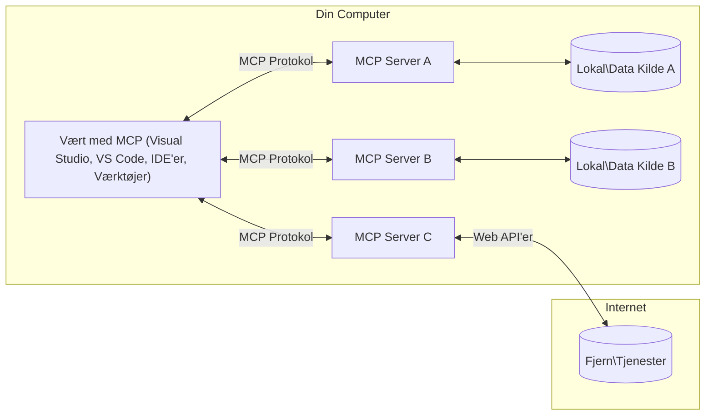

# MCP Core Concepts: Mestring af Model Context Protocol til AI-integration

[](https://youtu.be/earDzWGtE84)

_(Klik på billedet ovenfor for at se videoen til denne lektion)_

[Model Context Protocol (MCP)](https://github.com/modelcontextprotocol) er en kraftfuld, standardiseret ramme, der optimerer kommunikationen mellem store sprogmodeller (LLM'er) og eksterne værktøjer, applikationer og datakilder.  
Denne guide vil lede dig gennem de grundlæggende koncepter i MCP. Du vil lære om dens klient-server-arkitektur, essentielle komponenter, kommunikationsmekanik og bedste praksis for implementering.

- **Udtrykkeligt brugersamtykke**: Al dataadgang og operationer kræver udtrykkeligt bruger-godkendelse før udførelse. Brugere skal klart forstå, hvilken data der vil blive tilgået, og hvilke handlinger der vil blive udført, med granulær kontrol over tilladelser og autorisationer.

- **Beskyttelse af dataprivatliv**: Brugerdata eksponeres kun med udtrykkeligt samtykke og skal beskyttes af robuste adgangskontroller gennem hele interaktionslivscyklussen. Implementeringer skal forhindre uautoriseret datatransmission og opretholde strenge privatlivsgrænser.

- **Sikkerhed ved værktøjseksekvering**: Hver værktøjsanmodning kræver udtrykkeligt brugersamtykke med klar forståelse af værktøjets funktionalitet, parametre og potentielle konsekvenser. Robuste sikkerhedsgrænser skal forhindre utilsigtet, usikker eller ondsindet værktøjseksekvering.

- **Transportlaget sikkerhed**: Alle kommunikationskanaler bør anvende passende kryptering og autentificeringsmekanismer. Fjernforbindelser bør implementere sikre transportprotokoller og korrekt håndtering af legitimationsoplysninger.

#### Implementeringsretningslinjer:

- **Tilladelsesstyring**: Implementer finmaskede tilladelsessystemer, der tillader brugere at kontrollere, hvilke servere, værktøjer og ressourcer der er tilgængelige  
- **Autentificering & Autorisation**: Brug sikre autentificeringsmetoder (OAuth, API-nøgler) med korrekt token-håndtering og udløb  
- **Inputvalidering**: Valider alle parametre og datainput i henhold til definerede skemaer for at forhindre injektionsangreb  
- **Audit-logging**: Vedligehold omfattende logfiler over alle operationer til sikkerhedsovervågning og overholdelse

## Oversigt

Denne lektion udforsker den grundlæggende arkitektur og komponenter, der udgør Model Context Protocol (MCP) økosystemet. Du vil lære om klient-server-arkitekturen, nøglekomponenter og kommunikationsmekanismer, der driver MCP-interaktioner.

## Vigtige læringsmål

Ved slutningen af denne lektion vil du kunne:

- Forstå MCP klient-server-arkitekturen.  
- Identificere roller og ansvar for Hosts, Clients og Servers.  
- Analysere de centrale funktioner, som gør MCP til et fleksibelt integrationslag.  
- Lære hvordan information flyder indenfor MCP-økosystemet.  
- Få praktiske indsigter gennem kodeeksempler i .NET, Java, Python og JavaScript.  

## MCP-arkitektur: Et dybere kig

MCP-økosystemet er bygget på et klient-server-modul. Denne modulære struktur tillader AI-applikationer at interagere effektivt med værktøjer, databaser, API'er og kontekstuelle ressourcer. Lad os nedbryde denne arkitektur i dens kernekomponenter.

I sin kerne følger MCP en klient-server-arkitektur, hvor en host-applikation kan oprette forbindelse til flere servere:



- **MCP Hosts**: Programmer som VSCode, Claude Desktop, IDE'er eller AI-værktøjer, der ønsker at få adgang til data gennem MCP  
- **MCP Clients**: Protokol-klienter, der opretholder 1:1 forbindelser til servere  
- **MCP Servers**: Letvægtsprogrammer, der hver eksponerer specifikke kapabiliteter gennem den standardiserede Model Context Protocol  
- **Lokale datakilder**: Dine computers filer, databaser og tjenester, som MCP-servere sikkert kan tilgå  
- **Fjernservices**: Eksterne systemer tilgængelige over internettet, som MCP-servere kan forbinde til via API'er.

MCP-protokollen er en udviklende standard, der bruger dato-baseret versionsstyring (formatet YYYY-MM-DD). Den nuværende protokolversion er **2025-11-25**. Du kan se de seneste opdateringer til [protokolspecifikationen](https://modelcontextprotocol.io/specification/2025-11-25/)

> **Fremadskuende:** en releasekandidat til den næste specifikationsversion, **2026-07-28**, blev annonceret i maj 2026 og forventes frigivet den 28. juli 2026. Den gør protokollen stateless på transportlaget (fjernelse af `initialize` håndtryk og sessions-ID'er), formaliserer et Extensions-framework og udfaser Roots, Sampling og Logging til fordel for nyere mønstre. Se [What's Changing in MCP: The 2026-07-28 Release Candidate](./mcp-2026-07-28-release-candidate.md) for en fuld gennemgang.

### 1. Hosts

I Model Context Protocol (MCP) er **Hosts** AI-applikationer, der fungerer som den primære grænseflade, hvorigennem brugere interagerer med protokollen. Hosts koordinerer og administrerer forbindelser til flere MCP-servere ved at oprette dedikerede MCP-klienter for hver serverforbindelse. Eksempler på Hosts inkluderer:

- **AI-applikationer**: Claude Desktop, Visual Studio Code, Claude Code  
- **Udviklingsmiljøer**: IDE'er og kodeeditorer med MCP-integration  
- **Tilpassede applikationer**: Formålsbyggede AI-agenter og værktøjer

**Hosts** er applikationer, der koordinerer AI-modelinteraktioner. De:

- **Orkestrerer AI-modeller**: Kører eller interagerer med LLM'er for at generere svar og koordinere AI-arbejdsgange  
- **Administrerer klientforbindelser**: Opretter og opretholder én MCP-klient per MCP-serverforbindelse  
- **Styrer brugergrænsefladen**: Håndterer samtaleflow, brugerinteraktioner og svarpræsentation  
- **Håndhæver sikkerhed**: Styrer tilladelser, sikkerhedskrav og autentificering  
- **Håndterer brugersamtykke**: Administrerer brugerens godkendelse til datadeling og værktøjseksekvering  

### 2. Clients

**Clients** er essentielle komponenter, der opretholder dedikerede én-til-én forbindelser mellem Hosts og MCP-servere. Hver MCP-klient oprettes af Host for at forbinde til en specifik MCP-server, hvilket sikrer organiserede og sikre kommunikationskanaler. Flere klienter gør det muligt for Hosts at forbinde til flere servere samtidigt.

**Klienter** er forbindelseskomponenter inden for host-applikationen. De:

- **Protokolkommunikation**: Sender JSON-RPC 2.0-anmodninger til servere med prompts og instruktioner  
- **Kapabilitetsforhandling**: Forhandler understøttede funktioner og protokolversioner med servere under initialisering  
- **Værktøjseksekvering**: Håndterer værktøjsanmodninger fra modeller og behandler svar  
- **Realtime-opdateringer**: Håndterer notifikationer og realtidsopdateringer fra servere  
- **Svarbehandling**: Behandler og formaterer server-svar til visning for brugere  

### 3. Servers

**Servers** er programmer, der leverer kontekst, værktøjer og kapabiliteter til MCP-klienter. De kan køre lokalt (på samme maskine som Host) eller fjernstyret (på eksterne platforme) og er ansvarlige for at håndtere klientforespørgsler og levere strukturerede svar. Servere eksponerer specifik funktionalitet via den standardiserede Model Context Protocol.

**Servere** er tjenester, der yder kontekst og kapabiliteter. De:

- **Funktionregistrering**: Registrerer og eksponerer tilgængelige primitiver (ressourcer, prompts, værktøjer) til klienter  
- **Anmodningsbehandling**: Modtager og udfører værktøjskald, ressourceforespørgsler og prompt-forespørgsler fra klienter  
- **Kontekstlevering**: Giver kontekstuel information og data for at forbedre modelsvar  
- **Statusstyring**: Vedligeholder sessionsstatus og håndterer tilstandsafhængige interaktioner efter behov  
- **Realtime-notifikationer**: Sender notifikationer om kapabilitetsændringer og opdateringer til tilsluttede klienter  

Servere kan udvikles af alle for at udvide modelkapabiliteter med specialiseret funktionalitet, og de understøtter både lokale og fjernudrulningsscenarier.

### 4. Server Primitives

Servere i Model Context Protocol (MCP) leverer tre kerne-**primitiver**, der definerer de grundlæggende byggesten for rige interaktioner mellem klienter, hosts og sproglige modeller. Disse primitiver specificerer typerne af kontekstuel information og handlinger, som er tilgængelige gennem protokollen.

MCP-servere kan eksponere enhver kombination af de følgende tre kerneprimitiver:

#### Ressourcer

**Ressourcer** er datakilder, der leverer kontekstuel information til AI-applikationer. De repræsenterer statisk eller dynamisk indhold, der kan forbedre modelforståelse og beslutningstagning:

- **Kontekstuel data**: Struktureret information og kontekst til AI-modelforbrug  
- **Vidensbaser**: Dokumentarkiver, artikler, manualer og forskningspapirer  
- **Lokale datakilder**: Filer, databaser og lokal systeminformation  
- **Ekstern data**: API-svar, webtjenester og data fra eksterne systemer  
- **Dynamisk indhold**: Realtidsdata, der opdateres baseret på eksterne betingelser

Ressourcer identificeres ved URI'er og understøtter opdagelse via `resources/list` og hentning via `resources/read` metoder:

```text
file://documents/project-spec.md
database://production/users/schema
api://weather/current
```

#### Prompts

**Prompts** er genanvendelige skabeloner, der hjælper med at strukturere interaktioner med sproglige modeller. De leverer standardiserede interaktionsmønstre og skabelonarbejdsgange:

- **Skabelonbaserede interaktioner**: Forudstrukturerede beskeder og samtalestartere  
- **Arbejdsgangsskabeloner**: Standardiserede sekvenser for almindelige opgaver og interaktioner  
- **Few-shot eksempler**: Eksempelbaserede skabeloner til modelinstruktion  
- **Systemprompts**: Grundlæggende prompts, der definerer modeladfærd og kontekst  
- **Dynamiske skabeloner**: Parameteriserede prompts, som tilpasses specifikke kontekster

Prompts understøtter variabel substitution og kan opdages via `prompts/list` og hentes med `prompts/get`:

```markdown
Generate a {{task_type}} for {{product}} targeting {{audience}} with the following requirements: {{requirements}}
```

#### Værktøjer

**Værktøjer** er eksekverbare funktioner, som AI-modeller kan påkalde for at udføre specifikke handlinger. De repræsenterer "verberne" i MCP-økosystemet, der gør det muligt for modeller at interagere med eksterne systemer:

- **Eksekverbare funktioner**: Diskrete operationer, som modeller kan påkalde med bestemte parametre  
- **Integration med eksterne systemer**: API-kald, databaseforespørgsler, filoperationer, beregninger  
- **Unik identitet**: Hvert værktøj har et unikt navn, beskrivelse og parameterskema  
- **Struktureret I/O**: Værktøjer accepterer validerede parametre og returnerer strukturerede, typerede svar  
- **Handlingskapabiliteter**: Gør modeller i stand til at udføre virkelige handlinger og hente live data

Værktøjer defineres med JSON Schema til parameter-validering og opdages gennem `tools/list` og udføres via `tools/call`. Værktøjer kan også inkludere **ikoner** som yderligere metadata for bedre UI-præsentation.

**Værktøjsannotationer**: Værktøjer understøtter adfærdsannotationer (fx `readOnlyHint`, `destructiveHint`), der beskriver, om et værktøj er skrivebeskyttet eller destruktivt, hvilket hjælper klienter med at træffe informerede beslutninger om værktøjseksekvering.

Eksempel på værktøjsdefinition:

```typescript
server.tool(
  "search_products", 
  {
    query: z.string().describe("Search query for products"),
    category: z.string().optional().describe("Product category filter"),
    max_results: z.number().default(10).describe("Maximum results to return")
  }, 
  async (params) => {
    // Udfør søgning og returnér strukturerede resultater
    return await productService.search(params);
  }
);
```

## Client Primitives

I Model Context Protocol (MCP) kan **klienter** eksponere primitiver, der gør det muligt for servere at anmode om yderligere kapabiliteter fra host-applikationen. Disse klient-side primitiver muliggør rigere, mere interaktive serverimplementeringer, som kan få adgang til AI-modelkapabiliteter og brugerinteraktioner.

### Sampling

> **Tilbagekaldelsesmeddelelse:** `2026-07-28` releasekandidaten markerer Sampling som udfaset til fordel for direkte integration med LLM-udbyder-API'er. Det fungerer stadig i `2025-11-25` og mindst et år efter enhver udfasning, men nye designs bør foretrække erstatningsmønstret. Se [What's Changing in MCP: The 2026-07-28 Release Candidate](./mcp-2026-07-28-release-candidate.md).

**Sampling** tillader, at servere anmoder om sprogmodelkomplettering fra klientens AI-applikation. Denne primitiv gør det muligt for servere at få adgang til LLM-kapabiliteter uden at indlejre egne modelafhængigheder:

- **Modeluafhængig adgang**: Servere kan anmode om komplettering uden at inkludere LLM SDK'er eller håndtere modeladgang  
- **Server-initieret AI**: Gør det muligt for servere at autonomt generere indhold ved hjælp af klientens AI-model  
- **Rekursive LLM-interaktioner**: Understøtter komplekse scenarier, hvor servere har brug for AI-assistance til behandling  
- **Dynamisk indholdsgenerering**: Gør det muligt for servere at skabe kontekstuelle svar ved hjælp af hostens model  
- **Værktøjsopkaldsunderstøttelse**: Servere kan inkludere `tools` og `toolChoice` parametre for at gøre det muligt for klientens model at påkalde værktøjer under sampling

Sampling initieres via metoden `sampling/complete`, hvor servere sender kompletteringsanmodninger til klienter.

### Roots

> **Tilbagekaldelsesmeddelelse:** `2026-07-28` releasekandidaten markerer Roots som udfaset til fordel for værktøjsparametre, resource-URI'er eller serverkonfiguration. Det fungerer stadig i `2025-11-25` og mindst et år efter enhver udfasning. Se [What's Changing in MCP: The 2026-07-28 Release Candidate](./mcp-2026-07-28-release-candidate.md).

**Roots** giver en standardiseret måde for klienter at eksponere filsystemgrænser til servere, hvilket hjælper servere med at forstå, hvilke mapper og filer de har adgang til:

- **Filsystemgrænser**: Definér grænser for hvor servere kan operere i filsystemet  
- **Adgangskontrol**: Hjælper servere med at forstå, hvilke kataloger og filer de har tilladelse til at tilgå  
- **Dynamiske opdateringer**: Klienter kan underrette servere, når listen over roots ændres  
- **URI-baseret identifikation**: Roots bruger `file://` URI'er til at identificere tilgængelige mapper og filer

Roots opdages via metoden `roots/list`, og klienter sender `notifications/roots/list_changed`, når roots ændres.

### Elicitation

**Elicitation** gør det muligt for servere at anmode om yderligere information eller bekræftelse fra brugere gennem klientgrænsefladen:

- **Brugerinputforespørgsler**: Servere kan bede om yderligere information, når det er nødvendigt for værktøjseksekvering  
- **Bekræftelsesdialoger**: Anmod om brugerens godkendelse til følsomme eller indflydelsesrige operationer  
- **Interaktive arbejdsgange**: Gør det muligt for servere at skabe trin-for-trin brugerinteraktioner  
- **Dynamisk parameterindsamling**: Indsaml manglende eller valgfrie parametre under værktøjseksekvering

Elicitation-forespørgsler foretages via metoden `elicitation/request` for at indsamle brugerinput gennem klientens grænseflade.

**URL Mode Elicitation**: Servere kan også anmode om URL-baserede brugerinteraktioner, hvilket giver servere mulighed for at dirigere brugere til eksterne websider til autentificering, bekræftelse eller dataindtastning.

### Logging
> **Aflysningsmeddelelse:** udgivelseskandidaten `2026-07-28` markerer Logging som udfaset til fordel for `stderr` til stdio-transporter og OpenTelemetry for struktureret observabilitet. Den fortsætter med at fungere i `2025-11-25` og mindst et år efter enhver udfasning. Se [Hvad ændres i MCP: Udgivelseskandidaten 2026-07-28](./mcp-2026-07-28-release-candidate.md).

**Logging** tillader servere at sende strukturerede logbeskeder til klienter for debugging, overvågning og operationel synlighed:

- **Debugging Support**: Gør det muligt for servere at levere detaljerede eksekveringslogs til fejlfinding
- **Operationel Overvågning**: Sender statusopdateringer og ydelsesmålinger til klienter
- **Fejlrapportering**: Giver detaljeret fejlkontekst og diagnostisk information
- **Revisionsspor**: Opretter omfattende logs af serveroperationer og beslutninger

Logging-beskeder sendes til klienter for at give gennemsigtighed i serveroperationer og lette debugging.

## Informationsflow i MCP

Model Context Protocol (MCP) definerer et struktureret informationsflow mellem værter, klienter, servere og modeller. Forståelse af dette flow hjælper med at klarlægge, hvordan brugerforespørgsler behandles, og hvordan eksterne værktøjer og data integreres i modelresponser.

- **Verten initierer forbindelse**  
  Værtsapplikationen (såsom en IDE eller chatinterface) etablerer en forbindelse til en MCP-server, typisk via STDIO, WebSocket eller en anden understøttet transport.

- **Kapasitetsforhandling**  
  Klienten (indlejret i værten) og serveren udveksler information om deres understøttede funktioner, værktøjer, ressourcer og protokolversioner. Dette sikrer, at begge parter forstår, hvilke kapaciteter der er tilgængelige for sessionen.

- **Brugerforespørgsel**  
  Brugeren interagerer med værten (f.eks. indtaster en prompt eller kommando). Værten indsamler denne input og sender den til klienten til behandling.

- **Brug af ressourcer eller værktøjer**  
  - Klienten kan anmode om yderligere kontekst eller ressourcer fra serveren (såsom filer, databaseposter eller vidensbaseartikler) for at berige modellens forståelse.  
  - Hvis modellen vurderer, at et værktøj er nødvendigt (f.eks. for at hente data, udføre en beregning eller kalde en API), sender klienten en anmodning om værktøjsindkaldelse til serveren, hvor værktøjets navn og parametre specificeres.

- **Servereksekvering**  
  Serveren modtager ressource- eller værktøjsanmodningen, udfører de nødvendige operationer (såsom at køre en funktion, forespørge en database eller hente en fil) og returnerer resultaterne til klienten i et struktureret format.

- **Responsgenerering**  
  Klienten integrerer serverens svar (ressourcedata, værktøjsoutput m.m.) i den igangværende modelinteraktion. Modellen bruger denne information til at generere et omfattende og kontekstuelt relevant svar.

- **Resultatpræsentation**  
  Verten modtager det endelige output fra klienten og præsenterer det for brugeren, ofte inklusive både den genererede tekst fra modellen og eventuelle resultater fra værktøjsekskveringer eller ressourceopslag.

Dette flow gør det muligt for MCP at understøtte avancerede, interaktive og kontekstbevidste AI-applikationer ved sømløst at forbinde modeller med eksterne værktøjer og datakilder.

## Protokolarkitektur & lag

MCP består af to distinkte arkitektur-lag, som arbejder sammen for at tilbyde en komplet kommunikationsramme:

### Datalag

**Datalaget** implementerer den grundlæggende MCP-protokol ved brug af **JSON-RPC 2.0** som fundament. Dette lag definerer beskedstruktur, semantik og interaktionsmønstre:

#### Kernekomponenter:

- **JSON-RPC 2.0 Protokol**: Al kommunikation bruger standardiseret JSON-RPC 2.0 beskedformat til metodekald, svar og notifikationer  
- **Livscyklusstyring**: Håndterer forbindelsesinitialisering, kapacitetsforhandling og sessionsafslutning mellem klienter og servere  
- **Serverprimitive**: Gør det muligt for servere at tilbyde kernefunktionalitet via værktøjer, ressourcer og prompts  
- **Klientprimitive**: Gør det muligt for servere at anmode om prøvetagning fra LLM'er, indhente brugerinput og sende logbeskeder  
- **Real-time Notifikationer**: Understøtter asynkrone notifikationer for dynamiske opdateringer uden polling

#### Nøglefunktioner:

- **Protokolversionsforhandling**: Bruger datobaseret versionskontrol (ÅÅÅÅ-MM-DD) for at sikre kompatibilitet  
- **Kapacitetsopdagelse**: Klienter og servere udveksler oplysninger om understøttede funktioner under initialisering  
- **Stateful Sessions**: Bevarer forbindelsesstatus på tværs af flere interaktioner for kontinuitet i konteksten

### Transportlag

**Transportlaget** håndterer kommunikationskanaler, beskedindramning og autentifikation mellem MCP-deltagere:

#### Understøttede transportmekanismer:

1. **STDIO-Transport**:  
   - Bruger standard input/output-strømme til direkte proceskommunikation  
   - Optimalt til lokale processer på samme maskine uden netværksomkostninger  
   - Almindeligt brugt til lokale MCP-serverimplementeringer

2. **Streamable HTTP Transport**:  
   - Bruger HTTP POST til klient-til-server beskeder  
   - Valgfri Server-Sent Events (SSE) til server-til-klient streaming  
   - Muliggør fjernserverkommunikation over netværk  
   - Understøtter standard HTTP-autentifikation (bearer tokens, API-nøgler, brugerdefinerede headers)  
   - MCP anbefaler OAuth til sikker token-baseret autentifikation

#### Transportabstraktion:

Transportlaget abstraherer kommunikationsdetaljer fra datalaget, hvilket muliggør brug af samme JSON-RPC 2.0 beskedformat på tværs af alle transportmekanismer. Denne abstraktion gør det muligt for applikationer problemfrit at skifte mellem lokale og fjernservere.

### Sikkerhedsmæssige overvejelser

MCP-implementeringer skal overholde flere kritiske sikkerhedsprincipper for at sikre sikre, troværdige og pålidelige interaktioner på tværs af alle protokoloperationer:

- **Brugersamtykke og kontrol**: Brugere skal give eksplicit samtykke, før nogen data tilgås eller operationer udføres. De skal have klar kontrol over, hvilke data der deles, og hvilke handlinger der autoriseres, understøttet af intuitive brugergrænseflader til gennemgang og godkendelse af aktiviteter.

- **Databeskyttelse**: Brugerdata bør kun eksponeres med eksplicit samtykke og skal beskyttes med passende adgangskontroller. MCP-implementeringer skal forebygge uautoriseret dataoverførsel og sikre, at privatliv opretholdes gennem alle interaktioner.

- **Værktøjssikkerhed**: Før ethvert værktøj kaldes, kræves eksplicit brugersamtykke. Brugere skal have en klar forståelse af hvert værktøjs funktionalitet, og robuste sikkerhedsbarrierer skal håndhæves for at forhindre utilsigtet eller usikker værktøjseksekvering.

Ved at følge disse sikkerhedsprincipper sikrer MCP brugerens tillid, privatliv og sikkerhed i alle protokolinteraktioner, samtidig med at kraftfulde AI-integrationer muliggøres.

## Kodeeksempler: centrale komponenter

Nedenfor findes kodeeksempler i flere populære programmeringssprog, der illustrerer, hvordan man implementerer nøglekomponenter og værktøjer i en MCP-server.

### .NET-eksempel: Oprettelse af en simpel MCP-server med værktøjer

Her er et praktisk .NET-kodeeksempel, der demonstrerer, hvordan man implementerer en simpel MCP-server med brugerdefinerede værktøjer. Eksemplet viser, hvordan man definerer og registrerer værktøjer, håndterer forespørgsler og forbinder serveren via Model Context Protocol.

```csharp
using System;
using System.Threading.Tasks;
using ModelContextProtocol.Server;
using ModelContextProtocol.Server.Transport;
using ModelContextProtocol.Server.Tools;

public class WeatherServer
{
    public static async Task Main(string[] args)
    {
        // Create an MCP server
        var server = new McpServer(
            name: "Weather MCP Server",
            version: "1.0.0"
        );
        
        // Register our custom weather tool
        server.AddTool<string, WeatherData>("weatherTool", 
            description: "Gets current weather for a location",
            execute: async (location) => {
                // Call weather API (simplified)
                var weatherData = await GetWeatherDataAsync(location);
                return weatherData;
            });
        
        // Connect the server using stdio transport
        var transport = new StdioServerTransport();
        await server.ConnectAsync(transport);
        
        Console.WriteLine("Weather MCP Server started");
        
        // Keep the server running until process is terminated
        await Task.Delay(-1);
    }
    
    private static async Task<WeatherData> GetWeatherDataAsync(string location)
    {
        // This would normally call a weather API
        // Simplified for demonstration
        await Task.Delay(100); // Simulate API call
        return new WeatherData { 
            Temperature = 72.5,
            Conditions = "Sunny",
            Location = location
        };
    }
}

public class WeatherData
{
    public double Temperature { get; set; }
    public string Conditions { get; set; }
    public string Location { get; set; }
}
```

### Java-eksempel: MCP-serverkomponenter

Dette eksempel demonstrerer den samme MCP-server og værktøjsregistrering som .NET-eksemplet ovenfor, men implementeret i Java.

```java
import io.modelcontextprotocol.server.McpServer;
import io.modelcontextprotocol.server.McpToolDefinition;
import io.modelcontextprotocol.server.transport.StdioServerTransport;
import io.modelcontextprotocol.server.tool.ToolExecutionContext;
import io.modelcontextprotocol.server.tool.ToolResponse;

public class WeatherMcpServer {
    public static void main(String[] args) throws Exception {
        // Opret en MCP-server
        McpServer server = McpServer.builder()
            .name("Weather MCP Server")
            .version("1.0.0")
            .build();
            
        // Registrer et vejrværktøj
        server.registerTool(McpToolDefinition.builder("weatherTool")
            .description("Gets current weather for a location")
            .parameter("location", String.class)
            .execute((ToolExecutionContext ctx) -> {
                String location = ctx.getParameter("location", String.class);
                
                // Hent vejruddata (forenklet)
                WeatherData data = getWeatherData(location);
                
                // Returner formateret svar
                return ToolResponse.content(
                    String.format("Temperature: %.1f°F, Conditions: %s, Location: %s", 
                    data.getTemperature(), 
                    data.getConditions(), 
                    data.getLocation())
                );
            })
            .build());
        
        // Forbind serveren ved hjælp af stdio-transport
        try (StdioServerTransport transport = new StdioServerTransport()) {
            server.connect(transport);
            System.out.println("Weather MCP Server started");
            // Hold serveren kørende indtil processen afsluttes
            Thread.currentThread().join();
        }
    }
    
    private static WeatherData getWeatherData(String location) {
        // Implementeringen ville kalde en vejr-API
        // Forenklet til eksemplets formål
        return new WeatherData(72.5, "Sunny", location);
    }
}

class WeatherData {
    private double temperature;
    private String conditions;
    private String location;
    
    public WeatherData(double temperature, String conditions, String location) {
        this.temperature = temperature;
        this.conditions = conditions;
        this.location = location;
    }
    
    public double getTemperature() {
        return temperature;
    }
    
    public String getConditions() {
        return conditions;
    }
    
    public String getLocation() {
        return location;
    }
}
```

### Python-eksempel: Bygning af en MCP-server

Dette eksempel bruger fastmcp, så sørg for at installere det først:

```python
pip install fastmcp
```
Kodeeksempel:

```python
#!/usr/bin/env python3
import asyncio
from fastmcp import FastMCP
from fastmcp.transports.stdio import serve_stdio

# Opret en FastMCP-server
mcp = FastMCP(
    name="Weather MCP Server",
    version="1.0.0"
)

@mcp.tool()
def get_weather(location: str) -> dict:
    """Gets current weather for a location."""
    return {
        "temperature": 72.5,
        "conditions": "Sunny",
        "location": location
    }

# Alternativ tilgang ved brug af en klasse
class WeatherTools:
    @mcp.tool()
    def forecast(self, location: str, days: int = 1) -> dict:
        """Gets weather forecast for a location for the specified number of days."""
        return {
            "location": location,
            "forecast": [
                {"day": i+1, "temperature": 70 + i, "conditions": "Partly Cloudy"}
                for i in range(days)
            ]
        }

# Registrer klasseværktøjer
weather_tools = WeatherTools()

# Start serveren
if __name__ == "__main__":
    asyncio.run(serve_stdio(mcp))
```

### JavaScript-eksempel: Oprettelse af en MCP-server

Dette eksempel viser oprettelse af MCP-server i JavaScript og registrering af to vejrrelaterede værktøjer.

```javascript
// Brug af den officielle Model Context Protocol SDK
import { McpServer } from "@modelcontextprotocol/sdk/server/mcp.js";
import { StdioServerTransport } from "@modelcontextprotocol/sdk/server/stdio.js";
import { z } from "zod"; // Til parameter validering

// Opret en MCP-server
const server = new McpServer({
  name: "Weather MCP Server",
  version: "1.0.0"
});

// Definer et vejrværktøj
server.tool(
  "weatherTool",
  {
    location: z.string().describe("The location to get weather for")
  },
  async ({ location }) => {
    // Dette ville normalt kalde en vejr-API
    // Forenklet til demonstration
    const weatherData = await getWeatherData(location);
    
    return {
      content: [
        { 
          type: "text", 
          text: `Temperature: ${weatherData.temperature}°F, Conditions: ${weatherData.conditions}, Location: ${weatherData.location}` 
        }
      ]
    };
  }
);

// Definer et prognoseværktøj
server.tool(
  "forecastTool",
  {
    location: z.string(),
    days: z.number().default(3).describe("Number of days for forecast")
  },
  async ({ location, days }) => {
    // Dette ville normalt kalde en vejr-API
    // Forenklet til demonstration
    const forecast = await getForecastData(location, days);
    
    return {
      content: [
        { 
          type: "text", 
          text: `${days}-day forecast for ${location}: ${JSON.stringify(forecast)}` 
        }
      ]
    };
  }
);

// Hjælpefunktioner
async function getWeatherData(location) {
  // Simuler API-kald
  return {
    temperature: 72.5,
    conditions: "Sunny",
    location: location
  };
}

async function getForecastData(location, days) {
  // Simuler API-kald
  return Array.from({ length: days }, (_, i) => ({
    day: i + 1,
    temperature: 70 + Math.floor(Math.random() * 10),
    conditions: i % 2 === 0 ? "Sunny" : "Partly Cloudy"
  }));
}

// Forbind serveren ved hjælp af stdio transport
const transport = new StdioServerTransport();
server.connect(transport).catch(console.error);

console.log("Weather MCP Server started");
```

Dette JavaScript-eksempel demonstrerer, hvordan man opretter en MCP-server ved brug af Model Context Protocol SDK. Det viser, hvordan man registrerer to værktøjer med navnene `weatherTool` og `forecastTool` og gør dem tilgængelige for MCP-klienter gennem `StdioServerTransport`.

## Sikkerhed og autorisation

MCP inkluderer flere indbyggede koncepter og mekanismer til håndtering af sikkerhed og autorisation gennem protokollen:

1. **Værktøjstilladelseskontrol**:  
  Klienter kan specificere, hvilke værktøjer en model må anvende under en session. Dette sikrer, at kun eksplicit autoriserede værktøjer er tilgængelige, hvilket reducerer risikoen for utilsigtede eller usikre operationer. Tilladelser kan konfigureres dynamisk baseret på brugerpræferencer, organisatoriske politikker eller konteksten for interaktionen.

2. **Autentifikation**:  
  Servere kan kræve autentifikation, før der gives adgang til værktøjer, ressourcer eller følsomme operationer. Dette kan involvere API-nøgler, OAuth-tokens eller andre autentifikationsordninger. Korrekt autentifikation sikrer, at kun betroede klienter og brugere kan påkalde serverfunktionaliteter.

3. **Validering**:  
  Parameter-validering håndhæves for alle værktøjsindkaldelser. Hvert værktøj definerer forventede typer, formater og begrænsninger for sine parametre, og serveren validerer indkommende forespørgsler i overensstemmelse hermed. Dette forhindrer fejlbehæftet eller ondsindet input i at nå værktøjsimplementeringerne og hjælper med at opretholde operationernes integritet.

4. **Ratelimiting**:  
  For at forhindre misbrug og sikre retfærdig brug af serverressourcer kan MCP-servere implementere ratebegrænsning for værktøjskald og adgang til ressourcer. Ratebegrænsninger kan anvendes per bruger, per session eller globalt og hjælper med at beskytte mod serviceafbrydelsesangreb eller overdreven ressourceforbrug.

Ved at kombinere disse mekanismer udgør MCP et sikkert fundament for integration af sprogmodeller med eksterne værktøjer og datakilder, samtidig med at brugere og udviklere får detaljeret kontrol over adgang og brug.

## Protokolbeskeder & kommunikationsflow

MCP-kommunikation anvender strukturerede **JSON-RPC 2.0** beskeder til at facilitere klare og pålidelige interaktioner mellem værter, klienter og servere. Protokollen definerer specifikke beskedmønstre for forskellige typer operationer:

### Kernebeskedtyper:

#### **Initialiseringsbeskeder**
- **`initialize` Request**: Etablerer forbindelse og forhandler protokolversion og kapaciteter  
- **`initialize` Response**: Bekræfter understøttede funktioner og serverinformation  
- **`notifications/initialized`**: Signalerer, at initialiseringen er fuldført, og sessionen er klar

#### **Opdagelsesbeskeder**
- **`tools/list` Request**: Finder tilgængelige værktøjer på serveren  
- **`resources/list` Request**: Lister tilgængelige ressourcer (datakilder)  
- **`prompts/list` Request**: Henter tilgængelige promptskabeloner

#### **Eksekveringsbeskeder**  
- **`tools/call` Request**: Udfører et specifikt værktøj med angivne parametre  
- **`resources/read` Request**: Henter indhold fra en specifik ressource  
- **`prompts/get` Request**: Henter en promptskabelon med valgfrie parametre

#### **Klientsidebeskeder**
- **`sampling/complete` Request**: Serveren anmoder om LLM-komplettering fra klienten  
- **`elicitation/request`**: Serveren anmoder om brugerinput via klientinterfacet  
- **Logging Messages**: Server sender strukturerede logbeskeder til klienten

#### **Notifikationsbeskeder**
- **`notifications/tools/list_changed`**: Server informerer klient om ændringer i værktøjer  
- **`notifications/resources/list_changed`**: Server informerer klient om ændringer i ressourcer  
- **`notifications/prompts/list_changed`**: Server informerer klient om ændringer i prompts

### Beskedstruktur:

Alle MCP-beskeder følger JSON-RPC 2.0 format med:  
- **Request-beskeder**: Indeholder `id`, `method` og valgfrie `params`  
- **Response-beskeder**: Indeholder `id` og enten `result` eller `error`  
- **Notifikationsbeskeder**: Indeholder `method` og valgfrie `params` (ingen `id` eller forventet svar)

Denne strukturerede kommunikation sikrer pålidelige, sporbare og udvidelige interaktioner, der understøtter avancerede scenarier som realtidsopdateringer, kædning af værktøjer og robust fejlbehandling.

### Tasks (Eksperimentel)

> **Fremadrettet:** Udgivelseskandidaten `2026-07-28` flytter Tasks ud af den eksperimentelle kerne-specifikation til en dedikeret Tasks-udvidelse med et redesign af livscyklussen (`tasks/get`, `tasks/update`, `tasks/cancel`; `tasks/list` fjernes). Hvis du bygger mod den eksperimentelle API beskrevet nedenfor, planlæg at migrere. Se [Hvad ændres i MCP: Udgivelseskandidaten 2026-07-28](./mcp-2026-07-28-release-candidate.md).

**Tasks** er en eksperimentel funktion, der tilbyder varige eksekverings-omslag, som muliggør udsat resultatindhentning og statussporing af MCP-forespørgsler:

- **Langvarige operationer**: Sporer krævende beregninger, workflow-automatisering og batchbehandling  
- **Udskudte resultater**: Poller på task-status og henter resultater når operationer afsluttes  
- **Statustracking**: Overvåger task-fremdrift gennem definerede livscyklusstadier  
- **Flere-trins operationer**: Understøtter komplekse workflows, der strækker sig over flere interaktioner

Tasks omslutter standard MCP-forespørgsler for at muliggøre asynkrone eksekveringsmønstre for operationer, der ikke kan fuldføres straks.

## Centrale pointer

- **Arkitektur**: MCP bruger en klient-server arkitektur, hvor værter håndterer flere klientforbindelser til servere  
- **Deltagere**: Økosystemet inkluderer værter (AI-applikationer), klienter (protokolforbindelser) og servere (kapacitetsudbydere)  
- **Transportmekanismer**: Kommunikation understøtter STDIO (lokalt) og Streamable HTTP med valgfri SSE (fjernt)  
- **Kerneprimitive**: Servere eksponerer værktøjer (eksekverbare funktioner), ressourcer (datakilder) og prompts (skabeloner)  
- **Klientprimitive**: Servere kan anmode om prøvetagning (LLM-komplettering med værktøjskaldsunderstøttelse), elicitation (brugerinput inkl. URL-tilstand), roots (filsystemgrænser) og logging fra klienter  
- **Eksperimentelle funktioner**: Tasks tilbyder varige eksekveringsomslag til langvarige operationer  
- **Protokolfundament**: Bygget på JSON-RPC 2.0 med datobaseret versionsstyring (aktuel: 2025-11-25)  
- **Real-time kapabiliteter**: Understøtter notifikationer til dynamiske opdateringer og realtidssynkronisering  
- **Sikkerhed først**: Eksplicit brugersamtykke, databeskyttelse og sikker transport er kernekrav

## Øvelse

Design et simpelt MCP-værktøj, der ville være nyttigt inden for dit domæne. Definer:  
1. Hvad værktøjet skal hedde  
2. Hvilke parametre det skal acceptere  
3. Hvilket output det skal returnere  
4. Hvordan en model kunne bruge dette værktøj til at løse brugerproblemer


---

## Hvad nu?

Næste: [Kapitel 2: Sikkerhed](../02-Security/README.md)
Nysgerrig efter, hvad der kommer efter `2025-11-25`? Læs [Hvad ændres i MCP: Releasekandidat til 2026-07-28](./mcp-2026-07-28-release-candidate.md).

---

<!-- CO-OP TRANSLATOR DISCLAIMER START -->
**Ansvarsfraskrivelse**:
Dette dokument er blevet oversat ved hjælp af AI-oversættelsestjenesten [Co-op Translator](https://github.com/Azure/co-op-translator). Selvom vi bestræber os på nøjagtighed, skal du være opmærksom på, at automatiserede oversættelser kan indeholde fejl eller unøjagtigheder. Det originale dokument på dets oprindelige sprog bør betragtes som den autoritative kilde. For kritisk information anbefales professionel menneskelig oversættelse. Vi påtager os intet ansvar for misforståelser eller fejltolkninger, der opstår som følge af brugen af denne oversættelse.
<!-- CO-OP TRANSLATOR DISCLAIMER END -->