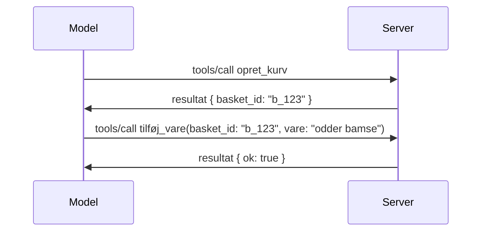

# Hvad ændrer sig i MCP: Release Candidate 2026-07-28

> **Status:** Release Candidate. `2026-07-28` specifikationen er ikke endelig på skrivende tidspunkt. Den blev annonceret 21. maj 2026 og er planlagt til at blive udgivet 28. juli 2026. Alt i denne lektion beskriver release candidate; tjek [udkast til specifikation](https://modelcontextprotocol.io/specification/draft) og dens [ændringslog](https://modelcontextprotocol.io/specification/draft/changelog) for den seneste status, inden du bygger mod den. Resten af dette kursus er skrevet mod den nuværende stabile udgivelse, **MCP Specification 2025-11-25**, og vil blive opdateret, når `2026-07-28` udgives.

## Oversigt

`2026-07-28` er den største revision af MCP siden lanceringen. Seks Specification Enhancement Proposals (SEP’er) fjerner protokollags sessioner og gør MCP statsløs på transportlaget, udvidelser bliver en første-klasses, versionsstyret mekanisme, og flere funktioner, du tidligere har lært i dette kursus (Roots, Sampling, Logging), markeres som forældede under en ny livscykluspolitik. Denne lektion opsummerer, hvad der ændrer sig, hvorfor det er vigtigt, og hvad det betyder for den kode, du allerede har skrevet mod `2025-11-25`.

Kilde: [The 2026-07-28 MCP Specification Release Candidate](https://blog.modelcontextprotocol.io/posts/2026-07-28-release-candidate/) (Model Context Protocol Blog, David Soria Parra og Den Delimarsky).

## Læringsmål

Ved slutningen af denne lektion vil du kunne:

- Forklare hvorfor MCP går over til en statsløs protokolkerne og hvilken problemstilling det løser for horisontalt skalerede installationer.
- Beskrive hvordan `initialize`/`initialized` håndtrykket og `Mcp-Session-Id` headeren erstattes.
- Identificere de nye `Mcp-Method` og `Mcp-Name` headers samt `ttlMs`/`cacheScope` caching metadata.
- Genkende Extensions-frameworket og de to udvidelser, der leveres med denne udgivelse: MCP Apps og Tasks.
- Opregne de seks autorisations SEP’er, som styrker OAuth 2.0 / OIDC tilpasningen.
- Identificere hvilke kernefunktioner (Roots, Sampling, Logging) der nu er forældede, og hvad det betyder i praksis.
- Forklare ændringen med Full JSON Schema 2020-12 for værktøjernes `inputSchema`/`outputSchema`.

## En statsløs protokol

Hovedændringen: MCP bliver statsløs på protokollaget.

### Før (2025-11-25): sessioner binder dig til én serverinstans

At kalde et værktøj over Streamable HTTP starter med et `initialize` håndtryk. Serveren svarer med en `Mcp-Session-Id` header, som alle efterfølgende anmodninger skal medbringe:

```http
POST /mcp HTTP/1.1
Mcp-Session-Id: 1868a90c-3a3f-4f5b
Content-Type: application/json

{"jsonrpc":"2.0","id":2,"method":"tools/call",
 "params":{"name":"search","arguments":{"q":"otters"}}}
```
  
Da sessionen er bundet til den serverinstans, der udstedte den, har horisontalt skalerede installationer brug for **sticky routing** ved loadbalanceren og et **delt sessionslager** på tværs af instanser.

### Efter (2026-07-28): hver anmodning er selvstændig

```http
POST /mcp HTTP/1.1
MCP-Protocol-Version: 2026-07-28
Mcp-Method: tools/call
Mcp-Name: search
Content-Type: application/json

{"jsonrpc":"2.0","id":1,"method":"tools/call",
 "params":{"name":"search","arguments":{"q":"otters"},
           "_meta":{"io.modelcontextprotocol/clientInfo":{"name":"my-app","version":"1.0"}}}}
```
  
Enhver serverinstans kan håndtere denne anmodning. Vigtige ændringer:

- **`initialize`/`initialized` håndtrykket fjernes** ([SEP-2575](https://github.com/modelcontextprotocol/modelcontextprotocol/pull/2575)). Protokolversion, klientinfo og klientkapabiliteter flyttes ind i `_meta` på hver anmodning. En ny `server/discover` metode giver klienten mulighed for at hente serverkapabiliteter på forhånd, når den har brug for dem.
- **`Mcp-Session-Id` header og protokollags session fjernes** ([SEP-2567](https://github.com/modelcontextprotocol/modelcontextprotocol/pull/2567)). Sticky routing og delte sessionslagre er ikke længere nødvendige på protokollaget.

### Statløst protokol, stateful applikationer

At fjerne sessionen på protokollaget betyder ikke, at din server ikke kan være stateful. Den anbefalede tilgang er den samme, som HTTP-API’er altid har brugt: opret et eksplicit håndtag (f.eks. `basket_id`, `browser_id`) i et værktøjskald, og lad modellen sende det håndtag tilbage som et almindeligt argument i senere kald.


  
Det gør staten synlig og rimelig for modellen i stedet for at skjule den i transportmetadata, og det tillader enhver serverinstans at håndtere ethvert kald.

### Server-til-klient anmodninger, omstruktureret

En statsløs protokol har stadig behov for en måde, hvorpå serveren kan bede klienten om noget midt i et kald (for eksempel en elicitation prompt):

- **Server-initierede anmodninger må kun udsendes, mens serveren aktivt behandler en klientanmodning** ([SEP-2260](https://github.com/modelcontextprotocol/modelcontextprotocol/pull/2260)) — før var det en anbefaling, nu et krav. En bruger bliver aldrig spurgt uden varsel.
- **Multi Round-Trip Requests** ([SEP-2322](https://github.com/modelcontextprotocol/modelcontextprotocol/pull/2322)) erstatter det at holde en SSE stream åben. I stedet returnerer serveren et `InputRequiredResult`:

  ```json
  {
    "resultType": "inputRequired",
    "inputRequests": {
      "confirm": {
        "type": "elicitation",
        "message": "Delete 3 files?",
        "schema": { "type": "boolean" }
      }
    },
    "requestState": "eyJzdGVwIjoxLCJmaWxlcyI6WyJhIiwiYiIsImMiXX0="
  }
  ```
  
  Klienten samler svarene og genudfører det oprindelige kald med `inputResponses` plus den gengivne `requestState`. Enhver serverinstans kan tage fat på retry, fordi alt nødvendigt er i payload’en.

### Routable, cachebar, tracebar

Tre mindre ændringer gør statsløs trafik lettere at drive:

- **`Mcp-Method` og `Mcp-Name` headers kræves på Streamable HTTP** ([SEP-2243](https://github.com/modelcontextprotocol/modelcontextprotocol/pull/2243)), så loadbalancere, gateways og rate limiters kan rute på operationen uden at tjekke JSON body’en. Servere afviser anmodninger, hvor headers og body ikke stemmer overens.
- **`tools/list` og resource read-resultater bærer `ttlMs` og `cacheScope`** ([SEP-2549](https://github.com/modelcontextprotocol/modelcontextprotocol/pull/2549)), modelleret efter HTTP `Cache-Control`. Klienter ved, hvor længe et liste-resultat er friskt, og om det er sikkert at dele på tværs af brugere uden at skulle holde en langvarig SSE stream åben for ændringer.
- **W3C Trace Context propagation i `_meta` er dokumenteret** ([SEP-414](https://github.com/modelcontextprotocol/modelcontextprotocol/pull/414)), hvilket fastlægger `traceparent`, `tracestate` og `baggage` nøglenavne, så en distribueret trace kan følge et kald gennem klient SDK, MCP server og downstream systemer i en [OpenTelemetry](https://opentelemetry.io/)-kompatibel backend.

## Udvidelser bliver første-klasse

Udvidelser eksisterede uformelt i `2025-11-25`. [SEP-2133](https://github.com/modelcontextprotocol/modelcontextprotocol/pull/2133) formaliserer dem:

- Udvidelser identificeres ved reverse-DNS IDs.
- De forhandles via et `extensions` kort på klient- og serverkapabiliteter.
- De lever i egne `ext-*` repositories med delegerede vedligeholdere og versionsstyres uafhængigt af kernespecifikationen.
- En ny Extensions Track i SEP-processen giver dem en vej fra eksperimentel til officiel.

Denne udgivelse indeholder to officielle udvidelser.

### MCP Apps: server-renderede brugergrænseflader

[MCP Apps](https://blog.modelcontextprotocol.io/posts/2026-01-26-mcp-apps/) ([SEP-1865](https://github.com/modelcontextprotocol/modelcontextprotocol/pull/1865)) giver servere mulighed for at sende interaktive HTML-grænseflader, som værter renderer i en sandboxed iframe. Værktøjer deklarerer deres UI-templates på forhånd, så værter kan prefetch, cache og gennemgå sikkerhed inden noget kører. Du har allerede dækket de grundlæggende elementer i [Lesson 15: MCP Apps](../03-GettingStarted/15-mcp-apps/README.md) — under Extensions frameworket er MCP Apps nu formelt en udvidelse frem for en eksperimentel kernefunktion.

### Tasks opgraderes til en udvidelse

Tasks blev leveret som en eksperimentel kernefunktion i `2025-11-25`. Produktionen viste nok redesign, så det rigtige hjem for det er en udvidelse: [Tasks udvidelsen](https://github.com/modelcontextprotocol/modelcontextprotocol/pull/2663) omformer livscyklussen omkring den statsløse model — en server kan svare på `tools/call` med et task-håndtag, og klienten driver det fremad med `tasks/get`, `tasks/update` og `tasks/cancel`. Task-oprettelse er serverstyret: klienten annoncerer udvidelsen, og serveren afgør, hvornår et kald skal køre som en task. `tasks/list` fjernes helt, fordi den ikke kan scopes sikkert uden sessioner.

> **Migreringsnote:** hvis du implementerede den eksperimentelle `2025-11-25` Tasks API, skal du migrere til den nye udvidelseslivscyklus — den er ikke bagudkompatibel.

## Autorisationsforstærkning

Seks SEP’er styrker [autoriseringsspecifikationen](https://modelcontextprotocol.io/specification/draft/basic/authorization) for bedre at tilpasse sig virkelighedens OAuth 2.0 / OpenID Connect installationer:

| SEP | Ændring |
|---|---|
| [SEP-2468](https://github.com/modelcontextprotocol/modelcontextprotocol/pull/2468) | Klienter skal validere `iss` parameteren på autorisationssvar i henhold til [RFC 9207](https://www.rfc-editor.org/rfc/rfc9207), hvilket mindsker mix-up angreb, der er almindelige i MCP’s single-client, many-server mønster. En fremtidig version vil kræve afvisning af svar uden `iss`. |
| [SEP-837](https://github.com/modelcontextprotocol/modelcontextprotocol/pull/837) | Klienter deklarerer deres OpenID Connect `application_type` under Dynamic Client Registration, for at undgå at autorisationsservere fejlagtigt kategoriserer desktop/CLI-klienter som `"web"` og afviser deres localhost redirect URI. |
| [SEP-2352](https://github.com/modelcontextprotocol/modelcontextprotocol/pull/2352) | Klienter binder registrerede legitimationsoplysninger til den issuing autorisationsservers `issuer` og genregistrerer, når en ressource migrerer mellem autorisationsservere. |
| [SEP-2207](https://github.com/modelcontextprotocol/modelcontextprotocol/pull/2207) | Dokumenterer hvordan man anmoder om refresh tokens fra OpenID Connect-stil autorisationsservere. |
| [SEP-2350](https://github.com/modelcontextprotocol/modelcontextprotocol/pull/2350) | Afklarer scope-akkumulering under step-up autorisation. |
| [SEP-2351](https://github.com/modelcontextprotocol/modelcontextprotocol/pull/2351) | Afklarer `.well-known` opdagelses-suffiks. |

Hvis du laver en autorisationsserver til MCP i dag, så begynd at levere `iss` på autorisationssvar nu — se [02-Security](../02-Security/README.md) for den aktuelle autorisationsvejledning, som dette bygger videre på.

## Roots, Sampling og Logging er forældet

Under den nye [feature lifecycle policy](https://github.com/modelcontextprotocol/modelcontextprotocol/pull/2577) ([SEP-2577](https://github.com/modelcontextprotocol/modelcontextprotocol/pull/2577)) flyttes tre kerneklient-primitive, du lærte om i [Core Concepts](./README.md#roots), til **Deprecated** status:

| Funktion | Anbefalet erstatning |
|---|---|
| Roots | Værktøjsparametre, resource URIs eller serverkonfiguration |
| Sampling | Direkte integration med LLM udbyder-API’er |
| Logging | `stderr` for stdio-transporter; OpenTelemetry for struktureret observabilitet |

Disse er **annotations-only forældelser**: metoder, typer og kapabilitetsflag fortsætter med at fungere i denne udgivelse og i alle specifikationsversioner udgivet inden for et år efter den. Fjernelse af nogen af dem kræver en separat SEP under livscykluspolitikken — så intet bryder i dine eksisterende [Sampling](../03-GettingStarted/14-sampling/README.md) eksempler i dag, men nye servere bør foretrække de ovenfor nævnte erstatningsmønstre.

## Fuld JSON Schema 2020-12 for værktøjer

Værktøjers `inputSchema` og `outputSchema` er opgraderet til fuld [JSON Schema 2020-12](https://json-schema.org/draft/2020-12) ([SEP-2106](https://github.com/modelcontextprotocol/modelcontextprotocol/pull/2106)):

- Input schemas beholder `type: "object"` rodbegrænsningen, men tillader nu komposition (`oneOf`, `anyOf`, `allOf`), betingelser og referencer (`$ref`, `$defs`).
- Output schemas er ubegrænsede, og `structuredContent` kan nu være enhver JSON-værdi frem for kun et objekt.
- Implementeringer må ikke autode-reference eksterne `$ref` URI’er og bør begrænse schemas dybde og valideringstid (en denial-of-service overvejelse, hvis du validerer schemas server-side).

Derudover ændres fejl-koden for en manglende ressource fra den MCP-specifikke `-32002` til JSON-RPC-standarden `-32602` (Invalid Params) ([SEP-2164](https://github.com/modelcontextprotocol/modelcontextprotocol/pull/2164)). Hvis din klient matcher på den bogstavelige `-32002` værdi, skal du opdatere den.

## Hvordan protokollen udvikler sig herfra

Denne udgivelse indeholder breaking changes, hvilket MCP maintainerne ikke har til hensigt skal blive normen fremover. Tre styrings-SEP’er sigter mod at forhindre gentagelser:

- Den **feature lifecycle policy** giver hver funktion en Active → Deprecated → Removed vej med mindst tolv måneder mellem forældelse og tidligste mulige fjernelse.
- **Extensions framework** lader nye kapabiliteter blive leveret som opt-in udvidelser og stabilisere der, før de (måske) flyttes ind i kerne-specifikationen.
- En Standards Track SEP kan ikke længere opnå Final status, før et matchende scenarie lander i [conformance suite](https://github.com/modelcontextprotocol/conformance) ([SEP-2484](https://github.com/modelcontextprotocol/modelcontextprotocol/pull/2484)) — samme suite som [SDK tier system](https://github.com/modelcontextprotocol/modelcontextprotocol/pull/1777) vurderer officielle SDK'er imod.

## Udgivelsestidslinje og validering

- Release candidate blev låst 21. maj 2026.
- Den endelige specifikation er planlagt til 28. juli 2026.
- Det ti-ugers vindue mellem de to giver SDK-vedligeholdere og klientimplementeringer mulighed for at validere ændringerne mod reelle arbejdsbelastninger; Tier 1 SDK'er forventes at levere support inden for dette vindue under [SDK tier system](https://modelcontextprotocol.io/docs/sdk).
- Følg det fulde sæt af ændringer i [udkast til specifikation](https://modelcontextprotocol.io/specification/draft) og dens [ændringslog](https://modelcontextprotocol.io/specification/draft/changelog).

## Hvad dette betyder for dette kursusforløb

Alt, hvad du har lært indtil nu i dette kursus, er målrettet **2025-11-25**, som fortsat er den aktuelle stabile specifikation indtil `2026-07-28` udkommer. Konkrete punkter:

- **Sessions og `initialize` håndtrykket** (dækket i [Core Concepts](./README.md) og [Lesson 6: HTTP Streaming](../03-GettingStarted/06-http-streaming/README.md)) fungerer stadig som dokumenteret i dag, men forvent at de bliver erstattet af den stateless anmodningsmodel ovenfor, når du opgraderer til `2026-07-28`-kompatible SDK'er.
- **Sampling og Roots** (også dækket i [Core Concepts](./README.md)) forbliver fuldt funktionelle, men er forældede — nye designs bør foretrække de erstatningsmønstre, der er nævnt ovenfor.
- **Den eksperimentelle Tasks-funktion**, hvis du har brugt den, skal migreres til Tasks-udvidelsens nye livscyklus.
- **MCP Apps** ([Lesson 15](../03-GettingStarted/15-mcp-apps/README.md)) påvirkes ikke i praksis; de flyttes blot under den formelle Extensions-ramme.

## Yderligere ressourcer

- [2026-07-28 MCP Specification Release Candidate (blogindlæg)](https://blog.modelcontextprotocol.io/posts/2026-07-28-release-candidate/)
- [Fremtiden for MCP Transports](https://blog.modelcontextprotocol.io/posts/2025-12-19-mcp-transport-future/)
- [MCP Draft Specification](https://modelcontextprotocol.io/specification/draft)
- [MCP Draft Changelog](https://modelcontextprotocol.io/specification/draft/changelog)
- [SEP Guidelines](https://modelcontextprotocol.io/community/sep-guidelines)
- [MCP SDK Tier System](https://modelcontextprotocol.io/docs/sdk)

## Næste skridt

Gå tilbage til [Core Concepts](./README.md) eller fortsæt til [Security](../02-Security/README.md) for at se, hvordan dagens `2025-11-25` vejledning tilsvarer det, der kommer.

---

<!-- CO-OP TRANSLATOR DISCLAIMER START -->
**Ansvarsfraskrivelse**:
Dette dokument er blevet oversat ved hjælp af AI-oversættelsestjenesten [Co-op Translator](https://github.com/Azure/co-op-translator). Selvom vi bestræber os på nøjagtighed, skal du være opmærksom på, at automatiserede oversættelser kan indeholde fejl eller unøjagtigheder. Det originale dokument på dets oprindelige sprog bør betragtes som den autoritative kilde. For kritisk information anbefales professionel menneskelig oversættelse. Vi påtager os intet ansvar for misforståelser eller fejltolkninger, der opstår som følge af brugen af denne oversættelse.
<!-- CO-OP TRANSLATOR DISCLAIMER END -->