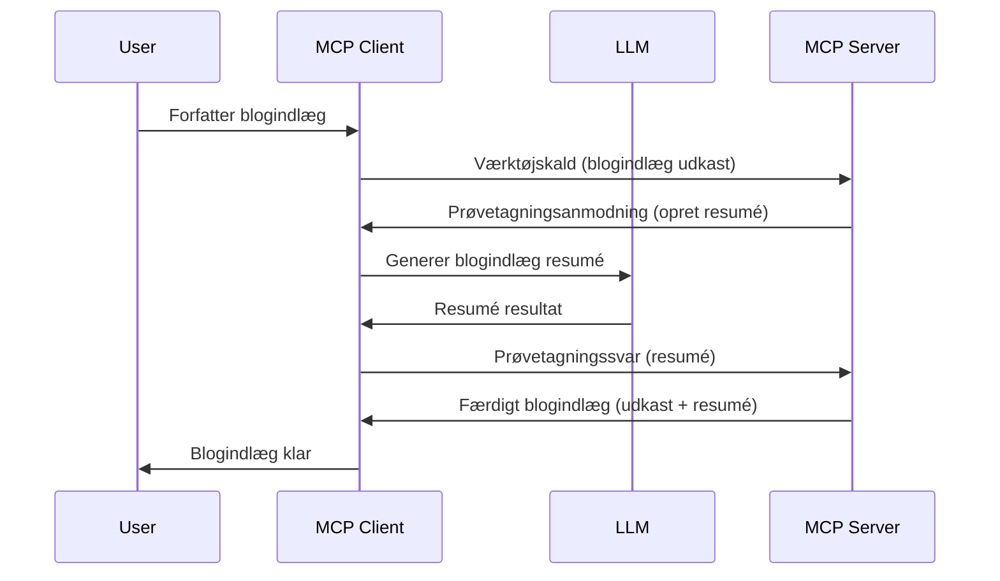

# Sampling - uddelegér funktioner til klienten

> **Forældelsesmeddelelse:** MCP-specifikationskandidatudgivelsen `2026-07-28` markerer Sampling som forældet til fordel for direkte integration med LLM-udbyder-API'er. Sampling fortsætter med at fungere i `2025-11-25` og i mindst et år efter formel forældelse, så alt i denne lektion forbliver gyldigt — men nye serverdesign bør evaluere erstatningsmønstret. Se [Hvad ændres i MCP: Udgivelseskandidat 2026-07-28](../../01-CoreConcepts/mcp-2026-07-28-release-candidate.md).

Nogle gange skal MCP-klienten og MCP-serveren samarbejde for at opnå et fælles mål. Du kan have en situation, hvor serveren har brug for hjælp fra en LLM, som kører på klienten. Til dette formål er sampling det, du skal bruge.

Lad os udforske nogle brugssituationer og hvordan man bygger en løsning med sampling.

## Oversigt

I denne lektion fokuserer vi på at forklare, hvornår og hvor man skal bruge Sampling, og hvordan man konfigurerer det.

## Læringsmål

I dette kapitel vil vi:

- Forklare hvad Sampling er, og hvornår det anvendes.
- Vise, hvordan man konfigurerer Sampling i MCP.
- Give eksempler på Sampling i praksis.

## Hvad er Sampling og hvorfor bruge det?

Sampling er en avanceret funktion, der fungerer på følgende måde:



### Sampling-forespørgsel

Ok, nu har vi et overblik over et troværdigt scenarie, lad os tale om sampling-forespørgslen, som serveren sender tilbage til klienten. Sådan kan en sådan forespørgsel se ud i JSON-RPC-format:

```json
{
  "jsonrpc": "2.0",
  "id": 1,
  "method": "sampling/createMessage",
  "params": {
    "messages": [
      {
        "role": "user",
        "content": {
          "type": "text",
          "text": "Create a blog post summary of the following blog post: <BLOG POST>"
        }
      }
    ],
    "modelPreferences": {
      "hints": [
        {
          "name": "claude-3-sonnet"
        }
      ],
      "intelligencePriority": 0.8,
      "speedPriority": 0.5
    },
    "systemPrompt": "You are a helpful assistant.",
    "maxTokens": 100
  }
}
```

Der er et par ting her, der er værd at fremhæve:

- Prompt, under content -> text, er vores prompt, som er en instruktion til LLM om at opsummere blogindhold.

- **modelPreferences**. Denne sektion er netop det, en præference, en anbefaling af, hvilken konfiguration der skal bruges med LLM'en. Brugeren kan vælge, om de vil følge disse anbefalinger eller ændre dem. I dette tilfælde er der anbefalinger om modelvalg samt hastighed og prioritering af intelligens.
- **systemPrompt**, dette er din normale system-prompt, som giver din LLM en personlighed og indeholder vejledende instruktioner.
- **maxTokens**, dette er en anden egenskab, der angiver, hvor mange tokens der anbefales at bruge til denne opgave.

### Sampling-svar

Dette svar er det, MCP-klienten ender med at sende tilbage til MCP-serveren og er resultatet af, at klienten kalder LLM'en, venter på svaret og så konstruerer denne besked. Sådan kan det se ud i JSON-RPC:

```json
{
  "jsonrpc": "2.0",
  "id": 1,
  "result": {
    "role": "assistant",
    "content": {
      "type": "text",
      "text": "Here's your abstract <ABSTRACT>"
    },
    "model": "gpt-5",
    "stopReason": "endTurn"
  }
}
```

Bemærk hvordan svaret er en abstract af blogindlægget, lige som vi bad om. Bemærk også, at den brugte `model` ikke er det, vi bad om, men "gpt-5" frem for "claude-3-sonnet". Dette illustrerer, at brugeren kan ændre mening om, hvad der skal bruges, og at din sampling-forespørgsel er en anbefaling.

Ok, nu hvor vi forstår hovedflowet, og en nyttig opgave at bruge det til "oprettelse af blogindlæg + abstract", lad os se, hvad vi skal gøre for at få det til at fungere.

### Beskedtyper

Sampling-beskeder er ikke begrænset til kun tekst, men du kan også sende billeder og lyd. Sådan ser JSON-RPC ud forskelligt ud:

**Tekst**

```json
{
  "type": "text",
  "text": "The message content"
}
```

**Billedindhold**

```json
{
  "type": "image",
  "data": "base64-encoded-image-data",
  "mimeType": "image/jpeg"
}
```

**Lydindhold**

```json
{
  "type": "audio",
  "data": "base64-encoded-audio-data",
  "mimeType": "audio/wav"
}
```

> NOTE: for mere detaljerede oplysninger om Sampling, se [officielle dokumentation](https://modelcontextprotocol.io/specification/2025-11-25/client/sampling)

## Sådan konfigureres Sampling i klienten

> Bemærk: hvis du kun bygger en server, behøver du ikke gøre meget her.

I en klient skal du angive følgende funktion sådan her:

```json
{
  "capabilities": {
    "sampling": {}
  }
}
```

Dette bliver så opfanget, når din valgte klient initialiseres med serveren.

## Eksempel på Sampling i praksis - Opret et blogindlæg

Lad os kode en sampling-server sammen, vi skal gøre følgende:

1. Opret et værktøj på serveren.
1. Det nævnte værktøj skal oprette en sampling-forespørgsel.
1. Værktøjet skal vente på klientens sampling-forespørgsel besvares.
1. Derefter skal værktøjets resultat produceres.

Lad os se koden trin for trin:

### -1- Opret værktøjet

**python**

```python
@mcp.tool()
async def create_blog(title: str, content: str, ctx: Context[ServerSession, None]) -> str:
    """Create a blog post and generate a summary"""

```

### -2- Opret en sampling-forespørgsel

Udvid dit værktøj med følgende kode:

**python**

```python
post = BlogPost(
        id=len(posts) + 1,
        title=title,
        content=content,
        abstract=""
    )

prompt = f"Create an abstract of the following blog post: title: {title} and draft: {content} "

result = await ctx.session.create_message(
        messages=[
            SamplingMessage(
                role="user",
                content=TextContent(type="text", text=prompt),
            )
        ],
        max_tokens=100,
)

```

### -3- Vent på svar og returner svar

**python**

```python
post.abstract = result.content.text

posts.append(post)

# returner det komplette produkt
return json.dumps({
    "id": post.title,
    "abstract": post.abstract
})
```

### -4- Fuld kode

**python**

```python
from starlette.applications import Starlette
from starlette.routing import Mount, Host

from mcp.server.fastmcp import Context, FastMCP

from mcp.server.session import ServerSession
from mcp.types import SamplingMessage, TextContent

import json


from uuid import uuid4
from typing import List
from pydantic import BaseModel


mcp = FastMCP("Blog post generator")

# app = FastAPI()

posts = []

class BlogPost(BaseModel):
    id: int
    title: str
    content: str
    abstract: str

posts: List[BlogPost] = []

@mcp.tool()
async def create_blog(title: str, content: str, ctx: Context[ServerSession, None]) -> str:
    """Create a blog post and generate a summary"""

    post = BlogPost(
        id=len(posts) + 1,
        title=title,
        content=content,
        abstract=""
    )

    prompt = f"Create an abstract of the following blog post: title: {title} and draft: {content} "

    result = await ctx.session.create_message(
        messages=[
            SamplingMessage(
                role="user",
                content=TextContent(type="text", text=prompt),
            )
        ],
        max_tokens=100,
    )

    post.abstract = result.content.text

    posts.append(post)

    # returnér hele blogindlægget
    return json.dumps({
        "id": post.title,
        "abstract": post.abstract
    })

if __name__ == "__main__":
    print("Starting server...")
    # mcp.run()
    mcp.run(transport="streamable-http")

# kør app med: python server.py
```

### -5- Test det i Visual Studio Code

For at teste dette i Visual Studio Code, gør følgende:

1. Start server i terminal
1. Tilføj det til *mcp.json* (og sørg for, at det er startet), f.eks. sådan:

   ```json
   "servers": {
      "blog-server": {
        "type": "http",
        "url": "http://localhost:8000/mcp"
      }
   }
   ```

1. Skriv en prompt:

   ```text
   create a blog post named "Where Python comes from", the content is "Python is actually named after Monty Python Flying Circus"
   ```

1. Tillad sampling at foregå. Første gang du tester dette, vil du blive præsenteret for en ekstra dialog, som du skal acceptere, derefter vil du se den normale dialog, der spørger om at køre et værktøj.

1. Undersøg resultater. Du vil se resultaterne både flot renderet i GitHub Copilot Chat, men du kan også inspicere det rå JSON-svar.

**Bonus**. Visual Studio Code-værktøjerne har fremragende understøttelse af sampling. Du kan konfigurere Sampling-adgang på din installerede server ved at navigere sådan:

1. Gå til udvidelsesafsnittet.
1. Vælg tandhjulsikonet for din installerede server under sektionen "MCP SERVERS - INSTALLED".
1. Vælg "Configure Model Access", her kan du vælge hvilke modeller GitHub Copilot må bruge ved sampling. Du kan også se alle sampling-forespørgsler, der for nylig er forekommet, ved at vælge "Show Sampling requests".

## Opgave

I denne opgave skal du bygge en lidt anden Sampling, nemlig en sampling-integration, der understøtter generering af en produktbeskrivelse. Her er din situation:

**Scenario**: Backoffice-medarbejderen i en e-handel har brug for hjælp, det tager alt for lang tid at generere produktbeskrivelser. Derfor skal du bygge en løsning, hvor du kan kalde et værktøj "create_product" med "title" og "keywords" som argumenter, og det skal producere et komplet produkt inklusive et "description"-felt, som skal udfyldes af en klients LLM.

TIP: brug det, du lærte tidligere, til at konstruere denne server og dens værktøj ved hjælp af en sampling-forespørgsel.

## Løsning

[Løsning](./solution/README.md)

## Vigtigste pointer

Sampling er en kraftfuld funktion, der giver serveren mulighed for at uddelegere opgaver til klienten, når den har brug for hjælp fra en LLM.

## Hvad er næste skridt

- [Kapitel 4 - Praktisk implementering](../../04-PracticalImplementation/README.md)

---

<!-- CO-OP TRANSLATOR DISCLAIMER START -->
**Ansvarsfraskrivelse**:
Dette dokument er blevet oversat ved hjælp af AI-oversættelsestjenesten [Co-op Translator](https://github.com/Azure/co-op-translator). Selvom vi bestræber os på nøjagtighed, skal du være opmærksom på, at automatiserede oversættelser kan indeholde fejl eller unøjagtigheder. Det originale dokument på dets oprindelige sprog bør betragtes som den autoritative kilde. For kritisk information anbefales professionel menneskelig oversættelse. Vi påtager os intet ansvar for misforståelser eller fejltolkninger, der opstår som følge af brugen af denne oversættelse.
<!-- CO-OP TRANSLATOR DISCLAIMER END -->