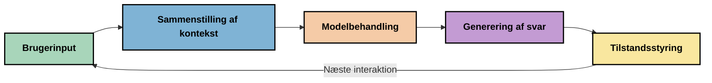
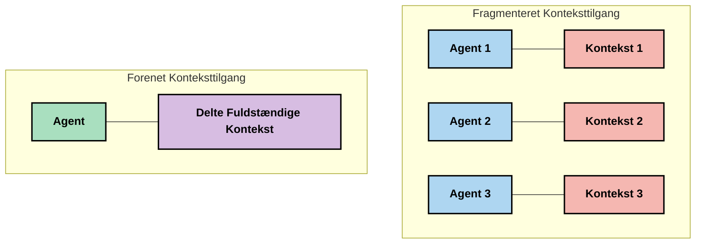
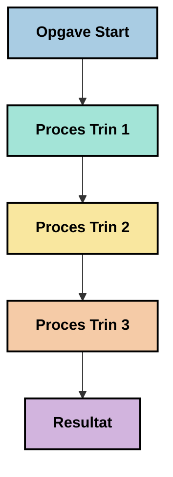
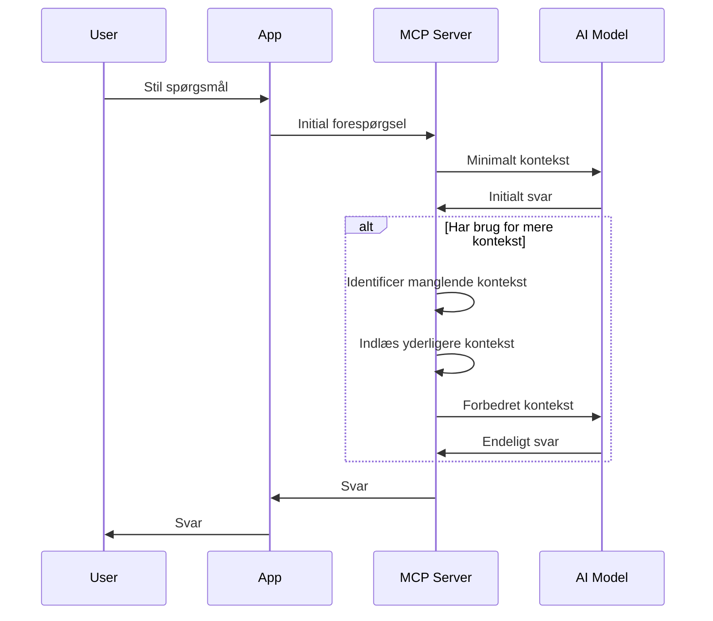
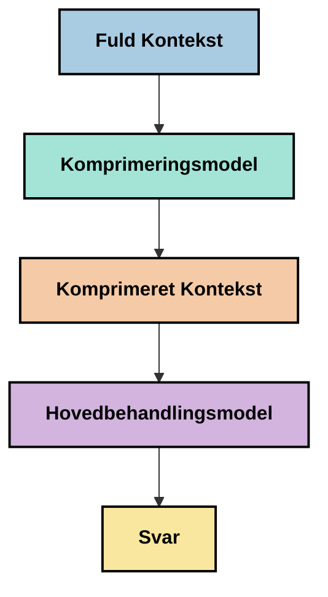
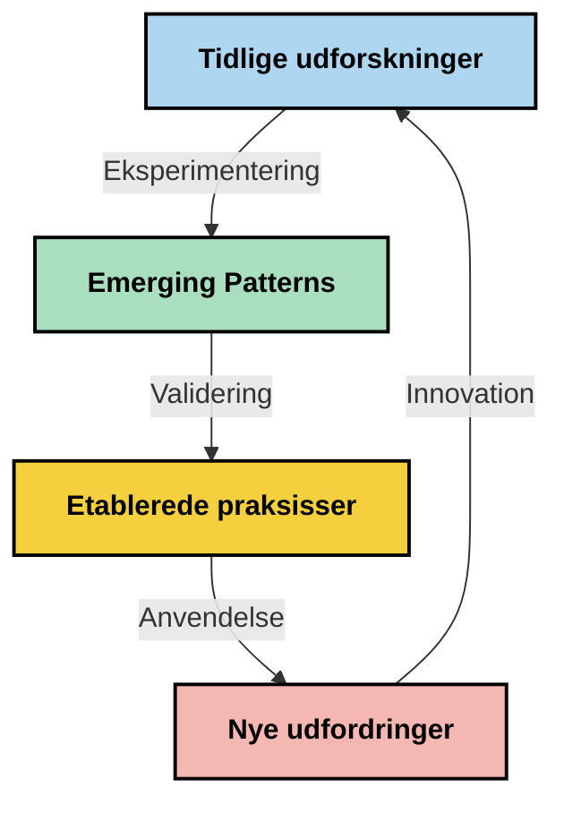

# Context Engineering: Et Fremvoksende Koncept i MCP-Økosystemet

## Oversigt

Context engineering er et fremvoksende koncept inden for AI-området, der undersøger, hvordan information struktureres, leveres og vedligeholdes gennem interaktioner mellem klienter og AI-tjenester. Efterhånden som Model Context Protocol (MCP)-økosystemet udvikler sig, bliver forståelsen af, hvordan man effektivt håndterer kontekst, stadig vigtigere. Denne modul introducerer konceptet context engineering og udforsker dets potentielle anvendelser i MCP-implementeringer.

## Læringsmål

Når du har gennemført denne modul, vil du kunne:

- Forstå det fremvoksende koncept context engineering og dets potentielle rolle i MCP-applikationer
- Identificere nøgleudfordringer i kontekststyring, som MCP-protokolens design adresserer
- Udforske teknikker til forbedring af modelpræstation gennem bedre kontekstbehandling
- Overveje tilgange til at måle og evaluere kontekstens effektivitet
- Anvende disse fremvoksende koncepter til at forbedre AI-oplevelser gennem MCP-rammen

## Introduktion til Context Engineering

Context engineering er et fremvoksende koncept, der fokuserer på den bevidste udformning og styring af informationsflowet mellem brugere, applikationer og AI-modeller. I modsætning til etablerede områder såsom prompt engineering defineres context engineering stadig af praktikere, efterhånden som de arbejder på at løse de unikke udfordringer ved at give AI-modeller den rette information på det rette tidspunkt.

Efterhånden som store sprogmodeller (LLMs) har udviklet sig, er vigtigheden af kontekst blevet stadig mere tydelig. Kvaliteten, relevansen og strukturen af den kontekst, vi leverer, påvirker direkte modellens output. Context engineering udforsker dette forhold og søger at udvikle principper for effektiv kontekststyring.

> "I 2025 er modellerne derude yderst intelligente. Men selv det klogeste menneske vil ikke kunne udføre deres arbejde effektivt uden konteksten af, hvad de bliver bedt om at gøre... 'Context engineering' er næste niveau af prompt engineering. Det handler om at gøre dette automatisk i et dynamisk system." — Walden Yan, Cognition AI

Context engineering kan omfatte:

1. **Context Selection**: Bestemme hvilken information der er relevant for en given opgave
2. **Context Structuring**: Organisere information for at maksimere modelforståelsen
3. **Context Delivery**: Optimere hvordan og hvornår information sendes til modeller
4. **Context Maintenance**: Styre tilstand og udvikling af kontekst over tid
5. **Context Evaluation**: Måle og forbedre kontekstens effektivitet

Disse fokusområder er særligt relevante for MCP-økosystemet, som tilbyder en standardiseret måde for applikationer at levere kontekst til LLM'er.

## Perspektivet: Kontekstens Rejse

En måde at visualisere context engineering på er at spore den rejse, information tager gennem et MCP-system:



### Nøglefaser i Kontekst-rejsen:

1. **Brugerinput**: Rå information fra brugeren (tekst, billeder, dokumenter)
2. **Kontekstsammensætning**: Kombination af brugerinput med systemkontekst, samtalehistorik og anden hentet information
3. **Modelbehandling**: AI-modellen behandler den sammensatte kontekst
4. **Svar-generering**: Modellen producerer output baseret på den leverede kontekst
5. **Tilstandsstyring**: Systemet opdaterer sin interne tilstand baseret på interaktionen

Dette perspektiv fremhæver den dynamiske karakter af kontekst i AI-systemer og rejser vigtige spørgsmål om, hvordan man bedst håndterer information på hvert trin.

## Fremvoksende Principper i Context Engineering

Efterhånden som området context engineering tager form, begynder nogle tidlige principper at dukke op fra praktikere. Disse principper kan hjælpe med at informere MCP-implementeringsvalg:

### Princip 1: Del Kontekst Komplet

Kontekst bør deles fuldstændigt mellem alle systemkomponenter frem for at være fragmenteret på tværs af flere agenter eller processer. Når kontekst distribueres, kan beslutninger foretaget i ét del af systemet konflikte med beslutninger i andre dele.



I MCP-applikationer antyder dette, at man designer systemer, hvor kontekst flyder sømløst gennem hele pipeline i stedet for at blive opdelt i separate dele.

### Princip 2: Anerkend, At Handlinger Bærer Implicitte Beslutninger

Hver handling, en model udfører, indeholder implicitte beslutninger om, hvordan konteksten skal fortolkes. Når flere komponenter handler på forskellige kontekster, kan disse implicitte beslutninger konflikte og føre til inkonsistente resultater.

Dette princip har vigtige implikationer for MCP-applikationer:
- Foretræk lineær behandling af komplekse opgaver frem for parallel udførelse med fragmenteret kontekst
- Sørg for, at alle beslutningspunkter har adgang til den samme kontekstuelle information
- Design systemer, hvor senere trin kan se den fulde kontekst af tidligere beslutninger

### Princip 3: Balancér Kontekstdybde med Vinduesbegrænsninger

Efterhånden som samtaler og processer bliver længere, flyder kontekst-vinduer over. Effektiv context engineering undersøger tilgange til at håndtere spændingen mellem omfattende kontekst og tekniske begrænsninger.

Potentielle tilgange, der undersøges, inkluderer:
- Kontekstkomprimering, der bevarer væsentlig information, mens tokenforbruget reduceres
- Progressiv indlæsning af kontekst baseret på relevans for aktuelle behov
- Opsummering af tidligere interaktioner samtidig med at nøglebeslutninger og fakta bevares

## Kontekstudfordringer og MCP Protokoldesign

Model Context Protocol (MCP) blev designet med en forståelse af de unikke udfordringer i kontekststyring. Forståelse af disse udfordringer hjælper med at forklare nøgleaspekter i MCP-protokolens design:


### Udfordring 1: Begrænsninger i Kontekst-vindue

De fleste AI-modeller har faste størrelser for kontekst-vinduer, hvilket begrænser, hvor meget information de kan behandle ad gangen.

**MCP-designsvar:** 
- Protokollen understøtter struktureret, ressourcebaseret kontekst, som kan refereres effektivt
- Ressourcer kan opdeles i sider og indlæses progressivt

### Udfordring 2: Bestemmelse af Relevans

At afgøre, hvilken information der er mest relevant at inkludere i kontekst, er vanskeligt.

**MCP-designsvar:**
- Fleksible værktøjer tillader dynamisk indhentning af information baseret på behov
- Strukturerede prompts muliggør konsekvent kontekstorganisation

### Udfordring 3: Kontekstpersistens

Styring af tilstand på tværs af interaktioner kræver omhyggelig sporing af kontekst.

**MCP-designsvar:**
- Standardiseret sessionstyring
- Klart definerede interaktionsmønstre for kontekstevolution

### Udfordring 4: Multimodal Kontekst

Forskellige typer data (tekst, billeder, strukturerede data) kræver forskellig håndtering.

**MCP-designsvar:**
- Protokoldesignet rummer forskellige indholdstyper
- Standardiseret repræsentation af multimodal information

### Udfordring 5: Sikkerhed og Privatliv

Kontekst indeholder ofte følsomme oplysninger, som skal beskyttes.

**MCP-designsvar:**
- Klare grænser mellem klient- og serveransvar
- Lokale behandlingsmuligheder for at minimere dataeksponering

Forståelse af disse udfordringer og hvordan MCP adresserer dem giver et fundament for at udforske mere avancerede context engineering-teknikker.

## Fremvoksende Tilgange til Context Engineering

Efterhånden som området context engineering udvikler sig, dukker flere lovende tilgange op. De repræsenterer aktuel tænkning snarere end etablerede bedste praksisser og vil sandsynligvis udvikle sig, efterhånden som vi får mere erfaring med MCP-implementeringer.

### 1. Enkel-Trådet Lineær Behandling

I modsætning til multi-agent arkitekturer, der distribuerer kontekst, finder nogle praktikere, at enkel-trådet lineær behandling giver mere konsistente resultater. Dette stemmer overens med princippet om at bevare en samlet kontekst.



Selvom denne tilgang kan synes mindre effektiv end parallel behandling, producerer den ofte mere sammenhængende og pålidelige resultater, fordi hvert trin bygger på en komplet forståelse af tidligere beslutninger.

### 2. Context Chunking og Prioritering

Opdeling af store kontekster i håndterbare stykker og prioritering af det vigtigste.

```python
# Konceptuelt eksempel: Kontekst-opdeling og prioritering
def process_with_chunked_context(documents, query):
    # 1. Del dokumenter i mindre bidder
    chunks = chunk_documents(documents)
    
    # 2. Beregn relevansscore for hver bid
    scored_chunks = [(chunk, calculate_relevance(chunk, query)) for chunk in chunks]
    
    # 3. Sorter bidder efter relevansscore
    sorted_chunks = sorted(scored_chunks, key=lambda x: x[1], reverse=True)
    
    # 4. Brug de mest relevante bidder som kontekst
    context = create_context_from_chunks([chunk for chunk, score in sorted_chunks[:5]])
    
    # 5. Bearbejd med den prioriterede kontekst
    return generate_response(context, query)
```

Konceptet ovenfor illustrerer, hvordan vi kan opdele store dokumenter i håndterbare dele og kun vælge de mest relevante dele til kontekst. Denne tilgang kan hjælpe med at arbejde inden for kontekst-vinduets begrænsninger, samtidig med at store vidensbaser udnyttes.

### 3. Progressiv Indlæsning af Kontekst

Indlæsning af kontekst progressivt efter behov snarere end alt på én gang.



Progressiv indlæsning starter med minimal kontekst og udvider kun, når det er nødvendigt. Dette kan betydeligt reducere tokenforbruget ved simple forespørgsler, samtidig med at evnen til at håndtere komplekse spørgsmål bevares.

### 4. Kontekstkomprimering og Opsummering

Reducere størrelsen af kontekst samtidig med at væsentlig information bevares.



Kontekstkomprimering fokuserer på:
- Fjernelse af redundant information
- Opsummering af langvarigt indhold
- Udtræk af nøglefakta og detaljer
- Bevarelse af kritiske kontekst-elementer
- Optimering for token-effektivitet

Denne tilgang kan være særlig værdifuld for at vedligeholde lange samtaler inden for kontekst-vinduer eller til effektiv behandling af store dokumenter. Nogle praktikere bruger specialiserede modeller specifikt til kontekstkomprimering og opsummering af samtalehistorik.

## Overvejende over Context Engineering

Når vi udforsker det fremvoksende felt context engineering, er der flere overvejelser, som det er værd at holde for øje, når man arbejder med MCP-implementeringer. Disse er ikke forskrifter for bedste praksis, men områder til udforskning, som måske kan give forbedringer i din specifikke anvendelse.

### Overvej Dine Kontekst-mål

Før du implementerer komplekse løsninger til kontekststyring, formuler klart, hvad du forsøger at opnå:
- Hvilken specifik information har modellen brug for for at lykkes?
- Hvilken information er væsentlig kontra supplerende?
- Hvad er dine ydelsesbegrænsninger (latens, token-grænser, omkostninger)?

### Udforsk Lagdelte Kontekst-tilgange

Nogle praktikere finder succes med kontekst organiseret i konceptuelle lag:
- **Kerne-laget**: Væsentlig information, som modellen altid behøver
- **Situations-laget**: Kontekst specifik for den aktuelle interaktion
- **Støtte-laget**: Yderligere information, der kan være nyttig
- **Fallback-laget**: Information, der kun tilgås ved behov

### Undersøg Strategier for Hentning

Kontekstens effektivitet afhænger ofte af, hvordan du henter information:
- Semantisk søgning og indlejringer for at finde konceptuelt relevant information
- Søgeordbaseret søgning efter specifikke faktuelle detaljer
- Hybridtilgange, der kombinerer flere hentningsmetoder
- Metadatafiltrering for at indsnævre omfang baseret på kategorier, datoer eller kilder

### Eksperimentér med Kontextkohærens

Strukturen og flowet af din kontekst kan påvirke modelens forståelse:
- Grupér relateret information sammen
- Brug konsekvent formatering og organisering
- Vedligehold logisk eller kronologisk rækkefølge, hvor relevant
- Undgå modstridende information

### Afvej Kompromiser ved Multi-Agent Arkitekturer

Selvom multi-agent arkitekturer er populære i mange AI-rammer, medfører de væsentlige udfordringer for kontekststyring:
- Kontekstfragmentering kan føre til inkonsistente beslutninger på tværs af agenter
- Parallel behandling kan introducere konflikter, der er svære at forene
- Kommunikationsomkostninger mellem agenter kan opveje ydelsesfordele
- Komplekst tilstandsstyring er nødvendigt for at bevare sammenhæng

I mange tilfælde kan en enkelt-agent tilgang med omfattende kontekststyring give mere pålidelige resultater end flere specialiserede agenter med fragmenteret kontekst.

### Udvikl Evalueringsmetoder

For at forbedre context engineering over tid, overvej hvordan du vil måle succes:
- A/B-test af forskellige kontekststrukturer
- Overvågning af tokenforbrug og svartider
- Registrering af brugertilfredshed og færdiggørelsesgrad af opgaver
- Analyse af, hvornår og hvorfor kontekststrategier fejler

Disse overvejelser repræsenterer aktive udforskningsområder i context engineering. Efterhånden som området modnes, vil mere definitive mønstre og praksisser sandsynligvis opstå.

## Måling af Kontekstens Effektivitet: En Udviklende Ramme

Som context engineering vokser frem som koncept, begynder praktikere at undersøge, hvordan vi kan måle dets effektivitet. Der findes endnu ingen etableret ramme, men forskellige målinger overvejes, som kan vejlede fremtidigt arbejde.

### Potentielle Målingsdimensioner


#### 1. Overvejelser omkring Indtastnings-effektivitet

- **Kontekst-til-Svar-forhold**: Hvor meget kontekst er nødvendigt i forhold til svarstørrelsen?
- **Tokenudnyttelse**: Hvilken procentdel af leverede konteksttokens ser ud til at påvirke svaret?
- **Kontekstreduktion**: Hvor effektivt kan vi komprimere rå information?

#### 2. Ydelsesovervejelser

- **Latency-påvirkning**: Hvordan påvirker kontekststyring svartiden?
- **Tokenøkonomi**: Optimerer vi tokenforbruget effektivt?
- **Hentningspræcision**: Hvor relevant er den hentede information?
- **Ressourceudnyttelse**: Hvilke beregningsressourcer kræves?

#### 3. Kvalitets-overvejelser

- **Svarrelevans**: Hvor godt adresserer svaret forespørgslen?
- **Faktuel Nøjagtighed**: Forbedrer kontekststyring faktuel korrekthed?
- **Konsistens**: Er svar konsistente på tværs af lignende forespørgsler?
- **Hallucinationsrate**: Reducerer bedre kontekst modelhallucinationer?

#### 4. Brugererfarings-overvejelser

- **Opfølgningsrate**: Hvor ofte behøver brugere afklaring?
- **Opgavefærdiggørelse**: Lykkes det brugere at opnå deres mål?
- **Tilfredshedindikatorer**: Hvordan vurderer brugerne deres oplevelse?

### Udforskende Tilgange til Måling

Når du eksperimenterer med context engineering i MCP-implementeringer, overvej disse eksperimentelle tilgange:

1. **Baseline-sammenligninger**: Etabler en baseline med simple konteksttilgange før du tester mere sofistikerede metoder

2. **Trinvise ændringer**: Ændr én aspekt af kontekststyringen ad gangen for at isolere effekterne

3. **Brugercentreret evaluering**: Kombiner kvantitative målinger med kvalitativ brugerfeedback

4. **Fejlanalyse**: Undersøg tilfælde, hvor kontekststrategier fejler, for at forstå mulige forbedringer

5. **Måling på flere dimensioner**: Overvej afvejninger mellem effektivitet, kvalitet og brugererfaring

Denne eksperimentelle, flerfacetterede tilgang til måling stemmer overens med context engineerings fremvoksende karakter.

## Afsluttende Tanker

Context engineering er et fremvoksende udforskningsområde, som kan vise sig centralt for effektive MCP-applikationer. Ved gennemgående at overveje, hvordan information flyder gennem dit system, kan du potentielt skabe AI-oplevelser, der er mere effektive, nøjagtige og værdifulde for brugerne.

De teknikker og tilgange, der er beskrevet i denne modul, repræsenterer tidlig tænkning inden for området, ikke etablerede praksisser. Context engineering kan udvikle sig til en mere defineret disciplin, efterhånden som AI-kapaciteter forbedres, og vores forståelse bliver dybere. For nu synes eksperimentering kombineret med grundig måling at være den mest produktive tilgang.

## Potentielle Fremtidige Retninger

Context engineering er stadig i sine tidlige stadier, men flere lovende retninger er ved at tage form:

- Principper for context engineering kan få stor betydning for modelpræstation, effektivitet, brugererfaring og pålidelighed
- Enkel-trådede tilgange med omfattende kontekststyring kan overgå multi-agent arkitekturer for mange anvendelsessituationer
- Specialiserede modeller til kontekstkomprimering kan blive standardkomponenter i AI-pipelines
- Spændingen mellem fuldstændig kontekst og token-begrænsninger vil sandsynligvis drive innovation i konstekststyring
- Efterhånden som modeller bliver mere kapable til effektiv menneskelignende kommunikation, kan ægte multi-agent samarbejde blive mere levedygtigt
- MCP-implementeringer kan udvikle sig til at standardisere mønstre for kontekststyring, der dukker op fra den aktuelle eksperimentering



## Ressourcer

### Officielle MCP-Ressourcer
- [Model Context Protocol Website](https://modelcontextprotocol.io/)
- [Model Context Protocol Specification](https://github.com/modelcontextprotocol/modelcontextprotocol)
- [MCP Dokumentation](https://modelcontextprotocol.io/docs)
- [MCP C# SDK](https://github.com/modelcontextprotocol/csharp-sdk)
- [MCP Python SDK](https://github.com/modelcontextprotocol/python-sdk)
- [MCP TypeScript SDK](https://github.com/modelcontextprotocol/typescript-sdk)
- [MCP Inspector](https://github.com/modelcontextprotocol/inspector) - Visuelt testværktøj til MCP-servere

### Artikler om kontekstteknik
- [Byg ikke multi-agenter: Principper for kontekstteknik](https://cognition.ai/blog/dont-build-multi-agents) - Walden Yans indsigt i principper for kontekstteknik
- [En praktisk guide til at bygge agenter](https://cdn.openai.com/business-guides-and-resources/a-practical-guide-to-building-agents.pdf) - OpenAI's guide til effektiv agentdesign
- [Bygning af effektive agenter](https://www.anthropic.com/engineering/building-effective-agents) - Anthropics tilgang til agentudvikling

### Relateret forskning
- [Dynamisk retrievel-forstærkning for store sprogmodeller](https://arxiv.org/abs/2310.01487) - Forskning i dynamiske retrievel-metoder
- [Fortabt i midten: Hvordan sprogemodeller bruger lange kontekster](https://arxiv.org/abs/2307.03172) - Vigtig forskning om mønstre i kontekstbehandling
- [Hierarkisk tekst-betinget billedgenerering med CLIP Latents](https://arxiv.org/abs/2204.06125) - DALL-E 2 artikel med indsigt i kontekststrukturering
- [Undersøgelse af kontekstens rolle i store sprogmodelarkitekturer](https://aclanthology.org/2023.findings-emnlp.124/) - Nyere forskning om håndtering af kontekst
- [Multi-agent samarbejde: En undersøgelse](https://arxiv.org/abs/2304.03442) - Forskning i multi-agent systemer og deres udfordringer

### Yderligere ressourcer
- [Optimeringsteknikker for kontekstvindue](https://learn.microsoft.com/en-us/azure/ai-services/openai/concepts/context-window)
- [Avancerede RAG-teknikker](https://www.microsoft.com/en-us/research/blog/retrieval-augmented-generation-rag-and-frontier-models/)
- [Semantic Kernel Dokumentation](https://github.com/microsoft/semantic-kernel)
- [AI-værktøjskasse til kontekststyring](https://github.com/microsoft/aitoolkit)

## Hvad er det næste

- [5.15 MCP Custom Transport](../mcp-transport/README.md)

---

<!-- CO-OP TRANSLATOR DISCLAIMER START -->
**Ansvarsfraskrivelse**:
Dette dokument er blevet oversat ved hjælp af AI-oversættelsestjenesten [Co-op Translator](https://github.com/Azure/co-op-translator). Selvom vi bestræber os på nøjagtighed, skal du være opmærksom på, at automatiserede oversættelser kan indeholde fejl eller unøjagtigheder. Det originale dokument på dets oprindelige sprog bør betragtes som den autoritative kilde. For kritisk information anbefales professionel menneskelig oversættelse. Vi påtager os intet ansvar for misforståelser eller fejltolkninger, der opstår som følge af brugen af denne oversættelse.
<!-- CO-OP TRANSLATOR DISCLAIMER END -->