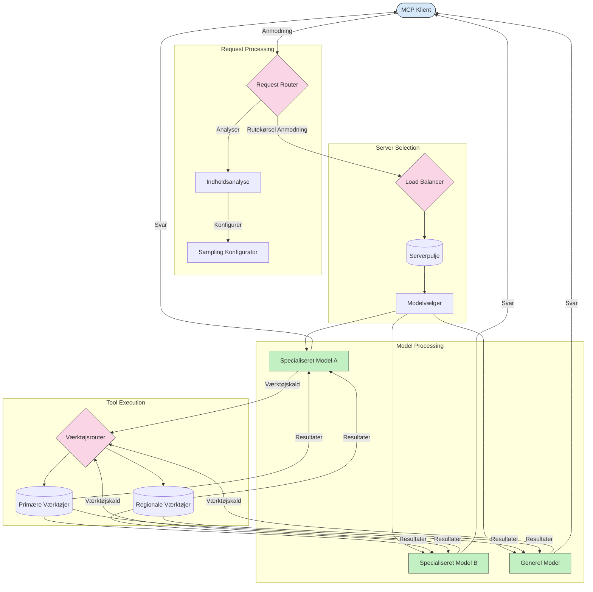

# Routing i Model Context Protocol

Routing er essentielt for at dirigere forespørgsler til de relevante modeller, værktøjer eller tjenester inden for et MCP-økosystem.

## Introduktion

Routing i Model Context Protocol (MCP) indebærer at dirigere forespørgsler til de mest egnede modeller eller tjenester baseret på forskellige kriterier såsom indholdstype, brugerens kontekst og systembelastning. Dette sikrer effektiv behandling og optimal ressourceudnyttelse.

## Læringsmål

Når du har gennemført denne lektion, vil du kunne:

- Forstå principperne for routing i MCP.
- Implementere indholdsbetinget routing for at dirigere forespørgsler til specialiserede tjenester.
- Anvende intelligente load balancing-strategier for at optimere ressourceudnyttelsen.
- Implementere dynamisk værktøjsrouting baseret på forespørgselskontekst.

## Indholdsbetinget Routing

Indholdsbetinget routing dirigerer forespørgsler til specialiserede tjenester baseret på indholdet af forespørgslen. For eksempel kan forespørgsler relateret til kodegenerering rutes til en specialiseret kodemodel, mens kreative skriveforespørgsler kan sendes til en kreativ skrivningsmodel.

Lad os se på et eksempel på implementering i forskellige programmeringssprog.

<details>
<summary>.NET</summary>

```csharp
// .NET Example: Content-based routing in MCP
public class ContentBasedRouter
{
    private readonly Dictionary<string, McpClient> _specializedClients;
    private readonly RoutingClassifier _classifier;
    
    public ContentBasedRouter()
    {
        // Initialize specialized clients for different domains
        _specializedClients = new Dictionary<string, McpClient>
        {
            ["code"] = new McpClient("https://code-specialized-mcp.com"),
            ["creative"] = new McpClient("https://creative-specialized-mcp.com"),
            ["scientific"] = new McpClient("https://scientific-specialized-mcp.com"),
            ["general"] = new McpClient("https://general-mcp.com")
        };
        
        // Initialize content classifier
        _classifier = new RoutingClassifier();
    }
    
    public async Task<McpResponse> RouteAndProcessAsync(string prompt, IDictionary<string, object> parameters = null)
    {
        // Classify the prompt to determine the best specialized service
        string category = await _classifier.ClassifyPromptAsync(prompt);
        
        // Get the appropriate client or fall back to general
        var client = _specializedClients.ContainsKey(category) 
            ? _specializedClients[category] 
            : _specializedClients["general"];
            
        Console.WriteLine($"Routing request to {category} specialized service");
        
        // Send request to the selected service
        return await client.SendPromptAsync(prompt, parameters);
    }
    
    // Simple classifier for routing decisions
    private class RoutingClassifier
    {
        public Task<string> ClassifyPromptAsync(string prompt)
        {
            prompt = prompt.ToLowerInvariant();
            
            if (prompt.Contains("code") || prompt.Contains("function") || 
                prompt.Contains("program") || prompt.Contains("algorithm"))
            {
                return Task.FromResult("code");
            }
            
            if (prompt.Contains("story") || prompt.Contains("creative") || 
                prompt.Contains("imagine") || prompt.Contains("design"))
            {
                return Task.FromResult("creative");
            }
            
            if (prompt.Contains("science") || prompt.Contains("research") || 
                prompt.Contains("analyze") || prompt.Contains("study"))
            {
                return Task.FromResult("scientific");
            }
            
            return Task.FromResult("general");
        }
    }
}
```

I den ovenstående kode har vi:

- Oprettet en `ContentBasedRouter`-klasse, der router forespørgsler baseret på indholdet af prompten.
- Initialiseret specialiserede klienter for forskellige domæner (kode, kreativ, videnskabelig, generel).
- Implementeret en simpel klassifikator, der bestemmer kategorien af prompten og router den til den relevante specialiserede tjeneste.
- Brug en fallback-mekanisme til at dirigere forespørgsler til en generel tjeneste, hvis ingen specialiseret tjeneste er tilgængelig.
- Implementeret asynkron behandling for at håndtere forespørgsler effektivt.
- Brug en ordbog til at kortlægge indholdskategorier til specialiserede MCP-klienter.
- Implementeret en simpel klassifikator, der analyserer prompten og returnerer den passende kategori.
- Brug den specialiserede klient til at sende forespørgslen og modtage et svar.
- Håndterede tilfælde, hvor prompten ikke matcher nogen specialiseret kategori ved at dirigere til en generel tjeneste.

</details>

## Intelligent Load Balancing

Load balancing optimerer ressourceudnyttelsen og sikrer høj tilgængelighed for MCP-tjenester. Der findes forskellige måder at implementere load balancing på, såsom round-robin, vægtet svartid eller indholdsbevidste strategier.

Lad os se på nedenstående eksempel på implementering, der anvender følgende strategier:

- **Round Robin**: Fordeler forespørgsler jævnt på tilgængelige servere.
- **Vægtet Svartid**: Router forespørgsler til servere baseret på deres gennemsnitlige svartid.
- **Indholdsbevidst**: Router forespørgsler til specialiserede servere baseret på forespørgselsindholdet.

<details>
<summary>Java</summary>

```java
// Java Eksempel: Intelligent load balancing for MCP-servere
public class McpLoadBalancer {
    private final List<McpServerNode> serverNodes;
    private final LoadBalancingStrategy strategy;
    
    public McpLoadBalancer(List<McpServerNode> nodes, LoadBalancingStrategy strategy) {
        this.serverNodes = new ArrayList<>(nodes);
        this.strategy = strategy;
    }
    
    public McpResponse processRequest(McpRequest request) {
        // Vælg den bedste server baseret på strategi
        McpServerNode selectedNode = strategy.selectNode(serverNodes, request);
        
        try {
            // Rute anmodningen til den valgte node
            return selectedNode.processRequest(request);
        } catch (Exception e) {
            // Håndter fejl - implementer genforsøg eller fallback-logik
            System.err.println("Error processing request on node " + selectedNode.getId() + ": " + e.getMessage());
            
            // Marker node som potentielt usund
            selectedNode.recordFailure();
            
            // Prøv næste bedste node som fallback
            List<McpServerNode> remainingNodes = new ArrayList<>(serverNodes);
            remainingNodes.remove(selectedNode);
            
            if (!remainingNodes.isEmpty()) {
                McpServerNode fallbackNode = strategy.selectNode(remainingNodes, request);
                return fallbackNode.processRequest(request);
            } else {
                throw new RuntimeException("All MCP server nodes failed to process the request");
            }
        }
    }
    
    // Node sundhedstjek opgave
    public void startHealthChecks(Duration interval) {
        ScheduledExecutorService scheduler = Executors.newScheduledThreadPool(1);
        scheduler.scheduleAtFixedRate(() -> {
            for (McpServerNode node : serverNodes) {
                try {
                    boolean isHealthy = node.checkHealth();
                    System.out.println("Node " + node.getId() + " health status: " + 
                                      (isHealthy ? "HEALTHY" : "UNHEALTHY"));
                } catch (Exception e) {
                    System.err.println("Health check failed for node " + node.getId());
                    node.setHealthy(false);
                }
            }
        }, 0, interval.toMillis(), TimeUnit.MILLISECONDS);
    }
    
    // Interface for load balancing strategier
    public interface LoadBalancingStrategy {
        McpServerNode selectNode(List<McpServerNode> nodes, McpRequest request);
    }
    
    // Round-robin strategi
    public static class RoundRobinStrategy implements LoadBalancingStrategy {
        private AtomicInteger counter = new AtomicInteger(0);
        
        @Override
        public McpServerNode selectNode(List<McpServerNode> nodes, McpRequest request) {
            List<McpServerNode> healthyNodes = nodes.stream()
                .filter(McpServerNode::isHealthy)
                .collect(Collectors.toList());
            
            if (healthyNodes.isEmpty()) {
                throw new RuntimeException("No healthy nodes available");
            }
            
            int index = counter.getAndIncrement() % healthyNodes.size();
            return healthyNodes.get(index);
        }
    }
    
    // Vægtet svartid strategi
    public static class ResponseTimeStrategy implements LoadBalancingStrategy {
        @Override
        public McpServerNode selectNode(List<McpServerNode> nodes, McpRequest request) {
            return nodes.stream()
                .filter(McpServerNode::isHealthy)
                .min(Comparator.comparing(McpServerNode::getAverageResponseTime))
                .orElseThrow(() -> new RuntimeException("No healthy nodes available"));
        }
    }
    
    // Indholdsbaseret strategi
    public static class ContentAwareStrategy implements LoadBalancingStrategy {
        @Override
        public McpServerNode selectNode(List<McpServerNode> nodes, McpRequest request) {
            // Bestem anmodningens karakteristika
            boolean isCodeRequest = request.getPrompt().contains("code") || 
                                   request.getAllowedTools().contains("codeInterpreter");
            
            boolean isCreativeRequest = request.getPrompt().contains("creative") || 
                                       request.getPrompt().contains("story");
            
            // Find specialiserede noder
            Optional<McpServerNode> specializedNode = nodes.stream()
                .filter(McpServerNode::isHealthy)
                .filter(node -> {
                    if (isCodeRequest && node.getSpecialization().equals("code")) {
                        return true;
                    }
                    if (isCreativeRequest && node.getSpecialization().equals("creative")) {
                        return true;
                    }
                    return false;
                })
                .findFirst();
            
            // Returner specialiseret node eller mindst belastede node
            return specializedNode.orElse(
                nodes.stream()
                    .filter(McpServerNode::isHealthy)
                    .min(Comparator.comparing(McpServerNode::getCurrentLoad))
                    .orElseThrow(() -> new RuntimeException("No healthy nodes available"))
            );
        }
    }
}
```

I den ovenstående kode har vi:

- Oprettet en `McpLoadBalancer`-klasse, der administrerer en liste over MCP-servernoder og router forespørgsler baseret på den valgte load balancing-strategi.
- Implementeret forskellige load balancing-strategier: `RoundRobinStrategy`, `ResponseTimeStrategy` og `ContentAwareStrategy`.
- Brug en `ScheduledExecutorService` til periodisk at kontrollere helbredstilstanden for servernoder.
- Implementeret en helbredstjek-mekanisme, der markerer noder som sunde eller usunde baseret på deres respons til helbredstjek.
- Håndteret forespørgselsbehandling med fejlhåndtering og fallback-logik for at sikre høj tilgængelighed.
- Brug en `McpServerNode`-klasse til at repræsentere individuelle MCP-servernoder, inklusive deres helbredstilstand, gennemsnitlige svartid og nuværende belastning.
- Implementeret en `McpRequest`-klasse til at indkapsle forespørgselsdetaljer såsom prompt og tilladte værktøjer.
- Brug Java Streams til at filtrere og vælge noder baseret på helbredstilstand og specialisering.

</details>

## Dynamisk Værktøjsrouting

Værktøjsrouting sikrer, at værktøjsopkald dirigeres til den mest passende tjeneste baseret på kontekst. For eksempel kan et vejrværktøjsopkald skulle routes til en regional endpoint baseret på brugerens placering, eller et beregningsværktøj kan have behov for at bruge en specifik version af API'en.

Lad os se på et eksempel på implementering, der demonstrerer dynamisk værktøjsrouting baseret på forespørgselsanalyse, regionale endpoints og versionsunderstøttelse.

<details>
<summary>Python</summary>

```python
# Python Eksempel: Dynamisk værktøjsrutning baseret på anmodningsanalyse
class McpToolRouter:
    def __init__(self):
        # Registrer tilgængelige værktøjsendepunkter
        self.tool_endpoints = {
            "weatherTool": "https://weather-service.example.com/api",
            "calculatorTool": "https://calculator-service.example.com/compute",
            "databaseTool": "https://database-service.example.com/query",
            "searchTool": "https://search-service.example.com/search"
        }
        
        # Regionale endepunkter til global distribution
        self.regional_endpoints = {
            "us": {
                "weatherTool": "https://us-west.weather-service.example.com/api",
                "searchTool": "https://us.search-service.example.com/search"
            },
            "europe": {
                "weatherTool": "https://eu.weather-service.example.com/api",
                "searchTool": "https://eu.search-service.example.com/search"
            },
            "asia": {
                "weatherTool": "https://asia.weather-service.example.com/api",
                "searchTool": "https://asia.search-service.example.com/search"
            }
        }
        
        # Support for værktøjsversionering
        self.tool_versions = {
            "weatherTool": {
                "default": "v2",
                "v1": "https://weather-service.example.com/api/v1",
                "v2": "https://weather-service.example.com/api/v2",
                "beta": "https://weather-service.example.com/api/beta"
            }
        }
    
    async def route_tool_request(self, tool_name, parameters, user_context=None):
        """Route a tool request to the appropriate endpoint based on context"""
        endpoint = self._select_endpoint(tool_name, parameters, user_context)
        
        if not endpoint:
            raise ValueError(f"No endpoint available for tool: {tool_name}")
        
        # Udfør den faktiske anmodning til det valgte endepunkt
        return await self._execute_tool_request(endpoint, tool_name, parameters)
    
    def _select_endpoint(self, tool_name, parameters, user_context=None):
        """Select the most appropriate endpoint based on context"""
        # Basisendepunkt fra registret
        if tool_name not in self.tool_endpoints:
            return None
            
        base_endpoint = self.tool_endpoints[tool_name]
        
        # Tjek om vi skal bruge en specifik værktøjsversion
        if tool_name in self.tool_versions:
            version_info = self.tool_versions[tool_name]
            
            # Brug angivet version eller standard
            requested_version = parameters.get("_version", version_info["default"])
            if requested_version in version_info:
                base_endpoint = version_info[requested_version]
        
        # Tjek for regional routing hvis brugerregion er kendt
        if user_context and "region" in user_context:
            user_region = user_context["region"]
            
            if user_region in self.regional_endpoints:
                regional_tools = self.regional_endpoints[user_region]
                
                if tool_name in regional_tools:
                    # Brug regionsspecifikt endepunkt
                    return regional_tools[tool_name]
        
        # Tjek for krav om datalokalitet
        if user_context and "data_residency" in user_context:
            # Dette ville implementere logik for at sikre, at data forbliver i den angivne jurisdiktion
            pass
        
        # Tjek for routing baseret på latenstid
        if user_context and "latency_sensitive" in user_context and user_context["latency_sensitive"]:
            # Dette ville implementere logik for at vælge endepunkt med lavest latenstid
            pass
            
        return base_endpoint
        
    async def _execute_tool_request(self, endpoint, tool_name, parameters):
        """Execute the actual tool request to the selected endpoint"""
        try:
            async with aiohttp.ClientSession() as session:
                async with session.post(
                    endpoint,
                    json={"toolName": tool_name, "parameters": parameters},
                    headers={"Content-Type": "application/json"}
                ) as response:
                    if response.status == 200:
                        result = await response.json()
                        return result
                    else:
                        error_text = await response.text()
                        raise Exception(f"Tool execution failed: {error_text}")
        except Exception as e:
            # Implementer forsøgsgentagelseslogik eller fallback-strategi
            print(f"Error executing tool {tool_name} at {endpoint}: {str(e)}")
            raise
```

I den ovenstående kode har vi:

- Oprettet en `McpToolRouter`-klasse, der styrer værktøjsrouting baseret på forespørgselsanalyse, regionale endpoints og versionsunderstøttelse.
- Registreret tilgængelige værktøjsendpoints og regionale endpoints for global distribution.
- Implementeret dynamisk routing-logik, der vælger det passende endpoint baseret på brugerkontekst, såsom region og krav til datalagring.
- Implementeret versionsunderstøttelse for værktøjer, så brugere kan angive, hvilken version af et værktøj de ønsker at bruge.
- Brug asynkrone HTTP-forespørgsler til at udføre værktøjsopkald og håndtere svar.

</details>

## Sampling og Routing Arkitektur i MCP

Sampling er en kritisk komponent i Model Context Protocol (MCP), der tillader effektiv forespørgselsbehandling og routing. Det indebærer at analysere indkommende forespørgsler for at bestemme den mest egnede model eller tjeneste til at håndtere dem, baseret på forskellige kriterier såsom indholdstype, brugerkontekst og systembelastning.

Sampling og routing kan kombineres til at skabe en robust arkitektur, der optimerer ressourceudnyttelsen og sikrer høj tilgængelighed. Samplingsprocessen kan bruges til at klassificere forespørgsler, mens routing dirigerer dem til de passende modeller eller tjenester.

Diagrammet nedenfor illustrerer, hvordan sampling og routing arbejder sammen i en omfattende MCP-arkitektur:



## Hvad er det næste

- [5.6 Sampling](../mcp-sampling/README.md)

---

<!-- CO-OP TRANSLATOR DISCLAIMER START -->
**Ansvarsfraskrivelse**:
Dette dokument er blevet oversat ved hjælp af AI-oversættelsestjenesten [Co-op Translator](https://github.com/Azure/co-op-translator). Selvom vi bestræber os på nøjagtighed, skal du være opmærksom på, at automatiserede oversættelser kan indeholde fejl eller unøjagtigheder. Det originale dokument på dets oprindelige sprog bør betragtes som den autoritative kilde. For kritisk information anbefales professionel menneskelig oversættelse. Vi påtager os intet ansvar for misforståelser eller fejltolkninger, der opstår som følge af brugen af denne oversættelse.
<!-- CO-OP TRANSLATOR DISCLAIMER END -->