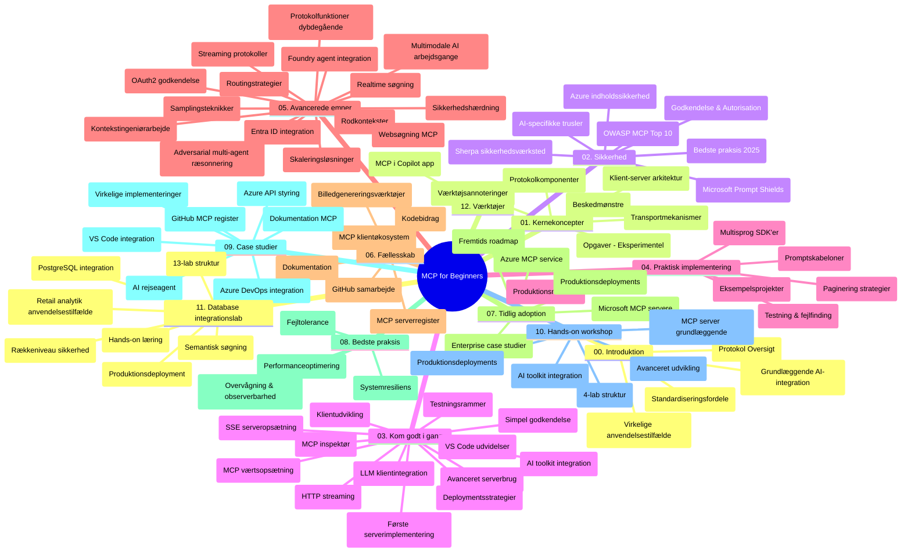

# Model Context Protocol (MCP) for begyndere - Studieguide

Denne studieguide giver et overblik over repositoriets struktur og indhold til "Model Context Protocol (MCP) for begyndere"-pensum. Brug denne guide til effektivt at navigere i repositoriet og få mest muligt ud af de tilgængelige ressourcer.

## Oversigt over Repositoriet

Model Context Protocol (MCP) er en standardiseret ramme for interaktioner mellem AI-modeller og klientapplikationer. Oprindeligt oprettet af Anthropic, vedligeholdes MCP nu af det bredere MCP-fællesskab gennem den officielle GitHub-organisation. Dette repository tilbyder et omfattende pensum med praktiske kodeeksempler i C#, Java, JavaScript, Python og TypeScript, designet til AI-udviklere, systemarkitekter og softwareingeniører.

## Visuelt Pensumkort

## Repositoriumsstruktur

Repositoriet er organiseret i tolv hovedsektioner, der hver især fokuserer på forskellige aspekter af MCP:

1. **Introduktion (00-Introduction/)**
   - Oversigt over Model Context Protocol
   - Hvorfor standardisering er vigtigt i AI-pipelines
   - Praktiske anvendelsestilfælde og fordele

2. **Kernebegreber (01-CoreConcepts/)**
   - Kunde-server arkitektur
   - Centrale protokolkomponenter
   - Messaging-mønstre i MCP
   - Fremadskuende: [Hvad ændrer sig i MCP: 2026-07-28 Release Candidate](./01-CoreConcepts/mcp-2026-07-28-release-candidate.md) — den statsløse protokolkerne, Extensions-rammen, og forældelse af Roots/Sampling/Logging forventes i næste specifikationsversion

3. **Sikkerhed (02-Security/)**
   - Sikkerhedstrusler i MCP-baserede systemer
   - Bedste praksis for sikre implementeringer
   - Autentificerings- og autorisationsstrategier
   - **Omfattende sikkerhedsdokumentation**:
     - MCP Security Best Practices 2025
     - Azure Content Safety Implementeringsguide
     - MCP Security Controls and Techniques
     - MCP Best Practices Quick Reference
   - **Nøglesikkerhedsemner**:
     - Prompt injection og tool poisoning-angreb
     - Session hijacking og confused deputy-problematikker
     - Token passthrough-sårbarheder
     - Overdrevne tilladelser og adgangskontrol
     - Supply chain-sikkerhed for AI-komponenter
     - Microsoft Prompt Shields-integration

4. **Kom Godt I Gang (03-GettingStarted/)**
   - Miljøopsætning og konfiguration
   - Oprettelse af basale MCP-servere og klienter
   - Integration med eksisterende applikationer
   - Indeholder sektioner til:
     - Første serverimplementering
     - Klientudvikling
     - LLM-klientintegration
     - VS Code-integration
     - Server-Sent Events (SSE) server
     - Avanceret serverbrug
     - HTTP streaming
     - AI Toolkit integration
     - Teststrategier
     - Udrulningsvejledning

5. **Praktisk Implementering (04-PracticalImplementation/)**
   - Brug af SDK'er på tværs af forskellige programmeringssprog
   - Debugging, testning og valideringsteknikker
   - Udformning af genanvendelige promptskabeloner og workflows
   - Eksempler på projekter med implementations-eksempler

6. **Avancerede Emner (05-AdvancedTopics/)**
   - Kontekst-ingeniørarbejde teknikker
   - Foundry agent integration
   - Multi-modale AI workflows 
   - OAuth2 autentificeringsdemoer
   - Realtids-søgefunktioner
   - Realtids-streaming
   - Implementering af Root contexts
   - Routingstrategier
   - Samplingsteknikker
   - Skaleringstilgange
   - Sikkerhedsovervejelser
   - Entra ID sikkerhedsintegration
   - Websøgningsintegration
   - Adversarial multi-agent reasoning (debatmønstre)

7. **Fællesskabsbidrag (06-CommunityContributions/)**
   - Hvordan man bidrager med kode og dokumentation
   - Samarbejde via GitHub
   - Fællesskabsdrevne forbedringer og feedback
   - Brug af forskellige MCP-klienter (Claude Desktop, Cline, VSCode)
   - Arbejde med populære MCP-servere inklusive billedgenerering

8. **Lektioner fra Tidlig Adoption (07-LessonsfromEarlyAdoption/)**
   - Virkelige implementeringer og succeshistorier
   - Opbygning og udrulning af MCP-baserede løsninger
   - Tendenser og fremtidige roadmap
   - **Microsoft MCP Servers Guide**: Omfattende guide til 10 produktionsparate Microsoft MCP-servere inklusive:
     - Microsoft Learn Docs MCP Server
     - Azure MCP Server (15+ specialiserede connectors)
     - GitHub MCP Server
     - Azure DevOps MCP Server
     - MarkItDown MCP Server
     - SQL Server MCP Server
     - Playwright MCP Server
     - Dev Box MCP Server
     - Microsoft Foundry MCP Server
     - Microsoft 365 Agents Toolkit MCP Server

9. **Bedste Praksis (08-BestPractices/)**
   - Performance tuning og optimering
   - Design af fejltolerante MCP-systemer
   - Test- og robusthedsstrategier

10. **Case Studier (09-CaseStudy/)**
    - **Syv omfattende case-studier** der viser MCP's alsidighed i forskellige scenarier:
    - **Azure AI Rejseagenter**: Multi-agent orkestrering med Azure OpenAI og AI Search
    - **Azure DevOps Integration**: Automatisering af workflow-processer med YouTube dataopdateringer
    - **Realtids dokumenthentning**: Python konsolklient med streaming HTTP
    - **Interaktiv Studieplan-generator**: Chainlit web-app med konverserende AI
    - **In-Editor Dokumentation**: VS Code-integration med GitHub Copilot-workflows
    - **Azure API Management**: Enterprise API-integration med MCP-server oprettelse
    - **GitHub MCP Registry**: Økosystemudvikling og agentbaseret integrationsplatform
    - Implementeringseksempler inden for enterprise-integration, udviklerproduktivitet og økosystemudvikling

11. **Hands-on Workshop (10-StreamliningAIWorkflowsBuildingAnMCPServerWithAIToolkit/)**
    - Omfattende hands-on workshop der kombinerer MCP med AI Toolkit
    - Byg intelligente applikationer som forbinder AI-modeller med virkelige værktøjer
    - Praktiske moduler der dækker grundlæggende, brugerdefineret serverudvikling og produktionsudrulningsstrategier
    - **Lab-struktur**:
      - Lab 1: MCP Server Fundamentals
      - Lab 2: Avanceret MCP Serverudvikling
      - Lab 3: AI Toolkit Integration
      - Lab 4: Produktionsudrulning og Skalering
    - Lab-baseret læring med trin-for-trin instruktioner

12. **MCP Server Database Integrations Labs (11-MCPServerHandsOnLabs/)**
    - **Omfattende 13-lab læringssti** til at bygge produktionsklare MCP-servere med PostgreSQL integration
    - **Virkelighedsnær detailhandelsanalyseimplementering** brugende Zava Retail use case
    - **Enterprise-grade mønstre** inklusive Row Level Security (RLS), semantisk søgning og multi-tenant data adgang
    - **Komplet Lab-struktur**:
      - **Labs 00-03: Fundamenter** - Introduktion, Arkitektur, Sikkerhed, Miljøopsætning
      - **Labs 04-06: Byg MCP Serveren** - Database Design, MCP Server Implementering, Tool-udvikling
      - **Labs 07-09: Avancerede Funktioner** - Semantisk Søgn, Test & Debugging, VS Code-integration
      - **Labs 10-12: Produktion & Bedste Praksis** - Udrulning, Overvågning, Optimering
    - **Dækkede Teknologier**: FastMCP framework, PostgreSQL, Azure OpenAI, Azure Container Apps, Application Insights
    - **Læringsudbytte**: Produktionsklare MCP-servere, databaseintegrationsmønstre, AI-drevne analyser, enterprise-sikkerhed

13. **Tooling (12-tooling/)**
    - Lær hvordan man bruger MCP i Copilot app og andre værktøjer

## Yderligere Ressourcer

Repositoriet inkluderer støtteressourcer:

- **Billeder-mappe**: Indeholder diagrammer og illustrationer brugt gennem pensum
- **Oversættelser**: Flersproget support med automatiserede oversættelser af dokumentation
- **Officielle MCP Ressourcer**:
  - [MCP Documentation](https://modelcontextprotocol.io/)
  - [MCP Specification](https://spec.modelcontextprotocol.io/)
  - [MCP GitHub Repository](https://github.com/modelcontextprotocol)

## Sådan Bruges Dette Repository

1. **Sekventiel Læring**: Følg kapitlerne i rækkefølge (00 til 11) for en struktureret læringsoplevelse.
2. **Sprog-specifik Fokus**: Hvis du er interesseret i et bestemt programmeringssprog, udforsk eksempelmappen for implementeringer i dit foretrukne sprog.
3. **Praktisk Implementering**: Start med sektionen "Kom Godt I Gang" for at sætte dit miljø op og oprette din første MCP-server og klient.
4. **Avanceret Udforskning**: Når du er komfortabel med det grundlæggende, dykk ned i de avancerede emner for at udvide din viden.
5. **Fællesskabsengagement**: Deltag i MCP-fællesskabet gennem GitHub-diskussioner og Discord-kanaler for at forbinde med eksperter og andre udviklere.

## MCP-klienter og Værktøjer

Pensum dækker forskellige MCP-klienter og værktøjer:

1. **Officielle Klienter**:
   - Visual Studio Code 
   - MCP i Visual Studio Code
   - Claude Desktop
   - Claude i VSCode 
   - Claude API

2. **Fællesskabsklienter**:
   - Cline (terminal-baseret)
   - Cursor (kodeeditor)
   - ChatMCP
   - Windsurf

3. **MCP Management Værktøjer**:
   - MCP CLI
   - MCP Manager
   - MCP Linker
   - MCP Router

## Populære MCP-servere

Repositoriet introducerer forskellige MCP-servere, blandt andet:

1. **Officielle Microsoft MCP-servere**:
   - Microsoft Learn Docs MCP Server
   - Azure MCP Server (15+ specialiserede connectors)
   - GitHub MCP Server
   - Azure DevOps MCP Server
   - MarkItDown MCP Server
   - SQL Server MCP Server
   - Playwright MCP Server
   - Dev Box MCP Server
   - Microsoft Foundry MCP Server
   - Microsoft 365 Agents Toolkit MCP Server

2. **Officielle Reference Servere**:
   - Filesystem
   - Fetch
   - Memory
   - Sequential Thinking

3. **Billedgenerering**:
   - Azure OpenAI DALL-E 3
   - Stable Diffusion WebUI
   - Replicate

4. **Udviklingsværktøjer**:
   - Git MCP
   - Terminal Control
   - Code Assistant

5. **Specialiserede Servere**:
   - Salesforce
   - Microsoft Teams
   - Jira & Confluence

## Bidrag

Dette repository byder velkommen til bidrag fra fællesskabet. Se afsnittet om Fællesskabsbidrag for vejledning om, hvordan man bidrager effektivt til MCP-økosystemet.

----

*Denne studieguide blev senest opdateret den 5. februar 2026, hvilket afspejler den nyeste MCP Specification 2025-11-25 og giver et overblik over repositoriet pr. denne dato. Repositorieindhold kan opdateres efter denne dato.*

*Tillæg (2. juli 2026): en lektion om `2026-07-28` MCP Specification Release Candidate blev tilføjet under [01-CoreConcepts](./01-CoreConcepts/mcp-2026-07-28-release-candidate.md); pensumbasen forbliver 2025-11-25 indtil den nye specifikation frigives.*

---

<!-- CO-OP TRANSLATOR DISCLAIMER START -->
**Ansvarsfraskrivelse**:
Dette dokument er blevet oversat ved hjælp af AI-oversættelsestjenesten [Co-op Translator](https://github.com/Azure/co-op-translator). Selvom vi bestræber os på nøjagtighed, skal du være opmærksom på, at automatiserede oversættelser kan indeholde fejl eller unøjagtigheder. Det originale dokument på dets oprindelige sprog bør betragtes som den autoritative kilde. For kritisk information anbefales professionel menneskelig oversættelse. Vi påtager os intet ansvar for misforståelser eller fejltolkninger, der opstår som følge af brugen af denne oversættelse.
<!-- CO-OP TRANSLATOR DISCLAIMER END -->