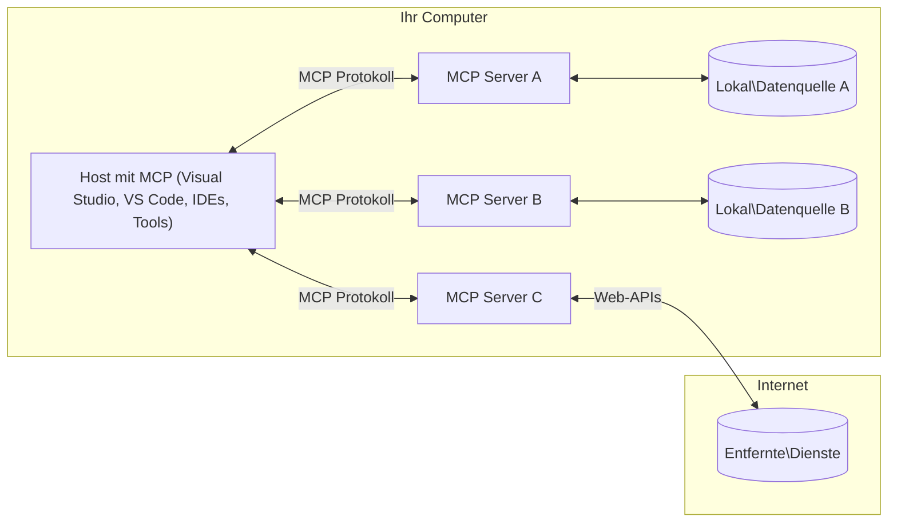

# MCP Kernkonzepte: Beherrschung des Model Context Protocol zur KI-Integration

[](https://youtu.be/earDzWGtE84)

_(Klicken Sie auf das obige Bild, um das Video zu dieser Lektion anzusehen)_

Das [Model Context Protocol (MCP)](https://github.com/modelcontextprotocol) ist ein leistungsstarkes, standardisiertes Framework, das die Kommunikation zwischen Large Language Models (LLMs) und externen Werkzeugen, Anwendungen und Datenquellen optimiert.
Dieses Handbuch führt Sie durch die Kernkonzepte von MCP. Sie lernen die Client-Server-Architektur, wesentliche Komponenten, Kommunikationsmechanismen und bewährte Implementierungspraktiken kennen.

- **Explizite Benutzerzustimmung**: Alle Datenzugriffe und Operationen erfordern vor der Ausführung eine ausdrückliche Zustimmung des Benutzers. Benutzer müssen klar verstehen, auf welche Daten zugegriffen wird und welche Aktionen durchgeführt werden, mit granularer Kontrolle über Berechtigungen und Autorisierungen.

- **Datenschutz**: Benutzerdaten werden nur mit ausdrücklicher Zustimmung offengelegt und müssen durch robuste Zugriffskontrollen während des gesamten Interaktionszyklus geschützt werden. Implementierungen müssen unbefugte Datenübertragungen verhindern und strenge Datenschutzgrenzen einhalten.

- **Sichere Ausführung von Werkzeugen**: Jede Werkzeugausführung erfordert die ausdrückliche Zustimmung des Benutzers mit klarem Verständnis der Funktionalität, Parameter und möglichen Auswirkungen des Werkzeugs. Robuste Sicherheitsgrenzen müssen unbeabsichtigte, unsichere oder bösartige Werkzeugsaufrufe verhindern.

- **Sicherheit der Transportschicht**: Alle Kommunikationskanäle sollten geeignete Verschlüsselungs- und Authentifizierungsmechanismen verwenden. Remote-Verbindungen müssen sichere Transportprotokolle und angemessenes Credential-Management implementieren.

#### Implementierungsrichtlinien:

- **Berechtigungsmanagement**: Implementieren Sie fein abgestufte Berechtigungssysteme, die es Benutzern erlauben, zu kontrollieren, welche Server, Werkzeuge und Ressourcen zugänglich sind
- **Authentifizierung & Autorisierung**: Verwenden Sie sichere Authentifizierungsmethoden (OAuth, API-Schlüssel) mit ordnungsgemäßem Token-Management und Ablaufsteuerung
- **Eingabevalidierung**: Validieren Sie alle Parameter und Eingabedaten gemäß festgelegten Schemata, um Injection-Angriffe zu verhindern
- **Audit Logging**: Führen Sie umfassende Protokolle aller Operationen zur Sicherheitsüberwachung und Compliance

## Überblick

Diese Lektion untersucht die grundlegende Architektur und Komponenten, die das Model Context Protocol (MCP) Ökosystem ausmachen. Sie lernen die Client-Server-Architektur, zentrale Komponenten und Kommunikationsmechanismen kennen, die MCP-Interaktionen ermöglichen.

## Wichtige Lernziele

Am Ende dieser Lektion werden Sie:

- Die MCP Client-Server-Architektur verstehen.
- Rollen und Verantwortlichkeiten von Hosts, Clients und Servern identifizieren.
- Die Kernfunktionen analysieren, die MCP zu einer flexiblen Integrationsschicht machen.
- Lernen, wie Informationen innerhalb des MCP-Ökosystems fließen.
- Praktische Einblicke durch Codebeispiele in .NET, Java, Python und JavaScript gewinnen.

## MCP Architektur: Eine tiefere Betrachtung

Das MCP-Ökosystem basiert auf einem Client-Server-Modell. Diese modulare Struktur ermöglicht es KI-Anwendungen, effizient mit Werkzeugen, Datenbanken, APIs und kontextuellen Ressourcen zu interagieren. Lassen Sie uns diese Architektur in ihre Kernkomponenten aufschlüsseln.

Im Kern folgt MCP einer Client-Server-Architektur, bei der eine Host-Anwendung sich mit mehreren Servern verbinden kann:



- **MCP Hosts**: Programme wie VSCode, Claude Desktop, IDEs oder KI-Werkzeuge, die über MCP auf Daten zugreifen möchten
- **MCP Clients**: Protokollclients, die 1:1-Verbindungen zu Servern unterhalten
- **MCP Server**: Leichtgewichtige Programme, die jeweils spezifische Funktionen über das standardisierte Model Context Protocol bereitstellen
- **Lokale Datenquellen**: Dateien, Datenbanken und Dienste Ihres Computers, auf die MCP-Server sicher zugreifen können
- **Remote Services**: Externe Systeme, die über das Internet verfügbar sind und mit denen MCP-Server über APIs verbunden werden können.

Das MCP-Protokoll ist ein sich entwickelnder Standard mit datumsbasierter Versionierung (Format JJJJ-MM-TT). Die aktuelle Protokollversion ist **2025-11-25**. Sie können die neuesten Updates in der [Protokollspezifikation](https://modelcontextprotocol.io/specification/2025-11-25/) einsehen.

> **Ausblick:** Ein Release Candidate für die nächste Spezifikationsversion, **2026-07-28**, wurde im Mai 2026 angekündigt und soll am 28. Juli 2026 veröffentlicht werden. Er macht das Protokoll auf der Transportschicht zustandslos (Entfernung des `initialize` Handshakes und der Sitzungs-IDs), formiert ein Erweiterungs-Framework und stellt Wurzeln, Sampling und Logging zugunsten neuerer Muster ein. Siehe [Was ändert sich in MCP: Der 2026-07-28 Release Candidate](./mcp-2026-07-28-release-candidate.md) für eine vollständige Aufschlüsselung.

### 1. Hosts

Im Model Context Protocol (MCP) sind **Hosts** KI-Anwendungen, die als primäre Schnittstelle dienen, über die Benutzer mit dem Protokoll interagieren. Hosts koordinieren und verwalten Verbindungen zu mehreren MCP-Servern, indem sie für jede Serververbindung dedizierte MCP-Clients erstellen. Beispiele für Hosts sind:

- **KI-Anwendungen**: Claude Desktop, Visual Studio Code, Claude Code
- **Entwicklungsumgebungen**: IDEs und Code-Editoren mit MCP-Integration  
- **Benutzerdefinierte Anwendungen**: Zweckgebundene KI-Agenten und Werkzeuge

**Hosts** sind Anwendungen, die KI-Modell-Interaktionen koordinieren. Sie:

- **KI-Modelle orchestrieren**: Führen LLMs aus oder interagieren mit ihnen, um Antworten zu generieren und KI-Workflows zu koordinieren
- **Client-Verbindungen verwalten**: Erstellen und pflegen jeweils einen MCP-Client pro MCP-Server-Verbindung
- **Benutzeroberfläche steuern**: Handhaben den Gesprächsfluss, Benutzerinteraktionen und Antwortpräsentation  
- **Sicherheit durchsetzen**: Kontrollieren Berechtigungen, Sicherheitsbeschränkungen und Authentifizierung
- **Benutzerzustimmung handhaben**: Verwalten Benutzerzustimmungen für Datenaustausch und Werkzeugausführung


### 2. Clients

**Clients** sind wesentliche Komponenten, die dedizierte Eins-zu-eins-Verbindungen zwischen Hosts und MCP-Servern aufrechterhalten. Jeder MCP-Client wird vom Host instanziiert, um eine Verbindung zu einem bestimmten MCP-Server herzustellen, was organisierte und sichere Kommunikationskanäle gewährleistet. Mehrere Clients ermöglichen Hosts, gleichzeitig mit mehreren Servern verbunden zu sein.

**Clients** sind verbindende Komponenten innerhalb der Host-Anwendung. Sie:

- **Protokollkommunikation**: Senden JSON-RPC 2.0-Anfragen an Server mit Prompts und Anweisungen
- **Fähigkeitsverhandlung**: Verhandeln unterstützte Funktionen und Protokollversionen mit Servern während der Initialisierung
- **Werkzeugausführung**: Verwalten Werkzeugausführungsanforderungen von Modellen und verarbeiten Antworten
- **Echtzeit-Updates**: Handhaben Benachrichtigungen und Echtzeit-Updates von Servern
- **Antwortverarbeitung**: Verarbeiten und formatieren Serverantworten zur Anzeige für Benutzer

### 3. Server

**Server** sind Programme, die Kontext, Werkzeuge und Fähigkeiten für MCP-Clients bereitstellen. Sie können lokal (auf demselben Rechner wie der Host) oder remote (auf externen Plattformen) ausgeführt werden und sind verantwortlich für die Verarbeitung von Client-Anfragen und die Bereitstellung strukturierter Antworten. Server bieten spezifische Funktionalität über das standardisierte Model Context Protocol an.

**Server** sind Dienste, die Kontext und Funktionen bereitstellen. Sie:

- **Feature-Registrierung**: Registrieren und stellen verfügbare Primitiven (Ressourcen, Prompts, Werkzeuge) für Clients bereit
- **Anfrageverarbeitung**: Empfangen und führen Werkzeugaufrufe, Ressourcenanforderungen und Prompt-Anfragen von Clients aus
- **Kontextbereitstellung**: Stellen kontextuelle Informationen und Daten bereit, um Modellantworten zu verbessern
- **Zustandsverwaltung**: Pflegen Sitzungszustände und handhaben zustandsbehaftete Interaktionen, wenn erforderlich

- **Echtzeit-Benachrichtigungen**: Senden Sie Benachrichtigungen über Fähigkeitsänderungen und Updates an verbundene Clients

Server können von jedem entwickelt werden, um Modellfähigkeiten mit spezialisierten Funktionen zu erweitern, und sie unterstützen sowohl lokale als auch Remote-Bereitstellungsszenarien.

### 4. Server-Primitiven

Server im Model Context Protocol (MCP) bieten drei grundlegende **Primitiven**, die die fundamentalen Bausteine für reichhaltige Interaktionen zwischen Clients, Hosts und Sprachmodellen definieren. Diese Primitiven spezifizieren die Arten von kontextuellen Informationen und Aktionen, die über das Protokoll verfügbar sind.

MCP-Server können jede Kombination der folgenden drei Kernprimitiven bereitstellen:

#### Ressourcen

**Ressourcen** sind Datenquellen, die kontextuelle Informationen für KI-Anwendungen bereitstellen. Sie repräsentieren statische oder dynamische Inhalte, die das Modellverständnis und die Entscheidungsfindung verbessern können:

- **Kontextbezogene Daten**: Strukturierte Informationen und Kontext für den Verbrauch durch KI-Modelle
- **Wissensdatenbanken**: Dokumentenarchive, Artikel, Handbücher und Forschungsarbeiten
- **Lokale Datenquellen**: Dateien, Datenbanken und lokale Systeminformationen  
- **Externe Daten**: API-Antworten, Webdienste und entfernte Systemdaten
- **Dynamische Inhalte**: Echtzeitdaten, die sich basierend auf externen Bedingungen aktualisieren

Ressourcen werden durch URIs identifiziert und unterstützen die Auflistung über `resources/list` sowie das Abrufen über `resources/read` Methoden:

```text
file://documents/project-spec.md
database://production/users/schema
api://weather/current
```

#### Prompts

**Prompts** sind wiederverwendbare Vorlagen, die helfen, Interaktionen mit Sprachmodellen zu strukturieren. Sie bieten standardisierte Interaktionsmuster und vorgefertigte Arbeitsabläufe:

- **Vorlagenbasierte Interaktionen**: Vorgefertigte Nachrichten und Gesprächseinleitungen
- **Workflow-Vorlagen**: Standardisierte Abläufe für gängige Aufgaben und Interaktionen
- **Few-shot-Beispiele**: Beispielbasierte Vorlagen zur Modellanweisung
- **System-Prompts**: Grundlegende Aufforderungen, die Modellverhalten und Kontext definieren
- **Dynamische Vorlagen**: Parametrisierte Prompts, die sich an spezifische Kontexte anpassen

Prompts unterstützen Variablenaustausch und können über `prompts/list` entdeckt und mit `prompts/get` abgerufen werden:

```markdown
Generate a {{task_type}} for {{product}} targeting {{audience}} with the following requirements: {{requirements}}
```

#### Werkzeuge

**Werkzeuge** sind ausführbare Funktionen, die KI-Modelle aufrufen können, um spezifische Aktionen auszuführen. Sie repräsentieren die „Verben“ des MCP-Ökosystems und ermöglichen es Modellen, mit externen Systemen zu interagieren:

- **Ausführbare Funktionen**: Diskrete Operationen, die Modelle mit spezifischen Parametern aufrufen können
- **Integration externer Systeme**: API-Aufrufe, Datenbankabfragen, Dateioperationen, Berechnungen
- **Eindeutige Identität**: Jedes Werkzeug hat einen eindeutigen Namen, Beschreibung und Parameterschema
- **Strukturierte Ein-/Ausgabe**: Werkzeuge akzeptieren validierte Parameter und liefern strukturierte, typisierte Antworten zurück
- **Aktionsfähigkeiten**: Ermöglichen Modellen, reale Aktionen auszuführen und Live-Daten abzurufen

Werkzeuge werden mit JSON Schema für die Parametervalidierung definiert, über `tools/list` bereitgestellt und mittels `tools/call` ausgeführt. Werkzeuge können außerdem **Icons** als zusätzliche Metadaten für eine bessere UI-Präsentation enthalten.

**Werkzeug-Anmerkungen**: Werkzeuge unterstützen Verhaltensanmerkungen (z. B. `readOnlyHint`, `destructiveHint`), die beschreiben, ob ein Werkzeug nur-lesend oder destruktiv ist und helfen Clients dabei, fundierte Entscheidungen über die Werkzeugausführung zu treffen.

Beispiel Werkzeugdefinition:

```typescript
server.tool(
  "search_products", 
  {
    query: z.string().describe("Search query for products"),
    category: z.string().optional().describe("Product category filter"),
    max_results: z.number().default(10).describe("Maximum results to return")
  }, 
  async (params) => {
    // Suche ausführen und strukturierte Ergebnisse zurückgeben
    return await productService.search(params);
  }
);
```

## Client-Primitiven

Im Model Context Protocol (MCP) können **Clients** Primitiven bereitstellen, die es Servern ermöglichen, zusätzliche Fähigkeiten von der Host-Anwendung anzufordern. Diese clientseitigen Primitiven erlauben reichhaltigere, interaktivere Serverimplementierungen, die auf KI-Modellfähigkeiten und Nutzerinteraktionen zugreifen können.

### Sampling

> **Hinweis zur Veraltung:** Der Release Candidate `2026-07-28` kennzeichnet Sampling als veraltet zugunsten der direkten Integration mit LLM-Provider-APIs. Es funktioniert weiterhin in `2025-11-25` und mindestens ein Jahr nach der Veraltung, aber neue Designs sollten das Ersatzmuster bevorzugen. Siehe [Was ändert sich in MCP: Der Release Candidate 2026-07-28](./mcp-2026-07-28-release-candidate.md).

**Sampling** erlaubt Servern, Sprachmodell-Vervollständigungen von der KI-Anwendung des Clients anzufordern. Diese Primitive ermöglicht es Servern, auf LLM-Fähigkeiten zuzugreifen, ohne eigene Modellabhängigkeiten einzubetten:

- **Modellunabhängiger Zugriff**: Server können Vervollständigungen anfordern, ohne LLM-SDKs zu integrieren oder den Modellzugriff zu verwalten
- **Server-initiiertes KI**: Ermöglicht Servern, autonom Inhalte mit dem Modell des Clients zu erzeugen
- **Rekursive LLM-Interaktionen**: Unterstützt komplexe Szenarien, in denen Server KI-Unterstützung zur Verarbeitung benötigen
- **Dynamische Inhaltserzeugung**: Ermöglicht Servern, kontextuelle Antworten mit dem Modell des Hosts zu erstellen
- **Werkzeugaufruf-Unterstützung**: Server können `tools` und `toolChoice` Parameter übergeben, damit das Modell des Clients Werkzeuge während des Samplings aufruft

Sampling wird über die Methode `sampling/complete` initiiert, bei der Server Vervollständigungsanfragen an Clients senden.

### Roots

> **Hinweis zur Veraltung:** Der Release Candidate `2026-07-28` kennzeichnet Roots als veraltet zugunsten von Werkzeugparametern, Ressourcen-URIs oder Serverkonfiguration. Es funktioniert weiterhin in `2025-11-25` und mindestens ein Jahr nach der Veraltung. Siehe [Was ändert sich in MCP: Der Release Candidate 2026-07-28](./mcp-2026-07-28-release-candidate.md).

**Roots** bieten eine standardisierte Möglichkeit für Clients, Dateisystemgrenzen an Server zu übermitteln und Servern zu helfen zu verstehen, auf welche Verzeichnisse und Dateien sie Zugriff haben:

- **Dateisystem-Grenzen**: Definieren Grenzen, innerhalb derer Server im Dateisystem operieren können
- **Zugriffskontrolle**: Helfen Servern zu verstehen, auf welche Verzeichnisse und Dateien sie Zugriffsrechte haben
- **Dynamische Aktualisierungen**: Clients können Server benachrichtigen, wenn sich die Liste der Roots ändert
- **URI-basierte Identifikation**: Roots verwenden `file://` URIs zur Identifikation zugänglicher Verzeichnisse und Dateien

Roots werden über die Methode `roots/list` entdeckt, wobei Clients bei Änderungen `notifications/roots/list_changed` senden.

### Elicitation

**Elicitation** ermöglicht es Servern, über die Client-Schnittstelle zusätzliche Informationen oder Bestätigungen vom Nutzer anzufordern:

- **Benutzereingabe-Anfragen**: Server können bei Bedarf zusätzliche Informationen zur Werkzeugausführung anfordern
- **Bestätigungsdialoge**: Fordern Nutzerzustimmungen für sensible oder wirkungsvolle Operationen an
- **Interaktive Arbeitsabläufe**: Ermöglichen Servern, Schritt-für-Schritt Nutzerinteraktionen zu erstellen
- **Dynamische Parameterauswahl**: Sammeln fehlender oder optionaler Parameter während der Werkzeugausführung

Elicitation-Anfragen werden mittels der Methode `elicitation/request` gestellt, um Nutzereingaben über die Schnittstelle des Clients zu sammeln.

**URL-Modus Elicitation**: Server können auch URL-basierte Nutzerinteraktionen anfragen, wobei Nutzer zu externen Webseiten für Authentifizierung, Bestätigung oder Dateneingabe geleitet werden.

### Protokollierung


> **Deprecation-Hinweis:** Die Veröffentlichungskandidatin `2026-07-28` markiert Logging als veraltet zugunsten von `stderr` für stdio-Transporte und OpenTelemetry für strukturierte Beobachtbarkeit. Es funktioniert weiterhin in `2025-11-25` und mindestens ein Jahr nach jeder Deprecation. Siehe [Was sich in MCP ändert: Der Veröffentlichungskandidat 2026-07-28](./mcp-2026-07-28-release-candidate.md).

**Logging** ermöglicht es Servern, strukturierte Protokollnachrichten an Clients für Debugging, Überwachung und operative Sichtbarkeit zu senden:

- **Debugging-Unterstützung**: Ermöglicht Servern, ausführliche Ausführungsprotokolle zur Fehlerbehebung bereitzustellen
- **Betriebliche Überwachung**: Sendet Statusaktualisierungen und Leistungskennzahlen an Clients
- **Fehlermeldung**: Liefert detaillierten Fehlerkontext und Diagnoseinformationen
- **Auditspuren**: Erstellt umfassende Protokolle von Serveroperationen und Entscheidungen

Logging-Nachrichten werden an Clients gesendet, um Transparenz in Serveroperationen zu gewährleisten und das Debugging zu erleichtern.

## Informationsfluss in MCP

Das Model Context Protocol (MCP) definiert einen strukturierten Informationsfluss zwischen Hosts, Clients, Servern und Modellen. Das Verständnis dieses Flusses hilft, zu klären, wie Benutzeranfragen verarbeitet werden und wie externe Tools und Daten in Modellausgaben integriert werden.

- **Host initiiert Verbindung**  
  Die Host-Anwendung (z.B. eine IDE oder Chat-Oberfläche) stellt eine Verbindung zu einem MCP-Server her, typischerweise über STDIO, WebSocket oder einen anderen unterstützten Transport.

- **Fähigkeitsverhandlung**  
  Der Client (eingebettet im Host) und der Server tauschen Informationen über ihre unterstützten Funktionen, Werkzeuge, Ressourcen und Protokollversionen aus. Dies stellt sicher, dass beide Seiten die verfügbaren Fähigkeiten für die Sitzung verstehen.

- **Benutzeranfrage**  
  Der Benutzer interagiert mit dem Host (z.B. Eingabe einer Eingabeaufforderung oder eines Befehls). Der Host sammelt diese Eingabe und übergibt sie an den Client zur Verarbeitung.

- **Verwendung von Ressourcen oder Tools**  
  - Der Client kann zusätzliche Kontextinformationen oder Ressourcen vom Server anfordern (wie Dateien, Datenbankeinträge oder Wissensdatenbank-Artikel), um das Verständnis des Modells zu bereichern.
  - Falls das Modell feststellt, dass ein Tool benötigt wird (z.B. um Daten abzurufen, eine Berechnung durchzuführen oder eine API aufzurufen), sendet der Client eine Tool-Aufruf-Anfrage an den Server, in der der Toolname und die Parameter angegeben sind.

- **Serverausführung**  
  Der Server erhält die Anfrage für Ressourcen oder Tools, führt die notwendigen Operationen aus (wie das Ausführen einer Funktion, Abfragen einer Datenbank oder Abrufen einer Datei) und gibt die Ergebnisse in strukturierter Form an den Client zurück.

- **Antwortgenerierung**  
  Der Client integriert die Antworten des Servers (Ressourcendaten, Tool-Ausgaben usw.) in die laufende Modellsitzung. Das Modell nutzt diese Informationen, um eine umfassende und kontextuell relevante Antwort zu erstellen.

- **Ergebnispräsentation**  
  Der Host erhält die endgültige Ausgabe vom Client und präsentiert sie dem Benutzer, oft einschließlich des vom Modell generierten Texts und aller Ergebnisse aus Tool-Ausführungen oder Ressourcenabfragen.

Dieser Ablauf ermöglicht es MCP, fortgeschrittene, interaktive und kontextbewusste KI-Anwendungen zu unterstützen, indem Modelle nahtlos mit externen Tools und Datenquellen verbunden werden.

## Protokollarchitektur & Schichten

MCP besteht aus zwei unterschiedlichen architektonischen Schichten, die zusammenarbeiten, um ein vollständiges Kommunikationsframework bereitzustellen:

### Datenschicht

Die **Datenschicht** implementiert das Kernprotokoll MCP basierend auf **JSON-RPC 2.0**. Diese Schicht definiert die Nachrichtenstruktur, Semantik und Interaktionsmuster:

#### Kernkomponenten:

- **JSON-RPC 2.0 Protokoll**: Alle Kommunikationen verwenden das standardisierte JSON-RPC 2.0 Nachrichtenformat für Methodenaufrufe, Antworten und Benachrichtigungen
- **Lebenszyklusmanagement**: Handhabt Verbindungsinitialisierung, Fähigkeitsverhandlung und Sitzungsbeendigung zwischen Clients und Servern
- **Serverprimitiven**: Ermöglicht Servern, Kernfunktionen über Tools, Ressourcen und Prompts bereitzustellen
- **Clientprimitiven**: Ermöglicht Servern, Sampling von LLMs anzufordern, Benutzereingaben zu erfragen und Protokollmeldungen zu senden
- **Echtzeitbenachrichtigungen**: Unterstützt asynchrone Benachrichtigungen für dynamische Updates ohne Abfragen

#### Hauptmerkmale:

- **Protokollversionsverhandlung**: Verwendet datumsbasierte Versionsnummern (JJJJ-MM-TT) zur Sicherstellung der Kompatibilität
- **Fähigkeitsentdeckung**: Clients und Server tauschen unterstützte Feature-Informationen während der Initialisierung aus
- **Zustandsbehaftete Sitzungen**: Pflegt Verbindungszustand über mehrere Interaktionen für Kontextkontinuität

### Transportschicht

Die **Transportschicht** verwaltet Kommunikationskanäle, Nachrichtenrahmung und Authentifizierung zwischen MCP-Teilnehmern:

#### Unterstützte Transportmechanismen:

1. **STDIO Transport**:
   - Verwendet Standard-Ein-/Ausgabeströme für direkte Prozesskommunikation
   - Optimal für lokale Prozesse auf derselben Maschine ohne Netzwerk-Overhead
   - Häufig genutzt für lokale MCP-Serverimplementierungen

2. **Streambarer HTTP-Transport**:
   - Verwendet HTTP POST für Client-zu-Server-Nachrichten  
   - Optional Server-Sent Events (SSE) für Server-zu-Client-Streaming
   - Ermöglicht Kommunikation mit entfernten Servern über Netzwerke
   - Unterstützt Standard-HTTP-Authentifizierung (Bearer-Tokens, API-Schlüssel, benutzerdefinierte Header)
   - MCP empfiehlt OAuth für sichere, tokenbasierte Authentifizierung

#### Transportabstraktion:

Die Transportschicht abstrahiert Kommunikationsdetails von der Datenschicht und erlaubt dasselbe JSON-RPC 2.0 Nachrichtenformat über alle Transportmechanismen hinweg. Diese Abstraktion ermöglicht Anwendungen, nahtlos zwischen lokalen und entfernten Servern zu wechseln.

### Sicherheitsüberlegungen

MCP-Implementierungen müssen mehrere kritische Sicherheitsprinzipien einhalten, um sichere, vertrauenswürdige und geschützte Interaktionen über alle Protokolloperationen hinweg zu gewährleisten:

- **Benutzerzustimmung und Kontrolle**: Benutzer müssen explizit zustimmen, bevor Daten abgerufen oder Operationen ausgeführt werden. Sie sollten klare Kontrolle darüber haben, welche Daten geteilt und welche Aktionen autorisiert werden, unterstützt durch intuitive Benutzeroberflächen zum Überprüfen und Genehmigen von Aktivitäten.

- **Datenschutz**: Benutzerdaten dürfen nur mit ausdrücklicher Zustimmung offengelegt werden und müssen durch angemessene Zugriffskontrollen geschützt sein. MCP-Implementierungen müssen unbefugte Datenübertragung verhindern und sicherstellen, dass Datenschutz bei allen Interaktionen gewahrt bleibt.

- **Toolsicherheit**: Vor dem Aufruf eines Tools ist eine ausdrückliche Benutzereinwilligung erforderlich. Benutzer sollen ein klares Verständnis der Funktionalität jedes Tools haben, und robuste Sicherheitsgrenzen müssen durchgesetzt werden, um unbeabsichtigte oder unsichere Tool-Ausführungen zu verhindern.

Durch die Einhaltung dieser Sicherheitsprinzipien stellt MCP sicher, dass Benutzervertrauen, Datenschutz und Sicherheit bei allen Protokollinteraktionen gewahrt bleiben und gleichzeitig leistungsstarke KI-Integrationen ermöglicht werden.

## Codebeispiele: Schlüsselkomponenten

Im Folgenden finden sich Codebeispiele in mehreren beliebten Programmiersprachen, die die Implementierung wichtiger MCP-Serverkomponenten und Tools illustrieren.

### .NET-Beispiel: Erstellung eines einfachen MCP-Servers mit Tools

Hier ist ein praxisnahes .NET-Codebeispiel, das zeigt, wie man einen einfachen MCP-Server mit benutzerdefinierten Tools implementiert. Das Beispiel veranschaulicht, wie man Tools definiert und registriert, Anfragen bearbeitet und den Server mit dem Model Context Protocol verbindet.

```csharp
using System;
using System.Threading.Tasks;
using ModelContextProtocol.Server;
using ModelContextProtocol.Server.Transport;
using ModelContextProtocol.Server.Tools;

public class WeatherServer
{
    public static async Task Main(string[] args)
    {
        // Create an MCP server
        var server = new McpServer(
            name: "Weather MCP Server",
            version: "1.0.0"
        );
        
        // Register our custom weather tool
        server.AddTool<string, WeatherData>("weatherTool", 
            description: "Gets current weather for a location",
            execute: async (location) => {
                // Call weather API (simplified)
                var weatherData = await GetWeatherDataAsync(location);
                return weatherData;
            });
        
        // Connect the server using stdio transport
        var transport = new StdioServerTransport();
        await server.ConnectAsync(transport);
        
        Console.WriteLine("Weather MCP Server started");
        
        // Keep the server running until process is terminated
        await Task.Delay(-1);
    }
    
    private static async Task<WeatherData> GetWeatherDataAsync(string location)
    {
        // This would normally call a weather API
        // Simplified for demonstration
        await Task.Delay(100); // Simulate API call
        return new WeatherData { 
            Temperature = 72.5,
            Conditions = "Sunny",
            Location = location
        };
    }
}

public class WeatherData
{
    public double Temperature { get; set; }
    public string Conditions { get; set; }
    public string Location { get; set; }
}
```

### Java-Beispiel: MCP-Serverkomponenten

Dieses Beispiel zeigt denselben MCP-Server und Tool-Registrierungsprozess wie das .NET-Beispiel oben, jedoch in Java realisiert.

```java
import io.modelcontextprotocol.server.McpServer;
import io.modelcontextprotocol.server.McpToolDefinition;
import io.modelcontextprotocol.server.transport.StdioServerTransport;
import io.modelcontextprotocol.server.tool.ToolExecutionContext;
import io.modelcontextprotocol.server.tool.ToolResponse;

public class WeatherMcpServer {
    public static void main(String[] args) throws Exception {
        // Erstellen Sie einen MCP-Server
        McpServer server = McpServer.builder()
            .name("Weather MCP Server")
            .version("1.0.0")
            .build();
            
        // Registrieren Sie ein Wetter-Tool
        server.registerTool(McpToolDefinition.builder("weatherTool")
            .description("Gets current weather for a location")
            .parameter("location", String.class)
            .execute((ToolExecutionContext ctx) -> {
                String location = ctx.getParameter("location", String.class);
                
                // Wetterdaten abrufen (vereinfacht)
                WeatherData data = getWeatherData(location);
                
                // Formatierten Antwort zurückgeben
                return ToolResponse.content(
                    String.format("Temperature: %.1f°F, Conditions: %s, Location: %s", 
                    data.getTemperature(), 
                    data.getConditions(), 
                    data.getLocation())
                );
            })
            .build());
        
        // Verbinden Sie den Server mit stdio-Transport
        try (StdioServerTransport transport = new StdioServerTransport()) {
            server.connect(transport);
            System.out.println("Weather MCP Server started");
            // Server am Laufen halten, bis der Prozess beendet wird
            Thread.currentThread().join();
        }
    }
    
    private static WeatherData getWeatherData(String location) {
        // Die Implementierung würde eine Wetter-API aufrufen
        // Für Beispielzwecke vereinfacht
        return new WeatherData(72.5, "Sunny", location);
    }
}

class WeatherData {
    private double temperature;
    private String conditions;
    private String location;
    
    public WeatherData(double temperature, String conditions, String location) {
        this.temperature = temperature;
        this.conditions = conditions;
        this.location = location;
    }
    
    public double getTemperature() {
        return temperature;
    }
    
    public String getConditions() {
        return conditions;
    }
    
    public String getLocation() {
        return location;
    }
}
```

### Python-Beispiel: Aufbau eines MCP-Servers

Dieses Beispiel verwendet fastmcp, stellen Sie daher bitte sicher, dass Sie es zuerst installieren:

```python
pip install fastmcp
```
Codebeispiel:

```python
#!/usr/bin/env python3
import asyncio
from fastmcp import FastMCP
from fastmcp.transports.stdio import serve_stdio

# Erstellen Sie einen FastMCP-Server
mcp = FastMCP(
    name="Weather MCP Server",
    version="1.0.0"
)

@mcp.tool()
def get_weather(location: str) -> dict:
    """Gets current weather for a location."""
    return {
        "temperature": 72.5,
        "conditions": "Sunny",
        "location": location
    }

# Alternative Vorgehensweise mit einer Klasse
class WeatherTools:
    @mcp.tool()
    def forecast(self, location: str, days: int = 1) -> dict:
        """Gets weather forecast for a location for the specified number of days."""
        return {
            "location": location,
            "forecast": [
                {"day": i+1, "temperature": 70 + i, "conditions": "Partly Cloudy"}
                for i in range(days)
            ]
        }

# Klasse Werkzeuge registrieren
weather_tools = WeatherTools()

# Starte den Server
if __name__ == "__main__":
    asyncio.run(serve_stdio(mcp))
```

### JavaScript-Beispiel: Erstellung eines MCP-Servers

Dieses Beispiel zeigt die Erstellung eines MCP-Servers in JavaScript und wie zwei wetterbezogene Tools registriert werden.

```javascript
// Verwendung des offiziellen Model Context Protocol SDK
import { McpServer } from "@modelcontextprotocol/sdk/server/mcp.js";
import { StdioServerTransport } from "@modelcontextprotocol/sdk/server/stdio.js";
import { z } from "zod"; // Zur Parameterüberprüfung

// Einen MCP-Server erstellen
const server = new McpServer({
  name: "Weather MCP Server",
  version: "1.0.0"
});

// Ein Wettersymbol definieren
server.tool(
  "weatherTool",
  {
    location: z.string().describe("The location to get weather for")
  },
  async ({ location }) => {
    // Dies würde normalerweise eine Wetter-API aufrufen
    // Vereinfacht zur Demonstration
    const weatherData = await getWeatherData(location);
    
    return {
      content: [
        { 
          type: "text", 
          text: `Temperature: ${weatherData.temperature}°F, Conditions: ${weatherData.conditions}, Location: ${weatherData.location}` 
        }
      ]
    };
  }
);

// Ein Vorhersagetool definieren
server.tool(
  "forecastTool",
  {
    location: z.string(),
    days: z.number().default(3).describe("Number of days for forecast")
  },
  async ({ location, days }) => {
    // Dies würde normalerweise eine Wetter-API aufrufen
    // Vereinfacht zur Demonstration
    const forecast = await getForecastData(location, days);
    
    return {
      content: [
        { 
          type: "text", 
          text: `${days}-day forecast for ${location}: ${JSON.stringify(forecast)}` 
        }
      ]
    };
  }
);

// Hilfsfunktionen
async function getWeatherData(location) {
  // API-Aufruf simulieren
  return {
    temperature: 72.5,
    conditions: "Sunny",
    location: location
  };
}

async function getForecastData(location, days) {
  // API-Aufruf simulieren
  return Array.from({ length: days }, (_, i) => ({
    day: i + 1,
    temperature: 70 + Math.floor(Math.random() * 10),
    conditions: i % 2 === 0 ? "Sunny" : "Partly Cloudy"
  }));
}

// Verbinden Sie den Server mit stdio Transport
const transport = new StdioServerTransport();
server.connect(transport).catch(console.error);

console.log("Weather MCP Server started");
```

Dieses JavaScript-Beispiel demonstriert, wie man einen MCP-Server mit dem Model Context Protocol SDK erstellt. Es zeigt, wie zwei Tools mit den Namen `weatherTool` und `forecastTool` registriert und MCP-Clients über den `StdioServerTransport` zugänglich gemacht werden.

## Sicherheit und Autorisierung

MCP enthält mehrere integrierte Konzepte und Mechanismen zur Verwaltung von Sicherheit und Autorisierung im gesamten Protokoll:

1. **Tool-Berechtigungssteuerung**:  
  Clients können angeben, welche Tools ein Modell während einer Sitzung verwenden darf. Dies stellt sicher, dass nur explizit autorisierte Tools zugänglich sind, wodurch das Risiko unbeabsichtigter oder unsicherer Operationen reduziert wird. Berechtigungen können dynamisch basierend auf Benutzerpräferenzen, Organisationsrichtlinien oder dem Kontext der Interaktion konfiguriert werden.

2. **Authentifizierung**:  
  Server können vor der Gewährung des Zugriffs auf Tools, Ressourcen oder sensible Operationen eine Authentifizierung verlangen. Dies kann API-Schlüssel, OAuth-Tokens oder andere Authentifizierungsmechanismen umfassen. Eine ordnungsgemäße Authentifizierung stellt sicher, dass nur vertrauenswürdige Clients und Benutzer Serverfunktionen aufrufen können.

3. **Validierung**:  
  Die Parametervalidierung wird für alle Tool-Aufrufe durchgesetzt. Jedes Tool definiert erwartete Typen, Formate und Einschränkungen für seine Parameter, und der Server validiert eingehende Anfragen entsprechend. Dies verhindert fehlerhafte oder bösartige Eingaben, die Tool-Implementierungen erreichen, und hilft, die Integrität der Operationen zu erhalten.

4. **Ratenbegrenzung**:  
  Um Missbrauch zu verhindern und eine faire Nutzung der Serverressourcen sicherzustellen, können MCP-Server eine Ratenbegrenzung für Tool-Aufrufe und Ressourcenabrufe implementieren. Ratenbegrenzungen können pro Benutzer, pro Sitzung oder global angewendet werden und schützen vor Denial-of-Service-Angriffen oder übermäßigem Ressourcenverbrauch.

Durch die Kombination dieser Mechanismen bietet MCP eine sichere Grundlage für die Integration von Sprachmodellen mit externen Tools und Datenquellen, während Benutzern und Entwicklern eine fein granulare Kontrolle über Zugriff und Nutzung ermöglicht wird.

## Protokollnachrichten & Kommunikationsfluss

MCP-Kommunikation nutzt strukturierte **JSON-RPC 2.0**-Nachrichten, um klare und zuverlässige Interaktionen zwischen Hosts, Clients und Servern zu erleichtern. Das Protokoll definiert spezifische Nachrichtenmuster für verschiedene Operationstypen:

### Kernnachrichtentypen:

#### **Initialisierungsnachrichten**
- **`initialize`-Anfrage**: Stellt Verbindung her und verhandelt Protokollversion und Fähigkeiten
- **`initialize`-Antwort**: Bestätigt unterstützte Funktionen und Serverinformationen  
- **`notifications/initialized`**: Signalisiert, dass die Initialisierung abgeschlossen ist und die Sitzung bereit ist

#### **Entdeckungsnachrichten**
- **`tools/list`-Anfrage**: Erkennt verfügbare Tools vom Server
- **`resources/list`-Anfrage**: Listet verfügbare Ressourcen (Datenquellen) auf
- **`prompts/list`-Anfrage**: Ruft verfügbare Prompt-Vorlagen ab

#### **Ausführungsnachrichten**  
- **`tools/call`-Anfrage**: Führt ein spezifisches Tool mit angegebenen Parametern aus
- **`resources/read`-Anfrage**: Ruft Inhalte einer spezifischen Ressource ab
- **`prompts/get`-Anfrage**: Holt eine Prompt-Vorlage mit optionalen Parametern

#### **Clientseitige Nachrichten**
- **`sampling/complete`-Anfrage**: Server fordert LLM-Vervollständigung vom Client an
- **`elicitation/request`**: Server fordert Benutzereingaben über die Client-Oberfläche an
- **Logging-Nachrichten**: Server sendet strukturierte Protokollmeldungen an den Client

#### **Benachrichtigungsnachrichten**
- **`notifications/tools/list_changed`**: Server informiert Client über Tool-Änderungen
- **`notifications/resources/list_changed`**: Server informiert Client über Ressourcenänderungen  
- **`notifications/prompts/list_changed`**: Server informiert Client über Prompt-Änderungen

### Nachrichtenstruktur:

Alle MCP-Nachrichten folgen dem JSON-RPC 2.0-Format mit:
- **Anfrage-Nachrichten**: Enthalten `id`, `method` und optional `params`
- **Antwort-Nachrichten**: Enthalten `id` und entweder `result` oder `error`  
- **Benachrichtigungsnachrichten**: Enthalten `method` und optional `params` (kein `id` oder Antwort erwartet)

Diese strukturierte Kommunikation gewährleistet zuverlässige, nachvollziehbare und erweiterbare Interaktionen zur Unterstützung fortgeschrittener Szenarien wie Echtzeit-Updates, Tool-Verkettung und robuste Fehlerbehandlung.

### Aufgaben (Experimentell)

> **Ausblick:** Die Veröffentlichungskandidatin `2026-07-28` hebt Aufgaben aus der experimentellen Kernspezifikation in eine eigenständige Tasks-Erweiterung mit neu gestaltetem Lebenszyklus (`tasks/get`, `tasks/update`, `tasks/cancel`; `tasks/list` wird entfernt). Wenn Sie gegen die unten beschriebene experimentelle API entwickeln, planen Sie bitte eine Migration. Siehe [Was sich in MCP ändert: Der Veröffentlichungskandidat 2026-07-28](./mcp-2026-07-28-release-candidate.md).

**Aufgaben** sind eine experimentelle Funktion, die dauerhafte Ausführungshüllen bereitstellen, um verzögerten Ergebnisaustausch und Statusverfolgung für MCP-Anfragen zu ermöglichen:

- **Lang andauernde Operationen**: Verfolgen teure Berechnungen, Workflow-Automatisierung und Batch-Verarbeitung
- **Verzögerte Ergebnisse**: Abfragen des Aufgabenstatus und Abrufen der Ergebnisse bei Abschluss der Operationen
- **Statusverfolgung**: Überwachen des Aufgabenfortschritts durch definierte Lebenszykluszustände
- **Mehrstufige Operationen**: Unterstützen komplexe Workflows, die mehrere Interaktionen umfassen

Aufgaben kapseln Standard-MCP-Anfragen, um asynchrone Ausführungsmuster für Operationen zu ermöglichen, die nicht sofort abgeschlossen werden können.

## Wichtige Erkenntnisse

- **Architektur**: MCP verwendet eine Client-Server-Architektur, bei der Hosts mehrere Client-Verbindungen zu Servern verwalten
- **Teilnehmer**: Das Ökosystem umfasst Hosts (KI-Anwendungen), Clients (Protokoll-Anschlüsse) und Server (Fähigkeitsanbieter)
- **Transportmechanismen**: Kommunikation unterstützt STDIO (lokal) und streambaren HTTP mit optionalem SSE (remote)
- **Kernprimitive**: Server bieten Tools (ausführbare Funktionen), Ressourcen (Datenquellen) und Prompts (Vorlagen) an
- **Clientprimitive**: Server können Sampling (LLM-Vervollständigungen mit Tool-Aufruf-Unterstützung), Elicitation (Benutzereingaben einschließlich URL-Modus), Roots (Dateisystem-Grenzen) und Logging vom Client anfordern
- **Experimentelle Funktionen**: Aufgaben bieten dauerhafte Ausführungshüllen für lang andauernde Operationen
- **Protokollgrundlage**: Basierend auf JSON-RPC 2.0 mit datumsbasierter Versionierung (aktuell: 2025-11-25)
- **Echtzeitfähigkeiten**: Unterstützt Benachrichtigungen für dynamische Updates und Echtzeit-Synchronisierung
- **Sicherheit zuerst**: Explizite Benutzerzustimmung, Datenschutz und sicherer Transport sind Kernanforderungen

## Übung

Entwerfen Sie ein einfaches MCP-Tool, das in Ihrem Bereich nützlich wäre. Definieren Sie:
1. Wie das Tool heißen würde
2. Welche Parameter es akzeptieren würde
3. Welche Ausgabe es zurückgeben würde
4. Wie ein Modell dieses Tool zur Lösung von Benutzerproblemen nutzen könnte


---

## Was kommt als Nächstes

Nächster Abschnitt: [Kapitel 2: Sicherheit](../02-Security/README.md)


Neugierig, was nach dem `2025-11-25` kommt? Lesen Sie [Was sich in MCP ändert: Der Release Candidate vom 2026-07-28](./mcp-2026-07-28-release-candidate.md).

---

<!-- CO-OP TRANSLATOR DISCLAIMER START -->
**Haftungsausschluss**:
Dieses Dokument wurde mit dem KI-Übersetzungsdienst [Co-op Translator](https://github.com/Azure/co-op-translator) übersetzt. Obwohl wir uns um Genauigkeit bemühen, beachten Sie bitte, dass automatisierte Übersetzungen Fehler oder Ungenauigkeiten enthalten können. Das Originaldokument in seiner Ursprungssprache gilt als maßgebliche Quelle. Bei kritischen Informationen wird eine professionelle menschliche Übersetzung empfohlen. Wir übernehmen keine Haftung für Missverständnisse oder Fehlinterpretationen, die aus der Verwendung dieser Übersetzung entstehen.
<!-- CO-OP TRANSLATOR DISCLAIMER END -->