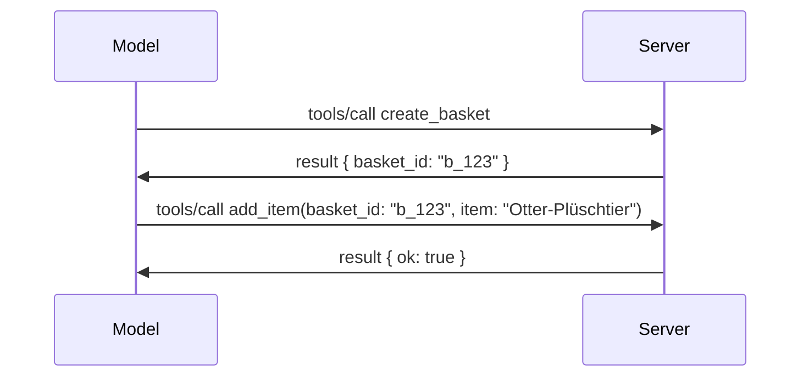

# Was sich im MCP ändert: Der Release Candidate vom 28.07.2026

> **Status:** Release Candidate. Die Spezifikation `2026-07-28` ist zum Zeitpunkt des Schreibens noch nicht final. Sie wurde am 21. Mai 2026 angekündigt und soll am 28. Juli 2026 veröffentlicht werden. Alles in dieser Lektion beschreibt den Release Candidate; prüfen Sie die [Entwurfsspezifikation](https://modelcontextprotocol.io/specification/draft) und deren [Changelog](https://modelcontextprotocol.io/specification/draft/changelog) für den aktuellsten Stand, bevor Sie darauf aufbauen. Der Rest dieses Curriculums ist auf der aktuellen stabilen Version **MCP Specification 2025-11-25** geschrieben und wird aktualisiert, sobald `2026-07-28` veröffentlicht wird.

## Überblick

`2026-07-28` ist die größte Überarbeitung von MCP seit dessen Start. Sechs Spezifikationsverbesserungsvorschläge (SEPs) entfernen Protokoll-Ebenen-Sitzungen und machen MCP auf der Transportschicht zustandslos, Erweiterungen werden zu einem erstklassigen, versionierten Mechanismus und mehrere Funktionen, die Sie bereits in diesem Curriculum gelernt haben (Roots, Sampling, Logging), werden unter einer neuen Lifecycle-Policy als veraltet gekennzeichnet. Diese Lektion fasst zusammen, was sich ändert, warum es wichtig ist und was das für den Code bedeutet, den Sie bereits gegen `2025-11-25` geschrieben haben.

Quelle: [Der MCP-Spezifikations-Release Candidate 28.07.2026](https://blog.modelcontextprotocol.io/posts/2026-07-28-release-candidate/) (Model Context Protocol Blog, David Soria Parra und Den Delimarsky).

## Lernziele

Am Ende dieser Lektion werden Sie in der Lage sein:

- Erklären, warum MCP zu einem zustandslosen Protokollkern wechselt und welches Problem das bei horizontal skalierten Deployments löst.
- Beschreiben, wie der `initialize`/`initialized`-Handshake und der `Mcp-Session-Id`-Header ersetzt werden.
- Die neuen Header `Mcp-Method` und `Mcp-Name` und die Caching-Metadaten `ttlMs`/`cacheScope` identifizieren.
- Das Extensions-Framework und die zwei mit dieser Version ausgelieferten Erweiterungen MCP Apps und Tasks erkennen.
- Die sechs Autorisierungs-SEPs aufzählen, die die Übereinstimmung mit OAuth 2.0 / OIDC verstärken.
- Identifizieren, welche Kernfunktionen (Roots, Sampling, Logging) jetzt veraltet sind und was das in der Praxis bedeutet.
- Die Änderung auf JSON Schema 2020-12 für Tool-`inputSchema`/`outputSchema` erklären.

## Ein zustandsloses Protokoll

Die wichtigste Änderung: MCP wird auf Protokollebene zustandslos.

### Vorher (2025-11-25): Sitzungen binden an eine Server-Instanz

Ein Tool-Aufruf über Streamable HTTP beginnt mit einem `initialize`-Handshake. Der Server antwortet mit einem `Mcp-Session-Id`-Header, den jede nachfolgende Anfrage tragen muss:

```http
POST /mcp HTTP/1.1
Mcp-Session-Id: 1868a90c-3a3f-4f5b
Content-Type: application/json

{"jsonrpc":"2.0","id":2,"method":"tools/call",
 "params":{"name":"search","arguments":{"q":"otters"}}}
```

Da die Sitzung an die jeweilige Server-Instanz gebunden ist, die sie ausgestellt hat, benötigen horizontal skalierte Deployments eine **Sticky-Routing** beim Load Balancer sowie einen **gemeinsamen Sitzungsspeicher** über die Instanzen hinweg.

### Danach (2026-07-28): Jede Anfrage ist in sich abgeschlossen

```http
POST /mcp HTTP/1.1
MCP-Protocol-Version: 2026-07-28
Mcp-Method: tools/call
Mcp-Name: search
Content-Type: application/json

{"jsonrpc":"2.0","id":1,"method":"tools/call",
 "params":{"name":"search","arguments":{"q":"otters"},
           "_meta":{"io.modelcontextprotocol/clientInfo":{"name":"my-app","version":"1.0"}}}}
```

Jede Server-Instanz kann diese Anfrage bearbeiten. Wichtige Änderungen:

- **Der `initialize`/`initialized`-Handshake wird entfernt** ([SEP-2575](https://github.com/modelcontextprotocol/modelcontextprotocol/pull/2575)). Protokollversion, Client-Informationen und Client-Fähigkeiten werden in `_meta` bei jeder Anfrage mitgeschickt. Eine neue Methode `server/discover` erlaubt es dem Client, Server-Fähigkeiten im Voraus abzurufen, wenn diese benötigt werden.
- **Der `Mcp-Session-Id`-Header und die Protokoll-Ebenen-Sitzung werden entfernt** ([SEP-2567](https://github.com/modelcontextprotocol/modelcontextprotocol/pull/2567)). Sticky-Routing und gemeinsame Sitzungsspeicher sind auf Protokollebene nicht mehr nötig.

### Zustandsloses Protokoll, zustandsbehaftete Anwendungen

Das Entfernen der Protokoll-Ebenen-Sitzung bedeutet nicht, dass Ihr Server keinen Zustand halten kann. Das empfohlene Muster ist dasselbe, das HTTP-APIs seit jeher verwenden: aus einem Tool-Call einen expliziten Handle (z.B. eine `basket_id`, eine `browser_id`) erstellen, und das Modell übergibt diesen Handle als gewöhnlichen Parameter bei späteren Aufrufen zurück.



Dadurch wird der Zustand für das Modell sichtbar und vernünftig, anstatt ihn in Transport-Metadaten zu verstecken, und es kann jede Server-Instanz jeden Aufruf bearbeiten.

### Server-zu-Client-Anfragen, umstrukturiert

Ein zustandsloses Protokoll benötigt dennoch eine Möglichkeit, dass der Server mitten im Anruf den Client etwas fragt (zum Beispiel eine Aufforderung):

- **Server-initiierten Anfragen dürfen nur während der aktiven Bearbeitung einer Client-Anfrage erfolgen** ([SEP-2260](https://github.com/modelcontextprotocol/modelcontextprotocol/pull/2260)) — dies war zuvor eine Empfehlung, ist jetzt verpflichtend. Ein Benutzer wird nie ohne ersichtlichen Grund aufgefordert.
- **Multi Round-Trip Requests** ([SEP-2322](https://github.com/modelcontextprotocol/modelcontextprotocol/pull/2322)) ersetzen das Offenhalten eines SSE-Streams. Stattdessen gibt der Server ein `InputRequiredResult` zurück:

  ```json
  {
    "resultType": "inputRequired",
    "inputRequests": {
      "confirm": {
        "type": "elicitation",
        "message": "Delete 3 files?",
        "schema": { "type": "boolean" }
      }
    },
    "requestState": "eyJzdGVwIjoxLCJmaWxlcyI6WyJhIiwiYiIsImMiXX0="
  }
  ```

  Der Client sammelt die Antworten und ruft den ursprünglichen Aufruf mit `inputResponses` plus dem zurückgegebenen `requestState` erneut auf. Jede Server-Instanz kann den Wiederholungsversuch bearbeiten, da alle nötigen Informationen im Payload enthalten sind.

### Routbar, zwischenspeicherbar, nachverfolgbar

Drei kleinere Änderungen erleichtern das Betreiben von zustandslosem Traffic:

- **`Mcp-Method`- und `Mcp-Name`-Header sind bei Streamable HTTP erforderlich** ([SEP-2243](https://github.com/modelcontextprotocol/modelcontextprotocol/pull/2243)), damit Load Balancer, Gateways und Rate Limiter die Operation anhand der Header routen können, ohne den JSON-Body zu inspizieren. Server lehnen Anfragen ab, bei denen Header und Body nicht übereinstimmen.
- **`tools/list`- und Ressourcen-Leseergebnisse tragen `ttlMs` und `cacheScope`** ([SEP-2549](https://github.com/modelcontextprotocol/modelcontextprotocol/pull/2549)), modelliert nach HTTP `Cache-Control`. Clients wissen, wie lange ein Listen-Ergebnis frisch ist und ob es sicher ist, es zwischen Benutzern zu teilen, ohne einen langlebigen SSE-Stream zu benötigen, um Änderungen zu erfahren.
- **W3C Trace Context-Verbreitung in `_meta` wird dokumentiert** ([SEP-414](https://github.com/modelcontextprotocol/modelcontextprotocol/pull/414)), wodurch die Schlüsselnamen `traceparent`, `tracestate` und `baggage` fixiert werden, sodass eine verteilte Tracing-Aufzeichnung einen Aufruf über die Client-SDK, den MCP-Server und downstream Systeme in einem [OpenTelemetry](https://opentelemetry.io/)-kompatiblen Backend nachvollziehen kann.

## Erweiterungen werden erstklassig

Erweiterungen existierten informell in `2025-11-25`. [SEP-2133](https://github.com/modelcontextprotocol/modelcontextprotocol/pull/2133) formalisiert sie:

- Erweiterungen werden durch Reverse-DNS-IDs identifiziert.
- Sie werden durch eine `extensions`-Map in Client- und Server-Fähigkeiten verhandelt.
- Sie leben in eigenen `ext-*`-Repositorien mit delegierten Betreuern und versionieren unabhängig von der Kern-Spezifikation.
- Ein neuer Extensions-Track im SEP-Prozess gibt ihnen einen Weg vom Experimentellen bis zum Offiziellen.

Diese Version bringt zwei offizielle Erweiterungen heraus.

### MCP Apps: serverseitig gerenderte Benutzeroberflächen

[MCP Apps](https://blog.modelcontextprotocol.io/posts/2026-01-26-mcp-apps/) ([SEP-1865](https://github.com/modelcontextprotocol/modelcontextprotocol/pull/1865)) erlaubt Servern, interaktive HTML-Oberflächen bereitzustellen, die Hosts in einem sandboxed iframe rendern. Tools deklarieren ihre UI-Vorlagen vorab, sodass Hosts sie vorab laden, cachen und einer Sicherheitsüberprüfung unterziehen können, bevor etwas ausgeführt wird. Die Grundlagen hierzu haben Sie bereits in [Lektionen 15: MCP Apps](../03-GettingStarted/15-mcp-apps/README.md) behandelt — unter dem Erweiterungs-Framework ist MCP Apps jetzt formal eine Erweiterung und keine experimentelle Kernfunktion mehr.

### Tasks wird eine Erweiterung

Tasks wurden als experimentelle Kernfunktion in `2025-11-25` ausgeliefert. Die Nutzung in Produktionsumgebungen zeigte genug Umgestaltungsbedarf, dass der passende Platz eine Erweiterung ist: die [Tasks-Erweiterung](https://github.com/modelcontextprotocol/modelcontextprotocol/pull/2663) formt den Lebenszyklus um das zustandslose Modell — ein Server kann `tools/call` mit einem Task-Handle beantworten, und der Client steuert diese mit `tasks/get`, `tasks/update` und `tasks/cancel`. Die Erstellung von Tasks ist servergesteuert: der Client gibt die Erweiterung an, und der Server entscheidet, wann ein Aufruf als Task ausgeführt werden soll. `tasks/list` wird komplett entfernt, da es ohne Sitzungen nicht sicher abgegrenzt werden kann.

> **Migrationshinweis:** Wenn Sie die experimentelle `2025-11-25` Tasks-API umgesetzt haben, müssen Sie auf den neuen Erweiterungslebenszyklus migrieren — dieser ist nicht abwärtskompatibel.

## Autorisierung wird gestärkt

Sechs SEPs stärken die [Autorisierungsspezifikation](https://modelcontextprotocol.io/specification/draft/basic/authorization), um eine engere Angleichung an reale OAuth 2.0 / OpenID Connect-Deployments zu gewährleisten:

| SEP | Änderung |
|---|---|
| [SEP-2468](https://github.com/modelcontextprotocol/modelcontextprotocol/pull/2468) | Clients müssen den Parameter `iss` bei Autorisierungsantworten gemäß [RFC 9207](https://www.rfc-editor.org/rfc/rfc9207) validieren, um Mix-up-Angriffe zu vermeiden, die im MCP-Prinzip „ein Client, viele Server“ häufig auftreten. Eine zukünftige Version wird die Ablehnung von Antworten ohne `iss` verlangen. |
| [SEP-837](https://github.com/modelcontextprotocol/modelcontextprotocol/pull/837) | Clients deklarieren ihren OpenID Connect `application_type` während der dynamischen Client-Registrierung, um zu verhindern, dass Autorisierungsserver Desktop/CLI-Clients standardmäßig als `"web"` behandeln und deren localhost-Redirect-URI ablehnen. |
| [SEP-2352](https://github.com/modelcontextprotocol/modelcontextprotocol/pull/2352) | Clients binden registrierte Zugangsdaten an den `issuer` des ausstellenden Autorisierungsservers und registrieren sie neu, wenn eine Ressource zwischen Autorisierungsservern migriert. |
| [SEP-2207](https://github.com/modelcontextprotocol/modelcontextprotocol/pull/2207) | Dokumentiert, wie Refresh Tokens von OpenID Connect-ähnlichen Autorisierungsservern angefordert werden. |
| [SEP-2350](https://github.com/modelcontextprotocol/modelcontextprotocol/pull/2350) | Erläutert die Kumulation von Scopes während einer Step-Up-Autorisierung. |
| [SEP-2351](https://github.com/modelcontextprotocol/modelcontextprotocol/pull/2351) | Erläutert das `.well-known` Discovery-Suffix. |

Wenn Sie heute einen Autorisierungsserver für MCP erstellen, liefern Sie jetzt schon `iss` bei Autorisierungsantworten aus — siehe [02-Security](../02-Security/README.md) für die aktuellen Autorisierungsrichtlinien, auf denen das aufbaut.

## Roots, Sampling und Logging sind veraltet

Unter der neuen [Feature Lifecycle Policy](https://github.com/modelcontextprotocol/modelcontextprotocol/pull/2577) ([SEP-2577](https://github.com/modelcontextprotocol/modelcontextprotocol/pull/2577)) erhalten drei Kern-Client-Primitiven, die Sie in [Core Concepts](./README.md#roots) gelernt haben, den Status **Veraltet**:

| Funktion | Empfohlenes Ersatzverfahren |
|---|---|
| Roots | Werkzeugparameter, Ressourcen-URIs oder Serverkonfiguration |
| Sampling | Direkte Integration mit LLM-Provider-APIs |
| Logging | `stderr` für stdio-Transporte; OpenTelemetry für strukturierte Observability |

Dies sind **nur Annotationen zur Veraltung**: die Methoden, Typen und Fähigkeitsflags funktionieren weiterhin in dieser Version und in jeder Spezifikationsversion, die innerhalb eines Jahres nach dieser veröffentlicht wird. Das vollständige Entfernen erfordert eine separate SEP gemäß Lifecycle-Policy — Ihre bestehenden [Sampling](../03-GettingStarted/14-sampling/README.md)-Beispiele funktionieren also weiterhin, neue Server sollten aber die obigen Ersatzmuster bevorzugen.

## Vollständiges JSON Schema 2020-12 für Tools

Tool-`inputSchema` und `outputSchema` sind auf das vollständige [JSON Schema 2020-12](https://json-schema.org/draft/2020-12) angehoben ([SEP-2106](https://github.com/modelcontextprotocol/modelcontextprotocol/pull/2106)):

- Eingabeschemata behalten die Root-Einschränkung `type: "object"` bei, erlauben aber nun Komposition (`oneOf`, `anyOf`, `allOf`), Bedingungen sowie Verweise (`$ref`, `$defs`).
- Ausgabeschemata sind unbegrenzt, und `structuredContent` kann jetzt jeden JSON-Wert statt nur eines Objekts beinhalten.
- Implementierungen dürfen externe `$ref`-URIs nicht automatisch auflösen und sollten Schema-Tiefe und Validierungszeit begrenzen (ein Denial-of-Service-Risiko, das bei serverseitiger Schema-Validierung zu bedenken ist).

Zusätzlich ändert sich der Fehlercode für fehlende Ressourcen von MCP-spezifisch `-32002` auf JSON-RPC-Standard `-32602` (Invalid Params) ([SEP-2164](https://github.com/modelcontextprotocol/modelcontextprotocol/pull/2164)). Wenn Ihr Client auf den Wert `-32002` prüft, müssen Sie ihn aktualisieren.

## Wie sich das Protokoll weiterentwickelt

Diese Version enthält Breaking Changes, die die MCP-Maintainer zukünftig nicht als Normalfall ansehen. Drei Governance-SEPs zielen darauf ab, Wiederholungen zu verhindern:

- Die **Feature Lifecycle Policy** gibt jeder Funktion einen Pfad Aktiv → Veraltet → Entfernt mit mindestens zwölf Monaten zwischen Veraltung und frühestmöglicher Entfernung.
- Das **Extensions-Framework** erlaubt neue Funktionen als opt-in Erweiterungen zu veröffentlichen und dort zu stabilisieren, bevor sie (falls überhaupt) in die Kern-Spezifikation wandern.

- Ein Standards Track SEP kann den Final-Status nicht mehr erreichen, bis ein passendes Szenario im [conformance suite](https://github.com/modelcontextprotocol/conformance) landet ([SEP-2484](https://github.com/modelcontextprotocol/modelcontextprotocol/pull/2484)) — dieselbe Suite, mit der das [SDK tier system](https://github.com/modelcontextprotocol/modelcontextprotocol/pull/1777) offizielle SDKs bewertet.

## Veröffentlichungszeitplan und Validierung

- Der Release Candidate wurde am 21. Mai 2026 eingefroren.
- Die endgültige Spezifikation ist für den 28. Juli 2026 geplant.
- Das zehnwöchige Zeitfenster dazwischen ermöglicht es SDK-Pflegepersonen und Client-Implementierern, die Änderungen anhand realer Workloads zu validieren; Tier-1-SDKs sollen im Rahmen des [SDK tier system](https://modelcontextprotocol.io/docs/sdk) innerhalb dieses Zeitfensters Unterstützung bereitstellen.
- Verfolge die komplette Änderungshistorie in der [Entwurfsspezifikation](https://modelcontextprotocol.io/specification/draft) und deren [Changelog](https://modelcontextprotocol.io/specification/draft/changelog).

## Was das für diesen Lehrplan bedeutet

Alles, was du bisher in diesem Kurs gelernt hast, zielt auf **2025-11-25** ab, was bis zum Erscheinen von `2026-07-28` die aktuelle stabile Spezifikation bleibt. Konkret bedeutet das:

- **Sessions und der `initialize` Handshake** (behandelt in [Core Concepts](./README.md) und [Lesson 6: HTTP Streaming](../03-GettingStarted/06-http-streaming/README.md)) funktionieren weiterhin wie heute dokumentiert, aber erwarte, dass sie durch das oben beschriebene stateless Request-Modell ersetzt werden, sobald du auf `2026-07-28`-kompatible SDKs aktualisierst.
- **Sampling und Roots** (ebenfalls in [Core Concepts](./README.md) behandelt) bleiben vollständig funktionsfähig, sind aber veraltet — neue Designs sollten die oben genannten Ersatzmuster bevorzugen.
- **Das experimentelle Tasks-Feature**, falls du es verwendet hast, muss auf den neuen Lebenszyklus der Tasks-Erweiterung migriert werden.
- **MCP Apps** ([Lesson 15](../03-GettingStarted/15-mcp-apps/README.md)) sind in der Praxis nicht betroffen; sie werden einfach unter das formale Erweiterungsframework eingeordnet.

## Zusätzliche Ressourcen

- [Der 2026-07-28 MCP Spezifikations-Release Candidate (Blogpost)](https://blog.modelcontextprotocol.io/posts/2026-07-28-release-candidate/)
- [Die Zukunft der MCP Transports](https://blog.modelcontextprotocol.io/posts/2025-12-19-mcp-transport-future/)
- [MCP Entwurfsspezifikation](https://modelcontextprotocol.io/specification/draft)
- [MCP Entwurfs-Changelog](https://modelcontextprotocol.io/specification/draft/changelog)
- [SEP Richtlinien](https://modelcontextprotocol.io/community/sep-guidelines)
- [MCP SDK Tier System](https://modelcontextprotocol.io/docs/sdk)

## Nächste Schritte

Kehre zurück zu [Core Concepts](./README.md) oder fahre fort mit [Security](../02-Security/README.md), um zu sehen, wie die heutige `2025-11-25`-Anleitung sich auf das Kommende überträgt.

---

<!-- CO-OP TRANSLATOR DISCLAIMER START -->
**Haftungsausschluss**:
Dieses Dokument wurde mit dem KI-Übersetzungsdienst [Co-op Translator](https://github.com/Azure/co-op-translator) übersetzt. Obwohl wir uns um Genauigkeit bemühen, beachten Sie bitte, dass automatisierte Übersetzungen Fehler oder Ungenauigkeiten enthalten können. Das Originaldokument in seiner Ursprungssprache gilt als maßgebliche Quelle. Bei kritischen Informationen wird eine professionelle menschliche Übersetzung empfohlen. Wir übernehmen keine Haftung für Missverständnisse oder Fehlinterpretationen, die aus der Verwendung dieser Übersetzung entstehen.
<!-- CO-OP TRANSLATOR DISCLAIMER END -->