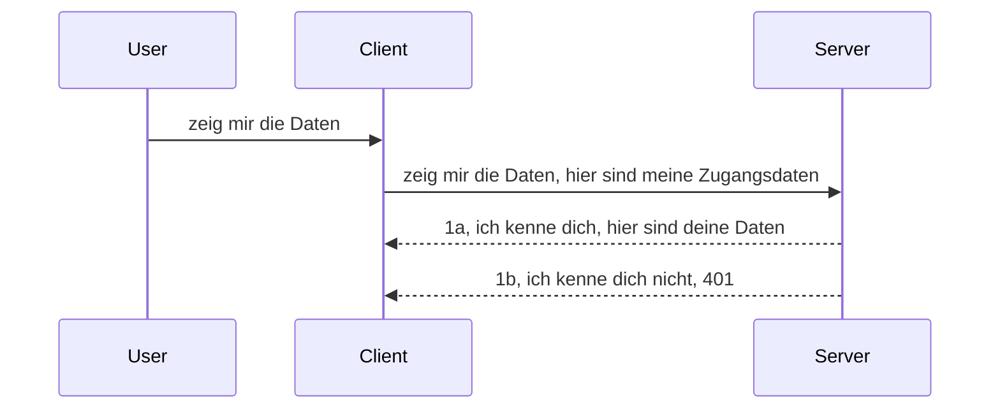

# Einfache Authentifizierung

Die MCP SDKs unterstützen die Verwendung von OAuth 2.1, was ehrlich gesagt ein ziemlich komplexer Prozess ist, der Konzepte wie Authentifizierungsserver, Ressourcenserver, das Übermitteln von Zugangsdaten, das Erhalten eines Codes, den Austausch des Codes gegen ein Bearer-Token bis hin zum Zugriff auf die Ressourcendaten umfasst. Wenn Sie mit OAuth nicht vertraut sind, was eine großartige Sache zum Implementieren ist, ist es eine gute Idee, mit einer grundlegenden Authentifizierung zu beginnen und sich zu immer besserer Sicherheit vorzuarbeiten. Deshalb gibt es dieses Kapitel, um Sie zu einer fortgeschritteneren Authentifizierung aufzubauen.

## Authentifizierung, was meinen wir damit?

Auth steht für Authentifizierung und Autorisierung. Die Idee ist, dass wir zwei Dinge tun müssen:

- **Authentifizierung**, den Prozess herauszufinden, ob wir einer Person erlauben, unser Haus zu betreten, dass sie das Recht hat "hier" zu sein, also Zugang zu unserem Ressourcenserver zu haben, auf dem unsere MCP Server-Funktionalitäten laufen.
- **Autorisierung**, den Prozess herauszufinden, ob ein Benutzer Zugriff auf diese spezifischen Ressourcen haben sollte, die er anfragt, zum Beispiel diese Bestellungen oder diese Produkte oder ob er nur lesen, aber nicht löschen darf, als ein weiteres Beispiel.

## Zugangsdaten: wie wir dem System sagen, wer wir sind

Nun, die meisten Webentwickler denken normalerweise daran, dem Server Zugangsdaten zu übermitteln, in der Regel ein Geheimnis, das angibt, ob sie hier "Authentifizierung" erlaubt sind. Diese Zugangsdaten sind üblicherweise eine base64-kodierte Version von Benutzername und Passwort oder ein API-Schlüssel, der einen bestimmten Benutzer eindeutig identifiziert.

Dies bedeutet, die Zugangsdaten per Header namens "Authorization" so zu senden:

```json
{ "Authorization": "secret123" }
```

Dies wird üblicherweise als Basis-Authentifizierung bezeichnet. Der Ablauf funktioniert dann wie folgt:



Jetzt, da wir verstanden haben, wie das aus Ablaufsicht funktioniert, wie setzen wir es um? Nun, die meisten Webserver verfügen über ein Konzept namens Middleware, ein Codeabschnitt, der als Teil der Anfrage ausgeführt wird und Zugangsdaten verifizieren kann und wenn die Zugangsdaten gültig sind, die Anfrage durchlässt. Wenn die Anfrage keine gültigen Zugangsdaten enthält, erhalten Sie einen Authentifizierungsfehler. Mal sehen, wie dies implementiert werden kann:

**Python**

```python
class AuthMiddleware(BaseHTTPMiddleware):
    async def dispatch(self, request, call_next):

        has_header = request.headers.get("Authorization")
        if not has_header:
            print("-> Missing Authorization header!")
            return Response(status_code=401, content="Unauthorized")

        if not valid_token(has_header):
            print("-> Invalid token!")
            return Response(status_code=403, content="Forbidden")

        print("Valid token, proceeding...")
       
        response = await call_next(request)
        # Fügen Sie beliebige Kunden-Header hinzu oder ändern Sie die Antwort auf irgendeine Weise
        return response


starlette_app.add_middleware(CustomHeaderMiddleware)
```

Hier haben wir:

- Eine Middleware namens `AuthMiddleware` erstellt, deren `dispatch`-Methode vom Webserver aufgerufen wird.
- Die Middleware dem Webserver hinzugefügt:

    ```python
    starlette_app.add_middleware(AuthMiddleware)
    ```

- Validierungslogik geschrieben, die prüft, ob der Authorization-Header vorhanden ist und ob das gesendete Geheimnis gültig ist:

    ```python
    has_header = request.headers.get("Authorization")
    if not has_header:
        print("-> Missing Authorization header!")
        return Response(status_code=401, content="Unauthorized")

    if not valid_token(has_header):
        print("-> Invalid token!")
        return Response(status_code=403, content="Forbidden")
    ```

    wenn das Geheimnis vorhanden und gültig ist, lassen wir die Anfrage durch, indem wir `call_next` aufrufen und die Antwort zurückgeben.

    ```python
    response = await call_next(request)
    # Fügen Sie beliebige Kunden-Header hinzu oder ändern Sie die Antwort auf irgendeine Weise
    return response
    ```

So funktioniert es: Wenn eine Webanfrage an den Server gerichtet wird, wird die Middleware aufgerufen und je nach Implementierung lässt sie die Anfrage durch oder gibt einen Fehler zurück, der darauf hinweist, dass der Client nicht berechtigt ist fortzufahren.

**TypeScript**

Hier erstellen wir eine Middleware mit dem populären Framework Express und fangen die Anfrage ab, bevor sie den MCP Server erreicht. Hier ist der Code dafür:

```typescript
function isValid(secret) {
    return secret === "secret123";
}

app.use((req, res, next) => {
    // 1. Autorisierungs-Header vorhanden?
    if(!req.headers["Authorization"]) {
        res.status(401).send('Unauthorized');
    }
    
    let token = req.headers["Authorization"];

    // 2. Gültigkeit prüfen.
    if(!isValid(token)) {
        res.status(403).send('Forbidden');
    }

   
    console.log('Middleware executed');
    // 3. Leitet die Anfrage an den nächsten Schritt in der Anforderungspipeline weiter.
    next();
});
```

In diesem Code:

1. Prüfen wir zuerst, ob der Authorization-Header überhaupt vorhanden ist; wenn nicht, senden wir einen 401-Fehler.
2. Stellen wir sicher, dass die Zugangsdaten/Token gültig sind; wenn nicht, senden wir einen 403-Fehler.
3. Schließlich geben wir die Anfrage in der Anfragkette weiter und senden die angefragte Ressource zurück.

## Übung: Implementiere Authentifizierung

Nutzen wir unser Wissen und versuchen wir es zu implementieren. Hier der Plan:

Server

- Erstelle einen Webserver und eine MCP Instanz.
- Implementiere eine Middleware für den Server.

Client

- Sende eine Webanfrage mit Zugangsdaten im Header.

### -1- Erstelle einen Webserver und eine MCP Instanz

> **Ausblick:** Das untenstehende TypeScript-Beispiel verfolgt HTTP-Transporte in einer `transports` Map, die nach `mcp-session-id` indiziert ist, gemäß **MCP Spezifikation 2025-11-25**. Die Veröffentlichungskandidatin `2026-07-28` entfernt den `initialize` Handshake und die Session-ID vollständig, sodass diese pro Sitzung verwaltete Transportmap durch zustandslose, selbstenthaltende Anfragen ersetzt wird. Siehe [Was ändert sich bei MCP: Der Release-Kandidat 2026-07-28](../../01-CoreConcepts/mcp-2026-07-28-release-candidate.md).

Im ersten Schritt müssen wir die Webserver-Instanz und den MCP Server erstellen.

**Python**

Hier erstellen wir eine MCP Server-Instanz, eine starlette Webanwendung und hosten sie mit uvicorn.

```python
# Erstellen des MCP-Servers

app = FastMCP(
    name="MCP Resource Server",
    instructions="Resource Server that validates tokens via Authorization Server introspection",
    host=settings["host"],
    port=settings["port"],
    debug=True
)

# Erstellen der Starlette-Webanwendung
starlette_app = app.streamable_http_app()

# Bereitstellung der App über Uvicorn
async def run(starlette_app):
    import uvicorn
    config = uvicorn.Config(
            starlette_app,
            host=app.settings.host,
            port=app.settings.port,
            log_level=app.settings.log_level.lower(),
        )
    server = uvicorn.Server(config)
    await server.serve()

run(starlette_app)
```

In diesem Code:

- Erstellen wir den MCP Server.
- Konstruieren die starlette Web-App vom MCP Server, `app.streamable_http_app()`.
- Hosten und bedienen die Web-App mit uvicorn `server.serve()`.

**TypeScript**

Hier erstellen wir eine MCP Server-Instanz.

```typescript
const server = new McpServer({
      name: "example-server",
      version: "1.0.0"
    });

    // ... Serverressourcen, Werkzeuge und Eingabeaufforderungen einrichten ...
```

Diese MCP Server-Erstellung muss innerhalb unserer POST /mcp Routen-Definition erfolgen, also nehmen wir den obigen Code und verschieben ihn so:

```typescript
import express from "express";
import { randomUUID } from "node:crypto";
import { McpServer } from "@modelcontextprotocol/sdk/server/mcp.js";
import { StreamableHTTPServerTransport } from "@modelcontextprotocol/sdk/server/streamableHttp.js";
import { isInitializeRequest } from "@modelcontextprotocol/sdk/types.js"

const app = express();
app.use(express.json());

// Karte zur Speicherung von Transporten nach Sitzungs-ID
const transports: { [sessionId: string]: StreamableHTTPServerTransport } = {};

// Bearbeiten von POST-Anfragen für die Client-Server-Kommunikation
app.post('/mcp', async (req, res) => {
  // Überprüfen auf bestehende Sitzungs-ID
  const sessionId = req.headers['mcp-session-id'] as string | undefined;
  let transport: StreamableHTTPServerTransport;

  if (sessionId && transports[sessionId]) {
    // Bestehenden Transport wiederverwenden
    transport = transports[sessionId];
  } else if (!sessionId && isInitializeRequest(req.body)) {
    // Neue Initialisierungsanfrage
    transport = new StreamableHTTPServerTransport({
      sessionIdGenerator: () => randomUUID(),
      onsessioninitialized: (sessionId) => {
        // Transport nach Sitzungs-ID speichern
        transports[sessionId] = transport;
      },
      // DNS-Rebinding-Schutz ist standardmäßig aus Gründen der Abwärtskompatibilität deaktiviert. Wenn Sie diesen Server
      // lokal ausführen, stellen Sie sicher, dass Sie Folgendes setzen:
      // enableDnsRebindingProtection: true,
      // allowedHosts: ['127.0.0.1'],
    });

    // Transport beim Schließen bereinigen
    transport.onclose = () => {
      if (transport.sessionId) {
        delete transports[transport.sessionId];
      }
    };
    const server = new McpServer({
      name: "example-server",
      version: "1.0.0"
    });

    // ... Serverressourcen, Werkzeuge und Eingabeaufforderungen einrichten ...

    // Verbindung zum MCP-Server herstellen
    await server.connect(transport);
  } else {
    // Ungültige Anfrage
    res.status(400).json({
      jsonrpc: '2.0',
      error: {
        code: -32000,
        message: 'Bad Request: No valid session ID provided',
      },
      id: null,
    });
    return;
  }

  // Anfrage bearbeiten
  await transport.handleRequest(req, res, req.body);
});

// Wiederverwendbarer Handler für GET- und DELETE-Anfragen
const handleSessionRequest = async (req: express.Request, res: express.Response) => {
  const sessionId = req.headers['mcp-session-id'] as string | undefined;
  if (!sessionId || !transports[sessionId]) {
    res.status(400).send('Invalid or missing session ID');
    return;
  }
  
  const transport = transports[sessionId];
  await transport.handleRequest(req, res);
};

// Bearbeiten von GET-Anfragen für Server-zu-Client-Benachrichtigungen über SSE
app.get('/mcp', handleSessionRequest);

// Bearbeiten von DELETE-Anfragen zur Beendigung der Sitzung
app.delete('/mcp', handleSessionRequest);

app.listen(3000);
```

Jetzt sehen Sie, wie die MCP Server-Erstellung in `app.post("/mcp")` verschoben wurde.

Fahren wir mit dem nächsten Schritt fort, der Middleware, damit wir die eingehenden Zugangsdaten prüfen können.

### -2- Implementiere eine Middleware für den Server

Kommen wir zum Middleware-Teil. Hier erstellen wir eine Middleware, die nach Zugangsdaten im `Authorization`-Header sucht und diese validiert. Wenn sie akzeptabel sind, wird die Anfrage fortgesetzt, um das auszuführen, was erforderlich ist (z.B. Werkzeuge auflisten, eine Ressource lesen oder welche MCP-Funktionalität der Client gerade anfragt).

**Python**

Um die Middleware zu erstellen, müssen wir eine Klasse anlegen, die von `BaseHTTPMiddleware` erbt. Es gibt zwei interessante Teile:

- Die Anfrage `request`, von der wir die Header-Informationen lesen.
- `call_next`, den Callback, den wir aufrufen müssen, wenn der Client gültige Zugangsdaten mitgebracht hat.

Zuerst müssen wir den Fall behandeln, dass der `Authorization`-Header fehlt:

```python
has_header = request.headers.get("Authorization")

# Kein Header vorhanden, mit 401 fehlschlagen, andernfalls fortfahren.
if not has_header:
    print("-> Missing Authorization header!")
    return Response(status_code=401, content="Unauthorized")
```

Hier senden wir eine 401 Unauthorized Nachricht, da die Authentifizierung des Clients fehlschlägt.

Weiter prüfen wir, falls Zugangsdaten übermittelt wurden, deren Gültigkeit so:

```python
 if not valid_token(has_header):
    print("-> Invalid token!")
    return Response(status_code=403, content="Forbidden")
```

Beachten Sie, dass wir oben eine 403 Forbidden Nachricht senden. Unten sehen Sie die vollständige Middleware, die alles umsetzt, was wir bisher erwähnt haben:

```python
class AuthMiddleware(BaseHTTPMiddleware):
    async def dispatch(self, request, call_next):

        has_header = request.headers.get("Authorization")
        if not has_header:
            print("-> Missing Authorization header!")
            return Response(status_code=401, content="Unauthorized")

        if not valid_token(has_header):
            print("-> Invalid token!")
            return Response(status_code=403, content="Forbidden")

        print("Valid token, proceeding...")
        print(f"-> Received {request.method} {request.url}")
        response = await call_next(request)
        response.headers['Custom'] = 'Example'
        return response

```

Großartig, aber was ist mit der `valid_token` Funktion? Hier ist sie:

```python
# NICHT für die Produktion verwenden - verbessern Sie es !!
def valid_token(token: str) -> bool:
    # den Präfix "Bearer " entfernen
    if token.startswith("Bearer "):
        token = token[7:]
        return token == "secret-token"
    return False
```

Das sollte natürlich verbessert werden.

WICHTIG: Sie sollten NIEMALS solche Geheimnisse im Code haben. Idealerweise sollten Sie den Vergleichswert aus einer Datenquelle oder von einem IDP (Identity Service Provider) abrufen oder noch besser, den IDP die Validierung durchführen lassen.

**TypeScript**

Um dies mit Express zu implementieren, müssen wir die `use` Methode aufrufen, die Middleware-Funktionen akzeptiert.

Wir müssen:

- Mit der Anfragevariable interagieren, um die übermittelten Zugangsdaten in der `Authorization`-Eigenschaft zu prüfen.
- Die Zugangsdaten validieren, und wenn gültig, die Anfrage fortsetzen, damit die MCP Anfragen des Clients ausgeführt werden (z.B. Werkzeuge auflisten, Ressource lesen oder andere MCP-bezogene Aktionen).

Hier prüfen wir, ob der `Authorization`-Header vorhanden ist und falls nicht, stoppen wir die Anfrage:

```typescript
if(!req.headers["authorization"]) {
    res.status(401).send('Unauthorized');
    return;
}
```

Wenn der Header nicht gesendet wird, erhalten Sie eine 401.

Danach prüfen wir, ob die Zugangsdaten gültig sind, wenn nicht, stoppen wir die Anfrage erneut mit einer leicht anderen Nachricht:

```typescript
if(!isValid(token)) {
    res.status(403).send('Forbidden');
    return;
} 
```

Beachten Sie, dass Sie nun einen 403 Fehler erhalten.

Hier der vollständige Code:

```typescript
app.use((req, res, next) => {
    console.log('Request received:', req.method, req.url, req.headers);
    console.log('Headers:', req.headers["authorization"]);
    if(!req.headers["authorization"]) {
        res.status(401).send('Unauthorized');
        return;
    }
    
    let token = req.headers["authorization"];

    if(!isValid(token)) {
        res.status(403).send('Forbidden');
        return;
    }  

    console.log('Middleware executed');
    next();
});
```

Wir haben den Webserver so eingerichtet, dass eine Middleware die Zugangsdaten prüft, die der Client hoffentlich sendet. Wie sieht es mit dem Client selbst aus?

### -3- Sende Webanfrage mit Zugangsdaten im Header

Wir müssen sicherstellen, dass der Client die Zugangsdaten im Header übermittelt. Da wir einen MCP Client verwenden, müssen wir herausfinden, wie das gemacht wird.

**Python**

Für den Client müssen wir einen Header mit unseren Zugangsdaten wie folgt übergeben:

```python
# SCHREIBE den Wert nicht fest, sondern speichere ihn mindestens in einer Umgebungsvariable oder einem sichereren Speicher
token = "secret-token"

async with streamablehttp_client(
        url = f"http://localhost:{port}/mcp",
        headers = {"Authorization": f"Bearer {token}"}
    ) as (
        read_stream,
        write_stream,
        session_callback,
    ):
        async with ClientSession(
            read_stream,
            write_stream
        ) as session:
            await session.initialize()
      
            # TODO, was im Client gemacht werden soll, z. B. Werkzeuge auflisten, Werkzeuge aufrufen etc.
```

Beachten Sie, wie wir die `headers` Eigenschaft so befüllen: ` headers = {"Authorization": f"Bearer {token}"}`.

**TypeScript**

Wir können das in zwei Schritten lösen:

1. Ein Konfigurationsobjekt mit unseren Zugangsdaten befüllen.
2. Das Konfigurationsobjekt an den Transport übergeben.

```typescript

// VERMEIDE es, den Wert so wie hier gezeigt fest zu kodieren. Verwende mindestens eine Umgebungsvariable und etwas wie dotenv (im Entwicklermodus).
let token = "secret123"

// definiere ein Client-Transport-Optionsobjekt
let options: StreamableHTTPClientTransportOptions = {
  sessionId: sessionId,
  requestInit: {
    headers: {
      "Authorization": "secret123"
    }
  }
};

// übergib das Optionsobjekt an den Transport
async function main() {
   const transport = new StreamableHTTPClientTransport(
      new URL(serverUrl),
      options
   );
```

Hier sehen Sie oben, wie wir ein `options` Objekt erstellen mussten und unsere Header unter der Eigenschaft `requestInit` platzieren.

WICHTIG: Wie verbessern wir das von hier aus? Nun, die aktuelle Implementierung hat einige Probleme. Erstens ist das Übergeben von Zugangsdaten so riskant, wenn nicht mindestens HTTPS verwendet wird. Selbst dann können die Zugangsdaten gestohlen werden, deshalb braucht man ein System, bei dem man das Token leicht widerrufen kann und zusätzliche Kontrollen einbaut, z.B. woher auf der Welt es stammt, ob die Anfragen zu häufig sind (bot-ähnliches Verhalten), kurz gesagt, es gibt viele Bedenken.

Man muss allerdings sagen, dass dies für sehr einfache APIs, bei denen niemand die API ohne Authentifizierung aufrufen soll, ein guter Start ist.

Damit wollen wir die Sicherheit etwas härten, indem wir ein standardisiertes Format wie JSON Web Tokens verwenden, auch JWT oder "JOT" Tokens genannt.

## JSON Web Tokens, JWT

Also versuchen wir, die Dinge zu verbessern, indem wir einfache Zugangsdaten ersetzen. Welche unmittelbaren Verbesserungen erhalten wir durch die Einführung von JWT?

- **Sicherheitsverbesserungen**. Bei Basis-Authentifizierung sendet man Benutzername und Passwort als base64-kodierten Token (oder einen API-Schlüssel) immer wieder, was das Risiko erhöht. Mit JWT sendet man Benutzername und Passwort und erhält im Gegenzug ein Token, das auch zeitlich begrenzt ist und somit verfallen wird. JWT ermöglicht feingranulare Zugriffskontrolle über Rollen, Bereiche und Berechtigungen.
- **Zustandslosigkeit und Skalierbarkeit**. JWTs sind selbstenthaltend, sie tragen alle Benutzerinformationen und eliminieren die Notwendigkeit, serverseitige Sessions zu speichern. Tokens können auch lokal validiert werden.
- **Interoperabilität und Föderation**. JWTs sind zentral für OpenID Connect und werden bei bekannten Identitätsanbietern wie Entra ID, Google Identity und Auth0 genutzt. Sie ermöglichen auch Single Sign-On und vieles mehr, was sie enterprise-tauglich macht.
- **Modularität und Flexibilität**. JWTs können auch mit API-Gateways wie Azure API Management, NGINX und anderen verwendet werden. Sie unterstützen Authentifizierungsszenarien sowie Server-zu-Server-Kommunikation einschließlich Imitation und Delegation.
- **Leistung und Caching**. JWTs können nach dem Entschlüsseln zwischengespeichert werden, was den Bedarf an Parsing reduziert. Dies hilft besonders bei Apps mit hohem Traffic, da es den Durchsatz verbessert und die Last auf die Infrastruktur reduziert.
- **Erweiterte Features**. Es unterstützt auch Introspektion (Prüfung der Gültigkeit auf dem Server) und Widerruf (Macht ein Token ungültig).

Aufgrund all dieser Vorteile sehen wir uns an, wie wir die Implementierung auf die nächste Stufe heben können.

## Von Basis-Authentifizierung zu JWT

Die Änderungen, die wir grob vornehmen müssen sind:

- **Erlernen, einen JWT Token zu erzeugen**, der bereit ist, vom Client an den Server gesendet zu werden.
- **Einen JWT Token validieren**, und im Erfolgsfall dem Client Zugriff auf unsere Ressourcen geben.
- **Sichere Token-Speicherung**. Wie wir das Token speichern.
- **Die Routen schützen**. Wir müssen Routen und spezielle MCP Funktionen schützen.
- **Refresh Tokens hinzufügen**. Sicherstellen, dass wir kurzlebige Token erstellen, aber auch langlebige Refresh Token, mit denen neue Tokens erworben werden können, wenn diese ablaufen. Außerdem muss es einen Refresh-Endpunkt und eine Rotationsstrategie geben.

### -1- Erzeuge einen JWT Token

Ein JWT Token hat folgende Teile:

- **Header**, den verwendeten Algorithmus und Token-Typ.
- **Payload**, Ansprüche (claims), wie sub (die Nutzer- oder Entitäts-ID, die das Token repräsentiert. In einem Auth-Szenario typischerweise die User-ID), exp (wann es abläuft), role (die Rolle)
- **Signatur**, mit einem Geheimnis oder privaten Schlüssel signiert.

Dafür müssen wir Header, Payload und den kodierten Token erzeugen.

**Python**

```python

import jwt
import jwt
from jwt.exceptions import ExpiredSignatureError, InvalidTokenError
import datetime

# Geheimschlüssel zum Signieren des JWT
secret_key = 'your-secret-key'

header = {
    "alg": "HS256",
    "typ": "JWT"
}

# die Benutzerinformationen sowie deren Ansprüche und Ablaufzeit
payload = {
    "sub": "1234567890",               # Subjekt (Benutzer-ID)
    "name": "User Userson",                # Benutzerdefinierte Anspruch
    "admin": True,                     # Benutzerdefinierte Anspruch
    "iat": datetime.datetime.utcnow(),# Ausgestellt am
    "exp": datetime.datetime.utcnow() + datetime.timedelta(hours=1)  # Ablauf
}

# kodieren
encoded_jwt = jwt.encode(payload, secret_key, algorithm="HS256", headers=header)
```

Im obigen Code haben wir:

- Einen Header definiert, der HS256 als Algorithmus und JWT als Typ verwendet.
- Eine Payload konstruiert, die ein Subjekt bzw. Benutzer-ID, einen Benutzernamen, eine Rolle, wann das Token ausgestellt wurde und wann es abläuft enthält, womit wir den zeitlich begrenzten Aspekt implementieren.

**TypeScript**

Hier benötigen wir einige Abhängigkeiten, die uns beim Erzeugen des JWT Tokens helfen.

Abhängigkeiten

```sh

npm install jsonwebtoken
npm install --save-dev @types/jsonwebtoken
```

Jetzt, da wir das eingerichtet haben, erstellen wir Header, Payload und daraufhin den kodierten Token.

```typescript
import jwt from 'jsonwebtoken';

const secretKey = 'your-secret-key'; // Verwenden Sie Umgebungsvariablen in der Produktion

// Definieren Sie die Nutzlast
const payload = {
  sub: '1234567890',
  name: 'User usersson',
  admin: true,
  iat: Math.floor(Date.now() / 1000), // Ausgestellt um
  exp: Math.floor(Date.now() / 1000) + 60 * 60 // Läuft in 1 Stunde ab
};

// Definieren Sie den Header (optional, jsonwebtoken setzt Standardwerte)
const header = {
  alg: 'HS256',
  typ: 'JWT'
};

// Erstellen Sie das Token
const token = jwt.sign(payload, secretKey, {
  algorithm: 'HS256',
  header: header
});

console.log('JWT:', token);
```

Dieses Token ist:

Mit HS256 signiert
Eine Stunde gültig
Enthält Ansprüche wie sub, name, admin, iat und exp.

### -2- Token validieren

Wir müssen auch einen Token validieren, was auf dem Server erfolgen sollte, um sicherzustellen, dass das, was der Client sendet, tatsächlich gültig ist. Es gibt viele Prüfungen, z.B. Strukturvalidierung, Gültigkeit usw. Sie werden außerdem empfohlen, weitere Prüfungen vorzunehmen, z.B. ob der Benutzer in Ihrem System ist und mehr.

Um einen Token zu validieren, müssen wir ihn dekodieren, um ihn lesen zu können, und dann mit der Gültigkeitsprüfung beginnen:

**Python**

```python

# JWT dekodieren und verifizieren
try:
    decoded = jwt.decode(token, secret_key, algorithms=["HS256"])
    print("✅ Token is valid.")
    print("Decoded claims:")
    for key, value in decoded.items():
        print(f"  {key}: {value}")
except ExpiredSignatureError:
    print("❌ Token has expired.")
except InvalidTokenError as e:
    print(f"❌ Invalid token: {e}")

```


In diesem Code rufen wir `jwt.decode` mit dem Token, dem geheimen Schlüssel und dem gewählten Algorithmus als Eingabe auf. Beachten Sie, dass wir eine try-catch-Konstruktion verwenden, da eine fehlgeschlagene Validierung zu einem Fehler führt.

**TypeScript**

Hier müssen wir `jwt.verify` aufrufen, um eine dekodierte Version des Tokens zu erhalten, die wir weiter analysieren können. Wenn dieser Aufruf fehlschlägt, bedeutet das, dass die Struktur des Tokens falsch ist oder es nicht mehr gültig ist.

```typescript

try {
  const decoded = jwt.verify(token, secretKey);
  console.log('Decoded Payload:', decoded);
} catch (err) {
  console.error('Token verification failed:', err);
}
```

HINWEIS: Wie bereits erwähnt, sollten wir zusätzliche Überprüfungen durchführen, um sicherzustellen, dass dieses Token auf einen Benutzer in unserem System hinweist und dass der Benutzer die Rechte hat, die er angibt.

Als Nächstes schauen wir uns rollenbasierte Zugriffskontrolle an, auch bekannt als RBAC.

## Hinzufügen der rollenbasierten Zugriffskontrolle

Die Idee ist, dass wir zum Ausdruck bringen wollen, dass verschiedene Rollen unterschiedliche Berechtigungen haben. Zum Beispiel gehen wir davon aus, dass ein Admin alles tun kann, ein normaler Benutzer lesen/schreiben darf und ein Gast nur lesen darf. Hier sind daher einige mögliche Berechtigungsstufen:

- Admin.Write 
- User.Read
- Guest.Read

Schauen wir uns an, wie wir eine solche Kontrolle mit Middleware implementieren können. Middleware kann pro Route oder für alle Routen hinzugefügt werden.

**Python**

```python
from starlette.middleware.base import BaseHTTPMiddleware
from starlette.responses import JSONResponse
import jwt

# HABEN Sie das Geheimnis nicht im Code wie, dies dient nur zu Demonstrationszwecken. Lesen Sie es von einem sicheren Ort.
SECRET_KEY = "your-secret-key" # legen Sie dies in der Umgebungsvariable ab
REQUIRED_PERMISSION = "User.Read"

class JWTPermissionMiddleware(BaseHTTPMiddleware):
    async def dispatch(self, request, call_next):
        auth_header = request.headers.get("Authorization")
        if not auth_header or not auth_header.startswith("Bearer "):
            return JSONResponse({"error": "Missing or invalid Authorization header"}, status_code=401)

        token = auth_header.split(" ")[1]
        try:
            decoded = jwt.decode(token, SECRET_KEY, algorithms=["HS256"])
        except jwt.ExpiredSignatureError:
            return JSONResponse({"error": "Token expired"}, status_code=401)
        except jwt.InvalidTokenError:
            return JSONResponse({"error": "Invalid token"}, status_code=401)

        permissions = decoded.get("permissions", [])
        if REQUIRED_PERMISSION not in permissions:
            return JSONResponse({"error": "Permission denied"}, status_code=403)

        request.state.user = decoded
        return await call_next(request)


```

Es gibt verschiedene Möglichkeiten, die Middleware wie unten hinzuzufügen:

```python

# Alt 1: Middleware beim Erstellen der Starlette-App hinzufügen
middleware = [
    Middleware(JWTPermissionMiddleware)
]

app = Starlette(routes=routes, middleware=middleware)

# Alt 2: Middleware hinzufügen, nachdem die Starlette-App bereits erstellt wurde
starlette_app.add_middleware(JWTPermissionMiddleware)

# Alt 3: Middleware pro Route hinzufügen
routes = [
    Route(
        "/mcp",
        endpoint=..., # Handler
        middleware=[Middleware(JWTPermissionMiddleware)]
    )
]
```

**TypeScript**

Wir können `app.use` und eine Middleware verwenden, die für alle Anfragen ausgeführt wird.

```typescript
app.use((req, res, next) => {
    console.log('Request received:', req.method, req.url, req.headers);
    console.log('Headers:', req.headers["authorization"]);

    // 1. Überprüfen, ob der Autorisierungsheader gesendet wurde

    if(!req.headers["authorization"]) {
        res.status(401).send('Unauthorized');
        return;
    }
    
    let token = req.headers["authorization"];

    // 2. Überprüfen, ob das Token gültig ist
    if(!isValid(token)) {
        res.status(403).send('Forbidden');
        return;
    }  

    // 3. Überprüfen, ob der Token-Benutzer in unserem System existiert
    if(!isExistingUser(token)) {
        res.status(403).send('Forbidden');
        console.log("User does not exist");
        return;
    }
    console.log("User exists");

    // 4. Überprüfen, ob das Token die richtigen Berechtigungen hat
    if(!hasScopes(token, ["User.Read"])){
        res.status(403).send('Forbidden - insufficient scopes');
    }

    console.log("User has required scopes");

    console.log('Middleware executed');
    next();
});

```

Es gibt einige Dinge, die wir unsere Middleware machen lassen können und die unsere Middleware TUN SOLLTE, nämlich:

1. Überprüfen, ob der Autorisierungsheader vorhanden ist
2. Überprüfen, ob das Token gültig ist, wir rufen `isValid` auf, eine Methode, die wir geschrieben haben und die die Integrität und Gültigkeit des JWT-Tokens überprüft.
3. Verifizieren, dass der Benutzer in unserem System existiert, wir sollten das prüfen.

   ```typescript
    // Benutzer in der DB
   const users = [
     "user1",
     "User usersson",
   ]

   function isExistingUser(token) {
     let decodedToken = verifyToken(token);

     // TODO, überprüfen, ob der Benutzer in der DB existiert
     return users.includes(decodedToken?.name || "");
   }
   ```

   Oben haben wir eine sehr einfache `users`-Liste erstellt, die natürlich in einer Datenbank liegen sollte.

4. Zusätzlich sollten wir auch prüfen, ob das Token die richtigen Berechtigungen besitzt.

   ```typescript
   if(!hasScopes(token, ["User.Read"])){
        res.status(403).send('Forbidden - insufficient scopes');
   }
   ```

   In dem obigen Code der Middleware prüfen wir, ob das Token die Berechtigung User.Read enthält, andernfalls senden wir einen 403-Fehler. Unten ist die hilfsmethode `hasScopes`.

   ```typescript
   function hasScopes(scope: string, requiredScopes: string[]) {
     let decodedToken = verifyToken(scope);
    return requiredScopes.every(scope => decodedToken?.scopes.includes(scope));
  }
   ```

Have a think which additional checks you should be doing, but these are the absolute minimum of checks you should be doing.

Using Express as a web framework is a common choice. There are helpers library when you use JWT so you can write less code.

- `express-jwt`, helper library that provides a middleware that helps decode your token.
- `express-jwt-permissions`, this provides a middleware `guard` that helps check if a certain permission is on the token.

Here's what these libraries can look like when used:

```typescript
const express = require('express');
const jwt = require('express-jwt');
const guard = require('express-jwt-permissions')();

const app = express();
const secretKey = 'your-secret-key'; // put this in env variable

// Decode JWT and attach to req.user
app.use(jwt({ secret: secretKey, algorithms: ['HS256'] }));

// Check for User.Read permission
app.use(guard.check('User.Read'));

// multiple permissions
// app.use(guard.check(['User.Read', 'Admin.Access']));

app.get('/protected', (req, res) => {
  res.json({ message: `Welcome ${req.user.name}` });
});

// Error handler
app.use((err, req, res, next) => {
  if (err.code === 'permission_denied') {
    return res.status(403).send('Forbidden');
  }
  next(err);
});

```

Nun haben Sie gesehen, wie Middleware sowohl für Authentifizierung als auch für Autorisierung verwendet werden kann. Wie sieht es aber mit MCP aus, ändert es etwas bei der Authentifizierung? Finden wir es im nächsten Abschnitt heraus.

### -3- RBAC zu MCP hinzufügen

Sie haben bisher gesehen, wie Sie RBAC über Middleware hinzufügen können, aber für MCP gibt es keine einfache Möglichkeit, RBAC pro MCP-Feature hinzuzufügen. Was tun wir also? Nun, wir müssen einfach Code hinzufügen, der in diesem Fall überprüft, ob der Client die Rechte hat, ein bestimmtes Tool aufzurufen:

Sie haben verschiedene Möglichkeiten, wie Sie pro Feature RBAC umsetzen können, hier einige davon:

- Fügen Sie eine Überprüfung für jedes Tool, jede Ressource, jede Eingabeaufforderung hinzu, bei der Sie den Berechtigungsgrad überprüfen müssen.

   **python**

   ```python
   @tool()
   def delete_product(id: int):
      try:
          check_permissions(role="Admin.Write", request)
      catch:
        pass # Client-Authentifizierung fehlgeschlagen, Autorisierungsfehler auslösen
   ```

   **typescript**

   ```typescript
   server.registerTool(
    "delete-product",
    {
      title: Delete a product",
      description: "Deletes a product",
      inputSchema: { id: z.number() }
    },
    async ({ id }) => {
      
      try {
        checkPermissions("Admin.Write", request);
        // erledigen, ID an productService und entfernten Eintrag senden
      } catch(Exception e) {
        console.log("Authorization error, you're not allowed");  
      }

      return {
        content: [{ type: "text", text: `Deletected product with id ${id}` }]
      };
    }
   );
   ```


- Verwenden Sie einen fortschrittlichen Serveransatz und die Request-Handler, sodass Sie minimieren, an wie vielen Stellen Sie die Überprüfung durchführen müssen.

   **Python**

   ```python
   
   tool_permission = {
      "create_product": ["User.Write", "Admin.Write"],
      "delete_product": ["Admin.Write"]
   }

   def has_permission(user_permissions, required_permissions) -> bool:
      # user_permissions: Liste der Berechtigungen, die der Benutzer hat
      # required_permissions: Liste der für das Werkzeug erforderlichen Berechtigungen
      return any(perm in user_permissions for perm in required_permissions)

   @server.call_tool()
   async def handle_call_tool(
     name: str, arguments: dict[str, str] | None
   ) -> list[types.TextContent]:
    # Annahme: request.user.permissions ist eine Liste der Berechtigungen des Benutzers
     user_permissions = request.user.permissions
     required_permissions = tool_permission.get(name, [])
     if not has_permission(user_permissions, required_permissions):
        # Fehler auslösen "Sie haben keine Berechtigung, das Werkzeug {name} aufzurufen"
        raise Exception(f"You don't have permission to call tool {name}")
     # Fortfahren und Werkzeug aufrufen
     # ...
   ```   
   

   **TypeScript**

   ```typescript
   function hasPermission(userPermissions: string[], requiredPermissions: string[]): boolean {
       if (!Array.isArray(userPermissions) || !Array.isArray(requiredPermissions)) return false;
       // Gibt true zurück, wenn der Benutzer mindestens eine erforderliche Berechtigung hat
       
       return requiredPermissions.some(perm => userPermissions.includes(perm));
   }
  
   server.setRequestHandler(CallToolRequestSchema, async (request) => {
      const { params: { name } } = request;
  
      let permissions = request.user.permissions;
  
      if (!hasPermission(permissions, toolPermissions[name])) {
         return new Error(`You don't have permission to call ${name}`);
      }
  
      // Mach weiter..
   });
   ```

   Hinweis: Sie müssen sicherstellen, dass Ihre Middleware ein dekodiertes Token der user-Eigenschaft der Anfrage zuweist, damit der obige Code einfach gehalten werden kann.

### Zusammenfassung

Nun, da wir besprochen haben, wie man RBAC allgemein und speziell für MCP hinzufügt, ist es Zeit, die Sicherheit selbst zu implementieren, um sicherzustellen, dass Sie die vorgestellten Konzepte verstanden haben.

## Aufgabe 1: Erstellen Sie einen MCP-Server und MCP-Client mit einfacher Authentifizierung

Hier wenden Sie das Gelernte zum Senden von Anmeldedaten über Header an.

## Lösung 1

[Lösung 1](./code/basic/README.md)

## Aufgabe 2: Verbessern Sie die Lösung aus Aufgabe 1, um JWT zu verwenden

Nehmen Sie die erste Lösung, aber dieses Mal verbessern wir sie.

Anstatt Basic Auth zu verwenden, nutzen wir JWT.

## Lösung 2

[Lösung 2](./solution/jwt-solution/README.md)

## Herausforderung

Fügen Sie das RBAC pro Tool hinzu, das wir im Abschnitt "RBAC zu MCP hinzufügen" beschrieben haben.

## Zusammenfassung

Hoffentlich haben Sie in diesem Kapitel viel gelernt, von keiner Sicherheit über einfache Sicherheit bis hin zu JWT und wie es zu MCP hinzugefügt werden kann.

Wir haben eine solide Basis mit benutzerdefinierten JWTs geschaffen, aber mit wachsendem Umfang bewegen wir uns hin zu einem standardisierten Identitätsmodell. Die Einführung eines IdP wie Entra oder Keycloak erlaubt es uns, die Token-Ausstellung, Validierung und das Lebenszyklusmanagement einer vertrauenswürdigen Plattform zu überlassen — und uns so auf die App-Logik und das Benutzererlebnis zu konzentrieren.

Dafür haben wir ein ausführlicheres [Kapitel zu Entra](../../05-AdvancedTopics/mcp-security-entra/README.md)

## Was kommt als Nächstes

- Nächstes: [Einrichtung der MCP-Hosts](../12-mcp-hosts/README.md)

---

<!-- CO-OP TRANSLATOR DISCLAIMER START -->
**Haftungsausschluss**:
Dieses Dokument wurde mit dem KI-Übersetzungsdienst [Co-op Translator](https://github.com/Azure/co-op-translator) übersetzt. Obwohl wir uns um Genauigkeit bemühen, beachten Sie bitte, dass automatisierte Übersetzungen Fehler oder Ungenauigkeiten enthalten können. Das Originaldokument in seiner Ursprungssprache gilt als maßgebliche Quelle. Bei kritischen Informationen wird eine professionelle menschliche Übersetzung empfohlen. Wir übernehmen keine Haftung für Missverständnisse oder Fehlinterpretationen, die aus der Verwendung dieser Übersetzung entstehen.
<!-- CO-OP TRANSLATOR DISCLAIMER END -->