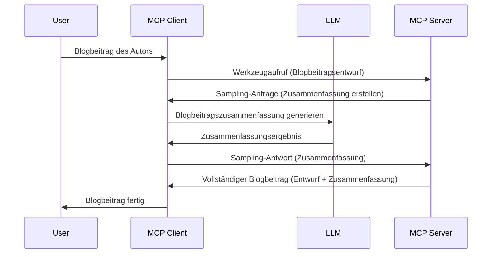

# Sampling – Funktionen an den Client delegieren

> **Veraltete Funktion:** Die MCP-Spezifikationsversion `2026-07-28` setzt Sampling zugunsten der direkten Integration mit LLM-Anbieter-APIs als veraltet. Sampling funktioniert weiterhin in `2025-11-25` und mindestens ein Jahr nach jeder formellen Veraltung, sodass alles in dieser Lektion gültig bleibt – neue Server-Designs sollten jedoch das Ersatzmuster evaluieren. Siehe [Was ändert sich in MCP: Die Version 2026-07-28 Release Candidate](../../01-CoreConcepts/mcp-2026-07-28-release-candidate.md).

Manchmal müssen MCP Client und MCP Server zusammenarbeiten, um ein gemeinsames Ziel zu erreichen. Es kann Fälle geben, in denen der Server die Hilfe eines LLM braucht, das auf dem Client läuft. Für diese Situation sollte Sampling verwendet werden.

Lassen Sie uns einige Anwendungsfälle erkunden und wie eine Lösung mit Sampling aufgebaut wird.

## Überblick

In dieser Lektion konzentrieren wir uns darauf zu erklären, wann und wo Sampling verwendet wird und wie es konfiguriert wird.

## Lernziele

In diesem Kapitel werden wir:

- Erklären, was Sampling ist und wann es verwendet wird.
- Zeigen, wie Sampling in MCP konfiguriert wird.
- Beispiele für Sampling in der Praxis geben.

## Was ist Sampling und warum es verwenden?

Sampling ist eine erweiterte Funktion, die wie folgt funktioniert:



### Sampling-Anfrage

Ok, jetzt wo wir einen groben Überblick über ein glaubwürdiges Szenario haben, sprechen wir über die Sampling-Anfrage, die der Server an den Client sendet. So könnte eine solche Anfrage im JSON-RPC-Format aussehen:

```json
{
  "jsonrpc": "2.0",
  "id": 1,
  "method": "sampling/createMessage",
  "params": {
    "messages": [
      {
        "role": "user",
        "content": {
          "type": "text",
          "text": "Create a blog post summary of the following blog post: <BLOG POST>"
        }
      }
    ],
    "modelPreferences": {
      "hints": [
        {
          "name": "claude-3-sonnet"
        }
      ],
      "intelligencePriority": 0.8,
      "speedPriority": 0.5
    },
    "systemPrompt": "You are a helpful assistant.",
    "maxTokens": 100
  }
}
```

Hier gibt es ein paar Dinge, die hervorzuheben sind:

- Prompt, unter content -> text, ist unser Prompt, eine Anweisung an das LLM, den Blogbeitrag zusammenzufassen.

- **modelPreferences**. Dieser Abschnitt ist genau das, eine Präferenz, eine Empfehlung, welche Konfiguration mit dem LLM genutzt werden soll. Der Benutzer kann sich entscheiden, diesen Empfehlungen zu folgen oder sie zu ändern. In diesem Fall gibt es Empfehlungen zum zu verwendenden Modell sowie Prioritäten für Geschwindigkeit und Intelligenz.
- **systemPrompt**, dies ist dein normaler System-Prompt, der deinem LLM eine Persönlichkeit verleiht und Anweisungen enthält.
- **maxTokens**, dies ist eine weitere Eigenschaft, die angibt, wie viele Tokens für diese Aufgabe empfohlen werden.

### Sampling-Antwort

Diese Antwort ist das, was der MCP Client letztendlich an den MCP Server zurückschickt, und ist das Ergebnis des Clients, der das LLM aufruft, auf die Antwort wartet und dann diese Nachricht konstruiert. So könnte sie im JSON-RPC aussehen:

```json
{
  "jsonrpc": "2.0",
  "id": 1,
  "result": {
    "role": "assistant",
    "content": {
      "type": "text",
      "text": "Here's your abstract <ABSTRACT>"
    },
    "model": "gpt-5",
    "stopReason": "endTurn"
  }
}
```

Beachten Sie, wie die Antwort eine Zusammenfassung des Blogbeitrags ist, genau wie gewünscht. Beachten Sie auch, dass das verwendete `model` nicht das angefragte ist, sondern "gpt-5" statt "claude-3-sonnet". Dies soll illustrieren, dass der Benutzer seine Meinung ändern kann und dass Ihre Sampling-Anfrage eine Empfehlung ist.

Ok, jetzt, da wir den Hauptablauf verstanden haben und eine nützliche Aufgabe für die Verwendung „Blogbeitragserstellung + Zusammenfassung“, sehen wir, was wir tun müssen, damit es funktioniert.

### Nachrichtentypen

Sampling-Nachrichten sind nicht nur auf Text beschränkt, sondern Sie können auch Bilder und Audio senden. So sieht JSON-RPC unterschiedlich aus:

**Text**

```json
{
  "type": "text",
  "text": "The message content"
}
```

**Bildinhalt**

```json
{
  "type": "image",
  "data": "base64-encoded-image-data",
  "mimeType": "image/jpeg"
}
```

**Audioinhalt**

```json
{
  "type": "audio",
  "data": "base64-encoded-audio-data",
  "mimeType": "audio/wav"
}
```

> HINWEIS: Für detailliertere Informationen zu Sampling siehe die [offiziellen Docs](https://modelcontextprotocol.io/specification/2025-11-25/client/sampling)

## Wie man Sampling im Client konfiguriert

> Hinweis: Wenn Sie nur einen Server erstellen, müssen Sie hier nicht viel tun.

In einem Client müssen Sie die folgende Funktion so angeben:

```json
{
  "capabilities": {
    "sampling": {}
  }
}
```

Dies wird dann übernommen, wenn Ihr gewählter Client mit dem Server initialisiert wird.

## Beispiel für Sampling in Aktion – Erstellen eines Blogbeitrags

Codieren wir gemeinsam einen Sampling-Server, wir müssen Folgendes tun:

1. Erstellen Sie ein Tool auf dem Server.
1. Dieses Tool soll eine Sampling-Anfrage erstellen.
1. Das Tool soll auf die Antwort der Sampling-Anfrage des Clients warten.
1. Dann soll das Tool-Ergebnis produziert werden.

Schauen wir uns den Code Schritt für Schritt an:

### -1- Erstellen Sie das Tool

**python**

```python
@mcp.tool()
async def create_blog(title: str, content: str, ctx: Context[ServerSession, None]) -> str:
    """Create a blog post and generate a summary"""

```

### -2- Erstellen Sie eine Sampling-Anfrage

Erweitern Sie Ihr Tool mit dem folgenden Code:

**python**

```python
post = BlogPost(
        id=len(posts) + 1,
        title=title,
        content=content,
        abstract=""
    )

prompt = f"Create an abstract of the following blog post: title: {title} and draft: {content} "

result = await ctx.session.create_message(
        messages=[
            SamplingMessage(
                role="user",
                content=TextContent(type="text", text=prompt),
            )
        ],
        max_tokens=100,
)

```

### -3- Warten Sie auf die Antwort und geben Sie sie zurück

**python**

```python
post.abstract = result.content.text

posts.append(post)

# das vollständige Produkt zurückgeben
return json.dumps({
    "id": post.title,
    "abstract": post.abstract
})
```

### -4- Vollständiger Code

**python**

```python
from starlette.applications import Starlette
from starlette.routing import Mount, Host

from mcp.server.fastmcp import Context, FastMCP

from mcp.server.session import ServerSession
from mcp.types import SamplingMessage, TextContent

import json


from uuid import uuid4
from typing import List
from pydantic import BaseModel


mcp = FastMCP("Blog post generator")

# app = FastAPI()

posts = []

class BlogPost(BaseModel):
    id: int
    title: str
    content: str
    abstract: str

posts: List[BlogPost] = []

@mcp.tool()
async def create_blog(title: str, content: str, ctx: Context[ServerSession, None]) -> str:
    """Create a blog post and generate a summary"""

    post = BlogPost(
        id=len(posts) + 1,
        title=title,
        content=content,
        abstract=""
    )

    prompt = f"Create an abstract of the following blog post: title: {title} and draft: {content} "

    result = await ctx.session.create_message(
        messages=[
            SamplingMessage(
                role="user",
                content=TextContent(type="text", text=prompt),
            )
        ],
        max_tokens=100,
    )

    post.abstract = result.content.text

    posts.append(post)

    # gib den vollständigen Blogbeitrag zurück
    return json.dumps({
        "id": post.title,
        "abstract": post.abstract
    })

if __name__ == "__main__":
    print("Starting server...")
    # mcp.run()
    mcp.run(transport="streamable-http")

# App starten mit: python server.py
```

### -5- Testen in Visual Studio Code

Um dies in Visual Studio Code zu testen, tun Sie Folgendes:

1. Starten Sie den Server im Terminal.
1. Fügen Sie ihn in *mcp.json* hinzu (und stellen Sie sicher, dass er gestartet ist), z.B. so:

   ```json
   "servers": {
      "blog-server": {
        "type": "http",
        "url": "http://localhost:8000/mcp"
      }
   }
   ```

1. Geben Sie einen Prompt ein:

   ```text
   create a blog post named "Where Python comes from", the content is "Python is actually named after Monty Python Flying Circus"
   ```

1. Erlauben Sie das Sampling. Beim ersten Test erhalten Sie einen zusätzlichen Dialog, den Sie bestätigen müssen, danach sehen Sie den normalen Dialog, der Sie auffordert, ein Tool auszuführen.

1. Prüfen Sie die Ergebnisse. Sie sehen die Ergebnisse sowohl wunderschön in GitHub Copilot Chat gerendert, als auch die rohe JSON-Antwort einsehbar.

**Bonus**. Die Visual Studio Code-Tools bieten großartige Unterstützung für Sampling. Sie können den Sampling-Zugang auf Ihrem installierten Server wie folgt konfigurieren:

1. Navigieren Sie zum Erweiterungsbereich.
1. Wählen Sie das Zahnrad-Symbol für Ihren installierten Server im Bereich "MCP SERVERS - INSTALLED".
1. Wählen Sie "Zugriff auf Modell konfigurieren". Hier können Sie auswählen, welche Modelle GitHub Copilot bei Sampling verwendet darf. Außerdem können Sie alle kürzlich stattgefundenen Sampling-Anfragen sehen, indem Sie "Sampling-Anfragen anzeigen" auswählen.

## Aufgabe

In dieser Aufgabe bauen Sie ein leicht anderes Sampling, nämlich eine Sampling-Integration, die eine Produktbeschreibung generiert. Hier ist Ihr Szenario:

**Szenario**: Der Backoffice-Mitarbeiter eines E-Commerce benötigt Hilfe, da das Erstellen von Produktbeschreibungen zu viel Zeit in Anspruch nimmt. Daher sollen Sie eine Lösung bauen, bei der Sie ein Tool "create_product" mit den Argumenten "title" und "keywords" aufrufen, das ein komplettes Produkt einschließlich eines "description"-Feldes erzeugt, das vom LLM eines Clients befüllt wird.

TIPP: Verwenden Sie, was Sie zuvor gelernt haben, um diesen Server und sein Tool mithilfe einer Sampling-Anfrage zu erstellen.

## Lösung

[Lösung](./solution/README.md)

## Wichtigste Erkenntnisse

Sampling ist eine mächtige Funktion, die es dem Server erlaubt, Aufgaben an den Client zu delegieren, wenn er die Hilfe eines LLM benötigt.

## Was kommt als Nächstes

- [Kapitel 4 – Praktische Umsetzung](../../04-PracticalImplementation/README.md)

---

<!-- CO-OP TRANSLATOR DISCLAIMER START -->
**Haftungsausschluss**:
Dieses Dokument wurde mit dem KI-Übersetzungsdienst [Co-op Translator](https://github.com/Azure/co-op-translator) übersetzt. Obwohl wir uns um Genauigkeit bemühen, beachten Sie bitte, dass automatisierte Übersetzungen Fehler oder Ungenauigkeiten enthalten können. Das Originaldokument in seiner Ursprungssprache gilt als maßgebliche Quelle. Bei kritischen Informationen wird eine professionelle menschliche Übersetzung empfohlen. Wir übernehmen keine Haftung für Missverständnisse oder Fehlinterpretationen, die aus der Verwendung dieser Übersetzung entstehen.
<!-- CO-OP TRANSLATOR DISCLAIMER END -->