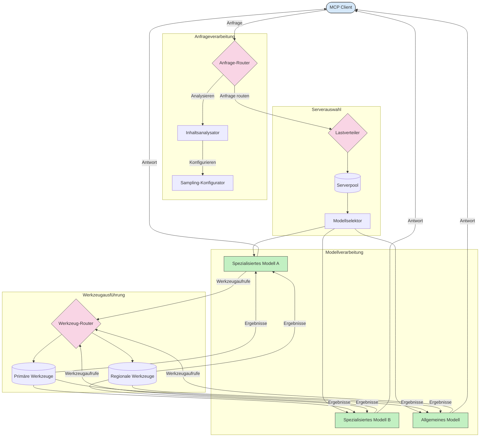

# Routing im Model Context Protocol

Routing ist entscheidend, um Anfragen innerhalb eines MCP-Ökosystems an die passenden Modelle, Tools oder Dienste weiterzuleiten.

## Einführung

Routing im Model Context Protocol (MCP) bedeutet, Anfragen basierend auf verschiedenen Kriterien wie Inhaltstyp, Benutzerkontext und Systemauslastung an die geeignetsten Modelle oder Dienste zu lenken. Dies gewährleistet eine effiziente Verarbeitung und optimale Ressourcennutzung.

## Lernziele

Am Ende dieser Lektion werden Sie in der Lage sein:

- Die Prinzipien des Routings im MCP zu verstehen.
- Inhaltsbasiertes Routing zu implementieren, um Anfragen an spezialisierte Dienste zu leiten.
- Intelligente Lastverteilungsstrategien anzuwenden, um die Ressourcennutzung zu optimieren.
- Dynamisches Tool-Routing basierend auf dem Anfragekontext umzusetzen.

## Inhaltsbasiertes Routing

Inhaltsbasiertes Routing leitet Anfragen basierend auf dem Inhalt der Anfrage an spezialisierte Dienste weiter. Beispielsweise können Anfragen zur Codeerstellung an ein spezialisiertes Code-Modell geleitet werden, während kreative Schreibanfragen an ein kreatives Schreibmodell gesendet werden.

Werfen wir einen Blick auf eine Beispielimplementierung in verschiedenen Programmiersprachen.

<details>
<summary>.NET</summary>

```csharp
// .NET Example: Content-based routing in MCP
public class ContentBasedRouter
{
    private readonly Dictionary<string, McpClient> _specializedClients;
    private readonly RoutingClassifier _classifier;
    
    public ContentBasedRouter()
    {
        // Initialize specialized clients for different domains
        _specializedClients = new Dictionary<string, McpClient>
        {
            ["code"] = new McpClient("https://code-specialized-mcp.com"),
            ["creative"] = new McpClient("https://creative-specialized-mcp.com"),
            ["scientific"] = new McpClient("https://scientific-specialized-mcp.com"),
            ["general"] = new McpClient("https://general-mcp.com")
        };
        
        // Initialize content classifier
        _classifier = new RoutingClassifier();
    }
    
    public async Task<McpResponse> RouteAndProcessAsync(string prompt, IDictionary<string, object> parameters = null)
    {
        // Classify the prompt to determine the best specialized service
        string category = await _classifier.ClassifyPromptAsync(prompt);
        
        // Get the appropriate client or fall back to general
        var client = _specializedClients.ContainsKey(category) 
            ? _specializedClients[category] 
            : _specializedClients["general"];
            
        Console.WriteLine($"Routing request to {category} specialized service");
        
        // Send request to the selected service
        return await client.SendPromptAsync(prompt, parameters);
    }
    
    // Simple classifier for routing decisions
    private class RoutingClassifier
    {
        public Task<string> ClassifyPromptAsync(string prompt)
        {
            prompt = prompt.ToLowerInvariant();
            
            if (prompt.Contains("code") || prompt.Contains("function") || 
                prompt.Contains("program") || prompt.Contains("algorithm"))
            {
                return Task.FromResult("code");
            }
            
            if (prompt.Contains("story") || prompt.Contains("creative") || 
                prompt.Contains("imagine") || prompt.Contains("design"))
            {
                return Task.FromResult("creative");
            }
            
            if (prompt.Contains("science") || prompt.Contains("research") || 
                prompt.Contains("analyze") || prompt.Contains("study"))
            {
                return Task.FromResult("scientific");
            }
            
            return Task.FromResult("general");
        }
    }
}
```

Im obigen Code haben wir:

- Eine `ContentBasedRouter`-Klasse erstellt, die Anfragen basierend auf dem Inhalt des Prompts routet.
- Spezialisierte Clients für unterschiedliche Bereiche (Code, Kreativ, Wissenschaft, Allgemein) initialisiert.
- Einen einfachen Klassifikator implementiert, der die Kategorie des Prompts bestimmt und ihn an den entsprechenden spezialisierten Dienst weiterleitet.
- Einen Rückfallmechanismus verwendet, um Anfragen an einen allgemeinen Dienst weiterzuleiten, falls kein spezialisierter Dienst verfügbar ist.
- Asynchrone Verarbeitung implementiert, um Anfragen effizient zu bearbeiten.
- Ein Wörterbuch verwendet, um Inhaltskategorien den spezialisierten MCP-Clients zuzuordnen.
- Einen einfachen Klassifikator implementiert, der den Prompt analysiert und die entsprechende Kategorie zurückgibt.
- Den spezialisierten Client verwendet, um die Anfrage zu senden und eine Antwort zu erhalten.
- Fälle behandelt, in denen der Prompt keiner spezialisierten Kategorie entspricht, indem an einen allgemeinen Dienst weitergeleitet wird.

</details>

## Intelligente Lastverteilung

Lastverteilung optimiert die Ressourcennutzung und stellt eine hohe Verfügbarkeit für MCP-Dienste sicher. Es gibt verschiedene Möglichkeiten zur Implementierung der Lastverteilung, wie Round-Robin, gewichtete Antwortzeiten oder inhaltsbewusste Strategien.

Schauen wir uns folgendes Beispiel an, das die folgenden Strategien verwendet:

- **Round Robin**: Verteilt Anfragen gleichmäßig auf verfügbare Server.
- **Gewichtete Antwortzeit**: Leitet Anfragen basierend auf der durchschnittlichen Antwortzeit an Server weiter.
- **Inhaltsbewusst**: Leitet Anfragen an spezialisierte Server basierend auf dem Inhalt der Anfrage weiter.

<details>
<summary>Java</summary>

```java
// Java-Beispiel: Intelligente Lastverteilung für MCP-Server
public class McpLoadBalancer {
    private final List<McpServerNode> serverNodes;
    private final LoadBalancingStrategy strategy;
    
    public McpLoadBalancer(List<McpServerNode> nodes, LoadBalancingStrategy strategy) {
        this.serverNodes = new ArrayList<>(nodes);
        this.strategy = strategy;
    }
    
    public McpResponse processRequest(McpRequest request) {
        // Wähle den besten Server basierend auf der Strategie
        McpServerNode selectedNode = strategy.selectNode(serverNodes, request);
        
        try {
            // Leite die Anfrage zum ausgewählten Knoten weiter
            return selectedNode.processRequest(request);
        } catch (Exception e) {
            // Fehlerbehandlung - implementiere Wiederholungs- oder Ausweichlogik
            System.err.println("Error processing request on node " + selectedNode.getId() + ": " + e.getMessage());
            
            // Markiere Knoten als potenziell nicht gesund
            selectedNode.recordFailure();
            
            // Versuche als Ausweichknoten den nächstbesten Knoten
            List<McpServerNode> remainingNodes = new ArrayList<>(serverNodes);
            remainingNodes.remove(selectedNode);
            
            if (!remainingNodes.isEmpty()) {
                McpServerNode fallbackNode = strategy.selectNode(remainingNodes, request);
                return fallbackNode.processRequest(request);
            } else {
                throw new RuntimeException("All MCP server nodes failed to process the request");
            }
        }
    }
    
    // Aufgabe zur Überprüfung der Knotengesundheit
    public void startHealthChecks(Duration interval) {
        ScheduledExecutorService scheduler = Executors.newScheduledThreadPool(1);
        scheduler.scheduleAtFixedRate(() -> {
            for (McpServerNode node : serverNodes) {
                try {
                    boolean isHealthy = node.checkHealth();
                    System.out.println("Node " + node.getId() + " health status: " + 
                                      (isHealthy ? "HEALTHY" : "UNHEALTHY"));
                } catch (Exception e) {
                    System.err.println("Health check failed for node " + node.getId());
                    node.setHealthy(false);
                }
            }
        }, 0, interval.toMillis(), TimeUnit.MILLISECONDS);
    }
    
    // Schnittstelle für Lastverteilungsstrategien
    public interface LoadBalancingStrategy {
        McpServerNode selectNode(List<McpServerNode> nodes, McpRequest request);
    }
    
    // Round-Robin-Strategie
    public static class RoundRobinStrategy implements LoadBalancingStrategy {
        private AtomicInteger counter = new AtomicInteger(0);
        
        @Override
        public McpServerNode selectNode(List<McpServerNode> nodes, McpRequest request) {
            List<McpServerNode> healthyNodes = nodes.stream()
                .filter(McpServerNode::isHealthy)
                .collect(Collectors.toList());
            
            if (healthyNodes.isEmpty()) {
                throw new RuntimeException("No healthy nodes available");
            }
            
            int index = counter.getAndIncrement() % healthyNodes.size();
            return healthyNodes.get(index);
        }
    }
    
    // Gewichtete Antwortzeit-Strategie
    public static class ResponseTimeStrategy implements LoadBalancingStrategy {
        @Override
        public McpServerNode selectNode(List<McpServerNode> nodes, McpRequest request) {
            return nodes.stream()
                .filter(McpServerNode::isHealthy)
                .min(Comparator.comparing(McpServerNode::getAverageResponseTime))
                .orElseThrow(() -> new RuntimeException("No healthy nodes available"));
        }
    }
    
    // Inhaltsbasierte Strategie
    public static class ContentAwareStrategy implements LoadBalancingStrategy {
        @Override
        public McpServerNode selectNode(List<McpServerNode> nodes, McpRequest request) {
            // Bestimme Anfrageeigenschaften
            boolean isCodeRequest = request.getPrompt().contains("code") || 
                                   request.getAllowedTools().contains("codeInterpreter");
            
            boolean isCreativeRequest = request.getPrompt().contains("creative") || 
                                       request.getPrompt().contains("story");
            
            // Finde spezialisierte Knoten
            Optional<McpServerNode> specializedNode = nodes.stream()
                .filter(McpServerNode::isHealthy)
                .filter(node -> {
                    if (isCodeRequest && node.getSpecialization().equals("code")) {
                        return true;
                    }
                    if (isCreativeRequest && node.getSpecialization().equals("creative")) {
                        return true;
                    }
                    return false;
                })
                .findFirst();
            
            // Gib spezialisierte oder am wenigsten ausgelastete Knoten zurück
            return specializedNode.orElse(
                nodes.stream()
                    .filter(McpServerNode::isHealthy)
                    .min(Comparator.comparing(McpServerNode::getCurrentLoad))
                    .orElseThrow(() -> new RuntimeException("No healthy nodes available"))
            );
        }
    }
}
```

Im obigen Code haben wir:

- Eine `McpLoadBalancer`-Klasse erstellt, die eine Liste von MCP-Serverknoten verwaltet und Anfragen basierend auf der ausgewählten Lastverteilungsstrategie routet.
- Verschiedene Lastverteilungsstrategien implementiert: `RoundRobinStrategy`, `ResponseTimeStrategy` und `ContentAwareStrategy`.
- Einen `ScheduledExecutorService` verwendet, um periodisch den Gesundheitszustand der Serverknoten zu prüfen.
- Einen Health-Check-Mechanismus implementiert, der Knoten basierend auf deren Antwort als gesund oder nicht gesund markiert.
- Die Anfragenverarbeitung mit Fehlerbehandlung und Rückfalllogik umgesetzt, um hohe Verfügbarkeit sicherzustellen.
- Eine `McpServerNode`-Klasse verwendet, um einzelne MCP-Serverknoten darzustellen, einschließlich deren Gesundheitsstatus, durchschnittlicher Antwortzeit und aktueller Auslastung.
- Eine `McpRequest`-Klasse implementiert, um Anfragedetails wie Prompt und erlaubte Tools zu kapseln.
- Java Streams genutzt, um Knoten basierend auf Gesundheitsstatus und Spezialisierung zu filtern und auszuwählen.

</details>

## Dynamisches Tool-Routing

Tool-Routing stellt sicher, dass Tool-Aufrufe basierend auf dem Kontext an den passendsten Dienst geleitet werden. Beispielsweise muss ein Wetter-Tool-Aufruf basierend auf dem Standort des Benutzers möglicherweise an einen regionalen Endpunkt weitergeleitet werden, oder ein Taschenrechner-Tool könnte eine spezifische API-Version verwenden müssen.

Schauen wir uns eine Beispielimplementierung an, die dynamisches Tool-Routing basierend auf Anfrageanalyse, regionalen Endpunkten und Versionsunterstützung zeigt.

<details>
<summary>Python</summary>

```python
# Python-Beispiel: Dynamische Werkzeug-Routing basierend auf Anforderungsanalyse
class McpToolRouter:
    def __init__(self):
        # Verfügbare Werkzeug-Endpunkte registrieren
        self.tool_endpoints = {
            "weatherTool": "https://weather-service.example.com/api",
            "calculatorTool": "https://calculator-service.example.com/compute",
            "databaseTool": "https://database-service.example.com/query",
            "searchTool": "https://search-service.example.com/search"
        }
        
        # Regionale Endpunkte für globale Verteilung
        self.regional_endpoints = {
            "us": {
                "weatherTool": "https://us-west.weather-service.example.com/api",
                "searchTool": "https://us.search-service.example.com/search"
            },
            "europe": {
                "weatherTool": "https://eu.weather-service.example.com/api",
                "searchTool": "https://eu.search-service.example.com/search"
            },
            "asia": {
                "weatherTool": "https://asia.weather-service.example.com/api",
                "searchTool": "https://asia.search-service.example.com/search"
            }
        }
        
        # Unterstützung der Werkzeugversionierung
        self.tool_versions = {
            "weatherTool": {
                "default": "v2",
                "v1": "https://weather-service.example.com/api/v1",
                "v2": "https://weather-service.example.com/api/v2",
                "beta": "https://weather-service.example.com/api/beta"
            }
        }
    
    async def route_tool_request(self, tool_name, parameters, user_context=None):
        """Route a tool request to the appropriate endpoint based on context"""
        endpoint = self._select_endpoint(tool_name, parameters, user_context)
        
        if not endpoint:
            raise ValueError(f"No endpoint available for tool: {tool_name}")
        
        # Führe die tatsächliche Anfrage an den ausgewählten Endpunkt aus
        return await self._execute_tool_request(endpoint, tool_name, parameters)
    
    def _select_endpoint(self, tool_name, parameters, user_context=None):
        """Select the most appropriate endpoint based on context"""
        # Basis-Endpunkt aus dem Register
        if tool_name not in self.tool_endpoints:
            return None
            
        base_endpoint = self.tool_endpoints[tool_name]
        
        # Prüfen, ob eine bestimmte Werkzeugversion verwendet werden muss
        if tool_name in self.tool_versions:
            version_info = self.tool_versions[tool_name]
            
            # Angegebene Version oder Standard verwenden
            requested_version = parameters.get("_version", version_info["default"])
            if requested_version in version_info:
                base_endpoint = version_info[requested_version]
        
        # Prüfen auf regionales Routing, wenn die Benutzerregion bekannt ist
        if user_context and "region" in user_context:
            user_region = user_context["region"]
            
            if user_region in self.regional_endpoints:
                regional_tools = self.regional_endpoints[user_region]
                
                if tool_name in regional_tools:
                    # Region-spezifischen Endpunkt verwenden
                    return regional_tools[tool_name]
        
        # Prüfen auf Anforderungen bezüglich Datenresidenz
        if user_context and "data_residency" in user_context:
            # Dies würde Logik implementieren, um sicherzustellen, dass Daten in der angegebenen Jurisdiktion verbleiben
            pass
        
        # Prüfen auf latenzbasiertes Routing
        if user_context and "latency_sensitive" in user_context and user_context["latency_sensitive"]:
            # Dies würde Logik implementieren, um den Endpunkt mit der geringsten Latenz auszuwählen
            pass
            
        return base_endpoint
        
    async def _execute_tool_request(self, endpoint, tool_name, parameters):
        """Execute the actual tool request to the selected endpoint"""
        try:
            async with aiohttp.ClientSession() as session:
                async with session.post(
                    endpoint,
                    json={"toolName": tool_name, "parameters": parameters},
                    headers={"Content-Type": "application/json"}
                ) as response:
                    if response.status == 200:
                        result = await response.json()
                        return result
                    else:
                        error_text = await response.text()
                        raise Exception(f"Tool execution failed: {error_text}")
        except Exception as e:
            # Implementierung von Wiederholungslogik oder Fallback-Strategie
            print(f"Error executing tool {tool_name} at {endpoint}: {str(e)}")
            raise
```

Im obigen Code haben wir:

- Eine `McpToolRouter`-Klasse erstellt, die Tool-Routing basierend auf Anfrageanalyse, regionalen Endpunkten und Versionsunterstützung verwaltet.
- Verfügbare Tool-Endpunkte und regionale Endpunkte für globale Verteilung registriert.
- Dynamische Routinglogik implementiert, die basierend auf dem Benutzerkontext, wie Region und Anforderungen an Datenhoheit, den passenden Endpunkt auswählt.
- Versionsunterstützung für Tools implementiert, die es Benutzern ermöglicht, anzugeben, welche Version eines Tools sie verwenden möchten.
- Asynchrone HTTP-Anfragen verwendet, um Tool-Aufrufe auszuführen und Antworten zu verarbeiten.

</details>

## Sampling und Routing Architektur im MCP

Sampling ist eine zentrale Komponente des Model Context Protocol (MCP), die eine effiziente Anfrageverarbeitung und -weiterleitung ermöglicht. Dabei werden eingehende Anfragen analysiert, um basierend auf verschiedenen Kriterien wie Inhaltstyp, Benutzerkontext und Systemauslastung das passendste Modell oder den passendsten Dienst zu bestimmen.

Sampling und Routing können kombiniert werden, um eine robuste Architektur zu schaffen, die die Ressourcennutzung optimiert und hohe Verfügbarkeit garantiert. Der Sampling-Prozess kann zur Klassifizierung von Anfragen genutzt werden, während das Routing diese an die entsprechenden Modelle oder Dienste weiterleitet.

Das nachfolgende Diagramm veranschaulicht, wie Sampling und Routing in einer umfassenden MCP-Architektur zusammenarbeiten:



## Wie geht es weiter

- [5.6 Sampling](../mcp-sampling/README.md)

---

<!-- CO-OP TRANSLATOR DISCLAIMER START -->
**Haftungsausschluss**:
Dieses Dokument wurde mit dem KI-Übersetzungsdienst [Co-op Translator](https://github.com/Azure/co-op-translator) übersetzt. Obwohl wir uns um Genauigkeit bemühen, beachten Sie bitte, dass automatisierte Übersetzungen Fehler oder Ungenauigkeiten enthalten können. Das Originaldokument in seiner Ursprungssprache gilt als maßgebliche Quelle. Bei kritischen Informationen wird eine professionelle menschliche Übersetzung empfohlen. Wir übernehmen keine Haftung für Missverständnisse oder Fehlinterpretationen, die aus der Verwendung dieser Übersetzung entstehen.
<!-- CO-OP TRANSLATOR DISCLAIMER END -->