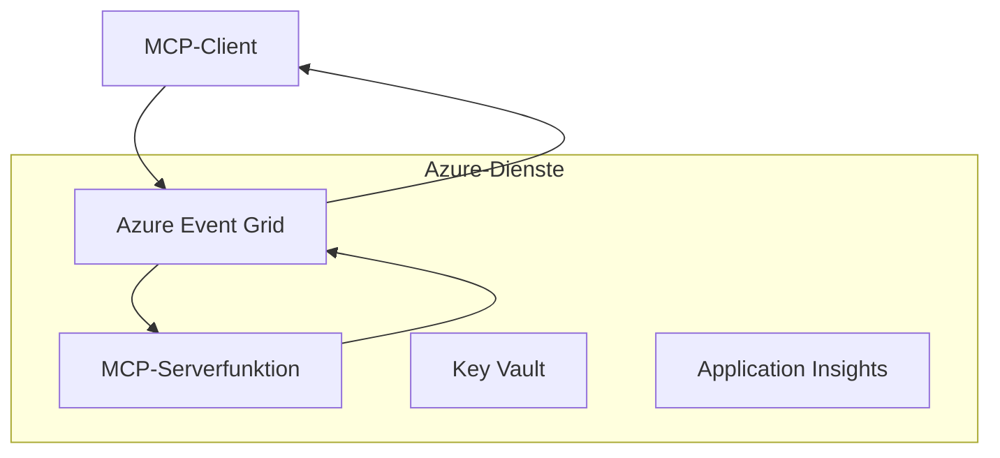
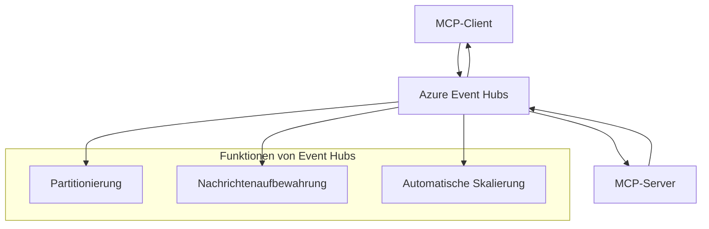

# MCP benutzerdefinierte Transports - Erweiterte Implementierungsanleitung

Das Model Context Protocol (MCP) bietet Flexibilität bei Transportmechanismen und ermöglicht benutzerdefinierte Implementierungen für spezialisierte Unternehmensumgebungen. Dieser fortgeschrittene Leitfaden untersucht benutzerdefinierte Transportimplementierungen anhand von Azure Event Grid und Azure Event Hubs als praxisnahe Beispiele zum Aufbau skalierbarer, cloud-nativer MCP-Lösungen.

> **Vorausblick:** Dieser Leitfaden basiert auf der **MCP-Spezifikation 2025-11-25**, bei der die Sitzungsreihenfolge pro Sitzung erhalten bleiben muss (siehe Nachrichtprotokoll unten). Der Release-Kandidat `2026-07-28` entfernt die Protokollebene der Sitzung vollständig und erfordert `Mcp-Method`/`Mcp-Name` Header, sodass Gateways und benutzerdefinierte Transports pro Anfrage statt pro Sitzung routen können. Siehe [Was ändert sich in MCP: Der Release-Kandidat 2026-07-28](../../01-CoreConcepts/mcp-2026-07-28-release-candidate.md).

## Einführung

Während die Standardtransports von MCP (stdio und HTTP-Streaming) die meisten Anwendungsfälle abdecken, benötigen Unternehmensumgebungen oft spezialisierte Transportmechanismen für bessere Skalierbarkeit, Zuverlässigkeit und Integration in bestehende Cloud-Infrastrukturen. Benutzerdefinierte Transports ermöglichen es MCP, cloud-native Messaging-Dienste für asynchrone Kommunikation, ereignisgesteuerte Architekturen und verteilte Verarbeitung zu nutzen.

Diese Lektion untersucht fortgeschrittene Transportimplementierungen basierend auf der neuesten MCP-Spezifikation (2025-11-25), Azure Messaging-Diensten und etablierten Enterprise-Integrationsmustern.

### **MCP Transportarchitektur**

**Aus der MCP-Spezifikation (2025-11-25):**

- **Standardtransports**: stdio (empfohlen), HTTP-Streaming (für Remote-Szenarien)
- **Benutzerdefinierte Transports**: Jeder Transport, der das MCP Nachrichten­austausch­protokoll implementiert
- **Nachrichtenformat**: JSON-RPC 2.0 mit MCP-spezifischen Erweiterungen
- **Bidirektionale Kommunikation**: Vollduplex-Kommunikation erforderlich für Benachrichtigungen und Antworten

## Lernziele

Am Ende dieser fortgeschrittenen Lektion werden Sie in der Lage sein:

- **Anforderungen an benutzerdefinierte Transports verstehen**: MCP-Protokoll über beliebige Transportschichten implementieren und dabei die Konformität wahren
- **Azure Event Grid Transport aufbauen**: Ereignisgesteuerte MCP-Server mit Azure Event Grid für serverlose Skalierbarkeit erstellen
- **Azure Event Hubs Transport implementieren**: Hochdurchsatzfähige MCP-Lösungen mit Azure Event Hubs für Echtzeit-Streaming gestalten
- **Enterprise-Muster anwenden**: Benutzerdefinierte Transports in bestehende Azure-Infrastruktur und Sicherheitsmodelle integrieren
- **Transportzuverlässigkeit handhaben**: Nachrichtenhaltbarkeit, Reihenfolge und Fehlerbehandlung für Unternehmens­szenarien umsetzen
- **Leistung optimieren**: Transportsysteme für Skalierungs-, Latenz- und Durchsatzanforderungen entwerfen

## **Transportanforderungen**

### **Kernanforderungen aus der MCP-Spezifikation (2025-11-25):**

```yaml
Message Protocol:
  format: "JSON-RPC 2.0 with MCP extensions"
  bidirectional: "Full duplex communication required"
  ordering: "Message ordering must be preserved per session"
  
Transport Layer:
  reliability: "Transport MUST handle connection failures gracefully"
  security: "Transport MUST support secure communication"
  identification: "Each session MUST have unique identifier"
  
Custom Transport:
  compliance: "MUST implement complete MCP message exchange"
  extensibility: "MAY add transport-specific features"
  interoperability: "MUST maintain protocol compatibility"
```

## **Azure Event Grid Transport Implementation**

Azure Event Grid stellt einen serverlosen Ereignisweiterleitungsdienst bereit, ideal für ereignisgesteuerte MCP-Architekturen. Diese Implementierung zeigt, wie skalierbare, lose gekoppelte MCP-Systeme aufgebaut werden.

### **Architekturübersicht**



### **C# Implementierung - Event Grid Transport**

```csharp
using Azure.Messaging.EventGrid;
using Microsoft.Extensions.Azure;
using System.Text.Json;

public class EventGridMcpTransport : IMcpTransport
{
    private readonly EventGridPublisherClient _publisher;
    private readonly string _topicEndpoint;
    private readonly string _clientId;
    
    public EventGridMcpTransport(string topicEndpoint, string accessKey, string clientId)
    {
        _publisher = new EventGridPublisherClient(
            new Uri(topicEndpoint), 
            new AzureKeyCredential(accessKey));
        _topicEndpoint = topicEndpoint;
        _clientId = clientId;
    }
    
    public async Task SendMessageAsync(McpMessage message)
    {
        var eventGridEvent = new EventGridEvent(
            subject: $"mcp/{_clientId}",
            eventType: "MCP.MessageReceived",
            dataVersion: "1.0",
            data: JsonSerializer.Serialize(message))
        {
            Id = Guid.NewGuid().ToString(),
            EventTime = DateTimeOffset.UtcNow
        };
        
        await _publisher.SendEventAsync(eventGridEvent);
    }
    
    public async Task<McpMessage> ReceiveMessageAsync(CancellationToken cancellationToken)
    {
        // Event Grid is push-based, so implement webhook receiver
        // This would typically be handled by Azure Functions trigger
        throw new NotImplementedException("Use EventGridTrigger in Azure Functions");
    }
}

// Azure Function for receiving Event Grid events
[FunctionName("McpEventGridReceiver")]
public async Task<IActionResult> HandleEventGridMessage(
    [EventGridTrigger] EventGridEvent eventGridEvent,
    ILogger log)
{
    try
    {
        var mcpMessage = JsonSerializer.Deserialize<McpMessage>(
            eventGridEvent.Data.ToString());
        
        // Process MCP message
        var response = await _mcpServer.ProcessMessageAsync(mcpMessage);
        
        // Send response back via Event Grid
        await _transport.SendMessageAsync(response);
        
        return new OkResult();
    }
    catch (Exception ex)
    {
        log.LogError(ex, "Error processing Event Grid MCP message");
        return new BadRequestResult();
    }
}
```

### **TypeScript Implementierung - Event Grid Transport**

```typescript
import { EventGridPublisherClient, AzureKeyCredential } from "@azure/eventgrid";
import { McpTransport, McpMessage } from "./mcp-types";

export class EventGridMcpTransport implements McpTransport {
    private publisher: EventGridPublisherClient;
    private clientId: string;
    
    constructor(
        private topicEndpoint: string,
        private accessKey: string,
        clientId: string
    ) {
        this.publisher = new EventGridPublisherClient(
            topicEndpoint,
            new AzureKeyCredential(accessKey)
        );
        this.clientId = clientId;
    }
    
    async sendMessage(message: McpMessage): Promise<void> {
        const event = {
            id: crypto.randomUUID(),
            source: `mcp-client-${this.clientId}`,
            type: "MCP.MessageReceived",
            time: new Date(),
            data: message
        };
        
        await this.publisher.sendEvents([event]);
    }
    
    // Ereignisgesteuertes Empfangen über Azure Functions
    onMessage(handler: (message: McpMessage) => Promise<void>): void {
        // Die Implementierung würde den Azure Functions Event Grid Trigger verwenden
        // Dies ist eine konzeptionelle Schnittstelle für den Webhook-Empfänger
    }
}

// Azure Functions Implementierung
import { app, InvocationContext, EventGridEvent } from "@azure/functions";

app.eventGrid("mcpEventGridHandler", {
    handler: async (event: EventGridEvent, context: InvocationContext) => {
        try {
            const mcpMessage = event.data as McpMessage;
            
            // MCP-Nachricht verarbeiten
            const response = await mcpServer.processMessage(mcpMessage);
            
            // Antwort über Event Grid senden
            await transport.sendMessage(response);
            
        } catch (error) {
            context.error("Error processing MCP message:", error);
            throw error;
        }
    }
});
```

### **Python Implementierung - Event Grid Transport**

```python
from azure.eventgrid import EventGridPublisherClient, EventGridEvent
from azure.core.credentials import AzureKeyCredential
import asyncio
import json
from typing import Callable, Optional
import uuid
from datetime import datetime

class EventGridMcpTransport:
    def __init__(self, topic_endpoint: str, access_key: str, client_id: str):
        self.client = EventGridPublisherClient(
            topic_endpoint, 
            AzureKeyCredential(access_key)
        )
        self.client_id = client_id
        self.message_handler: Optional[Callable] = None
    
    async def send_message(self, message: dict) -> None:
        """Send MCP message via Event Grid"""
        event = EventGridEvent(
            data=message,
            subject=f"mcp/{self.client_id}",
            event_type="MCP.MessageReceived",
            data_version="1.0"
        )
        
        await self.client.send(event)
    
    def on_message(self, handler: Callable[[dict], None]) -> None:
        """Register message handler for incoming events"""
        self.message_handler = handler

# Azure Functions Implementierung
import azure.functions as func
import logging

def main(event: func.EventGridEvent) -> None:
    """Azure Functions Event Grid trigger for MCP messages"""
    try:
        # MCP-Nachricht aus Event Grid Ereignis parsen
        mcp_message = json.loads(event.get_body().decode('utf-8'))
        
        # MCP-Nachricht verarbeiten
        response = process_mcp_message(mcp_message)
        
        # Antwort über Event Grid zurücksenden
        # (Implementierung würde neuen Event Grid Client erstellen)
        
    except Exception as e:
        logging.error(f"Error processing MCP Event Grid message: {e}")
        raise
```

## **Azure Event Hubs Transport Implementation**

Azure Event Hubs bietet hochdurchsatzfähige, echtzeitfähige Streaming-Funktionalitäten für MCP-Szenarien mit niedriger Latenz und hohem Nachrichtenvolumen.

### **Architekturübersicht**



### **C# Implementierung - Event Hubs Transport**

```csharp
using Azure.Messaging.EventHubs;
using Azure.Messaging.EventHubs.Producer;
using Azure.Messaging.EventHubs.Consumer;
using System.Text;

public class EventHubsMcpTransport : IMcpTransport, IDisposable
{
    private readonly EventHubProducerClient _producer;
    private readonly EventHubConsumerClient _consumer;
    private readonly string _consumerGroup;
    private readonly CancellationTokenSource _cancellationTokenSource;
    
    public EventHubsMcpTransport(
        string connectionString, 
        string eventHubName,
        string consumerGroup = "$Default")
    {
        _producer = new EventHubProducerClient(connectionString, eventHubName);
        _consumer = new EventHubConsumerClient(
            consumerGroup, 
            connectionString, 
            eventHubName);
        _consumerGroup = consumerGroup;
        _cancellationTokenSource = new CancellationTokenSource();
    }
    
    public async Task SendMessageAsync(McpMessage message)
    {
        var messageBody = JsonSerializer.Serialize(message);
        var eventData = new EventData(Encoding.UTF8.GetBytes(messageBody));
        
        // Add MCP-specific properties
        eventData.Properties.Add("MessageType", message.Method ?? "response");
        eventData.Properties.Add("MessageId", message.Id);
        eventData.Properties.Add("Timestamp", DateTimeOffset.UtcNow);
        
        await _producer.SendAsync(new[] { eventData });
    }
    
    public async Task StartReceivingAsync(
        Func<McpMessage, Task> messageHandler)
    {
        await foreach (PartitionEvent partitionEvent in _consumer.ReadEventsAsync(
            _cancellationTokenSource.Token))
        {
            try
            {
                var messageBody = Encoding.UTF8.GetString(
                    partitionEvent.Data.EventBody.ToArray());
                var mcpMessage = JsonSerializer.Deserialize<McpMessage>(messageBody);
                
                await messageHandler(mcpMessage);
            }
            catch (Exception ex)
            {
                // Handle deserialization or processing errors
                Console.WriteLine($"Error processing message: {ex.Message}");
            }
        }
    }
    
    public void Dispose()
    {
        _cancellationTokenSource?.Cancel();
        _producer?.DisposeAsync().AsTask().Wait();
        _consumer?.DisposeAsync().AsTask().Wait();
        _cancellationTokenSource?.Dispose();
    }
}
```

### **TypeScript Implementierung - Event Hubs Transport**

```typescript
import { 
    EventHubProducerClient, 
    EventHubConsumerClient, 
    EventData 
} from "@azure/event-hubs";

export class EventHubsMcpTransport implements McpTransport {
    private producer: EventHubProducerClient;
    private consumer: EventHubConsumerClient;
    private isReceiving = false;
    
    constructor(
        private connectionString: string,
        private eventHubName: string,
        private consumerGroup: string = "$Default"
    ) {
        this.producer = new EventHubProducerClient(
            connectionString, 
            eventHubName
        );
        this.consumer = new EventHubConsumerClient(
            consumerGroup,
            connectionString,
            eventHubName
        );
    }
    
    async sendMessage(message: McpMessage): Promise<void> {
        const eventData: EventData = {
            body: JSON.stringify(message),
            properties: {
                messageType: message.method || "response",
                messageId: message.id,
                timestamp: new Date().toISOString()
            }
        };
        
        await this.producer.sendBatch([eventData]);
    }
    
    async startReceiving(
        messageHandler: (message: McpMessage) => Promise<void>
    ): Promise<void> {
        if (this.isReceiving) return;
        
        this.isReceiving = true;
        
        const subscription = this.consumer.subscribe({
            processEvents: async (events, context) => {
                for (const event of events) {
                    try {
                        const messageBody = event.body as string;
                        const mcpMessage: McpMessage = JSON.parse(messageBody);
                        
                        await messageHandler(mcpMessage);
                        
                        // Aktualisiere Checkpoint für mindestens-einmal-Lieferung
                        await context.updateCheckpoint(event);
                    } catch (error) {
                        console.error("Error processing Event Hubs message:", error);
                    }
                }
            },
            processError: async (err, context) => {
                console.error("Event Hubs error:", err);
            }
        });
    }
    
    async close(): Promise<void> {
        this.isReceiving = false;
        await this.producer.close();
        await this.consumer.close();
    }
}
```

### **Python Implementierung - Event Hubs Transport**

```python
from azure.eventhub import EventHubProducerClient, EventHubConsumerClient
from azure.eventhub import EventData
import json
import asyncio
from typing import Callable, Dict, Any
import logging

class EventHubsMcpTransport:
    def __init__(
        self, 
        connection_string: str, 
        eventhub_name: str,
        consumer_group: str = "$Default"
    ):
        self.producer = EventHubProducerClient.from_connection_string(
            connection_string, 
            eventhub_name=eventhub_name
        )
        self.consumer = EventHubConsumerClient.from_connection_string(
            connection_string,
            consumer_group=consumer_group,
            eventhub_name=eventhub_name
        )
        self.is_receiving = False
    
    async def send_message(self, message: Dict[str, Any]) -> None:
        """Send MCP message via Event Hubs"""
        event_data = EventData(json.dumps(message))
        
        # MCP-spezifische Eigenschaften hinzufügen
        event_data.properties = {
            "messageType": message.get("method", "response"),
            "messageId": message.get("id"),
            "timestamp": "2025-01-14T10:30:00Z"  # Tatsächlichen Zeitstempel verwenden
        }
        
        async with self.producer:
            event_data_batch = await self.producer.create_batch()
            event_data_batch.add(event_data)
            await self.producer.send_batch(event_data_batch)
    
    async def start_receiving(
        self, 
        message_handler: Callable[[Dict[str, Any]], None]
    ) -> None:
        """Start receiving MCP messages from Event Hubs"""
        if self.is_receiving:
            return
        
        self.is_receiving = True
        
        async with self.consumer:
            await self.consumer.receive(
                on_event=self._on_event_received(message_handler),
                starting_position="-1"  # Von Anfang an starten
            )
    
    def _on_event_received(self, handler: Callable):
        """Internal event handler wrapper"""
        async def handle_event(partition_context, event):
            try:
                # MCP-Nachricht aus Event Hubs-Ereignis parsen
                message_body = event.body_as_str(encoding='UTF-8')
                mcp_message = json.loads(message_body)
                
                # MCP-Nachricht verarbeiten
                await handler(mcp_message)
                
                # Checkpoint für mindestens-einmalige Zustellung aktualisieren
                await partition_context.update_checkpoint(event)
                
            except Exception as e:
                logging.error(f"Error processing Event Hubs message: {e}")
        
        return handle_event
    
    async def close(self) -> None:
        """Clean up transport resources"""
        self.is_receiving = False
        await self.producer.close()
        await self.consumer.close()
```

## **Fortgeschrittene Transportmuster**

### **Nachrichtenhaltbarkeit und Zuverlässigkeit**

```csharp
// Implementing message durability with retry logic
public class ReliableTransportWrapper : IMcpTransport
{
    private readonly IMcpTransport _innerTransport;
    private readonly RetryPolicy _retryPolicy;
    
    public async Task SendMessageAsync(McpMessage message)
    {
        await _retryPolicy.ExecuteAsync(async () =>
        {
            try
            {
                await _innerTransport.SendMessageAsync(message);
            }
            catch (TransportException ex) when (ex.IsRetryable)
            {
                // Log and retry
                throw;
            }
        });
    }
}
```

### **Integration der Transportsicherheit**

```csharp
// Integrating Azure Key Vault for transport security
public class SecureTransportFactory
{
    private readonly SecretClient _keyVaultClient;
    
    public async Task<IMcpTransport> CreateEventGridTransportAsync()
    {
        var accessKey = await _keyVaultClient.GetSecretAsync("EventGridAccessKey");
        var topicEndpoint = await _keyVaultClient.GetSecretAsync("EventGridTopic");
        
        return new EventGridMcpTransport(
            topicEndpoint.Value.Value,
            accessKey.Value.Value,
            Environment.MachineName
        );
    }
}
```

### **Transportüberwachung und Beobachtbarkeit**

```csharp
// Adding telemetry to custom transports
public class ObservableTransport : IMcpTransport
{
    private readonly IMcpTransport _transport;
    private readonly ILogger _logger;
    private readonly TelemetryClient _telemetryClient;
    
    public async Task SendMessageAsync(McpMessage message)
    {
        using var activity = Activity.StartActivity("MCP.Transport.Send");
        activity?.SetTag("transport.type", "EventGrid");
        activity?.SetTag("message.method", message.Method);
        
        var stopwatch = Stopwatch.StartNew();
        
        try
        {
            await _transport.SendMessageAsync(message);
            
            _telemetryClient.TrackDependency(
                "EventGrid",
                "SendMessage",
                DateTime.UtcNow.Subtract(stopwatch.Elapsed),
                stopwatch.Elapsed,
                true
            );
        }
        catch (Exception ex)
        {
            _telemetryClient.TrackException(ex);
            throw;
        }
    }
}
```

## **Enterprise-Integrationsszenarien**

### **Szenario 1: Verteilte MCP-Verarbeitung**

Verteilung von MCP-Anfragen über mehrere Verarbeitungsknoten mit Azure Event Grid:

```yaml
Architecture:
  - MCP Client sends requests to Event Grid topic
  - Multiple Azure Functions subscribe to process different tool types
  - Results aggregated and returned via separate response topic
  
Benefits:
  - Horizontal scaling based on message volume
  - Fault tolerance through redundant processors
  - Cost optimization with serverless compute
```

### **Szenario 2: Echtzeit-MCP-Streaming**

Hochfrequente MCP-Interaktionen mit Azure Event Hubs:

```yaml
Architecture:
  - MCP Client streams continuous requests via Event Hubs
  - Stream Analytics processes and routes messages
  - Multiple consumers handle different aspect of processing
  
Benefits:
  - Low latency for real-time scenarios
  - High throughput for batch processing
  - Built-in partitioning for parallel processing
```

### **Szenario 3: Hybride Transportarchitektur**

Kombination mehrerer Transports für unterschiedliche Anwendungsfälle:

```csharp
public class HybridMcpTransport : IMcpTransport
{
    private readonly IMcpTransport _realtimeTransport; // Event Hubs
    private readonly IMcpTransport _batchTransport;    // Event Grid
    private readonly IMcpTransport _fallbackTransport; // HTTP Streaming
    
    public async Task SendMessageAsync(McpMessage message)
    {
        // Route based on message characteristics
        var transport = message.Method switch
        {
            "tools/call" when IsRealtime(message) => _realtimeTransport,
            "resources/read" when IsBatch(message) => _batchTransport,
            _ => _fallbackTransport
        };
        
        await transport.SendMessageAsync(message);
    }
}
```

## **Leistungsoptimierung**

### **Nachrichten-Batching für Event Grid**

```csharp
public class BatchingEventGridTransport : IMcpTransport
{
    private readonly List<McpMessage> _messageBuffer = new();
    private readonly Timer _flushTimer;
    private const int MaxBatchSize = 100;
    
    public async Task SendMessageAsync(McpMessage message)
    {
        lock (_messageBuffer)
        {
            _messageBuffer.Add(message);
            
            if (_messageBuffer.Count >= MaxBatchSize)
            {
                _ = Task.Run(FlushMessages);
            }
        }
    }
    
    private async Task FlushMessages()
    {
        List<McpMessage> toSend;
        lock (_messageBuffer)
        {
            toSend = new List<McpMessage>(_messageBuffer);
            _messageBuffer.Clear();
        }
        
        if (toSend.Any())
        {
            var events = toSend.Select(CreateEventGridEvent);
            await _publisher.SendEventsAsync(events);
        }
    }
}
```

### **Partitionierungsstrategie für Event Hubs**

```csharp
public class PartitionedEventHubsTransport : IMcpTransport
{
    public async Task SendMessageAsync(McpMessage message)
    {
        // Partition by client ID for session affinity
        var partitionKey = ExtractClientId(message);
        
        var eventData = new EventData(JsonSerializer.SerializeToUtf8Bytes(message))
        {
            PartitionKey = partitionKey
        };
        
        await _producer.SendAsync(new[] { eventData });
    }
}
```

## **Testen von benutzerdefinierten Transports**

### **Modultests mit Test Doubles**

```csharp
[Test]
public async Task EventGridTransport_SendMessage_PublishesCorrectEvent()
{
    // Arrange
    var mockPublisher = new Mock<EventGridPublisherClient>();
    var transport = new EventGridMcpTransport(mockPublisher.Object);
    var message = new McpMessage { Method = "tools/list", Id = "test-123" };
    
    // Act
    await transport.SendMessageAsync(message);
    
    // Assert
    mockPublisher.Verify(
        x => x.SendEventAsync(
            It.Is<EventGridEvent>(e => 
                e.EventType == "MCP.MessageReceived" &&
                e.Subject == "mcp/test-client"
            )
        ),
        Times.Once
    );
}
```

### **Integrationstests mit Azure Test Containers**

```csharp
[Test]
public async Task EventHubsTransport_IntegrationTest()
{
    // Using Testcontainers for integration testing
    var eventHubsContainer = new EventHubsContainer()
        .WithEventHub("test-hub");
    
    await eventHubsContainer.StartAsync();
    
    var transport = new EventHubsMcpTransport(
        eventHubsContainer.GetConnectionString(),
        "test-hub"
    );
    
    // Test message round-trip
    var sentMessage = new McpMessage { Method = "test", Id = "123" };
    McpMessage receivedMessage = null;
    
    await transport.StartReceivingAsync(msg => {
        receivedMessage = msg;
        return Task.CompletedTask;
    });
    
    await transport.SendMessageAsync(sentMessage);
    await Task.Delay(1000); // Allow for message processing
    
    Assert.That(receivedMessage?.Id, Is.EqualTo("123"));
}
```

## **Beste Praktiken und Richtlinien**

### **Designprinzipien für Transports**

1. **Idempotenz**: Sicherstellen, dass Nachrichtenverarbeitung idempotent ist, um Duplikate zu behandeln
2. **Fehlerbehandlung**: Umfassende Fehlerbehandlung und Dead Letter Queues implementieren
3. **Überwachung**: Detaillierte Telemetrie und Gesundheitschecks hinzufügen
4. **Sicherheit**: Verwenden von verwalteten Identitäten und Prinzip der minimalen Rechte
5. **Leistung**: Für spezifische Latenz- und Durchsatzanforderungen entwerfen

### **Azure-spezifische Empfehlungen**

1. **Managed Identity verwenden**: Vermeiden von Verbindungszeichenfolgen in der Produktion
2. **Circuit Breaker implementieren**: Schutz gegen Azure-Dienstausfälle
3. **Kosten überwachen**: Nachrichtenvolumen und Verarbeitungskosten tracken
4. **Für Skalierung planen**: Partitionierungs- und Skalierungsstrategien frühzeitig entwerfen
5. **Gründlich testen**: Azure DevTest Labs für umfassende Tests verwenden

## **Fazit**

Benutzerdefinierte MCP-Transports ermöglichen leistungsfähige Unternehmens­szenarien mithilfe von Azures Messaging-Diensten. Durch die Implementierung von Event Grid- oder Event Hubs-Transports können Sie skalierbare, zuverlässige MCP-Lösungen erstellen, die sich nahtlos in bestehende Azure-Infrastrukturen integrieren.

Die bereitgestellten Beispiele demonstrieren produktionsreife Muster zur Implementierung benutzerdefinierter Transports bei voller MCP-Protokollkonformität und unter Berücksichtigung von Azure Best Practices.

## **Zusätzliche Ressourcen**

- [MCP Specification 2025-11-25](https://modelcontextprotocol.io/specification/2025-11-25/)
- [Azure Event Grid Dokumentation](https://docs.microsoft.com/azure/event-grid/)
- [Azure Event Hubs Dokumentation](https://docs.microsoft.com/azure/event-hubs/)
- [Azure Functions Event Grid Trigger](https://docs.microsoft.com/azure/azure-functions/functions-bindings-event-grid)
- [Azure SDK für .NET](https://github.com/Azure/azure-sdk-for-net)
- [Azure SDK für TypeScript](https://github.com/Azure/azure-sdk-for-js)
- [Azure SDK für Python](https://github.com/Azure/azure-sdk-for-python)

---

> *Dieser Leitfaden konzentriert sich auf praktische Implementierungsmuster für produktive MCP-Systeme. Validieren Sie Transport­implementierungen stets anhand Ihrer spezifischen Anforderungen und Azure-Dienstgrenzen.*
> **Aktueller Standard**: Dieser Leitfaden spiegelt die [MCP-Spezifikation 2025-11-25](https://modelcontextprotocol.io/specification/2025-11-25/) Transportanforderungen und fortgeschrittene Transportmuster für Unternehmensumgebungen wider.


## Was kommt als Nächstes
- [6. Community-Beiträge](../../06-CommunityContributions/README.md)

---

<!-- CO-OP TRANSLATOR DISCLAIMER START -->
**Haftungsausschluss**:
Dieses Dokument wurde mit dem KI-Übersetzungsdienst [Co-op Translator](https://github.com/Azure/co-op-translator) übersetzt. Obwohl wir uns um Genauigkeit bemühen, beachten Sie bitte, dass automatisierte Übersetzungen Fehler oder Ungenauigkeiten enthalten können. Das Originaldokument in seiner Ursprungssprache gilt als maßgebliche Quelle. Bei kritischen Informationen wird eine professionelle menschliche Übersetzung empfohlen. Wir übernehmen keine Haftung für Missverständnisse oder Fehlinterpretationen, die aus der Verwendung dieser Übersetzung entstehen.
<!-- CO-OP TRANSLATOR DISCLAIMER END -->