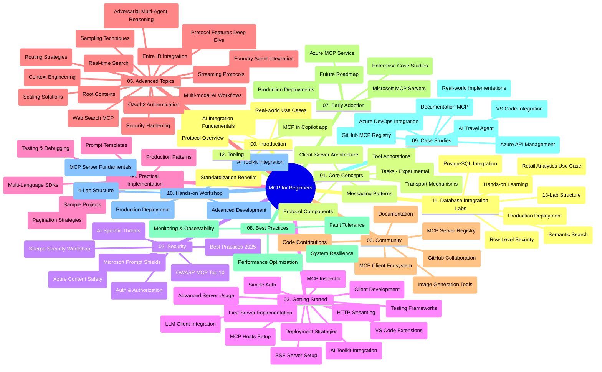

# Model Context Protocol (MCP) für Einsteiger - Studienführer

Dieser Studienführer bietet einen Überblick über die Repository-Struktur und den Inhalt des Curriculums "Model Context Protocol (MCP) für Einsteiger". Verwenden Sie diesen Leitfaden, um sich effizient im Repository zurechtzufinden und das zur Verfügung stehende Material optimal zu nutzen.

## Repository-Überblick

Das Model Context Protocol (MCP) ist ein standardisierter Rahmen für die Interaktionen zwischen KI-Modellen und Client-Anwendungen. Ursprünglich von Anthropic erstellt, wird MCP nun von der breiteren MCP-Community über die offizielle GitHub-Organisation gepflegt. Dieses Repository bietet ein umfassendes Curriculum mit praxisnahen Codebeispielen in C#, Java, JavaScript, Python und TypeScript, das für KI-Entwickler, Systemarchitekten und Softwareingenieure konzipiert ist.

## Visuelle Curriculum-Karte

## Repository-Struktur

Das Repository ist in zwölf Hauptabschnitte gegliedert, die sich jeweils auf verschiedene Aspekte von MCP konzentrieren:

1. **Einführung (00-Introduction/)**
   - Überblick über das Model Context Protocol
   - Warum Standardisierung in KI-Pipelines wichtig ist
   - Praktische Anwendungsfälle und Vorteile

2. **Grundkonzepte (01-CoreConcepts/)**
   - Client-Server-Architektur
   - Wichtige Protokollkomponenten
   - Messaging-Muster im MCP
   - Zukunftsausblick: [Was sich im MCP ändert: Der Release Candidate vom 28.07.2026](./01-CoreConcepts/mcp-2026-07-28-release-candidate.md) — der zustandslose Protokollkern, Erweiterungs-Framework und erwartete Deprecations von Roots/Sampling/Logging in der nächsten Spezifikationsversion

3. **Sicherheit (02-Security/)**
   - Sicherheitsbedrohungen in MCP-basierten Systemen
   - Best Practices zur Sicherung von Implementierungen
   - Authentifizierungs- und Autorisierungsstrategien
   - **Umfassende Sicherheitsdokumentation**:
     - MCP Sicherheit Best Practices 2025
     - Azure Content Safety Implementierungsleitfaden
     - MCP Sicherheitskontrollen und Techniken
     - MCP Best Practices Schnellreferenz
   - **Wichtige Sicherheitsthemen**:
     - Prompt Injection und Tool-Vergiftungsangriffe
     - Session Hijacking und Confused Deputy-Probleme
     - Token-Passthrough-Schwachstellen
     - Übermäßige Berechtigungen und Zugriffskontrolle
     - Lieferkettensicherheit für KI-Komponenten
     - Integration von Microsoft Prompt Shields

4. **Erste Schritte (03-GettingStarted/)**
   - Einrichtung und Konfiguration der Umgebung
   - Erstellung von einfachen MCP-Servern und -Clients
   - Integration in bestehende Anwendungen
   - Enthält Abschnitte für:
     - Erste Server-Implementierung
     - Client-Entwicklung
     - LLM-Client-Integration
     - VS Code-Integration
     - Server-Sent Events (SSE) Server
     - Fortgeschrittene Server-Nutzung
     - HTTP-Streaming
     - AI Toolkit-Integration
     - Teststrategien
     - Bereitstellungsrichtlinien

5. **Praktische Umsetzung (04-PracticalImplementation/)**
   - Verwendung von SDKs in verschiedenen Programmiersprachen
   - Debugging-, Test- und Validierungstechniken
   - Erstellung wiederverwendbarer Prompt-Vorlagen und Workflows
   - Beispielprojekte mit Implementierungsbeispielen

6. **Fortgeschrittene Themen (05-AdvancedTopics/)**
   - Kontext-Engineering-Techniken
   - Foundry-Agent-Integration
   - Multimodale KI-Workflows
   - OAuth2-Authentifizierungsdemos
   - Echtzeit-Suchfunktionen
   - Echtzeit-Streaming
   - Implementierung von Root-Kontexten
   - Routing-Strategien
   - Sampling-Techniken
   - Skalierungsansätze
   - Sicherheitsaspekte
   - Entra ID-Sicherheitsintegration
   - Websuch-Integration
   - Adversarisches Multi-Agenten-Denken (Debattenmuster)

7. **Community-Beiträge (06-CommunityContributions/)**
   - Wie man Code und Dokumentation beiträgt
   - Zusammenarbeit über GitHub
   - Community-getriebene Verbesserungen und Feedback
   - Nutzung verschiedener MCP-Clients (Claude Desktop, Cline, VSCode)
   - Arbeit mit beliebten MCP-Servern, einschließlich Bildgenerierung

8. **Erfahrungen aus der Frühphase (07-LessonsfromEarlyAdoption/)**
   - Praktische Implementierungen und Erfolgsgeschichten
   - Aufbau und Bereitstellung MCP-basierter Lösungen
   - Trends und zukünftige Roadmap
   - **Microsoft MCP Server Guide**: Umfassender Leitfaden zu 10 produktionsreifen Microsoft MCP Servern, darunter:
     - Microsoft Learn Docs MCP Server
     - Azure MCP Server (15+ spezialisierte Konnektoren)
     - GitHub MCP Server
     - Azure DevOps MCP Server
     - MarkItDown MCP Server
     - SQL Server MCP Server
     - Playwright MCP Server
     - Dev Box MCP Server
     - Microsoft Foundry MCP Server
     - Microsoft 365 Agents Toolkit MCP Server

9. **Best Practices (08-BestPractices/)**
   - Performance-Tuning und Optimierung
   - Entwurf ausfallsicherer MCP-Systeme
   - Test- und Resilienzstrategien

10. **Fallstudien (09-CaseStudy/)**
    - **Sieben umfassende Fallstudien**, die die Vielseitigkeit von MCP in verschiedenen Szenarien zeigen:
    - **Azure AI Reiseagenten**: Multi-Agenten-Orchestrierung mit Azure OpenAI und AI Search
    - **Azure DevOps Integration**: Automatisierung von Workflow-Prozessen mit YouTube-Datenaktualisierungen
    - **Echtzeit-Dokumentationsabruf**: Python-Konsolen-Client mit Streaming-HTTP
    - **Interaktiver Studienplan-Generator**: Chainlit Web-App mit konversationeller KI
    - **Dokumentation im Editor**: VS Code-Integration mit GitHub Copilot Workflows
    - **Azure API Management**: Unternehmens-API-Integration mit MCP-Server-Erstellung
    - **GitHub MCP Registry**: Ökosystementwicklung und agentische Integrationsplattform
    - Implementierungsbeispiele reichen von Unternehmensintegration, Entwicklerproduktivität bis hin zu Ökosystementwicklung

11. **Praxisworkshop (10-StreamliningAIWorkflowsBuildingAnMCPServerWithAIToolkit/)**
    - Umfassender praxisorientierter Workshop, der MCP mit AI Toolkit kombiniert
    - Aufbau intelligenter Anwendungen, die KI-Modelle mit realen Tools verbinden
    - Praktische Module, die Grundlagen, individuelle Serverentwicklung und Produktionsbereitstellungsstrategien abdecken
    - **Lab-Struktur**:
      - Lab 1: MCP Server Grundlagen
      - Lab 2: Fortgeschrittene MCP Server-Entwicklung
      - Lab 3: AI Toolkit Integration
      - Lab 4: Produktionsbereitstellung und Skalierung
    - Lab-basiertes Lernkonzept mit Schritt-für-Schritt-Anleitungen

12. **MCP Server Datenbank-Integrationslabs (11-MCPServerHandsOnLabs/)**
    - **Umfassender 13-Lab-Lernpfad** zum Aufbau produktionsreifer MCP-Server mit PostgreSQL-Integration
    - **Praxisnahe Einzelhandelsanalytik-Implementierung** basierend auf dem Zava Retail Use Case
    - **Enterprise-Standards** einschließlich Row Level Security (RLS), semantische Suche und Multi-Tenant-Datenzugriff
    - **Komplette Lab-Struktur**:
      - **Labs 00-03: Grundlagen** - Einführung, Architektur, Sicherheit, Einrichtung der Umgebung
      - **Labs 04-06: Aufbau des MCP Servers** - Datenbankentwurf, MCP Server Implementierung, Tool-Entwicklung
      - **Labs 07-09: Erweiterte Funktionen** - Semantische Suche, Testen & Debuggen, VS Code Integration
      - **Labs 10-12: Produktion & Best Practices** - Bereitstellung, Überwachung, Optimierung
    - **Abgedeckte Technologien**: FastMCP-Framework, PostgreSQL, Azure OpenAI, Azure Container Apps, Application Insights
    - **Lernergebnisse**: Produktionsreife MCP-Server, Datenbank-Integrationsmuster, KI-gestützte Analytik, Unternehmenssicherheit

13. **Werkzeuge (12-tooling/)**
    - Erlernen der Nutzung von MCP in der Copilot-App und anderen Tools

## Zusätzliche Ressourcen

Das Repository beinhaltet unterstützende Ressourcen:

- **Bilder-Ordner**: Enthält Diagramme und Illustrationen, die im Curriculum verwendet werden
- **Übersetzungen**: Mehrsprachige Unterstützung mit automatisierten Übersetzungen der Dokumentation
- **Offizielle MCP-Ressourcen**:
  - [MCP-Dokumentation](https://modelcontextprotocol.io/)
  - [MCP-Spezifikation](https://spec.modelcontextprotocol.io/)
  - [MCP GitHub-Repository](https://github.com/modelcontextprotocol)

## So verwenden Sie dieses Repository

1. **Sequenzielles Lernen**: Folgen Sie den Kapiteln der Reihe nach (00 bis 11) für ein strukturiertes Lernerlebnis.
2. **Sprachspezifischer Fokus**: Wenn Sie sich für eine bestimmte Programmiersprache interessieren, erkunden Sie die Verzeichnisse für Beispiele und Implementierungen in Ihrer bevorzugten Sprache.
3. **Praktische Umsetzung**: Beginnen Sie mit dem Abschnitt "Erste Schritte", um Ihre Umgebung einzurichten und Ihren ersten MCP-Server und -Client zu erstellen.
4. **Fortgeschrittene Erkundung**: Sobald Sie mit den Grundlagen vertraut sind, tauchen Sie in die fortgeschrittenen Themen ein, um Ihr Wissen zu erweitern.
5. **Community-Engagement**: Treten Sie der MCP-Community über GitHub-Diskussionen und Discord-Kanäle bei, um sich mit Experten und anderen Entwicklern zu vernetzen.

## MCP-Clients und Tools

Das Curriculum behandelt verschiedene MCP-Clients und Tools:

1. **Offizielle Clients**:
   - Visual Studio Code
   - MCP in Visual Studio Code
   - Claude Desktop
   - Claude in VSCode
   - Claude API

2. **Community-Clients**:
   - Cline (terminalbasiert)
   - Cursor (Code-Editor)
   - ChatMCP
   - Windsurf

3. **MCP Management Tools**:
   - MCP CLI
   - MCP Manager
   - MCP Linker
   - MCP Router

## Beliebte MCP-Server

Das Repository stellt verschiedene MCP-Server vor, darunter:

1. **Offizielle Microsoft MCP-Server**:
   - Microsoft Learn Docs MCP Server
   - Azure MCP Server (15+ spezialisierte Konnektoren)
   - GitHub MCP Server
   - Azure DevOps MCP Server
   - MarkItDown MCP Server
   - SQL Server MCP Server
   - Playwright MCP Server
   - Dev Box MCP Server
   - Microsoft Foundry MCP Server
   - Microsoft 365 Agents Toolkit MCP Server

2. **Offizielle Referenzserver**:
   - Dateisystem
   - Fetch
   - Memory
   - Sequential Thinking

3. **Bildgenerierung**:
   - Azure OpenAI DALL-E 3
   - Stable Diffusion WebUI
   - Replicate

4. **Entwicklertools**:
   - Git MCP
   - Terminal Control
   - Code Assistant

5. **Spezialisierte Server**:
   - Salesforce
   - Microsoft Teams
   - Jira & Confluence

## Beiträge

Dieses Repository begrüßt Beiträge aus der Community. Siehe den Abschnitt Community-Beiträge für Anleitungen, wie Sie effektiv zum MCP-Ökosystem beitragen können.

----

*Dieser Studienführer wurde zuletzt am 5. Februar 2026 aktualisiert, basierend auf der neuesten MCP-Spezifikation 2025-11-25, und bietet einen Überblick über das Repository zu diesem Zeitpunkt. Repository-Inhalte können nach diesem Datum aktualisiert werden.*

*Nachtrag (2. Juli 2026): Eine Lektion zum `2026-07-28` MCP-Spezifikations-Release Candidate wurde unter [01-CoreConcepts](./01-CoreConcepts/mcp-2026-07-28-release-candidate.md) hinzugefügt; die Curriculumbasis bleibt bis zur Veröffentlichung der neuen Spezifikation 2025-11-25.*

---

<!-- CO-OP TRANSLATOR DISCLAIMER START -->
**Haftungsausschluss**:
Dieses Dokument wurde mit dem KI-Übersetzungsdienst [Co-op Translator](https://github.com/Azure/co-op-translator) übersetzt. Obwohl wir uns um Genauigkeit bemühen, beachten Sie bitte, dass automatisierte Übersetzungen Fehler oder Ungenauigkeiten enthalten können. Das Originaldokument in seiner Ursprungssprache gilt als maßgebliche Quelle. Bei kritischen Informationen wird eine professionelle menschliche Übersetzung empfohlen. Wir übernehmen keine Haftung für Missverständnisse oder Fehlinterpretationen, die aus der Verwendung dieser Übersetzung entstehen.
<!-- CO-OP TRANSLATOR DISCLAIMER END -->