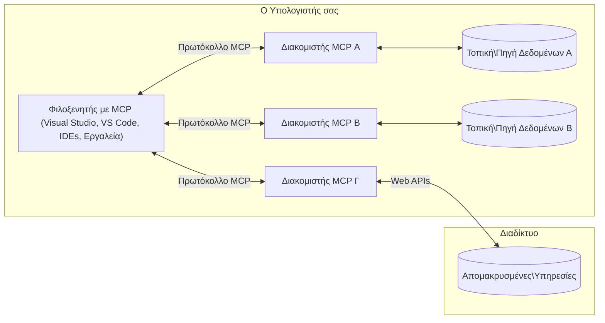

# Κύριες Έννοιες MCP: Κατάκτηση του Πρωτοκόλλου Πλαισίου Μοντέλου για Ενσωμάτωση Τεχνητής Νοημοσύνης

[](https://youtu.be/earDzWGtE84)

_(Κάντε κλικ στην εικόνα παραπάνω για να δείτε το βίντεο αυτής της μαθήματος)_

Το [Πρωτόκολλο Πλαισίου Μοντέλου (MCP)](https://github.com/modelcontextprotocol) είναι ένα ισχυρό, τυποποιημένο πλαίσιο που βελτιστοποιεί την επικοινωνία μεταξύ Μεγάλων Γλωσσικών Μοντέλων (LLMs) και εξωτερικών εργαλείων, εφαρμογών και πηγών δεδομένων. 
Αυτός ο οδηγός θα σας καθοδηγήσει μέσα από τις βασικές έννοιες του MCP. Θα μάθετε για την αρχιτεκτονική πελάτη-διακομιστή, τα βασικά στοιχεία, τις μηχανικές επικοινωνίας και τις βέλτιστες πρακτικές υλοποίησης.

- **Εμπεριστατωμένη Συγκατάθεση Χρήστη**: Όλες οι πρόσβασεις δεδομένων και οι λειτουργίες απαιτούν ρητή έγκριση του χρήστη πριν από την εκτέλεση. Οι χρήστες πρέπει να κατανοούν σαφώς ποια δεδομένα θα προσπελαστούν και ποιες ενέργειες θα εκτελεστούν, με λεπτομερή έλεγχο αδειών και εξουσιοδοτήσεων.

- **Προστασία Ιδιωτικότητας Δεδομένων**: Τα δεδομένα χρηστών εκτίθενται μόνο με ρητή συγκατάθεση και πρέπει να προστατεύονται με ισχυρούς ελέγχους πρόσβασης καθ’ όλη τη διάρκεια της αλληλεπίδρασης. Οι υλοποιήσεις πρέπει να αποτρέπουν μη εξουσιοδοτημένη μετάδοση δεδομένων και να διατηρούν αυστηρά όρια ιδιωτικότητας.

- **Ασφάλεια Εκτέλεσης Εργαλείων**: Κάθε κλήση εργαλείου απαιτεί ρητή συγκατάθεση χρήστη με σαφή κατανόηση της λειτουργικότητας, των παραμέτρων και της πιθανής επίδρασης του εργαλείου. Ισχυρά όρια ασφαλείας πρέπει να αποτρέπουν την ανεπιθύμητη, μη ασφαλή ή κακόβουλη εκτέλεση εργαλείων.

- **Ασφάλεια Επιπέδου Μεταφοράς**: Όλα τα κανάλια επικοινωνίας πρέπει να χρησιμοποιούν κατάλληλα μηχανισμούς κρυπτογράφησης και αυθεντικοποίησης. Οι απομακρυσμένες συνδέσεις πρέπει να εφαρμόζουν ασφαλή πρωτόκολλα μεταφοράς και σωστή διαχείριση διαπιστευτηρίων.

#### Οδηγίες Υλοποίησης:

- **Διαχείριση Αδειών**: Εφαρμόστε λεπτομερή συστήματα αδειών που επιτρέπουν στους χρήστες να ελέγχουν ποιοι διακομιστές, εργαλεία και πόροι είναι προσβάσιμοι
- **Αυθεντικοποίηση & Εξουσιοδότηση**: Χρησιμοποιήστε ασφαλείς μεθόδους αυθεντικοποίησης (OAuth, API keys) με σωστή διαχείριση και λήξη διακριτικών  
- **Επικύρωση Εισόδου**: Επικυρώστε όλες τις παραμέτρους και τις εισόδους δεδομένων σύμφωνα με ορισμένα σχήματα για την αποτροπή επιθέσεων injection
- **Καταγραφή Λογαριασμών**: Διατηρήστε ολοκληρωμένα αρχεία όλων των λειτουργιών για παρακολούθηση ασφαλείας και συμμόρφωση

## Επισκόπηση

Αυτό το μάθημα εξερευνά τη θεμελιώδη αρχιτεκτονική και τα στοιχεία που συνθέτουν το οικοσύστημα του Πρωτοκόλλου Πλαισίου Μοντέλου (MCP). Θα μάθετε για την αρχιτεκτονική πελάτη-διακομιστή, τα βασικά στοιχεία και τους μηχανισμούς επικοινωνίας που τροφοδοτούν τις αλληλεπιδράσεις MCP.

## Κύριοι Στόχοι Μάθησης

Μέχρι το τέλος αυτού του μαθήματος, θα:

- Κατανοήσετε την αρχιτεκτονική πελάτη-διακομιστή του MCP.
- Αναγνωρίσετε ρόλους και ευθύνες των Κεντρικών Υπολογιστών (Hosts), Πελατών (Clients) και Διακομιστών (Servers).
- Αναλύσετε τα βασικά χαρακτηριστικά που καθιστούν το MCP ευέλικτο επίπεδο ενσωμάτωσης.
- Μάθετε πώς ρέει η πληροφορία μέσα στο οικοσύστημα MCP.
- Αποκτήσετε πρακτικές γνώσεις μέσω παραδειγμάτων κώδικα σε .NET, Java, Python, και JavaScript.

## Αρχιτεκτονική MCP: Μια Βαθύτερη Ματιά

Το οικοσύστημα MCP είναι χτισμένο σε μοντέλο πελάτη-διακομιστή. Αυτή η αρθρωτή δομή επιτρέπει σε εφαρμογές AI να αλληλεπιδρούν αποδοτικά με εργαλεία, βάσεις δεδομένων, APIs, και περιβαλλοντικούς πόρους. Ας αναλύσουμε αυτή την αρχιτεκτονική στα βασικά της στοιχεία.

Στον πυρήνα του, το MCP ακολουθεί αρχιτεκτονική πελάτη-διακομιστή όπου μια εφαρμογή κεντρικού υπολογιστή μπορεί να συνδεθεί με πολλούς διακομιστές:



- **Κεντρικοί Υπολογιστές MCP (Hosts)**: Προγράμματα όπως VSCode, Claude Desktop, IDEs, ή εργαλεία AI που θέλουν να έχουν πρόσβαση σε δεδομένα μέσω MCP
- **Πελάτες MCP (Clients)**: Πρωτοκολλικά προγράμματα πελάτες που διατηρούν 1:1 συνδέσεις με διακομιστές
- **Διακομιστές MCP (Servers)**: Ελαφρύ προγράμματα που εκθέτουν συγκεκριμένες δυνατότητες μέσω του τυποποιημένου Πρωτοκόλλου Πλαισίου Μοντέλου
- **Τοπικές Πηγές Δεδομένων**: Αρχεία, βάσεις δεδομένων και υπηρεσίες του υπολογιστή σας στις οποίες οι διακομιστές MCP μπορούν να έχουν ασφαλή πρόσβαση
- **Απομακρυσμένες Υπηρεσίες**: Εξωτερικά συστήματα διαθέσιμα μέσω διαδικτύου με τα οποία οι διακομιστές MCP μπορούν να συνδεθούν μέσω APIs.

Το Πρωτόκολλο MCP είναι ένα εξελισσόμενο πρότυπο χρησιμοποιώντας εκδόσεις με βάσει την ημερομηνία (μορφή YYYY-MM-DD). Η τρέχουσα έκδοση του πρωτοκόλλου είναι **2025-11-25**. Μπορείτε να δείτε τις τελευταίες ενημερώσεις στην [προδιαγραφή πρωτοκόλλου](https://modelcontextprotocol.io/specification/2025-11-25/)

> **Προοπτική:** ένας υποψήφιος για κυκλοφορία της επόμενης έκδοσης προδιαγραφών, **2026-07-28**, ανακοινώθηκε τον Μάιο του 2026 και έχει προγραμματιστεί να κυκλοφορήσει στις 28 Ιουλίου 2026. Κάνει το πρωτόκολλο χωρίς κατάσταση στο επίπεδο μεταφοράς (αφαιρώντας το χειραψία `initialize` και τα IDs συνεδρίας), θεσμοθετεί ένα πλαίσιο Επεκτάσεων, και αποσύρει τις Ρίζες, τη Δειγματοληψία και την Καταγραφή υπέρ νεότερων προτύπων. Δείτε [Τι αλλάζει στο MCP: Ο υποψήφιος έκδοσης 2026-07-28](./mcp-2026-07-28-release-candidate.md) για πλήρη ανάλυση.

### 1. Κεντρικοί Υπολογιστές

Στο Πρωτόκολλο Πλαισίου Μοντέλου (MCP), οι **Κεντρικοί Υπολογιστές (Hosts)** είναι εφαρμογές AI που λειτουργούν ως το βασικό περιβάλλον μέσω του οποίου οι χρήστες αλληλεπιδρούν με το πρωτόκολλο. Οι Hosts συντονίζουν και διαχειρίζονται συνδέσεις με πολλούς διακομιστές MCP δημιουργώντας αφιερωμένους πελάτες MCP για κάθε σύνδεση διακομιστή. Παραδείγματα Hosts περιλαμβάνουν:

- **Εφαρμογές Τεχνητής Νοημοσύνης**: Claude Desktop, Visual Studio Code, Claude Code
- **Περιβάλλοντα Ανάπτυξης**: IDEs και επεξεργαστές κώδικα με ενσωμάτωση MCP  
- **Προσαρμοσμένες Εφαρμογές**: Εξειδικευμένοι πράκτορες AI και εργαλεία

Οι **Κεντρικοί Υπολογιστές** είναι εφαρμογές που συντονίζουν τις αλληλεπιδράσεις μοντέλων AI. Αυτοί:

- **Ορχηστρώνουν τα Μοντέλα AI**: Εκτελούν ή αλληλεπιδρούν με LLMs για να παράγουν απαντήσεις και να συντονίζουν ροές εργασίας AI
- **Διαχειρίζονται τις Συνδέσεις Πελατών**: Δημιουργούν και διατηρούν έναν MCP πελάτη για κάθε σύνδεση MCP διακομιστή
- **Ελέγχουν το Περιβάλλον Χρήστη**: Διαχειρίζονται τη ροή συνομιλίας, τις αλληλεπιδράσεις χρηστών και την παρουσίαση απαντήσεων  
- **Επιβάλλουν Ασφάλεια**: Ελέγχουν τα δικαιώματα, τους περιορισμούς ασφαλείας και την αυθεντικοποίηση
- **Διαχειρίζονται τη Συγκατάθεση Χρήστη**: Διαχειρίζονται την έγκριση χρηστών για κοινοποίηση δεδομένων και εκτέλεση εργαλείων


### 2. Πελάτες

Οι **Πελάτες** είναι βασικά στοιχεία που διατηρούν αποκλειστικές, αμφίδρομες συνδέσεις μεταξύ των Hosts και των διακομιστών MCP. Κάθε MCP πελάτης δημιουργείται από τον Host για να συνδεθεί με έναν συγκεκριμένο διακομιστή MCP, εξασφαλίζοντας οργανωμένα και ασφαλή κανάλια επικοινωνίας. Πολλοί πελάτες επιτρέπουν στους Hosts να συνδεθούν με πολλαπλούς διακομιστές ταυτόχρονα.

Οι **Πελάτες** είναι συνδετικές μονάδες μέσα στην εφαρμογή host. Αυτοί:

- **Επικοινωνία Πρωτοκόλλου**: Αποστέλλουν αιτήματα JSON-RPC 2.0 προς διακομιστές με προτροπές και οδηγίες
- **Διαπραγμάτευση Δυνατοτήτων**: Διαπραγματεύονται υποστηριζόμενες λειτουργίες και εκδόσεις πρωτοκόλλου με διακομιστές κατά την αρχικοποίηση
- **Εκτέλεση Εργαλείων**: Διαχειρίζονται αιτήματα εκτέλεσης εργαλείων από μοντέλα και επεξεργάζονται απαντήσεις
- **Ενημερώσεις σε Πραγματικό Χρόνο**: Διαχειρίζονται ειδοποιήσεις και ζωντανές ενημερώσεις από διακομιστές
- **Επεξεργασία Απαντήσεων**: Επεξεργάζονται και διαμορφώνουν τις απαντήσεις διακομιστών για εμφάνιση στους χρήστες

### 3. Διακομιστές

Οι **Διακομιστές** είναι προγράμματα που παρέχουν πλαίσιο, εργαλεία και δυνατότητες στους πελάτες MCP. Μπορούν να εκτελούνται τοπικά (στον ίδιο υπολογιστή με τον Host) ή απομακρυσμένα (σε εξωτερικές πλατφόρμες) και είναι υπεύθυνοι για τη διαχείριση αιτημάτων πελατών και παροχή δομημένων απαντήσεων. Οι διακομιστές εκθέτουν συγκεκριμένη λειτουργικότητα μέσω του τυποποιημένου Πρωτοκόλλου Πλαισίου Μοντέλου.

Οι **Διακομιστές** είναι υπηρεσίες που παρέχουν πλαίσιο και δυνατότητες. Αυτοί:

- **Εγγραφή Χαρακτηριστικών**: Εγγράφουν και εκθέτουν διαθέσιμες πρωτογενείς λειτουργίες (πόρους, προτροπές, εργαλεία) στους πελάτες
- **Επεξεργασία Αιτημάτων**: Λαμβάνουν και εκτελούν κλήσεις εργαλείων, αιτήματα πόρων και αιτήματα προτροπής από πελάτες
- **Παροχή Πλαισίου**: Παρέχουν περιβάλλοντα πληροφοριών και δεδομένα για βελτίωση των απαντήσεων μοντέλου
- **Διαχείριση Κατάστασης**: Διατηρούν κατάσταση συνεδρίας και χειρίζονται διαδραστικές καταστάσεις όταν απαιτείται
- **Ειδοποιήσεις σε Πραγματικό Χρόνο**: Αποστέλλουν ενημερώσεις για αλλαγές δυνατοτήτων και ενημερώσεις στους συνδεδεμένους πελάτες

Οι διακομιστές μπορούν να αναπτυχθούν από οποιονδήποτε για να επεκτείνουν τις δυνατότητες μοντέλου με εξειδικευμένη λειτουργικότητα και υποστηρίζουν τόσο τοπικές όσο και απομακρυσμένες περιπτώσεις ανάπτυξης.

### 4. Πρωτογενείς Λειτουργίες Διακομιστή

Οι διακομιστές στο Πρωτόκολλο Πλαισίου Μοντέλου (MCP) παρέχουν τρεις βασικές **πρωτογενείς λειτουργίες** που ορίζουν τα θεμελιώδη δομικά στοιχεία για πλούσιες αλληλεπιδράσεις μεταξύ πελατών, hosts και γλωσσικών μοντέλων. Αυτές οι πρωτογενείς καθορίζουν τους τύπους πλαισίου πληροφορίας και τις διαθέσιμες ενέργειες μέσω του πρωτοκόλλου.

Οι διακομιστές MCP μπορούν να εκθέτουν οποιονδήποτε συνδυασμό των τριών αυτών βασικών πρωτογενών:

#### Πόροι 

Οι **Πόροι** είναι πηγές δεδομένων που παρέχουν πληροφορία πλαισίου σε εφαρμογές AI. Αντιπροσωπεύουν στατικό ή δυναμικό περιεχόμενο που μπορεί να βελτιώσει την κατανόηση και τη λήψη αποφάσεων του μοντέλου:

- **Δεδομένα Πλαισίου**: Δομημένες πληροφορίες και πλαίσιο για κατανάλωση από μοντέλα AI
- **Βάσεις Γνώσης**: Αποθετήρια εγγράφων, άρθρα, εγχειρίδια και ερευνητικά έγγραφα
- **Τοπικές Πηγές Δεδομένων**: Αρχεία, βάσεις δεδομένων και πληροφορίες τοπικού συστήματος  
- **Εξωτερικά Δεδομένα**: Απαντήσεις API, διαδικτυακές υπηρεσίες και δεδομένα απομακρυσμένων συστημάτων
- **Δυναμικό Περιεχόμενο**: Δεδομένα σε πραγματικό χρόνο που ενημερώνονται με βάση εξωτερικές συνθήκες

Οι Πόροι αναγνωρίζονται με URIs και υποστηρίζουν ανακάλυψη μέσω των μεθόδων `resources/list` και ανάκτηση μέσω `resources/read`:

```text
file://documents/project-spec.md
database://production/users/schema
api://weather/current
```

#### Προτροπές

Οι **Προτροπές** είναι επαναχρησιμοποιούμενα πρότυπα που βοηθούν στη δομή των αλληλεπιδράσεων με γλωσσικά μοντέλα. Παρέχουν τυποποιημένα πρότυπα αλληλεπίδρασης και διαμορφωμένες ροές εργασίας:

- **Αλληλεπιδράσεις Βασισμένες σε Πρότυπα**: Προδιαμορφωμένα μηνύματα και αφετηρίες συνομιλίας
- **Πρότυπα Ροών Εργασίας**: Τυποποιημένες αλληλουχίες για κοινές εργασίες και αλληλεπιδράσεις
- **Λίγα Παραδείγματα**: Πρότυπα βάσει παραδειγμάτων για οδηγίες μοντέλου
- **Σύστημα Προτροπών**: Θεμελιώδεις προτροπές που ορίζουν τη συμπεριφορά και το πλαίσιο του μοντέλου
- **Δυναμικά Πρότυπα**: Παραμετροποιημένες προτροπές που προσαρμόζονται σε συγκεκριμένα πλαίσια

Οι Προτροπές υποστηρίζουν αντικατάσταση μεταβλητών και μπορούν να ανακαλυφθούν μέσω `prompts/list` και να ανακτηθούν με `prompts/get`:

```markdown
Generate a {{task_type}} for {{product}} targeting {{audience}} with the following requirements: {{requirements}}
```

#### Εργαλεία

Τα **Εργαλεία** είναι εκτελέσιμες λειτουργίες που τα μοντέλα AI μπορούν να καλούν για να επιτελέσουν συγκεκριμένες ενέργειες. Αντιπροσωπεύουν τα "ρήματα" του οικοσυστήματος MCP, επιτρέποντας στα μοντέλα να αλληλεπιδρούν με εξωτερικά συστήματα:

- **Εκτελέσιμες Λειτουργίες**: Διακριτές λειτουργίες που τα μοντέλα μπορούν να καλούν με συγκεκριμένες παραμέτρους
- **Ενσωμάτωση Εξωτερικών Συστημάτων**: Κλήσεις API, ερωτήματα βάσεων δεδομένων, λειτουργίες αρχείων, υπολογισμοί
- **Μοναδική Ταυτότητα**: Κάθε εργαλείο έχει ξεχωριστό όνομα, περιγραφή και σχήμα παραμέτρων
- **Δομημένη Είσοδος/Έξοδος**: Τα εργαλεία δέχονται επικυρωμένες παραμέτρους και επιστρέφουν δομημένες, τυποποιημένες απαντήσεις
- **Δυνατότητες Ενεργειών**: Επιτρέπουν στα μοντέλα να επιτελούν πραγματικές ενέργειες και να ανακτούν ζωντανά δεδομένα

Τα εργαλεία ορίζονται με JSON Schema για την επικύρωση παραμέτρων και ανακαλύπτονται μέσω `tools/list` και εκτελούνται με `tools/call`. Τα εργαλεία μπορούν επίσης να περιλαμβάνουν **εικονίδια** ως επιπλέον μεταδεδομένα για καλύτερη παρουσίαση UI.

**Σημειώσεις Εργαλείων**: Τα εργαλεία υποστηρίζουν συμπεριφορικές σημειώσεις (π.χ., `readOnlyHint`, `destructiveHint`) που περιγράφουν εάν ένα εργαλείο είναι μόνο για ανάγνωση ή καταστροφικό, βοηθώντας τους πελάτες να λαμβάνουν ενημερωμένες αποφάσεις για την εκτέλεση εργαλείων.

Παράδειγμα ορισμού εργαλείου:

```typescript
server.tool(
  "search_products", 
  {
    query: z.string().describe("Search query for products"),
    category: z.string().optional().describe("Product category filter"),
    max_results: z.number().default(10).describe("Maximum results to return")
  }, 
  async (params) => {
    // Εκτέλεση αναζήτησης και επιστροφή δομημένων αποτελεσμάτων
    return await productService.search(params);
  }
);
```

## Πρωτογενείς Λειτουργίες Πελατών

Στο Πρωτόκολλο Πλαισίου Μοντέλου (MCP), οι **πελάτες** μπορούν να εκθέτουν πρωτογενείς που επιτρέπουν στους διακομιστές να αιτούνται επιπλέον δυνατότητες από την εφαρμογή host. Αυτές οι πλευρικές πρωτογενείς πελάτη επιτρέπουν πιο πλούσιες, διαδραστικές υλοποιήσεις διακομιστών που μπορούν να έχουν πρόσβαση σε δυνατότητες μοντέλου AI και αλληλεπιδράσεις χρηστών.

### Δειγματοληψία

> **Ειδοποίηση απόσυρσης:** ο υποψήφιος έκδοσης `2026-07-28` σηματοδοτεί τη Δειγματοληψία ως αποσυρμένη υπέρ της άμεσης ενσωμάτωσης με τα APIs παρόχων LLM. Συνεχίζει να λειτουργεί στο `2025-11-25` και για τουλάχιστον ένα χρόνο μετά από κάθε απόσυρση, αλλά τα νέα σχέδια πρέπει να προτιμούν το υποκατάστατο πρότυπο. Δείτε [Τι αλλάζει στο MCP: Ο υποψήφιος έκδοσης 2026-07-28](./mcp-2026-07-28-release-candidate.md).

Η **Δειγματοληψία** επιτρέπει στους διακομιστές να αιτούνται συμπληρώσεις γλωσσικού μοντέλου από την εφαρμογή AI του πελάτη. Αυτή η πρωτογενής επιτρέπει στους διακομιστές να έχουν πρόσβαση σε δυνατότητες LLM χωρίς να ενσωματώνουν δικές τους εξαρτήσεις μοντέλου:

- **Πρόσβαση Ανεξάρτητη από το Μοντέλο**: Οι διακομιστές μπορούν να αιτούνται συμπληρώσεις χωρίς να περιλαμβάνουν SDKs LLM ή να διαχειρίζονται πρόσβαση μοντέλου
- **AI που Ενεργοποιείται από Διακομιστή**: Επιτρέπει στους διακομιστές να δημιουργούν αυτόνομα περιεχόμενο χρησιμοποιώντας το AI μοντέλο του πελάτη
- **Αναδρομικές Αλληλεπιδράσεις LLM**: Υποστηρίζει πολύπλοκα σενάρια όπου οι διακομιστές χρειάζονται υποστήριξη AI για επεξεργασία
- **Δημιουργία Δυναμικού Περιεχομένου**: Επιτρέπει στους διακομιστές να δημιουργούν απαντήσεις πλαισίου χρησιμοποιώντας το μοντέλο του host
- **Υποστήριξη Κλήσης Εργαλείων**: Οι διακομιστές μπορούν να περιλαμβάνουν τις παραμέτρους `tools` και `toolChoice` για να επιτρέψουν στο μοντέλο του πελάτη να καλεί εργαλεία κατά τη δειγματοληψία

Η δειγματοληψία ξεκινά μέσω της μεθόδου `sampling/complete`, όπου οι διακομιστές στέλνουν αιτήματα συμπλήρωσης προς τους πελάτες.

### Ρίζες

> **Ειδοποίηση απόσυρσης:** ο υποψήφιος έκδοσης `2026-07-28` σηματοδοτεί τις Ρίζες ως αποσυρμένες υπέρ παραμέτρων εργαλείων, URI πόρων ή ρύθμισης διακομιστή. Συνεχίζουν να λειτουργούν στο `2025-11-25` και για τουλάχιστον ένα χρόνο μετά από απόσυρση. Δείτε [Τι αλλάζει στο MCP: Ο υποψήφιος έκδοσης 2026-07-28](./mcp-2026-07-28-release-candidate.md).

Οι **Ρίζες** παρέχουν έναν τυποποιημένο τρόπο για τους πελάτες να εκθέτουν τα όρια του συστήματος αρχείων στους διακομιστές, βοηθώντας τους να κατανοήσουν σε ποιους φακέλους και αρχεία έχουν πρόσβαση:

- **Όρια Συστήματος Αρχείων**: Ορίζουν τα όρια εντός των οποίων οι διακομιστές μπορούν να λειτουργούν στο σύστημα αρχείων
- **Έλεγχος Πρόσβασης**: Βοηθούν τους διακομιστές να κατανοήσουν τους φακέλους και αρχεία στα οποία έχουν δικαίωμα πρόσβασης
- **Δυναμικές Ενημερώσεις**: Οι πελάτες μπορούν να ειδοποιούν τους διακομιστές όταν η λίστα ριζών αλλάζει
- **Ταυτοποίηση Βασισμένη σε URI**: Οι Ρίζες χρησιμοποιούν URIs τύπου `file://` για να αναγνωρίζουν τους προσβάσιμους φακέλους και αρχεία

Οι ρίζες ανακαλύπτονται μέσω της μεθόδου `roots/list`, με τους πελάτες να στέλνουν `notifications/roots/list_changed` όταν οι ρίζες αλλάζουν.

### Αφαίρεση  

Η **Αφαίρεση (Elicitation)** επιτρέπει στους διακομιστές να αιτούνται επιπλέον πληροφορίες ή επιβεβαίωση από τους χρήστες μέσω της διεπαφής πελάτη:

- **Αιτήματα Εισόδου Χρήστη**: Οι διακομιστές μπορούν να ζητούν επιπλέον πληροφορίες όταν χρειάζεται για την εκτέλεση εργαλείων
- **Διάλογοι Επιβεβαίωσης**: Αιτούν έγκριση χρήστη για ευαίσθητες ή σημαντικές λειτουργίες
- **Διαδραστικές Ροές Εργασίας**: Επιτρέπουν στους διακομιστές να δημιουργούν βήμα-βήμα αλληλεπιδράσεις με χρήστες
- **Δυναμική Συλλογή Παραμέτρων**: Συγκεντρώνουν ελλιπείς ή προαιρετικές παραμέτρους κατά την εκτέλεση εργαλείου

Τα αιτήματα Αφαίρεσης γίνονται με τη μέθοδο `elicitation/request` για συλλογή εισόδου από τη διεπαφή του πελάτη.

**Αφαίρεση σε Λειτουργία URL**: Οι διακομιστές μπορούν επίσης να αιτούνται αλληλεπιδράσεις χρήστη που βασίζονται σε URL, επιτρέποντας στους διακομιστές να κατευθύνουν τους χρήστες σε εξωτερικές ιστοσελίδες για αυθεντικοποίηση, επιβεβαίωση ή εισαγωγή δεδομένων.

### Καταγραφή


> **Ειδοποίηση απόσυρσης:** η έκδοση υποψηφίου `2026-07-28` σηματοδοτεί την απόσυρση του Logging υπέρ του `stderr` για τις μεταφορές stdio και του OpenTelemetry για δομημένη παρατηρησιμότητα. Συνεχίζει να λειτουργεί στο `2025-11-25` και για τουλάχιστον ένα έτος μετά από οποιαδήποτε απόσυρση. Δείτε [Τι αλλάζει στο MCP: Η έκδοση υποψηφίου 2026-07-28](./mcp-2026-07-28-release-candidate.md).

**Το Logging** επιτρέπει στους διακομιστές να στέλνουν δομημένα μηνύματα καταγραφής στους πελάτες για εντοπισμό σφαλμάτων, παρακολούθηση και επιχειρησιακή διαφάνεια:

- **Υποστήριξη Εντοπισμού Σφαλμάτων**: Δίνει τη δυνατότητα στους διακομιστές να παρέχουν λεπτομερή αρχεία εκτέλεσης για αντιμετώπιση προβλημάτων
- **Λειτουργική Παρακολούθηση**: Αποστέλλει ενημερώσεις κατάστασης και μετρικές απόδοσης στους πελάτες
- **Αναφορά Σφαλμάτων**: Παρέχει λεπτομερές πλαίσιο σφάλματος και διαγνωστικές πληροφορίες
- **Αρχεία Ελέγχου**: Δημιουργεί ολοκληρωμένα αρχεία καταγραφής των λειτουργιών και αποφάσεων του διακομιστή

Τα μηνύματα καταγραφής αποστέλλονται στους πελάτες για να παρέχουν διαφάνεια στις λειτουργίες του διακομιστή και να διευκολύνουν τον εντοπισμό σφαλμάτων.

## Ροή Πληροφοριών στο MCP

Το Πρωτόκολλο Πλαισίου Μοντέλου (MCP) ορίζει μια δομημένη ροή πληροφοριών μεταξύ κεντρικών υπολογιστών, πελατών, διακομιστών και μοντέλων. Η κατανόηση αυτής της ροής βοηθά στην αποσαφήνιση του πώς επεξεργάζονται τα αιτήματα των χρηστών και πώς εξωτερικά εργαλεία και δεδομένα ενσωματώνονται στις απαντήσεις των μοντέλων.

- **Ο κεντρικός υπολογιστής ξεκινά τη σύνδεση**  
  Η εφαρμογή κεντρικού υπολογιστή (όπως ένα IDE ή διεπαφή συνομιλίας) εγκαθιστά σύνδεση με έναν διακομιστή MCP, συνήθως μέσω STDIO, WebSocket ή κάποιας άλλης υποστηριζόμενης μεταφοράς.

- **Διαπραγμάτευση Δυνατοτήτων**  
  Ο πελάτης (ενσωματωμένος στον κεντρικό υπολογιστή) και ο διακομιστής ανταλλάσσουν πληροφορίες σχετικά με τα υποστηριζόμενα χαρακτηριστικά, εργαλεία, πόρους και εκδόσεις πρωτοκόλλου. Αυτό διασφαλίζει ότι και οι δύο πλευρές κατανοούν τις διαθέσιμες δυνατότητες για τη συνεδρία.

- **Αίτημα Χρήστη**  
  Ο χρήστης αλληλεπιδρά με τον κεντρικό υπολογιστή (π.χ. εισάγει μια εντολή ή προτροπή). Ο κεντρικός υπολογιστής συλλέγει αυτή την είσοδο και την προωθεί στον πελάτη για επεξεργασία.

- **Χρήση Πόρου ή Εργαλείου**  
  - Ο πελάτης μπορεί να ζητήσει επιπλέον πλαίσιο ή πόρους από τον διακομιστή (όπως αρχεία, καταχωρήσεις βάσης δεδομένων ή άρθρα γνώσης) για να εμπλουτίσει την κατανόηση του μοντέλου.
  - Εάν το μοντέλο κρίνει ότι χρειάζεται κάποιο εργαλείο (π.χ. για να αντλήσει δεδομένα, να εκτελέσει υπολογισμό ή να καλέσει ένα API), ο πελάτης στέλνει αίτημα εκτέλεσης εργαλείου στον διακομιστή, προσδιορίζοντας το όνομα και τις παραμέτρους του εργαλείου.

- **Εκτέλεση από τον Διακομιστή**  
  Ο διακομιστής λαμβάνει το αίτημα για πόρο ή εργαλείο, εκτελεί τις απαραίτητες ενέργειες (όπως την εκτέλεση συνάρτησης, ερώτημα βάσης δεδομένων ή ανάκτηση αρχείου) και επιστρέφει τα αποτελέσματα στον πελάτη σε δομημένη μορφή.

- **Δημιουργία Απόκρισης**  
  Ο πελάτης ενσωματώνει τις απαντήσεις του διακομιστή (δεδομένα πόρων, εξαγόμενα εργαλείων κ.λπ.) στη συνεχιζόμενη αλληλεπίδραση με το μοντέλο. Το μοντέλο χρησιμοποιεί αυτές τις πληροφορίες για να δημιουργήσει μια ολοκληρωμένη και συμφραζόμενη αντίδραση.

- **Παρουσίαση Αποτελέσματος**  
  Ο κεντρικός υπολογιστής λαμβάνει την τελική έξοδο από τον πελάτη και την παρουσιάζει στον χρήστη, συχνά συμπεριλαμβάνοντας τόσο το κείμενο που δημιούργησε το μοντέλο όσο και τα αποτελέσματα από την εκτέλεση εργαλείων ή αναζητήσεις πόρων.

Αυτή η ροή επιτρέπει στο MCP να υποστηρίζει προηγμένες, διαδραστικές και ευαίσθητες στο περιεχόμενο εφαρμογές ΤΝ, συνδέοντας απρόσκοπτα τα μοντέλα με εξωτερικά εργαλεία και πηγές δεδομένων.

## Αρχιτεκτονική & Επίπεδα Πρωτοκόλλου

Το MCP αποτελείται από δύο διακριτά αρχιτεκτονικά επίπεδα που συνεργάζονται για να παρέχουν ένα πλήρες πλαίσιο επικοινωνίας:

### Επίπεδο Δεδομένων

Το **Επίπεδο Δεδομένων** υλοποιεί τον βασικό πρωτόκολλο MCP χρησιμοποιώντας ως βάση το **JSON-RPC 2.0**. Αυτό το επίπεδο ορίζει τη δομή των μηνυμάτων, τη σημασιολογία και τα πρότυπα αλληλεπίδρασης:

#### Βασικά Συστατικά:

- **Πρωτόκολλο JSON-RPC 2.0**: Όλη η επικοινωνία χρησιμοποιεί το τυποποιημένο μορφότυπο μηνυμάτων JSON-RPC 2.0 για κλήσεις μεθόδων, απαντήσεις και ειδοποιήσεις
- **Διαχείριση Κύκλου Ζωής**: Διαχειρίζεται την αρχικοποίηση της σύνδεσης, τη διαπραγμάτευση δυνατοτήτων και τον τερματισμό της συνεδρίας μεταξύ πελατών και διακομιστών
- **Βασικές Δυνατότητες Διακομιστή**: Επιτρέπει στους διακομιστές να παρέχουν βασική λειτουργικότητα μέσω εργαλείων, πόρων και προτροπών
- **Βασικές Δυνατότητες Πελάτη**: Επιτρέπει στους διακομιστές να ζητούν λήψη δειγμάτων από LLM, να καλούν σε εισαγωγή χρήστη και να στέλνουν μηνύματα καταγραφής
- **Ειδοποιήσεις σε Πραγματικό Χρόνο**: Υποστηρίζει ασύγχρονες ειδοποιήσεις για δυναμικές ενημερώσεις χωρίς polling

#### Κύρια Χαρακτηριστικά:

- **Διαπραγμάτευση Έκδοσης Πρωτοκόλλου**: Χρησιμοποιεί χρονολογίες (YYYY-MM-DD) για να διασφαλίσει συμβατότητα
- **Ανακάλυψη Δυνατοτήτων**: Οι πελάτες και οι διακομιστές ανταλλάσσουν πληροφορίες υποστηριζόμενων χαρακτηριστικών κατά την αρχικοποίηση
- **Πολύπλευρες Συνεδρίες**: Διατηρεί την κατάσταση σύνδεσης σε πολλαπλές αλληλεπιδράσεις για συνέχεια πλαισίου

### Επίπεδο Μεταφοράς

Το **Επίπεδο Μεταφοράς** διαχειρίζεται τα κανάλια επικοινωνίας, τη διαμόρφωση μηνυμάτων και την αυθεντικοποίηση μεταξύ των συμμετεχόντων MCP:

#### Υποστηριζόμενοι Μηχανισμοί Μεταφοράς:

1. **Μεταφορά STDIO**:
   - Χρησιμοποιεί τα πρότυπα streams εισόδου/εξόδου για απευθείας επικοινωνία διεργασιών
   - Βέλτιστο για τοπικές διεργασίες στην ίδια μηχανή χωρίς φόρτο δικτύου
   - Συχνά χρησιμοποιείται για υλοποιήσεις τοπικών MCP διακομιστών

2. **Μεταφορά HTTP με Ροές**:
   - Χρησιμοποιεί HTTP POST για μηνύματα από πελάτη σε διακομιστή  
   - Προαιρετικά Server-Sent Events (SSE) για streaming από διακομιστή σε πελάτη
   - Επιτρέπει απομακρυσμένη επικοινωνία διακομιστών μέσω δικτύων
   - Υποστηρίζει τυποποιημένη αυθεντικοποίηση HTTP (bearer tokens, κλειδιά API, προσαρμοσμένες κεφαλίδες)
   - Το MCP προτείνει OAuth για ασφαλή αυθεντικοποίηση με tokens

#### Αφαίρεση Μεταφοράς:

Το επίπεδο μεταφοράς αφαιρεί τις λεπτομέρειες επικοινωνίας από το επίπεδο δεδομένων, επιτρέποντας τον ίδιο μορφότυπο μηνύματος JSON-RPC 2.0 σε όλους τους μηχανισμούς μεταφοράς. Αυτή η αφαίρεση επιτρέπει στις εφαρμογές να εναλλάσσουν εύκολα διακομιστές τοπικούς και απομακρυσμένους.

### Ζητήματα Ασφαλείας

Οι υλοποιήσεις MCP πρέπει να τηρούν πολλές κρίσιμες αρχές ασφαλείας για να διασφαλίζουν ασφαλείς, αξιόπιστες και προστατευμένες αλληλεπιδράσεις σε όλες τις λειτουργίες του πρωτοκόλλου:

- **Συναίνεση και Έλεγχος Χρήστη**: Οι χρήστες πρέπει να παρέχουν ρητή συναίνεση πριν γίνει πρόσβαση σε δεδομένα ή εκτέλεση ενεργειών. Πρέπει να έχουν σαφή έλεγχο όσων δεδομένων μοιράζονται και ποιας δράσης επιτρέπεται, υποστηριζόμενοι από εύχρηστα διεπαφές για αναθεώρηση και έγκριση.

- **Απόρρητο Δεδομένων**: Τα δεδομένα των χρηστών πρέπει να εκτίθενται μόνο με ρητή συναίνεση και να προστατεύονται με κατάλληλους ελέγχους πρόσβασης. Οι υλοποιήσεις MCP πρέπει να αποτρέπουν μη εξουσιοδοτημένη μετάδοση δεδομένων και να διατηρούν το απόρρητο σε όλη τη διάρκεια των αλληλεπιδράσεων.

- **Ασφάλεια Εργαλείων**: Πριν από την εκκίνηση οποιουδήποτε εργαλείου, απαιτείται ρητή συναίνεση του χρήστη. Οι χρήστες πρέπει να κατανοούν τη λειτουργικότητα κάθε εργαλείου και πρέπει να εφαρμόζονται αυστηρά όρια ασφαλείας για να αποφεύγεται η μη επιθυμητή ή επικίνδυνη εκτέλεση εργαλείων.

Ακολουθώντας αυτές τις αρχές ασφαλείας, το MCP διασφαλίζει την εμπιστοσύνη του χρήστη, το απόρρητο και την προστασία, ενώ επιτρέπει ισχυρές ενσωματώσεις ΤΝ.

## Παραδείγματα Κώδικα: Βασικά Συστατικά

Παρακάτω παρουσιάζονται παραδείγματα κώδικα σε διάφορες δημοφιλείς γλώσσες προγραμματισμού που δείχνουν πώς να υλοποιήσετε βασικά συστατικά και εργαλεία διακομιστή MCP.

### Παράδειγμα .NET: Δημιουργία Απλού MCP Διακομιστή με Εργαλεία

Εδώ είναι ένα πρακτικό παράδειγμα .NET που επιδεικνύει πώς να υλοποιήσετε έναν απλό MCP διακομιστή με προσαρμοσμένα εργαλεία. Αυτό το παράδειγμα παρουσιάζει πώς να ορίσετε και να εγγράψετε εργαλεία, να χειριστείτε αιτήματα και να συνδέσετε τον διακομιστή χρησιμοποιώντας το Πρωτόκολλο Πλαισίου Μοντέλου.

```csharp
using System;
using System.Threading.Tasks;
using ModelContextProtocol.Server;
using ModelContextProtocol.Server.Transport;
using ModelContextProtocol.Server.Tools;

public class WeatherServer
{
    public static async Task Main(string[] args)
    {
        // Create an MCP server
        var server = new McpServer(
            name: "Weather MCP Server",
            version: "1.0.0"
        );
        
        // Register our custom weather tool
        server.AddTool<string, WeatherData>("weatherTool", 
            description: "Gets current weather for a location",
            execute: async (location) => {
                // Call weather API (simplified)
                var weatherData = await GetWeatherDataAsync(location);
                return weatherData;
            });
        
        // Connect the server using stdio transport
        var transport = new StdioServerTransport();
        await server.ConnectAsync(transport);
        
        Console.WriteLine("Weather MCP Server started");
        
        // Keep the server running until process is terminated
        await Task.Delay(-1);
    }
    
    private static async Task<WeatherData> GetWeatherDataAsync(string location)
    {
        // This would normally call a weather API
        // Simplified for demonstration
        await Task.Delay(100); // Simulate API call
        return new WeatherData { 
            Temperature = 72.5,
            Conditions = "Sunny",
            Location = location
        };
    }
}

public class WeatherData
{
    public double Temperature { get; set; }
    public string Conditions { get; set; }
    public string Location { get; set; }
}
```

### Παράδειγμα Java: Συστατικά MCP Διακομιστή

Αυτό το παράδειγμα επιδεικνύει τον ίδιο MCP διακομιστή και την εγγραφή εργαλείων όπως το παραπάνω παράδειγμα .NET, αλλά υλοποιημένο σε Java.

```java
import io.modelcontextprotocol.server.McpServer;
import io.modelcontextprotocol.server.McpToolDefinition;
import io.modelcontextprotocol.server.transport.StdioServerTransport;
import io.modelcontextprotocol.server.tool.ToolExecutionContext;
import io.modelcontextprotocol.server.tool.ToolResponse;

public class WeatherMcpServer {
    public static void main(String[] args) throws Exception {
        // Δημιουργήστε έναν διακομιστή MCP
        McpServer server = McpServer.builder()
            .name("Weather MCP Server")
            .version("1.0.0")
            .build();
            
        // Εγγραφείτε ένα εργαλείο καιρού
        server.registerTool(McpToolDefinition.builder("weatherTool")
            .description("Gets current weather for a location")
            .parameter("location", String.class)
            .execute((ToolExecutionContext ctx) -> {
                String location = ctx.getParameter("location", String.class);
                
                // Λάβετε δεδομένα καιρού (απλοποιημένα)
                WeatherData data = getWeatherData(location);
                
                // Επιστρέψτε διαμορφωμένη απάντηση
                return ToolResponse.content(
                    String.format("Temperature: %.1f°F, Conditions: %s, Location: %s", 
                    data.getTemperature(), 
                    data.getConditions(), 
                    data.getLocation())
                );
            })
            .build());
        
        // Συνδέστε τον διακομιστή χρησιμοποιώντας τη μεταφορά stdio
        try (StdioServerTransport transport = new StdioServerTransport()) {
            server.connect(transport);
            System.out.println("Weather MCP Server started");
            // Κρατήστε τον διακομιστή ενεργό μέχρι να τερματιστεί η διαδικασία
            Thread.currentThread().join();
        }
    }
    
    private static WeatherData getWeatherData(String location) {
        // Η υλοποίηση θα καλούσε ένα API καιρού
        // Απλοποιημένο για παράδειγμα χρήσης
        return new WeatherData(72.5, "Sunny", location);
    }
}

class WeatherData {
    private double temperature;
    private String conditions;
    private String location;
    
    public WeatherData(double temperature, String conditions, String location) {
        this.temperature = temperature;
        this.conditions = conditions;
        this.location = location;
    }
    
    public double getTemperature() {
        return temperature;
    }
    
    public String getConditions() {
        return conditions;
    }
    
    public String getLocation() {
        return location;
    }
}
```

### Παράδειγμα Python: Δημιουργία MCP Διακομιστή

Αυτό το παράδειγμα χρησιμοποιεί το fastmcp, οπότε παρακαλώ βεβαιωθείτε ότι το έχετε εγκαταστήσει πρώτα:

```python
pip install fastmcp
```
Code Sample:

```python
#!/usr/bin/env python3
import asyncio
from fastmcp import FastMCP
from fastmcp.transports.stdio import serve_stdio

# Δημιουργία ενός διακομιστή FastMCP
mcp = FastMCP(
    name="Weather MCP Server",
    version="1.0.0"
)

@mcp.tool()
def get_weather(location: str) -> dict:
    """Gets current weather for a location."""
    return {
        "temperature": 72.5,
        "conditions": "Sunny",
        "location": location
    }

# Εναλλακτική προσέγγιση χρησιμοποιώντας μια κλάση
class WeatherTools:
    @mcp.tool()
    def forecast(self, location: str, days: int = 1) -> dict:
        """Gets weather forecast for a location for the specified number of days."""
        return {
            "location": location,
            "forecast": [
                {"day": i+1, "temperature": 70 + i, "conditions": "Partly Cloudy"}
                for i in range(days)
            ]
        }

# Καταχώρηση εργαλείων κλάσης
weather_tools = WeatherTools()

# Εκκίνηση του διακομιστή
if __name__ == "__main__":
    asyncio.run(serve_stdio(mcp))
```

### Παράδειγμα JavaScript: Δημιουργία MCP Διακομιστή

Αυτό το παράδειγμα δείχνει τη δημιουργία MCP διακομιστή σε JavaScript και πώς να εγγράψετε δύο εργαλεία σχετικά με τον καιρό.

```javascript
// Χρησιμοποιώντας το επίσημο SDK του Model Context Protocol
import { McpServer } from "@modelcontextprotocol/sdk/server/mcp.js";
import { StdioServerTransport } from "@modelcontextprotocol/sdk/server/stdio.js";
import { z } from "zod"; // Για επαλήθευση παραμέτρων

// Δημιουργήστε έναν MCP διακομιστή
const server = new McpServer({
  name: "Weather MCP Server",
  version: "1.0.0"
});

// Ορίστε ένα εργαλείο καιρού
server.tool(
  "weatherTool",
  {
    location: z.string().describe("The location to get weather for")
  },
  async ({ location }) => {
    // Κανονικά θα καλούσε ένα API καιρού
    // Απλοποιημένο για επίδειξη
    const weatherData = await getWeatherData(location);
    
    return {
      content: [
        { 
          type: "text", 
          text: `Temperature: ${weatherData.temperature}°F, Conditions: ${weatherData.conditions}, Location: ${weatherData.location}` 
        }
      ]
    };
  }
);

// Ορίστε ένα εργαλείο πρόγνωσης
server.tool(
  "forecastTool",
  {
    location: z.string(),
    days: z.number().default(3).describe("Number of days for forecast")
  },
  async ({ location, days }) => {
    // Κανονικά θα καλούσε ένα API καιρού
    // Απλοποιημένο για επίδειξη
    const forecast = await getForecastData(location, days);
    
    return {
      content: [
        { 
          type: "text", 
          text: `${days}-day forecast for ${location}: ${JSON.stringify(forecast)}` 
        }
      ]
    };
  }
);

// Βοηθητικές συναρτήσεις
async function getWeatherData(location) {
  // Προσομοίωση κλήσης API
  return {
    temperature: 72.5,
    conditions: "Sunny",
    location: location
  };
}

async function getForecastData(location, days) {
  // Προσομοίωση κλήσης API
  return Array.from({ length: days }, (_, i) => ({
    day: i + 1,
    temperature: 70 + Math.floor(Math.random() * 10),
    conditions: i % 2 === 0 ? "Sunny" : "Partly Cloudy"
  }));
}

// Συνδέστε τον διακομιστή χρησιμοποιώντας μεταφορά stdio
const transport = new StdioServerTransport();
server.connect(transport).catch(console.error);

console.log("Weather MCP Server started");
```

Αυτό το παράδειγμα JavaScript επιδεικνύει πώς να δημιουργήσετε MCP διακομιστή χρησιμοποιώντας το Model Context Protocol SDK. Δείχνει πώς να εγγράψετε δύο εργαλεία με τα ονόματα `weatherTool` και `forecastTool` και να τα καταστήσετε διαθέσιμα σε πελάτες MCP μέσω του `StdioServerTransport`.

## Ασφάλεια και Εξουσιοδότηση

Το MCP περιλαμβάνει αρκετές ενσωματωμένες έννοιες και μηχανισμούς για τη διαχείριση της ασφάλειας και εξουσιοδότησης σε όλο το πρωτόκολλο:

1. **Έλεγχος δικαιωμάτων εργαλείων**:  
  Οι πελάτες μπορούν να καθορίσουν ποια εργαλεία επιτρέπεται να χρησιμοποιεί ένα μοντέλο σε μια συνεδρία. Αυτό διασφαλίζει ότι μόνο ρητά εξουσιοδοτημένα εργαλεία είναι προσβάσιμα, μειώνοντας τον κίνδυνο μη επιθυμητών ή επικίνδυνων ενεργειών. Τα δικαιώματα μπορούν να ρυθμιστούν δυναμικά βάσει προτιμήσεων χρήστη, οργανωτικών πολιτικών ή του πλαισίου της αλληλεπίδρασης.

2. **Αυθεντικοποίηση**:  
  Οι διακομιστές μπορούν να απαιτήσουν αυθεντικοποίηση πριν παραχωρήσουν πρόσβαση σε εργαλεία, πόρους ή ευαίσθητες λειτουργίες. Αυτό μπορεί να περιλαμβάνει κλειδιά API, tokens OAuth ή άλλα σχήματα αυθεντικοποίησης. Η σωστή αυθεντικοποίηση διασφαλίζει ότι μόνο αξιόπιστοι πελάτες και χρήστες μπορούν να ενεργοποιήσουν τις δυνατότητες των διακομιστών.

3. **Επικύρωση**:  
  Η επικύρωση παραμέτρων επιβάλλεται για όλες τις κλήσεις εργαλείων. Κάθε εργαλείο ορίζει τους αναμενόμενους τύπους, μορφές και περιορισμούς για τις παραμέτρους του, και ο διακομιστής αξιολογεί τα εισερχόμενα αιτήματα ανάλογα. Αυτό αποτρέπει την εισαγωγή κακομορφωμένων ή κακόβουλων δεδομένων και βοηθά στη διατήρηση της ακεραιότητας των λειτουργιών.

4. **Περιορισμός Ρυθμού**:  
  Για να αποτρέπεται η κατάχρηση και να διασφαλίζεται η δίκαιη χρήση των πόρων του διακομιστή, οι MCP διακομιστές μπορούν να εφαρμόσουν περιορισμούς ρυθμού για τις κλήσεις εργαλείων και την πρόσβαση σε πόρους. Οι περιορισμοί μπορούν να εφαρμόζονται ανά χρήστη, ανά συνεδρία ή παγκοσμίως, και βοηθούν στην προστασία από επιθέσεις άρνησης υπηρεσίας ή υπερβολική κατανάλωση πόρων.

Συνδυάζοντας αυτούς τους μηχανισμούς, το MCP παρέχει μια ασφαλή βάση για την ενσωμάτωση γλωσσικών μοντέλων με εξωτερικά εργαλεία και πηγές δεδομένων, ενώ προσφέρει σε χρήστες και προγραμματιστές λεπτομερή έλεγχο πρόσβασης και χρήσης.

## Μηνύματα Πρωτοκόλλου & Ροή Επικοινωνίας

Η επικοινωνία MCP χρησιμοποιεί δομημένα μηνύματα **JSON-RPC 2.0** για να διευκολύνει καθαρές και αξιόπιστες αλληλεπιδράσεις μεταξύ κεντρικών υπολογιστών, πελατών και διακομιστών. Το πρωτόκολλο ορίζει συγκεκριμένα πρότυπα μηνυμάτων για διαφορετικούς τύπους λειτουργιών:

### Βασικοί Τύποι Μηνυμάτων:

#### **Μηνύματα Αρχικοποίησης**
- **Αίτημα `initialize`**: Εγκαθιστά τη σύνδεση και διαπραγματεύεται έκδοση πρωτοκόλλου και δυνατότητες
- **Απάντηση `initialize`**: Επιβεβαιώνει τα υποστηριζόμενα χαρακτηριστικά και τις πληροφορίες διακομιστή  
- **`notifications/initialized`**: Σηματοδοτεί ότι η αρχικοποίηση ολοκληρώθηκε και η συνεδρία είναι έτοιμη

#### **Μηνύματα Ανίχνευσης**
- **Αίτημα `tools/list`**: Ανακαλύπτει διαθέσιμα εργαλεία από τον διακομιστή
- **Αίτημα `resources/list`**: Καταγράφει διαθέσιμους πόρους (πηγές δεδομένων)
- **Αίτημα `prompts/list`**: Ανάκτηση διαθέσιμων προτύπων προτροπών

#### **Μηνύματα Εκτέλεσης**  
- **Αίτημα `tools/call`**: Εκτελεί ένα συγκεκριμένο εργαλείο με παρεχόμενες παραμέτρους
- **Αίτημα `resources/read`**: Ανακτά περιεχόμενο από συγκεκριμένο πόρο
- **Αίτημα `prompts/get`**: Ανακτά πρότυπο προτροπής με προαιρετικές παραμέτρους

#### **Μηνύματα από Πελάτες**
- **Αίτημα `sampling/complete`**: Ο διακομιστής ζητά συμπλήρωση LLM από τον πελάτη
- **`elicitation/request`**: Ο διακομιστής ζητά είσοδο χρήστη μέσω της διεπαφής πελάτη
- **Μηνύματα Καταγραφής**: Ο διακομιστής στέλνει δομημένα μηνύματα καταγραφής στον πελάτη

#### **Μηνύματα Ειδοποίησης**
- **`notifications/tools/list_changed`**: Ο διακομιστής ενημερώνει τον πελάτη για αλλαγές στα εργαλεία
- **`notifications/resources/list_changed`**: Ο διακομιστής ενημερώνει τον πελάτη για αλλαγές στους πόρους  
- **`notifications/prompts/list_changed`**: Ο διακομιστής ενημερώνει τον πελάτη για αλλαγές στις προτροπές

### Δομή Μηνύματος:

Όλα τα μηνύματα MCP ακολουθούν το μορφότυπο JSON-RPC 2.0 με:
- **Μηνύματα Αιτήματος**: Περιλαμβάνουν `id`, `method` και προαιρετικά `params`
- **Μηνύματα Απάντησης**: Περιλαμβάνουν `id` και είτε `result` είτε `error`  
- **Μηνύματα Ειδοποίησης**: Περιλαμβάνουν `method` και προαιρετικά `params` (χωρίς `id` ή αναμενόμενη απάντηση)

Αυτή η δομημένη επικοινωνία εξασφαλίζει αξιόπιστες, ανιχνεύσιμες και επεκτάσιμες αλληλεπιδράσεις που υποστηρίζουν προηγμένα σενάρια όπως ενημερώσεις σε πραγματικό χρόνο, αλληλουχία εργαλείων και ισχυρό χειρισμό σφαλμάτων.

### Εργασίες (Πειραματικό)

> **Προοπτική:** η έκδοση υποψηφίου `2026-07-28` προωθεί τις Εργασίες από τον πειραματικό πυρήνα σε επέκταση ειδικά αφιερωμένη στις Εργασίες με επανασχεδιασμένο κύκλο ζωής (`tasks/get`, `tasks/update`, `tasks/cancel`; αφαιρείται το `tasks/list`). Αν αναπτύσσετε με το πειραματικό API που περιγράφεται παρακάτω, προγραμματίστε να μετακινηθείτε. Δείτε [Τι αλλάζει στο MCP: Η έκδοση υποψηφίου 2026-07-28](./mcp-2026-07-28-release-candidate.md).

Οι **Εργασίες** είναι ένα πειραματικό χαρακτηριστικό που παρέχει επίμονα περιτυλίγματα εκτέλεσης που επιτρέπουν αναζητήσεις αποτελεσμάτων deferred και παρακολούθηση κατάστασης για αιτήματα MCP:

- **Μακροχρόνιες Λειτουργίες**: Παρακολούθηση δαπανηρών υπολογισμών, αυτοματοποίηση ροής εργασιών και μαζική επεξεργασία
- **Αναβαλλόμενα Αποτελέσματα**: Ερωτήσεις για κατάσταση εργασίας και ανάκτηση αποτελεσμάτων όταν ολοκληρωθούν οι λειτουργίες
- **Παρακολούθηση Κατάστασης**: Παρακολούθηση προόδου εργασίας μέσω ορισμένων καταστάσεων κύκλου ζωής
- **Πολυβηματικές Λειτουργίες**: Υποστήριξη σύνθετων ροών εργασίας που εκτείνονται σε πολλαπλές αλληλεπιδράσεις

Οι εργασίες περιτυλίγουν τυπικά αιτήματα MCP για να επιτρέψουν ασύγχρονα πρότυπα εκτέλεσης για λειτουργίες που δεν μπορούν να ολοκληρωθούν άμεσα.

## Βασικά Συμπεράσματα

- **Αρχιτεκτονική**: Το MCP χρησιμοποιεί αρχιτεκτονική πελάτη-διακομιστή όπου κεντρικοί υπολογιστές διαχειρίζονται πολλαπλές συνδέσεις πελατών σε διακομιστές
- **Συμμετέχοντες**: Το οικοσύστημα περιλαμβάνει κεντρικούς υπολογιστές (εφαρμογές ΤΝ), πελάτες (συνδέσμους πρωτοκόλλου), και διακομιστές (παρόχους δυνατοτήτων)
- **Μηχανισμοί Μεταφοράς**: Η επικοινωνία υποστηρίζει STDIO (τοπική) και HTTP με ροές με προαιρετικό SSE (απομακρυσμένη)
- **Βασικές Δυνατότητες**: Οι διακομιστές εκθέτουν εργαλεία (εκτελέσιμες συναρτήσεις), πόρους (πηγές δεδομένων) και προτροπές (πρότυπα)
- **Δυνατότητες Πελάτη**: Οι διακομιστές μπορούν να ζητούν δειγματοληψία (συμπληρώσεις LLM με υποστήριξη κλήσης εργαλείων), εξαγωγή εισόδου (συμπεριλαμβανομένης της λειτουργίας URL), όρια (περιορισμοί συστήματος αρχείων) και καταγραφές από τους πελάτες
- **Πειραματικά Χαρακτηριστικά**: Οι Εργασίες παρέχουν επίμονα περιτυλίγματα εκτέλεσης για μακροχρόνιες λειτουργίες
- **Βάση Πρωτοκόλλου**: Βασισμένο σε JSON-RPC 2.0 με έκδοση βάσει ημερομηνίας (τρέχουσα: 2025-11-25)
- **Δυνατότητες Πραγματικού Χρόνου**: Υποστηρίζει ειδοποιήσεις για δυναμικές ενημερώσεις και συγχρονισμό σε πραγματικό χρόνο
- **Ασφάλεια Πρώτα**: Ρητή συναίνεση χρήστη, προστασία ιδιωτικότητας δεδομένων και ασφαλής μεταφορά είναι βασικές απαιτήσεις

## Άσκηση

Σχεδιάστε ένα απλό εργαλείο MCP που θα ήταν χρήσιμο στον τομέα σας. Ορίστε:
1. Πώς θα ονομαζόταν το εργαλείο
2. Ποιες παραμέτρους θα δεχόταν
3. Τι έξοδο θα επέστρεφε
4. Πώς θα μπορούσε ένα μοντέλο να χρησιμοποιεί το εργαλείο για να λύσει προβλήματα των χρηστών


---

## Τι ακολουθεί

Επόμενο: [Κεφάλαιο 2: Ασφάλεια](../02-Security/README.md)


Απορείτε τι θα ακολουθήσει μετά τις `2025-11-25`; Διαβάστε [Τι Αλλάζει στο MCP: Ο Υποψήφιος Έκδοσης 2026-07-28](./mcp-2026-07-28-release-candidate.md).

---

<!-- CO-OP TRANSLATOR DISCLAIMER START -->
**Αποποίηση ευθυνών**:
Αυτό το έγγραφο έχει μεταφραστεί χρησιμοποιώντας την υπηρεσία μετάφρασης με τεχνητή νοημοσύνη [Co-op Translator](https://github.com/Azure/co-op-translator). Ενώ επιδιώκουμε την ακρίβεια, παρακαλούμε να έχετε υπόψη ότι οι αυτοματοποιημένες μεταφράσεις ενδέχεται να περιέχουν λάθη ή ανακρίβειες. Το πρωτότυπο έγγραφο στη μητρική του γλώσσα πρέπει να θεωρείται η αυθεντική πηγή. Για κρίσιμες πληροφορίες, συνιστάται επαγγελματική ανθρώπινη μετάφραση. Δεν φέρουμε ευθύνη για τυχόν παρεξηγήσεις ή λανθασμένες ερμηνείες που προκύπτουν από τη χρήση αυτής της μετάφρασης.
<!-- CO-OP TRANSLATOR DISCLAIMER END -->