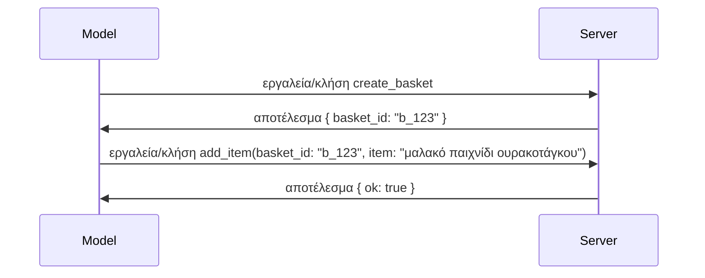

# Τι Αλλάζει στο MCP: Η Έκδοση Υποψηφίου 2026-07-28

> **Κατάσταση:** Έκδοση Υποψηφίου. Οι προδιαγραφές `2026-07-28` δεν είναι τελικές τη στιγμή της συγγραφής. Ανακοινώθηκε στις 21 Μαΐου 2026 και προγραμματίζεται να κυκλοφορήσει στις 28 Ιουλίου 2026. Όλα σε αυτό το μάθημα περιγράφουν την έκδοση υποψηφίου· ελέγξτε τις [προδιαγραφές σε σχέδιο](https://modelcontextprotocol.io/specification/draft) και το [ιστορικό αλλαγών](https://modelcontextprotocol.io/specification/draft/changelog) για την πιο πρόσφατη κατάσταση προτού αναπτύξετε με βάση αυτήν. Το υπόλοιπο του προγράμματος σπουδών είναι γραμμένο με βάση την τρέχουσα σταθερή έκδοση, **MCP Specification 2025-11-25**, και θα ενημερωθεί μόλις κυκλοφορήσει το `2026-07-28`.

## Επισκόπηση

Η έκδοση `2026-07-28` είναι η μεγαλύτερη αναθεώρηση του MCP από την έναρξή του. Έξι Προτάσεις Βελτίωσης Προδιαγραφών (SEPs) αφαιρούν τις συνεδρίες επιπέδου πρωτοκόλλου και καθιστούν το MCP χωρίς κατάσταση στο επίπεδο μεταφοράς, οι επεκτάσεις γίνονται ένας μηχανισμός πρώτης κατηγορίας με εκδόσεις, και αρκετά χαρακτηριστικά που μάθατε νωρίτερα σε αυτό το πρόγραμμα σπουδών (Roots, Sampling, Logging) επισημαίνονται ως απαρχαιωμένα σύμφωνα με μια νέα πολιτική κύκλου ζωής. Αυτό το μάθημα συνοψίζει τι αλλάζει, γιατί έχει σημασία, και τι σημαίνει για τον κώδικα που έχετε ήδη γράψει με βάση το `2025-11-25`.

Πηγή: [The 2026-07-28 MCP Specification Release Candidate](https://blog.modelcontextprotocol.io/posts/2026-07-28-release-candidate/) (Model Context Protocol Blog, David Soria Parra και Den Delimarsky).

## Στόχοι Μάθησης

Μέχρι το τέλος αυτού του μαθήματος, θα μπορείτε να:

- Εξηγήσετε γιατί το MCP μεταβαίνει σε ένα πρωτόκολλο χωρίς κατάσταση και ποιο πρόβλημα επιλύει για οριζόντια κλιμακούμενες αναπτύξεις.
- Περιγράψετε πώς αντικαθίστανται η αμφίδρομη επικοινωνία `initialize`/`initialized` και η κεφαλίδα `Mcp-Session-Id`.
- Αναγνωρίζετε τις νέες κεφαλίδες `Mcp-Method` και `Mcp-Name` και τα μεταδεδομένα προσωρινής αποθήκευσης `ttlMs`/`cacheScope`.
- Αναγνωρίζετε το πλαίσιο Extensions και τις δύο επεκτάσεις που κυκλοφορούν με αυτήν την έκδοση: MCP Apps και Tasks.
- Καταγράψετε τις έξι SEPs εξουσιοδότησης που ενισχύουν την ευθυγράμμιση με το OAuth 2.0 / OIDC.
- Αναγνωρίζετε ποια βασικά χαρακτηριστικά (Roots, Sampling, Logging) είναι πλέον απαρχαιωμένα, και τι σημαίνει αυτό στην πράξη.
- Εξηγήσετε την αλλαγή για το Πλήρες JSON Schema 2020-12 για τα εργαλεία `inputSchema`/`outputSchema`.

## Ένα Πρωτόκολλο Χωρίς Κατάσταση

Η βασική αλλαγή: Το MCP γίνεται χωρίς κατάσταση στο επίπεδο πρωτοκόλλου.

### Πριν (2025-11-25): οι συνεδρίες σας δένουν σε μία παρουσία διακομιστή

Η κλήση ενός εργαλείου μέσω Streamable HTTP ξεκινάει με μια αμφίδρομη επικοινωνία `initialize`. Ο διακομιστής απαντά με κεφαλίδα `Mcp-Session-Id` που κάθε μετέπειτα αίτηση πρέπει να μεταφέρει:

```http
POST /mcp HTTP/1.1
Mcp-Session-Id: 1868a90c-3a3f-4f5b
Content-Type: application/json

{"jsonrpc":"2.0","id":2,"method":"tools/call",
 "params":{"name":"search","arguments":{"q":"otters"}}}
```

Επειδή η συνεδρία συνδέεται με την παρουσία διακομιστή που την εξέδωσε, οι οριζόντια κλιμακούμενες αναπτύξεις χρειάζονται **επιδεξιόδρομη δρομολόγηση** στον ισορροπιστή φορτίου και **κοινό κατάστημα συνεδριών** σε όλες τις παρουσίες.

### Μετά (2026-07-28): κάθε αίτηση είναι ανεξάρτητη

```http
POST /mcp HTTP/1.1
MCP-Protocol-Version: 2026-07-28
Mcp-Method: tools/call
Mcp-Name: search
Content-Type: application/json

{"jsonrpc":"2.0","id":1,"method":"tools/call",
 "params":{"name":"search","arguments":{"q":"otters"},
           "_meta":{"io.modelcontextprotocol/clientInfo":{"name":"my-app","version":"1.0"}}}}
```

Οποιαδήποτε παρουσία διακομιστή μπορεί να χειριστεί αυτήν την αίτηση. Κύριες αλλαγές:

- **Αφαιρείται η αμφίδρομη επικοινωνία `initialize`/`initialized`** ([SEP-2575](https://github.com/modelcontextprotocol/modelcontextprotocol/pull/2575)). Η έκδοση πρωτοκόλλου, οι πληροφορίες πελάτη και οι δυνατότητες πελάτη μεταφέρονται στην ιδιότητα `_meta` σε κάθε αίτηση. Μια νέα μέθοδος `server/discover` επιτρέπει στον πελάτη να λάβει προκαταβολικά τις δυνατότητες διακομιστή όταν τις χρειάζεται.
- **Αφαιρείται η κεφαλίδα `Mcp-Session-Id` και η συνεδρία επιπέδου πρωτοκόλλου** ([SEP-2567](https://github.com/modelcontextprotocol/modelcontextprotocol/pull/2567)). Δεν απαιτούνται πλέον επιδεξιόδρομη δρομολόγηση και κοινά καταστήματα συνεδριών στο επίπεδο πρωτοκόλλου.

### Πρωτόκολλο χωρίς κατάσταση, εφαρμογές με κατάσταση

Η αφαίρεση της συνεδρίας επιπέδου πρωτοκόλλου δεν σημαίνει ότι ο διακομιστής σας δεν μπορεί να διατηρεί κατάσταση. Το συνιστώμενο πρότυπο είναι το ίδιο που χρησιμοποιούν πάντα τα HTTP APIs: δημιουργήστε μια ρητή αναφορά (όπως `basket_id`, `browser_id`) από μία κλήση εργαλείου, και αφήστε το μοντέλο να επιστρέφει αυτή την αναφορά ως απλό όρισμα σε μετέπειτα κλήσεις.



Αυτό καθιστά την κατάσταση ορατή και λογική για το μοντέλο αντί να την κρύβει στα μεταδεδομένα μεταφοράς, και επιτρέπει σε οποιαδήποτε παρουσία διακομιστή να χειριστεί οποιαδήποτε κλήση.

### Αιτήσεις από διακομιστή προς πελάτη, αναδιαρθρωμένες

Ένα πρωτόκολλο χωρίς κατάσταση χρειάζεται ακόμα έναν τρόπο να ζητήσει ο διακομιστής από τον πελάτη κάτι κατά την διάρκεια μιας κλήσης (για παράδειγμα, μια προτροπή ειδοποίησης):

- **Οι αιτήσεις που ξεκινάνε από τον διακομιστή μπορούν να γίνονται μόνο όσο ο διακομιστής επεξεργάζεται ενεργά μια αίτηση πελάτη** ([SEP-2260](https://github.com/modelcontextprotocol/modelcontextprotocol/pull/2260)) — πριν ήταν απλώς μια σύσταση, τώρα είναι υποχρεωτικό. Ο χρήστης δεν προτρέπεται ξαφνικά από το πουθενά.
- **Αιτήσεις πολλαπλών γύρων** ([SEP-2322](https://github.com/modelcontextprotocol/modelcontextprotocol/pull/2322)) αντικαθιστούν το να κρατάνε ανοιχτό ένα ρεύμα SSE. Αντ’ αυτού, ο διακομιστής επιστρέφει ένα `InputRequiredResult`:

  ```json
  {
    "resultType": "inputRequired",
    "inputRequests": {
      "confirm": {
        "type": "elicitation",
        "message": "Delete 3 files?",
        "schema": { "type": "boolean" }
      }
    },
    "requestState": "eyJzdGVwIjoxLCJmaWxlcyI6WyJhIiwiYiIsImMiXX0="
  }
  ```

  Ο πελάτης συλλέγει τις απαντήσεις και επανεκτελεί την αρχική κλήση με `inputResponses` συν το αναμενόμενο `requestState`. Οποιαδήποτε παρουσία διακομιστή μπορεί να αναλάβει την επανάληψη γιατί όλα τα απαιτούμενα είναι στο περιεχόμενο.

### Δρομολογήσιμο, προσωρινά αποθηκεύσιμο, ιχνηλάσιμο

Τρεις μικρότερες αλλαγές καθιστούν την χωρίς κατάσταση κυκλοφορία πιο εύκολη στη λειτουργία:

- **Οι κεφαλίδες `Mcp-Method` και `Mcp-Name` απαιτούνται στο Streamable HTTP** ([SEP-2243](https://github.com/modelcontextprotocol/modelcontextprotocol/pull/2243)), ώστε ισορροπιστές φορτίου, πύλες και περιοριστές ρυθμού να δρομολογούν βάσει της λειτουργίας χωρίς να εξετάζουν το σώμα JSON. Οι διακομιστές απορρίπτουν αιτήσεις όπου οι κεφαλίδες και το σώμα διαφωνούν.
- **Τα αποτελέσματα ανάγνωσης `tools/list` και πόρων περιλαμβάνουν `ttlMs` και `cacheScope`** ([SEP-2549](https://github.com/modelcontextprotocol/modelcontextprotocol/pull/2549)), βασισμένα στο HTTP `Cache-Control`. Οι πελάτες γνωρίζουν πόσο καιρό είναι φρέσκο ένα αποτέλεσμα λίστας και αν είναι ασφαλές να μοιράζονται ανάμεσα σε χρήστες, χωρίς να χρειάζεται ένας μακρόχρονος SSE μηχανισμός για να μαθαίνουν τις αλλαγές.
- **Η διάδοση W3C Trace Context στο `_meta` τεκμηριώνεται** ([SEP-414](https://github.com/modelcontextprotocol/modelcontextprotocol/pull/414)), διορθώνοντας τα ονόματα κλειδιών `traceparent`, `tracestate`, και `baggage` ώστε μια κατανεμημένη ιχνιλάτηση να μπορεί να ακολουθήσει μια κλήση σε όλο το SDK πελάτη, τον διακομιστή MCP και τα κατωτέρου επιπέδου συστήματα σε ένα συμβατό με [OpenTelemetry](https://opentelemetry.io/) backend.

## Οι Επεκτάσεις Γίνονται Πρώτης Κατηγορίας

Οι επεκτάσεις υπήρχαν ανεπίσημα στο `2025-11-25`. Η [SEP-2133](https://github.com/modelcontextprotocol/modelcontextprotocol/pull/2133) τις επίσημα θεσμοθετεί:

- Οι επεκτάσεις αναγνωρίζονται με αναστροφή DNS IDs.
- Διαπραγματεύονται μέσω ενός χάρτη `extensions` στις δυνατότητες πελάτη και διακομιστή.
- Διαμένουν σε δικά τους αποθετήρια `ext-*` με εξουσιοδοτημένους συντηρητές και εκδόσεις ανεξάρτητες από τον πυρήνα των προδιαγραφών.
- Μια νέα Διαδρομή Επεκτάσεων στην διαδικασία SEP τους δίνει έναν δρόμο από πειραματικές σε επίσημες.

Αυτή η έκδοση κυκλοφορεί δύο επίσημες επεκτάσεις.

### MCP Apps: διεπαφές χρήστη που αποδίδονται από τον διακομιστή

[MCP Apps](https://blog.modelcontextprotocol.io/posts/2026-01-26-mcp-apps/) ([SEP-1865](https://github.com/modelcontextprotocol/modelcontextprotocol/pull/1865)) επιτρέπει στους διακομιστές να στέλνουν διαδραστικές διεπαφές HTML που οι φιλοξενούντες αποδίδουν σε iframe σε sandbox. Τα εργαλεία δηλώνουν τα πρότυπα UI εκ των προτέρων ώστε οι φιλοξενούντες να μπορούν να τα προανακτούν, να τα αποθηκεύουν προσωρινά και να τα ελέγχουν για ασφάλεια πριν εκτελεστούν. Έχετε ήδη καλύψει τα βασικά σε [Μάθημα 15: MCP Apps](../03-GettingStarted/15-mcp-apps/README.md) — κάτω από το πλαίσιο Extensions, το MCP Apps τώρα είναι επίσημα μια επέκταση και όχι πειραματικό χαρακτηριστικό πυρήνα.

### Το Tasks προάγεται σε επέκταση

Το Tasks κυκλοφόρησε ως πειραματικό χαρακτηριστικό πυρήνα στο `2025-11-25`. Η χρήση σε παραγωγή έφερε αρκετό επανασχεδιασμό ώστε το κατάλληλο σπίτι για αυτό να είναι μια επέκταση: η [επέκταση Tasks](https://github.com/modelcontextprotocol/modelcontextprotocol/pull/2663) διαμορφώνει τον κύκλο ζωής γύρω από το μοντέλο χωρίς κατάσταση — ένας διακομιστής μπορεί να απαντά σε `tools/call` με handle εργασίας, και ο πελάτης προωθεί την εργασία με `tasks/get`, `tasks/update`, και `tasks/cancel`. Η δημιουργία εργασίας καθοδηγείται από τον διακομιστή: ο πελάτης διαφημίζει την επέκταση, και ο διακομιστής αποφασίζει πότε μια κλήση πρέπει να τρέχει ως εργασία. Το `tasks/list` αφαιρείται εντελώς γιατί δεν μπορεί να αποκτήσει εύλογη ασφάλεια χωρίς συνεδρίες.

> **Σημείωση μετεγκατάστασης:** αν υλοποιήσατε το πειραματικό API Tasks του `2025-11-25`, θα χρειαστεί να μετεγκατασταθείτε στον νέο κύκλο ζωής επέκτασης — δεν είναι συμβατό προς τα πίσω.

## Ενίσχυση Εξουσιοδότησης

Έξι SEPs ενισχύουν την [προδιαγραφή εξουσιοδότησης](https://modelcontextprotocol.io/specification/draft/basic/authorization) για να ευθυγραμμιστεί πιο στενά με τους πραγματικούς κόσμους των OAuth 2.0 / OpenID Connect αναπτύξεων:

| SEP | Αλλαγή |
|---|---|
| [SEP-2468](https://github.com/modelcontextprotocol/modelcontextprotocol/pull/2468) | Οι πελάτες πρέπει να επικυρώνουν την παράμετρο `iss` στις απαντήσεις εξουσιοδότησης σύμφωνα με το [RFC 9207](https://www.rfc-editor.org/rfc/rfc9207), μειώνοντας τις επιθέσεις ανάμιξης που είναι κοινές στο μοτίβο MCP με έναν πελάτη και πολλούς διακομιστές. Μια μελλοντική έκδοση θα απαιτεί απόρριψη απαντήσεων που λείπει το `iss`. |
| [SEP-837](https://github.com/modelcontextprotocol/modelcontextprotocol/pull/837) | Οι πελάτες δηλώνουν τον τύπο εφαρμογής OpenID Connect `application_type` κατά την Δυναμική Εγγραφή Πελάτη, αποφεύγοντας οι διακομιστές εξουσιοδότησης να ορίζουν ως προεπιλογή έναν desktop/CLI πελάτη σε `"web"` και να απορρίπτουν το URI ανακατεύθυνσης localhost. |
| [SEP-2352](https://github.com/modelcontextprotocol/modelcontextprotocol/pull/2352) | Οι πελάτες συνδέουν τα εγγεγραμμένα διαπιστευτήρια με το `issuer` του διακομιστή εξουσιοδότησης και επανεγγράφονται όταν ένας πόρος μετακινείται μεταξύ διακομιστών εξουσιοδότησης. |
| [SEP-2207](https://github.com/modelcontextprotocol/modelcontextprotocol/pull/2207) | Τεκμηριώνει πώς να ζητούνται κλειδιά ανανέωσης από διακομιστές εξουσιοδότησης τύπου OpenID Connect. |
| [SEP-2350](https://github.com/modelcontextprotocol/modelcontextprotocol/pull/2350) | Διευκρινίζει τη συσσώρευση scope κατά την εξουσιοδότηση βελτιωμένης ασφάλειας. |
| [SEP-2351](https://github.com/modelcontextprotocol/modelcontextprotocol/pull/2351) | Διευκρινίζει το επίθημα `.well-known` για ανακάλυψη. |

Αν χτίζετε διακομιστή εξουσιοδότησης για MCP σήμερα, ξεκινήστε να προμηθεύετε το `iss` στις απαντήσεις εξουσιοδότησης τώρα — δείτε [02-Security](../02-Security/README.md) για τις τρέχουσες οδηγίες εξουσιοδότησης που θα στηρίζονται σε αυτό.

## Τα Roots, Sampling, και Logging Είναι Απαρχαιωμένα

Σύμφωνα με τη νέα [πολιτική κύκλου ζωής χαρακτηριστικών](https://github.com/modelcontextprotocol/modelcontextprotocol/pull/2577) ([SEP-2577](https://github.com/modelcontextprotocol/modelcontextprotocol/pull/2577)), τρία βασικά αρχέτυπα πελάτη που μάθατε στο [Βασικές Έννοιες](./README.md#roots) μετακινούνται σε κατάσταση **Απαρχαιωμένων**:

| Χαρακτηριστικό | Συνιστώμενη αντικατάσταση |
|---|---|
| Roots | Παράμετροι εργαλείων, URIs πόρων ή διαμόρφωση διακομιστή |
| Sampling | Άμεση ένταξη με APIs παρόχων LLM |
| Logging | `stderr` για μεταφορές stdio· OpenTelemetry για δομημένη παρατηρησιμότητα |

Αυτές είναι **αποσύνδεση μόνο με σημείωση**: οι μέθοδοι, τύποι και σημαίες δυνατοτήτων συνεχίζουν να λειτουργούν σε αυτήν την έκδοση και σε κάθε έκδοση προδιαγραφής που δημοσιεύεται μέσα σε ένα χρόνο από αυτήν. Η πλήρης αφαίρεσή τους θα απαιτήσει ξεχωριστή SEP σύμφωνα με την πολιτική κύκλου ζωής — οπότε τίποτα δεν σπάει στα υπάρχοντα δείγματα [Sampling](../03-GettingStarted/14-sampling/README.md) σήμερα, αλλά οι νέοι διακομιστές θα πρέπει να προτιμούν τα παραπάνω πρότυπα αντικατάστασης.

## Πλήρες JSON Schema 2020-12 για Εργαλεία

Τα `inputSchema` και `outputSchema` εργαλείων αναβαθμίζονται σε πλήρες [JSON Schema 2020-12](https://json-schema.org/draft/2020-12) ([SEP-2106](https://github.com/modelcontextprotocol/modelcontextprotocol/pull/2106)):

- Τα σχήματα εισόδου διατηρούν τον περιορισμό ρίζας `type: "object"` αλλά πλέον επιτρέπουν συνθέσεις (`oneOf`, `anyOf`, `allOf`), συνθήκες και αναφορές (`$ref`, `$defs`).
- Τα σχήματα εξόδου είναι χωρίς περιορισμό, και το `structuredContent` μπορεί τώρα να είναι οποιαδήποτε τιμή JSON και όχι μόνο αντικείμενο.
- Οι υλοποιήσεις δεν πρέπει να κάνουν αυτόματη ανάκληση εξωτερικών URI `$ref` και πρέπει να περιορίζουν το βάθος του σχήματος και τον χρόνο επικύρωσης (μια εξέταση απόψεων άρνησης υπηρεσίας που πρέπει να λάβετε υπόψη αν επικυρώνετε σχήματα από την πλευρά του διακομιστή).

Ξεχωριστά, ο κωδικός σφάλματος για απόντα πόρο αλλάζει από τον προσαρμοσμένο MCP `-32002` στον πρότυπο JSON-RPC `-32602` (Invalid Params) ([SEP-2164](https://github.com/modelcontextprotocol/modelcontextprotocol/pull/2164)). Αν ο πελάτης σας στηρίζεται στην κυριολεκτική τιμή `-32002`, θα χρειαστεί να τον ενημερώσετε.

## Πώς Εξελίσσεται το Πρωτόκολλο Από Εδώ

Αυτή η έκδοση περιέχει αλλαγές που σπάνε τη συμβατότητα, τις οποίες οι συντηρητές του MCP δεν προτίθενται να γίνουν ο κανόνας στο μέλλον. Τρεις SEPs διακυβέρνησης σκοπεύουν να αποτρέψουν επανάληψη:

- Η **πολιτική κύκλου ζωής χαρακτηριστικών** δίνει σε κάθε χαρακτηριστικό μια πορεία Ενεργό → Απαρχαιωμένο → Αφαιρεμένο με τουλάχιστον δώδεκα μήνες μεταξύ απαρχαίωσης και της πρώτης δυνατής αφαίρεσης.
- Το **πλαίσιο Επεκτάσεων** επιτρέπει σε νέες δυνατότητες να εκδίδονται ως προαιρετικές επεκτάσεις και να σταθεροποιούνται εκεί πριν (αν ποτέ) μετακινηθούν στον πυρήνα των προδιαγραφών.

- Ένα SEP με καθεστώς Standards Track δεν μπορεί πλέον να φτάσει στην τελική κατάσταση μέχρι να προστεθεί ένα αντίστοιχο σενάριο στο [σύνολο συμμόρφωσης](https://github.com/modelcontextprotocol/conformance) ([SEP-2484](https://github.com/modelcontextprotocol/modelcontextprotocol/pull/2484)) — το ίδιο σύνολο που αξιολογεί επίσημα SDKs το [σύστημα βαθμολόγησης SDK tier](https://github.com/modelcontextprotocol/modelcontextprotocol/pull/1777).

## Χρονοδιάγραμμα Κυκλοφορίας και Επαλήθευση

- Ο υποψήφιος για κυκλοφορία κλειδώθηκε στις 21 Μαΐου 2026.
- Η τελική προδιαγραφή προγραμματίζεται για τις 28 Ιουλίου 2026.
- Το διάστημα των δέκα εβδομάδων ανάμεσα στα δύο δίνει την ευκαιρία στους διαχειριστές SDK και στους υλοποιητές πελατών να επαληθεύσουν τις αλλαγές με πραγματικά φορτία εργασίας· τα Tier 1 SDKs αναμένεται να υποστηρίξουν μέσα σε αυτό το διάστημα υπό το [σύστημα βαθμολόγησης SDK tier](https://modelcontextprotocol.io/docs/sdk).
- Παρακολουθήστε το πλήρες σύνολο αλλαγών στην [προσχέδιο προδιαγραφή](https://modelcontextprotocol.io/specification/draft) και το [ιστορικό αλλαγών](https://modelcontextprotocol.io/specification/draft/changelog).

## Τι Σημαίνει Αυτό για Αυτό το Εκπαιδευτικό Πρόγραμμα

Όλα όσα έχετε μάθει μέχρι τώρα σε αυτό το μάθημα στοχεύουν στο **2025-11-25**, που παραμένει η τρέχουσα σταθερή προδιαγραφή μέχρι να κυκλοφορήσει το `2026-07-28`. Συγκεκριμένα:

- **Οι Συνεδρίες και το χειραψία `initialize`** (που καλύπτονται στα [Βασικά Έννοιες](./README.md) και [Μάθημα 6: HTTP Streaming](../03-GettingStarted/06-http-streaming/README.md)) λειτουργούν όπως τεκμηριώνονται σήμερα, αλλά αναμένεται να αντικατασταθούν από το μοντέλο στατιστικών αιτήσεων παραπάνω μόλις αναβαθμίσετε σε SDKs συμβατά με το `2026-07-28`.
- **Η Δειγματοληψία και οι Ρίζες** (επίσης καλυπτόμενα στα [Βασικά Έννοιες](./README.md)) παραμένουν πλήρως λειτουργικά αλλά είναι ξεπερασμένα — οι νέοι σχεδιασμοί θα πρέπει να προτιμούν τα πρότυπα αντικατάστασης που αναφέρονται παραπάνω.
- **Η πειραματική λειτουργία Tasks**, αν την έχετε χρησιμοποιήσει, θα χρειαστεί μετεγκατάσταση στον νέο κύκλο ζωής της επέκτασης Tasks.
- **Οι εφαρμογές MCP** ([Μάθημα 15](../03-GettingStarted/15-mcp-apps/README.md)) δεν επηρεάζονται πρακτικά· απλώς μεταφέρονται στο επίσημο πλαίσιο Επεκτάσεων.

## Πρόσθετοι Πόροι

- [Ο Υποψήφιος για κυκλοφορία της Προδιαγραφής MCP 2026-07-28 (άρθρο blog)](https://blog.modelcontextprotocol.io/posts/2026-07-28-release-candidate/)
- [Το Μέλλον των Μεταφορών MCP](https://blog.modelcontextprotocol.io/posts/2025-12-19-mcp-transport-future/)
- [Προσχέδιο Προδιαγραφής MCP](https://modelcontextprotocol.io/specification/draft)
- [Ιστορικό Αλλαγών Προσχεδίου MCP](https://modelcontextprotocol.io/specification/draft/changelog)
- [Κατευθυντήριες Γραμμές SEP](https://modelcontextprotocol.io/community/sep-guidelines)
- [Σύστημα Βαθμολογίας SDK MCP Tier](https://modelcontextprotocol.io/docs/sdk)

## Επόμενα Βήματα

Επιστρέψτε στα [Βασικά Έννοιες](./README.md) ή συνεχίστε στο [Ασφάλεια](../02-Security/README.md) για να δείτε πώς οι οδηγίες του `2025-11-25` αποτυπώνονται σε αυτά που έρχονται.

---

<!-- CO-OP TRANSLATOR DISCLAIMER START -->
**Αποποίηση ευθυνών**:
Αυτό το έγγραφο έχει μεταφραστεί χρησιμοποιώντας την υπηρεσία μετάφρασης με τεχνητή νοημοσύνη [Co-op Translator](https://github.com/Azure/co-op-translator). Ενώ επιδιώκουμε την ακρίβεια, παρακαλούμε να έχετε υπόψη ότι οι αυτοματοποιημένες μεταφράσεις ενδέχεται να περιέχουν λάθη ή ανακρίβειες. Το πρωτότυπο έγγραφο στη μητρική του γλώσσα πρέπει να θεωρείται η αυθεντική πηγή. Για κρίσιμες πληροφορίες, συνιστάται επαγγελματική ανθρώπινη μετάφραση. Δεν φέρουμε ευθύνη για τυχόν παρεξηγήσεις ή λανθασμένες ερμηνείες που προκύπτουν από τη χρήση αυτής της μετάφρασης.
<!-- CO-OP TRANSLATOR DISCLAIMER END -->