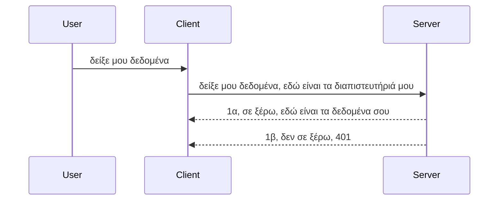

# Απλή ταυτοποίηση

Τα SDKs MCP υποστηρίζουν τη χρήση του OAuth 2.1, το οποίο για να είμαστε δίκαιοι είναι μια αρκετά σύνθετη διαδικασία που περιλαμβάνει έννοιες όπως διακομιστής πιστοποίησης, διακομιστής πόρων, αποστολή διαπιστευτηρίων, λήψη κωδικού, ανταλλαγή του κωδικού για έναν bearer token μέχρι να μπορέσετε τελικά να αποκτήσετε τα δεδομένα πόρων σας. Αν δεν είστε εξοικειωμένοι με το OAuth, που είναι κάτι πολύ καλό για υλοποίηση, είναι καλή ιδέα να ξεκινήσετε με ένα βασικό επίπεδο ταυτοποίησης και να αναπτύξετε ασφαλέστερους μηχανισμούς. Γι' αυτό υπάρχει αυτό το κεφάλαιο, για να σας προετοιμάσει για πιο προχωρημένη ταυτοποίηση.

## Ταυτοποίηση, τι εννοούμε;

Η ταυτοποίηση είναι συντομογραφία του authentication και authorization. Η ιδέα είναι ότι πρέπει να κάνουμε δύο πράγματα:

- **Authentication**, που είναι η διαδικασία να διαπιστώσουμε αν επιτρέπουμε σε ένα άτομο να μπει στο σπίτι μας, αν έχει το δικαίωμα να είναι "εδώ", δηλαδή να έχει πρόσβαση στον διακομιστή πόρων όπου βρίσκονται οι λειτουργίες του MCP Server μας.
- **Authorization**, είναι η διαδικασία να βρούμε αν ένας χρήστης θα έπρεπε να έχει πρόσβαση σε αυτούς τους συγκεκριμένους πόρους που ζητάει, για παράδειγμα αυτές οι παραγγελίες ή αυτά τα προϊόντα ή αν του επιτρέπεται να διαβάζει το περιεχόμενο αλλά όχι να το διαγράφει ως ένα άλλο παράδειγμα.

## Διαπιστευτήρια: πώς λέμε στο σύστημα ποιοι είμαστε

Λοιπόν, οι περισσότεροι προγραμματιστές διαδικτύου ξεκινούν σκεφτόμενοι να παρέχουν ένα διαπιστευτήριο στον διακομιστή, συνήθως ένα μυστικό που λέει αν επιτρέπεται να είναι εδώ "Authentication". Αυτό το διαπιστευτήριο είναι συνήθως μια κωδικοποιημένη σε base64 έκδοση ονόματος χρήστη και κωδικού ή ένα API key που ταυτοποιεί μοναδικά έναν συγκεκριμένο χρήστη. 

Αυτό συνεπάγεται την αποστολή του μέσω ενός header που ονομάζεται "Authorization" ως εξής:

```json
{ "Authorization": "secret123" }
```

Αυτό συνήθως αναφέρεται ως βασική ταυτοποίηση (basic authentication). Πώς λειτουργεί συνολικά η ροή στη συνέχεια:



Τώρα που καταλαβαίνουμε πώς δουλεύει από άποψη ροής, πώς την υλοποιούμε; Λοιπόν, οι περισσότεροι web servers έχουν μια έννοια που λέγεται middleware, ένα κομμάτι κώδικα που εκτελείται ως μέρος του αιτήματος και μπορεί να επαληθεύει τα διαπιστευτήρια, και αν τα διαπιστευτήρια είναι έγκυρα, επιτρέπει στο αίτημα να περάσει. Αν το αίτημα δεν έχει έγκυρα διαπιστευτήρια, τότε λαμβάνεις ένα σφάλμα ταυτοποίησης. Ας δούμε πώς μπορεί να υλοποιηθεί αυτό:

**Python**

```python
class AuthMiddleware(BaseHTTPMiddleware):
    async def dispatch(self, request, call_next):

        has_header = request.headers.get("Authorization")
        if not has_header:
            print("-> Missing Authorization header!")
            return Response(status_code=401, content="Unauthorized")

        if not valid_token(has_header):
            print("-> Invalid token!")
            return Response(status_code=403, content="Forbidden")

        print("Valid token, proceeding...")
       
        response = await call_next(request)
        # προσθέστε τυχόν προσαρμοσμένες κεφαλίδες πελατών ή αλλάξτε την απάντηση με κάποιον τρόπο
        return response


starlette_app.add_middleware(CustomHeaderMiddleware)
```

Εδώ έχουμε: 

- Δημιουργήσαμε ένα middleware που ονομάζεται `AuthMiddleware` όπου η μέθοδος `dispatch` καλείται από τον web server. 
- Προσθέσαμε το middleware στον web server:

    ```python
    starlette_app.add_middleware(AuthMiddleware)
    ```

- Γράψαμε λογική επικύρωσης που ελέγχει αν υπάρχει το header Authorization και αν το μυστικό που αποστέλλεται είναι έγκυρο:

    ```python
    has_header = request.headers.get("Authorization")
    if not has_header:
        print("-> Missing Authorization header!")
        return Response(status_code=401, content="Unauthorized")

    if not valid_token(has_header):
        print("-> Invalid token!")
        return Response(status_code=403, content="Forbidden")
    ```

    Αν το μυστικό υπάρχει και είναι έγκυρο, τότε αφήνουμε το αίτημα να περάσει καλώντας τη `call_next` και επιστρέφουμε την απάντηση.

    ```python
    response = await call_next(request)
    # προσθέστε οποιεσδήποτε προσαρμοσμένες κεφαλίδες πελάτη ή αλλαγές στην απόκριση με κάποιο τρόπο
    return response
    ```

Πώς δουλεύει: αν γίνει web αίτημα προς τον διακομιστή, τότε το middleware θα κληθεί και ανάλογα με την υλοποίηση είτε θα αφήσει το αίτημα να περάσει είτε θα επιστρέψει σφάλμα που υποδηλώνει ότι ο πελάτης δεν επιτρέπεται να συνεχίσει.

**TypeScript**

Εδώ δημιουργούμε ένα middleware με το δημοφιλές πλαίσιο Express και παρεμβαίνουμε στο αίτημα πριν φτάσει στον MCP Server. Κώδικας:

```typescript
function isValid(secret) {
    return secret === "secret123";
}

app.use((req, res, next) => {
    // 1. Υπάρχει η κεφαλίδα εξουσιοδότησης;
    if(!req.headers["Authorization"]) {
        res.status(401).send('Unauthorized');
    }
    
    let token = req.headers["Authorization"];

    // 2. Ελέγξτε την εγκυρότητα.
    if(!isValid(token)) {
        res.status(403).send('Forbidden');
    }

   
    console.log('Middleware executed');
    // 3. Μεταβιβάζει το αίτημα στο επόμενο βήμα στη ροή του αιτήματος.
    next();
});
```

Σε αυτόν τον κώδικα:

1. Ελέγχουμε αν υπάρχει το header Authorization, αν όχι, στέλνουμε 401 σφάλμα.
2. Εξασφαλίζουμε ότι το διαπιστευτήριο/token είναι έγκυρο, αν όχι, στέλνουμε 403 σφάλμα.
3. Τέλος προωθεί το αίτημα στο pipeline και επιστρέφει τον ζητούμενο πόρο.

## Άσκηση: Υλοποίηση ταυτοποίησης

Ας πάρουμε τις γνώσεις μας και ας δοκιμάσουμε να το υλοποιήσουμε. Το σχέδιο:

Server

- Δημιουργία ενός web server και MCP instance.
- Υλοποίηση middleware για τον server.

Client 

- Αποστολή web αιτήματος με διαπιστευτήριο μέσω header.

### -1- Δημιουργία web server και MCP instance

> **Κοιτώντας μπροστά:** το παράδειγμα TypeScript παρακάτω παρακολουθεί HTTP transports σε έναν χάρτη `transports` με κλειδί `mcp-session-id`, σύμφωνα με **MCP Specification 2025-11-25**. Ο υποψήφιος προς κυκλοφορία `2026-07-28` αφαιρεί το handshake initialization και το session ID εντελώς, οπότε αυτός ο ανά session χάρτης μεταφορών καταργείται υπέρ στατικών, αυτόνομων αιτημάτων. Δείτε [Τι αλλάζει στο MCP: Η υποψήφια έκδοση 2026-07-28](../../01-CoreConcepts/mcp-2026-07-28-release-candidate.md).

Στο πρώτο βήμα, πρέπει να δημιουργήσουμε το instance του web server και του MCP Server.

**Python**

Εδώ δημιουργούμε ένα instance MCP server, δημιουργούμε μια εφαρμογή starlette και τη φιλοξενούμε με uvicorn.

```python
# δημιουργία διακομιστή MCP

app = FastMCP(
    name="MCP Resource Server",
    instructions="Resource Server that validates tokens via Authorization Server introspection",
    host=settings["host"],
    port=settings["port"],
    debug=True
)

# δημιουργία εφαρμογής web starlette
starlette_app = app.streamable_http_app()

# εξυπηρέτηση εφαρμογής μέσω uvicorn
async def run(starlette_app):
    import uvicorn
    config = uvicorn.Config(
            starlette_app,
            host=app.settings.host,
            port=app.settings.port,
            log_level=app.settings.log_level.lower(),
        )
    server = uvicorn.Server(config)
    await server.serve()

run(starlette_app)
```

Εδώ:

- Δημιουργούμε τον MCP Server.
- Κατασκευάζουμε την starlette web app από τον MCP Server, `app.streamable_http_app()`.
- Φιλοξενούμε και σερβίρουμε την web app χρησιμοποιώντας uvicorn `server.serve()`.

**TypeScript**

Εδώ δημιουργούμε ένα MCP Server instance.

```typescript
const server = new McpServer({
      name: "example-server",
      version: "1.0.0"
    });

    // ... ρύθμιση πόρων διακομιστή, εργαλείων και εντολών ...
```

Αυτή η δημιουργία MCP Server πρέπει να γίνει μέσα στον ορισμό διαδρομής POST /mcp μας, οπότε παίρνουμε τον παραπάνω κώδικα και τοποθετούμε ως εξής:

```typescript
import express from "express";
import { randomUUID } from "node:crypto";
import { McpServer } from "@modelcontextprotocol/sdk/server/mcp.js";
import { StreamableHTTPServerTransport } from "@modelcontextprotocol/sdk/server/streamableHttp.js";
import { isInitializeRequest } from "@modelcontextprotocol/sdk/types.js"

const app = express();
app.use(express.json());

// Χάρτης για αποθήκευση μεταφορών ανά αναγνωριστικό συνεδρίας
const transports: { [sessionId: string]: StreamableHTTPServerTransport } = {};

// Διαχείριση αιτημάτων POST για επικοινωνία πελάτη-προς-διακομιστή
app.post('/mcp', async (req, res) => {
  // Έλεγχος για υπάρχον αναγνωριστικό συνεδρίας
  const sessionId = req.headers['mcp-session-id'] as string | undefined;
  let transport: StreamableHTTPServerTransport;

  if (sessionId && transports[sessionId]) {
    // Επαναχρησιμοποίηση υπάρχουσας μεταφοράς
    transport = transports[sessionId];
  } else if (!sessionId && isInitializeRequest(req.body)) {
    // Νέο αίτημα αρχικοποίησης
    transport = new StreamableHTTPServerTransport({
      sessionIdGenerator: () => randomUUID(),
      onsessioninitialized: (sessionId) => {
        // Αποθήκευση της μεταφοράς με βάση το αναγνωριστικό συνεδρίας
        transports[sessionId] = transport;
      },
      // Η προστασία από DNS rebinding είναι απενεργοποιημένη από προεπιλογή για συμβατότητα με παλαιότερες εκδόσεις. Αν τρέχετε αυτόν τον διακομιστή
      // τοπικά, βεβαιωθείτε ότι έχετε ορίσει:
      // enableDnsRebindingProtection: true,
      // allowedHosts: ['127.0.0.1'],
    });

    // Καθαρισμός της μεταφοράς όταν κλείνει
    transport.onclose = () => {
      if (transport.sessionId) {
        delete transports[transport.sessionId];
      }
    };
    const server = new McpServer({
      name: "example-server",
      version: "1.0.0"
    });

    // ... ρύθμιση πόρων διακομιστή, εργαλείων και προτροπών ...

    // Σύνδεση με τον διακομιστή MCP
    await server.connect(transport);
  } else {
    // Μη έγκυρο αίτημα
    res.status(400).json({
      jsonrpc: '2.0',
      error: {
        code: -32000,
        message: 'Bad Request: No valid session ID provided',
      },
      id: null,
    });
    return;
  }

  // Διαχείριση του αιτήματος
  await transport.handleRequest(req, res, req.body);
});

// Επαναχρησιμοποιήσιμος διαχειριστής για αιτήματα GET και DELETE
const handleSessionRequest = async (req: express.Request, res: express.Response) => {
  const sessionId = req.headers['mcp-session-id'] as string | undefined;
  if (!sessionId || !transports[sessionId]) {
    res.status(400).send('Invalid or missing session ID');
    return;
  }
  
  const transport = transports[sessionId];
  await transport.handleRequest(req, res);
};

// Διαχείριση αιτημάτων GET για ειδοποιήσεις από διακομιστή προς πελάτη μέσω SSE
app.get('/mcp', handleSessionRequest);

// Διαχείριση αιτημάτων DELETE για τερματισμό συνεδρίας
app.delete('/mcp', handleSessionRequest);

app.listen(3000);
```

Τώρα βλέπετε πώς η δημιουργία MCP Server μεταφέρθηκε μέσα σε `app.post("/mcp")`.

Πάμε στο επόμενο βήμα της δημιουργίας middleware για να επικυρώσουμε το εισερχόμενο διαπιστευτήριο.

### -2- Υλοποίηση middleware για τον server

Πάμε τώρα στο κομμάτι middleware. Θα δημιουργήσουμε ένα middleware που ψάχνει για διαπιστευτήριο στο header `Authorization` και το επικυρώνει. Αν είναι αποδεκτό, το αίτημα συνεχίζει και εκτελεί ό,τι απαιτεί (π.χ. λίστα εργαλείων, ανάγνωση πόρου ή οποιαδήποτε λειτουργία MCP ζητάει ο πελάτης).

**Python**

Για τη δημιουργία middleware, χρειάζεται μια κλάση που κληρονομεί από το `BaseHTTPMiddleware`. Υπάρχουν δύο ενδιαφέροντα στοιχεία:

- Το αίτημα `request`, από το οποίο διαβάζουμε το header.
- Το `call_next`, η callback που πρέπει να καλέσουμε αν ο πελάτης έχει φέρει αποδεκτό διαπιστευτήριο.

Πρώτα, πρέπει να χειριστούμε την περίπτωση που λείπει το header `Authorization`:

```python
has_header = request.headers.get("Authorization")

# δεν υπάρχει επικεφαλίδα, αποτυχία με 401, διαφορετικά προχώρα.
if not has_header:
    print("-> Missing Authorization header!")
    return Response(status_code=401, content="Unauthorized")
```

Εδώ στέλνουμε μήνυμα 401 unauthorized καθώς ο πελάτης αποτυγχάνει την ταυτοποίηση.

Έπειτα, αν έχει αποσταλεί διαπιστευτήριο, ελέγχουμε την εγκυρότητά του ως εξής:

```python
 if not valid_token(has_header):
    print("-> Invalid token!")
    return Response(status_code=403, content="Forbidden")
```

Δείτε πώς στέλνεται μήνυμα 403 forbidden παραπάνω. Ας δούμε το πλήρες middleware που υλοποιεί τα πάντα που αναφέραμε:

```python
class AuthMiddleware(BaseHTTPMiddleware):
    async def dispatch(self, request, call_next):

        has_header = request.headers.get("Authorization")
        if not has_header:
            print("-> Missing Authorization header!")
            return Response(status_code=401, content="Unauthorized")

        if not valid_token(has_header):
            print("-> Invalid token!")
            return Response(status_code=403, content="Forbidden")

        print("Valid token, proceeding...")
        print(f"-> Received {request.method} {request.url}")
        response = await call_next(request)
        response.headers['Custom'] = 'Example'
        return response

```

Τέλεια, αλλά τι γίνεται με τη συνάρτηση `valid_token`; Να και αυτή:

```python
# ΜΗΝ το χρησιμοποιείτε για παραγωγή - βελτιώστε το !!
def valid_token(token: str) -> bool:
    # αφαιρέστε το πρόθεμα "Bearer "
    if token.startswith("Bearer "):
        token = token[7:]
        return token == "secret-token"
    return False
```

Φυσικά αυτό μπορεί να βελτιωθεί. 

ΣΗΜΑΝΤΙΚΟ: ΠΟΤΕ δεν πρέπει να έχετε μυστικά όπως αυτό στον κώδικα. Ιδανικά, πρέπει να ανακτάτε την τιμή προς σύγκριση από πηγή δεδομένων ή από παροχέα ταυτότητας (IDP) ή ακόμα καλύτερα, αφήστε το IDP να κάνει την επικύρωση.

**TypeScript**

Για να το υλοποιήσουμε με Express, πρέπει να καλέσουμε τη μέθοδο `use` που παίρνει λειτουργίες middleware.

Πρέπει να:

- Αλληλεπιδρούμε με το request για να ελέγξουμε το διαπιστευτήριο που περνάει στη `Authorization` ιδιότητα.
- Επικυρώνουμε το διαπιστευτήριο και αν είναι αποδεκτό, αφήνουμε το αίτημα να συνεχίσει και να εκτελέσει την αίτηση MCP του πελάτη (π.χ. λίστα εργαλείων, ανάγνωση πόρου ή οτιδήποτε άλλο).

Εδώ ελέγχουμε αν υπάρχει το header `Authorization` και αν όχι, σταματάμε το αίτημα:

```typescript
if(!req.headers["authorization"]) {
    res.status(401).send('Unauthorized');
    return;
}
```

Αν το header δεν έχει σταλεί, λαμβάνετε 401.

Μετά ελέγχουμε αν το διαπιστευτήριο είναι έγκυρο, αν όχι, σταματάμε ξανά το αίτημα με διαφορετικό μήνυμα:

```typescript
if(!isValid(token)) {
    res.status(403).send('Forbidden');
    return;
} 
```

Δείτε πώς τώρα παίρνετε σφάλμα 403.

Πλήρης κώδικας:

```typescript
app.use((req, res, next) => {
    console.log('Request received:', req.method, req.url, req.headers);
    console.log('Headers:', req.headers["authorization"]);
    if(!req.headers["authorization"]) {
        res.status(401).send('Unauthorized');
        return;
    }
    
    let token = req.headers["authorization"];

    if(!isValid(token)) {
        res.status(403).send('Forbidden');
        return;
    }  

    console.log('Middleware executed');
    next();
});
```

Εχουμε ρυθμίσει το web server να αποδέχεται middleware που ελέγχει το διαπιστευτήριο που ελπίζουμε να στέλνει ο πελάτης. Τι γίνεται με τον ίδιο τον πελάτη;

### -3- Αποστολή web αιτήματος με διαπιστευτήριο μέσω header

Πρέπει να διασφαλίσουμε ότι ο πελάτης περνάει το διαπιστευτήριο μέσω του header. Επειδή θα χρησιμοποιήσουμε έναν MCP client γι' αυτό, πρέπει να βρούμε πώς γίνεται.

**Python**

Για τον client, πρέπει να περάσουμε ένα header με το διαπιστευτήριό μας ως εξής:

```python
# ΜΗΝ σκληροκωδικοποιείτε την τιμή, να την έχετε τουλάχιστον σε μεταβλητή περιβάλλοντος ή σε πιο ασφαλή αποθήκευση
token = "secret-token"

async with streamablehttp_client(
        url = f"http://localhost:{port}/mcp",
        headers = {"Authorization": f"Bearer {token}"}
    ) as (
        read_stream,
        write_stream,
        session_callback,
    ):
        async with ClientSession(
            read_stream,
            write_stream
        ) as session:
            await session.initialize()
      
            # TODO, τι θέλετε να γίνει στον πελάτη, π.χ. λίστα εργαλείων, κλήση εργαλείων κ.λπ.
```

Δείτε πώς ορίζουμε την ιδιότητα `headers` ως ` headers = {"Authorization": f"Bearer {token}"}`.

**TypeScript**

Μπορούμε να το λύσουμε σε δύο βήματα:

1. Δημιουργούμε ένα αντικείμενο ρυθμίσεων με το διαπιστευτήριό μας.
2. Περνάμε το αντικείμενο ρυθμίσεων στο transport.

```typescript

// ΜΗΝ κάνετε σκληρό κωδικοποίηση της τιμής όπως φαίνεται εδώ. Τουλάχιστον να την έχετε ως μεταβλητή περιβάλλοντος και να χρησιμοποιείτε κάτι σαν το dotenv (σε λειτουργία ανάπτυξης).
let token = "secret123"

// ορίστε ένα αντικείμενο επιλογών μεταφοράς πελάτη
let options: StreamableHTTPClientTransportOptions = {
  sessionId: sessionId,
  requestInit: {
    headers: {
      "Authorization": "secret123"
    }
  }
};

// περάστε το αντικείμενο επιλογών στη μεταφορά
async function main() {
   const transport = new StreamableHTTPClientTransport(
      new URL(serverUrl),
      options
   );
```

Εδώ βλέπετε ότι δημιουργήσαμε αντικείμενο `options` και βάλαμε τα headers κάτω από την ιδιότητα `requestInit`.

ΣΗΜΑΝΤΙΚΟ: Πώς το βελτιώνουμε όμως από εδώ; Η τρέχουσα υλοποίηση έχει προβλήματα. Πρώτον, το να περάσετε διαπιστευτήριο έτσι είναι αρκετά ριψοκίνδυνο, εκτός αν έχετε τουλάχιστον HTTPS. Ακόμα κι έτσι, το διαπιστευτήριο μπορεί να κλαπεί, οπότε χρειάζεστε ένα σύστημα όπου μπορείτε εύκολα να ανακαλέσετε το token και να προσθέσετε επιπλέον ελέγχους όπως από πού στον κόσμο προέρχεται, αν το αίτημα γίνεται πολύ συχνά (συμπεριφορά bot), συνοπτικά, υπάρχουν πολλά ζητήματα.

Πρέπει να ειπωθεί όμως, πως για πολύ απλά APIs όπου δεν θέλετε κανείς να καλεί το API σας χωρίς ταυτοποίηση, αυτό που έχουμε εδώ είναι μια καλή αρχή. 

Με αυτά τα λόγια, ας προσπαθήσουμε να ενισχύσουμε την ασφάλεια λίγο χρησιμοποιώντας ένα τυποποιημένο format όπως το JSON Web Token, γνωστά και ως JWT ή "JOT" tokens.

## JSON Web Tokens, JWT

Παράλληλα, προσπαθούμε να βελτιώσουμε τα πράγματα από το να στέλνουμε πολύ απλά διαπιστευτήρια. Ποιες είναι οι άμεσες βελτιώσεις που παίρνουμε με την υιοθέτηση JWT;

- **Βελτιώσεις ασφάλειας**. Στην basic auth, στέλνετε username και password ως base64 κωδικοποιημένο token (ή στέλνετε API key) συνέχεια, αυξάνοντας τον κίνδυνο. Με JWT, στέλνετε username και password και παίρνετε token ως αντάλλαγμα και αυτό έχει χρονικό όριο, δηλαδή λήγει. Το JWT επιτρέπει εύκολη χρήση λεπτής διαχείρισης πρόσβασης με ρόλους, scopes και δικαιώματα.
- **Ανεξαρτησία κατάστασης και κλιμάκωση**. Τα JWT είναι αυτόνομα, φέρουν όλες τις πληροφορίες χρήστη και καταργούν την ανάγκη για αποθήκευση συνεδριών στον διακομιστή. Το token μπορεί να επικυρώνεται τοπικά.
- **Διαλειτουργικότητα και ολοκλήρωση**. Τα JWT είναι κεντρικά στο Open ID Connect και χρησιμοποιούνται με γνωστούς παρόχους ταυτοποίησης όπως Entra ID, Google Identity και Auth0. Δίνουν τη δυνατότητα single sign on και πολλά άλλα, προσφέροντας επιχειρησιακό επίπεδο.
- **Ευελιξία και αρθρωτότητα**. Τα JWT μπορούν να χρησιμοποιηθούν μαζί με API Gateways όπως Azure API Management, NGINX και άλλα. Υποστηρίζουν σενάρια ταυτοποίησης, επικοινωνίας server-to-service, συμπεριλαμβανομένων σεναρίων αντικατάστασης και εξουσιοδότησης.
- **Απόδοση και caching**. Τα JWT μπορούν να έχουν cache μετά την αποκωδικοποίηση μειώνοντας την ανάγκη για parsing, κάτι που βοηθά ιδιαίτερα εφαρμογές με υψηλή κίνηση βελτιώνοντας τη ροή και μειώνοντας τον φόρτο στην υποδομή.
- **Προχωρημένα χαρακτηριστικά**. Υποστηρίζουν introspection (έλεγχος εγκυρότητας στον server) και revocation (ανακοίνωση ενός token ως άκυρο).

Με όλα αυτά τα οφέλη, ας δούμε πώς μπορούμε να ανέβουμε επίπεδο στην υλοποίησή μας.

## Μετατροπή της basic auth σε JWT

Οι αλλαγές που πρέπει να κάνουμε σε γενικό επίπεδο είναι:

- **Μάθετε να κατασκευάζετε ένα JWT token** και να το προετοιμάζετε για αποστολή από client σε server.
- **Επικυρώστε ένα JWT token**, και αν είναι αποδεκτό, αφήστε τον πελάτη να έχει πρόσβαση στους πόρους.
- **Ασφαλής αποθήκευση token**. Πώς αποθηκεύουμε το token.
- **Προστασία των διαδρομών (routes)**. Πρέπει να προστατεύσουμε τις διαδρομές και συγκεκριμένες δυνατότητες MCP.
- **Προσθήκη refresh tokens**. Βεβαιωθείτε ότι δημιουργείτε tokens βραχυχρόνιας ισχύος αλλά και refresh tokens μακράς διάρκειας, που μπορούν να χρησιμοποιηθούν για να αποκτήσουν νέα tokens αν λήξουν. Επίσης να υπάρχει endpoint και στρατηγική περιστροφής.

### -1- Κατασκευή JWT token

Καταρχάς, ένα JWT token έχει τα ακόλουθα μέρη:

- **header**, αλγόριθμος που χρησιμοποιείται και τύπος token.
- **payload**, claims, όπως sub (ο χρήστης ή ο φορέας που αντιπροσωπεύει το token. Σε σενάριο ταυτοποίησης συνήθως το userid), exp (πότε λήγει), role (ρόλος)
- **signature**, υπογεγραμμένο με μυστικό ή ιδιωτικό κλειδί.

Για αυτό, πρέπει να κατασκευάσουμε το header, το payload και το κωδικοποιημένο token.

**Python**

```python

import jwt
import jwt
from jwt.exceptions import ExpiredSignatureError, InvalidTokenError
import datetime

# Μυστικό κλειδί που χρησιμοποιείται για την υπογραφή του JWT
secret_key = 'your-secret-key'

header = {
    "alg": "HS256",
    "typ": "JWT"
}

# οι πληροφορίες χρήστη και οι αξιώσεις του καθώς και ο χρόνος λήξης
payload = {
    "sub": "1234567890",               # Θέμα (ταυτότητα χρήστη)
    "name": "User Userson",                # Προσαρμοσμένη απαίτηση
    "admin": True,                     # Προσαρμοσμένη απαίτηση
    "iat": datetime.datetime.utcnow(),# Εκδόθηκε την
    "exp": datetime.datetime.utcnow() + datetime.timedelta(hours=1)  # Λήξη
}

# κωδικοποίησέ το
encoded_jwt = jwt.encode(payload, secret_key, algorithm="HS256", headers=header)
```

Στον παραπάνω κώδικα:

- Ορίσαμε ένα header χρησιμοποιώντας HS256 ως αλγόριθμο και τύπο JWT.
- Κατασκευάσαμε payload που περιέχει subject ή user id, όνομα χρήστη, ρόλο, πότε εκδόθηκε και πότε πρόκειται να λήξει, υλοποιώντας το χρονικό όριο που αναφέραμε.

**TypeScript**

Εδώ θα χρειαστούμε κάποιες εξαρτήσεις που θα μας βοηθήσουν να κατασκευάσουμε το JWT token.

Εξαρτήσεις

```sh

npm install jsonwebtoken
npm install --save-dev @types/jsonwebtoken
```

Τώρα που έχουμε αυτά, ας δημιουργήσουμε το header, το payload και μέσα από αυτά το κωδικοποιημένο token.

```typescript
import jwt from 'jsonwebtoken';

const secretKey = 'your-secret-key'; // Χρησιμοποιήστε μεταβλητές περιβάλλοντος στην παραγωγή

// Ορίστε το φορτίο
const payload = {
  sub: '1234567890',
  name: 'User usersson',
  admin: true,
  iat: Math.floor(Date.now() / 1000), // Εκδόθηκε στις
  exp: Math.floor(Date.now() / 1000) + 60 * 60 // Λήγει σε 1 ώρα
};

// Ορίστε την κεφαλίδα (προαιρετικό, το jsonwebtoken ορίζει προεπιλογές)
const header = {
  alg: 'HS256',
  typ: 'JWT'
};

// Δημιουργήστε το διακριτικό
const token = jwt.sign(payload, secretKey, {
  algorithm: 'HS256',
  header: header
});

console.log('JWT:', token);
```

Αυτό το token είναι:

Υπογεγραμμένο με HS256
Εγκυρο για 1 ώρα
Περιλαμβάνει claims όπως sub, name, admin, iat, και exp.

### -2- Επικύρωση token

Πρέπει επίσης να επικυρώσουμε το token, κάτι που πρέπει να το κάνουμε στον διακομιστή ώστε να διασφαλίσουμε ότι αυτά που στέλνει ο πελάτης είναι όντως έγκυρα. Υπάρχουν πολλοί έλεγχοι που πρέπει να γίνουν, από την επικύρωση της δομής μέχρι την εγκυρότητα. Ενθαρρύνεστε επίσης να προσθέσετε άλλους ελέγχους για να δείτε αν ο χρήστης υπάρχει στο σύστημά σας κλπ.

Για να επικυρώσουμε το token, πρέπει να το αποκωδικοποιήσουμε ώστε να το διαβάσουμε και να ξεκινήσουμε τους ελέγχους εγκυρότητας:

**Python**

```python

# Αποκωδικοποιήστε και επαληθεύστε το JWT
try:
    decoded = jwt.decode(token, secret_key, algorithms=["HS256"])
    print("✅ Token is valid.")
    print("Decoded claims:")
    for key, value in decoded.items():
        print(f"  {key}: {value}")
except ExpiredSignatureError:
    print("❌ Token has expired.")
except InvalidTokenError as e:
    print(f"❌ Invalid token: {e}")

```


Σε αυτόν τον κώδικα, καλούμε τη `jwt.decode` χρησιμοποιώντας το token, το μυστικό κλειδί και τον επιλεγμένο αλγόριθμο ως είσοδο. Παρατηρήστε πώς χρησιμοποιούμε μια κατασκευή try-catch καθώς μια αποτυχημένη επικύρωση οδηγεί σε ανέγερση σφάλματος.

**TypeScript**

Εδώ πρέπει να καλέσουμε τη `jwt.verify` για να πάρουμε μια αποκωδικοποιημένη έκδοση του token που μπορούμε να αναλύσουμε περαιτέρω. Αν αυτή η κλήση αποτύχει, αυτό σημαίνει ότι η δομή του token είναι λανθασμένη ή δεν είναι πλέον έγκυρο.

```typescript

try {
  const decoded = jwt.verify(token, secretKey);
  console.log('Decoded Payload:', decoded);
} catch (err) {
  console.error('Token verification failed:', err);
}
```

ΣΗΜΕΙΩΣΗ: όπως αναφέρθηκε προηγουμένως, θα πρέπει να πραγματοποιήσουμε επιπλέον ελέγχους για να βεβαιωθούμε ότι αυτό το token αντιστοιχεί σε έναν χρήστη στο σύστημά μας και να διασφαλίσουμε ότι ο χρήστης διαθέτει τα δικαιώματα που δηλώνει.

Στη συνέχεια, ας δούμε τον έλεγχο πρόσβασης με βάση ρόλους, επίσης γνωστό ως RBAC.

## Προσθήκη ελέγχου πρόσβασης με βάση ρόλους

Η ιδέα είναι ότι θέλουμε να εκφράσουμε ότι διαφορετικοί ρόλοι έχουν διαφορετικές άδειες. Για παράδειγμα, υποθέτουμε ότι ένας διαχειριστής μπορεί να κάνει τα πάντα, ένας κανονικός χρήστης μπορεί να διαβάζει/γράφει και ένας επισκέπτης μπορεί μόνο να διαβάζει. Επομένως, εδώ είναι μερικά πιθανά επίπεδα αδειών:

- Admin.Write 
- User.Read
- Guest.Read

Ας δούμε πώς μπορούμε να υλοποιήσουμε έναν τέτοιο έλεγχο με middleware. Τα middleware μπορούν να προστεθούν ανά route καθώς και για όλα τα routes.

**Python**

```python
from starlette.middleware.base import BaseHTTPMiddleware
from starlette.responses import JSONResponse
import jwt

# ΜΗΝ έχετε το μυστικό στον κώδικα, αυτό είναι μόνο για σκοπούς επίδειξης. Διαβάστε το από ένα ασφαλές μέρος.
SECRET_KEY = "your-secret-key" # βάλτε το σε μεταβλητή περιβάλλοντος
REQUIRED_PERMISSION = "User.Read"

class JWTPermissionMiddleware(BaseHTTPMiddleware):
    async def dispatch(self, request, call_next):
        auth_header = request.headers.get("Authorization")
        if not auth_header or not auth_header.startswith("Bearer "):
            return JSONResponse({"error": "Missing or invalid Authorization header"}, status_code=401)

        token = auth_header.split(" ")[1]
        try:
            decoded = jwt.decode(token, SECRET_KEY, algorithms=["HS256"])
        except jwt.ExpiredSignatureError:
            return JSONResponse({"error": "Token expired"}, status_code=401)
        except jwt.InvalidTokenError:
            return JSONResponse({"error": "Invalid token"}, status_code=401)

        permissions = decoded.get("permissions", [])
        if REQUIRED_PERMISSION not in permissions:
            return JSONResponse({"error": "Permission denied"}, status_code=403)

        request.state.user = decoded
        return await call_next(request)


```

Υπάρχουν μερικοί διαφορετικοί τρόποι να προσθέσετε το middleware όπως παρακάτω:

```python

# Εναλλακτική 1: πρόσθεσε ενδιάμεσο λογισμικό κατά την κατασκευή της εφαρμογής starlette
middleware = [
    Middleware(JWTPermissionMiddleware)
]

app = Starlette(routes=routes, middleware=middleware)

# Εναλλακτική 2: πρόσθεσε ενδιάμεσο λογισμικό αφού η εφαρμογή starlette έχει ήδη κατασκευαστεί
starlette_app.add_middleware(JWTPermissionMiddleware)

# Εναλλακτική 3: πρόσθεσε ενδιάμεσο λογισμικό ανά διαδρομή
routes = [
    Route(
        "/mcp",
        endpoint=..., # χειριστής
        middleware=[Middleware(JWTPermissionMiddleware)]
    )
]
```

**TypeScript**

Μπορούμε να χρησιμοποιήσουμε το `app.use` και ένα middleware που θα εκτελείται για όλα τα αιτήματα.

```typescript
app.use((req, res, next) => {
    console.log('Request received:', req.method, req.url, req.headers);
    console.log('Headers:', req.headers["authorization"]);

    // 1. Ελέγξτε αν έχει σταλεί το κεφαλίδα εξουσιοδότησης

    if(!req.headers["authorization"]) {
        res.status(401).send('Unauthorized');
        return;
    }
    
    let token = req.headers["authorization"];

    // 2. Ελέγξτε αν το διακριτικό είναι έγκυρο
    if(!isValid(token)) {
        res.status(403).send('Forbidden');
        return;
    }  

    // 3. Ελέγξτε αν ο χρήστης του διακριτικού υπάρχει στο σύστημά μας
    if(!isExistingUser(token)) {
        res.status(403).send('Forbidden');
        console.log("User does not exist");
        return;
    }
    console.log("User exists");

    // 4. Επαληθεύστε ότι το διακριτικό έχει τα σωστά δικαιώματα
    if(!hasScopes(token, ["User.Read"])){
        res.status(403).send('Forbidden - insufficient scopes');
    }

    console.log("User has required scopes");

    console.log('Middleware executed');
    next();
});

```

Υπάρχουν αρκετά πράγματα που μπορούμε να αφήσουμε το middleware μας να κάνει και που ΠΡΕΠΕΙ να κάνει, συγκεκριμένα:

1. Ελέγξτε αν υπάρχει ο header εξουσιοδότησης
2. Ελέγξτε αν το token είναι έγκυρο, καλούμε τη `isValid` που είναι μια μέθοδος που γράψαμε και ελέγχει την ακεραιότητα και εγκυρότητα του JWT token.
3. Επιβεβαιώστε ότι ο χρήστης υπάρχει στο σύστημά μας, πρέπει να το ελέγξουμε αυτό.

   ```typescript
    // χρήστες στη βάση δεδομένων
   const users = [
     "user1",
     "User usersson",
   ]

   function isExistingUser(token) {
     let decodedToken = verifyToken(token);

     // ΕΠΙ ΤΟ ΕΡΓΟ, έλεγχος αν ο χρήστης υπάρχει στη βάση δεδομένων
     return users.includes(decodedToken?.name || "");
   }
   ```

   Παραπάνω, έχουμε δημιουργήσει μια πολύ απλή λίστα `users`, που προφανώς θα πρέπει να είναι σε μια βάση δεδομένων.

4. Επιπλέον, πρέπει επίσης να ελέγξουμε ότι το token έχει τα σωστά δικαιώματα.

   ```typescript
   if(!hasScopes(token, ["User.Read"])){
        res.status(403).send('Forbidden - insufficient scopes');
   }
   ```

   Στον παραπάνω κώδικα από το middleware, ελέγχουμε ότι το token περιέχει το δικαίωμα User.Read, αν όχι στέλνουμε σφάλμα 403. Παρακάτω είναι η βοηθητική μέθοδος `hasScopes`.

   ```typescript
   function hasScopes(scope: string, requiredScopes: string[]) {
     let decodedToken = verifyToken(scope);
    return requiredScopes.every(scope => decodedToken?.scopes.includes(scope));
  }
   ```

Have a think which additional checks you should be doing, but these are the absolute minimum of checks you should be doing.

Using Express as a web framework is a common choice. There are helpers library when you use JWT so you can write less code.

- `express-jwt`, helper library that provides a middleware that helps decode your token.
- `express-jwt-permissions`, this provides a middleware `guard` that helps check if a certain permission is on the token.

Here's what these libraries can look like when used:

```typescript
const express = require('express');
const jwt = require('express-jwt');
const guard = require('express-jwt-permissions')();

const app = express();
const secretKey = 'your-secret-key'; // put this in env variable

// Decode JWT and attach to req.user
app.use(jwt({ secret: secretKey, algorithms: ['HS256'] }));

// Check for User.Read permission
app.use(guard.check('User.Read'));

// multiple permissions
// app.use(guard.check(['User.Read', 'Admin.Access']));

app.get('/protected', (req, res) => {
  res.json({ message: `Welcome ${req.user.name}` });
});

// Error handler
app.use((err, req, res, next) => {
  if (err.code === 'permission_denied') {
    return res.status(403).send('Forbidden');
  }
  next(err);
});

```

Τώρα που έχετε δει πώς μπορεί να χρησιμοποιηθεί middleware τόσο για αυθεντικοποίηση όσο και για εξουσιοδότηση, τι γίνεται όμως με το MCP, αλλάζει ο τρόπος που κάνουμε αυθεντικοποίηση; Ας το ανακαλύψουμε στο επόμενο τμήμα.

### -3- Προσθήκη RBAC στο MCP

Έχετε δει μέχρι τώρα πώς μπορείτε να προσθέσετε RBAC μέσω middleware, όμως για το MCP δεν υπάρχει εύκολος τρόπος να προσθέσετε RBAC ανά λειτουργία MCP, οπότε τι κάνουμε; Καλά, απλά πρέπει να προσθέσουμε κώδικα όπως αυτός που ελέγχει σε αυτή την περίπτωση αν ο πελάτης έχει τα δικαιώματα να καλέσει ένα συγκεκριμένο εργαλείο:

Έχετε μερικές διαφορετικές επιλογές για το πώς να επιτύχετε RBAC ανά λειτουργία, εδώ είναι μερικές:

- Προσθέστε έναν έλεγχο για κάθε εργαλείο, πόρο, prompt όπου χρειάζεται να ελέγξετε το επίπεδο άδειας.

   **python**

   ```python
   @tool()
   def delete_product(id: int):
      try:
          check_permissions(role="Admin.Write", request)
      catch:
        pass # ο πελάτης απέτυχε στην εξουσιοδότηση, προκαλέστε σφάλμα εξουσιοδότησης
   ```

   **typescript**

   ```typescript
   server.registerTool(
    "delete-product",
    {
      title: Delete a product",
      description: "Deletes a product",
      inputSchema: { id: z.number() }
    },
    async ({ id }) => {
      
      try {
        checkPermissions("Admin.Write", request);
        // todo, στείλε το id στο productService και την απομακρυσμένη είσοδο
      } catch(Exception e) {
        console.log("Authorization error, you're not allowed");  
      }

      return {
        content: [{ type: "text", text: `Deletected product with id ${id}` }]
      };
    }
   );
   ```


- Χρησιμοποιήστε την προηγμένη προσέγγιση server και τους χειριστές αιτημάτων ώστε να ελαχιστοποιήσετε τα σημεία όπου χρειάζεται να κάνετε τον έλεγχο.

   **Python**

   ```python
   
   tool_permission = {
      "create_product": ["User.Write", "Admin.Write"],
      "delete_product": ["Admin.Write"]
   }

   def has_permission(user_permissions, required_permissions) -> bool:
      # user_permissions: λίστα δικαιωμάτων που έχει ο χρήστης
      # required_permissions: λίστα δικαιωμάτων που απαιτούνται για το εργαλείο
      return any(perm in user_permissions for perm in required_permissions)

   @server.call_tool()
   async def handle_call_tool(
     name: str, arguments: dict[str, str] | None
   ) -> list[types.TextContent]:
    # Υποθέτουμε ότι request.user.permissions είναι μια λίστα δικαιωμάτων για τον χρήστη
     user_permissions = request.user.permissions
     required_permissions = tool_permission.get(name, [])
     if not has_permission(user_permissions, required_permissions):
        # Δημιουργήστε σφάλμα "Δεν έχετε άδεια να καλέσετε το εργαλείο {name}"
        raise Exception(f"You don't have permission to call tool {name}")
     # συνεχίστε και καλέστε το εργαλείο
     # ...
   ```   
   

   **TypeScript**

   ```typescript
   function hasPermission(userPermissions: string[], requiredPermissions: string[]): boolean {
       if (!Array.isArray(userPermissions) || !Array.isArray(requiredPermissions)) return false;
       // Επιστρέψτε αληθές αν ο χρήστης έχει τουλάχιστον μία απαιτούμενη άδεια
       
       return requiredPermissions.some(perm => userPermissions.includes(perm));
   }
  
   server.setRequestHandler(CallToolRequestSchema, async (request) => {
      const { params: { name } } = request;
  
      let permissions = request.user.permissions;
  
      if (!hasPermission(permissions, toolPermissions[name])) {
         return new Error(`You don't have permission to call ${name}`);
      }
  
      // συνέχισε..
   });
   ```

   Σημείωση, θα χρειαστεί να βεβαιωθείτε ότι το middleware σας αναθέτει ένα αποκωδικοποιημένο token στο property user του request ώστε ο παραπάνω κώδικας να γίνεται απλός.

### Συνοψίζοντας

Τώρα που συζητήσαμε πώς να προσθέσουμε υποστήριξη για RBAC γενικά και για MCP ειδικότερα, ήρθε η ώρα να προσπαθήσετε να εφαρμόσετε την ασφάλεια μόνοι σας για να διασφαλίσετε ότι καταλάβατε τις έννοιες που σας παρουσιάστηκαν.

## Ασκήσεις 1: Δημιουργήστε έναν mcp server και mcp client χρησιμοποιώντας βασική αυθεντικοποίηση

Εδώ θα πάρετε όσα μάθατε σχετικά με το πώς να στείλετε credentials μέσω headers.

## Λύση 1

[Solution 1](./code/basic/README.md)

## Άσκηση 2: Αναβαθμίστε τη λύση από την Άσκηση 1 για να χρησιμοποιήσετε JWT

Πάρτε την πρώτη λύση αλλά αυτή τη φορά, ας την βελτιώσουμε.

Αντί να χρησιμοποιούμε Basic Auth, ας χρησιμοποιήσουμε JWT.

## Λύση 2

[Solution 2](./solution/jwt-solution/README.md)

## Πρόκληση

Προσθέστε το RBAC ανά εργαλείο που περιγράφουμε στην ενότητα "Add RBAC to MCP".

## Σύνοψη

Ελπίζουμε να μάθατε πολλά σε αυτό το κεφάλαιο, από καθόλου ασφάλεια, σε βασική ασφάλεια, σε JWT και πώς μπορεί να προστεθεί στο MCP.

Έχουμε δημιουργήσει ένα σταθερό θεμέλιο με προσαρμοσμένα JWT, αλλά καθώς κλιμακώνουμε, προχωράμε προς ένα μοντέλο ταυτότητας με βάση πρότυπα. Η υιοθέτηση ενός IdP όπως το Entra ή το Keycloak μας επιτρέπει να αναθέσουμε την έκδοση, επικύρωση και διαχείριση κύκλου ζωής των token σε μια αξιόπιστη πλατφόρμα — απελευθερώνοντας μας να επικεντρωθούμε στη λογική της εφαρμογής και την εμπειρία χρήστη.

Για αυτό, έχουμε ένα πιο [προχωρημένο κεφάλαιο για το Entra](../../05-AdvancedTopics/mcp-security-entra/README.md)

## Τι Ακολουθεί

- Επόμενο: [Ρύθμιση MCP Hosts](../12-mcp-hosts/README.md)

---

<!-- CO-OP TRANSLATOR DISCLAIMER START -->
**Αποποίηση ευθυνών**:
Αυτό το έγγραφο έχει μεταφραστεί χρησιμοποιώντας την υπηρεσία μετάφρασης με τεχνητή νοημοσύνη [Co-op Translator](https://github.com/Azure/co-op-translator). Ενώ επιδιώκουμε την ακρίβεια, παρακαλούμε να έχετε υπόψη ότι οι αυτοματοποιημένες μεταφράσεις ενδέχεται να περιέχουν λάθη ή ανακρίβειες. Το πρωτότυπο έγγραφο στη μητρική του γλώσσα πρέπει να θεωρείται η αυθεντική πηγή. Για κρίσιμες πληροφορίες, συνιστάται επαγγελματική ανθρώπινη μετάφραση. Δεν φέρουμε ευθύνη για τυχόν παρεξηγήσεις ή λανθασμένες ερμηνείες που προκύπτουν από τη χρήση αυτής της μετάφρασης.
<!-- CO-OP TRANSLATOR DISCLAIMER END -->