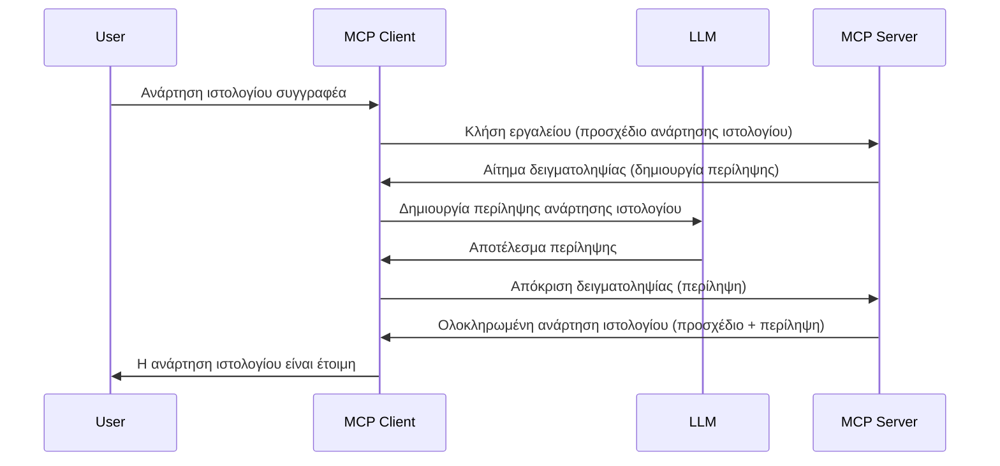

# Δειγματοληψία - ανάθεση λειτουργιών στον Πελάτη

> **Ειδοποίηση απο-υποστήριξης:** ο υποψήφιος για έκδοση προδιαγραφών MCP `2026-07-28` χαρακτηρίζει τη Δειγματοληψία ως απο-υποστηριζόμενη υπέρ της άμεσης ενσωμάτωσης με τα API παρόχων LLM. Η Δειγματοληψία συνεχίζει να λειτουργεί στην έκδοση `2025-11-25` και για τουλάχιστον ένα χρόνο μετά από οποιαδήποτε επίσημη απόσυρση, οπότε όλα όσα περιέχονται σε αυτό το μάθημα παραμένουν έγκυρα — αλλά τα νέα σχεδιαστικά σενάρια διακομιστών πρέπει να αξιολογήσουν το υποκατάστατο μοντέλο. Δείτε [Τι Αλλάζει στο MCP: Ο Υποψήφιος για Έκδοση 2026-07-28](../../01-CoreConcepts/mcp-2026-07-28-release-candidate.md).

Μερικές φορές, χρειάζεται ο MCP Πελάτης και ο MCP Διακομιστής να συνεργαστούν για να επιτύχουν έναν κοινό στόχο. Μπορεί να έχετε μια περίπτωση όπου ο Διακομιστής απαιτεί βοήθεια από ένα LLM που εκτελείται στον πελάτη. Για αυτή την κατάσταση, η δειγματοληψία είναι αυτό που πρέπει να χρησιμοποιήσετε.

Ας εξερευνήσουμε μερικές περιπτώσεις χρήσης και πώς να φτιάξουμε μια λύση που περιλαμβάνει δειγματοληψία.

## Επισκόπηση

Σε αυτό το μάθημα, εστιάζουμε στο να εξηγήσουμε πότε και πού να χρησιμοποιείτε τη Δειγματοληψία και πώς να τη ρυθμίζετε.

## Στόχοι Μάθησης

Σε αυτό το κεφάλαιο, θα:

- Εξηγήσουμε τι είναι η Δειγματοληψία και πότε να τη χρησιμοποιείτε.
- Δείξουμε πώς να διαμορφώσετε τη Δειγματοληψία στο MCP.
- Παρέχουμε παραδείγματα Δειγματοληψίας σε δράση.

## Τι είναι η Δειγματοληψία και γιατί να τη χρησιμοποιήσετε;

Η Δειγματοληψία είναι μια προηγμένη λειτουργία που λειτουργεί ως εξής:



### Αίτημα Δειγματοληψίας

Εντάξει, τώρα που έχουμε μια σφαιρική εικόνα ενός αξιοπιστου σεναρίου, ας μιλήσουμε για το αίτημα δειγματοληψίας που ο διακομιστής στέλνει στον πελάτη. Δείτε πώς μπορεί να μοιάζει ένα τέτοιο αίτημα σε μορφή JSON-RPC:

```json
{
  "jsonrpc": "2.0",
  "id": 1,
  "method": "sampling/createMessage",
  "params": {
    "messages": [
      {
        "role": "user",
        "content": {
          "type": "text",
          "text": "Create a blog post summary of the following blog post: <BLOG POST>"
        }
      }
    ],
    "modelPreferences": {
      "hints": [
        {
          "name": "claude-3-sonnet"
        }
      ],
      "intelligencePriority": 0.8,
      "speedPriority": 0.5
    },
    "systemPrompt": "You are a helpful assistant.",
    "maxTokens": 100
  }
}
```

Υπάρχουν μερικά σημεία εδώ που αξίζει να επισημανθούν:

- Η περιγραφή (prompt), κάτω από content -> text, είναι η εντολή μας προς το LLM για να συνοψίσει το περιεχόμενο ενός άρθρου ιστολογίου.

- **modelPreferences**. Αυτή η ενότητα είναι απλά μια προτίμηση, μια σύσταση για το ποια διαμόρφωση να χρησιμοποιηθεί με το LLM. Ο χρήστης μπορεί να επιλέξει να ακολουθήσει αυτές τις συστάσεις ή να τις αλλάξει. Στην περίπτωση αυτή υπάρχουν συστάσεις για το μοντέλο που θα χρησιμοποιηθεί, την ταχύτητα και την προτεραιότητα νοημοσύνης.
- **systemPrompt**, αυτή είναι η κανονική καθοδήγηση συστήματος που δίνει στο LLM προσωπικότητα και περιέχει οδηγίες καθοδήγησης.
- **maxTokens**, αυτή είναι άλλη μια ιδιότητα που χρησιμοποιείται για να πει πόσοι tokens συνιστώνται για χρήση σε αυτή την εργασία.

### Απάντηση Δειγματοληψίας

Αυτή η απάντηση είναι αυτό που ο MCP Πελάτης στέλνει πίσω στον MCP Διακομιστή και είναι το αποτέλεσμα του ότι ο πελάτης κάλεσε το LLM, περίμενε την απάντηση και μετά κατασκεύασε αυτό το μήνυμα. Δείτε πώς μπορεί να μοιάζει σε JSON-RPC:

```json
{
  "jsonrpc": "2.0",
  "id": 1,
  "result": {
    "role": "assistant",
    "content": {
      "type": "text",
      "text": "Here's your abstract <ABSTRACT>"
    },
    "model": "gpt-5",
    "stopReason": "endTurn"
  }
}
```

Σημειώστε πώς η απάντηση είναι μια περίληψη του άρθρου ιστολογίου όπως ζητήσαμε. Επίσης σημειώστε ότι το χρησιμοποιηθέν `model` δεν είναι αυτό που ζητήσαμε αλλά "gpt-5" αντί για "claude-3-sonnet". Αυτό για να δείξει ότι ο χρήστης μπορεί να αλλάξει γνώμη για το τι να χρησιμοποιήσει και ότι το αίτημα δειγματοληψίας είναι μια σύσταση.

Τώρα που κατανοούμε τη βασική ροή και μια χρήσιμη εργασία για να τη χρησιμοποιήσουμε "δημιουργία άρθρου ιστολογίου + περίληψη", ας δούμε τι πρέπει να κάνουμε για να λειτουργήσει.

### Τύποι μηνυμάτων

Τα μηνύματα δειγματοληψίας δεν περιορίζονται μόνο σε κείμενο αλλά μπορείτε επίσης να στείλετε εικόνες και ήχο. Δείτε πώς διαφέρει το JSON-RPC:

**Κείμενο**

```json
{
  "type": "text",
  "text": "The message content"
}
```

**Περιεχόμενο εικόνας**

```json
{
  "type": "image",
  "data": "base64-encoded-image-data",
  "mimeType": "image/jpeg"
}
```

**Περιεχόμενο ήχου**

```json
{
  "type": "audio",
  "data": "base64-encoded-audio-data",
  "mimeType": "audio/wav"
}
```

> ΣΗΜΕΙΩΣΗ: για περισσότερες λεπτομέρειες σχετικά με τη Δειγματοληψία, δείτε τα [επίσημα έγγραφα](https://modelcontextprotocol.io/specification/2025-11-25/client/sampling)

## Πώς να Ρυθμίσετε τη Δειγματοληψία στον Πελάτη

> Σημείωση: αν φτιάχνετε μόνο διακομιστή, δεν χρειάζεται να κάνετε πολλά εδώ.

Σε έναν πελάτη, πρέπει να ορίσετε την εξής λειτουργία ως εξής:

```json
{
  "capabilities": {
    "sampling": {}
  }
}
```

Αυτό θα ενεργοποιηθεί όταν ο επιλεγμένος πελάτης σας ξεκινήσει με τον διακομιστή.

## Παράδειγμα Δειγματοληψίας σε Δράση - Δημιουργία Άρθρου Ιστολογίου

Ας κωδικοποιήσουμε έναν διακομιστή δειγματοληψίας μαζί, πρέπει να κάνουμε τα εξής:

1. Δημιουργήστε ένα εργαλείο στον Διακομιστή.
1. Το εργαλείο θα πρέπει να δημιουργεί ένα αίτημα δειγματοληψίας
1. Το εργαλείο θα περιμένει την απάντηση από το αίτημα δειγματοληψίας του πελάτη.
1. Στη συνέχεια, το αποτέλεσμα του εργαλείου θα πρέπει να παραχθεί.

Ας δούμε τον κώδικα βήμα-βήμα:

### -1- Δημιουργία του εργαλείου

**python**

```python
@mcp.tool()
async def create_blog(title: str, content: str, ctx: Context[ServerSession, None]) -> str:
    """Create a blog post and generate a summary"""

```

### -2- Δημιουργία αιτήματος δειγματοληψίας

Επεκτείνετε το εργαλείο σας με τον ακόλουθο κώδικα:

**python**

```python
post = BlogPost(
        id=len(posts) + 1,
        title=title,
        content=content,
        abstract=""
    )

prompt = f"Create an abstract of the following blog post: title: {title} and draft: {content} "

result = await ctx.session.create_message(
        messages=[
            SamplingMessage(
                role="user",
                content=TextContent(type="text", text=prompt),
            )
        ],
        max_tokens=100,
)

```

### -3- Περιμένετε για την απάντηση και επιστρέψτε την απάντηση

**python**

```python
post.abstract = result.content.text

posts.append(post)

# επιστρέψτε το πλήρες προϊόν
return json.dumps({
    "id": post.title,
    "abstract": post.abstract
})
```

### -4- Πλήρης κώδικας

**python**

```python
from starlette.applications import Starlette
from starlette.routing import Mount, Host

from mcp.server.fastmcp import Context, FastMCP

from mcp.server.session import ServerSession
from mcp.types import SamplingMessage, TextContent

import json


from uuid import uuid4
from typing import List
from pydantic import BaseModel


mcp = FastMCP("Blog post generator")

# app = FastAPI()

posts = []

class BlogPost(BaseModel):
    id: int
    title: str
    content: str
    abstract: str

posts: List[BlogPost] = []

@mcp.tool()
async def create_blog(title: str, content: str, ctx: Context[ServerSession, None]) -> str:
    """Create a blog post and generate a summary"""

    post = BlogPost(
        id=len(posts) + 1,
        title=title,
        content=content,
        abstract=""
    )

    prompt = f"Create an abstract of the following blog post: title: {title} and draft: {content} "

    result = await ctx.session.create_message(
        messages=[
            SamplingMessage(
                role="user",
                content=TextContent(type="text", text=prompt),
            )
        ],
        max_tokens=100,
    )

    post.abstract = result.content.text

    posts.append(post)

    # επιστρέφει ολόκληρη την ανάρτηση ιστολογίου
    return json.dumps({
        "id": post.title,
        "abstract": post.abstract
    })

if __name__ == "__main__":
    print("Starting server...")
    # mcp.run()
    mcp.run(transport="streamable-http")

# εκτέλεση της εφαρμογής με: python server.py
```

### -5- Δοκιμή στο Visual Studio Code

Για να δοκιμάσετε αυτό στο Visual Studio Code, κάντε τα εξής:

1. Ξεκινήστε τον διακομιστή στο τερματικό
1. Προσθέστε τον στο *mcp.json* (και βεβαιωθείτε ότι έχει ξεκινήσει) π.χ κάτι σαν αυτό:

   ```json
   "servers": {
      "blog-server": {
        "type": "http",
        "url": "http://localhost:8000/mcp"
      }
   }
   ```

1. Πληκτρολογήστε ένα prompt:

   ```text
   create a blog post named "Where Python comes from", the content is "Python is actually named after Monty Python Flying Circus"
   ```

1. Επιτρέψτε να συμβεί η δειγματοληψία. Την πρώτη φορά που το δοκιμάζετε, θα παρουσιαστεί ένα επιπλέον παράθυρο διαλόγου που πρέπει να αποδεχθείτε, στη συνέχεια θα δείτε τον συνηθισμένο διάλογο να σας ζητά να τρέξετε ένα εργαλείο

1. Εξετάστε τα αποτελέσματα. Θα δείτε τα αποτελέσματα ωραία αποδοσμένα στο GitHub Copilot Chat αλλά μπορείτε επίσης να εξετάσετε την ακατέργαστη απάντηση JSON.

**Μπόνους**. Το εργαλείο του Visual Studio Code έχει εξαιρετική υποστήριξη για τη δειγματοληψία. Μπορείτε να ρυθμίσετε την πρόσβαση στη Δειγματοληψία στον εγκατεστημένο διακομιστή σας πηγαίνοντας ως εξής:

1. Πλοηγηθείτε στην ενότητα επεκτάσεων.
1. Επιλέξτε το εικονίδιο ρυθμίσεων για τον εγκατεστημένο διακομιστή στην ενότητα "MCP SERVERS - INSTALLED".
1 Επιλέξτε "Configure Model Access", εδώ μπορείτε να επιλέξετε ποια Μοντέλα επιτρέπεται να χρησιμοποιεί το GitHub Copilot κατα τη διάρκεια της δειγματοληψίας. Μπορείτε επίσης να δείτε όλα τα αιτήματα δειγματοληψίας που συνέβησαν πρόσφατα επιλέγοντας "Show Sampling requests".

## Ανάθεση

Στην ανάθεση αυτή, θα δημιουργήσετε μια ελαφρώς διαφορετική Δειγματοληψία, δηλαδή μια ενσωμάτωση δειγματοληψίας που υποστηρίζει τη δημιουργία περιγραφής προϊόντος. Ακολουθεί το σενάριό σας:

**Σενάριο**: Ο εργαζόμενος στο back office ενός ηλεκτρονικού καταστήματος χρειάζεται βοήθεια, του παίρνει πάρα πολύ χρόνο να δημιουργήσει περιγραφές προϊόντων. Συνεπώς, πρέπει να δημιουργήσετε μια λύση όπου μπορείτε να καλέσετε ένα εργαλείο "create_product" με "title" και "keywords" ως ορίσματα, και θα πρέπει να παράγει ένα ολοκληρωμένο προϊόν συμπεριλαμβανομένου ενός πεδίου "description" που θα συμπληρώνεται από το LLM ενός πελάτη.

TIP: χρησιμοποιήστε όσα μάθατε νωρίτερα για να κατασκευάσετε αυτό το διακομιστή και το εργαλείο του χρησιμοποιώντας ένα αίτημα δειγματοληψίας.

## Λύση

[Λύση](./solution/README.md)

## Κύρια Σημεία

Η δειγματοληψία είναι μια ισχυρή λειτουργία που επιτρέπει στον διακομιστή να αναθέτει εργασίες στον πελάτη όταν χρειάζεται την βοήθεια ενός LLM.

## Τι Ακολουθεί

- [Κεφάλαιο 4 - Πρακτική Εφαρμογή](../../04-PracticalImplementation/README.md)

---

<!-- CO-OP TRANSLATOR DISCLAIMER START -->
**Αποποίηση ευθυνών**:
Αυτό το έγγραφο έχει μεταφραστεί χρησιμοποιώντας την υπηρεσία μετάφρασης με τεχνητή νοημοσύνη [Co-op Translator](https://github.com/Azure/co-op-translator). Ενώ επιδιώκουμε την ακρίβεια, παρακαλούμε να έχετε υπόψη ότι οι αυτοματοποιημένες μεταφράσεις ενδέχεται να περιέχουν λάθη ή ανακρίβειες. Το πρωτότυπο έγγραφο στη μητρική του γλώσσα πρέπει να θεωρείται η αυθεντική πηγή. Για κρίσιμες πληροφορίες, συνιστάται επαγγελματική ανθρώπινη μετάφραση. Δεν φέρουμε ευθύνη για τυχόν παρεξηγήσεις ή λανθασμένες ερμηνείες που προκύπτουν από τη χρήση αυτής της μετάφρασης.
<!-- CO-OP TRANSLATOR DISCLAIMER END -->