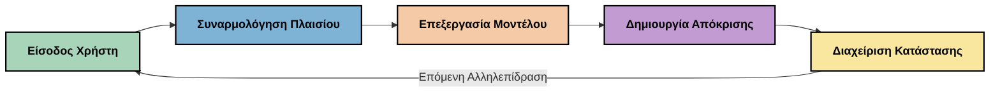
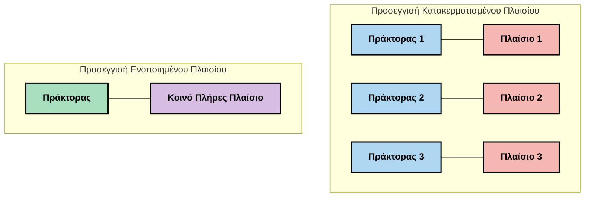
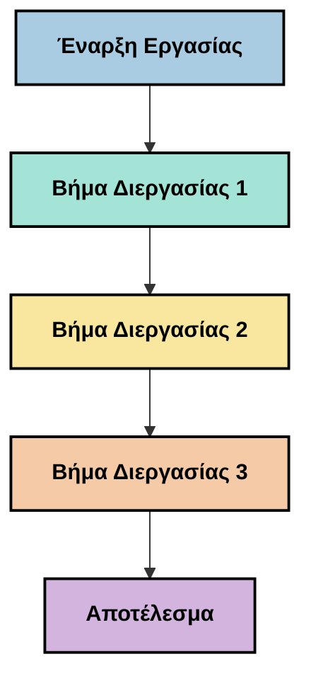
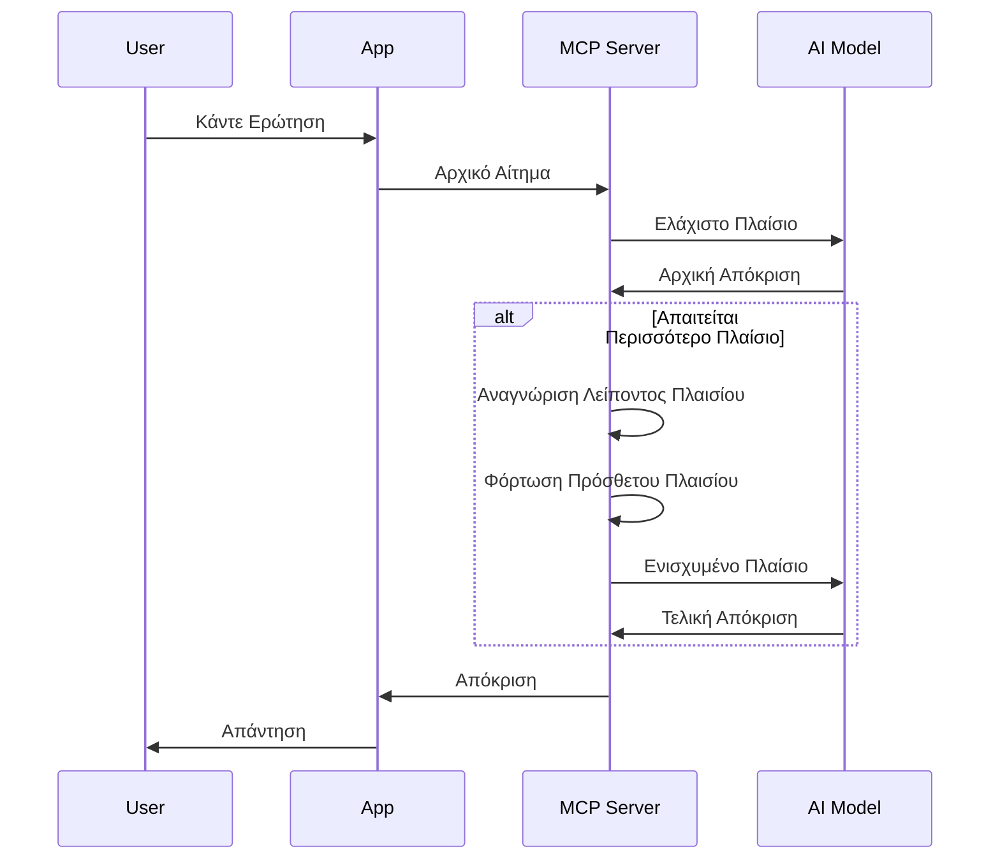
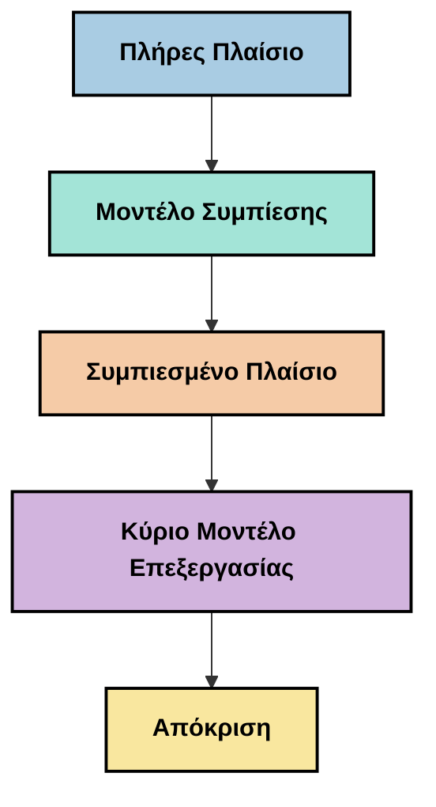
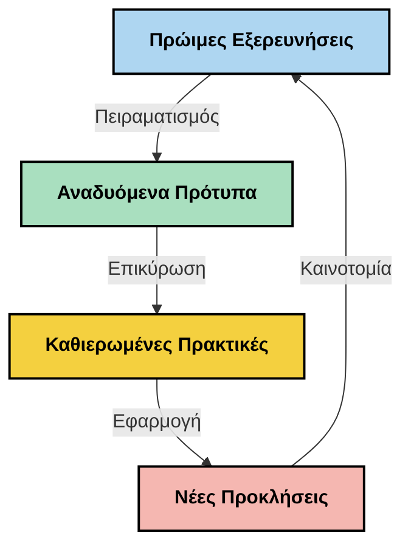

# Μηχανική Περιβάλλοντος: Μια Αναδυόμενη Έννοια στο Οικοσύστημα MCP

## Επισκόπηση

Η μηχανική περιβάλλοντος είναι μια αναδυόμενη έννοια στον χώρο της τεχνητής νοημοσύνης που εξερευνά πώς οργανώνεται, παραδίδεται και διατηρείται η πληροφορία σε όλη τη διάρκεια των αλληλεπιδράσεων μεταξύ πελατών και υπηρεσιών τεχνητής νοημοσύνης. Καθώς το οικοσύστημα του Πρωτοκόλλου Περιβάλλοντος Μοντέλου (MCP) εξελίσσεται, η κατανόηση του πώς να διαχειριζόμαστε αποτελεσματικά το περιβάλλον γίνεται όλο και πιο σημαντική. Αυτό το μάθημα εισάγει την έννοια της μηχανικής περιβάλλοντος και εξερευνά τις πιθανές εφαρμογές της σε υλοποιήσεις MCP.

## Στόχοι Μάθησης

Μέχρι το τέλος αυτού του μαθήματος, θα μπορείτε να:

- Κατανοήσετε την αναδυόμενη έννοια της μηχανικής περιβάλλοντος και τον πιθανό ρόλο της σε εφαρμογές MCP
- Αναγνωρίσετε βασικές προκλήσεις στη διαχείριση περιβάλλοντος που αντιμετωπίζει το πρωτόκολλο MCP
- Εξερευνήσετε τεχνικές για τη βελτίωση της απόδοσης μοντέλων μέσω καλύτερης διαχείρισης του περιβάλλοντος
- Εξετάσετε προσεγγίσεις μέτρησης και αξιολόγησης της αποτελεσματικότητας του περιβάλλοντος
- Εφαρμόσετε αυτές τις αναδυόμενες έννοιες για να βελτιώσετε τις εμπειρίες τεχνητής νοημοσύνης μέσω του πλαισίου MCP

## Εισαγωγή στη Μηχανική Περιβάλλοντος

Η μηχανική περιβάλλοντος είναι μια αναδυόμενη έννοια που επικεντρώνεται στον σκόπιμο σχεδιασμό και τη διαχείριση της ροής πληροφοριών μεταξύ χρηστών, εφαρμογών και μοντέλων τεχνητής νοημοσύνης. Σε αντίθεση με καθιερωμένους τομείς όπως η μηχανική εντολών (prompt engineering), η μηχανική περιβάλλοντος ορίζεται ακόμα από τους επαγγελματίες καθώς εργάζονται για να επιλύσουν τις μοναδικές προκλήσεις της παροχής των σωστών πληροφοριών στα μοντέλα τεχνητής νοημοσύνης τη σωστή στιγμή.

Καθώς τα μεγάλα γλωσσικά μοντέλα (LLMs) εξελίσσονται, η σημασία του περιβάλλοντος γίνεται ολοένα και πιο εμφανής. Η ποιότητα, η συνάφεια και η δομή του περιβάλλοντος που παρέχουμε επηρεάζουν άμεσα τα αποτελέσματα των μοντέλων. Η μηχανική περιβάλλοντος εξερευνά αυτή τη σχέση και επιδιώκει να αναπτύξει αρχές για αποτελεσματική διαχείριση του περιβάλλοντος.

> «Το 2025, τα μοντέλα εκεί έξω είναι εξαιρετικά έξυπνα. Αλλά ακόμα και ο πιο έξυπνος άνθρωπος δεν θα μπορέσει να εκτελέσει τη δουλειά του αποτελεσματικά χωρίς το περιβάλλον αυτού που του ζητείται να κάνει... Η "μηχανική περιβάλλοντος" είναι το επόμενο επίπεδο της μηχανικής εντολών. Πρόκειται για την αυτόματη εκτέλεση αυτού σε ένα δυναμικό σύστημα.» — Walden Yan, Cognition AI

Η μηχανική περιβάλλοντος μπορεί να περιλαμβάνει:

1. **Επιλογή Περιβάλλοντος**: Καθορισμός των πληροφοριών που είναι σχετικές για μια δεδομένη εργασία
2. **Δομή Περιβάλλοντος**: Οργάνωση πληροφοριών για μεγιστοποίηση της κατανόησης από το μοντέλο
3. **Παράδοση Περιβάλλοντος**: Βελτιστοποίηση του τρόπου και του χρόνου αποστολής πληροφοριών στα μοντέλα
4. **Συντήρηση Περιβάλλοντος**: Διαχείριση της κατάστασης και της εξέλιξης του περιβάλλοντος με την πάροδο του χρόνου
5. **Αξιολόγηση Περιβάλλοντος**: Μέτρηση και βελτίωση της αποτελεσματικότητας του περιβάλλοντος

Αυτοί οι τομείς εστίασης είναι ιδιαίτερα σημαντικοί για το οικοσύστημα MCP, που παρέχει έναν τυποποιημένο τρόπο για τις εφαρμογές να παρέχουν περιβάλλον στα LLM.


## Η Προοπτική του Ταξιδιού του Περιβάλλοντος

Ένας τρόπος να οπτικοποιηθεί η μηχανική περιβάλλοντος είναι να ακολουθήσουμε το ταξίδι που διανύει η πληροφορία μέσα από ένα σύστημα MCP:



### Κύρια Στάδια στο Ταξίδι του Περιβάλλοντος:

1. **Είσοδος Χρήστη**: Ακατέργαστες πληροφορίες από τον χρήστη (κείμενο, εικόνες, έγγραφα)
2. **Συναρμολόγηση Περιβάλλοντος**: Συνδυασμός εισόδου χρήστη με το σύστημα περιβάλλοντος, ιστορικό συνομιλίας και άλλες ανακτημένες πληροφορίες
3. **Επεξεργασία από το Μοντέλο**: Το μοντέλο AI επεξεργάζεται το συναρμολογημένο περιβάλλον
4. **Δημιουργία Απάντησης**: Το μοντέλο παράγει αποτελέσματα βασισμένα στο παρεχόμενο περιβάλλον
5. **Διαχείριση Κατάστασης**: Το σύστημα ενημερώνει την εσωτερική του κατάσταση με βάση την αλληλεπίδραση

Αυτή η προοπτική αναδεικνύει τη δυναμική φύση του περιβάλλοντος στα συστήματα AI και εγείρει σημαντικά ερωτήματα σχετικά με το πώς να διαχειριζόμαστε καλύτερα την πληροφορία σε κάθε στάδιο.

## Αναδυόμενες Αρχές στη Μηχανική Περιβάλλοντος

Καθώς ο τομέας της μηχανικής περιβάλλοντος διαμορφώνεται, κάποιες πρώιμες αρχές αρχίζουν να αναδύονται από τους επαγγελματίες. Αυτές οι αρχές μπορεί να βοηθήσουν στις επιλογές υλοποίησης MCP:

### Αρχή 1: Μοιραστείτε το Περιβάλλον Πλήρως

Το περιβάλλον θα πρέπει να μοιράζεται πλήρως μεταξύ όλων των στοιχείων ενός συστήματος, αντί να κατακερματίζεται σε πολλούς πράκτορες ή διαδικασίες. Όταν το περιβάλλον διανέμεται, οι αποφάσεις που λαμβάνονται σε ένα μέρος του συστήματος ενδέχεται να έρχονται σε σύγκρουση με αυτές που λαμβάνονται αλλού.



Στις εφαρμογές MCP, αυτό προτείνει το σχεδιασμό συστημάτων όπου το περιβάλλον ρέει αδιάλειπτα σε όλη την αλυσίδα αντί να είναι διαχωρισμένο.

### Αρχή 2: Αναγνωρίστε Ότι οι Ενέργειες Φέρουν Στοχευμένες Αποφάσεις

Κάθε ενέργεια που κάνει ένα μοντέλο ενσωματώνει στοχευμένες αποφάσεις σχετικά με το πώς να ερμηνεύσει το περιβάλλον. Όταν πολλαπλά στοιχεία δρουν σε διαφορετικά περιβάλλοντα, αυτές οι στοχευμένες αποφάσεις μπορούν να συγκρουστούν, οδηγώντας σε ασυνεπή αποτελέσματα.

Αυτή η αρχή έχει σημαντικές επιπτώσεις για τις εφαρμογές MCP:
- Προτιμήστε γραμμική επεξεργασία σύνθετων εργασιών αντί για ταυτόχρονη εκτέλεση με κατακερματισμένο περιβάλλον
- Διασφαλίστε ότι όλα τα σημεία λήψης αποφάσεων έχουν πρόσβαση στην ίδια περιβαλλοντική πληροφορία
- Σχεδιάστε συστήματα όπου τα επόμενα βήματα μπορούν να δουν ολόκληρο το περιβάλλον των προηγούμενων αποφάσεων

### Αρχή 3: Ισορροπήστε το Βάθος του Περιβάλλοντος με τους Περιορισμούς Παραθύρου

Καθώς οι συνομιλίες και οι διαδικασίες μεγαλώνουν, τα παράθυρα περιβάλλοντος τελικά υπερφορτώνονται. Η αποτελεσματική μηχανική περιβάλλοντος εξερευνά προσεγγίσεις για τη διαχείριση αυτής της έντασης μεταξύ ολοκληρωμένου περιβάλλοντος και τεχνικών περιορισμών.

Πιθανές προσεγγίσεις που εξετάζονται περιλαμβάνουν:
- Συμπίεση περιβάλλοντος που διατηρεί βασικές πληροφορίες ενώ μειώνει τη χρήση token
- Προοδευτική φόρτωση του περιβάλλοντος με βάση τη σχετικότητα στις τρέχουσες ανάγκες
- Περίληψη προηγούμενων αλληλεπιδράσεων διατηρώντας βασικές αποφάσεις και στοιχεία

## Προκλήσεις Περιβάλλοντος και Σχεδιασμός Πρωτοκόλλου MCP

Το Πρωτόκολλο Περιβάλλοντος Μοντέλου (MCP) σχεδιάστηκε με επίγνωση των μοναδικών προκλήσεων της διαχείρισης περιβάλλοντος. Η κατανόηση αυτών των προκλήσεων βοηθάει να εξηγηθούν βασικές πτυχές του σχεδιασμού του MCP:


### Πρόκληση 1: Περιορισμοί Παραθύρου Περιβάλλοντος
Τα περισσότερα μοντέλα AI έχουν σταθερά μεγέθη παραθύρων περιβάλλοντος, περιορίζοντας το πόση πληροφορία μπορούν να επεξεργαστούν ταυτόχρονα.

**Απάντηση Σχεδιασμού MCP:** 
- Το πρωτόκολλο υποστηρίζει δομημένο, βασισμένο σε πόρους περιβάλλον που μπορεί να αναφέρεται αποτελεσματικά
- Οι πόροι μπορούν να σελιδοποιούνται και να φορτώνονται προοδευτικά

### Πρόκληση 2: Καθορισμός Συνάφειας
Είναι δύσκολο να προσδιοριστεί ποια πληροφορία είναι πιο σχετική για να συμπεριληφθεί στο περιβάλλον.

**Απάντηση Σχεδιασμού MCP:**
- Ευέλικτα εργαλεία επιτρέπουν δυναμική ανάκτηση πληροφοριών βάσει της ανάγκης
- Δομημένες εντολές επιτρέπουν συνεπή οργάνωση περιβάλλοντος

### Πρόκληση 3: Διατήρηση Περιβάλλοντος
Η διαχείριση της κατάστασης σε αλληλεπιδράσεις απαιτεί προσεκτική παρακολούθηση του περιβάλλοντος.

**Απάντηση Σχεδιασμού MCP:**
- Τυποποιημένη διαχείριση συνεδριών
- Σαφώς ορισμένα πρότυπα αλληλεπιδράσεων για εξέλιξη του περιβάλλοντος

### Πρόκληση 4: Πολυμορφικό Περιβάλλον
Διάφοροι τύποι δεδομένων (κείμενο, εικόνες, δομημένα δεδομένα) απαιτούν διαφορετικό χειρισμό.

**Απάντηση Σχεδιασμού MCP:**
- Ο σχεδιασμός του πρωτοκόλλου ανταποκρίνεται σε διάφορους τύπους περιεχομένου
- Τυποποιημένη αναπαράσταση πολυμορφικών πληροφοριών

### Πρόκληση 5: Ασφάλεια και Ιδιωτικότητα
Το περιβάλλον συχνά περιέχει ευαίσθητες πληροφορίες που πρέπει να προστατεύονται.

**Απάντηση Σχεδιασμού MCP:**
- Ξεκάθαρα όρια ανάμεσα σε ευθύνες πελάτη και διακομιστή
- Τοπικές επιλογές επεξεργασίας για ελαχιστοποίηση της έκθεσης δεδομένων

Η κατανόηση αυτών των προκλήσεων και πώς το MCP τις αντιμετωπίζει παρέχει μια βάση για την εξερεύνηση πιο εξελιγμένων τεχνικών μηχανικής περιβάλλοντος.

## Αναδυόμενες Προσεγγίσεις Μηχανικής Περιβάλλοντος

Καθώς ο τομέας της μηχανικής περιβάλλοντος εξελίσσεται, εμφανίζονται αρκετές υποσχόμενες προσεγγίσεις. Αυτές αντιπροσωπεύουν τις τρέχουσες αντιλήψεις και όχι καθιερωμένες βέλτιστες πρακτικές και πιθανόν να εξελιχθούν καθώς αποκτούμε περισσότερη εμπειρία με τις υλοποιήσεις MCP.

### 1. Μονογραμμική Γραμμική Επεξεργασία

Σε αντίθεση με τις πολυπράκτορες αρχιτεκτονικές που διανέμουν το περιβάλλον, κάποιοι επαγγελματίες διαπιστώνουν ότι η μονογραμμική γραμμική επεξεργασία παράγει πιο συνεπή αποτελέσματα. Αυτό ευθυγραμμίζεται με την αρχή διατήρησης ενιαίου περιβάλλοντος.



Αν και αυτή η προσέγγιση μπορεί να φαίνεται λιγότερο αποδοτική από την παράλληλη επεξεργασία, συχνά παράγει πιο συνεκτικά και αξιόπιστα αποτελέσματα επειδή κάθε βήμα χτίζεται πάνω σε πλήρη κατανόηση των προηγούμενων αποφάσεων.

### 2. Κατάτμηση και Προτεραιοποίηση Περιβάλλοντος

Διαχωρισμός μεγάλων περιβαλλόντων σε διαχειρίσιμα κομμάτια και προτεραιοποίηση των πιο σημαντικών.

```python
# Ενδεικτικό Παράδειγμα: Τμηματοποίηση και Ιεράρχηση Πλαισίου
def process_with_chunked_context(documents, query):
    # 1. Διαχωρίστε τα έγγραφα σε μικρότερα τμήματα
    chunks = chunk_documents(documents)
    
    # 2. Υπολογίστε βαθμούς συνάφειας για κάθε τμήμα
    scored_chunks = [(chunk, calculate_relevance(chunk, query)) for chunk in chunks]
    
    # 3. Ταξινομήστε τα τμήματα κατά βαθμό συνάφειας
    sorted_chunks = sorted(scored_chunks, key=lambda x: x[1], reverse=True)
    
    # 4. Χρησιμοποιήστε τα πιο σχετικά τμήματα ως πλαίσιο
    context = create_context_from_chunks([chunk for chunk, score in sorted_chunks[:5]])
    
    # 5. Επεξεργαστείτε με το προτεραιοποιημένο πλαίσιο
    return generate_response(context, query)
```

Η παραπάνω έννοια δείχνει πώς θα μπορούσαμε να σπάσουμε μεγάλα έγγραφα σε διαχειρίσιμα τμήματα και να επιλέξουμε μόνο τα πιο σχετικά μέρη για το περιβάλλον. Αυτή η προσέγγιση μπορεί να βοηθήσει στη λειτουργία εντός των περιορισμών των παραθύρων περιβάλλοντος ενώ αξιοποιεί μεγάλες βάσεις γνώσεων.

### 3. Προοδευτική Φόρτωση Περιβάλλοντος

Φόρτωση του περιβάλλοντος προοδευτικά, ανάλογα με την ανάγκη και όχι όλου ταυτόχρονα.



Η προοδευτική φόρτωση περιβάλλοντος ξεκινά με ελάχιστο περιβάλλον και επεκτείνεται μόνο όταν είναι απαραίτητο. Αυτό μπορεί να μειώσει σημαντικά τη χρήση token για απλά ερωτήματα, διατηρώντας ταυτόχρονα τη δυνατότητα διαχείρισης σύνθετων ερωτήσεων.

### 4. Συμπίεση και Περίληψη Περιβάλλοντος

Μείωση του μεγέθους του περιβάλλοντος ενώ διατηρείται η ουσιώδης πληροφορία.



Η συμπίεση περιβάλλοντος επικεντρώνεται στο:
- Αφαίρεση πλεονάζουσας πληροφορίας
- Περίληψη εκτενούς περιεχομένου
- Εξαγωγή βασικών γεγονότων και λεπτομερειών
- Διατήρηση κρίσιμων στοιχείων περιβάλλοντος
- Βελτιστοποίηση για αποδοτική χρήση token

Αυτή η προσέγγιση μπορεί να είναι ιδιαίτερα χρήσιμη για τη διατήρηση μακρών συνομιλιών εντός ορίων παραθύρων περιβάλλοντος ή για αποτελεσματική επεξεργασία μεγάλων εγγράφων. Κάποιοι επαγγελματίες χρησιμοποιούν εξειδικευμένα μοντέλα ειδικά για τη συμπίεση και περίληψη του ιστορικού συνομιλίας.


## Εξερευνητικές Σκέψεις για τη Μηχανική Περιβάλλοντος

Καθώς εξερευνούμε τον αναδυόμενο τομέα της μηχανικής περιβάλλοντος, υπάρχουν κάποιες σκέψεις που αξίζει να έχουμε κατά νου όταν δουλεύουμε με υλοποιήσεις MCP. Αυτές δεν είναι επιβεβλημένες βέλτιστες πρακτικές αλλά πεδία εξερεύνησης που μπορεί να φέρουν βελτιώσεις στη συγκεκριμένη χρήση σας.

### Εξετάστε τους Στόχους του Περιβάλλοντός σας

Πριν υλοποιήσετε σύνθετες λύσεις διαχείρισης περιβάλλοντος, ορίστε ξεκάθαρα τι προσπαθείτε να πετύχετε:
- Ποιες συγκεκριμένες πληροφορίες χρειάζεται το μοντέλο για να πετύχει;
- Ποια πληροφορία είναι ουσιώδης και ποια συμπληρωματική;
- Ποιοι είναι οι περιορισμοί απόδοσης (καθυστέρηση, όρια token, κόστη);

### Εξερευνήστε Πολυστρωματικές Προσεγγίσεις Περιβάλλοντος

Κάποιοι επαγγελματίες βρίσκουν επιτυχία με περιβάλλον οργανωμένο σε εννοιολογικά στρώματα:
- **Βασικό Στρώμα**: Απαραίτητες πληροφορίες που χρειάζεται πάντα το μοντέλο
- **Στιγμιαίο Στρώμα**: Περιβάλλον συγκεκριμένο για την τρέχουσα αλληλεπίδραση
- **Υποστηρικτικό Στρώμα**: Επιπλέον πληροφορίες που μπορεί να είναι χρήσιμες
- **Στρώμα Ανάκτησης**: Πληροφορία προσβάσιμη μόνο όταν χρειάζεται

### Ερευνήστε Στρατηγικές Ανάκτησης

Η αποτελεσματικότητα του περιβάλλοντός σας συχνά εξαρτάται από τον τρόπο που ανακτάτε πληροφορίες:
- Σημασιολογική αναζήτηση και embeddings για εύρεση εννοιολογικά σχετικών πληροφοριών
- Αναζήτηση με λέξεις-κλειδιά για συγκεκριμένες πραγματικές λεπτομέρειες
- Υβριδικές προσεγγίσεις που συνδυάζουν πολλούς τρόπους ανάκτησης
- Φιλτράρισμα μεταδεδομένων για περιορισμό πεδίου βάσει κατηγοριών, ημερομηνιών ή πηγών

### Πειραματιστείτε με τη Συνοχή του Περιβάλλοντος

Η δομή και η ροή του περιβάλλοντος μπορεί να επηρεάσει την κατανόηση από το μοντέλο:
- Ομαδοποίηση σχετικών πληροφοριών
- Χρήση συνεπούς μορφοποίησης και οργάνωσης
- Διατήρηση λογικής ή χρονολογικής σειράς όπου είναι κατάλληλο
- Αποφυγή αντιφατικών πληροφοριών

### Εκτιμήστε τα Πλεονεκτήματα και Μειονεκτήματα Πολυπράκτορων Αρχιτεκτονικών

Ενώ οι πολυπράκτορες αρχιτεκτονικές είναι δημοφιλείς σε πολλά πλαίσια AI, συνοδεύονται από σημαντικές προκλήσεις για τη διαχείριση περιβάλλοντος:
- Ο κατακερματισμός περιβάλλοντος μπορεί να οδηγήσει σε ασυνεπείς αποφάσεις ανάμεσα σε πράκτορες
- Η παράλληλη επεξεργασία μπορεί να προκαλέσει συγκρούσεις δύσκολες να αποκατασταθούν
- Το επικοινωνιακό φορτίο ανάμεσα στους πράκτορες μπορεί να αντισταθμίσει τα οφέλη απόδοσης
- Απαιτείται σύνθετη διαχείριση κατάστασης για τη διατήρηση της συνοχής

Σε πολλές περιπτώσεις, μια μονοπράκτορη προσέγγιση με ολοκληρωμένη διαχείριση περιβάλλοντος μπορεί να αποδώσει πιο αξιόπιστα αποτελέσματα από πολλαπλούς εξειδικευμένους πράκτορες με κατακερματισμένο περιβάλλον.

### Αναπτύξτε Μεθόδους Αξιολόγησης

Για να βελτιώσετε τη μηχανική περιβάλλοντος με την πάροδο του χρόνου, σκεφτείτε πώς θα μετρήσετε την επιτυχία:
- Δοκιμές A/B με διαφορετικές δομές περιβάλλοντος
- Παρακολούθηση χρήσης token και χρόνων απόκρισης
- Παρακολούθηση ικανοποίησης χρηστών και ποσοστών ολοκλήρωσης εργασιών
- Ανάλυση πότε και γιατί αποτυγχάνουν οι στρατηγικές περιβάλλοντος

Αυτές οι σκέψεις αντιπροσωπεύουν ενεργά πεδία εξερεύνησης στον χώρο της μηχανικής περιβάλλοντος. Καθώς ο τομέας ωριμάζει, πιθανώς θα αναδυθούν πιο οριστικά πρότυπα και πρακτικές.

## Μέτρηση της Αποτελεσματικότητας του Περιβάλλοντος: Ένα Εξελισσόμενο Πλαίσιο

Καθώς η μηχανική περιβάλλοντος αναδύεται ως έννοια, οι επαγγελματίες αρχίζουν να εξερευνούν πώς θα μπορούσαμε να μετρήσουμε την αποτελεσματικότητά της. Δεν υπάρχει ακόμα καθιερωμένο πλαίσιο, αλλά διάφοροι μετρικοί παράγοντες εξετάζονται που θα μπορούσαν να βοηθήσουν στη διαμόρφωση μελλοντικής εργασίας.

### Πιθανά Διαστάσεις Μέτρησης


#### 1. Θεωρήσεις Αποδοτικότητας Εισόδου

- **Αναλογία Περιβάλλοντος προς Απόκριση**: Πόσο περιβάλλον χρειάζεται σε σχέση με το μέγεθος της απόκρισης;
- **Χρήση Token**: Ποιο ποσοστό των παρεχόμενων token περιβάλλοντος φαίνεται να επηρεάζει την απόκριση;
- **Μείωση Περιβάλλοντος**: Πόσο αποτελεσματικά μπορούμε να συμπιέσουμε την ακατέργαστη πληροφορία;

#### 2. Θεωρήσεις Απόδοσης

- **Επίδραση Καθυστέρησης**: Πώς επηρεάζει η διαχείριση περιβάλλοντος το χρόνο απόκρισης;
- **Οικονομία Token**: Βελτιστοποιούμε αποδοτικά τη χρήση token;
- **Ακρίβεια Ανάκτησης**: Πόσο σχετική είναι η ανακτημένη πληροφορία;
- **Χρήση Πόρων**: Ποιους υπολογιστικούς πόρους απαιτεί;

#### 3. Θεωρήσεις Ποιότητας

- **Συνάφεια Απόκρισης**: Πόσο καλά η απόκριση απαντά στο ερώτημα;
- **Ακρίβεια Γεγονότων**: Βελτιώνει η διαχείριση περιβάλλοντος την ορθότητα των γεγονότων;
- **Συνέπεια**: Είναι οι αποκρίσεις συνεπείς σε παρόμοια ερωτήματα;
- **Ποσοστό Ψευδαισθήσεων**: Μειώνει το καλύτερο περιβάλλον τις ψευδαισθήσεις του μοντέλου;

#### 4. Θεωρήσεις Εμπειρίας Χρήστη

- **Ποσοστό Αιτήσεων Για Διευκρινίσεις**: Πόσο συχνά οι χρήστες χρειάζονται διευκρινίσεις;
- **Ολοκλήρωση Εργασιών**: Καταφέρνουν οι χρήστες να εκπληρώσουν τους στόχους τους;
- **Δείκτες Ικανοποίησης**: Πώς αξιολογούν οι χρήστες την εμπειρία τους;

### Εξερευνητικές Προσεγγίσεις στη Μέτρηση

Όταν πειραματίζεστε με μηχανική περιβάλλοντος σε υλοποιήσεις MCP, σκεφτείτε αυτές τις εξερευνητικές προσεγγίσεις:

1. **Σύγκριση Βάσης**: Καθιερώστε μια βάση με απλές προσεγγίσεις περιβάλλοντος πριν δοκιμάσετε πιο προηγμένες μεθόδους

2. **Σταδιακές Αλλαγές**: Αλλάξτε ένα στοιχείο της διαχείρισης περιβάλλοντος κάθε φορά για να απομονώσετε τις επιπτώσεις του

3. **Αξιολόγηση με Κέντρο τον Χρήστη**: Συνδυάστε ποσοτικά μέτρα με ποιοτική ανατροφοδότηση από χρήστες

4. **Ανάλυση Αποτυχιών**: Εξετάστε περιπτώσεις που αποτυγχάνουν οι στρατηγικές περιβάλλοντος για να κατανοήσετε πιθανά σημεία βελτίωσης

5. **Πολυδιάστατη Αξιολόγηση**: Σκεφτείτε τα ανταλλάγματα μεταξύ αποδοτικότητας, ποιότητας και εμπειρίας χρήστη

Αυτή η πειραματική, πολυδιάστατη προσέγγιση στη μέτρηση ευθυγραμμίζεται με τη φύση της αναδυόμενης μηχανικής περιβάλλοντος.

## Τελικές Σκέψεις

Η μηχανική περιβάλλοντος είναι ένας αναδυόμενος τομέας εξερεύνησης που μπορεί να αποδειχθεί κεντρικός για αποτελεσματικές εφαρμογές MCP. Με προσεκτική σκέψη για το πώς ρέει η πληροφορία μέσα στο σύστημά σας, μπορείτε πιθανά να δημιουργήσετε εμπειρίες AI που είναι πιο αποδοτικές, ακριβείς και πολύτιμες για τους χρήστες.

Οι τεχνικές και προσεγγίσεις που περιγράφονται σε αυτό το μάθημα αντιπροσωπεύουν πρώιμες ιδέες στον τομέα αυτό, όχι καθιερωμένες πρακτικές. Η μηχανική περιβάλλοντος μπορεί να εξελιχθεί σε μια πιο ορισμένη επιστήμη καθώς οι δυνατότητες AI προχωρούν και η κατανόησή μας βαθαίνει. Προς το παρόν, ο πειραματισμός σε συνδυασμό με προσεκτική μέτρηση φαίνεται η πιο παραγωγική προσέγγιση.

## Πιθανοί Μελλοντικοί Προσανατολισμοί

Ο τομέας της μηχανικής περιβάλλοντος βρίσκεται ακόμα στα αρχικά του στάδια, αλλά αναδύονται αρκετές υποσχόμενες κατευθύνσεις:

- Οι αρχές μηχανικής περιβάλλοντος μπορεί να επηρεάσουν σημαντικά την απόδοση μοντέλων, την αποδοτικότητα, την εμπειρία χρήστη και την αξιοπιστία
- Οι μονογραμμικές προσεγγίσεις με ολοκληρωμένη διαχείριση περιβάλλοντος μπορεί να έχουν καλύτερη απόδοση από τις πολυπράκτορες αρχιτεκτονικές σε πολλές περιπτώσεις χρήσης
- Εξειδικευμένα μοντέλα συμπίεσης περιβάλλοντος μπορεί να γίνουν τυπικά συστατικά στις αλυσίδες AI
- Η ένταση μεταξύ πληρότητας περιβάλλοντος και περιορισμών token πιθανότατα θα οδηγήσει σε καινοτομίες στη διαχείριση περιβάλλοντος
- Καθώς τα μοντέλα γίνονται πιο ικανά στην αποδοτική, ανθρώπινη επικοινωνία, η αληθινή συνεργασία πολλαπλών πρακτόρων μπορεί να καταστεί πιο εφικτή
- Οι υλοποιήσεις MCP μπορεί να εξελιχθούν για να τυποποιήσουν τα πρότυπα διαχείρισης περιβάλλοντος που αναδύονται από τον τρέχοντα πειραματισμό



## Πόροι

### Επίσημοι Πόροι MCP
- [Model Context Protocol Website](https://modelcontextprotocol.io/)
- [Model Context Protocol Specification](https://github.com/modelcontextprotocol/modelcontextprotocol)

- [Τεκμηρίωση MCP](https://modelcontextprotocol.io/docs)
- [MCP C# SDK](https://github.com/modelcontextprotocol/csharp-sdk)
- [MCP Python SDK](https://github.com/modelcontextprotocol/python-sdk)
- [MCP TypeScript SDK](https://github.com/modelcontextprotocol/typescript-sdk)
- [MCP Inspector](https://github.com/modelcontextprotocol/inspector) - Εργαλείο οπτικού ελέγχου για διακομιστές MCP

### Άρθρα Μηχανικής Περιεχομένου
- [Μην Δημιουργείτε Πολλαπλούς Πράκτορες: Αρχές της Μηχανικής Περιεχομένου](https://cognition.ai/blog/dont-build-multi-agents) - Παρατηρήσεις του Walden Yan σχετικά με τις αρχές της μηχανικής περιεχομένου
- [Ένας Πρακτικός Οδηγός για την Κατασκευή Πρακτόρων](https://cdn.openai.com/business-guides-and-resources/a-practical-guide-to-building-agents.pdf) - Οδηγός της OpenAI για τον αποτελεσματικό σχεδιασμό πρακτόρων
- [Κατασκευάζοντας Αποτελεσματικούς Πράκτορες](https://www.anthropic.com/engineering/building-effective-agents) - Η προσέγγιση της Anthropic στην ανάπτυξη πρακτόρων

### Σχετική Έρευνα
- [Δυναμική Ενίσχυση Ανάκτησης για Μεγάλα Μοντέλα Γλώσσας](https://arxiv.org/abs/2310.01487) - Έρευνα πάνω σε δυναμικές μεθόδους ανάκτησης
- [Χαμένοι στη Μέση: Πώς τα Μοντέλα Γλώσσας Χρησιμοποιούν Μεγάλα Πλαίσια](https://arxiv.org/abs/2307.03172) - Σημαντική έρευνα σχετικά με μοτίβα επεξεργασίας περιεχομένου
- [Ιεραρχική Γενιά Εικόνας με Βάση Κείμενο με Χρήση CLIP Latents](https://arxiv.org/abs/2204.06125) - Άρθρο DALL-E 2 με παρατηρήσεις για τη δομή του περιεχομένου
- [Εξερευνώντας τον Ρόλο του Περιεχομένου σε Αρχιτεκτονικές Μεγάλων Μοντέλων Γλώσσας](https://aclanthology.org/2023.findings-emnlp.124/) - Πρόσφατη έρευνα για την επεξεργασία περιεχομένου
- [Συνεργασία Πολλαπλών Πρακτόρων: Μια Έρευνα](https://arxiv.org/abs/2304.03442) - Έρευνα σε συστήματα πολλαπλών πρακτόρων και τις προκλήσεις τους

### Πρόσθετοι Πόροι
- [Τεχνικές Βελτιστοποίησης Παραθύρου Περιεχομένου](https://learn.microsoft.com/en-us/azure/ai-services/openai/concepts/context-window)
- [Προηγμένες Τεχνικές RAG](https://www.microsoft.com/en-us/research/blog/retrieval-augmented-generation-rag-and-frontier-models/)
- [Τεκμηρίωση Semantic Kernel](https://github.com/microsoft/semantic-kernel)
- [Εργαλειοθήκη AI για Διαχείριση Περιεχομένου](https://github.com/microsoft/aitoolkit)

## Τι ακολουθεί

- [5.15 Προσαρμοσμένη Μεταφορά MCP](../mcp-transport/README.md)

---

<!-- CO-OP TRANSLATOR DISCLAIMER START -->
**Αποποίηση ευθυνών**:
Αυτό το έγγραφο έχει μεταφραστεί χρησιμοποιώντας την υπηρεσία μετάφρασης με τεχνητή νοημοσύνη [Co-op Translator](https://github.com/Azure/co-op-translator). Ενώ επιδιώκουμε την ακρίβεια, παρακαλούμε να έχετε υπόψη ότι οι αυτοματοποιημένες μεταφράσεις ενδέχεται να περιέχουν λάθη ή ανακρίβειες. Το πρωτότυπο έγγραφο στη μητρική του γλώσσα πρέπει να θεωρείται η αυθεντική πηγή. Για κρίσιμες πληροφορίες, συνιστάται επαγγελματική ανθρώπινη μετάφραση. Δεν φέρουμε ευθύνη για τυχόν παρεξηγήσεις ή λανθασμένες ερμηνείες που προκύπτουν από τη χρήση αυτής της μετάφρασης.
<!-- CO-OP TRANSLATOR DISCLAIMER END -->