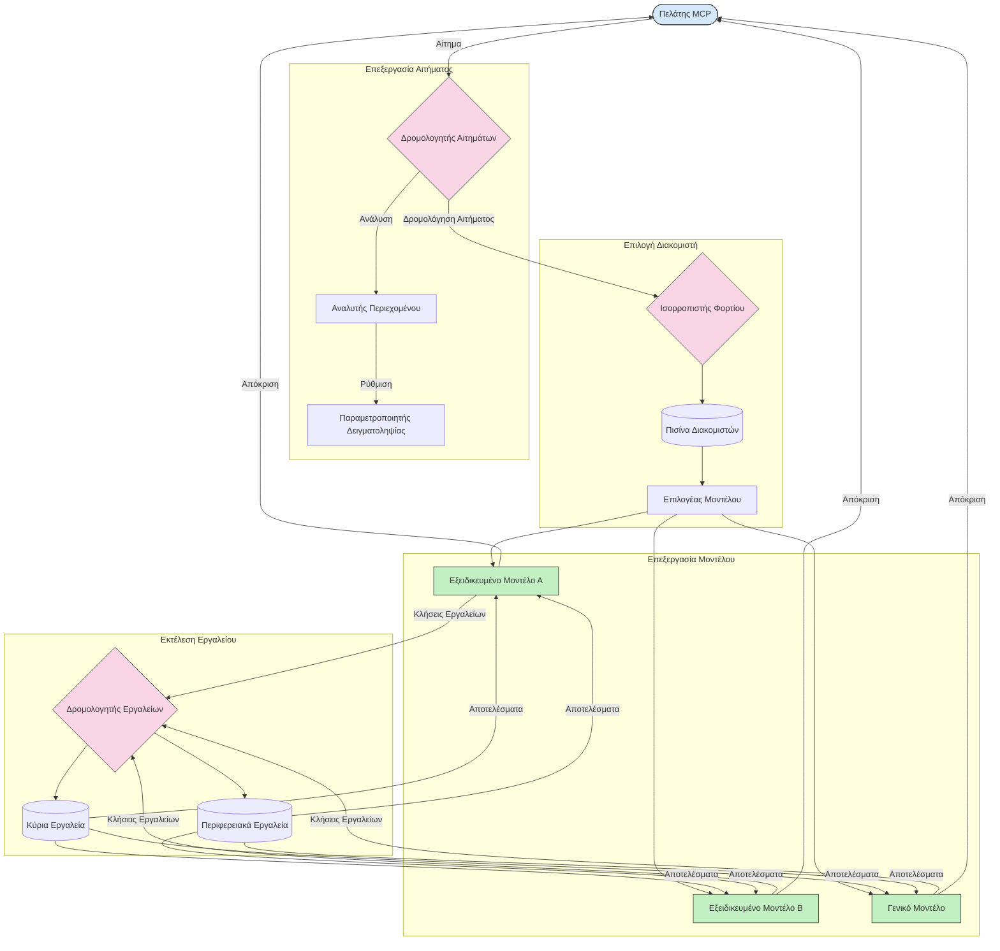

# Δρομολόγηση στο Πρωτόκολλο Πλαισίου Μοντέλου

Η δρομολόγηση είναι απαραίτητη για την κατεύθυνση των αιτημάτων προς τα κατάλληλα μοντέλα, εργαλεία ή υπηρεσίες μέσα σε ένα οικοσύστημα MCP.

## Εισαγωγή

Η δρομολόγηση στο Πρωτόκολλο Πλαισίου Μοντέλου (MCP) περιλαμβάνει την κατεύθυνση των αιτημάτων προς τα πιο κατάλληλα μοντέλα ή υπηρεσίες με βάση διάφορα κριτήρια όπως τύπος περιεχομένου, πλαίσιο χρήστη και φόρτος συστήματος. Αυτό εξασφαλίζει αποτελεσματική επεξεργασία και βέλτιστη αξιοποίηση πόρων.

## Μαθησιακοί Στόχοι

Στο τέλος αυτού του μαθήματος, θα μπορείτε να:

- Κατανοείτε τις αρχές της δρομολόγησης στο MCP.
- Υλοποιείτε δρομολόγηση βασισμένη στο περιεχόμενο για να κατευθύνετε αιτήματα σε εξειδικευμένες υπηρεσίες.
- Εφαρμόζετε έξυπνες στρατηγικές ισορροπίας φορτίου για βελτιστοποίηση της χρήσης πόρων.
- Υλοποιείτε δυναμική δρομολόγηση εργαλείων βάσει του πλαισίου του αιτήματος.

## Δρομολόγηση Βασισμένη στο Περιεχόμενο

Η δρομολόγηση βασισμένη στο περιεχόμενο κατευθύνει αιτήματα σε εξειδικευμένες υπηρεσίες βάσει του περιεχομένου του αιτήματος. Για παράδειγμα, αιτήματα σχετικά με τη δημιουργία κώδικα μπορούν να δρομολογηθούν σε ένα εξειδικευμένο μοντέλο κώδικα, ενώ αιτήματα δημιουργικής γραφής μπορούν να αποσταλούν σε ένα μοντέλο δημιουργικής γραφής.

Ας δούμε ένα παράδειγμα υλοποίησης σε διάφορες γλώσσες προγραμματισμού.

<details>
<summary>.NET</summary>

```csharp
// .NET Example: Content-based routing in MCP
public class ContentBasedRouter
{
    private readonly Dictionary<string, McpClient> _specializedClients;
    private readonly RoutingClassifier _classifier;
    
    public ContentBasedRouter()
    {
        // Initialize specialized clients for different domains
        _specializedClients = new Dictionary<string, McpClient>
        {
            ["code"] = new McpClient("https://code-specialized-mcp.com"),
            ["creative"] = new McpClient("https://creative-specialized-mcp.com"),
            ["scientific"] = new McpClient("https://scientific-specialized-mcp.com"),
            ["general"] = new McpClient("https://general-mcp.com")
        };
        
        // Initialize content classifier
        _classifier = new RoutingClassifier();
    }
    
    public async Task<McpResponse> RouteAndProcessAsync(string prompt, IDictionary<string, object> parameters = null)
    {
        // Classify the prompt to determine the best specialized service
        string category = await _classifier.ClassifyPromptAsync(prompt);
        
        // Get the appropriate client or fall back to general
        var client = _specializedClients.ContainsKey(category) 
            ? _specializedClients[category] 
            : _specializedClients["general"];
            
        Console.WriteLine($"Routing request to {category} specialized service");
        
        // Send request to the selected service
        return await client.SendPromptAsync(prompt, parameters);
    }
    
    // Simple classifier for routing decisions
    private class RoutingClassifier
    {
        public Task<string> ClassifyPromptAsync(string prompt)
        {
            prompt = prompt.ToLowerInvariant();
            
            if (prompt.Contains("code") || prompt.Contains("function") || 
                prompt.Contains("program") || prompt.Contains("algorithm"))
            {
                return Task.FromResult("code");
            }
            
            if (prompt.Contains("story") || prompt.Contains("creative") || 
                prompt.Contains("imagine") || prompt.Contains("design"))
            {
                return Task.FromResult("creative");
            }
            
            if (prompt.Contains("science") || prompt.Contains("research") || 
                prompt.Contains("analyze") || prompt.Contains("study"))
            {
                return Task.FromResult("scientific");
            }
            
            return Task.FromResult("general");
        }
    }
}
```

Στον προηγούμενο κώδικα, έχουμε:

- Δημιουργήσει μια τάξη `ContentBasedRouter` που δρομολογεί αιτήματα βάσει του περιεχομένου της προτροπής.
- Αρχικοποιήσει εξειδικευμένους πελάτες για διάφορους τομείς (κώδικας, δημιουργική γραφή, επιστημονικός, γενικός).
- Υλοποιήσει έναν απλό ταξινομητή που καθορίζει την κατηγορία της προτροπής και την δρομολογεί στην κατάλληλη εξειδικευμένη υπηρεσία.
- Χρησιμοποιήσει μηχανισμό εναλλακτικής λύσης για να δρομολογεί αιτήματα σε γενική υπηρεσία αν δεν υπάρχει εξειδικευμένη.
- Υλοποιήσει ασύγχρονη επεξεργασία για αποτελεσματική διαχείριση των αιτημάτων.
- Χρησιμοποιήσει λεξικό για την αντιστοίχιση των κατηγοριών περιεχομένου σε εξειδικευμένους πελάτες MCP.
- Υλοποιήσει έναν απλό ταξινομητή που αναλύει την προτροπή και επιστρέφει την κατάλληλη κατηγορία.
- Χρησιμοποιήσει τον εξειδικευμένο πελάτη για να στείλει το αίτημα και να λάβει απάντηση.
- Διαχειριστεί περιπτώσεις όπου η προτροπή δεν ταιριάζει σε καμία εξειδικευμένη κατηγορία δρομολογώντας σε γενική υπηρεσία.

</details>

## Έξυπνη Ισορροπία Φορτίου

Η ισορροπία φορτίου βελτιστοποιεί την αξιοποίηση πόρων και εξασφαλίζει υψηλή διαθεσιμότητα για τις υπηρεσίες MCP. Υπάρχουν διάφοροι τρόποι υλοποίησης ισορροπίας φορτίου, όπως η μέθοδος round-robin, χρονικός βαρύς μέσος όρος απόκρισης ή στρατηγικές ευαίσθητες στο περιεχόμενο.

Ας δούμε το παρακάτω παράδειγμα υλοποίησης που χρησιμοποιεί τις εξής στρατηγικές:

- **Round Robin**: Κατανέμει ομοιόμορφα τα αιτήματα ανάμεσα στους διαθέσιμους διακομιστές.
- **Weighted Response Time**: Δρομολογεί αιτήματα σε διακομιστές ανάλογα με το μέσο χρόνο απόκρισης τους.
- **Content-Aware**: Δρομολογεί αιτήματα σε εξειδικευμένους διακομιστές βάσει του περιεχομένου του αιτήματος.

<details>
<summary>Java</summary>

```java
// Παράδειγμα Java: Έξυπνος καταμερισμός φορτίου για διακομιστές MCP
public class McpLoadBalancer {
    private final List<McpServerNode> serverNodes;
    private final LoadBalancingStrategy strategy;
    
    public McpLoadBalancer(List<McpServerNode> nodes, LoadBalancingStrategy strategy) {
        this.serverNodes = new ArrayList<>(nodes);
        this.strategy = strategy;
    }
    
    public McpResponse processRequest(McpRequest request) {
        // Επιλέξτε τον καλύτερο διακομιστή βάσει στρατηγικής
        McpServerNode selectedNode = strategy.selectNode(serverNodes, request);
        
        try {
            // Δρομολογήστε το αίτημα προς τον επιλεγμένο κόμβο
            return selectedNode.processRequest(request);
        } catch (Exception e) {
            // Διαχειριστείτε την αποτυχία - υλοποιήστε λογική επανάληψης ή εφεδρείας
            System.err.println("Error processing request on node " + selectedNode.getId() + ": " + e.getMessage());
            
            // Σημειώστε τον κόμβο ως πιθανώς μη υγιή
            selectedNode.recordFailure();
            
            // Δοκιμάστε τον επόμενο καλύτερο κόμβο ως εφεδρεία
            List<McpServerNode> remainingNodes = new ArrayList<>(serverNodes);
            remainingNodes.remove(selectedNode);
            
            if (!remainingNodes.isEmpty()) {
                McpServerNode fallbackNode = strategy.selectNode(remainingNodes, request);
                return fallbackNode.processRequest(request);
            } else {
                throw new RuntimeException("All MCP server nodes failed to process the request");
            }
        }
    }
    
    // Εργασία ελέγχου υγείας κόμβου
    public void startHealthChecks(Duration interval) {
        ScheduledExecutorService scheduler = Executors.newScheduledThreadPool(1);
        scheduler.scheduleAtFixedRate(() -> {
            for (McpServerNode node : serverNodes) {
                try {
                    boolean isHealthy = node.checkHealth();
                    System.out.println("Node " + node.getId() + " health status: " + 
                                      (isHealthy ? "HEALTHY" : "UNHEALTHY"));
                } catch (Exception e) {
                    System.err.println("Health check failed for node " + node.getId());
                    node.setHealthy(false);
                }
            }
        }, 0, interval.toMillis(), TimeUnit.MILLISECONDS);
    }
    
    // Διεπαφή για στρατηγικές καταμερισμού φορτίου
    public interface LoadBalancingStrategy {
        McpServerNode selectNode(List<McpServerNode> nodes, McpRequest request);
    }
    
    // Στρατηγική κυκλικής εναλλαγής
    public static class RoundRobinStrategy implements LoadBalancingStrategy {
        private AtomicInteger counter = new AtomicInteger(0);
        
        @Override
        public McpServerNode selectNode(List<McpServerNode> nodes, McpRequest request) {
            List<McpServerNode> healthyNodes = nodes.stream()
                .filter(McpServerNode::isHealthy)
                .collect(Collectors.toList());
            
            if (healthyNodes.isEmpty()) {
                throw new RuntimeException("No healthy nodes available");
            }
            
            int index = counter.getAndIncrement() % healthyNodes.size();
            return healthyNodes.get(index);
        }
    }
    
    // Στρατηγική σταθμισμένου χρόνου απόκρισης
    public static class ResponseTimeStrategy implements LoadBalancingStrategy {
        @Override
        public McpServerNode selectNode(List<McpServerNode> nodes, McpRequest request) {
            return nodes.stream()
                .filter(McpServerNode::isHealthy)
                .min(Comparator.comparing(McpServerNode::getAverageResponseTime))
                .orElseThrow(() -> new RuntimeException("No healthy nodes available"));
        }
    }
    
    // Στρατηγική επίγνωσης περιεχομένου
    public static class ContentAwareStrategy implements LoadBalancingStrategy {
        @Override
        public McpServerNode selectNode(List<McpServerNode> nodes, McpRequest request) {
            // Προσδιορίστε τα χαρακτηριστικά του αιτήματος
            boolean isCodeRequest = request.getPrompt().contains("code") || 
                                   request.getAllowedTools().contains("codeInterpreter");
            
            boolean isCreativeRequest = request.getPrompt().contains("creative") || 
                                       request.getPrompt().contains("story");
            
            // Βρείτε εξειδικευμένους κόμβους
            Optional<McpServerNode> specializedNode = nodes.stream()
                .filter(McpServerNode::isHealthy)
                .filter(node -> {
                    if (isCodeRequest && node.getSpecialization().equals("code")) {
                        return true;
                    }
                    if (isCreativeRequest && node.getSpecialization().equals("creative")) {
                        return true;
                    }
                    return false;
                })
                .findFirst();
            
            // Επιστρέψτε εξειδικευμένο κόμβο ή λιγότερο φορτωμένο κόμβο
            return specializedNode.orElse(
                nodes.stream()
                    .filter(McpServerNode::isHealthy)
                    .min(Comparator.comparing(McpServerNode::getCurrentLoad))
                    .orElseThrow(() -> new RuntimeException("No healthy nodes available"))
            );
        }
    }
}
```

Στον προηγούμενο κώδικα, έχουμε:

- Δημιουργήσει μια τάξη `McpLoadBalancer` που διαχειρίζεται μια λίστα κόμβων διακομιστών MCP και δρομολογεί αιτήματα βάσει της επιλεγμένης στρατηγικής ισορροπίας φορτίου.
- Υλοποιήσει διαφορετικές στρατηγικές ισορροπίας φορτίου: `RoundRobinStrategy`, `ResponseTimeStrategy` και `ContentAwareStrategy`.
- Χρησιμοποιήσει `ScheduledExecutorService` για περιοδικό έλεγχο της υγείας των κόμβων διακομιστών.
- Υλοποιήσει μηχανισμό ελέγχου υγείας που χαρακτηρίζει κόμβους ως υγιείς ή μη υγιείς βάσει της απόκρισης στους ελέγχους.
- Διαχειριστεί επεξεργασία αιτημάτων με χειρισμό σφαλμάτων και λογική εναλλακτικής λύσης για εξασφάλιση υψηλής διαθεσιμότητας.
- Χρησιμοποιήσει τάξη `McpServerNode` για να αναπαραστήσει μεμονωμένους κόμβους διακομιστών MCP, συμπεριλαμβανομένης της κατάστασης υγείας, του μέσου χρόνου απόκρισης και του τρέχοντος φορτίου τους.
- Υλοποιήσει τάξη `McpRequest` που συσκευάζει λεπτομέρειες αιτήματος, όπως την προτροπή και τα επιτρεπόμενα εργαλεία.
- Χρησιμοποιήσει Java Streams για φιλτράρισμα και επιλογή κόμβων βάσει κατάστασης υγείας και εξειδίκευσης.

</details>

## Δυναμική Δρομολόγηση Εργαλείων

Η δρομολόγηση εργαλείων εξασφαλίζει ότι οι κλήσεις εργαλείων κατευθύνονται στην πιο κατάλληλη υπηρεσία βάσει πλαισίου. Για παράδειγμα, μια κλήση εργαλείου καιρού μπορεί να πρέπει να δρομολογηθεί σε περιφερειακό σημείο βάσει της τοποθεσίας του χρήστη, ή ένα εργαλείο αριθμομηχανής μπορεί να πρέπει να χρησιμοποιεί συγκεκριμένη έκδοση API.

Ας δούμε ένα παράδειγμα υλοποίησης που απεικονίζει τη δυναμική δρομολόγηση εργαλείων βάσει ανάλυσης αιτήματος, περιφερειακών σημείων και υποστήριξης εκδόσεων.

<details>
<summary>Python</summary>

```python
# Παράδειγμα Python: Δυναμικός δρομολόγηση εργαλείου βάσει ανάλυσης αιτήματος
class McpToolRouter:
    def __init__(self):
        # Καταχώριση διαθέσιμων σημείων πρόσβασης εργαλείων
        self.tool_endpoints = {
            "weatherTool": "https://weather-service.example.com/api",
            "calculatorTool": "https://calculator-service.example.com/compute",
            "databaseTool": "https://database-service.example.com/query",
            "searchTool": "https://search-service.example.com/search"
        }
        
        # Περιφερειακά σημεία πρόσβασης για παγκόσμια διανομή
        self.regional_endpoints = {
            "us": {
                "weatherTool": "https://us-west.weather-service.example.com/api",
                "searchTool": "https://us.search-service.example.com/search"
            },
            "europe": {
                "weatherTool": "https://eu.weather-service.example.com/api",
                "searchTool": "https://eu.search-service.example.com/search"
            },
            "asia": {
                "weatherTool": "https://asia.weather-service.example.com/api",
                "searchTool": "https://asia.search-service.example.com/search"
            }
        }
        
        # Υποστήριξη έκδοσης εργαλείου
        self.tool_versions = {
            "weatherTool": {
                "default": "v2",
                "v1": "https://weather-service.example.com/api/v1",
                "v2": "https://weather-service.example.com/api/v2",
                "beta": "https://weather-service.example.com/api/beta"
            }
        }
    
    async def route_tool_request(self, tool_name, parameters, user_context=None):
        """Route a tool request to the appropriate endpoint based on context"""
        endpoint = self._select_endpoint(tool_name, parameters, user_context)
        
        if not endpoint:
            raise ValueError(f"No endpoint available for tool: {tool_name}")
        
        # Εκτέλεση του πραγματικού αιτήματος στο επιλεγμένο σημείο πρόσβασης
        return await self._execute_tool_request(endpoint, tool_name, parameters)
    
    def _select_endpoint(self, tool_name, parameters, user_context=None):
        """Select the most appropriate endpoint based on context"""
        # Βασικό σημείο πρόσβασης από το μητρώο
        if tool_name not in self.tool_endpoints:
            return None
            
        base_endpoint = self.tool_endpoints[tool_name]
        
        # Έλεγχος αν χρειάζεται να χρησιμοποιηθεί συγκεκριμένη έκδοση εργαλείου
        if tool_name in self.tool_versions:
            version_info = self.tool_versions[tool_name]
            
            # Χρήση καθορισμένης έκδοσης ή προεπιλεγμένης
            requested_version = parameters.get("_version", version_info["default"])
            if requested_version in version_info:
                base_endpoint = version_info[requested_version]
        
        # Έλεγχος δρομολόγησης βάσει περιοχής αν είναι γνωστή η περιοχή χρήστη
        if user_context and "region" in user_context:
            user_region = user_context["region"]
            
            if user_region in self.regional_endpoints:
                regional_tools = self.regional_endpoints[user_region]
                
                if tool_name in regional_tools:
                    # Χρήση συγκεκριμένου για την περιοχή σημείου πρόσβασης
                    return regional_tools[tool_name]
        
        # Έλεγχος απαιτήσεων διαμονής δεδομένων
        if user_context and "data_residency" in user_context:
            # Αυτό θα υλοποιούσε λογική για να διασφαλίσει ότι τα δεδομένα παραμένουν στη συγκεκριμένη δικαιοδοσία
            pass
        
        # Έλεγχος δρομολόγησης βάσει καθυστέρησης
        if user_context and "latency_sensitive" in user_context and user_context["latency_sensitive"]:
            # Αυτό θα υλοποιούσε λογική για την επιλογή του σημείου πρόσβασης με τη χαμηλότερη καθυστέρηση
            pass
            
        return base_endpoint
        
    async def _execute_tool_request(self, endpoint, tool_name, parameters):
        """Execute the actual tool request to the selected endpoint"""
        try:
            async with aiohttp.ClientSession() as session:
                async with session.post(
                    endpoint,
                    json={"toolName": tool_name, "parameters": parameters},
                    headers={"Content-Type": "application/json"}
                ) as response:
                    if response.status == 200:
                        result = await response.json()
                        return result
                    else:
                        error_text = await response.text()
                        raise Exception(f"Tool execution failed: {error_text}")
        except Exception as e:
            # Υλοποίηση λογικής επανάληψης ή στρατηγικής εφεδρείας
            print(f"Error executing tool {tool_name} at {endpoint}: {str(e)}")
            raise
```

Στον προηγούμενο κώδικα, έχουμε:

- Δημιουργήσει μια τάξη `McpToolRouter` που διαχειρίζεται τη δρομολόγηση εργαλείων βάσει ανάλυσης αιτήματος, περιφερειακών σημείων και υποστήριξης εκδόσεων.
- Καταγράψει διαθέσιμα σημεία λήξης εργαλείων και περιφερειακά σημεία για παγκόσμια διανομή.
- Υλοποιήσει δυναμική λογική δρομολόγησης που επιλέγει το κατάλληλο σημείο λήξης βάσει πλαισίου χρήστη, όπως περιοχή και απαιτήσεις κατοικίας δεδομένων.
- Υλοποιήσει υποστήριξη εκδόσεων για εργαλεία, επιτρέποντας στους χρήστες να καθορίσουν ποια έκδοση εργαλείου θέλουν να χρησιμοποιήσουν.
- Χρησιμοποιήσει ασύγχρονα αιτήματα HTTP για εκτέλεση κλήσεων εργαλείων και διαχείριση απαντήσεων.

</details>

## Αρχιτεκτονική Δειγματοληψίας και Δρομολόγησης στο MCP

Η δειγματοληψία είναι ένα κρίσιμο συστατικό του Πρωτοκόλλου Πλαισίου Μοντέλου (MCP) που επιτρέπει αποτελεσματική επεξεργασία και δρομολόγηση αιτημάτων. Περιλαμβάνει ανάλυση των εισερχόμενων αιτημάτων για να καθοριστεί το πιο κατάλληλο μοντέλο ή υπηρεσία που θα τα διαχειριστεί, βάσει διαφόρων κριτηρίων όπως τύπος περιεχομένου, πλαίσιο χρήστη και φόρτος συστήματος.

Η δειγματοληψία και η δρομολόγηση μπορούν να συνδυαστούν για να δημιουργήσουν μια στιβαρή αρχιτεκτονική που βελτιστοποιεί την αξιοποίηση πόρων και εξασφαλίζει υψηλή διαθεσιμότητα. Η διαδικασία δειγματοληψίας μπορεί να χρησιμοποιηθεί για την ταξινόμηση των αιτημάτων, ενώ η δρομολόγηση τα κατευθύνει στα κατάλληλα μοντέλα ή υπηρεσίες.

Το παρακάτω διάγραμμα απεικονίζει πώς η δειγματοληψία και η δρομολόγηση συνεργάζονται σε μια ολοκληρωμένη αρχιτεκτονική MCP:



## Τι επόμενο

- [5.6 Sampling](../mcp-sampling/README.md)

---

<!-- CO-OP TRANSLATOR DISCLAIMER START -->
**Αποποίηση ευθυνών**:
Αυτό το έγγραφο έχει μεταφραστεί χρησιμοποιώντας την υπηρεσία μετάφρασης με τεχνητή νοημοσύνη [Co-op Translator](https://github.com/Azure/co-op-translator). Ενώ επιδιώκουμε την ακρίβεια, παρακαλούμε να έχετε υπόψη ότι οι αυτοματοποιημένες μεταφράσεις ενδέχεται να περιέχουν λάθη ή ανακρίβειες. Το πρωτότυπο έγγραφο στη μητρική του γλώσσα πρέπει να θεωρείται η αυθεντική πηγή. Για κρίσιμες πληροφορίες, συνιστάται επαγγελματική ανθρώπινη μετάφραση. Δεν φέρουμε ευθύνη για τυχόν παρεξηγήσεις ή λανθασμένες ερμηνείες που προκύπτουν από τη χρήση αυτής της μετάφρασης.
<!-- CO-OP TRANSLATOR DISCLAIMER END -->