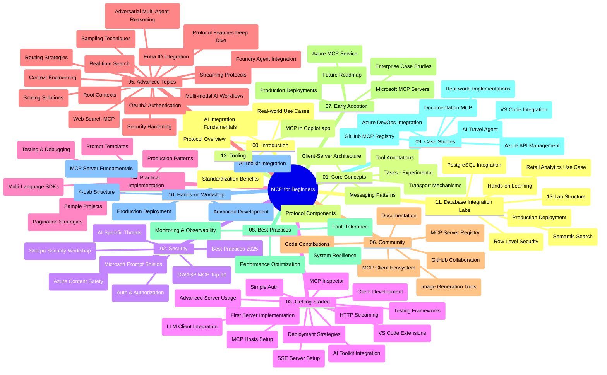

# Πρωτόκολλο Πλαισίου Μοντέλου (MCP) για Αρχάριους - Οδηγός Μελέτης

Αυτός ο οδηγός μελέτης παρέχει μια επισκόπηση της δομής και του περιεχομένου του αποθετηρίου για το εκπαιδευτικό πρόγραμμα "Πρωτόκολλο Πλαισίου Μοντέλου (MCP) για Αρχάριους". Χρησιμοποιήστε αυτόν τον οδηγό για να πλοηγηθείτε αποτελεσματικά στο αποθετήριο και να αξιοποιήσετε τα διαθέσιμα εργαλεία στο έπακρο.

## Επισκόπηση Αποθετηρίου

Το Πρωτόκολλο Πλαισίου Μοντέλου (MCP) είναι ένα τυποποιημένο πλαίσιο για αλληλεπιδράσεις μεταξύ μοντέλων τεχνητής νοημοσύνης και πελατειακών εφαρμογών. Αρχικά δημιουργήθηκε από την Anthropic, το MCP τώρα συντηρείται από την ευρύτερη κοινότητα MCP μέσω της επίσημης οργάνωσης στο GitHub. Αυτό το αποθετήριο παρέχει ένα ολοκληρωμένο εκπαιδευτικό πρόγραμμα με πρακτικά παραδείγματα κώδικα σε C#, Java, JavaScript, Python και TypeScript, σχεδιασμένο για προγραμματιστές τεχνητής νοημοσύνης, αρχιτέκτονες συστημάτων και μηχανικούς λογισμικού.

## Οπτικός Χάρτης Εκπαιδευτικού Προγράμματος

## Δομή Αποθετηρίου

Το αποθετήριο οργανώνεται σε δώδεκα κύριες ενότητες, καθεμία εστιάζοντας σε διαφορετικές πτυχές του MCP:

1. **Εισαγωγή (00-Introduction/)**
   - Επισκόπηση του Πρωτοκόλλου Πλαισίου Μοντέλου
   - Γιατί η τυποποίηση είναι σημαντική στους αγωγούς τεχνητής νοημοσύνης
   - Πρακτικά παραδείγματα χρήσης και οφέλη

2. **Βασικές Έννοιες (01-CoreConcepts/)**
   - Αρχιτεκτονική πελάτη-εξυπηρετητή
   - Κύρια στοιχεία πρωτοκόλλου
   - Πρότυπα μηνυμάτων στο MCP
   - Προοπτικές: [Τι Αλλάζει στο MCP: Η Έκδοση Υποψηφίου 2026-07-28](./01-CoreConcepts/mcp-2026-07-28-release-candidate.md) — ο άκαρπος πυρήνας πρωτοκόλλου, το πλαίσιο επεκτάσεων, και οι αποσυρμένοι Ρίζες/Δειγματοληψία/Καταγραφή που αναμένονται στην επόμενη έκδοση προδιαγραφών

3. **Ασφάλεια (02-Security/)**
   - Απειλές ασφάλειας σε συστήματα βασισμένα σε MCP
   - Βέλτιστες πρακτικές για την ασφάλεια των υλοποιήσεων
   - Στρατηγικές πιστοποίησης και εξουσιοδότησης
   - **Ολοκληρωμένη Τεκμηρίωση Ασφάλειας**:
     - Βέλτιστες Πρακτικές Ασφάλειας MCP 2025
     - Οδηγός Εφαρμογής Azure Content Safety
     - Έλεγχοι και Τεχνικές Ασφάλειας MCP
     - Γρήγορη Αναφορά Βέλτιστων Πρακτικών MCP
   - **Κύρια Θέματα Ασφάλειας**:
     - Επιθέσεις ένθεσης προτροπής και δηλητηρίασης εργαλείων
     - Επιθέσεις καταλήψεων συνεδρίας και προβλήματα συγκεχυμένου αντιπροσώπου
     - Ευπάθειες παράκαμψης διακριτικών
     - Υπερβολικά δικαιώματα και έλεγχος πρόσβασης
     - Ασφάλεια αλυσίδας εφοδιασμού για συστατικά ΤΝ
     - Ενσωμάτωση Microsoft Prompt Shields

4. **Εισαγωγή (03-GettingStarted/)**
   - Ρύθμιση και παραμετροποίηση περιβάλλοντος
   - Δημιουργία βασικών MCP εξυπηρετητών και πελατών
   - Ενσωμάτωση με υπάρχουσες εφαρμογές
   - Περιλαμβάνει ενότητες για:
     - Πρώτη υλοποίηση εξυπηρετητή
     - Ανάπτυξη πελάτη
     - Ενσωμάτωση πελάτη LLM
     - Ενσωμάτωση VS Code
     - Εξυπηρετητής Server-Sent Events (SSE)
     - Προχωρημένη χρήση εξυπηρετητή
     - Ροή μέσω HTTP
     - Ενσωμάτωση AI Toolkit
     - Στρατηγικές δοκιμών
     - Οδηγίες ανάπτυξης

5. **Πρακτική Υλοποίηση (04-PracticalImplementation/)**
   - Χρήση SDK σε διάφορες γλώσσες προγραμματισμού
   - Τεχνικές αποσφαλμάτωσης, δοκιμών και επαλήθευσης
   - Δημιουργία επαναχρησιμοποιήσιμων προτύπων προτροπής και ροών εργασίας
   - Παραδείγματα έργων με υλοποιήσεις

6. **Προχωρημένα Θέματα (05-AdvancedTopics/)**
   - Τεχνικές μηχανικής πλαισίου
   - Ενσωμάτωση πράκτορα Foundry
   - Πολυμορφικές ροές εργασίας AI
   - Επίδειξη πιστοποίησης OAuth2
   - Δυνατότητες αναζήτησης σε πραγματικό χρόνο
   - Ροές σε πραγματικό χρόνο
   - Υλοποίηση ριζικών πλαισίων
   - Στρατηγικές δρομολόγησης
   - Τεχνικές δειγματοληψίας
   - Προσεγγίσεις κλιμάκωσης
   - Θέματα ασφάλειας
   - Ενσωμάτωση ασφάλειας Entra ID
   - Ενσωμάτωση διαδικτυακής αναζήτησης
   - Αντιπαραβατικός συλλογισμός πολλαπλών πρακτόρων (πρότυπα αντιπαράθεσης)

7. **Συνεισφορές Κοινότητας (06-CommunityContributions/)**
   - Πώς να συνεισφέρετε κώδικα και τεκμηρίωση
   - Συνεργασία μέσω GitHub
   - Βελτιώσεις και ανατροφοδότηση με καθοδήγηση από την κοινότητα
   - Χρήση διαφόρων πελατών MCP (Claude Desktop, Cline, VSCode)
   - Εργασία με δημοφιλείς MCP εξυπηρετητές συμπεριλαμβανομένης δημιουργίας εικόνας

8. **Μαθήματα από Πρώιμη Υιοθέτηση (07-LessonsfromEarlyAdoption/)**
   - Πραγματικές υλοποιήσεις και ιστορίες επιτυχίας
   - Δημιουργία και ανάπτυξη λύσεων βασισμένων σε MCP
   - Τάσεις και μελλοντικός οδικός χάρτης
   - **Οδηγός Microsoft MCP Servers**: Ολοκληρωμένος οδηγός για 10 έτοιμους προς παραγωγή Microsoft MCP εξυπηρετητές περιλαμβάνοντες:
     - Microsoft Learn Docs MCP Server
     - Azure MCP Server (15+ εξειδικευμένοι συνδέσμοι)
     - GitHub MCP Server
     - Azure DevOps MCP Server
     - MarkItDown MCP Server
     - SQL Server MCP Server
     - Playwright MCP Server
     - Dev Box MCP Server
     - Microsoft Foundry MCP Server
     - Microsoft 365 Agents Toolkit MCP Server

9. **Βέλτιστες Πρακτικές (08-BestPractices/)**
   - Βελτιστοποίηση και ρύθμιση απόδοσης
   - Σχεδιασμός συστημάτων MCP ανθεκτικών σε σφάλματα
   - Στρατηγικές δοκιμών και ανθεκτικότητας

10. **Μελέτες Περιπτώσεων (09-CaseStudy/)**
    - **Επτά ολοκληρωμένες μελέτες περιπτώσεων** που επιδεικνύουν την ευελιξία του MCP σε διάφορα σενάρια:
    - **Πράκτορες Ταξιδιών Azure AI**: Πολυ-πράκτορική ορχήστρωση με Azure OpenAI και AI Search
    - **Ενσωμάτωση Azure DevOps**: Αυτοματισμός ροών εργασίας με ενημερώσεις δεδομένων YouTube
    - **Ενημέρωση Τεκμηρίωσης σε Πραγματικό Χρόνο**: Πελάτης κονσόλας Python με ροή HTTP
    - **Διαδραστικός Γεννήτορας Σχεδίου Μελέτης**: Εφαρμογή ιστού Chainlit με συνομιλητική ΤΝ
    - **Τεκμηρίωση μέσα στον Επεξεργαστή**: Ενσωμάτωση VS Code με ροές εργασίας GitHub Copilot
    - **Διαχείριση API Azure**: Επιχειρηματική ενσωμάτωση API με δημιουργία MCP εξυπηρετητή
    - **Κατάλογος MCP GitHub**: Ανάπτυξη οικοσυστήματος και πλατφόρμας πράκτορα
    - Παραδείγματα υλοποίησης που καλύπτουν επιχειρηματική ενσωμάτωση, παραγωγικότητα προγραμματιστών, και ανάπτυξη οικοσυστήματος

11. **Πρακτικό Εργαστήριο (10-StreamliningAIWorkflowsBuildingAnMCPServerWithAIToolkit/)**
    - Ολοκληρωμένο πρακτικό εργαστήριο που συνδυάζει MCP με AI Toolkit
    - Δημιουργία έξυπνων εφαρμογών που γεφυρώνουν μοντέλα AI με εργαλεία πραγματικού κόσμου
    - Πρακτικές ενότητες που καλύπτουν θεμελιώδεις αρχές, προσαρμοσμένη ανάπτυξη εξυπηρετητή, και στρατηγικές παραγωγής
    - **Δομή Εργαστηρίου**:
      - Εργαστήριο 1: Βασικά MCP Server
      - Εργαστήριο 2: Προχωρημένη Ανάπτυξη MCP Server
      - Εργαστήριο 3: Ενσωμάτωση AI Toolkit
      - Εργαστήριο 4: Παραγωγική Ανάπτυξη και Κλιμάκωση
    - Μαθησιακή προσέγγιση με εργαστηριακά βήματα

12. **Εργαστήρια Ενσωμάτωσης Βάσεων Δεδομένων MCP Server (11-MCPServerHandsOnLabs/)**
    - **Ολοκληρωμένη διαδρομή μάθησης με 13 εργαστήρια** για κατασκευή MCP servers έτοιμων για παραγωγή με ενσωμάτωση PostgreSQL
    - **Υλοποίηση λιανικών αναλυτικών σε πραγματικό κόσμο** με την περίπτωση χρήσης Zava Retail
    - **Πρότυπα επιπέδου επιχείρησης** που περιλαμβάνουν Έλεγχο Επιπέδου Γραμμής (RLS), σημασιολογική αναζήτηση και πολυ-ενοικιαζόμενη πρόσβαση δεδομένων
    - **Πλήρης Δομή Εργαστηρίου**:
      - **Εργαστήρια 00-03: Βάσεις** - Εισαγωγή, Αρχιτεκτονική, Ασφάλεια, Ρύθμιση Περιβάλλοντος
      - **Εργαστήρια 04-06: Κατασκευή MCP Server** - Σχεδιασμός Βάσης Δεδομένων, Υλοποίηση MCP Server, Ανάπτυξη Εργαλείων
      - **Εργαστήρια 07-09: Προχωρημένα Χαρακτηριστικά** - Σημασιολογική Αναζήτηση, Δοκιμές & Αποσφαλμάτωση, Ενσωμάτωση VS Code

      - **Εργαστήρια 10-12: Παραγωγή & Καλές Πρακτικές** - Ανάπτυξη, Παρακολούθηση, Βελτιστοποίηση
    - **Τεχνολογίες που καλύπτονται**: Πλαίσιο FastMCP, PostgreSQL, Azure OpenAI, Azure Container Apps, Application Insights
    - **Αποτελέσματα Μάθησης**: Διακομιστές MCP έτοιμοι για παραγωγή, πρότυπα ενσωμάτωσης βάσεων δεδομένων, αναλυτικά στοιχεία με AI, ασφάλεια επιχειρήσεων

13. **Εργαλεία (12-tooling/)**
    - Μάθετε πώς να χρησιμοποιείτε το MCP στην εφαρμογή Copilot και άλλα εργαλεία

## Πρόσθετοι Πόροι

Το αποθετήριο περιλαμβάνει υποστηρικτικούς πόρους:

- **Φάκελος Εικόνων**: Περιέχει διαγράμματα και απεικονίσεις που χρησιμοποιούνται σε όλο το πρόγραμμα σπουδών
- **Μεταφράσεις**: Υποστήριξη πολλαπλών γλωσσών με αυτόματες μεταφράσεις της τεκμηρίωσης
- **Επίσημοι Πόροι MCP**:
  - [MCP Documentation](https://modelcontextprotocol.io/)
  - [MCP Specification](https://spec.modelcontextprotocol.io/)
  - [MCP GitHub Repository](https://github.com/modelcontextprotocol)

## Πώς να Χρησιμοποιήσετε Αυτό το Αποθετήριο

1. **Συνεχής Μάθηση**: Ακολουθήστε τα κεφάλαια με τη σειρά (00 έως 11) για μια δομημένη εμπειρία μάθησης.
2. **Εστίαση σε Συγκεκριμένη Γλώσσα**: Εάν σας ενδιαφέρει μια συγκεκριμένη γλώσσα προγραμματισμού, εξερευνήστε τους καταλόγους παραδειγμάτων για υλοποιήσεις στη γλώσσα της επιλογής σας.
3. **Πρακτική Υλοποίηση**: Ξεκινήστε με το τμήμα "Ξεκινώντας" για να ρυθμίσετε το περιβάλλον σας και να δημιουργήσετε τον πρώτο σας διακομιστή και πελάτη MCP.
4. **Προχωρημένη Εξερεύνηση**: Αφού εξοικειωθείτε με τα βασικά, εξερευνήστε τα προχωρημένα θέματα για να διευρύνετε τις γνώσεις σας.
5. **Συμμετοχή στην Κοινότητα**: Ενταχθείτε στην κοινότητα MCP μέσω συζητήσεων στο GitHub και καναλιών Discord για να συνδεθείτε με εμπειρογνώμονες και άλλους προγραμματιστές.

## Πελάτες και Εργαλεία MCP

Το πρόγραμμα σπουδών καλύπτει διάφορους πελάτες και εργαλεία MCP:

1. **Επίσημοι Πελάτες**:
   - Visual Studio Code 
   - MCP στο Visual Studio Code
   - Claude Desktop
   - Claude στο VSCode 
   - Claude API

2. **Πελάτες της Κοινότητας**:
   - Cline (βασισμένο σε τερματικό)
   - Cursor (επεξεργαστής κώδικα)
   - ChatMCP
   - Windsurf

3. **Εργαλεία Διαχείρισης MCP**:
   - MCP CLI
   - MCP Manager
   - MCP Linker
   - MCP Router

## Δημοφιλείς Διακομιστές MCP

Το αποθετήριο παρουσιάζει διάφορους διακομιστές MCP, όπως:

1. **Επίσημοι Διακομιστές Microsoft MCP**:
   - Microsoft Learn Docs MCP Server
   - Azure MCP Server (πάνω από 15 εξειδικευμένοι συνδέσμοι)
   - GitHub MCP Server
   - Azure DevOps MCP Server
   - MarkItDown MCP Server
   - SQL Server MCP Server
   - Playwright MCP Server
   - Dev Box MCP Server
   - Microsoft Foundry MCP Server
   - Microsoft 365 Agents Toolkit MCP Server

2. **Επίσημοι Διακομιστές Αναφοράς**:
   - Filesystem
   - Fetch
   - Memory
   - Sequential Thinking

3. **Δημιουργία Εικόνων**:
   - Azure OpenAI DALL-E 3
   - Stable Diffusion WebUI
   - Replicate

4. **Εργαλεία Ανάπτυξης**:
   - Git MCP
   - Terminal Control
   - Code Assistant

5. **Εξειδικευμένοι Διακομιστές**:
   - Salesforce
   - Microsoft Teams
   - Jira & Confluence

## Συνεισφορά

Αυτό το αποθετήριο καλωσορίζει συνεισφορές από την κοινότητα. Δείτε την ενότητα Συνεισφορές Κοινότητας για καθοδήγηση σχετικά με το πώς να συνεισφέρετε αποτελεσματικά στο οικοσύστημα MCP.

----

*Αυτός ο οδηγός σπουδών ενημερώθηκε τελευταία φορά στις 5 Φεβρουαρίου 2026, αντανακλώντας την τελευταία Προδιαγραφή MCP 2025-11-25 και παρέχει μια επισκόπηση του αποθετηρίου έως αυτή την ημερομηνία. Το περιεχόμενο του αποθετηρίου ενδέχεται να ενημερώνεται μετά από αυτή την ημερομηνία.*

*Προσθήκη (2 Ιουλίου 2026): προστέθηκε μάθημα για την υποψήφια έκδοση Προδιαγραφής MCP `2026-07-28` στην [01-CoreConcepts](./01-CoreConcepts/mcp-2026-07-28-release-candidate.md); η βασική γραμμή του προγράμματος σπουδών παραμένει 2025-11-25 έως ότου κυκλοφορήσει η νέα προδιαγραφή.*

---

<!-- CO-OP TRANSLATOR DISCLAIMER START -->
**Αποποίηση ευθυνών**:
Αυτό το έγγραφο έχει μεταφραστεί χρησιμοποιώντας την υπηρεσία μετάφρασης με τεχνητή νοημοσύνη [Co-op Translator](https://github.com/Azure/co-op-translator). Ενώ επιδιώκουμε την ακρίβεια, παρακαλούμε να έχετε υπόψη ότι οι αυτοματοποιημένες μεταφράσεις ενδέχεται να περιέχουν λάθη ή ανακρίβειες. Το πρωτότυπο έγγραφο στη μητρική του γλώσσα πρέπει να θεωρείται η αυθεντική πηγή. Για κρίσιμες πληροφορίες, συνιστάται επαγγελματική ανθρώπινη μετάφραση. Δεν φέρουμε ευθύνη για τυχόν παρεξηγήσεις ή λανθασμένες ερμηνείες που προκύπτουν από τη χρήση αυτής της μετάφρασης.
<!-- CO-OP TRANSLATOR DISCLAIMER END -->