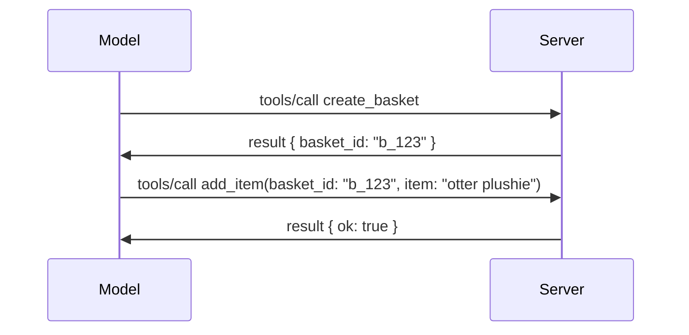

# What's Changing in MCP: The 2026-07-28 Release Candidate

> **Status:** Release Candidate. The `2026-07-28` specification is not final at the time of writing. It was announced May 21, 2026, and is scheduled to ship July 28, 2026. Everything in this lesson describes the release candidate; check the [draft specification](https://modelcontextprotocol.io/specification/draft) and its [changelog](https://modelcontextprotocol.io/specification/draft/changelog) for the latest status before you build against it. The rest of this curriculum is written against the current stable release, **MCP Specification 2025-11-25**, and will be updated once `2026-07-28` ships.

## Overview

`2026-07-28` is the largest revision of MCP since it launched. Six Specification Enhancement Proposals (SEPs) remove protocol-level sessions and make MCP stateless at the transport layer, extensions become a first-class, versioned mechanism, and several features you've learned earlier in this curriculum (Roots, Sampling, Logging) are marked deprecated under a new lifecycle policy. This lesson summarizes what's changing, why it matters, and what it means for the code you've already written against `2025-11-25`.

Source: [The 2026-07-28 MCP Specification Release Candidate](https://blog.modelcontextprotocol.io/posts/2026-07-28-release-candidate/) (Model Context Protocol Blog, David Soria Parra and Den Delimarsky).

## Learning Objectives

By the end of this lesson, you will be able to:

- Explain why MCP is moving to a stateless protocol core and what problem it solves for horizontally scaled deployments.
- Describe how the `initialize`/`initialized` handshake and `Mcp-Session-Id` header are replaced.
- Identify the new `Mcp-Method` and `Mcp-Name` headers and the `ttlMs`/`cacheScope` caching metadata.
- Recognize the Extensions framework and the two extensions shipping with this release: MCP Apps and Tasks.
- List the six authorization SEPs that harden OAuth 2.0 / OIDC alignment.
- Identify which core features (Roots, Sampling, Logging) are now deprecated, and what that means in practice.
- Explain the Full JSON Schema 2020-12 change for tool `inputSchema`/`outputSchema`.

## A Stateless Protocol

The headline change: MCP becomes stateless at the protocol layer.

### Before (2025-11-25): sessions pin you to one server instance

Calling a tool over Streamable HTTP starts with an `initialize` handshake. The server responds with an `Mcp-Session-Id` header that every subsequent request must carry:

```http
POST /mcp HTTP/1.1
Mcp-Session-Id: 1868a90c-3a3f-4f5b
Content-Type: application/json

{"jsonrpc":"2.0","id":2,"method":"tools/call",
 "params":{"name":"search","arguments":{"q":"otters"}}}
```

Because the session is bound to whichever server instance issued it, horizontally scaled deployments need **sticky routing** at the load balancer and a **shared session store** across instances.

### After (2026-07-28): every request is self-contained

```http
POST /mcp HTTP/1.1
MCP-Protocol-Version: 2026-07-28
Mcp-Method: tools/call
Mcp-Name: search
Content-Type: application/json

{"jsonrpc":"2.0","id":1,"method":"tools/call",
 "params":{"name":"search","arguments":{"q":"otters"},
           "_meta":{"io.modelcontextprotocol/clientInfo":{"name":"my-app","version":"1.0"}}}}
```

Any server instance can handle this request. Key changes:

- **The `initialize`/`initialized` handshake is removed** ([SEP-2575](https://github.com/modelcontextprotocol/modelcontextprotocol/pull/2575)). Protocol version, client info, and client capabilities move into `_meta` on every request. A new `server/discover` method lets a client fetch server capabilities up front when it needs them.
- **The `Mcp-Session-Id` header and protocol-level session are removed** ([SEP-2567](https://github.com/modelcontextprotocol/modelcontextprotocol/pull/2567)). Sticky routing and shared session stores are no longer required at the protocol layer.

### Stateless protocol, stateful applications

Removing the protocol-level session doesn't mean your server can't be stateful. The recommended pattern is the same one HTTP APIs have always used: mint an explicit handle (a `basket_id`, a `browser_id`) from one tool call, and have the model pass that handle back as an ordinary argument on later calls.



This makes state visible and reasonable to the model instead of hiding it in transport metadata, and it lets any server instance handle any call.

### Server-to-client requests, restructured

A stateless protocol still needs a way for a server to ask the client for something mid-call (for example, an elicitation prompt):

- **Server-initiated requests may only be issued while the server is actively processing a client request** ([SEP-2260](https://github.com/modelcontextprotocol/modelcontextprotocol/pull/2260)) — previously a recommendation, now required. A user is never prompted out of nowhere.
- **Multi Round-Trip Requests** ([SEP-2322](https://github.com/modelcontextprotocol/modelcontextprotocol/pull/2322)) replace holding an SSE stream open. Instead, the server returns an `InputRequiredResult`:

  ```json
  {
    "resultType": "inputRequired",
    "inputRequests": {
      "confirm": {
        "type": "elicitation",
        "message": "Delete 3 files?",
        "schema": { "type": "boolean" }
      }
    },
    "requestState": "eyJzdGVwIjoxLCJmaWxlcyI6WyJhIiwiYiIsImMiXX0="
  }
  ```

  The client collects the answers and re-issues the original call with `inputResponses` plus the echoed `requestState`. Any server instance can pick up the retry because everything needed is in the payload.

### Routable, cacheable, traceable

Three smaller changes make stateless traffic easier to operate:

- **`Mcp-Method` and `Mcp-Name` headers are required on Streamable HTTP** ([SEP-2243](https://github.com/modelcontextprotocol/modelcontextprotocol/pull/2243)), so load balancers, gateways, and rate limiters can route on the operation without inspecting the JSON body. Servers reject requests where headers and body disagree.
- **`tools/list` and resource read results carry `ttlMs` and `cacheScope`** ([SEP-2549](https://github.com/modelcontextprotocol/modelcontextprotocol/pull/2549)), modeled on HTTP `Cache-Control`. Clients know how long a list result is fresh and whether it's safe to share across users, without needing a long-lived SSE stream to learn about changes.
- **W3C Trace Context propagation in `_meta` is documented** ([SEP-414](https://github.com/modelcontextprotocol/modelcontextprotocol/pull/414)), fixing the `traceparent`, `tracestate`, and `baggage` key names so a distributed trace can follow a call across the client SDK, the MCP server, and downstream systems in an [OpenTelemetry](https://opentelemetry.io/)-compatible backend.

## Extensions Become First-Class

Extensions existed informally in `2025-11-25`. [SEP-2133](https://github.com/modelcontextprotocol/modelcontextprotocol/pull/2133) formalizes them:

- Extensions are identified by reverse-DNS IDs.
- They're negotiated through an `extensions` map on client and server capabilities.
- They live in their own `ext-*` repositories with delegated maintainers and version independently of the core specification.
- A new Extensions Track in the SEP process gives them a path from experimental to official.

This release ships two official extensions.

### MCP Apps: server-rendered user interfaces

[MCP Apps](https://blog.modelcontextprotocol.io/posts/2026-01-26-mcp-apps/) ([SEP-1865](https://github.com/modelcontextprotocol/modelcontextprotocol/pull/1865)) lets servers ship interactive HTML interfaces that hosts render in a sandboxed iframe. Tools declare their UI templates ahead of time so hosts can prefetch, cache, and security-review them before anything runs. You already covered the fundamentals of this in [Lesson 15: MCP Apps](../03-GettingStarted/15-mcp-apps/README.md) — under the Extensions framework, MCP Apps is now formally an extension rather than an experimental core feature.

### Tasks graduates to an extension

Tasks shipped as an experimental core feature in `2025-11-25`. Production use surfaced enough redesign that the right home for it is an extension: the [Tasks extension](https://github.com/modelcontextprotocol/modelcontextprotocol/pull/2663) reshapes the lifecycle around the stateless model — a server can answer `tools/call` with a task handle, and the client drives it forward with `tasks/get`, `tasks/update`, and `tasks/cancel`. Task creation is server-directed: the client advertises the extension, and the server decides when a call should run as a task. `tasks/list` is removed entirely because it can't be scoped safely without sessions.

> **Migration note:** if you implemented the experimental `2025-11-25` Tasks API, you'll need to migrate to the new extension lifecycle — it is not backward compatible.

## Authorization Hardening

Six SEPs harden the [authorization specification](https://modelcontextprotocol.io/specification/draft/basic/authorization) to align more closely with real-world OAuth 2.0 / OpenID Connect deployments:

| SEP | Change |
|---|---|
| [SEP-2468](https://github.com/modelcontextprotocol/modelcontextprotocol/pull/2468) | Clients must validate the `iss` parameter on authorization responses per [RFC 9207](https://www.rfc-editor.org/rfc/rfc9207), mitigating mix-up attacks common in MCP's single-client, many-server pattern. A future version will require rejecting responses missing `iss`. |
| [SEP-837](https://github.com/modelcontextprotocol/modelcontextprotocol/pull/837) | Clients declare their OpenID Connect `application_type` during Dynamic Client Registration, avoiding authorization servers defaulting a desktop/CLI client to `"web"` and rejecting its localhost redirect URI. |
| [SEP-2352](https://github.com/modelcontextprotocol/modelcontextprotocol/pull/2352) | Clients bind registered credentials to the issuing authorization server's `issuer` and re-register when a resource migrates between authorization servers. |
| [SEP-2207](https://github.com/modelcontextprotocol/modelcontextprotocol/pull/2207) | Documents how to request refresh tokens from OpenID Connect-style authorization servers. |
| [SEP-2350](https://github.com/modelcontextprotocol/modelcontextprotocol/pull/2350) | Clarifies scope accumulation during step-up authorization. |
| [SEP-2351](https://github.com/modelcontextprotocol/modelcontextprotocol/pull/2351) | Clarifies the `.well-known` discovery suffix. |

If you're building an authorization server for MCP today, start supplying `iss` on authorization responses now — see [02-Security](../02-Security/README.md) for the current authorization guidance this will build on.

## Roots, Sampling, and Logging Are Deprecated

Under the new [feature lifecycle policy](https://github.com/modelcontextprotocol/modelcontextprotocol/pull/2577) ([SEP-2577](https://github.com/modelcontextprotocol/modelcontextprotocol/pull/2577)), three core client primitives you learned about in [Core Concepts](./README.md#roots) move to **Deprecated** status:

| Feature | Recommended replacement |
|---|---|
| Roots | Tool parameters, resource URIs, or server configuration |
| Sampling | Direct integration with LLM provider APIs |
| Logging | `stderr` for stdio transports; OpenTelemetry for structured observability |

These are **annotation-only deprecations**: the methods, types, and capability flags keep working in this release and in every specification version published within a year of it. Removing any of them outright will require a separate SEP under the lifecycle policy — so nothing breaks in your existing [Sampling](../03-GettingStarted/14-sampling/README.md) samples today, but new servers should prefer the replacement patterns above.

## Full JSON Schema 2020-12 for Tools

Tool `inputSchema` and `outputSchema` are lifted to full [JSON Schema 2020-12](https://json-schema.org/draft/2020-12) ([SEP-2106](https://github.com/modelcontextprotocol/modelcontextprotocol/pull/2106)):

- Input schemas keep the `type: "object"` root constraint but now allow composition (`oneOf`, `anyOf`, `allOf`), conditionals, and references (`$ref`, `$defs`).
- Output schemas are unrestricted, and `structuredContent` can now be any JSON value rather than only an object.
- Implementations must not auto-dereference external `$ref` URIs and should bound schema depth and validation time (a denial-of-service consideration to account for if you validate schemas server-side).

Separately, the error code for a missing resource changes from the MCP-custom `-32002` to the JSON-RPC standard `-32602` (Invalid Params) ([SEP-2164](https://github.com/modelcontextprotocol/modelcontextprotocol/pull/2164)). If your client matches on the literal `-32002` value, you'll need to update it.

## How the Protocol Evolves From Here

This release contains breaking changes, which the MCP maintainers don't intend to be the norm going forward. Three governance SEPs aim to prevent a repeat:

- The **feature lifecycle policy** gives every feature an Active → Deprecated → Removed path with at least twelve months between deprecation and the earliest possible removal.
- The **Extensions framework** lets new capabilities ship as opt-in extensions and stabilize there before (if ever) moving into the core specification.

- A Standards Track SEP can no longer reach Final status until a matching scenario lands in the [conformance suite](https://github.com/modelcontextprotocol/conformance) ([SEP-2484](https://github.com/modelcontextprotocol/modelcontextprotocol/pull/2484)) — the same suite the [SDK tier system](https://github.com/modelcontextprotocol/modelcontextprotocol/pull/1777) scores official SDKs against.

## Release Timeline and Validation

- The release candidate was locked May 21, 2026.
- The final specification is scheduled for July 28, 2026.
- The ten-week window between the two lets SDK maintainers and client implementers validate the changes against real workloads; Tier 1 SDKs are expected to ship support within this window under the [SDK tier system](https://modelcontextprotocol.io/docs/sdk).
- Track the full set of changes in the [draft specification](https://modelcontextprotocol.io/specification/draft) and its [changelog](https://modelcontextprotocol.io/specification/draft/changelog).

## What This Means for This Curriculum

Everything you've learned so far in this course targets **2025-11-25**, which remains the current stable specification until `2026-07-28` ships. Concretely:

- **Sessions and the `initialize` handshake** (covered in [Core Concepts](./README.md) and [Lesson 6: HTTP Streaming](../03-GettingStarted/06-http-streaming/README.md)) still work as documented today, but expect them to be replaced by the stateless request model above once you upgrade to `2026-07-28`-compatible SDKs.
- **Sampling and Roots** (also covered in [Core Concepts](./README.md)) remain fully functional but are deprecated — new designs should prefer the replacement patterns listed above.
- **The experimental Tasks feature**, if you've used it, will need migrating to the Tasks extension's new lifecycle.
- **MCP Apps** ([Lesson 15](../03-GettingStarted/15-mcp-apps/README.md)) is unaffected in practice; it simply moves under the formal Extensions framework.

## Additional Resources

- [The 2026-07-28 MCP Specification Release Candidate (blog post)](https://blog.modelcontextprotocol.io/posts/2026-07-28-release-candidate/)
- [The Future of MCP Transports](https://blog.modelcontextprotocol.io/posts/2025-12-19-mcp-transport-future/)
- [MCP Draft Specification](https://modelcontextprotocol.io/specification/draft)
- [MCP Draft Changelog](https://modelcontextprotocol.io/specification/draft/changelog)
- [SEP Guidelines](https://modelcontextprotocol.io/community/sep-guidelines)
- [MCP SDK Tier System](https://modelcontextprotocol.io/docs/sdk)

## Next Steps

Head back to [Core Concepts](./README.md) or continue to [Security](../02-Security/README.md) to see how today's `2025-11-25` guidance maps onto what's coming.

---

<!-- CO-OP TRANSLATOR DISCLAIMER START -->
**Disclaimer**:
This document has been translated using AI translation service [Co-op Translator](https://github.com/Azure/co-op-translator). While we strive for accuracy, please be aware that automated translations may contain errors or inaccuracies. The original document in its native language should be considered the authoritative source. For critical information, professional human translation is recommended. We are not liable for any misunderstandings or misinterpretations arising from the use of this translation.
<!-- CO-OP TRANSLATOR DISCLAIMER END -->